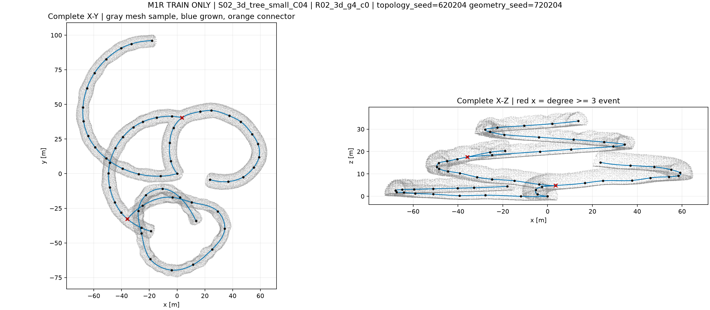
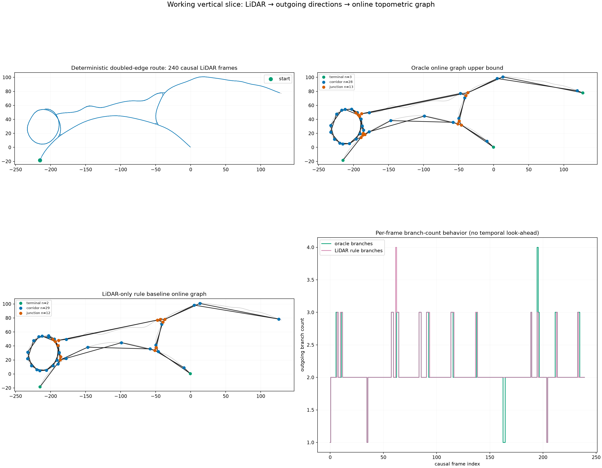

# 当前方法技术复盘与教学讲解

复盘日期：2026-09-08。对象：当前仓库代码、已封存实验的元数据与重点结果、现有回归测试。本文不是新的执行计划，也不恢复训练。

**一句话结论：数据和公共特征已有实物，新结构模型和分段建图已有软件，但“面片关系改善建图”的核心实验还没有跑出来。最近阻碍不是新模型训练失败，而是训练答案只有正归属、缺少可观察负归属；最新修正在四个合成场景成立，尚未完成真实小批验证。**

全文标记：

- **已有实物**：存在实际数据、特征或历史运行结果。
- **软件验证**：代码在合成输入或接口测试中运行，不等于真实方法有效。
- **待验证**：有实现或计划，没有足够实验结果。
- **未接通**：组件存在，但当前端到端路径没有调用。
- **不能宣称**：现有证据不支持该结论。

本次只生成本文与 [代码导航](CODE_MAP.md)，不修改算法、标签、阈值、数据范围或旧结果。没有启动真实训练，没有重新读取 C08—C10 原始数据或检查点。历史实验清单来自运行元数据，不是对所有原始数据的重新审计。

## 1. 整个系统：两条离线支路汇合，一条在线输出链

~~~text
程序地图：拓扑构造 + 轴线 + 截面 + 实现后的三维几何
  ├─ 扫描支路：已记录传感器轨迹 → 射线求交 → 五帧距离图/有效掩码
  │                 → 相对运动对齐 → 原始XYZ + 冻结编码器公共特征
  │                                     ├─ A：直接观测
  │                                     ├─ B：加局部面片属性
  │                                     └─ C：再加面片邻接消息与关系
  │                                                ↓
  │                               锚点、开口、归属等查询输出
  │                                                ↓
  │                               已知位姿下短时跟踪/分段轨迹连接
  │
  └─ 教师支路：构造记录 + 同一批扫描/来源 + 位姿 → 部分参考标签
                                   └──── 只进入损失和独立评分
~~~

教师不是在线输入。拿真实节点编号替模型选候选，会绕过我们要研究的问题。拓扑图也不是面片近邻图：前者的边表示机器人走过的通道，后者的边只是网络交换信息的连接。

| 环节 | 输入 → 输出与格式 | 当前事实与风险 |
|---|---|---|
| 地图构造 | 种子、生成参数 → 节点/边、轴线、截面、组合记录；JSON、数组 | 有历史地图；仓库有多代生成器，不能把早期体素造图当成本批扫描的唯一来源 |
| 几何实现 | 轴线、超椭圆截面 → 有限扫掠体、三角网格和来源映射 | 本批基元数据消费封存的 realized construction；基元面片不是同一种表示 |
| 轨迹 | directed traversal 和弧长位置 → 传感器位置、yaw、帧索引 | 有离线穿越，不等于连续探索记录；不能按真实 edge ID 拼接成一次机器人行走 |
| 激光 | 传感器位姿 + 网格 → 16×720 距离、有效性、来源信息 | 有真实导出；扫描来源只能进教师，不进学生 |
| 五帧 | 同一段内当前及四帧历史 → 5×16×720 数组 | 相邻窗口共享帧，不能当独立地图；运动实现主要是 yaw + 平移 |
| 公共特征 | 五帧距离/运动 → 57,600 个点槽位与 900×128 上下文 | 6,036 个观察有缓存；这是旧编码器推理，不是新模型训练 |
| 教师 | 构造 + 原扫描 + 唯一来源证据 → 部分锚点/开口/三值归属 JSON | V6 补充人口只有正归属，V8 尚只验证合成场景 |
| 面片 | ROI 内有效 XYZ → 每个占用体素的 PCA 属性 | 软件可运行；退化面片保留，固定体素不保证旋转等变 |
| 关系 | 面片中心/法向 + 可选射线网格 → M×8×9 | 近邻不是通行连接；训练与推理的射线关系填充不一致 |
| 模型 | 原始观测与可选面片 → 32 锚点、64 开口查询 | A/B/C 实现且有合成测试，真实正式对照为零 |
| 图后端 | 预测 + 已记录位姿 + 执行开始凭据 → 节点、已穿越边、日志 | 有短时跟踪和分段连边；未接通配准回环，未形成连续真实图成绩 |
| 评分 | 预测 + 独立标签 + 固定阈值 → 检出/误差/图指标 | 存在不同匹配口径，尚不能直接统一排名；部分标签不支持完整检测 F1 |

逐项文件、函数、输入/输出和运行证据见 [CODE_MAP.md](CODE_MAP.md)。下面拆开解释每一步。

## 2. 数据集怎样生成：从一处 T 路口讲起

### 2.1 三种对象不要混淆

**拓扑构造**记录“哪几条通道在同一地方相接”；**几何实现**记录它们具体长什么样；**激光观测**只是机器人从某个位置实际看见的表面。

程序地图可以有同样的连接关系，但宽度、坡度、截面形状不同。这就是“父地图”和“几何变体”的区别。同父地图的三个变体不能拆到训练与评价两边，也不能计作三个独立地点。

早期 [tng.py](../src/mtare_topo/data/worldgen/tng.py) 的 generate_tng 按种子扩展节点、分支和边，检查候选间距；[tunnel_mesh.py](../src/mtare_topo/data/worldgen/tunnel_mesh.py) 是另一代体素并集网格实现。**当前基元序列加载器不从 world 文件重新猜拓扑**，而由 [load_p1a_realized_construction](../src/mtare_topo/data/primitive_relation_materialization.py) 读取已封存 JSON，核对基元顺序、双端和组合引用。因此不能拿早期生成器的默认宽度、坡度限制解释当前全部数据。

当前构造记录主要保存：

- base_construction：基元身份、端点和 composition_operations。
- realized_primitives：实际 centerline_xyz_m、endpoint_half_axes_m、endpoint_shape_exponent。
- member_endpoints：哪些端点属于同一组合节点；composition_anchor_xyz_m 与实际端点位置不一定相同。
- 每条样本的来源绑定：task、source_sequence_id、frame_rows、构造哈希等。

这些身份是数据管理和监督依据，不是网络特征。

### 2.2 最近真正复现过的 T 路口

实际合成脚本是 [check_gse_joint_producer_backend.py](../tests/v3/unit/check_gse_joint_producer_backend.py) 及 [check_gse_joint_lateral_v8.py](../tests/v3/unit/check_gse_joint_lateral_v8.py)。它不是画一张示意图代替真实扫描，而是建立扫掠体、网格并发射五帧激光。

最近失败场景的三条轴线为：

| 通道 | 起点 → 终点（米） | 含义 |
|---|---|---|
| 0 | (-1,0,0) → (15,0,0) | 正 X 延伸支路 |
| 1 | (1,0,0) → (-8,0,0) | 负 X 尽头支路 |
| 2 | (0,1,0) → (0,-15,0) | 负 Y 支路 |

截面半径 2 米，超椭圆指数 2 即圆形。构造路口在原点，但三个扫掠体有重叠，端面不恰好等于“实际路口开口”。合成网格轴向间隔 0.05 米、周向 64 段；**这是该测试的设置，不是已确认的全人口默认值**。

五帧传感器位于 x=-2.5、-3、-3.5、-4、-4.5 米，y=0、z=0.04，yaw=0。机器人已进入尽头支路，仍能看到侧面的负 Y 通道。分层反例把另一份结构放到 z+6 米；重合歧义反例使用偏移结构。不能因 XY 相近就认为同一路口。

### 2.3 从几何到三角形，再到激光回波

旧通道基元沿三维轴线扫掠截面。截面可以用 |u/a|^n + |v/b|^n = 1 描述：a、b 是半轴，n 改变圆/椭圆到近矩形的形状。沿轴线采样截面点，连接成三角面，形成有限长度表面。构造重叠使“某个操作体的虚拟端面”和“最终可见隧道表面”不同，这正是近期教师问题的来源。

[render_primitive_sensor_frame](../src/mtare_topo/data/primitive_relation_sensor_export.py) 消费可追溯的 raycaster。每帧有 16×720=11,520 个射线槽位，水平覆盖 360°；方向由传感器模型生成，按位姿变换后求与场景的首次有效交点。距离、valid mask 和可追溯来源分开保存。多来源或不能唯一判定时，不能强制给一个基元身份。

学生使用距离和有效掩码；教师还可以检查 hit/source、构造、参考轴线和传感器世界位姿。超过量程、无返回或无效回波不是地面可通行证明。旧扫描使用的 native mesh、基元操作体 mesh、独立动态碰撞资产不可混称一种网格。

更具体地，本批基元求交对应 [csg_mesh_provenance.py](../src/mtare_topo/teacher/csg_mesh_provenance.py) 的 mesh_swept_superellipse 和 CSGMeshProvenanceRaycaster.ray_exit_hits。前者沿轴线生成截面环、相邻环连接两个三角形、两端封帽。后者不是简单取所有操作体中最近的三角形：它从传感器所在的自由空间并集出发，用 Open3D list_intersections 列出交点，排序并更新操作体内外状态，再选择合格的并集离开表面；配置提供解析场时，还核查表面及其后方的距离条件和完整来源集。内部重叠面不能冒充隧道墙。面片教师的新“进入某个操作体”查询则发生在这次有效返回之前，两者目的不同。

传感器常量为垂直 -15° 到 +15°、间隔 2° 共16线，近界0.3米、最大50米。PrimitiveSensorFrame 保存 range_m(float32)、valid_mask(uint8)、primitive_membership_code(uint16)，均为16×720；codebook 映射到完整来源集合，0对应无效。每帧另记录 ambiguous_ray_count。JSON 管身份和配置，二进制数组/分片管大量扫描，不能把来源码作为学生输入。

### 2.4 轨迹与五帧

[enumerate_directed_traversals](../src/mtare_topo/data/gse_sequence_inventory.py) 保留边的两个方向；[world_unique_frame_poses](../src/mtare_topo/data/gse_sensor_export.py) 把路径位置组织为扫描位姿；[primitive_relation_sequences.py](../src/mtare_topo/data/primitive_relation_sequences.py) 形成因果历史。

“五帧”不是五个独立地点，是当前决策及其四个历史扫描。单个窗口有 57,600 个射线槽位，不代表 57,600 个有效且不同的点。一个真实联合读取实例有 56,752 个有效点，提取出 532 个面片。

当前运动对齐的核心为：

~~~text
t_rel = Rz(-yaw_current) × (position_past - position_current)
yaw_rel = wrap(yaw_past - yaw_current)
point_current = Rz(yaw_rel) × (range × ray_direction) + t_rel
~~~

这保留三维平移，但旋转主要是 yaw，并不是完整的 roll/pitch/yaw 运动补偿。不能把它直接描述为已经验证的崎岖地形完整六自由度配准。

### 2.5 6,036 到底是什么

| 分区 | 原始固定采样 | 补充结构采样 | 公共特征观察合计 | 独立父地图 |
|---|---:|---:|---:|---:|
| C01—C06 拟合 | 2,880 | 2,310 | 5,190 | 60 |
| C07 校准 | 240 | 189 | 429 | 5 |
| C07 开发评价 | 240 | 177 | 417 | 5 |
| 合计 | 3,360 | 2,676 | **6,036** | **70** |

原始采样是每父地图 16 条物理边、固定一个方向和五帧观察，乘三个几何变体。补充人口已按观察身份排除原集合，不是简单再复制一批相邻帧。两个特征集合身份交集为零，之后才完成补充缓存。

6,036 的单位是**五帧观察缓存**，不是地图数、结构实体数、独立连续路线数或训练成功样本数。不能用 6,036×5 直接声称唯一原始帧数；原帧去重必须看清单。补充导出记录 13,374 源帧，不能把它误写成 2,676×5 的无重叠帧数。

C07 已参与历史开发，只能称开发/校准。当前没有以 C08—C10 为本轮训练或选阈值数据。这里不重新宣称任何历史使用过的地图为“严格未见”。

### 2.6 已有图像如何使用

下面是既有地图资产的示例，**不是本轮面片模型的预测成绩**：

旧端到端原型展示可以说明“我们曾把扫描和图连起来”，不能作为新 C 组有效的证据：

## 3. 教师：怎样把地图真值变成当前能监督的答案

### 3.1 教师究竟是什么

教师不是另一个训练好的神经网络。它是一套离线规则算法：借助程序地图的构造记录，计算参考位置；再用同一五帧的真实射线证据判断当前是否支持这个参考。**知道地图有一个节点，不等于本次扫描看到了这个节点。**

输入分三类：

1. 几何参考：轴线、截面、基元实际双端、构造组合位置。
2. 观测：原始距离、valid、首次返回、来源、相对运动、世界位姿。
3. 绑定与配置：精确帧身份、哈希、原网格求交设置。

输出是部分目标 record：anchors、openings、membership、score_region。人工作业和科学资格另有标志；当前不能擅自把 human_reviewed 或 full_training_gate_eligible 置真。

### 3.2 锚点不是窗口开口

锚点是同一路口/尽头的固定构造参考位置，随传感器运动转换到当前坐标系；开口是局部窗口中的通道截面参考。

例如沿 T 路口走，10 米窗口与通道轴线的交点一直在变；固定路口中心不该跟着窗口边界移动。因此教师和模型都分开保存它们。**当前开口标签还是“有观测支持的构造窗口截面”，不是已经人工验证的天然洞口边界。** 宽高暂为 None，不能补固定数值。

[produce_opening_reference_targets](../src/mtare_topo/teacher/gse_reference_opening_targets_v1.py) 要求独占外向 crossing 和 surface return 支持；V3 还要求轴线参考归属。重复且重合的参考不能静默折叠。位置来自 construction_window_reference_not_observed_center_estimate，不是点云拟合出的唯一中心。

### 3.3 路口与尽头怎样产生

旧路口教师 V1/V2 基于同一构造节点的不同支路观察证据。至少三条不同向内支路支持才提出 junction 参考。V2 增加来源绑定的内部见证，但若传感器只在一个操作体内，该见证仍可能不足。

尽头由 [gse_reference_terminal_targets_v1.py](../src/mtare_topo/teacher/gse_reference_terminal_targets_v1.py) 使用唯一来源端帽首次返回支持构造 terminal 参考。看不到封闭端，就不能把裁剪边界当尽头。

这里的 junction、terminal 出现在教师来源解释中，**当前网络没有对应的三类事件分类头**。不能报告当前模型“路口/尽头/普通通道 macro-F1”，除非另有明确的事件输出和评分实现；本轮未发现这条完整接口。

### 3.4 归属为什么必须有 True、False、None

membership 的行是开口，列是锚点：

- True：当前证据支持这个开口属于该局部结构。
- False：有明确的局部不归属证据。
- None：不能判断，不进入这项损失。

它不是“这两个地方在整张地图里是否连通”。一个开口沿通道最终能到达另一路口，不代表它属于当前那个尽头。反之，不同基元 ID 可能只是同一物理通道的两段，不能据此判 False。

当前独立二元交叉熵允许多正归属。换 softmax 强迫每个开口只能归属一个节点，会把未知和多结构窗口变成错误答案。

### 3.5 已封存真实人口暴露了什么问题

补充 2,676 观察的 V6 目标统计：

| 内容 | 数量 | 正确解释 |
|---|---:|---|
| 锚点 | 1,609 | 出现次数，不是独立节点 |
| 开口 | 5,568 | 出现次数，不是独立通道 |
| 明确归属 True | 1,619 | 有效正关系 |
| 明确不归属 False | **0** | 没有反例 |
| 未知 None | 724 | 不应作为负例 |
| 多锚点观察 | 10，来自 3 个父地图 | 多结构区分人口很小 |

真实 BCE 回归表明：只有正例与未知时，恒定输出“都属于”可以让归属损失逼近零。测试中 logit=20 的该项 loss <3×10^-9；加入明确的一正一负后，同样输出的 loss >9.99，且正负梯度方向相反。

**所以不是网络学不会，而是这个目标尚不能检验网络会不会区分归属。** presence 的负样本不能代替 membership 的负样本，因为它们训练不同输出。

### 3.6 为什么不能按构造编号补负例

真实 10 个多锚点观察中，28 个来源不相接的候选里有 3 对经 degree-2 连续段仍属于同一结构方向。若按“来源 ID 不同/不 incident”直接标负，会把同一通道切分方式当语义。

[gse_reference_continuations_v1.py](../src/mtare_topo/teacher/gse_reference_continuations_v1.py) 与构造适配只在度为 2、实际双端精确相合时合并参考连续段；有偏移则保留未解。不把“不同参考分量”宣称为物理隔断。

### 3.7 最近 T 路口失败：眼睛看到了，旧规则却不承认

旧规则大量依赖射线穿过基元的虚拟端面。T 场景机器人已经处于尽头支路内，它看向负 Y 分支的射线从该扫掠体**侧面**进入，并不经过虚拟端面。

实际独立解析/网格求交核查：

- 负 Y 支路有 5,601 条有效、唯一来源返回。
- 这 5,601 条在首次返回前从侧面进入，旧端面进入证据为 0。
- 其中 5,590 个解析入口仍位于机器人所在尽头操作体内部。
- 完整三角面入口集合与独立解析的这 5,601 条射线一致。
- 遮挡和多来源歧义反例不产生确定入口。

这解释了旧 V7 的结果：0 个 junction、1 个 terminal、2 个 opening，归属均未知。算法缺少一类合法见证，并非扫描没有信息；也不能把“3 个支路才是路口”的标准直接降到 2。

### 3.8 最新修正到底改了什么

[gse_observed_operand_entries_v1.py](../src/mtare_topo/teacher/gse_observed_operand_entries_v1.py) 查询完整操作体表面入口，仍使用原 float32 射线、首次返回上界、ROI、唯一来源和法向方向保护。

[gse_lateral_branch_evidence_v1.py](../src/mtare_topo/teacher/gse_lateral_branch_evidence_v1.py) 把入口绑定到原扫描和构造：

1. 传感器属于唯一操作体。
2. 入口仍在该操作体内，进入的是另一操作体。
3. 这对来源只能解释到唯一共同构造节点。
4. 射线离开当前支路、进入目标支路的方向兼容。
5. 重合/多节点歧义继续未知，不强解。

anchor V3 接收这类证据；joint V8 再组合旧开口和尽头目标。**进入证据用于开口归属，离开证据用于尽头排除，不能混用。**

首个联合 V8 测试第二个负关系仍未知，原因是排除程序只读旧端面 departure。显式连接 surface_departure 字段后，四场景得到：

| 场景 | 结果 | 能说明什么 |
|---|---|---|
| 原失败 T | 两开口对 [路口,尽头] 均为 [True,False] | 同一反例修正成立 |
| 分层 T | 同样两正两负，只支持对应层 | 该例未因 XY 重合误合并 |
| 同通道 | 原 [True] 保持 | 没把所有不同来源都标负 |
| 重合歧义 | 保持未确定结构关系 | 没强行解除歧义 |

这是**实际合成网格/扫描测试**，比纯手填字典强，但仍不是 2,676 真实观察的 V8 成绩。生产器仍明确保留完整标签资格为 False。

### 3.9 最终标签长什么样

下面是**格式说明**，不是新增导出或伪造实验记录。用 J、T 表示当前坐标下的路口/尽头三维参考，O0、O1 表示两个开口参考；实际数组值由生产器给出，不由此例填写。

~~~python
record = {
    'schema': 'gse_surface_observed_targets_v1',
    'coordinate_frame': 'current_sensor_m',
    'source_frame_indices': original_five_frame_indices,
    'anchors': [
        {'position_m': J, 'evidence': junction_evidence},
        {'position_m': T, 'evidence': terminal_evidence}],
    'openings': [
        {'position_m': O0, 'direction': d0, 'width_m': None,
         'height_m': None, 'evidence': opening0_evidence},
        {'position_m': O1, 'direction': d1, 'width_m': None,
         'height_m': None, 'evidence': opening1_evidence}],
    'membership': [[True, False], [True, False]],
    'score_region': {'center_m': [0., 0., 0.], 'radius_m': 10.,
        'anchors_complete': False, 'openings_complete': False,
        'evidence': partial_region_evidence}}
~~~

该例经 observed_targets 后，anchor_position 为1×2×3，opening_position 为1×2×3，membership 为1×2×2，数值 [[1,0],[1,0]]、有效掩码全 True。若一项是 None，则对应值暂存0但有效掩码 False；尺寸有效掩码全 False。**0数值本身不等于负标签，必须与有效掩码一起看。** 模型仍输出32/64查询，损失把两个真实目标匹配到其中，不能拿教师位置缩减查询。

### 3.10 规则按用途分类；与创新分开

| 用户关心的规则类别 | 实际判据 | 作用与未验证边界 |
|---|---|---|
| A 可见性/观测支持 | valid首次返回之前、ROI内、原射线与来源绑定、遮挡保护、表面/crossing支持 | 防止隐藏地图信息假装当前可见；真实侧面入口全人口尚未验证 |
| B 几何对应 | 来源对唯一共同节点、入口在当前操作体内、进出方向兼容、轴线参考唯一归属、精确双端连续 | 连接观测证据与构造参考；不同来源不直接标负 |
| C unknown/ambiguity | 多来源、重复重合、方向/节点歧义、未解连续段、缺观测保持未知 | 避免强制单归属；完整背景不能由没有目标推断 |
| D structure reference | 固定构造锚点、至少三条支路支持、尽头端帽、10米窗口截面 | 定义监督语义；不是神经网络自行推断的证明 |

还没被四场景验收覆盖的情况包括：真实全部网格设置下的侧面入口、弯曲/截面变化处的对应、更多相近路口、多层带坡连接、真实多来源重叠、窄口/断地的物理约束、完整背景误检和不同视点参考稳定性。部分情况有其他软件单测，不代表已完成本轮 V8 真实质量验证。

从研究贡献角度，还应区分以下三类：

| 规则类型 | 当前例子 | 是否可以说成学习贡献 |
|---|---|---|
| 数据真实性/数值保护 | 帧与 SHA 绑定、首次返回遮挡、唯一来源、有限值、容量检查 | 不可以；这是正确实验的基础 |
| 参考语义定义 | 构造锚点、窗口截面、连续段、进入/离开对应 | 不可以；它定义训练任务，且需验证偏差 |
| 模型可学关系 | 基于 XYZ/面片布局预测锚点、开口、归属 | 只有 A/B/C 对照成立才可以 |

在检查到的生产器中没有按某个 T 场景名、某个世界 ID 或固定 5,601 数字输出答案的分支。测试有明确几何构型是合理的反例设计；但“没看到场景硬编码”不等于标签已无偏。源网格参数、可观察性代理、真实负例人口、完整背景、人工核查仍未解决。

物理根可达性、车身包络和支撑层没有在当前部分目标适配器中完整提供；不能把这些局部归属标签称为机器人安全可达真值。

## 4. 面片怎样从点云算出来

核心是 [extract_surface_patches](../src/mtare_topo/representation/gse_surface_patches_v1.py)，是确定性几何运算，不是另训分割网络。

1. 取当前坐标系有效点，保留半径 10 米球内点。
2. 默认 0.5 米体素，cell=floor(XYZ/0.5)；按稳定顺序分组。
3. 每个非空格保留一个面片，上限 4,096，超限报错，不按教师或分数删。
4. 计算中心、包围范围、点数、五帧支持量和协方差。
5. 对协方差特征分解，最小特征值方向作候选法向。
6. 判断法向是否可靠；不可靠时法向置零并带掩码，但面片仍在。

协方差使用除以 n 的总体形式：
Σ=(1/n)Σ_i(p_i-c)(p_i-c)^T。设特征值 λ0≤λ1≤λ2，粗糙度为 sqrt(λ0)，单位米。

至少 3 点、λ1 足够大且 λ1-λ0 不退化，法向才有效。法向朝传感器原点规范化，平局使用确定性符号。normal_uncertainty 是由特征值差计算的启发式可靠性，不是训练后校准的概率。

### 20 个点的可手算例子（教学构造，不是实验成绩）

在同一体素中取 5×4 个点：
x∈{0.05,0.15,0.25,0.35,0.45}，
y∈{0.05,0.15,0.25,0.35}，z=0.10 米。

中心 c=(0.25,0.20,0.10)，范围为 (0.40,0.30,0)，协方差对角为 (0.0200,0.0125,0)，特征值排序为 (0,0.0125,0.0200)。所以法向沿 Z，粗糙度为 0。朝原点统一后法向为 (0,0,-1)。按当前启发式，不确定性为 1-0.0125/0.0200=0.375。

注意：完全平面也不一定输出不确定性 0，因为这个式子还受采样各向异性影响；不能把 0.375 当成“37.5% 概率估计错”。只有两个点或近直线点时，不得假装有稳定面法向。

每面片 18 维属性：

| 属性 | 维数 | 归一化 |
|---|---:|---|
| 中心 | 3 | 除以 10 米 |
| 法向 | 3 | 单位向量，退化为零 |
| 法向有效性 | 1 | 0/1 |
| XYZ 包围范围 | 3 | 除以体素大小 |
| 粗糙度 | 1 | 除以体素大小 |
| 点数 | 1 | log(1+n)/log(57601) |
| 五帧是否出现支持 | 5 | 每帧 0/1，不是逐帧点数 |
| 法向启发式不确定性 | 1 | 无量纲 |

若上面的20个教学点在五帧中每帧各出现4点，其18维向量依次为：中心[0.025,0.020,0.010]，法向[0,0,-1]，有效位[1]，范围[0.8,0.6,0]，粗糙度[0]，点数[log(21)/log(57601)]，五帧支持[1,1,1,1,1]，启发式不确定性[0.375]。这是完整的实际编码顺序；分帧假设仅用于说明。

固定体素在整体旋转后可能改变分组，当前 MLP 也不是旋转等变网络。测试确定性和查询置换不能替代旋转泛化实验。少点、曲面、边界和重叠表面都可能让单面片近似不稳定，这是表示的局限，不应隐藏。每格1点也保留；没有面片时使用填充及 valid=False，不能凭空制造表面；没有有效原始观测时模型另作空观测保护。

## 5. 面片关系与 C 相对 B 的真实差异

每个面片按中心三维距离选最多 8 个近邻；不存在近邻用 -1 和掩码。邻接用于消息传递，不推断“可走”。没有通行距离阈值，因此上下层、隔墙甚至较远面片也可能是信息邻居。近邻图可为有向，不能默认对称。

9 维关系：

~~~text
[(cj-ci)/10 的3维,
 ||cj-ci||/10,
 |ni·nj|,
 两法向均有效标志,
 自由证据比例, 障碍证据比例, 未知比例]
~~~

高差已在相对 z 内；法向关系是绝对点积，不是带符号夹角，也没有独立“墙/地面”类别。

为什么可能有用：相对 XYZ 表示表面在左右、前后或上下如何分布；距离给局部尺度；法向点积区分近似平行与相交表面；射线证据提示两片之间实际观察到的是自由、表面还是未知。它们可能帮助分辨通道延续与分支，但都不是充要条件，例如上下层表面可以接近而不连通。当前没有单独的面片重叠量、天然开口宽度或有符号相对朝向特征；不能列出未实现的变量充实方法。

射线网格用固定 0.25 米分辨率，原点至首次返回前提供自由证据，返回处提供表面/占用证据，其余未知。两个面片之间查询格子，去掉端部格子后统计比例。它是稀疏观测代理，不是完整碰撞证明。

**当前发现的接线问题**：[join_training_observation](../src/mtare_topo/data/gse_surface_training_join_v1.py) 调用 collate 后，关系中的射线三维仍为默认 [0,0,1]；它建立 grid 用于部分损失，却没有调用 query_patch_gaps 填关系。相反 [SurfacePredictionBindingV1](../src/mtare_topo/topology/gse_surface_prediction_binding_v1.py) 推理时填入实际 gap evidence。正式训练前必须统一，不能声称已经做到完全同输入。

消息层：
m_ij=MLP([h_i,h_j,r_ij])；对有效邻居平均，然后残差更新 h_i。
B 用相同参数的 MLP([h_i,h_i,0]) 作自身更新；C 使用真实邻居。

所以 **C 对 B 同时增加了局部邻居通信与显式关系**，不是严格只增加 9 个边属性。B 的解码器仍能通过全局 attention 读取所有面片中心，不能说 B 完全没有空间关系信息。未来关系移除检查要把“邻居信息”和“关系属性”分开解释，不能以相同参数量代替全部公平性证明。

## 6. A/B/C 模型：训练的是哪个部分

### 6.1 共用旧编码器

当前初始化来自旧三维基元关系模型，选用历史 seed0 的 selected.pt；本次只核查文件引用和加载规则，没有重新加载权重。

[load_surface_encoder](../src/mtare_topo/representation/gse_surface_encoder_checkpoint_v1.py) 检查 SHA、权重字段、有限值和冻结状态。当前使用旧模型的 _memory，不使用旧端点连接分类成绩充当新结构预测。

输入距离图为 B×5×2×16×720：距离除以 50 米，加 valid。注册 XYZ 后，旧空间编码使用距离、valid、XYZ 共五通道。圆周卷积/残差模块提取每帧 180 个 128 维 token；五帧共 900 token，再加入位置、时序和相对运动信息，经过时序编码。

公共缓存保留原始点 XYZ、有效性及 900×128 的冻结上下文；每射线通过传感器布局索引关联到 token，不使用真实节点/基元 ID。结构前向可暂时展开点特征，再池化为 900 个原始观测 token，避免全人口保存逐点高维特征。

**A 也继承几何预训练，不能叫“完全不使用几何知识”。**

### 6.2 新头的结构

~~~text
A：XYZ + 公共上下文 → 观测MLP/布局池化 → 900 tokens → 共同查询解码 → 输出
B：A的900 tokens + [面片18维 → 128维 → 3层自身更新] → 共同查询解码 → 输出
C：A的900 tokens + [面片18维 → 128维 → 3层邻居/关系消息] → 共同查询解码 → 输出
~~~

| 部分 | A | B | C |
|---|---|---|---|
| 观测适配 | XYZ/10 与 128 维上下文 → 128 维，保留共同路径 | 同 A | 同 A |
| 面片适配 | 前向不用 | 18→128 维 | 同 B |
| 三层面片更新 | 不用 | 自身消息 | 8 近邻 + 9 维关系 |
| 解码器 memory | 900 观测 token | 900+M | 900+M |
| 查询解码器 | 3 层、4 头、128 维、FF 512，dropout=0 | 相同 | 相同 |
| 输出 | 32 锚点查询 + 64 开口查询 | 相同 | 相同 |

面片上限 4,096；查询容量上限不能静默截断真值。所有查询是可学习参数，不由教师挑位置。

本次按当前构造及训练冻结逻辑统计新模块参数：

| 组 | 分配参数 | requires_grad 参数 | 其中前向不用的面片参数 | 可参与该路径的参数 |
|---|---:|---:|---:|---:|
| A | 1,228,438 | 1,194,640 | 319,616 | 875,024 |
| B | 1,228,438 | 1,194,640 | 0 | 1,194,640 |
| C | 1,228,438 | 1,194,640 | 0 | 1,194,640 |

不含共享冻结编码器。A 类仍分配不用的面片模块，所以不能说三组实际参与计算的参数完全一样。B/C 参数匹配，运行量不必相等，尚无真实配对吞吐表。

### 6.3 输出与缺项

| 输出 | 形状 | 现有监督状态 |
|---|---|---|
| 锚点位置/存在 | B×32×3 / B×32 | 部分参考目标存在 |
| 锚点不确定性 | B×32×3，softplus | 无可靠监督，训练冻结该头 |
| 开口位置/存在/方向 | B×64×3 / B×64 / B×64×3 | 部分位置方向参考存在 |
| 开口宽高 | B×64×2 | 当前教师 None，不能声称已学会 |
| 尺寸证据/观测支持 | B×64×2 / B×64 | 无监督头被冻结 |
| 根可达/阻挡/未知 | B×64×3 | 当前适配器有效掩码为 False，没有物理参考监督 |
| 开口—锚点归属 | B×64×32 | 独立 BCE；当前真实补充集合缺 False |
| 归属有效性 | B×64×32 | 无监督头被冻结 |

没有事件三分类头、地点身份描述子头或显式坡度曲率头。不能因为旧计划列出这些字段，就宣称当前模型都有。

### 6.4 训练预算与实际执行

[train_paired_surface_models](../src/mtare_topo/representation/gse_surface_training_v1.py) 有共同初始化、同样本顺序、AdamW、初始/最终快照等逻辑。计划 seed0、每组 2,000 更新、学习率 0.001、weight decay 0.0001、微批 1 累积 4。编码器冻结；无监督的 5 个模块也冻结。全部未知的一组跳过 optimizer，避免仅权重衰减造成“空监督更新”。

但这只是训练接口与固定预算。**截至本次复盘，新面片 A/B/C 正式真实训练均为 0 次 optimizer 更新**。现有合成测试确实可能做一步更新来检查梯度，不算正式实验。公共特征导出是 inference，不是“新 seed0 已训练好”。

## 7. 十个核心代码片段：逐个看输入怎样变成输出

以下片段由当前源码直接摘取，不是为了讲解重写的伪实现。片段上下文、行号和完整文件一并列出。截取只展示关键步骤，不代表省略的有效性检查不存在。

### 7.1 面片 PCA：点怎样变成法向

来源：[gse_surface_patches_v1.py](../src/mtare_topo/representation/gse_surface_patches_v1.py)，第 88—110 行。

~~~python
    if len(first) > max_patches:
        raise OverflowError(f"surface patch capacity exceeded:{len(first)}>{max_patches}; never truncate")
    m = len(first)
    centers = np.zeros((m, 3)); normals = np.zeros((m, 3)); normal_valid = np.zeros(m, dtype=bool)
    uncertainty = np.ones(m); low = np.zeros((m, 3)); high = np.zeros((m, 3)); rough = np.zeros(m)
    supports = np.zeros((m, 5), dtype=np.int64); point_to_patch = np.full(len(xyz), -1, dtype=np.int64)
    for patch, (start, count) in enumerate(zip(first, sizes)):
        p = points[start:start + count]; original = selected[start:start + count]
        center = p.mean(0); centers[patch] = center; low[patch] = p.min(0); high[patch] = p.max(0)
        residual = p - center; covariance = residual.T @ residual / count
        values, vectors = np.linalg.eigh(covariance); values = np.maximum(values, 0.)
        rough[patch] = np.sqrt(values[0]); tolerance = 64 * np.finfo(np.float64).eps * max(1., values[-1])
        reliable = count >= 3 and values[1] > tolerance and values[1] - values[0] > tolerance
        if reliable:
            normal = vectors[:, 0]
            # Face the current sensor origin; tangent ties get a canonical sign.
            dot = float(normal @ center)
            if dot > tolerance or (abs(dot) <= tolerance and normal[np.argmax(np.abs(normal))] < 0):
                normal = -normal
            normals[patch] = normal; normal_valid[patch] = True
            uncertainty[patch] = 1. - (values[1] - values[0]) / max(values[-1], tolerance)
        supports[patch] = np.bincount(frame[original].astype(np.int64), minlength=5)
        point_to_patch[original] = patch
~~~

输入是一格 n×3 的点；输出中心、范围、粗糙度、法向及可靠性。residual.T @ residual / count 是总体协方差；退化只改变法向有效性，不删除面片。这个步骤没有教师 ID。

### 7.2 打包 18 维属性与 9 维关系

来源：[gse_surface_relation_model_v1.py](../src/mtare_topo/representation/gse_surface_relation_model_v1.py)，第 40—60 行。

~~~python
    b, m = len(patches), max(1, max(len(p.centers_m) for p in patches))
    if m > 4096:
        raise OverflowError("patch capacity4096 exceeded")
    unary = np.zeros((b, m, 18)); valid = np.zeros((b, m), dtype=bool)
    index = np.full((b, m, 8), -1, dtype=np.int64); neighbor_valid = np.zeros((b, m, 8), dtype=bool)
    relation = np.zeros((b, m, 8, 9))
    for i, p in enumerate(patches):
        n = len(p.centers_m); r = build_patch_neighbors(p)
        valid[i, :n] = True
        unary[i, :n] = np.concatenate((p.centers_m / p.roi_radius_m, p.normals,
            p.normal_valid[:, None].astype(float), (p.bounds_max_m - p.bounds_min_m) / p.voxel_size_m,
            p.roughness_m[:, None] / p.voxel_size_m, np.log1p(p.point_count[:, None]) / math.log(57601),
            (p.frame_support > 0).astype(float), p.normal_uncertainty[:, None]), axis=-1)
        index[i, :n] = r.neighbor_index; neighbor_valid[i, :n] = r.valid
        relation[i, :n] = np.concatenate((r.relative_xyz_m / p.roi_radius_m,
            r.distance_m[..., None] / p.roi_radius_m, r.normal_abs_dot[..., None],
            r.normal_pair_valid[..., None].astype(float), r.ray_evidence), axis=-1)
    return SurfacePatchBatch(torch.tensor(unary, device=device, dtype=dtype),
        torch.tensor(valid, device=device), torch.tensor(index, device=device),
        torch.tensor(neighbor_valid, device=device), torch.tensor(relation, device=device, dtype=dtype))

~~~

输入一批 SurfacePatches，输出 B×M×18 与 B×M×8×9。五帧支持在这里变为是否出现；关系射线证据来自 build_patch_neighbors 的默认值，实际网格填充要看调用方。

### 7.3 B/C 消息差异

来源：[gse_surface_relation_model_v1.py](../src/mtare_topo/representation/gse_surface_relation_model_v1.py)，第 86—101 行。

~~~python

    def forward(self, x, patch, use_relations):
        if use_relations:
            b, m, d = x.shape; safe = patch.neighbor_index.clamp_min(0)
            neighbor = x[torch.arange(b, device=x.device)[:, None, None], safe]
            sender = x[:, :, None].expand(-1, -1, 8, -1)
            messages = self.message(torch.cat((sender, neighbor, patch.relation.detach()), -1))
            mask = patch.neighbor_valid & patch.valid[..., None]
            aggregate = (messages * mask[..., None]).sum(2) / mask.sum(2).clamp_min(1)[..., None]
            # Isolated nodes still receive a unary update; no fake graph edge.
            self_message = self.message(torch.cat((x, x, x.new_zeros(b, m, 9)), -1))
            aggregate = torch.where(mask.any(2)[..., None], aggregate, self_message)
        else:
            aggregate = self.message(torch.cat((x, x, x.new_zeros(*x.shape[:2], 9)), -1))
        out = self.norm(x + self.update(torch.cat((x, aggregate), -1)))
        return torch.where(patch.valid[..., None], out, 0.)
~~~

x 为 B×M×128。C 查询邻居并拼接 9 维关系，B 把相同节点重复两次、关系置零。两者共用相同层布局，但差异含邻居通信而不只有关系属性。

### 7.4 独立查询输出

来源：[gse_surface_relation_model_v1.py](../src/mtare_topo/representation/gse_surface_relation_model_v1.py)，第 195—219 行。

~~~python
        memory_valid = memory_valid.clone(); memory_valid[~supported, 0] = True
        memory = torch.where(memory_valid[..., None], memory, 0.)
        queries = torch.cat((self.anchor_queries, self.opening_queries), 0)[None].expand(b, -1, -1)
        decoded = self.decoder(queries, memory, memory_key_padding_mask=~memory_valid)
        anchor, opening = decoded[:, :ANCHORS], decoded[:, ANCHORS:]
        direction = self.opening_orientation(opening); norm = torch.linalg.vector_norm(direction, dim=-1)
        direction_valid = (norm > 32 * torch.finfo(direction.dtype).eps) & supported[:, None]
        direction = torch.where(direction_valid[..., None], direction / norm.clamp_min(torch.finfo(direction.dtype).tiny)[..., None], 0.)
        member = self.member_opening(opening) @ self.member_anchor(anchor).transpose(1, 2) / math.sqrt(DIM)
        member_validity = self.validity_opening(opening) @ self.validity_anchor(anchor).transpose(1, 2) / math.sqrt(DIM)
        def observed(value):
            mask = supported.reshape(b, *([1] * (value.ndim - 1)))
            return torch.where(mask, value, 0.)
        return SurfaceRelationPrediction(observed(self.anchor_position(anchor)), observed(self.anchor_presence(anchor).squeeze(-1)),
            observed(F.softplus(self.anchor_uncertainty(anchor))), observed(self.opening_position(opening)),
            observed(self.opening_presence(opening).squeeze(-1)), direction, direction_valid,
            observed(F.softplus(self.opening_dimensions(opening))), observed(self.dimension_evidence(opening)),
            observed(self.opening_support(opening).squeeze(-1)), observed(self.reachability(opening)),
            observed(member), observed(member_validity), supported)

    def forward_compact(self, compact, patches=None):
        from .gse_dual_path_encoder_adapter_v1 import expand_features
        expanded = expand_features(compact)
        return self(expanded.points_xyz_m, expanded.frozen_point_context, expanded.valid, patches,
                    sensor_token_index=expanded.sensor_token_index)
~~~

queries 共 96 个，前 32 个解码为锚点，后 64 个解码为开口。归属由开口与锚点投影点积给出 B×64×32；没有事件类别输出。该片段 softplus 只保证数值非负，不证明不确定性已校准。

### 7.5 损失：不把未知背景当负例

来源：[gse_surface_losses_v1.py](../src/mtare_topo/representation/gse_surface_losses_v1.py)，第 181—205 行。

~~~python

    for batch in range(len(prediction.anchor_position_m)):
        for prefix, mapping, positions, ground_positions, complete in (
                ("anchor", anchor_map, prediction.anchor_position_m, targets.anchor_position_m, targets.anchor_region_complete),
                ("opening", opening_map, prediction.opening_position_m, targets.opening_position_m, targets.opening_region_complete)):
            known = torch.nonzero(mapping[batch] >= 0, as_tuple=False).flatten(); query = mapping[batch,known]
            logits = getattr(prediction, prefix + "_presence_logits")[batch]
            if len(known):
                add(prefix + "_presence", F.binary_cross_entropy_with_logits(logits[query], torch.ones_like(logits[query]), reduction="none"))
                add(prefix + "_position", torch.linalg.vector_norm(positions[batch,query] - ground_positions[batch,known], dim=-1) / LENGTH_UNIT_M)
            if bool(complete[batch] and prediction.observation_supported[batch]):
                background = torch.linalg.vector_norm(positions[batch].detach() - targets.score_region_center_m[batch], dim=-1) <= targets.score_region_radius_m[batch]
                background[query] = False
                add(prefix + "_presence", F.binary_cross_entropy_with_logits(logits[background], torch.zeros_like(logits[background]), reduction="none"))
        for target_opening in torch.nonzero(opening_map[batch] >= 0, as_tuple=False).flatten().tolist():
            query = opening_map[batch,target_opening]
            if bool(targets.direction_valid[batch,target_opening]):
                cosine = (prediction.opening_direction[batch,query] * targets.opening_direction[batch,target_opening]).sum().clamp(-1.,1.)
                add("opening_direction", ((1.-cosine)/2.).reshape(1))
            mask = targets.dimension_valid[batch,target_opening]
            add("opening_dimensions", (prediction.opening_dimensions_m[batch,query,mask] - targets.opening_dimensions_m[batch,target_opening,mask]).abs()/LENGTH_UNIT_M)
            if bool(targets.reachability_valid[batch,target_opening]):
                add("reachability", F.cross_entropy(prediction.reachability_logits[batch,query][None], targets.reachability_class[batch,target_opening][None], reduction="none"))
            members = torch.nonzero(targets.membership_valid[batch,target_opening], as_tuple=False).flatten()
            queries = anchor_map[batch,members]
~~~

mapping 是基于几何的目标—查询对应。只有 complete 标志和观测支持成立，球内未匹配查询才作为背景；None 归属另由有效掩码控制。位置项是欧氏距离/10，不是均方误差。

### 7.6 真实样本联合入口

来源：[gse_surface_training_join_v1.py](../src/mtare_topo/data/gse_surface_training_join_v1.py)，第 14—38 行。

~~~python
def join_training_observation(*, feature_bytes, feature_entry, source_input,
                              encoder_state_sha256, produced_targets, target_manifest,
                              bundle, opening_matching_radius_m, feature_projection_device='cpu'):
    source=bundle['source'];provenance=source_input.provenance
    if any(source[k]!=provenance[k] for k in ('task','source_sequence_id','frame_rows')):
        raise ValueError('feature and teacher observation identity mismatch')
    if target_manifest['source_binding']['source']!={k:source[k] for k in ('task','source_sequence_id','frame_rows')}:
        raise ValueError('target manifest observation mismatch')
    student=bundle['student']
    expected_image=np.stack((student['ranges_m']/np.float32(50),student['valid_mask'].astype(np.float32)),axis=1)
    if any(not np.array_equal(a,b) for a,b in (
        (source_input.range_valid,expected_image),
        (source_input.translation_m,student['relative_translation_current_sensor_m']),
        (source_input.yaw_deg,student['relative_yaw_current_sensor_deg']))):
        raise ValueError('feature and teacher raw student arrays differ')
    compact=bind_feature_cache(feature_bytes,manifest_entry=feature_entry,
        source_input=source_input,encoder_state_sha256=encoder_state_sha256,projection_device=feature_projection_device)
    points=compact.points_xyz_m[0].numpy();valid=compact.valid[0].numpy()
    slots=np.repeat(np.arange(5,dtype=np.int64),11520)
    patches=collate_surface_patches([extract_surface_patches(points,valid,slots)])
    origins=np.broadcast_to(source_input.translation_m[:,None,None,:],(5,16,720,3)).reshape(-1,3)
    from .gse_feature_projection_v1 import project_input
    teacher_points,teacher_valid=project_input(source_input.range_valid,source_input.translation_m,
        source_input.yaw_deg,device='cpu')
    grid=build_surface_ray_grid(origins,teacher_points[0].numpy(),teacher_valid[0].numpy(),slots)
~~~

先核 task/sequence/frame 和原始数组，再绑定 compact 缓存。这里建立 patches 后未写入真实 gap evidence；后续 grid 进入损失上下文。严格身份检查和实际观测关系输入是两件事。

### 7.7 V8 教师的进入与离开接线

来源：[gse_joint_reference_targets_v8.py](../src/mtare_topo/teacher/gse_joint_reference_targets_v8.py)，第 17—35 行。

~~~python
        axial_spacing_m=axial_spacing_m, angular_segments=angular_segments)

    def base(b, r):
        result = _produce_joint_v2(b, r, require_all_rays=False,
            opening_producer=produce_opening_reference_targets, anchor_producer=anchor)
        # Only incoming, source-owned surface rays establish opening ownership.
        # Departure supports an anchor branch but is not an opening witness.
        _add_interior_correspondence(result, b, r,
            witness_field='surface_entry_witness_ray_indices')
        result['target_record_sha256'] = canonical_sha(result['record'])
        return result

    def positive(b, r):
        return _produce_terminal_joint(b, r, base)

    result = _produce_terminal_exclusion(bundle, raw, positive,
        departure_field='surface_departure_witness_ray_indices')
    result['producer_version'] = 'joint_partial_reference_v8_lateral_terminal_exclusion'
    return result
~~~

bundle/raw 是来源绑定的原数据；mesh 两参数显式传入。进入见证用于开口归属，departure 另供排除。返回的仍是部分参考目标，并不因此取得完整标注资格。

### 7.8 短时稳定观察变成本地节点

来源：[gse_surface_graph_v1.py](../src/mtare_topo/topology/gse_surface_graph_v1.py)，第 201—224 行。

~~~python
        close_observations = {q for q, xyz in qualified if any(
            q != other and math.dist(xyz, other_xyz) <= self.config.short_track_radius_m for other, other_xyz in qualified)}
        tracks, decisions, self._query_nodes = {}, [], {}
        for query, xyz in qualified:
            candidates = matches[query]
            if query in close_observations or len(candidates) > 1 or (candidates and claims[candidates[0]] != 1):
                decisions.append({"query_index": query, "action": "pending_ambiguous_short_track", "candidate_tracks": candidates})
                continue
            if candidates:
                track_id = candidates[0]; track = deepcopy(old[track_id]); track["count"] += 1
            else:
                track_id = self._next_track; self._next_track += 1
                track = {"xyz_m": xyz, "count": 1, "node_id": None}
            action = "short_track_only"
            if track["node_id"] is None and track["count"] >= self.config.stable_observations:
                node_id = len(self._nodes)
                self._nodes.append({"id": node_id, "xyz_m": track["xyz_m"], "reference_frame": self._reference,
                    "created_segment": self._segment, "created_coordinate": coordinate,
                    "creation_reason": "stable_independent_3d_anchor", "opening_observations": []})
                track["node_id"] = node_id; action = "new_local_node_not_loop_merge"
            elif track["node_id"] is not None:
                action = "continued_short_track_not_revisit_merge"
            tracks[track_id] = track
            if track["node_id"] is not None:
~~~

qualified 已变到共同参考坐标。唯一匹配累积 count，稳定后创建 node。代码明确写 not_loop_merge；首次 xyz 沿用，不等于已完成配准与轨迹优化。

### 7.9 unknown 的实际掩码，不是口头约定

来源：[gse_surface_target_adapter_v1.py](../src/mtare_topo/teacher/gse_surface_target_adapter_v1.py)，第 104—112 行。

~~~python
            for k, value in enumerate(record["membership"][j]):
                if value is not None:
                    m[i,j,k] = float(value); mv[i,j,k] = True
        region = record["score_region"]
        centers[i] = torch.tensor(region["center_m"], device=device); radii[i] = region["radius_m"]
        ac[i] = region["anchors_complete"]; oc[i] = region["openings_complete"]
    return SurfaceLossTargets(a,av,p,pv,d,dv,sizes,sv,
        torch.full((b,u),2,dtype=torch.long,device=device), zeros(b,u,dtype=torch.bool),
        zeros(b,u,dtype=torch.bool),m,mv,centers,radii,ac,oc)
~~~

输入 record 中 None/True/False，输出 m 与 mv 两个张量。if value is not None 才写有效位；因此 None 虽在零初始化数组里数值是0，却不会以负标签进入归属 BCE。返回还把物理可达有效位全部保留 False。

### 7.10 关系真正怎样建：只选局部几何邻居

来源：[gse_surface_patches_v1.py](../src/mtare_topo/representation/gse_surface_patches_v1.py)，第 128—153 行。

~~~python
        raise ValueError("SurfacePatches and fixed k8 required")
    centers = patches.centers_m; m = len(centers)
    index = np.full((m, k), -1, dtype=np.int64)
    if m > 1:
        tree = cKDTree(centers)
        distance, _ = tree.query(centers, k=min(m, k + 1), workers=1)
        for i in range(m):
            radius = float(distance[i, -1])
            candidates = tree.query_ball_point(centers[i], np.nextafter(radius, np.inf))
            candidates = [j for j in candidates if j != i]
            # Resolve kth-distance ties by geometric coordinates, not input IDs.
            candidates.sort(key=lambda j: (float(np.linalg.norm(centers[j] - centers[i])), *centers[j]))
            chosen = candidates[:k]; index[i, :len(chosen)] = chosen
    mask = index >= 0; safe = np.maximum(index, 0)
    relative = np.zeros((m, k, 3)); normal_dot = np.zeros((m, k)); normal_pair = np.zeros((m, k), dtype=bool)
    if m:
        relative = np.where(mask[..., None], centers[safe] - centers[:, None], 0.)
        normal_pair = mask & patches.normal_valid[:, None] & patches.normal_valid[safe]
        normal_dot = np.where(normal_pair, np.abs(np.sum(patches.normals[:, None] * patches.normals[safe], axis=-1)), 0.)
    distance = np.linalg.norm(relative, axis=-1)
    evidence = np.zeros((m, k, 3)); evidence[..., 2] = 1.
    return PatchRelations(*[_readonly(a) for a in (index, mask, relative, distance,
                           normal_dot, normal_pair, evidence)])

__all__ = ["SurfacePatches", "PatchRelations", "extract_surface_patches", "build_patch_neighbors"]
~~~

输入 M 个中心与法向，输出 M×8 近邻和对应关系。先按欧氏距离取近邻，距离平局按坐标排序；再相减得到相对 XYZ，计算绝对法向点积。最后 evidence[...,2]=1 是默认全未知，不能漏掉这行而声称已经喂入可通行射线证据。

## 8. 损失怎样工作：什么会产生梯度，什么不会

训练先按三维位置做 Hungarian 一对一匹配，不借助预测类别/置信度挑有利候选；几何全局最优不唯一时拒绝，而不是随意选一个。训练匹配不是最终检测指标，不能拿“找到最近查询”就当检出了目标。

当前 [surface_relation_losses](../src/mtare_topo/representation/gse_surface_losses_v1.py) 有八项单位权重损失：

| 项 | 计算 | 标签/掩码 |
|---|---|---|
| 锚点存在 | BCE with logits | 匹配正例；完整可评分区域才产生普通背景负例 |
| 锚点位置 | 三维欧氏误差/10米 | 有效匹配锚点 |
| 开口存在 | BCE | 与锚点相同的未知保护 |
| 开口位置 | 欧氏误差/10米 | 有效开口 |
| 开口方向 | (1-cos)/2 | 方向有效 |
| 开口尺寸 | 各尺寸绝对误差/10米 | 宽/高分别有效 |
| 可达状态 | 三分类交叉熵 | 必须有有效物理参考；当前适配标签不提供 |
| 开口归属 | 独立二元交叉熵 | True/False 有效，None 不参与 |

每项除以自身有效标量数再相加，不是整个 batch 一起粗暴平均。当前没有已验证的最优任务权重，也没有实际事件类别重加权。不能沿用旧计划中的“类别权重”描述现代码。

部分损失 V1/V2 增加来源绑定的背景排除、已确认参考附近重复预测约束。这些只在得到具体证据的查询上工作，**不会把整个局部球翻成完整标注区域**。排除 presence 重复也不会自动补 membership 负例。

未知为什么特殊：如果 None 被编码为 0 且参与 BCE，就把“看不清”训练成“不属于”；当前适配器用值和有效掩码分离避免此事。无任务样本时返回独立可微零，并跳过完全无监督更新；这保证不是用空目标偷偷衰减相关输出头。

不确定性、支持和归属有效性没有对应损失，不能拿它们的 sigmoid/softplus 数值作为已校准可靠度。当前图接口还依赖其中一些量，这是需要接线修正的实质障碍。

## 9. 到底哪些训练过、哪些没有

| 对象 | 已做什么 | 没有做到什么 |
|---|---|---|
| 历史出口模型 | 有训练模型、旧图/扫描展示，可作基线资产 | 不等于当前面片组合方法 |
| 历史扫掠基元/端点关系模型 | 有多轮与三个种子相关历史运行；可复用冻结编码器 | 描述子直接提交连接没有得到可信有效结论 |
| 当前公共特征 | 原 3,360 + 补充 2,676 已导出并封存 | 不是新结构模型训练 |
| 当前教师 V6 | 全补充人口生成完成 | 无归属负例，完整标签资格未通过 |
| 当前教师 V8 | 四个实际合成场景修正成立 | 未做真实人口 V8 导出或验证 |
| A/B/C 新结构头 | 实现、合成前向/损失/梯度回归 | **没有真实正式 A/B/C 比较结果** |
| 新图接口 | 合成短跟踪与分段连边 | 无真实连续图、回环和探索收益成绩 |

“文件叫 selected.pt”“测试显示 PASS”“训练函数有 optimizer”都不能替代实验日志中的实际训练记录。当前不能汇报 C 比 B 提高多少，也不能给论文录用概率。

## 10. 图后端怎样把预测变成节点与边

[SurfaceSegmentedGraphV1](../src/mtare_topo/topology/gse_surface_graph_v1.py) 当前是**已记录位姿条件下的软件图诊断**，配置明确标注 SOFTWARE_FIXTURE_NOT_CALIBRATED。

实际逻辑：

1. 将锚点从机器人坐标变到共同参考坐标。
2. 对相邻观察按三维位置作唯一短时匹配；一对多/多对一/近邻歧义不强解。
3. 同一短轨迹达到稳定次数后建本地节点，不要求先发生回访。
4. 目前轨迹点位置沿用首次位置，计数增加，未见多帧位置优化。
5. 开口观察及其归属记录挂到节点，不是已经完成持久端口匹配。
6. 到达某节点且有明确的外部执行开始凭据，才能 depart。
7. 连续记录位姿，到达下个节点后，若无中间节点遗漏等问题才提交已穿越边。
8. 缺帧、断段、模糊到达或疑似跳过中间节点，保留未解轨迹，不伪造边。

### 一个纯教学时间例子

假设某测试配置要求连续两次稳定观察，这不是当前正式校准值：

- t0：看到锚点 P，只建短时候选。
- t1：再次看到同一位置且唯一匹配，创建节点 P。
- t2：机器人实际到达 P；控制/回放提供绑定这次观察的执行开始凭据，选择开口 u。
- t3—t7：保存真实连续位姿，网络没看到终点也不猜全局连接。
- t8—t9：稳定看到并到达 Q，形成 P→Q 的已穿越边，长度来自实际轨迹累加。
- 若另开独立片段，不连接前一片段最后节点与新片段第一节点。
- 若 P→Q 的采样折线经过已知 R 附近却没有 R 到达记录，保留“中间节点未决”，不直接说这是相邻边。

已走过才建边并非图无用：未走开口是探索任务，已验证边用于返回和调度；两种对象意义不同。但我们还没有证明该表示使机器人少走重复路。

### 尚未接通的部分

仓库有 [gse_registration.py](../src/mtare_topo/topology/gse_registration.py)，不等于 SurfaceSegmentedGraphV1 已调用它。当前路径没有完成跨访问 ICP/配准回环合并、持续端口身份、部署定位误差验证。

此外，当前预测绑定/图筛选会使用尚未训练校准的不确定性、开口支持、归属有效性。把这些随机初始化/冻结读数当可靠门限，会使节点端口被错误拒绝。这不是调规划器能补的问题。

## 11. 评价怎样算，哪些分数现在不能给

### 11.1 检测与回归分开

检测先问“有没有检出正确对象”，回归再问“位置/方向偏差多少”。理想候选匹配后的位置误差不是完整检测能力。TP、FP、FN 分别是真检出、多余预测、漏检；F1=2TP/(2TP+FP+FN)。若背景未知，多余预测中有多少真错无法完整判定，不能给伪完整 F1。

当前有两套实现，尚须统一正式口径：

| 实现 | 匹配/读出特点 | 不能混用之处 |
|---|---|---|
| evaluation/gse_surface_detection_metrics_v1.py | 先取达到存在阈值的预测，再最大匹配数/最小位置代价匹配；不完整区域的完整 F1 可为 None | 阈值改变参与匹配的候选 |
| representation/gse_surface_scoring_v1.py | 全部查询先按中心匹配，再读存在；几何平局主分数无效；保留部分目标条件诊断 | 不能直接当成上一行的同一 F1 |

因此不能拼一张“新旧方法提高几个百分点”的表，而不先冻结统一评分器。正式阈值仍需要 C07 校准；软件测试中的常数不是已校准部署阈值。

### 11.2 归属与几何

具体回答匹配容差：evaluation 的 score_surface_prediction 固定报告锚点4米主指标和1/2米敏感性；开口距离容差由 opening_maximum_error_m 显式传入，本轮未冻结一个正式数值。representation scorer 的位置容差全部显式配置。一个目标只能匹配一个查询，多余查询不能重复增加 TP。

当前方向是以 acos(单位方向点积) 的角度误差报告，**没有已冻结的“15度内算开口正确”之类方向成功阈值**。代码中的单位向量1e-5校验是数值规范，不是准确率容差。不应从旧出口模型借一个角度阈值填在新头上。

归属需先独立匹配锚点、开口，再对有效对应评价。unknown 单独计，不作为 TN。全部输出正例在只有正标签的人口上会造成误导，必须同时列正负数量、独立实体、父地图和覆盖率。

开口方向误差、位置误差、宽高误差分别列；尺寸没有有效真值时填“无有效监督/不可评分”，不是 0 米误差。根可达状态同理。

### 11.3 图指标与统计单位

计划节点主匹配 4 米，同时报告 1、2 米敏感性；这是评分容差，不是节点合并半径。边评分要在节点对应后比较真实连接，还需统计重复节点、假分支、错误合并、漏边和确认延迟。

现有旧 objective graph scorer 的部分逻辑按 world/event 分组，而当前新头无 event 类别，这也是不能直接接表的缺口。未统一新无类别锚点与旧事件节点口径前，不引用旧分数证明新方法。

最终按父地图配对统计；三个变体和相邻观察不是独立样本。软件评分模块未自动给出全部父地图置信区间。当前还不能报告回访 precision/recall 或闭环覆盖收益。

## 12. 已运行实验：证据、不足和完整索引

### 12.1 主线重点结果

| 实验/检查 | 输入与方法 | 实际结果 | 可以/不可以得出的结论 |
|---|---|---|---|
| 原始公共特征导出 | 3,360 五帧，冻结旧编码器 | 特征存在 | 说明缓存完成，不说明结构学习成功 |
| 补充公共特征导出 | 2,676 五帧，同编码器 | 117.19 秒，70 父地图 | 避免重复提特征，不是训练耗时估计 |
| V6 补充目标更新 | 210 任务/2,676 观察 | 5,233.91 秒，1,609 锚点/5,568 开口；871 None→True | 目标版本导出完成，不是完整标签资格 |
| 真实联合读取 V1 | 单个观察，CPU 对 GPU 缓存精确比较 | 失败，最大坐标差约 3.815×10^-6 米 | 跨设备数值合同错误，不是模型精度差 |
| 联合读取 V2 | 显式原投影设备，教师 CPU 路径独立 | 5.65 秒，通过；56,752 点/532 面片 | 单例接线成立，不是全人口训练 |
| V6 归属审计 | 已封存 2,676 目标 | True 1619 / False 0 / None 724 | 训练任务可辨别性不足 |
| 恒正损失回归 | 合成正/未知及正/负关系 | 正未知可恒正趋零；加入负例受到惩罚 | 现 BCE 能用负例，不能替代生成负例 |
| 联合 V7 合成 | 同一 T 及反例 | T 失败，0 路口，缺侧面进入证据 | 原失败保留，不能换容易场景充通过 |
| 完整表面入口核查 | 同 T 原射线与解析解 | 5601 射线集合一致 | 找到具体上游漏证据原因 |
| 联合 V8 合成 | T、分层 T、同通道、重合歧义 | 四项通过 | 尚未证明真实 V8 质量 |
| 本次现有回归 | 面片/模型/损失/图/两个评分模块 | **106 passed in 2.36s** | 软件行为回归，非科研收益 |
| 正式新 A/B/C | 尚未启动 | **0** | 不能报 C>B |

重点证据入口：

- [原特征运行](../results/gate3_semantics/gate3_20260907_gse_surface_features_v1_seed0/)
- [补充特征运行](../results/gate3_semantics/gate3_20260908_gse_supplement_features_v1_seed0/)
- [V6 全人口目标运行](../results/gate3_semantics/gate3_20260908_gse_supplement_joint_v3_seed20260906/)
- [联合读取 V2](../results/gate3_semantics/gate3_20260908_gse_training_join_probe_v2_seed20260906/)
- [训练准备问题清单](GSE_TRAINING_READINESS_20260908.md)
- [旧图漏边原因统计](../results/gate3_semantics/gate3_20260828_gse_trace_commit_failure_funnel_audit_v1r_seed0/metrics/summary.json)

旧图统计“13 条评分真边只恢复 2 条，其中 8 条卡在端点未提交”是历史状态机问题的证据，不应解释成新面片 C 组性能。旧描述子、旧教师上限和不同合同数据不能直接合并排名。

### 12.2 元数据总清单的边界

本次枚举 results/gate* 直接子目录 438 项，其中 437 项找到 config/run_spec.json。**438 不是 438 次成功科学实验**，包含导出、审计、探针、失败和可能未终结的目录；RUNNING 文件也不能证明进程仍在运行。

附录逐项提供状态记录、种子、问题/方法摘要、规格与结果入口、规格哈希。完整命令和精确数据引用在各自 run_spec，不以目录名称猜数据分区；未逐项复算原始评分的条目标为“元数据核查，科学可信度待确认”。results/prototypes 等旧目录不在这 438 项枚举范围，不能声称全仓库历史已经全部科学复核。

## 13. 科学结论：目前分别属于哪一类

### 已有证据支持

- 已有可复用地下数据、旧权重、扫描、公共特征，不必推倒重来。
- 新面片提取、查询模型、未知掩码和分段图具有可测试的软件实现。
- 真实 V6 目标缺负归属，恒正退化可由实际损失重现。
- 同一 T 合成反例的侧面进入漏证据已有独立求交解释，V8 修正该例。

### 尚未证明

- C 是否稳定优于 B；B 是否优于 A。
- 预测面片关系能否减少漏路口、漏边、错误合并。
- 锚点位置在不同视点是否稳定，开口是否对应真实可观察通道边界。
- 宽高、物理可达性、不确定性是否可训练、可校准。
- 学习图能否减少单机器人重复探索，更不要说多机器人效率。

### 已失败且不能改写

- 旧联合 V7 在原 T 场景未恢复 junction。
- CPU 对 CUDA 缓存逐元素比较的旧联合入口失败。
- 旧连接/状态机路线留下低连接恢复和端点提交缺口。
- 来源不同直接补负例的捷径被同通道切分反例否定。

### 当前主要风险

1. **标签风险**：V8 真实负例与质量没过，完整背景/未知区域未充分核查。
2. **实验接口风险**：训练/推理关系证据不同，无监督头参与图门控。
3. **评价与系统风险**：新评分口径未统一，配准回环与连续数据未接通。
4. **研究风险**：即使软件全通过，也可能 C 不优于 B。届时只能收缩贡献，不靠增加规划技巧掩盖无增益。

“旧工作没有白做”与“新方法已经有效”是两句话。前者有资产依据，后者尚无配对实验依据。

## 14. 最近问题的可审计时间线

以下是决策摘要，不是内部思维过程。依据见 [PROGRESS.md](PROGRESS.md) 及对应源码/运行。

| 顺序 | 观察到的证据 | 定位/处理 | 保留的限制 |
|---|---|---|---|
| 1 | 原 3360 缓存与补充 2676 目标交集为零 | 单独导出补充特征 | 不重复原集合 |
| 2 | CPU 重投影与 CUDA 缓存微米级不等 | 用原投影设备验证原缓存，教师 grid 保持独立 CPU | 不放宽阈值、不改旧失败 |
| 3 | V6 全人口归属正例由 748 增到 1619 | 完成一次更新与封存 | 没有负例仍不合格 |
| 4 | 审计发现 False=0 | 暂停新训练，真实 BCE 做恒正反例 | 不把未知翻成负例 |
| 5 | ID-only 非 incident 中 3 对其实连续 | 实现完整双端连续段核查 | 不用编号切分定义语义 |
| 6 | 部分 S10 观察无旧端面见证 | 核传感器已进入尽头支路及射线方向 | 不把“没穿端面”当不可见 |
| 7 | 联合 V7 在原 T 漏路口 | 保留失败，解析侧面进入 | 不换地图绕过 |
| 8 | 完整入口找到 5601 与解析一致的射线 | 引入原扫描绑定的 lateral evidence | 原来源/遮挡/歧义保护不撤 |
| 9 | anchor V3 恢复同 T 和分层 | 接入联合 V8 | 仍只是合成 |
| 10 | V8 第一版第二负关系 unknown | departure 字段显式接线 | 不改语义阈值 |
| 11 | 四合成场景符合期望 | 下一项应是源绑定真实小批验证 | 不能直接重导全批或开 ABC |
| 12 | 本次复盘发现训练关系与推理不同、未训门控头、图/评分缺口 | **只记录，不改算法** | 实施须按单一冻结合同处理 |

长时间消耗主要出在数据/教师/接口有效性，而不是新网络反复训练。最近 5,233.91 秒那次运行是目标导出，不是 GPU 训练。不能把所有“正在跑”都向导师说成“正在训练模型”。

## 15. 下一步里程碑：只提建议，本次不执行

| 里程碑 | 输入/涉及文件 | 输出与通过依据 | 不通过怎么办 |
|---|---|---|---|
| 1. V8 真实小批 | 原封存多锚点候选、原 mesh 参数；lateral/V8 生产器 | 逐射线源绑定、旧正例不丢、明确负例叠图、unknown 保留、成本 | 原参数不能还原则停止此标签分支，不猜参数 |
| 2. 标签适用范围 | 小批目标、观测与参考对照 | 区分可评分/未知；独立负例实体与父地图计数，实际人工复核另记录 | 不足则只称局部诊断，不扩大训练 |
| 3. 接线一致性 | training_join、prediction_binding、scoring | 同输入产生同面片/关系；无监督头不冒充已校准决策；唯一评分合同 | 只修有证据的接口问题，不同时改网络 |
| 4. 32 观察拟合 | 固定有效小批、共同初始化 | ≤500 更新，锚点/开口 F1≥0.90、锚点≤1m，负例和未知正确处理 | 一次定位修正后仍失败则停扩训 |
| 5. A/B/C seed0 | 同数据/顺序/输出/后端，2000 更新 | C 对 B 的感知和节点/边收益、父地图配对表和逐例错误 | C 无增益做冻结关系移除诊断，不继续堆种子 |
| 6. 连续图诊断 | 真连续扫描/位姿、统一接口 | 完整节点/端口/轨迹连边记录，无跨段补边、前缀一致 | 没连续数据就不报回环/全局图成绩 |
| 7. 论文级扩展 | 有独立收益后才 seeds1/2、未见评价、单机器人 | 稳定性、图质量与探索收益及失败分析 | 无探索收益停止多机器人，不改写结论 |

上述顺序的原因是前一项给后一项提供可信输入：没有正确目标不训辨别器；没有同输入/同评分不做排名；没有 C 对 B 的稳定收益不扩大种子；没有图收益不接探索。节点图诊断与算法接线可以用合成输入先测，但那不算提前通过真实图比较。单机器人改善以后，才讨论多机器人通信，不在本轮并行抢资源。

保留此前进入扩展的 5 个百分点增益意图，但只有足够标签与统一评分后才可计算。小人口零错误不是可靠性证明；现有阈值不是发表保证。

**最值得先做的一项实验：在原有少量多锚点失败观察上，用原 mesh 配置验证 V8 是否真的产生“有可见证据的负归属”，且不破坏原正例。** 不重新导出 2,676，不同时跑三个种子。它直接回答当前是否已具备可辨别的训练任务；本次文档工作没有执行它。

## 16. 给导师讲十分钟：可以直接照着说

1. **我们研究什么。** 让机器人从最近五帧激光里理解局部通道结构，再建稀疏拓扑图；重点是显式几何关系是否比直接点云方法有用。
2. **数据怎么来。** 用程序地下地图，保留通道轴线、截面和连接构造，再按记录轨迹发激光。相同父地图有三个几何变体，分区按父地图隔离。
3. **不是拿地图喂模型。** 网络只读激光和相对运动；地图构造只负责离线生成训练参考和独立评分。
4. **几何基元现在是什么。** 不是硬把整个隧道拟合成完美椭圆，而是把局部点云分成小表面片，计算位置、法向、范围和粗糙度，学习它们怎样组合。
5. **模型输出什么。** 固定结构位置的候选、局部开口和开口归属。宽高、可达性和不确定性虽然有部分接口，但还没有完成有效监督，不能说已经学会。
6. **怎么验证有用。** A 只读观测，B 加面片属性，C 再加邻接关系。核心是 C 对 B，而不是我们自己的 loss 看起来下降。
7. **现在实物有什么。** 有旧数据和模型，有 6,036 五帧公共特征，新面片模型与分段图软件也能测试；正式新 A/B/C 还未训练。
8. **最近为什么停在教师。** 真实归属答案只有“属于”，没有明确“不属于”。网络全答属于也能低损失，所以先修答案的可辨别性是必要的。
9. **具体修到哪了。** 同一 T 路口，旧教师只看穿虚拟端面的射线，漏掉从侧面进入的可见支路。完整表面求交找到 5,601 条证据，四个合成场景修正成立，但真实数据还需小批验证。
10. **接下来与论文成立条件。** 先确认真实负例、统一训练/推理和评分，再做一次小拟合及 A/B/C。只有 C 确实减少漏节点、漏边，随后减少重复探索，才能主张几何组合的论文贡献。现在不能保证这一收益已经成立。

## 17. 本次核验、文件与证据使用说明

工作树已有大量历史修改；本次只新增两篇文档，不将 HEAD 当成所有当前代码的唯一版本。核查时 HEAD 为 b3d2fce755981f00d58d7bda150f5c327686aec4，源码快照哈希见代码导航。

本次明确取得终态的验证命令：

~~~sh
PYTHONPATH=src /home/zeng-workstation/.local/share/mtare_topo_comm/envs/phase3_torch290_cu129_zarr2187_v1/bin/python -m pytest -q \
  tests/v3/unit/test_gse_surface_patches_v1.py \
  tests/v3/unit/test_gse_surface_relation_model_v1.py \
  tests/v3/unit/test_gse_surface_losses_v1.py \
  tests/v3/unit/test_gse_surface_graph_v1.py \
  tests/v3/unit/test_gse_surface_prediction_scoring_v1.py \
  tests/v3/unit/test_gse_surface_scoring_v1.py
~~~

结果：106 passed in 2.36s。较早一次测试会话的终态未保留在当前可用输出中，本文不另计它的通过数。四场景 V8 等历史验证按项目记录与脚本引用，不冒充本次又运行过。

另执行源码读取、函数定位、Git 状态核查、重点 JSON 读取和运行目录元数据索引；未执行新算法、正式训练、数据清理或测试地图开发。还仅构造 A/B/C 模型并按 FROZEN_READOUT_MODULES 冻结来复核参数数目，没有加载数据、前向或 optimizer。文档检查确认正文17章、10段源码摘录，两个文件共1398个本地链接均可解析，代码围栏配对且无未填占位符。

阅读建议：先看第 16 节能讲述主线，再看第 3、6、8、10 节理解算法边界，最后用 CODE_MAP 与下列清单追溯。本文不是已完成论文的结果章，而是把可复用资产、真实失败与下一项决定性验证分开。

### 附录：运行元数据逐项索引

下表是逐目录核查入口，不是成绩排行榜。问题/方法摘自原规格并限长；精确数据、模型配置、命令和完整验收以链接内原文为准。未找到摘要时明确空缺；未逐项重算，不以 COMPLETED 推断科学成功。

展开 438 项历史运行元数据（含 437 份原始规格）

| 运行/目录 | 记录状态；种子 | 操作、问题与方法摘要 | 配置、数据及原命令 | 指标/摘要 | 规格 SHA-256 |
|---|---|---|---|---|---|
| [gate0_20260808_repository_scaffold_governance_v1_seed0](../results/gate0_baseline/gate0_20260808_repository_scaffold_governance_v1_seed0/) | COMPLETED；0 | infrastructure。Can the V3 repository and experiment workflow prevent unapproved data use, strict-test leakage, cross-Gate execution, and result overwrites before research expe / Incremental repository scaffold plus deterministic standard-library governance checks and automated negative tests. | [原规格：含数据与命令](../results/gate0_baseline/gate0_20260808_repository_scaffold_governance_v1_seed0/config/run_spec.json) | [原摘要](../results/gate0_baseline/gate0_20260808_repository_scaffold_governance_v1_seed0/metrics/summary.json)；未逐项重算 | 85eae3bc59de72aa0428f7aa3e9dd586f65b32179172b7939a414f14364104ba |
| [gate0_20260810_cano_cpu_raycast_lidar_contract_v1_seed0](../results/gate0_baseline/gate0_20260810_cano_cpu_raycast_lidar_contract_v1_seed0/) | COMPLETED；0 | sensor_smoke。Can the existing audited Cano seed-0 perception mesh produce deterministic, finite and topology-consistent 16x720 idealized LiDAR observations with Open3D CPU r / Use the exact existing Cano seed-0 native mesh, graph, splines, FTA and deterministic 24-pose 8/8/8 role manifest. First pass an analytic known-distance box con | [原规格：含数据与命令](../results/gate0_baseline/gate0_20260810_cano_cpu_raycast_lidar_contract_v1_seed0/config/run_spec.json) | [原摘要](../results/gate0_baseline/gate0_20260810_cano_cpu_raycast_lidar_contract_v1_seed0/metrics/summary.json)；未逐项重算 | 93bbc1012c5f9b9ab16463f8c263fee4373c0e990873371ec93653383fd0bae2 |
| [gate0_20260810_cano_dependency_compatibility_matrix_v1_seed0](../results/gate0_baseline/gate0_20260810_cano_dependency_compatibility_matrix_v1_seed0/) | PARTIAL_EXECUTABILITY_PASS；0 | infrastructure。Can a source-era-compatible, fully frozen NumPy/SciPy environment run the pinned original Cano scripts/snippet_2.py without modifying any tracked third-party so / Reference the preserved E0 failure without rerunning it, then execute a stop-on-first-pass matrix. E1 uses Python 3.12, NumPy 1.26.4, SciPy 1.12.0, and opencv-p | [原规格：含数据与命令](../results/gate0_baseline/gate0_20260810_cano_dependency_compatibility_matrix_v1_seed0/config/run_spec.json) | [原摘要](../results/gate0_baseline/gate0_20260810_cano_dependency_compatibility_matrix_v1_seed0/metrics/summary.json)；未逐项重算 | e16c7b2941b0f3015f6466111317df9a78643a721b5125e2423681f5626eeeb3 |
| [gate0_20260810_cano_exact_profile_creation_probe_v1_seed0](../results/gate0_baseline/gate0_20260810_cano_exact_profile_creation_probe_v1_seed0/) | FAILED；0 | sensor_smoke。Can Isaac Sim 6.0.1 create one valid OmniLidar and emit one complete RTX scan from the exact frozen MTARE VLP16-like 16x720/10 Hz/0.3-50 m profile through the s / Author a project-local OmniLidar USDA that explicitly maps every frozen legacy JSON parameter, including the previously implicit 16 channels and channel IDs 1-1 | [原规格：含数据与命令](../results/gate0_baseline/gate0_20260810_cano_exact_profile_creation_probe_v1_seed0/config/run_spec.json) | [原摘要](../results/gate0_baseline/gate0_20260810_cano_exact_profile_creation_probe_v1_seed0/metrics/summary.json)；未逐项重算 | cb5c688f3d845c84322484c2954b84b957efffdb285f3e1650ef5cc9c637d3ac |
| [gate0_20260810_cano_exact_profile_writer_probe_v2_seed0](../results/gate0_baseline/gate0_20260810_cano_exact_profile_writer_probe_v2_seed0/) | FAILED；0 | sensor_smoke。Can the already validated exact local OmniLidar USDA produce one legal complete GMO scan through the Isaac Sim 6.0.1 renderProduct Writer callback before any Ca / Keep the v1 deterministic six-wall analytic box, exact local OmniLidar USDA, RTX Lidar Core backend, one sensor, one fixed pose, 16x720/10 Hz/0.3-50 m profile a | [原规格：含数据与命令](../results/gate0_baseline/gate0_20260810_cano_exact_profile_writer_probe_v2_seed0/config/run_spec.json) | [原摘要](../results/gate0_baseline/gate0_20260810_cano_exact_profile_writer_probe_v2_seed0/metrics/summary.json)；未逐项重算 | 274c4c83de88eed8d681963dd62202f857071b32904ab0eb1ee8517297340e4f |
| [gate0_20260810_cano_native_export_smoke_v1_seed0](../results/gate0_baseline/gate0_20260810_cano_native_export_smoke_v1_seed0/) | PARTIAL_NATIVE_MESH_PASS_GT_FAIL；0 | infrastructure。Can the pinned original Cano generate_environments.py emit one readable native mesh/axis/SDF bundle in the frozen E1 environment, and are its exported axis/tunn / Use the already selected and frozen E1 environment without reinstalling dependencies. Run the original scripts/generate_environments.py directly and unmodified  | [原规格：含数据与命令](../results/gate0_baseline/gate0_20260810_cano_native_export_smoke_v1_seed0/config/run_spec.json) | [原摘要](../results/gate0_baseline/gate0_20260810_cano_native_export_smoke_v1_seed0/metrics/summary.json)；未逐项重算 | 09ffb0152f2b2beab418697d7c97abb0738b2c6956713324d9fc74ae8443008f |
| [gate0_20260810_cano_native_mesh_lidar_label_smoke_v1_seed0](../results/gate0_baseline/gate0_20260810_cano_native_mesh_lidar_label_smoke_v1_seed0/) | FAILED；0 | sensor_smoke。Can the original, unrepaired mesh of the already audited seed-0 Cano world support stable Isaac Sim 6.0.1 RTX LiDAR and deterministic 5 m spline-direction struc / Read only the existing audited seed-0 Cano graph, splines, FTA and original mesh. Deterministically preselect exactly 8 tunnel-interior, 8 junction-transition a | [原规格：含数据与命令](../results/gate0_baseline/gate0_20260810_cano_native_mesh_lidar_label_smoke_v1_seed0/config/run_spec.json) | [原摘要](../results/gate0_baseline/gate0_20260810_cano_native_mesh_lidar_label_smoke_v1_seed0/metrics/summary.json)；未逐项重算 | fafd6bb49d8bb1bc044b877a57bfd0ad983eeec0a3e402e5844dcceb9326bec3 |
| [gate0_20260810_cano_readonly_audited_adapter_smoke_v1_seed0](../results/gate0_baseline/gate0_20260810_cano_readonly_audited_adapter_smoke_v1_seed0/) | FAIL_ADAPTER_MESH_GATE；0 | infrastructure。Can a project-side read-only adapter, without modifying the pinned Cano source, produce exactly one fixed-seed candidate with auditable successful tunnel return / Run one process with PYTHONHASHSEED=0, numpy.random seed 0, Python random seed 0, reset upstream Node/Tunnel counters, and single-thread numerical environment c | [原规格：含数据与命令](../results/gate0_baseline/gate0_20260810_cano_readonly_audited_adapter_smoke_v1_seed0/config/run_spec.json) | [原摘要](../results/gate0_baseline/gate0_20260810_cano_readonly_audited_adapter_smoke_v1_seed0/metrics/summary.json)；未逐项重算 | 31bec0b49b779de48bbd64d8520f0aff4860a90ec6376584f5420f1eda20d059 |
| [gate0_20260810_cano_source_executability_smoke_v1_seed0](../results/gate0_baseline/gate0_20260810_cano_source_executability_smoke_v1_seed0/) | FAIL_BLOCKED；0 | infrastructure。Can the pinned original Cano procedural generator be acquired and run without modifying its tracked source to produce at most one native topology/point-cloud/me / Use an isolated checkout of https://github.com/LorenzoCanoAn/procedural-subt-gen at refactor commit b6c77621187404b4dfab1249c7a1b40f63ad9ab3. Audit repository i | [原规格：含数据与命令](../results/gate0_baseline/gate0_20260810_cano_source_executability_smoke_v1_seed0/config/run_spec.json) | [原摘要](../results/gate0_baseline/gate0_20260810_cano_source_executability_smoke_v1_seed0/metrics/summary.json)；未逐项重算 | e102938bd22d9f0dfb9e4064e7991a4066ae516952de7c34be21645c7f96e1b4 |
| [gate0_20260810_gate1_data_method_literature_design_v1_seed0](../results/gate0_baseline/gate0_20260810_gate1_data_method_literature_design_v1_seed0/) | COMPLETED；0 | infrastructure。What exact data, objective supervision, input representation, representation-learning method, benchmark isolation, and related-work position should Gate 1 use b / Freeze a design-only decision: M-TARE comparison worlds are benchmark-only; new Isaac procedural underground worlds provide objective supervised data; LAMP/SubT | [原规格：含数据与命令](../results/gate0_baseline/gate0_20260810_gate1_data_method_literature_design_v1_seed0/config/run_spec.json) | [原摘要](../results/gate0_baseline/gate0_20260810_gate1_data_method_literature_design_v1_seed0/metrics/summary.json)；未逐项重算 | 76aace5406532515410a8097e36011eb6386e038ca2d828dfa854cadb6c28746 |
| [gate0_20260810_interface_benchmark_audit_v1_seed0](../results/gate0_baseline/gate0_20260810_interface_benchmark_audit_v1_seed0/) | COMPLETED；0 | interface_audit。Can the M-TARE global-planning replacement boundary and an underground benchmark proposal be supported by traceable source/log evidence without running simulati / Read-only cross-audit of source, launch files, scripts, world assets, protocols, and historical logs; every contract field is marked VERIFIED, PARTIAL, UNVERIFI | [原规格：含数据与命令](../results/gate0_baseline/gate0_20260810_interface_benchmark_audit_v1_seed0/config/run_spec.json) | [原摘要](../results/gate0_baseline/gate0_20260810_interface_benchmark_audit_v1_seed0/metrics/summary.json)；未逐项重算 | 2f19bb8f43d3c8361391b104e982d02615b935e3796933dc2fccc60f4a05a1d0 |
| [gate0_20260810_isaac_generator_compatibility_smoke_v1_seed0](../results/gate0_baseline/gate0_20260810_isaac_generator_compatibility_smoke_v1_seed0/) | G001_NAVIGATION_GEOMETRY_IMPORT_PASS_AWAITING_PHYSICS_REVIEW；0 | infrastructure。Can the cited procedural underground generator be legally and reproducibly acquired, and can the pinned official Isaac Sim 6.0.1 container pass the NVIDIA headl / Staged infrastructure execution: clone the paper-linked generator into an isolated external directory, freeze commit/remote/license/dependency evidence without  | [原规格：含数据与命令](../results/gate0_baseline/gate0_20260810_isaac_generator_compatibility_smoke_v1_seed0/config/run_spec.json) | [原摘要](../results/gate0_baseline/gate0_20260810_isaac_generator_compatibility_smoke_v1_seed0/metrics/summary.json)；未逐项重算 | 3b2531669a479873b6745ebd1bde8784bde07daa9d546e182192524e632339fd |
| [gate0_20260810_isaac_official_lidar_asset_freeze_v1_seed0](../results/gate0_baseline/gate0_20260810_isaac_official_lidar_asset_freeze_v1_seed0/) | COMPLETED；0 | audit。Can the exact Isaac Sim 6.0 Example_Rotary USDA be acquired from NVIDIA's configured official asset root, content-hashed and proven self-contained for a later n / Send exactly one bounded HTTPS GET to the exact Example_Rotary.usda URL resolved from the pinned Isaac 6.0.1 registry. Do not follow redirects or retry. Preserv | [原规格：含数据与命令](../results/gate0_baseline/gate0_20260810_isaac_official_lidar_asset_freeze_v1_seed0/config/run_spec.json) | [原摘要](../results/gate0_baseline/gate0_20260810_isaac_official_lidar_asset_freeze_v1_seed0/metrics/summary.json)；未逐项重算 | ee9a44328b99c394ad05e794efd0c683f09c43d0694a2d8f31f03364156fb6d1 |
| [gate0_20260810_isaac_official_lidar_writer_control_v1_seed0](../results/gate0_baseline/gate0_20260810_isaac_official_lidar_writer_control_v1_seed0/) | FAILED；0 | sensor_smoke。Can the pinned Isaac Sim 6.0.1 headless environment trigger a legal GenericModelOutput Writer callback for its own built-in Example_Rotary LiDAR and official fo / Reproduce the bundled inspect_lidar_gmo control plumbing with the built-in Example_Rotary LiDAR, official four-cube layout, one fixed pose, BASIC auxiliary outp | [原规格：含数据与命令](../results/gate0_baseline/gate0_20260810_isaac_official_lidar_writer_control_v1_seed0/config/run_spec.json) | [原摘要](../results/gate0_baseline/gate0_20260810_isaac_official_lidar_writer_control_v1_seed0/metrics/summary.json)；未逐项重算 | 86cfe16bb552430da4efceea6c3ded5cd17747eb609a3575685c3127cf737da7 |
| [gate0_20260810_isaac_official_local_usda_writer_control_v2_seed0](../results/gate0_baseline/gate0_20260810_isaac_official_local_usda_writer_control_v2_seed0/) | FAILED；0 | sensor_smoke。Can the pinned Isaac Sim 6.0.1 headless environment trigger legal GenericModelOutput Writer callbacks when the exact content-frozen official Example_Rotary USDA / Use Lidar.create(usd_path=...) with the exact 15,137-byte official Example_Rotary USDA frozen by the preceding provenance PASS, place it at [0,0,1] in the offic | [原规格：含数据与命令](../results/gate0_baseline/gate0_20260810_isaac_official_local_usda_writer_control_v2_seed0/config/run_spec.json) | [原摘要](../results/gate0_baseline/gate0_20260810_isaac_official_local_usda_writer_control_v2_seed0/metrics/summary.json)；未逐项重算 | 3408f3e515e23766360b824080b6436a58a2509c43f387b834e098ce803f17db |
| [gate0_20260810_isaac_structural_topology_implementation_design_v1_seed0](../results/gate0_baseline/gate0_20260810_isaac_structural_topology_implementation_design_v1_seed0/) | COMPLETED_DESIGN_ONLY；0 | infrastructure。How should a cited procedural underground generator be integrated with Isaac Sim to train structural semantics, build persistent topology, replace M-TARE global / Design-only source/license audit and implementation freeze covering generator adaptation, common geometry export, Isaac LiDAR collection, Cano-like baseline rep | [原规格：含数据与命令](../results/gate0_baseline/gate0_20260810_isaac_structural_topology_implementation_design_v1_seed0/config/run_spec.json) | [原摘要](../results/gate0_baseline/gate0_20260810_isaac_structural_topology_implementation_design_v1_seed0/metrics/summary.json)；未逐项重算 | 5b6d19123543bc6cb6b982ed131fbbf405d5041b291c9081f406ead5d2c4f946 |
| [gate0_20260810_supervised_pointcloud_ai_strategy_v1_seed0](../results/gate0_baseline/gate0_20260810_supervised_pointcloud_ai_strategy_v1_seed0/) | COMPLETED；0 | infrastructure。Can the V3 master plan incorporate supervised structural learning and AI-assisted annotation without weakening causal deployment, strict-test isolation, or Gate / Revise Gate 1-3 around point-cloud source data, causal BEV student input, planner-consistent objective supervision, AI-assisted structural-role proposals, human | [原规格：含数据与命令](../results/gate0_baseline/gate0_20260810_supervised_pointcloud_ai_strategy_v1_seed0/config/run_spec.json) | [原摘要](../results/gate0_baseline/gate0_20260810_supervised_pointcloud_ai_strategy_v1_seed0/metrics/summary.json)；未逐项重算 | c539d603da9aeed3c139a802fd12fdda143bdcf3fbb5e68f6772d4696061b20e |
| [gate0_20260811_cano_100_parent_perception_mesh_contract_m0_seed0](../results/gate0_baseline/gate0_20260811_cano_100_parent_perception_mesh_contract_m0_seed0/) | FAILED；0 | infrastructure。Can native Cano geometry deterministically materialize readable perception meshes for one fixed train-only sentinel from every frozen V2R recipe before a full 1 / Verify the sealed V2R and V2 evidence, then select only accepted_rank_in_recipe=1 from each of ten recipes. Independently reconstruct each frozen parent twice f | [原规格：含数据与命令](../results/gate0_baseline/gate0_20260811_cano_100_parent_perception_mesh_contract_m0_seed0/config/run_spec.json) | 未找到摘要；待确认 | 768f3a2de776777898740c731d65ad1f763fe520b609458cdc8889719e6c4ad1 |
| [gate0_20260811_cano_100_parent_perception_mesh_contract_m0f_immutable_assets_seed0](../results/gate0_baseline/gate0_20260811_cano_100_parent_perception_mesh_contract_m0f_immutable_assets_seed0/) | COMPLETED；0 | infrastructure。Can ten fixed train sentinels each produce one source-exact, readable and immutable native perception asset? / Generate one primary native mesh for each unchanged train sentinel, require exact source identities and unchanged individual mesh quality, render ten complete m | [原规格：含数据与命令](../results/gate0_baseline/gate0_20260811_cano_100_parent_perception_mesh_contract_m0f_immutable_assets_seed0/config/run_spec.json) | [原摘要](../results/gate0_baseline/gate0_20260811_cano_100_parent_perception_mesh_contract_m0f_immutable_assets_seed0/metrics/summary.json)；未逐项重算 | b35a9ffa21ca5b8f0b9054fe7153606e43f12981db4d64cd7209332d9174acd6 |
| [gate0_20260811_cano_100_parent_perception_mesh_contract_m0r2_triangle_discretization_seed0](../results/gate0_baseline/gate0_20260811_cano_100_parent_perception_mesh_contract_m0r2_triangle_discretization_seed0/) | FAILED；0 | infrastructure。Do the same ten native Cano train meshes satisfy geometric replay when Poisson triangle-count variation is bounded to 0.01% rather than required to be exact? / Repeat M0R from scratch on the unchanged ten fixed accepted-rank-1 train sentinels and unchanged topology/geometry seeds. Preserve exact graph, spline, bounded  | [原规格：含数据与命令](../results/gate0_baseline/gate0_20260811_cano_100_parent_perception_mesh_contract_m0r2_triangle_discretization_seed0/config/run_spec.json) | 未找到摘要；待确认 | 98ee31581ba240d73b661e41b73c3d4651fb8cac0d7e8e9f91709a15568d8a77 |
| [gate0_20260811_cano_100_parent_perception_mesh_contract_m0r3_point_to_surface_seed0](../results/gate0_baseline/gate0_20260811_cano_100_parent_perception_mesh_contract_m0r3_point_to_surface_seed0/) | FAILED；0 | infrastructure。Do the same ten native Cano train meshes satisfy noise-bounded replay when vertices are compared to opposite triangle surfaces rather than non-corresponding Poi / Repeat M0R2 from scratch on the unchanged ten fixed train sentinels and seeds. Preserve exact graph, spline, operation trace, effective geometry parameters, axi | [原规格：含数据与命令](../results/gate0_baseline/gate0_20260811_cano_100_parent_perception_mesh_contract_m0r3_point_to_surface_seed0/config/run_spec.json) | 未找到摘要；待确认 | 93f9964cdbb333d7eb1f88f3ea614b054b66d8586ccad245dcdc024a14b74b48 |
| [gate0_20260811_cano_100_parent_perception_mesh_contract_m0r4_unified_discretization_seed0](../results/gate0_baseline/gate0_20260811_cano_100_parent_perception_mesh_contract_m0r4_unified_discretization_seed0/) | FAILED；0 | infrastructure。Do ten fixed train meshes satisfy exact generator-input, bounded discretization-count and bounded surface-geometry replay? / Repeat M0R3 from scratch with unchanged parents/seeds/method. Keep exact graph/spline/operation/effective parameters/axis; use &lt;=0.01% relative difference for b | [原规格：含数据与命令](../results/gate0_baseline/gate0_20260811_cano_100_parent_perception_mesh_contract_m0r4_unified_discretization_seed0/config/run_spec.json) | 未找到摘要；待确认 | 210a64d68270fd11f24009d77411d6c57bb8573572114cf4649cafe03fc2a6fe |
| [gate0_20260811_cano_100_parent_perception_mesh_contract_m0r_geometric_replay_seed0](../results/gate0_baseline/gate0_20260811_cano_100_parent_perception_mesh_contract_m0r_geometric_replay_seed0/) | FAILED；0 | infrastructure。Do independently generated native Cano perception meshes remain geometrically equivalent within the upstream post-Poisson noise bound when all topology, paramet / Repeat M0 from scratch on the same ten fixed accepted-rank-1 train sentinels and the same topology/geometry seeds. Preserve exact graph, spline, bounded operati | [原规格：含数据与命令](../results/gate0_baseline/gate0_20260811_cano_100_parent_perception_mesh_contract_m0r_geometric_replay_seed0/config/run_spec.json) | 未找到摘要；待确认 | a3034bf6029b022f8f2aee61532b16e51f9aab6a7308785d5fad79ccf2fa6b12 |
| [gate0_20260811_cano_100_parent_perception_mesh_m1_immutable_assets_seed0](../results/gate0_baseline/gate0_20260811_cano_100_parent_perception_mesh_m1_immutable_assets_seed0/) | FAILED；0 | infrastructure。Can all 100 frozen parents each produce one source-exact, quality-passing and immutable native perception asset without split leakage? / Generate one primary native mesh for every frozen V2R parent in manifest order, apply the M0F source/quality contract, render only the 80 train parents, SHA-sea | [原规格：含数据与命令](../results/gate0_baseline/gate0_20260811_cano_100_parent_perception_mesh_m1_immutable_assets_seed0/config/run_spec.json) | 未找到摘要；待确认 | 65a51489d10d6bcde19b6d846736aa0fa7c919d48454f9b24b312fa2e0b473fd |
| [gate0_20260811_cano_100_parent_perception_mesh_m1r_sanitized_assets_seed0](../results/gate0_baseline/gate0_20260811_cano_100_parent_perception_mesh_m1r_sanitized_assets_seed0/) | COMPLETED；0 | infrastructure。Can all 100 frozen parents pass a uniform sanitized perception-asset contract with exact vertex preservation and stage-correct train previews? / Generate each native mesh once, deterministically delete only OBJ face lines whose float64 doubled area is &lt;=1e-12, preserve all vertex coordinates exactly, rer | [原规格：含数据与命令](../results/gate0_baseline/gate0_20260811_cano_100_parent_perception_mesh_m1r_sanitized_assets_seed0/config/run_spec.json) | [原摘要](../results/gate0_baseline/gate0_20260811_cano_100_parent_perception_mesh_m1r_sanitized_assets_seed0/metrics/summary.json)；未逐项重算 | da955fbcb4edcde2137b533e6932bc0e0889211e78712bf0cd36c4d4ee5dc82b |
| [gate0_20260811_cano_100_topology_parent_candidate_audit_v1_seed0](../results/gate0_baseline/gate0_20260811_cano_100_topology_parent_candidate_audit_v1_seed0/) | FAILED；0 | infrastructure。Can pinned Cano random grown/connector generation produce 100 valid, replayable and structurally diverse topology parents across tree/loop/scale/flat/3D strata, / Evaluate all 120 predeclared candidate seeds in ten frozen strata using pinned Cano add_random_grown_tunnel/add_random_connector_tunnel through a read-only audi | [原规格：含数据与命令](../results/gate0_baseline/gate0_20260811_cano_100_topology_parent_candidate_audit_v1_seed0/config/run_spec.json) | [原摘要](../results/gate0_baseline/gate0_20260811_cano_100_topology_parent_candidate_audit_v1_seed0/metrics/summary.json)；未逐项重算 | 78a0be9fd548dc3489ee54342ea6f7f28c34ce3de03311b65243ea1b6c30bff1 |
| [gate0_20260811_cano_100_topology_parent_candidate_audit_v2_bounded_resampling_seed0](../results/gate0_baseline/gate0_20260811_cano_100_topology_parent_candidate_audit_v2_bounded_resampling_seed0/) | FAILED；0 | infrastructure。Can bounded deterministic parameter resampling under fresh predeclared seeds produce 100 valid and diverse Cano topology parents while preserving exact family i / Evaluate all 120 fresh candidates in ten frozen strata. For every requested grown or connector tunnel, draw at most 20 native Cano parameter sets under the cand | [原规格：含数据与命令](../results/gate0_baseline/gate0_20260811_cano_100_topology_parent_candidate_audit_v2_bounded_resampling_seed0/config/run_spec.json) | [原摘要](../results/gate0_baseline/gate0_20260811_cano_100_topology_parent_candidate_audit_v2_bounded_resampling_seed0/metrics/summary.json)；未逐项重算 | a1a4065ff76f403d52d87909d70ce08659cff2da3e920767c2fa5508316aeb6a |
| [gate0_20260811_cano_100_topology_parent_recipe_reclassification_v2r_seed0](../results/gate0_baseline/gate0_20260811_cano_100_topology_parent_recipe_reclassification_v2r_seed0/) | COMPLETED；0 | infrastructure。Can a read-only audit of the sealed V2 candidates recover the scientifically correct 100-parent recipe-stratified split without regenerating topology? / Verify all 391 sealed V2 evidence hashes, read exactly 120 frozen candidate metric records, require every non-exact-cycle source contract plus cycle_rank &gt;= req | [原规格：含数据与命令](../results/gate0_baseline/gate0_20260811_cano_100_topology_parent_recipe_reclassification_v2r_seed0/config/run_spec.json) | [原摘要](../results/gate0_baseline/gate0_20260811_cano_100_topology_parent_recipe_reclassification_v2r_seed0/metrics/summary.json)；未逐项重算 | d546f61e424f2e9e7820dc0fce40431f9a6f5bab12bb3d60586f60fd1a7c05a7 |
| [gate0_20260811_cano_anchor_selector_coverage_audit_v2_seed0](../results/gate0_baseline/gate0_20260811_cano_anchor_selector_coverage_audit_v2_seed0/) | COMPLETED；0 | infrastructure。Can selector v2 place exactly 50 structural-event-preserving anchors over the full arc-length extent of every fixed tunnel topology while maintaining at least 5 / Read the sealed P01-P04 graph/spline files by frozen hash and construct only P05 graph/splines once from topology seed 503. Preserve structural events, allocate | [原规格：含数据与命令](../results/gate0_baseline/gate0_20260811_cano_anchor_selector_coverage_audit_v2_seed0/config/run_spec.json) | [原摘要](../results/gate0_baseline/gate0_20260811_cano_anchor_selector_coverage_audit_v2_seed0/metrics/summary.json)；未逐项重算 | cc839e96838a9e084fb13386e46881bb9d8e4d7d941793f4cc4e8626a26be373 |
| [gate0_20260811_cano_anchor_selector_zero_raycast_audit_v1_seed0](../results/gate0_baseline/gate0_20260811_cano_anchor_selector_zero_raycast_audit_v1_seed0/) | COMPLETED；0 | infrastructure。Can the corrected deterministic selector produce exactly 50 structural-event-preserving, tunnel-balanced anchors with at least 5 m global Euclidean spacing on e / Read the sealed P01-P04 graph/spline files by frozen hash and construct only P05 graph/splines once from topology seed 503. Preserve terminal, junction-center/o | [原规格：含数据与命令](../results/gate0_baseline/gate0_20260811_cano_anchor_selector_zero_raycast_audit_v1_seed0/config/run_spec.json) | [原摘要](../results/gate0_baseline/gate0_20260811_cano_anchor_selector_zero_raycast_audit_v1_seed0/metrics/summary.json)；未逐项重算 | 0d3abf551c5346df0932ccdb9ecdf77fd17d453ce74a657f435f9622b1e233ff |
| [gate0_20260811_cano_five_topology_cpu_contract_pilot_v1_seed0](../results/gate0_baseline/gate0_20260811_cano_five_topology_cpu_contract_pilot_v1_seed0/) | FAILED；0 | sensor_contract_pilot。Can five predeclared Cano topology families produce deterministic 16x720 CPU LiDAR observations, objective local branch labels and complete cross-topology evide / Construct exactly five explicit topology templates once with fixed topology seeds, reconstruct each once without meshing for canonical graph/spline replay, and  | [原规格：含数据与命令](../results/gate0_baseline/gate0_20260811_cano_five_topology_cpu_contract_pilot_v1_seed0/config/run_spec.json) | 未找到摘要；待确认 | a92d15c4b25e1f6189c7eabcd285293abed6527420f154fd79f3521979d3f5d0 |
| [gate0_20260811_cano_five_topology_cpu_contract_pilot_v2_import_fix_seed0](../results/gate0_baseline/gate0_20260811_cano_five_topology_cpu_contract_pilot_v2_import_fix_seed0/) | PRECHECK_FAILED_NOT_EXECUTED；0 | sensor_contract_pilot。With Cano import provenance corrected and verified before RUNNING, can the unchanged five fixed topology families complete deterministic static CPU LiDAR, objec / Before RUNNING, launch frozen E1 Python with external/procedural-subt-gen/src first in PYTHONPATH and require subt_proc_gen.tunnel to resolve inside that pinned | [原规格：含数据与命令](../results/gate0_baseline/gate0_20260811_cano_five_topology_cpu_contract_pilot_v2_import_fix_seed0/config/run_spec.json) | 未找到摘要；待确认 | 9a50cf14972b776a1eae30676ecdb9cc8ded45d05c2f51d47f1c824f21581d33 |
| [gate0_20260811_cano_five_topology_cpu_contract_pilot_v2b_runner_paths_seed0](../results/gate0_baseline/gate0_20260811_cano_five_topology_cpu_contract_pilot_v2b_runner_paths_seed0/) | FAILED；0 | sensor_contract_pilot。After binding proposal and data-card identities to the approved spec, can the unchanged five fixed topology families complete deterministic static CPU LiDAR, ob / Before RUNNING, resolve proposal from spec.config_path and data card from spec.data_card, reject path escape, verify their frozen hashes, and require frozen E1  | [原规格：含数据与命令](../results/gate0_baseline/gate0_20260811_cano_five_topology_cpu_contract_pilot_v2b_runner_paths_seed0/config/run_spec.json) | 未找到摘要；待确认 | ef3e58fb19b203932454c34fad90128211ddb4b15781f62689664732c8baa784 |
| [gate0_20260811_cano_five_topology_cpu_contract_pilot_v3_selector_coverage_seed0](../results/gate0_baseline/gate0_20260811_cano_five_topology_cpu_contract_pilot_v3_selector_coverage_seed0/) | COMPLETED；0 | sensor_contract_pilot。With selector v2 independently verified for full-spline coverage, can all five frozen Cano topology families complete deterministic static CPU LiDAR, objective  / Require the sealed one-world CPU LiDAR PASS and selector-v2 five-map coverage PASS before RUNNING. Construct all five frozen topology parents and graph-only rep | [原规格：含数据与命令](../results/gate0_baseline/gate0_20260811_cano_five_topology_cpu_contract_pilot_v3_selector_coverage_seed0/config/run_spec.json) | [原摘要](../results/gate0_baseline/gate0_20260811_cano_five_topology_cpu_contract_pilot_v3_selector_coverage_seed0/metrics/summary.json)；未逐项重算 | c08d6b2cf8b9c04e61943d0702fcb55048cfe44fb0d9c2778cd19f011467717b |
| [gate0_20260812_cano_cpu_gazebo_fixed_pose_lidar_parity_v1_seed0](../results/gate0_baseline/gate0_20260812_cano_cpu_gazebo_fixed_pose_lidar_parity_v1_seed0/) | COMPLETED；0 | sensor_contract_pilot。Can one frozen same-geometry, same-pose and same-ray CPU-to-Gazebo contract establish the sensor-domain mapping required before formal training data is created? / Run a closed-form box control, then compare Open3D CPU raycast against three warm-up-filtered Gazebo Classic CPU-ray repeats at 24 preselected poses on three se | [原规格：含数据与命令](../results/gate0_baseline/gate0_20260812_cano_cpu_gazebo_fixed_pose_lidar_parity_v1_seed0/config/run_spec.json) | [原摘要](../results/gate0_baseline/gate0_20260812_cano_cpu_gazebo_fixed_pose_lidar_parity_v1_seed0/metrics/summary.json)；未逐项重算 | f18f143e028bb5aee9161dd010eff47cc432eb95eff76a666cd09b7d7cc178c3 |
| [gate1_20260812_cano_phase2_dataset_evidence_audit_v1_seed0](../results/gate1_data/gate1_20260812_cano_phase2_dataset_evidence_audit_v1_seed0/) | COMPLETED；0 | teacher_generation。Can a read-only corrective audit establish independently verifiable replay, replacement, event-coverage and scientific-visualization evidence for the sealed Gat / Verify the sealed source dataset and M1R assets; reconstruct the frozen selector over exactly 80 train and 10 validation parents; recast every attempted frame t | [原规格：含数据与命令](../results/gate1_data/gate1_20260812_cano_phase2_dataset_evidence_audit_v1_seed0/config/run_spec.json) | [原摘要](../results/gate1_data/gate1_20260812_cano_phase2_dataset_evidence_audit_v1_seed0/metrics/summary.json)；未逐项重算 | 2cfec9fd4c9a6ab74a57e2075804d0e10a24fa7cf1f3b4db9b472b72f475f358 |
| [gate1_20260812_cano_phase2_selector_v2_feasibility_audit_seed0](../results/gate1_data/gate1_20260812_cano_phase2_selector_v2_feasibility_audit_seed0/) | COMPLETED；0 | audit。Can selector V2 preserve the fixed 80/10 split, 22500 clusters, exact role quotas and full event coverage while representing every tunnel with &lt;=10m same-tunnel / For each of 90 graph/spline worlds, solve twice a sparse binary MILP with exact role quotas, exact length-proportional tunnel quotas, junction/terminal event co | [原规格：含数据与命令](../results/gate1_data/gate1_20260812_cano_phase2_selector_v2_feasibility_audit_seed0/config/run_spec.json) | [原摘要](../results/gate1_data/gate1_20260812_cano_phase2_selector_v2_feasibility_audit_seed0/metrics/summary.json)；未逐项重算 | 3a91754154e12903184a2c0fc8f04a0be0614146410849ff8932d9c29bdfad7c |
| [gate1_20260812_cano_phase2_supervised_range_dataset_v1_seed0](../results/gate1_data/gate1_20260812_cano_phase2_supervised_range_dataset_v1_seed0/) | COMPLETED；0 | data_export。Can the sealed 80/10 procedural topology development split produce an auditable 100000-train-frame supervised range-image dataset with complete local structure- / Use the frozen points-based 5m cluster lattice and terminal-first quota registry; cast ideal 16x720 Open3D CPU LiDAR in two independent scenes, generate 5m spli | [原规格：含数据与命令](../results/gate1_data/gate1_20260812_cano_phase2_supervised_range_dataset_v1_seed0/config/run_spec.json) | [原摘要](../results/gate1_data/gate1_20260812_cano_phase2_supervised_range_dataset_v1_seed0/metrics/summary.json)；未逐项重算 | ef468ff35b3f1f19eca6eff5b9817b8378b3a8e646254972a179f0b4e5b198c4 |
| [gate1_20260812_cano_phase2_supervised_range_dataset_v2_seed0](../results/gate1_data/gate1_20260812_cano_phase2_supervised_range_dataset_v2_seed0/) | FAILED；0 | data_export。Can the sealed 80/10 procedural split produce a spatially balanced, fully auditable 112500-frame supervised range-image dataset after objective eligibility is k / Evaluate all 27247 frozen candidate clusters and all five frames in two independent scenes; persist eligibility and rejection evidence; then re-solve selector V | [原规格：含数据与命令](../results/gate1_data/gate1_20260812_cano_phase2_supervised_range_dataset_v2_seed0/config/run_spec.json) | 未找到摘要；待确认 | 09e1fe919ba07f4a3c969aca66bd93716519d718bdb1091ba86bdf6e54457670 |
| [gate1_20260812_cano_phase2_supervised_range_dataset_v2r_seed0](../results/gate1_data/gate1_20260812_cano_phase2_supervised_range_dataset_v2r_seed0/) | COMPLETED；0 | data_export。Can eligibility-first tunnel quotas produce a spatially balanced, fully auditable 112500-frame supervised range-image dataset without weakening any safety, even / Evaluate all 27247 frozen candidate clusters and all five frames in two independent scenes; persist eligibility and rejection evidence; derive length-proportion | [原规格：含数据与命令](../results/gate1_data/gate1_20260812_cano_phase2_supervised_range_dataset_v2r_seed0/config/run_spec.json) | [原摘要](../results/gate1_data/gate1_20260812_cano_phase2_supervised_range_dataset_v2r_seed0/metrics/summary.json)；未逐项重算 | 405ee3e91ee56553c76e7977c6de61dd6a67fc26526c6ef1ab648c07369e68fa |
| [phase3_pretraining_readonly_audits](../results/gate1_data/phase3_pretraining_readonly_audits/) | 待确认；待确认 | 待确认。待确认 / 待确认 | 未找到规格，待确认 | 未找到摘要；待确认 | 未记录 |
| [gate2_20260812_cano_phase3_masking_corrective_ray_dropout_v1_seed0](../results/gate2_representation/gate2_20260812_cano_phase3_masking_corrective_ray_dropout_v1_seed0/) | FAILED；0 | training。Can one train-only ray-column-dropout corrective raise fixed masking z_role cosine to at least 0.85 without losing the sealed Phase-3 direction, role, count, sa / Fresh M1D seeds 0/1/2 only, max 30 epochs/patience 6. Deterministic training augmentation selects each sample with p=0.5, then masks one uniform modulo-10 ray-c | [原规格：含数据与命令](../results/gate2_representation/gate2_20260812_cano_phase3_masking_corrective_ray_dropout_v1_seed0/config/run_spec.json) | 未找到摘要；待确认 | a75fae5ea978043c68315a68895eade36dbe067c714a22bfb878db22773b1b09 |
| [gate2_20260812_cano_phase3_masking_corrective_ray_dropout_v1r2_seed0](../results/gate2_representation/gate2_20260812_cano_phase3_masking_corrective_ray_dropout_v1r2_seed0/) | FAILED；0 | training。Can one train-only ray-column-dropout corrective raise fixed masking z_role cosine to at least 0.85 without losing the sealed Phase-3 direction, role, count, sa / Deterministic startup replacement after v1 stopped before RUNNING on one transient CUDA identity-probe failure. The runner now preserves stdout/stderr and allow | [原规格：含数据与命令](../results/gate2_representation/gate2_20260812_cano_phase3_masking_corrective_ray_dropout_v1r2_seed0/config/run_spec.json) | 未找到摘要；待确认 | 47572e94cd87944dcf96586f18336dcab55c8b83e9c92729c9517a3bc66dd68f |
| [gate2_20260812_cano_phase3_masking_corrective_ray_dropout_v1r3_seed0](../results/gate2_representation/gate2_20260812_cano_phase3_masking_corrective_ray_dropout_v1r3_seed0/) | RUNNING；0 | training。Can one train-only ray-column-dropout corrective raise fixed masking z_role cosine to at least 0.85 without losing the sealed Phase-3 direction, role, count, sa / Deterministic startup replacement after v1r2 stopped before RUNNING on the formally reproduced MKL/libgomp probe import-order defect. The identity probe now imp | [原规格：含数据与命令](../results/gate2_representation/gate2_20260812_cano_phase3_masking_corrective_ray_dropout_v1r3_seed0/config/run_spec.json) | 未找到摘要；待确认 | 93c8cb5c8f56ff45fbba96d6b2621141d2d4777456b7a0ba9139ad11803ebdd2 |
| [gate2_20260812_cano_phase3_multitask_structural_semantics_v1_seed0](../results/gate2_representation/gate2_20260812_cano_phase3_multitask_structural_semantics_v1_seed0/) | FAIL_PRETRAINING_ENVIRONMENT_PROBE_TRANSIENT_UNDIAGNOSED；0 | training。Can local range+valid learn stable 128D z_role and outgoing-direction/count/role semantics on ten unseen topology parents? / Execute frozen B1 direction-only and M1 shared circular CNN multitask training for seeds 0/1/2, max 30 epochs/patience 6, then aggregate direction, role, count  | [原规格：含数据与命令](../results/gate2_representation/gate2_20260812_cano_phase3_multitask_structural_semantics_v1_seed0/config/run_spec.json) | 未找到摘要；待确认 | f7d6247d8f64fb7771a52270cf4a54e6aad0ee48db6405fa92cf394da53d1db9 |
| [gate2_20260812_cano_phase3_multitask_structural_semantics_v1r2_seed0](../results/gate2_representation/gate2_20260812_cano_phase3_multitask_structural_semantics_v1r2_seed0/) | FAILED；0 | training。Can local range+valid learn stable 128D z_role and outgoing-direction/count/role semantics on ten unseen topology parents? / New replacement execution of frozen B1 direction-only and M1 shared circular CNN for seeds 0/1/2, max 30 epochs/patience 6. Identity probe explicitly receives o | [原规格：含数据与命令](../results/gate2_representation/gate2_20260812_cano_phase3_multitask_structural_semantics_v1r2_seed0/config/run_spec.json) | 未找到摘要；待确认 | 9a40352b9df9cd20c23c77a15df89a47bdc77e7bdb71be60fa265110cca46586 |
| [gate2_20260812_cano_phase3_multitask_structural_semantics_v1r3_seed0](../results/gate2_representation/gate2_20260812_cano_phase3_multitask_structural_semantics_v1r3_seed0/) | COMPLETED；0 | training。Can local range+valid learn stable 128D z_role and outgoing-direction/count/role semantics on ten unseen topology parents? / Fresh deterministic replacement of B1 direction-only and M1 multitask circular CNN for seeds 0/1/2, max 30 epochs/patience 6. Every trainer child receives CUBLA | [原规格：含数据与命令](../results/gate2_representation/gate2_20260812_cano_phase3_multitask_structural_semantics_v1r3_seed0/config/run_spec.json) | [原摘要](../results/gate2_representation/gate2_20260812_cano_phase3_multitask_structural_semantics_v1r3_seed0/metrics/summary.json)；未逐项重算 | 429e5211dbfb77c1492cb867f2946388c0b29b54a78e1152ba2ce74e8bf225dd |
| [gate2_20260812_cano_phase3_multitask_structural_semantics_v1r_seed0](../results/gate2_representation/gate2_20260812_cano_phase3_multitask_structural_semantics_v1r_seed0/) | FAIL_PRETRAINING_ENVIRONMENT_PROBE_MKL_INHERITANCE_CONFLICT；0 | training。Can local range+valid learn stable 128D z_role and outgoing-direction/count/role semantics on ten unseen topology parents? / Replacement execution of frozen B1 direction-only and M1 shared circular CNN multitask training for seeds 0/1/2, max 30 epochs/patience 6. The only repair is co | [原规格：含数据与命令](../results/gate2_representation/gate2_20260812_cano_phase3_multitask_structural_semantics_v1r_seed0/config/run_spec.json) | 未找到摘要；待确认 | a48e1b794da55b97bd1794ada23e826e8a1581a27efff6576d0dbe627923c3c7 |
| [gate2_20260812_cano_phase3_stability_contract_audit_v1_seed0](../results/gate2_representation/gate2_20260812_cano_phase3_stability_contract_audit_v1_seed0/) | COMPLETED；0 | audit。Is the v1r3 rotation maximum-error failure a CUDA numerical metric-contract artifact while the fixed 10% ray-column masking failure is device-independent model/ / Run no-gradient CPU and CUDA inference for frozen M1 seeds 0/1/2 on the identical first 2048 V2R validation frames, comparing base input with a +12-column circu | [原规格：含数据与命令](../results/gate2_representation/gate2_20260812_cano_phase3_stability_contract_audit_v1_seed0/config/run_spec.json) | [原摘要](../results/gate2_representation/gate2_20260812_cano_phase3_stability_contract_audit_v1_seed0/metrics/summary.json)；未逐项重算 | e75d73acc4a30bf1690cb88ed3d522719d8448a796a27b0a9f645924a5367596 |
| [gate2_20260813_cano_phase3_masking_corrective_recovery_seed2_v1_seed2](../results/gate2_representation/gate2_20260813_cano_phase3_masking_corrective_recovery_seed2_v1_seed2/) | COMPLETED；2 | training。Can the interrupted approved masking-corrective experiment be completed without changing its scientific contract by reusing verified seed0/1 evidence and traini / Strict recovery from an outer wall-clock timeout caused by host suspension. Verify completed seed0/1 summaries, checkpoints, logs, frozen settings and zero forb | [原规格：含数据与命令](../results/gate2_representation/gate2_20260813_cano_phase3_masking_corrective_recovery_seed2_v1_seed2/config/run_spec.json) | [原摘要](../results/gate2_representation/gate2_20260813_cano_phase3_masking_corrective_recovery_seed2_v1_seed2/metrics/summary.json)；未逐项重算 | 502dd719d501db5a4c72e5ddd626c8a3651805ffe95b2590f8545528ab821526 |
| [gate2_20260820_aee_domain_sensor_export_v1_seed20260820](../results/gate2_representation/gate2_20260820_aee_domain_sensor_export_v1_seed20260820/) | FAILED；20260820 | data_export。Can original M-TARE produce ten exact, mobile, type-correct AEE development trajectories that expose the registered-scan domain required for objective structura / Run original M-TARE serially in tunnel and garage for seeds 11/23/37/53/71. After the first valid waypoint, collect exactly 3000 synchronized registered_scan an | [原规格：含数据与命令](../results/gate2_representation/gate2_20260820_aee_domain_sensor_export_v1_seed20260820/config/run_spec.json) | 未找到摘要；待确认 | 75d25ed9bf819b68adf7746f699e364a56d0a8a2e51afd795d58ca1637cac00f |
| [gate2_20260820_aee_domain_sensor_export_v1r2_seed20260820](../results/gate2_representation/gate2_20260820_aee_domain_sensor_export_v1r2_seed20260820/) | FAILED；20260820 | data_export。Can original M-TARE produce the ten exact, mobile, type-correct AEE development trajectories after correcting only the container-to-host archive permission defe / Strict replacement of the sealed V1R system failure. Use the unchanged V1 collection implementation and verified V1R host Python environment. After each success | [原规格：含数据与命令](../results/gate2_representation/gate2_20260820_aee_domain_sensor_export_v1r2_seed20260820/config/run_spec.json) | [原摘要](../results/gate2_representation/gate2_20260820_aee_domain_sensor_export_v1r2_seed20260820/metrics/summary.json)；未逐项重算 | 88eceee9b0f0d45e343eb557e32e63f24075c5ea55ae79b38c84c02c833c792a |
| [gate2_20260820_aee_domain_sensor_export_v1r3_seed20260820](../results/gate2_representation/gate2_20260820_aee_domain_sensor_export_v1r3_seed20260820/) | COMPLETED；20260820 | data_export。Can the unchanged, verified V1R2 collector produce the ten approved AEE development trajectories under a valid authorization evidence record? / Metadata-only replacement of sealed V1R2. A thin entrypoint changes only the immutable run ID, rejects missing, timezone-free or future approval timestamps befo | [原规格：含数据与命令](../results/gate2_representation/gate2_20260820_aee_domain_sensor_export_v1r3_seed20260820/config/run_spec.json) | [原摘要](../results/gate2_representation/gate2_20260820_aee_domain_sensor_export_v1r3_seed20260820/metrics/summary.json)；未逐项重算 | ce22b652709a34928068cad5d42d9fb57ae4fed3045b214fdaa97c0f69242bcc |
| [gate2_20260820_aee_domain_sensor_export_v1r_seed20260820](../results/gate2_representation/gate2_20260820_aee_domain_sensor_export_v1r_seed20260820/) | FAILED；20260820 | data_export。Can original M-TARE produce ten exact, mobile, type-correct AEE development trajectories after correcting only the failed outer Python binding? / Strict replacement of the zero-data V1 system failure. Invoke the unchanged V1 export implementation through a new wrapper bound to /home/zeng-workstation/anaco | [原规格：含数据与命令](../results/gate2_representation/gate2_20260820_aee_domain_sensor_export_v1r_seed20260820/config/run_spec.json) | [原摘要](../results/gate2_representation/gate2_20260820_aee_domain_sensor_export_v1r_seed20260820/metrics/summary.json)；未逐项重算 | 6486fd77ffa49cfd014716a686d9514d6bc14844ae48013016cbe0115787d303 |
| [gate2_20260820_aee_objective_teacher_export_v1_seed20260820](../results/gate2_representation/gate2_20260820_aee_objective_teacher_export_v1_seed20260820/) | FAILED；20260820 | teacher_generation。Can the frozen complete AEE development maps provide unique, nonempty and internally consistent objective structural labels for all 6000 approved current-pose s / For each sealed sensor pose, query the frozen height-conditioned layered complete-development-map oracle in the matching world. Emit 720-bin outgoing direction, | [原规格：含数据与命令](../results/gate2_representation/gate2_20260820_aee_objective_teacher_export_v1_seed20260820/config/run_spec.json) | [原摘要](../results/gate2_representation/gate2_20260820_aee_objective_teacher_export_v1_seed20260820/metrics/summary.json)；未逐项重算 | f05c549fdbe608286fcc800915b3825e863bbc9a5e91dbc2d5a611638f3e4511 |
| [gate2_20260821_aee_corrective_perception_mesh_v1_seed20260821](../results/gate2_representation/gate2_20260821_aee_corrective_perception_mesh_v1_seed20260821/) | FAILED；20260821 | infrastructure。Can the frozen ten-train and ten-validation corrective topology parents produce twenty immutable native perception meshes under the unchanged Cano mesh contract / Reconstruct exactly the twenty sealed C13-C15 parents with frozen topology and geometry seeds, create one native primary perception mesh each, apply the existin | [原规格：含数据与命令](../results/gate2_representation/gate2_20260821_aee_corrective_perception_mesh_v1_seed20260821/config/run_spec.json) | 未找到摘要；待确认 | fa6d0ffeec87bf4053d6ce04635e25c67457f00a6d10be1e68bf3c7e462560cd |
| [gate2_20260821_aee_corrective_perception_mesh_v1r_seed20260821](../results/gate2_representation/gate2_20260821_aee_corrective_perception_mesh_v1r_seed20260821/) | FAILED；20260821 | infrastructure。Can the unchanged twenty-parent mesh contract complete after the runner propagates the already-qualified frozen checkout environment to the executor child proce / Start a wholly new run from the sealed C13-C15 parent manifests. Reconstruct exactly ten corrective-train and ten corrective-validation parents, generate one un | [原规格：含数据与命令](../results/gate2_representation/gate2_20260821_aee_corrective_perception_mesh_v1r_seed20260821/config/run_spec.json) | 未找到摘要；待确认 | 31ec3d8aa4ab7124a8287bee0dc8c6ce2c825813dc7bbf14043727e099f016a2 |
| [gate2_20260821_aee_corrective_topology_candidate_audit_v1_seed20260821](../results/gate2_representation/gate2_20260821_aee_corrective_topology_candidate_audit_v1_seed20260821/) | COMPLETED；20260821 | audit。Can one frozen C13-C24 candidate batch produce two valid, identity-distinct worlds in every one of the ten structural strata for corrective train and independen / Run the unchanged V2 bounded-parameter Cano topology generator on all 120 predeclared C13-C24 seeds. Rebuild every successful candidate with the same seed, appl | [原规格：含数据与命令](../results/gate2_representation/gate2_20260821_aee_corrective_topology_candidate_audit_v1_seed20260821/config/run_spec.json) | [原摘要](../results/gate2_representation/gate2_20260821_aee_corrective_topology_candidate_audit_v1_seed20260821/metrics/summary.json)；未逐项重算 | 9cd8204ad95462ad6f014e3d7df1641cf89cfb77d619050e1b8ee59b583271c5 |
| [gate2_20260821_aee_dae_multilayer_objective_teacher_export_v1r_seed20260820](../results/gate2_representation/gate2_20260821_aee_dae_multilayer_objective_teacher_export_v1r_seed20260820/) | COMPLETED；20260820 | teacher_generation。Can the frozen Gazebo DAE support geometry plus PLY obstacle evidence produce unique, nonempty and internally consistent objective structural labels for every o / For each sealed current pose, apply the exact Gazebo world/model.sdf transform to the collision DAE, retain every upward support sheet and build a local multila | [原规格：含数据与命令](../results/gate2_representation/gate2_20260821_aee_dae_multilayer_objective_teacher_export_v1r_seed20260820/config/run_spec.json) | [原摘要](../results/gate2_representation/gate2_20260821_aee_dae_multilayer_objective_teacher_export_v1r_seed20260820/metrics/summary.json)；未逐项重算 | f855fcbf8b16b4959e1e7568178be8c880b6a89b718942d550f235f9559b425e |
| [gate2_20260821_aee_encoder_domain_adaptation_v2_seed20260820](../results/gate2_representation/gate2_20260821_aee_encoder_domain_adaptation_v2_seed20260820/) | FAILED；20260820 | training。Can canonical Cano-compatible exit-center targets plus full encoder adaptation to the real AEE missing-return pattern eliminate AEE semantic collapse while reta / Initialize each seed from its frozen M1D checkpoint. Preserve the raw AEE traversable mask as teacher evidence but train on its connected component centers with | [原规格：含数据与命令](../results/gate2_representation/gate2_20260821_aee_encoder_domain_adaptation_v2_seed20260820/config/run_spec.json) | [原摘要](../results/gate2_representation/gate2_20260821_aee_encoder_domain_adaptation_v2_seed20260820/metrics/summary.json)；未逐项重算 | bcbc0dd0595c61faf426f0615ec8023076edbe5688b2f59c8dc2c61562104260 |
| [gate2_20260821_aee_head_adaptation_v1r2_seed20260820](../results/gate2_representation/gate2_20260821_aee_head_adaptation_v1r2_seed20260820/) | FAILED；20260820 | training。Can the unchanged three-seed head-only adaptation learn AEE structural semantics while preserving the frozen representation and Cano performance when executed i / Path-only replacement for sealed V1R: verify the candidate Python environment and live sorted pip freeze before model loading, then run the unchanged seed 0/1/2 | [原规格：含数据与命令](../results/gate2_representation/gate2_20260821_aee_head_adaptation_v1r2_seed20260820/config/run_spec.json) | [原摘要](../results/gate2_representation/gate2_20260821_aee_head_adaptation_v1r2_seed20260820/metrics/summary.json)；未逐项重算 | 17210fbc0236ddbf1dbcc7a7a2f85212104b672aaa9526296ae82ef6af577feb |
| [gate2_20260821_aee_head_adaptation_v1r3_seed20260820](../results/gate2_representation/gate2_20260821_aee_head_adaptation_v1r3_seed20260820/) | FAILED；20260820 | training。Can unchanged three-seed head-only adaptation learn AEE structural semantics while preserving Cano performance and the frozen representation when the verified v / Venv-path-semantics-only replacement for sealed V1R2. Preserve the absolute virtual-environment symlink path without dereferencing it, verify exact live version | [原规格：含数据与命令](../results/gate2_representation/gate2_20260821_aee_head_adaptation_v1r3_seed20260820/config/run_spec.json) | [原摘要](../results/gate2_representation/gate2_20260821_aee_head_adaptation_v1r3_seed20260820/metrics/summary.json)；未逐项重算 | dbc5d483d1b7274f2d00eb8dbc9e07878e79243292912cebda6680ca46ee7933 |
| [gate2_20260821_aee_head_adaptation_v1r_seed20260820](../results/gate2_representation/gate2_20260821_aee_head_adaptation_v1r_seed20260820/) | FAILED；20260820 | training。Can head-only adaptation on the sealed AEE DAE-multilayer objective labels make all three M1D seeds recognize AEE structural directions, counts and roles while  / For seeds 0, 1 and 2, load the corresponding frozen M1D checkpoint, freeze encoder and embedding_head, and optimize only direction_head, count_head and role_hea | [原规格：含数据与命令](../results/gate2_representation/gate2_20260821_aee_head_adaptation_v1r_seed20260820/config/run_spec.json) | [原摘要](../results/gate2_representation/gate2_20260821_aee_head_adaptation_v1r_seed20260820/metrics/summary.json)；未逐项重算 | 88f79e896aa7b9501274c883b67a1b38d7b83b5deb040ad623eb2827efe0664d |
| [gate2_20260821_aee_sensor_operator_parity_v1_seed20260820](../results/gate2_representation/gate2_20260821_aee_sensor_operator_parity_v1_seed20260820/) | FAILED；20260820 | audit。At identical sealed AEE poses, does replacing the real AEE observation with an ideal raycast of the frozen Gazebo DAE restore frozen M1D direction output consis / Select 32 integer-even frames from each 3000-frame world split, covering all five trajectories 7/6/6/6/7. At each unchanged sensor pose cast the canonical 16x72 | [原规格：含数据与命令](../results/gate2_representation/gate2_20260821_aee_sensor_operator_parity_v1_seed20260820/config/run_spec.json) | 未找到摘要；待确认 | b773ed2a7ac8a20e3ba04b61f931313e551ed59fcb67abf671818c2da987fab7 |
| [gate2_20260821_aee_sensor_operator_parity_v1r_seed20260820](../results/gate2_representation/gate2_20260821_aee_sensor_operator_parity_v1r_seed20260820/) | COMPLETED；20260820 | audit。At identical sealed AEE poses, does replacing the real AEE observation with an ideal raycast of the frozen Gazebo DAE restore frozen M1D direction output consis / Correct only V1's pre-execution optional-Data-Card runner bug. Keep its complete contract unchanged: integer-even 32-of-3000 frames in tunnel and garage, all fi | [原规格：含数据与命令](../results/gate2_representation/gate2_20260821_aee_sensor_operator_parity_v1r_seed20260820/config/run_spec.json) | [原摘要](../results/gate2_representation/gate2_20260821_aee_sensor_operator_parity_v1r_seed20260820/metrics/summary.json)；未逐项重算 | 30a318b01833f10f741cd3ae2348653227843d6ab754d317b1104e6812b64556 |
| [gate2_20260822_aee_corrective_balanced_heads_v4_seed20260822](../results/gate2_representation/gate2_20260822_aee_corrective_balanced_heads_v4_seed20260822/) | FAILED；20260822 | training。Does an equal-positive/negative direction objective with exact frozen source representation eliminate V3 empty-output collapse while retaining unseen Cano seman / For source seeds 0/1/2, freeze encoder and embedding exactly and train direction/count/role heads for ten fixed epochs on all 5000 Cano and 1000 AEE train sampl | [原规格：含数据与命令](../results/gate2_representation/gate2_20260822_aee_corrective_balanced_heads_v4_seed20260822/config/run_spec.json) | [原摘要](../results/gate2_representation/gate2_20260822_aee_corrective_balanced_heads_v4_seed20260822/metrics/summary.json)；未逐项重算 | 63bc1d3a966497a2154f69bfa215a6cfdbaa922dd986096393071f5a2aa015a9 |
| [gate2_20260822_aee_corrective_balanced_heads_v4r_seed20260822](../results/gate2_representation/gate2_20260822_aee_corrective_balanced_heads_v4r_seed20260822/) | COMPLETED；20260822 | training。Does an equal-positive/negative direction objective with exact frozen source representation eliminate V3 empty-output collapse while retaining unseen Cano seman / For source seeds 0/1/2, freeze encoder and embedding exactly and train direction/count/role heads for ten fixed epochs on all 5000 Cano and 1000 AEE train sampl | [原规格：含数据与命令](../results/gate2_representation/gate2_20260822_aee_corrective_balanced_heads_v4r_seed20260822/config/run_spec.json) | [原摘要](../results/gate2_representation/gate2_20260822_aee_corrective_balanced_heads_v4r_seed20260822/metrics/summary.json)；未逐项重算 | 8e6e23bc16dfa80d9dab3e629f922e9c84bfed813df358288bba987ae69f694d |
| [gate2_20260822_aee_corrective_composite_v9_seed20260822](../results/gate2_representation/gate2_20260822_aee_corrective_composite_v9_seed20260822/) | COMPLETED；20260822 | training。Can the predeclared composite structural-semantic runtime pass direction, count, and role together on the held-out Cano validation set? / Retrain retained learned direction independently from original seeds 0/1/2; use frozen B0 for count and fixed count-to-role semantics. Neural count and role rem | [原规格：含数据与命令](../results/gate2_representation/gate2_20260822_aee_corrective_composite_v9_seed20260822/config/run_spec.json) | [原摘要](../results/gate2_representation/gate2_20260822_aee_corrective_composite_v9_seed20260822/metrics/summary.json)；未逐项重算 | 8bc984d460903f0b452196b309e9675b97485ec22874b154e3cea2ebcb31a282 |
| [gate2_20260822_aee_corrective_embedding_adaptation_v6_seed20260822](../results/gate2_representation/gate2_20260822_aee_corrective_embedding_adaptation_v6_seed20260822/) | COMPLETED；20260822 | training。Can adapting the independent count/role embedding recover sparse structural classification while preserving the proven direction branch exactly? / Keep the spatial encoder frozen. Update direction, embedding, count and role during epoch 1; after exactly 47 steps preserve direction tensors byte-exact while  | [原规格：含数据与命令](../results/gate2_representation/gate2_20260822_aee_corrective_embedding_adaptation_v6_seed20260822/config/run_spec.json) | [原摘要](../results/gate2_representation/gate2_20260822_aee_corrective_embedding_adaptation_v6_seed20260822/metrics/summary.json)；未逐项重算 | e3a471194c5258645d86cc25ed0b5b24b760c18ddb59f631caf26afa5e0bc739 |
| [gate2_20260822_aee_corrective_encoder_retention_v8_seed20260822](../results/gate2_representation/gate2_20260822_aee_corrective_encoder_retention_v8_seed20260822/) | FAILED；20260822 | training。Can final-block encoder adaptation under same-view frozen-teacher direction retention make direction, count and role pass together? / Train heads with balanced direction loss through step 47, snapshot frozen encoder+direction teacher, then freeze direction and open only encoder.5 plus embeddin | [原规格：含数据与命令](../results/gate2_representation/gate2_20260822_aee_corrective_encoder_retention_v8_seed20260822/config/run_spec.json) | [原摘要](../results/gate2_representation/gate2_20260822_aee_corrective_encoder_retention_v8_seed20260822/metrics/summary.json)；未逐项重算 | 066da8c44e213dadcd1751f9f336c68fcd09b504d806e5c316c040b693fd4e0e |
| [gate2_20260822_aee_corrective_encoder_retention_v8r_seed20260822](../results/gate2_representation/gate2_20260822_aee_corrective_encoder_retention_v8r_seed20260822/) | COMPLETED；20260822 | training。Can final-block encoder adaptation under same-view frozen-teacher direction retention make direction, count and role pass together? / Train heads with balanced direction loss through step 47, snapshot frozen encoder+direction teacher, then freeze direction and open only encoder.5 plus embeddin | [原规格：含数据与命令](../results/gate2_representation/gate2_20260822_aee_corrective_encoder_retention_v8r_seed20260822/config/run_spec.json) | [原摘要](../results/gate2_representation/gate2_20260822_aee_corrective_encoder_retention_v8r_seed20260822/metrics/summary.json)；未逐项重算 | a9c7504e60240d04720354afdb54ad308fa1a39001e2a967d9ed38b675890a3b |
| [gate2_20260822_aee_corrective_full_encoder_v3_seed20260822](../results/gate2_representation/gate2_20260822_aee_corrective_full_encoder_v3_seed20260822/) | COMPLETED；20260822 | training。Can corrective full-encoder learning transfer real AEE missing-return structure semantics to unseen Cano topologies while retaining dense-scan semantics? / For seeds 0/1/2, initialize the matching frozen M1D checkpoint and train encoder, embedding and all semantic heads for ten fixed epochs on all 5000 Cano train f | [原规格：含数据与命令](../results/gate2_representation/gate2_20260822_aee_corrective_full_encoder_v3_seed20260822/config/run_spec.json) | [原摘要](../results/gate2_representation/gate2_20260822_aee_corrective_full_encoder_v3_seed20260822/metrics/summary.json)；未逐项重算 | 63e5901f9a6e8a7f473e2569b6b0607a9b853e73e8da8a734c04389c6a6c6409 |
| [gate2_20260822_aee_corrective_perception_mesh_v1r2_seed20260821](../results/gate2_representation/gate2_20260822_aee_corrective_perception_mesh_v1r2_seed20260821/) | FAILED；20260821 | infrastructure。Can the unchanged twenty-parent mesh contract complete under a measured 2-GiB runner-plus-executor process-tree RSS hard limit? / Start wholly from the sealed C13-C15 parent manifests, not V1/V1R assets. Generate the same twenty native meshes and sanitation audits and ten train-only previe | [原规格：含数据与命令](../results/gate2_representation/gate2_20260822_aee_corrective_perception_mesh_v1r2_seed20260821/config/run_spec.json) | 未找到摘要；待确认 | e447a1ec26b2d7f30b534251f3eae6940ac89296db630f6a9f89a7fd3e5e90e5 |
| [gate2_20260822_aee_corrective_perception_mesh_v1r3_seed20260821](../results/gate2_representation/gate2_20260822_aee_corrective_perception_mesh_v1r3_seed20260821/) | FAILED；20260821 | infrastructure。Can twenty sealed parents complete the unchanged native mesh contract when every parent is generated exactly once in a fresh E1 process? / Read only the sealed C13-C15 parent manifest. Launch exactly twenty sequential fresh E1 workers, each bound to one index and parent ID and allowed one native me | [原规格：含数据与命令](../results/gate2_representation/gate2_20260822_aee_corrective_perception_mesh_v1r3_seed20260821/config/run_spec.json) | [原摘要](../results/gate2_representation/gate2_20260822_aee_corrective_perception_mesh_v1r3_seed20260821/metrics/summary.json)；未逐项重算 | 584c1b76987acb3e75df7089cf05fd55edd0c8e6df57cea44df383b3e8cdcdae |
| [gate2_20260822_aee_corrective_perception_mesh_v1r4_seed20260821](../results/gate2_representation/gate2_20260822_aee_corrective_perception_mesh_v1r4_seed20260821/) | COMPLETED；20260821 | infrastructure。Can exact query-row chunking remove the observed single-parent quadratic temporary while all twenty sealed parents retain the unchanged native mesh contract? / Run the same twenty parents once each in fixed order and fresh E1 processes. Preserve all pinned Cano formulas, reference order, first-tie argmin and strict geo | [原规格：含数据与命令](../results/gate2_representation/gate2_20260822_aee_corrective_perception_mesh_v1r4_seed20260821/config/run_spec.json) | [原摘要](../results/gate2_representation/gate2_20260822_aee_corrective_perception_mesh_v1r4_seed20260821/metrics/summary.json)；未逐项重算 | 57d9d2024bb32d53b37a91d7bcee6f3e3ef25e622e79cae047bfa0868a683bdb |
| [gate2_20260822_aee_corrective_sensor_teacher_dataset_v1_seed20260822](../results/gate2_representation/gate2_20260822_aee_corrective_sensor_teacher_dataset_v1_seed20260822/) | FAILED；20260822 | data_export。Can the exact-angle sensor interface and twenty sealed corrective Cano geometries produce one leakage-free 11,000-frame objective structural-semantics dataset w / Before any observation, freeze exactly 100 topology-only event/tunnel/farthest-spaced 5m clusters per Cano world and retain five 1m poses per cluster. Cast the  | [原规格：含数据与命令](../results/gate2_representation/gate2_20260822_aee_corrective_sensor_teacher_dataset_v1_seed20260822/config/run_spec.json) | [原摘要](../results/gate2_representation/gate2_20260822_aee_corrective_sensor_teacher_dataset_v1_seed20260822/metrics/summary.json)；未逐项重算 | 7b400db6c5aa6483169fde3eab9b0e7c3056eaf654f9d8711d4d1006e0c14eda |
| [gate2_20260822_aee_corrective_sensor_teacher_dataset_v1r2_seed20260822](../results/gate2_representation/gate2_20260822_aee_corrective_sensor_teacher_dataset_v1r2_seed20260822/) | FAILED；20260822 | data_export。Can objective development-geometry eligibility followed by unchanged structural scoring produce a leakage-audited 11000-frame sensor/objective-teacher dataset t / From the complete 6058-cluster/30290-pose Cano lattice, require all five poses in a cluster to pass frozen objective teacher completeness and &gt;=0.8m native hori | [原规格：含数据与命令](../results/gate2_representation/gate2_20260822_aee_corrective_sensor_teacher_dataset_v1r2_seed20260822/config/run_spec.json) | [原摘要](../results/gate2_representation/gate2_20260822_aee_corrective_sensor_teacher_dataset_v1r2_seed20260822/metrics/summary.json)；未逐项重算 | 2dc82341011f1f4f0c58b5f6d9afe0440467452e9f27e32b91d3382175adb198 |
| [gate2_20260822_aee_corrective_sensor_teacher_dataset_v1r3_seed20260822](../results/gate2_representation/gate2_20260822_aee_corrective_sensor_teacher_dataset_v1r3_seed20260822/) | FAILED；20260822 | data_export。Can deterministic monotonic nearest-timestamp pairing remove AEE startup skew while preserving the frozen 11,000-frame corrective sensor/objective-teacher contr / From scratch, rerun exact eligibility-first Cano qualification/materialization for 20 worlds and 10,000 frames. For ten fresh AEE trajectories, associate each r | [原规格：含数据与命令](../results/gate2_representation/gate2_20260822_aee_corrective_sensor_teacher_dataset_v1r3_seed20260822/config/run_spec.json) | [原摘要](../results/gate2_representation/gate2_20260822_aee_corrective_sensor_teacher_dataset_v1r3_seed20260822/metrics/summary.json)；未逐项重算 | 522d177e89619f0a083d93e0574630929483cc5126486a2b4b2a512b15222b97 |
| [gate2_20260822_aee_corrective_sensor_teacher_dataset_v1r4_seed20260822](../results/gate2_representation/gate2_20260822_aee_corrective_sensor_teacher_dataset_v1r4_seed20260822/) | COMPLETED；20260822 | data_export。Can the proven monotonic-pairing corrective dataset export complete when its producer preserves the archive consumer's stable ownership interface? / From scratch rerun exact V1R3 science: eligibility-first Cano for 20 worlds/10000 frames and ten fresh AEE trajectories using unique strict monotonic nearest ra | [原规格：含数据与命令](../results/gate2_representation/gate2_20260822_aee_corrective_sensor_teacher_dataset_v1r4_seed20260822/config/run_spec.json) | [原摘要](../results/gate2_representation/gate2_20260822_aee_corrective_sensor_teacher_dataset_v1r4_seed20260822/metrics/summary.json)；未逐项重算 | 1cf5cac8ab5e3cbe1e8cd6cff9203b1aed17ff28acec517b16af38d512de02cb |
| [gate2_20260822_aee_corrective_sensor_teacher_dataset_v1r_seed20260822](../results/gate2_representation/gate2_20260822_aee_corrective_sensor_teacher_dataset_v1r_seed20260822/) | FAILED；20260822 | data_export。Can the exact-angle sensor interface and twenty sealed corrective Cano geometries produce one leakage-free 11,000-frame objective structural-semantics dataset w / Full from-scratch system-directory-only replacement of sealed V1. Preserve the exact frozen 20-Cano-world/10-AEE-trajectory sensor, teacher, split, sample, thre | [原规格：含数据与命令](../results/gate2_representation/gate2_20260822_aee_corrective_sensor_teacher_dataset_v1r_seed20260822/config/run_spec.json) | [原摘要](../results/gate2_representation/gate2_20260822_aee_corrective_sensor_teacher_dataset_v1r_seed20260822/metrics/summary.json)；未逐项重算 | 637da79b6fb864e2f6c8ff5368ab6689463b1ba1d2412c8a19eb778b1fb79c8d |
| [gate2_20260822_aee_corrective_spatial_pooling_v7_seed20260822](../results/gate2_representation/gate2_20260822_aee_corrective_spatial_pooling_v7_seed20260822/) | COMPLETED；20260822 | training。Can nonlinear-before-pooling circular readout recover sparse count/role classification while preserving the proven direction branch exactly? / Keep the spatial encoder frozen and change no checkpoint tensor key or shape. Apply the existing embedding MLP pointwise to all 180 azimuth features before circ | [原规格：含数据与命令](../results/gate2_representation/gate2_20260822_aee_corrective_spatial_pooling_v7_seed20260822/config/run_spec.json) | [原摘要](../results/gate2_representation/gate2_20260822_aee_corrective_spatial_pooling_v7_seed20260822/metrics/summary.json)；未逐项重算 | 3140e10ae4f9a319bae2ae2b6df02d03549b06c2d3d94185a99f4e470cfad83a |
| [gate2_20260822_aee_corrective_staged_balanced_heads_v5_seed20260822](../results/gate2_representation/gate2_20260822_aee_corrective_staged_balanced_heads_v5_seed20260822/) | COMPLETED；20260822 | training。Can effective-mass-balanced count/role learning after freezing the proven epoch-1 direction head make all three structural-semantic tasks pass simultaneously? / Freeze encoder/embedding throughout. Jointly update all semantic heads for epoch 1, freeze direction after exactly 47 steps, then update count/role through epoc | [原规格：含数据与命令](../results/gate2_representation/gate2_20260822_aee_corrective_staged_balanced_heads_v5_seed20260822/config/run_spec.json) | [原摘要](../results/gate2_representation/gate2_20260822_aee_corrective_staged_balanced_heads_v5_seed20260822/metrics/summary.json)；未逐项重算 | ba22a31341493f522bba1b9318c548748bdc2ce0a5c21e5a19212e24414b4a1a |
| [gate2_20260822_aee_count_observability_audit_v1_seed20260822](../results/gate2_representation/gate2_20260822_aee_count_observability_audit_v1_seed20260822/) | COMPLETED；20260822 | audit。Does the fixed AEE mask causally remove B0-visible objective teacher exits, making complete branch count mismatched with a single sparse frame? / For all 5000 fixed Cano validation frames, run frozen B0 on dense and deterministic mask-matched inputs; match both to each objective teacher heading at the fro | [原规格：含数据与命令](../results/gate2_representation/gate2_20260822_aee_count_observability_audit_v1_seed20260822/config/run_spec.json) | [原摘要](../results/gate2_representation/gate2_20260822_aee_count_observability_audit_v1_seed20260822/metrics/summary.json)；未逐项重算 | 001a223915a93b1cd0982e58ce7cdb6aceedfb5d14d67f3ad4a0793521b66949 |
| [gate2_20260823_gse_mesh_teacher_distribution_v1_seed0](../results/gate2_representation/gate2_20260823_gse_mesh_teacher_distribution_v1_seed0/) | FAILED；0 | audit。Does the frozen native-mesh teacher provide all five GSE structural-event classes and sufficiently complete objective width/height targets across all 80 trainin / Read the 80 fixed training parents in parent-id order. Preserve both directions of every physical edge and every one-metre five-frame causal anchor. At each uni | [原规格：含数据与命令](../results/gate2_representation/gate2_20260823_gse_mesh_teacher_distribution_v1_seed0/config/run_spec.json) | 未找到摘要；待确认 | 2f25e8fa78eed8d882a327531cdf9709efe9661f035141f7b5c27866b2587988 |
| [gate2_20260824_gse_deduplicated_dataset_export_v1_seed0](../results/gate2_representation/gate2_20260824_gse_deduplicated_dataset_export_v1_seed0/) | COMPLETED；0 | teacher_generation。Can the frozen 80/10 development split be exported as a complete, deduplicated five-frame LiDAR plus robot-frame geometry-semantic training dataset with exact i / Raycast each of 285108 unique directed-traversal poses once against its sealed native mesh, store 16x720 finite range and validity arrays in one hashed Zarr sha | [原规格：含数据与命令](../results/gate2_representation/gate2_20260824_gse_deduplicated_dataset_export_v1_seed0/config/run_spec.json) | [原摘要](../results/gate2_representation/gate2_20260824_gse_deduplicated_dataset_export_v1_seed0/metrics/summary.json)；未逐项重算 | f37baa842d67999b29c20b9bddd01caa3a4800196b95c3369c603a6a9beee44f |
| [gate2_20260824_gse_exit_token_audit_v1_seed0](../results/gate2_representation/gate2_20260824_gse_exit_token_audit_v1_seed0/) | FAILED；0 | audit。Does every one of the 212588 sealed development observations admit an incident-only, physically distinct and native-mesh-visible geometric exit-token set withou / Reconstruct the anchor sensor pose of every sealed five-frame observation; enumerate only node-incident physical edges for junction/terminal events and both dir | [原规格：含数据与命令](../results/gate2_representation/gate2_20260824_gse_exit_token_audit_v1_seed0/config/run_spec.json) | 未找到摘要；待确认 | 69a5d50efa86b2e1ec48944185ad8014f36f40899e0b5a4f9bc79916a6f5e8a9 |
| [gate2_20260824_gse_exit_token_audit_v1r_seed0](../results/gate2_representation/gate2_20260824_gse_exit_token_audit_v1r_seed0/) | COMPLETED；0 | audit。After fixing only the cold-start import dependency, does every one of the 212588 sealed development observations admit an incident-only, physically distinct and / Identical to V1: reconstruct every sealed anchor sensor pose; enumerate node-incident physical edges for junction/terminal and both directions of only the curre | [原规格：含数据与命令](../results/gate2_representation/gate2_20260824_gse_exit_token_audit_v1r_seed0/config/run_spec.json) | [原摘要](../results/gate2_representation/gate2_20260824_gse_exit_token_audit_v1r_seed0/metrics/summary.json)；未逐项重算 | 3ef0ecbbed9df1954fddd61b9c5c84bd96bb4c178bb81903b16afe134351ebd2 |
| [gate2_20260824_gse_graph_three_seed_training_v1_seed0](../results/gate2_representation/gate2_20260824_gse_graph_three_seed_training_v1_seed0/) | FAILED；0 | training。Can a five-frame causal LiDAR network learn explicit robot-frame geometry, five structural events, place association and variable incident-exit geometry consist / Train GeometrySemanticEventNet with a circular range-image encoder, causal five-frame GRU, event/axis/metric/place/uncertainty heads and six-query exit set atte | [原规格：含数据与命令](../results/gate2_representation/gate2_20260824_gse_graph_three_seed_training_v1_seed0/config/run_spec.json) | [原摘要](../results/gate2_representation/gate2_20260824_gse_graph_three_seed_training_v1_seed0/metrics/summary.json)；未逐项重算 | 0fb37fac0e14522b26b632ebb96e5aba5f87cf11db8ba7fa8e0deec6d0b3c893 |
| [gate2_20260824_gse_graph_three_seed_training_v1r_seed0](../results/gate2_representation/gate2_20260824_gse_graph_three_seed_training_v1r_seed0/) | COMPLETED；0 | training。Does explicitly circular-equivariant per-azimuth five-frame fusion repair the V1 unlearnable local-axis/exit-heading bottleneck while preserving event, metric,  / Replace only the V1 directional bottleneck: fuse all five encoded frames independently at each retained azimuth, derive horizontal axis from a circular probabil | [原规格：含数据与命令](../results/gate2_representation/gate2_20260824_gse_graph_three_seed_training_v1r_seed0/config/run_spec.json) | [原摘要](../results/gate2_representation/gate2_20260824_gse_graph_three_seed_training_v1r_seed0/metrics/summary.json)；未逐项重算 | 84c582aa525f1d9ded5af2c03d6872ac243d95092c31c5194aa74f2322ca187d |
| [gate2_20260824_gse_mesh_teacher_distribution_v1r_seed0](../results/gate2_representation/gate2_20260824_gse_mesh_teacher_distribution_v1r_seed0/) | COMPLETED；0 | audit。After aligning short traversals with the frozen five-frame storage contract, does the unchanged native-mesh teacher provide all five GSE event classes and suffi / Repeat the V1 train-only audit in a new immutable directory. The sole correction is that the mesh inventory calls deduplicated_frame_arcs_and_sequence_indices d | [原规格：含数据与命令](../results/gate2_representation/gate2_20260824_gse_mesh_teacher_distribution_v1r_seed0/config/run_spec.json) | [原摘要](../results/gate2_representation/gate2_20260824_gse_mesh_teacher_distribution_v1r_seed0/metrics/summary.json)；未逐项重算 | b8ccec2a3c4aebd24eb3758f2babfe5f9e4087cce3d8505875bf057030e15b42 |
| [gate2_20260824_gse_slope_corrective_three_seed_training_v1_seed0](../results/gate2_representation/gate2_20260824_gse_slope_corrective_three_seed_training_v1_seed0/) | FAILED；0 | training。Can a train-only learned temporal residual correct the collapsed GSE slope field by at least 5% beyond a five-frame analytic geometry prior without any topology / Build six deterministic features independently from each of five causal scans, average their slopes as the physics prior, and train a zero-initialized bounded G | [原规格：含数据与命令](../results/gate2_representation/gate2_20260824_gse_slope_corrective_three_seed_training_v1_seed0/config/run_spec.json) | [原摘要](../results/gate2_representation/gate2_20260824_gse_slope_corrective_three_seed_training_v1_seed0/metrics/summary.json)；未逐项重算 | 62f27ea572c1494678ca5efa83dc4f31607cfd148250462d0a0aac90f6caaff4 |
| [gate2_20260824_gse_slope_corrective_three_seed_training_v1r_seed0](../results/gate2_representation/gate2_20260824_gse_slope_corrective_three_seed_training_v1r_seed0/) | COMPLETED；0 | training。Under the unchanged V1 scientific contract, can the slope residual pass after correcting only the false world-global local-frame-index assertion while preservin / Build six deterministic features independently from each of five causal scans, average their slopes as the physics prior, and train a zero-initialized bounded G | [原规格：含数据与命令](../results/gate2_representation/gate2_20260824_gse_slope_corrective_three_seed_training_v1r_seed0/config/run_spec.json) | [原摘要](../results/gate2_representation/gate2_20260824_gse_slope_corrective_three_seed_training_v1r_seed0/metrics/summary.json)；未逐项重算 | d5188100b7dbf5ea75aa934d9fcce151218c484285a68630ee4fce79dc3c4c11 |
| [gate2_20260824_gse_teacher_manifest_v1_seed0](../results/gate2_representation/gate2_20260824_gse_teacher_manifest_v1_seed0/) | COMPLETED；0 | audit。Do all 90 development parents admit an exact, deterministic and leakage-free GSE traversal/teacher/association manifest with the frozen five-frame and native-me / Read all 80 train and 10 validation parents in lexicographic order, retain each physical edge in both directions, materialize only complete five-frame sequence  | [原规格：含数据与命令](../results/gate2_representation/gate2_20260824_gse_teacher_manifest_v1_seed0/config/run_spec.json) | [原摘要](../results/gate2_representation/gate2_20260824_gse_teacher_manifest_v1_seed0/metrics/summary.json)；未逐项重算 | 44619708700ff962a3043aa782414349272777fd824adc81478cf0ac878b1461 |
| [gate2_20260826_gse_corrected_causal_teacher_manifest_v1_seed0](../results/gate2_representation/gate2_20260826_gse_corrected_causal_teacher_manifest_v1_seed0/) | FAILED；0 | teacher_generation。Can the sealed causal change-point proof be integrated into a complete C01-C08 Teacher manifest with exact priority, identity and association consistency and no / Read every sealed C01-C08 observation once. Reset every historical geometry-transition event/identity to corridor/none. Apply the 1090 sealed proof labels by tr | [原规格：含数据与命令](../results/gate2_representation/gate2_20260826_gse_corrected_causal_teacher_manifest_v1_seed0/config/run_spec.json) | [原摘要](../results/gate2_representation/gate2_20260826_gse_corrected_causal_teacher_manifest_v1_seed0/metrics/summary.json)；未逐项重算 | 2eca57c056a689e4dd26ee0934ab8b5c4b07d8238634820299c9922a6090e94c |
| [gate2_20260827_gse_corrected_causal_teacher_manifest_v1r_seed0](../results/gate2_representation/gate2_20260827_gse_corrected_causal_teacher_manifest_v1r_seed0/) | COMPLETED；0 | teacher_generation。Can the corrected C01-C08 causal Teacher be regenerated with every sparse complete-export global identity preserved exactly, while all V1 scientific counts rema / Regenerate from the same sealed old Teacher and causal proof. Preserve every non-event field and sparse global_sequence_index byte-value; require exact source o | [原规格：含数据与命令](../results/gate2_representation/gate2_20260827_gse_corrected_causal_teacher_manifest_v1r_seed0/config/run_spec.json) | [原摘要](../results/gate2_representation/gate2_20260827_gse_corrected_causal_teacher_manifest_v1r_seed0/metrics/summary.json)；未逐项重算 | ce67eb57baeaaa71527006f1f0dcf1d7bc0e65220df83e0744c80c8186ded92e |
| [gate2_20260828_gse_observable_spatial_event_teacher_v2_seed0](../results/gate2_representation/gate2_20260828_gse_observable_spatial_event_teacher_v2_seed0/) | COMPLETED；0 | teacher_generation。Can the sealed spatial event Teacher be corrected to the fixed 16-line LiDAR vertical FOV without deleting observations, losing identities, reading model output / Intersect every active V1 token with the fixed inclusive target-elevation interval [-15,+15] degrees, repack retained tokens in original order, preserve all row | [原规格：含数据与命令](../results/gate2_representation/gate2_20260828_gse_observable_spatial_event_teacher_v2_seed0/config/run_spec.json) | [原摘要](../results/gate2_representation/gate2_20260828_gse_observable_spatial_event_teacher_v2_seed0/metrics/summary.json)；未逐项重算 | d958df248a7d8344be842998ce857ccff00644350e87a792836ef12376aabaf3 |
| [gate2_20260828_gse_spatial_multi_event_teacher_export_v1_seed0](../results/gate2_representation/gate2_20260828_gse_spatial_multi_event_teacher_export_v1_seed0/) | COMPLETED；0 | teacher_generation。Can the passed C01-C08 spatial event sets be exported losslessly into a fixed 16-slot causal Teacher without truncation or leakage? / Replay the frozen native-mesh LOS definition on all C01-C08 causal poses, sort visible terminal/junction targets by distance and identity, and write exact 16-sl | [原规格：含数据与命令](../results/gate2_representation/gate2_20260828_gse_spatial_multi_event_teacher_export_v1_seed0/config/run_spec.json) | [原摘要](../results/gate2_representation/gate2_20260828_gse_spatial_multi_event_teacher_export_v1_seed0/metrics/summary.json)；未逐项重算 | 4a4042d9094984dc050ea4b01bacb38fe512bdcc6a4985b7c416fba21ccdbfc4 |
| [gate2_20260829_gse_circular_exit_geometry_field_teacher_export_v1_seed0](../results/gate2_representation/gate2_20260829_gse_circular_exit_geometry_field_teacher_export_v1_seed0/) | COMPLETED；0 | teacher_generation。Can the qualified circular exit-geometry peak field be exported exactly once for all 188126 C01-C08 observations without duplicating LiDAR or storing identity? / One compressed Zarr Teacher shard per development world containing 180-bin peak presence, sub-bin heading residual, width/mask, vertical profile and causal refe | [原规格：含数据与命令](../results/gate2_representation/gate2_20260829_gse_circular_exit_geometry_field_teacher_export_v1_seed0/config/run_spec.json) | [原摘要](../results/gate2_representation/gate2_20260829_gse_circular_exit_geometry_field_teacher_export_v1_seed0/metrics/summary.json)；未逐项重算 | 36b5a9b781b0b565ec9e1e45453b3c5b9935f49f43523e717e190cb89733c030 |
| [gate3_20260824_gse_corrected_perception_validation_v1_seed0](../results/gate3_semantics/gate3_20260824_gse_corrected_perception_validation_v1_seed0/) | FAILED；0 | threshold_calibration。Does the frozen physics-guided slope residual repair the only failed C09 field while preserving every original GSE event, geometry, association and no-leakage g / Read all 32678 unique C09 frames once, compute the frozen six-feature causal geometry sequence, infer corrective seeds 0/1/2, replace only slope_deg in the exac | [原规格：含数据与命令](../results/gate3_semantics/gate3_20260824_gse_corrected_perception_validation_v1_seed0/config/run_spec.json) | [原摘要](../results/gate3_semantics/gate3_20260824_gse_corrected_perception_validation_v1_seed0/metrics/summary.json)；未逐项重算 | 4b210526e9b44fbdba1148b4b7a20686191512b6df58ca7361034d2789028f8e |
| [gate3_20260824_gse_perception_validation_v1_seed0](../results/gate3_semantics/gate3_20260824_gse_perception_validation_v1_seed0/) | FAILED；0 | threshold_calibration。Do the three frozen GSE seeds significantly outperform the frozen exit-only model and deterministic geometry estimator while satisfying non-vacuous association  / Evaluate all 24,462 validation sequences, fit only pre-registered validation temperatures/rejection/association thresholds, apply the fixed event/geometry/assoc | [原规格：含数据与命令](../results/gate3_semantics/gate3_20260824_gse_perception_validation_v1_seed0/config/run_spec.json) | [原摘要](../results/gate3_semantics/gate3_20260824_gse_perception_validation_v1_seed0/metrics/summary.json)；未逐项重算 | d713f3706a430bb4ad4a8775c7224bc10bd329d229121665e4cdcb507d1677a5 |
| [gate3_20260825_gse_risk_calibrated_perception_validation_v2_seed0](../results/gate3_semantics/gate3_20260825_gse_risk_calibrated_perception_validation_v2_seed0/) | COMPLETED；0 | threshold_calibration。Does a single C07-C08 maximin-calibrated residual scale preserve the learned slope gain without any C09 world regressing beyond 5%, while all event, geometry an / Verify all source seals; select one shared residual scale from the fixed 0.00..1.00 step-0.01 grid using only 20 C07-C08 parents and 45942 frozen selection sequ | [原规格：含数据与命令](../results/gate3_semantics/gate3_20260825_gse_risk_calibrated_perception_validation_v2_seed0/config/run_spec.json) | [原摘要](../results/gate3_semantics/gate3_20260825_gse_risk_calibrated_perception_validation_v2_seed0/metrics/summary.json)；未逐项重算 | 8f215f40a5e3b058489d67119edd5fe498fc8bb3580cf4ddbc13b25666bbcba1 |
| [gate3_20260826_gse_causal_change_point_proof_v1_seed0](../results/gate3_semantics/gate3_20260826_gse_causal_change_point_proof_v1_seed0/) | COMPLETED；0 | audit。Can C01-C08 native-mesh geometry changes support a non-vacuous Teacher whose structural nodes are persistent, bidirectionally consistent, uniquely associated an / For every C01-C08 physical edge, recompute the sealed 1 m native-mesh width/height profile independently in both directions. Reuse the frozen 5 m median compari | [原规格：含数据与命令](../results/gate3_semantics/gate3_20260826_gse_causal_change_point_proof_v1_seed0/config/run_spec.json) | [原摘要](../results/gate3_semantics/gate3_20260826_gse_causal_change_point_proof_v1_seed0/metrics/summary.json)；未逐项重算 | 4dc84cd4b27ba5c1bb64476f45efb16b1417df811351597fc40778c699b70154 |
| [gate3_20260826_gse_directional_structural_event_training_v1_seed0](../results/gate3_semantics/gate3_20260826_gse_directional_structural_event_training_v1_seed0/) | FAILED；0 | training。Can azimuth-preserving five-frame geometry evidence recover turn and geometry-transition identities while retaining the fixed one-percent node-generation false- / Three frozen-backbone directional heads. Circular change encoder over current/mean-past/delta azimuth features; separate binary structural evidence and conditio | [原规格：含数据与命令](../results/gate3_semantics/gate3_20260826_gse_directional_structural_event_training_v1_seed0/config/run_spec.json) | [原摘要](../results/gate3_semantics/gate3_20260826_gse_directional_structural_event_training_v1_seed0/metrics/summary.json)；未逐项重算 | d9ed5916daf40375890a3a6a94258f5f4853775ac64a342d24283140a25c7ee8 |
| [gate3_20260826_gse_distance_aware_ensemble_calibration_v1_seed0](../results/gate3_semantics/gate3_20260826_gse_distance_aware_ensemble_calibration_v1_seed0/) | COMPLETED；0 | threshold_calibration。Does the deterministic arithmetic mean of all three frozen V2 exit-token verifier scores satisfy the unchanged non-vacuous association contract on the actual de / Read only the three sealed V2 C07-C08 selection score arrays and exact pair evidence. Before metric computation, apply the already-declared online candidate gat | [原规格：含数据与命令](../results/gate3_semantics/gate3_20260826_gse_distance_aware_ensemble_calibration_v1_seed0/config/run_spec.json) | [原摘要](../results/gate3_semantics/gate3_20260826_gse_distance_aware_ensemble_calibration_v1_seed0/metrics/summary.json)；未逐项重算 | a8bcdba1feb49d590f49027f9e0f6b1985f4826cc5895efc47e97c4cccdbe156 |
| [gate3_20260826_gse_exit_token_association_corrective_v2_seed0](../results/gate3_semantics/gate3_20260826_gse_exit_token_association_corrective_v2_seed0/) | FAILED；0 | training。Can the frozen GSE per-exit descriptors and geometry, used through a rotation/permutation-invariant token set matcher with hard-negative tail-risk training, red / For each frozen GSE seed, export deployment-only observation features and all six exit tokens over C01-C08. Fit a 112898-parameter matchability plus symmetric v | [原规格：含数据与命令](../results/gate3_semantics/gate3_20260826_gse_exit_token_association_corrective_v2_seed0/config/run_spec.json) | [原摘要](../results/gate3_semantics/gate3_20260826_gse_exit_token_association_corrective_v2_seed0/metrics/summary.json)；未逐项重算 | 37c689016630cfcb49606a993d1d83974bd930391aae9ea95bcc474f4bb42422 |
| [gate3_20260826_gse_open_set_association_corrective_v1_seed0](../results/gate3_semantics/gate3_20260826_gse_open_set_association_corrective_v1_seed0/) | FAILED；0 | training。Can a lightweight verifier on frozen GSE typed outputs reject ordinary corridor observations and preserve useful same-place structural association at precision  / For each frozen GSE seed, export deployment-only typed features over C01-C08; fit a matchability MLP and an exactly symmetric pair MLP on C01-C06 existing ident | [原规格：含数据与命令](../results/gate3_semantics/gate3_20260826_gse_open_set_association_corrective_v1_seed0/config/run_spec.json) | [原摘要](../results/gate3_semantics/gate3_20260826_gse_open_set_association_corrective_v1_seed0/metrics/summary.json)；未逐项重算 | 2937a306473ca3c296d0a10dbcc62a84dd3e1963696ba62235d39233c222b22c |
| [gate3_20260826_gse_open_set_association_corrective_v1r_seed0](../results/gate3_semantics/gate3_20260826_gse_open_set_association_corrective_v1r_seed0/) | FAILED；0 | training。After correcting only the sparse complete-export global-ID to compact C01-C08 row mapping, can the frozen-GSE lightweight verifier reject ordinary corridor obse / For each frozen GSE seed, export deployment-only typed features over C01-C08; fit a matchability MLP and an exactly symmetric pair MLP on C01-C06 existing ident | [原规格：含数据与命令](../results/gate3_semantics/gate3_20260826_gse_open_set_association_corrective_v1r_seed0/config/run_spec.json) | [原摘要](../results/gate3_semantics/gate3_20260826_gse_open_set_association_corrective_v1r_seed0/metrics/summary.json)；未逐项重算 | 6246dc0d9f5feaae7c86efd46911c904e46cfe992e44d994b190675713ab0b2f |
| [gate3_20260826_gse_rare_event_corrective_training_v1_seed0](../results/gate3_semantics/gate3_20260826_gse_rare_event_corrective_training_v1_seed0/) | FAILED；0 | training。Can an identity-balanced residual decoder recover turn and geometry-transition identities from frozen causal geometry-semantic features without sacrificing open / Three deterministic 292-128-64-5 residual heads over mean/std of three frozen 146D features; event-class then structural-identity balanced sampling; zero backbo | [原规格：含数据与命令](../results/gate3_semantics/gate3_20260826_gse_rare_event_corrective_training_v1_seed0/config/run_spec.json) | [原摘要](../results/gate3_semantics/gate3_20260826_gse_rare_event_corrective_training_v1_seed0/metrics/summary.json)；未逐项重算 | 129fc3b6ff04d1ffd7ed1ef762ff6d511c57b1db75c200094bc846456f717703 |
| [gate3_20260827_gse_action_conditioned_state_feasibility_v1_seed0](../results/gate3_semantics/gate3_20260827_gse_action_conditioned_state_feasibility_v1_seed0/) | FAILED；0 | audit。Can frozen continuous geometry and exit/action state jointly create safer, more complete structural node proposals than either source alone? / Equal-group combination of causal six-versus-six geometry and exit/action discrepancies, with a fit-only higher 99th-percentile corridor threshold. | [原规格：含数据与命令](../results/gate3_semantics/gate3_20260827_gse_action_conditioned_state_feasibility_v1_seed0/config/run_spec.json) | [原摘要](../results/gate3_semantics/gate3_20260827_gse_action_conditioned_state_feasibility_v1_seed0/metrics/summary.json)；未逐项重算 | 2e673549c130381cbb3e99cbbd98e3691af61d47a76d7bdf50d0b4f3e55455b9 |
| [gate3_20260827_gse_causal_episode_class_mass_audit_v1_seed0](../results/gate3_semantics/gate3_20260827_gse_causal_episode_class_mass_audit_v1_seed0/) | FAILED；0 | audit。Did raw episode-frequency MIL suppress rare structural-class gradients despite observable longer-history geometry? / For every selection episode and seed/ensemble, select the MIL-max true-class row and analytically compute joint loss plus structural/conditional logit gradients | [原规格：含数据与命令](../results/gate3_semantics/gate3_20260827_gse_causal_episode_class_mass_audit_v1_seed0/config/run_spec.json) | [原摘要](../results/gate3_semantics/gate3_20260827_gse_causal_episode_class_mass_audit_v1_seed0/metrics/summary.json)；未逐项重算 | 636484ea2ce843575a253dbf91671ced5f0f542626eaf83a99f48b640df6eb52 |
| [gate3_20260827_gse_causal_episode_reference_proof_v1_seed0](../results/gate3_semantics/gate3_20260827_gse_causal_episode_reference_proof_v1_seed0/) | FAILED；0 | audit。Can every corrected C01-C08 observation consume an exact past-only 12-scan history from existing shards without crossing a traversal or duplicating sensor data? / For each corrected Teacher row, derive a left-padded suffix of at most twelve global frames from the sealed current frame and traversal-local frame index; resol | [原规格：含数据与命令](../results/gate3_semantics/gate3_20260827_gse_causal_episode_reference_proof_v1_seed0/config/run_spec.json) | [原摘要](../results/gate3_semantics/gate3_20260827_gse_causal_episode_reference_proof_v1_seed0/metrics/summary.json)；未逐项重算 | 79a8165a11acb1e74b23d90292d11ed6735626628b276d3dff948d4554ab9957 |
| [gate3_20260827_gse_causal_episode_reference_proof_v1r_seed0](../results/gate3_semantics/gate3_20260827_gse_causal_episode_reference_proof_v1r_seed0/) | COMPLETED；0 | audit。Do all observed C01-C08 Teacher rows have exact 12-scan past-only references when the two legitimate zero-observation traversals are represented separately? / For each corrected Teacher row, derive a left-padded suffix of at most twelve global frames from the sealed current frame and traversal-local frame index; resol | [原规格：含数据与命令](../results/gate3_semantics/gate3_20260827_gse_causal_episode_reference_proof_v1r_seed0/config/run_spec.json) | [原摘要](../results/gate3_semantics/gate3_20260827_gse_causal_episode_reference_proof_v1r_seed0/metrics/summary.json)；未逐项重算 | 209aba0012dfbb4014587cf5b07751464799d9961ab7d54c3698ebfa6b59673d |
| [gate3_20260827_gse_causal_episode_training_v1_seed0](../results/gate3_semantics/gate3_20260827_gse_causal_episode_training_v1_seed0/) | FAILED；0 | training。Can exact twelve-scan causal geometry evidence plus episode-level MIL produce stable, precise structure events that directly justify topology nodes? / Per seed, execute the frozen GSE spatial encoder once over 252430 unique scans; retain pooled 128D plus 36-bin circular features. Train a 379014-parameter causa | [原规格：含数据与命令](../results/gate3_semantics/gate3_20260827_gse_causal_episode_training_v1_seed0/config/run_spec.json) | [原摘要](../results/gate3_semantics/gate3_20260827_gse_causal_episode_training_v1_seed0/metrics/summary.json)；未逐项重算 | 35956024d554a359006643814c2f9a80398ca4b605a1889a2ecd6a1290d12eea |
| [gate3_20260827_gse_causal_episode_training_v1r_seed0](../results/gate3_semantics/gate3_20260827_gse_causal_episode_training_v1r_seed0/) | FAILED；0 | training。Can exact twelve-scan causal geometry evidence plus episode-level MIL produce stable, precise structure events that directly justify topology nodes? / Per seed, execute the frozen GSE spatial encoder once over 252430 unique scans; retain pooled 128D plus 36-bin circular features. Train a 379014-parameter causa | [原规格：含数据与命令](../results/gate3_semantics/gate3_20260827_gse_causal_episode_training_v1r_seed0/config/run_spec.json) | [原摘要](../results/gate3_semantics/gate3_20260827_gse_causal_episode_training_v1r_seed0/metrics/summary.json)；未逐项重算 | fba01aae383a2222fbda5c35d37ebf672dd12983ac0cf9fb5b05b5bb4e63113c |
| [gate3_20260827_gse_causal_event_supervision_audit_v1_seed0](../results/gate3_semantics/gate3_20260827_gse_causal_event_supervision_audit_v1_seed0/) | COMPLETED；0 | audit。Is the persistent geometric change target an episode-level causal detection problem, and can existing LiDAR references support its confirmation history? / Exact label-timing and episode inventory: quantify proposal-versus-confirmation frames, boundary inclusion in the current five-frame history, all-event episode  | [原规格：含数据与命令](../results/gate3_semantics/gate3_20260827_gse_causal_event_supervision_audit_v1_seed0/config/run_spec.json) | [原摘要](../results/gate3_semantics/gate3_20260827_gse_causal_event_supervision_audit_v1_seed0/metrics/summary.json)；未逐项重算 | 2730ae42d3f6ac43efa5fa7845dd280860e6fdc7f6f9dfa8b2ef82d65aad9112 |
| [gate3_20260827_gse_causal_geometry_delta_last_block_training_v1_seed0](../results/gate3_semantics/gate3_20260827_gse_causal_geometry_delta_last_block_training_v1_seed0/) | FAILED；0 | training。Can a bounded final-residual-block adaptation turn learned causal geometry deltas into safe persistent structural events without changing the data or graph cont / Load each original sealed GSE seed, freeze all parameters, then unfreeze only encoder[-1] (96-to-128 residual block, 271104 parameters). Train it at 1e-4 with a | [原规格：含数据与命令](../results/gate3_semantics/gate3_20260827_gse_causal_geometry_delta_last_block_training_v1_seed0/config/run_spec.json) | [原摘要](../results/gate3_semantics/gate3_20260827_gse_causal_geometry_delta_last_block_training_v1_seed0/metrics/summary.json)；未逐项重算 | 445ba63ce25192300259a07af2278d21207c0a03c07092e4f9be7434b9b8f189 |
| [gate3_20260827_gse_causal_geometry_delta_multitask_training_v1_seed0](../results/gate3_semantics/gate3_20260827_gse_causal_geometry_delta_multitask_training_v1_seed0/) | FAILED；0 | training。Can explicit signed geometry-delta supervision turn the observed five-frame signal into transferable, safe persistent structural events? / For each frozen GSE seed, train a zero-initialized CausalGeometryDeltaEventHead. The shared circular change encoder predicts normalized signed delta-width/heigh | [原规格：含数据与命令](../results/gate3_semantics/gate3_20260827_gse_causal_geometry_delta_multitask_training_v1_seed0/config/run_spec.json) | [原摘要](../results/gate3_semantics/gate3_20260827_gse_causal_geometry_delta_multitask_training_v1_seed0/metrics/summary.json)；未逐项重算 | 0456437fd1d4e430a2b973a32b4694f545a0c6829559dbcec995572607723e0c |
| [gate3_20260827_gse_causal_geometry_delta_observability_v1_seed0](../results/gate3_semantics/gate3_20260827_gse_causal_geometry_delta_observability_v1_seed0/) | COMPLETED；0 | audit。Do frozen five-frame GSE features expose transferable causal geometry change strongly enough to justify explicit geometry-delta multitask learning? / Signed four-step delta of frozen predicted width, height, slope and curvature; transition-vs-corridor observability is summarized by ROC-AUC. Three-seed metric  | [原规格：含数据与命令](../results/gate3_semantics/gate3_20260827_gse_causal_geometry_delta_observability_v1_seed0/config/run_spec.json) | [原摘要](../results/gate3_semantics/gate3_20260827_gse_causal_geometry_delta_observability_v1_seed0/metrics/summary.json)；未逐项重算 | 1d65e23dab35ff14847392f2a42d0f459c860e7853e1a29c1eea03564ad05de3 |
| [gate3_20260827_gse_causal_geometry_risk_conflict_audit_v1_seed0](../results/gate3_semantics/gate3_20260827_gse_causal_geometry_risk_conflict_audit_v1_seed0/) | COMPLETED；0 | audit。Why do transferable geometry deltas coexist with zero safely accepted change identities? / Decompose structural-versus-conditional change confidence; audit fixed causal geometry lags 2-12; transfer fit-only one-percent corridor thresholds; stratify ha | [原规格：含数据与命令](../results/gate3_semantics/gate3_20260827_gse_causal_geometry_risk_conflict_audit_v1_seed0/config/run_spec.json) | [原摘要](../results/gate3_semantics/gate3_20260827_gse_causal_geometry_risk_conflict_audit_v1_seed0/metrics/summary.json)；未逐项重算 | c537f0abb35bcbb8743ddcffdbfdfd20881ca0227c1aff07739304bc9c172555 |
| [gate3_20260827_gse_corrected_causal_event_training_v1_seed0](../results/gate3_semantics/gate3_20260827_gse_corrected_causal_event_training_v1_seed0/) | FAILED；0 | training。Can identity-balanced five-frame directional evidence learn the corrected persistent causal change-points while preserving the one-percent open-set node contrac / For each frozen GSE seed, train a new zero-initialized DirectionalStructuralEventHead on corrected labels. The circular change encoder consumes current, mean-pa | [原规格：含数据与命令](../results/gate3_semantics/gate3_20260827_gse_corrected_causal_event_training_v1_seed0/config/run_spec.json) | [原摘要](../results/gate3_semantics/gate3_20260827_gse_corrected_causal_event_training_v1_seed0/metrics/summary.json)；未逐项重算 | e8343b4fc518f2283b9fdf54d6ba8fd0e5db26bd876d9e7c1d1f8f31f2d124bb |
| [gate3_20260827_gse_factorized_association_c09_qualification_v1_seed0](../results/gate3_semantics/gate3_20260827_gse_factorized_association_c09_qualification_v1_seed0/) | FAILED；0 | audit。Do frozen unified-slope Factorized association models retain safety on unseen C09 balanced aliases and actual strictly-past runtime candidates? / For each frozen seed, build the final 146D observation by replacing only slope column 10 with the sealed risk-calibrated value; compute the unchanged route-cond | [原规格：含数据与命令](../results/gate3_semantics/gate3_20260827_gse_factorized_association_c09_qualification_v1_seed0/config/run_spec.json) | [原摘要](../results/gate3_semantics/gate3_20260827_gse_factorized_association_c09_qualification_v1_seed0/metrics/summary.json)；未逐项重算 | 91f1c4c90b2b0dc3e7c325167ec21b9c45947edcd78b1a467fbdd240bb17cf11 |
| [gate3_20260827_gse_factorized_association_capacity_v1_seed0](../results/gate3_semantics/gate3_20260827_gse_factorized_association_capacity_v1_seed0/) | COMPLETED；0 | training。Can deployment-only learned action tokens and executed-edge geometry safely improve decision-node association over descriptor and no-route baselines? / Per frozen perception seed, an 8017-parameter symmetric verifier combines learned event/axis/place/uncertainty, complete permutation/yaw-invariant exit-token re | [原规格：含数据与命令](../results/gate3_semantics/gate3_20260827_gse_factorized_association_capacity_v1_seed0/config/run_spec.json) | [原摘要](../results/gate3_semantics/gate3_20260827_gse_factorized_association_capacity_v1_seed0/metrics/summary.json)；未逐项重算 | ee34fcc03d85d6d89e14c44a30129a4c3975e2973d763dd0d93d74a2729451ea |
| [gate3_20260827_gse_factorized_association_capacity_v1r_seed0](../results/gate3_semantics/gate3_20260827_gse_factorized_association_capacity_v1r_seed0/) | COMPLETED；0 | training。Does route-conditioned association remain safe and independently useful under the final unified risk-calibrated slope interface? / Exact CUDA replay of the frozen physics-guided slope corrective, fixed 0.89 residual scaling, global-sequence-ID alignment and replacement of only normalized ob | [原规格：含数据与命令](../results/gate3_semantics/gate3_20260827_gse_factorized_association_capacity_v1r_seed0/config/run_spec.json) | [原摘要](../results/gate3_semantics/gate3_20260827_gse_factorized_association_capacity_v1r_seed0/metrics/summary.json)；未逐项重算 | 23d363b1c5518a652406a487104b3bc392236941f862d32f4ff8dcbaf9011ed1 |
| [gate3_20260827_gse_factorized_association_inventory_v1_seed0](../results/gate3_semantics/gate3_20260827_gse_factorized_association_inventory_v1_seed0/) | FAILED；0 | audit。Does C01-C08 contain enough causal full-token, incident-edge geometry, positive revisit and hard-negative evidence for one route-conditioned association proof? / Count decision identities, full-token validity, causal five-observation inbound profiles, incident physical edges, and online positive/hard-negative pairs by fa | [原规格：含数据与命令](../results/gate3_semantics/gate3_20260827_gse_factorized_association_inventory_v1_seed0/config/run_spec.json) | [原摘要](../results/gate3_semantics/gate3_20260827_gse_factorized_association_inventory_v1_seed0/metrics/summary.json)；未逐项重算 | 419a86c7ea5ab93c3d65cf66606195f5cbc458d696814dfffa8ed76d24fd9372 |
| [gate3_20260827_gse_factorized_association_teacher_manifest_v1_seed0](../results/gate3_semantics/gate3_20260827_gse_factorized_association_teacher_manifest_v1_seed0/) | COMPLETED；0 | audit。Can every C01-C08 decision identity receive one split-isolated positive and one same-event/degree objective-geometry-nearest hard negative without test leakage? / Identity-balanced structural-alias pair manifest with split-isolated positives and nearest same-event/degree objective-geometry hard negatives. | [原规格：含数据与命令](../results/gate3_semantics/gate3_20260827_gse_factorized_association_teacher_manifest_v1_seed0/config/run_spec.json) | [原摘要](../results/gate3_semantics/gate3_20260827_gse_factorized_association_teacher_manifest_v1_seed0/metrics/summary.json)；未逐项重算 | 73b82559536ce01ff85f1efe17f9ea0934b92b40b2ede072e2240de056a4f9c8 |
| [gate3_20260827_gse_geometry_conditioned_identity_risk_capacity_v1_seed0](../results/gate3_semantics/gate3_20260827_gse_geometry_conditioned_identity_risk_capacity_v1_seed0/) | FAILED；0 | training。Can fixed multi-lag LiDAR geometry and uncertainty support safe identity-level structural event decisions with a low-capacity readout? / One deterministic five-class linear softmax with corridor as fixed reference class, weighted fit-only normalization, L2=1e-3 and L-BFGS maximum 500 iterations;  | [原规格：含数据与命令](../results/gate3_semantics/gate3_20260827_gse_geometry_conditioned_identity_risk_capacity_v1_seed0/config/run_spec.json) | [原摘要](../results/gate3_semantics/gate3_20260827_gse_geometry_conditioned_identity_risk_capacity_v1_seed0/metrics/summary.json)；未逐项重算 | 15b89d73795b3fd020da5e4efc7b3abc9248cb0fc3d4fe12ed71a216311643ed |
| [gate3_20260828_gse_action_set_node_selection_corrective_v1_seed0](../results/gate3_semantics/gate3_20260828_gse_action_set_node_selection_corrective_v1_seed0/) | FAILED；0 | audit。What exact C07-C08 precision/recall frontier did the completed action-set models achieve when no threshold met every safety gate? / Read only the three sealed V1 selection outputs; scan the unchanged 0.000--1.000/0.001 ensemble threshold grid and emit a scientific PASS/FAIL plus the highest- | [原规格：含数据与命令](../results/gate3_semantics/gate3_20260828_gse_action_set_node_selection_corrective_v1_seed0/config/run_spec.json) | [原摘要](../results/gate3_semantics/gate3_20260828_gse_action_set_node_selection_corrective_v1_seed0/metrics/summary.json)；未逐项重算 | b91910c0d6fdf7483daa08a6bbc8433e65848d67a65bce02a54bddc9a0ebf9fa |
| [gate3_20260828_gse_action_set_node_training_v1_seed0](../results/gate3_semantics/gate3_20260828_gse_action_set_node_training_v1_seed0/) | FAILED；0 | training。Can frozen learned exit-token sets and five-observation causal stability safely generate junction/terminal decision nodes on C01-C08? / A 237443-parameter permutation-invariant token MLP pools six exits per seed, mean/std fuses three frozen perception seeds, and a 5-observation causal GRU predic | [原规格：含数据与命令](../results/gate3_semantics/gate3_20260828_gse_action_set_node_training_v1_seed0/config/run_spec.json) | [原摘要](../results/gate3_semantics/gate3_20260828_gse_action_set_node_training_v1_seed0/metrics/summary.json)；未逐项重算 | 61bc18c01ea2f40e3f71adccad64d24b8b5a2eb4b39360fb2b0b71894314b11f |
| [gate3_20260828_gse_c09_relation_endpoint_funnel_v1_seed0](../results/gate3_semantics/gate3_20260828_gse_c09_relation_endpoint_funnel_v1_seed0/) | FAILED；0 | audit。At which causal stage are the seven missing frozen C09 relations lost? / Reconstruct the exact proposal-to-hypothesis mapping from the sealed decision trace, reproduce six raw execution edges, then assign one mutually exclusive failu | [原规格：含数据与命令](../results/gate3_semantics/gate3_20260828_gse_c09_relation_endpoint_funnel_v1_seed0/config/run_spec.json) | [原摘要](../results/gate3_semantics/gate3_20260828_gse_c09_relation_endpoint_funnel_v1_seed0/metrics/summary.json)；未逐项重算 | 11a6e1cffc07503c732fa9d033d564a3f1f9806354edf2bf8de326f55469c0f0 |
| [gate3_20260828_gse_c09_relation_endpoint_funnel_v1r_seed0](../results/gate3_semantics/gate3_20260828_gse_c09_relation_endpoint_funnel_v1r_seed0/) | COMPLETED；0 | audit。After stable-ID alignment, at which causal stage are the seven missing frozen C09 relations lost? / Reconstruct the exact proposal-to-hypothesis mapping from the sealed decision trace, reproduce six raw execution edges, then assign one mutually exclusive failu | [原规格：含数据与命令](../results/gate3_semantics/gate3_20260828_gse_c09_relation_endpoint_funnel_v1r_seed0/config/run_spec.json) | [原摘要](../results/gate3_semantics/gate3_20260828_gse_c09_relation_endpoint_funnel_v1r_seed0/metrics/summary.json)；未逐项重算 | a2dce7611c1c5ace2dbdf0e5bef34c526b04d85b22deb158980b3db562165bcc |
| [gate3_20260828_gse_development_relation_endpoint_support_audit_v1_seed0](../results/gate3_semantics/gate3_20260828_gse_development_relation_endpoint_support_audit_v1_seed0/) | COMPLETED；0 | audit。Does per-identity supervision scarcity explain relation-endpoint proposal/commit loss on C01-C08? / Reconstruct the frozen proposal/association/commit replay and join its sealed endpoint qualification/final objective mapping. Report mutually exclusive endpoint | [原规格：含数据与命令](../results/gate3_semantics/gate3_20260828_gse_development_relation_endpoint_support_audit_v1_seed0/config/run_spec.json) | [原摘要](../results/gate3_semantics/gate3_20260828_gse_development_relation_endpoint_support_audit_v1_seed0/metrics/summary.json)；未逐项重算 | 0baec1d35758af870e81394e0ca3677b5b9a6059f7da8eb7b1acd68622b470b6 |
| [gate3_20260828_gse_endpoint_geometry_c09_validation_v1_seed0](../results/gate3_semantics/gate3_20260828_gse_endpoint_geometry_c09_validation_v1_seed0/) | FAILED；0 | audit。Does the frozen geometry-semantic execution-endpoint graph retain node/edge safety and recall on C09? / Frozen three-seed LiDAR action-event model and spatial center decoder; old learned association OR unanimous three-seed 4m metric support; nodes require two exec | [原规格：含数据与命令](../results/gate3_semantics/gate3_20260828_gse_endpoint_geometry_c09_validation_v1_seed0/config/run_spec.json) | [原摘要](../results/gate3_semantics/gate3_20260828_gse_endpoint_geometry_c09_validation_v1_seed0/metrics/summary.json)；未逐项重算 | f7380b20b6a544f9f1615f9afec517e6fb84fc460a4eeb6bae356ce96480f52c |
| [gate3_20260828_gse_endpoint_geometry_capacity_v1_seed0](../results/gate3_semantics/gate3_20260828_gse_endpoint_geometry_capacity_v1_seed0/) | COMPLETED；0 | audit。Can completed-route endpoint geometry close the residual C01-C08 objective graph-safety gap? / Frozen union association and factorized support, completed-route endpoint anchor consensus, parameter-free two-edge branch witness, exact endpoint duplicate uni | [原规格：含数据与命令](../results/gate3_semantics/gate3_20260828_gse_endpoint_geometry_capacity_v1_seed0/config/run_spec.json) | [原摘要](../results/gate3_semantics/gate3_20260828_gse_endpoint_geometry_capacity_v1_seed0/metrics/summary.json)；未逐项重算 | ef2533c1e14281e633f7e05ef13b4ba36f58447598bdb4cba1c5ab374a67e6fe |
| [gate3_20260828_gse_endpoint_identity_residual_training_v1r2_seed0](../results/gate3_semantics/gate3_20260828_gse_endpoint_identity_residual_training_v1r2_seed0/) | FAILED；0 | training。Can identity-mean-of-episode learning recover a low-support relation endpoint without reducing trigger or graph safety? / Freeze all 237443 ActionSetNodeDetector parameters. Train a zero-initialized Linear(128,1) structural-logit residual (129 parameters) with original negative BCE | [原规格：含数据与命令](../results/gate3_semantics/gate3_20260828_gse_endpoint_identity_residual_training_v1r2_seed0/config/run_spec.json) | [原摘要](../results/gate3_semantics/gate3_20260828_gse_endpoint_identity_residual_training_v1r2_seed0/metrics/summary.json)；未逐项重算 | 01c4925b32a9dbda9061291c0af29d38b5facb6cd4d7d25203008810c26e14da |
| [gate3_20260828_gse_endpoint_identity_residual_training_v1r3_seed0](../results/gate3_semantics/gate3_20260828_gse_endpoint_identity_residual_training_v1r3_seed0/) | COMPLETED；0 | training。Can identity-mean-of-episode learning recover a low-support relation endpoint without reducing trigger or graph safety? / Freeze all 237443 ActionSetNodeDetector parameters. Train a zero-initialized Linear(128,1) structural-logit residual (129 parameters) with original negative BCE | [原规格：含数据与命令](../results/gate3_semantics/gate3_20260828_gse_endpoint_identity_residual_training_v1r3_seed0/config/run_spec.json) | [原摘要](../results/gate3_semantics/gate3_20260828_gse_endpoint_identity_residual_training_v1r3_seed0/metrics/summary.json)；未逐项重算 | a5323fc3b013cdbf483b672e953369545ee8f8a0fd3a501ff7fefb700d6a41fa |
| [gate3_20260828_gse_endpoint_identity_residual_training_v1r_seed0](../results/gate3_semantics/gate3_20260828_gse_endpoint_identity_residual_training_v1r_seed0/) | FAILED；0 | training。Can identity-mean-of-episode learning recover a low-support relation endpoint without reducing trigger or graph safety? / Freeze all 237443 ActionSetNodeDetector parameters. Train a zero-initialized Linear(128,1) structural-logit residual (129 parameters) with original negative BCE | [原规格：含数据与命令](../results/gate3_semantics/gate3_20260828_gse_endpoint_identity_residual_training_v1r_seed0/config/run_spec.json) | [原摘要](../results/gate3_semantics/gate3_20260828_gse_endpoint_identity_residual_training_v1r_seed0/metrics/summary.json)；未逐项重算 | 3cce3b2d69120451b29f9fb952d3d9201e233462091c1b49f6a8d3e53f20a4d4 |
| [gate3_20260828_gse_event_center_offset_training_v1_seed0](../results/gate3_semantics/gate3_20260828_gse_event_center_offset_training_v1_seed0/) | FAILED；0 | training。Can frozen causal LiDAR action-set contexts regress a useful signed junction/terminal center offset on disjoint C07-C08 worlds? / Generate objective route-tangent targets inside the approved run, freeze each action-set detector, train only one 128-64-1 bounded offset head per seed with equ | [原规格：含数据与命令](../results/gate3_semantics/gate3_20260828_gse_event_center_offset_training_v1_seed0/config/run_spec.json) | [原摘要](../results/gate3_semantics/gate3_20260828_gse_event_center_offset_training_v1_seed0/metrics/summary.json)；未逐项重算 | 8dc126216d12915d657a5194c54ac45570970017096c581c0a848cf8c659c09e |
| [gate3_20260828_gse_event_center_offset_training_v1r2_seed0](../results/gate3_semantics/gate3_20260828_gse_event_center_offset_training_v1r2_seed0/) | FAILED；0 | training。Can frozen causal LiDAR action-set contexts regress a useful signed junction/terminal center offset on disjoint C07-C08 worlds? / Generate objective route-tangent targets inside the approved run, freeze each action-set detector, train only one 128-64-1 bounded offset head per seed with equ | [原规格：含数据与命令](../results/gate3_semantics/gate3_20260828_gse_event_center_offset_training_v1r2_seed0/config/run_spec.json) | [原摘要](../results/gate3_semantics/gate3_20260828_gse_event_center_offset_training_v1r2_seed0/metrics/summary.json)；未逐项重算 | aa2dae857f755a8b41679d447613b0cde84d011b0baf289f0ff9b1bf13d2d23b |
| [gate3_20260828_gse_event_center_offset_training_v1r3_seed0](../results/gate3_semantics/gate3_20260828_gse_event_center_offset_training_v1r3_seed0/) | COMPLETED；0 | training。Can frozen causal LiDAR action-set contexts regress a useful signed junction/terminal center offset on disjoint C07-C08 worlds? / Generate objective route-tangent targets inside the approved run, freeze each action-set detector, train only one 128-64-1 bounded offset head per seed with equ | [原规格：含数据与命令](../results/gate3_semantics/gate3_20260828_gse_event_center_offset_training_v1r3_seed0/config/run_spec.json) | [原摘要](../results/gate3_semantics/gate3_20260828_gse_event_center_offset_training_v1r3_seed0/metrics/summary.json)；未逐项重算 | 1d7fcf07775378479354b8622a6fd08dc859deef4058171de774efeb3dba9217 |
| [gate3_20260828_gse_event_center_offset_training_v1r_seed0](../results/gate3_semantics/gate3_20260828_gse_event_center_offset_training_v1r_seed0/) | FAILED；0 | training。Can frozen causal LiDAR action-set contexts regress a useful signed junction/terminal center offset on disjoint C07-C08 worlds? / Generate objective route-tangent targets inside the approved run, freeze each action-set detector, train only one 128-64-1 bounded offset head per seed with equ | [原规格：含数据与命令](../results/gate3_semantics/gate3_20260828_gse_event_center_offset_training_v1r_seed0/config/run_spec.json) | [原摘要](../results/gate3_semantics/gate3_20260828_gse_event_center_offset_training_v1r_seed0/metrics/summary.json)；未逐项重算 | 63d0acf692d9e800189652ff9f9696eae6cd18557be6feddeb6e2a0624c37904 |
| [gate3_20260828_gse_event_center_pair_consistency_training_v1r2_seed0](../results/gate3_semantics/gate3_20260828_gse_event_center_pair_consistency_training_v1r2_seed0/) | FAILED；0 | training。Can identity-balanced cross-traversal relative geometry reduce learned event-center dispersion enough to improve the frozen 4 m association interface? / Freeze the three action-set encoders and train the unchanged bounded 128-64-1 offset head. Each batch contains equal junction/terminal identities and two distin | [原规格：含数据与命令](../results/gate3_semantics/gate3_20260828_gse_event_center_pair_consistency_training_v1r2_seed0/config/run_spec.json) | [原摘要](../results/gate3_semantics/gate3_20260828_gse_event_center_pair_consistency_training_v1r2_seed0/metrics/summary.json)；未逐项重算 | 8c53f60f14050a0e2bd97496788ac7cdc7e6cc865165340cc9bb5a0ef5f63da5 |
| [gate3_20260828_gse_event_center_pair_consistency_training_v1r3_seed0](../results/gate3_semantics/gate3_20260828_gse_event_center_pair_consistency_training_v1r3_seed0/) | FAILED；0 | training。Can identity-balanced cross-traversal relative geometry reduce learned event-center dispersion enough to improve the frozen 4 m association interface? / Initialize each unchanged bounded 128-64-1 head from its passed V1R3 seed. Each step uses one original row-balanced direct batch and one separate identity-balan | [原规格：含数据与命令](../results/gate3_semantics/gate3_20260828_gse_event_center_pair_consistency_training_v1r3_seed0/config/run_spec.json) | [原摘要](../results/gate3_semantics/gate3_20260828_gse_event_center_pair_consistency_training_v1r3_seed0/metrics/summary.json)；未逐项重算 | 62535a80a17276a41b550f9e5959cdfa55a9e92d1845b50083448d2050c0cc05 |
| [gate3_20260828_gse_event_center_vector_training_v1_seed0](../results/gate3_semantics/gate3_20260828_gse_event_center_vector_training_v1_seed0/) | FAILED；0 | training。Can a route-local forward/lateral/up event-center vector remove scalar tangent residual and pass the frozen cross-view association gates? / Initialize a bounded 128-64-3 local vector head from each passed V1R3 scalar hidden/longitudinal output, zero-initialize lateral/up, and retain separate row-bal | [原规格：含数据与命令](../results/gate3_semantics/gate3_20260828_gse_event_center_vector_training_v1_seed0/config/run_spec.json) | [原摘要](../results/gate3_semantics/gate3_20260828_gse_event_center_vector_training_v1_seed0/metrics/summary.json)；未逐项重算 | dfec4f3da3874e60b5f2346a28ff7ea8d264bac3f64f4816bc2120520ad08974 |
| [gate3_20260828_gse_event_center_vector_training_v1r_seed0](../results/gate3_semantics/gate3_20260828_gse_event_center_vector_training_v1r_seed0/) | FAILED；0 | training。Can a route-local forward/lateral/up event-center vector remove scalar tangent residual and pass the frozen cross-view association gates? / Initialize a bounded 128-64-3 local vector head from each passed V1R3 scalar hidden/longitudinal output, zero-initialize lateral/up, and retain separate row-bal | [原规格：含数据与命令](../results/gate3_semantics/gate3_20260828_gse_event_center_vector_training_v1r_seed0/config/run_spec.json) | [原摘要](../results/gate3_semantics/gate3_20260828_gse_event_center_vector_training_v1r_seed0/metrics/summary.json)；未逐项重算 | e75a2a177a3b9f6e35b63cbc6f00d52aae9a60290cc3b8f469090bef691c9e17 |
| [gate3_20260828_gse_event_center_vector_training_v2_seed0](../results/gate3_semantics/gate3_20260828_gse_event_center_vector_training_v2_seed0/) | FAILED；0 | training。Can a route-local forward/lateral/up event-center vector remove scalar tangent residual and pass the frozen cross-view association gates? / Initialize from each dual-batch scalar corrective, split the vector output, freeze hidden plus forward output exactly, and train only zero-initialized lateral/u | [原规格：含数据与命令](../results/gate3_semantics/gate3_20260828_gse_event_center_vector_training_v2_seed0/config/run_spec.json) | [原摘要](../results/gate3_semantics/gate3_20260828_gse_event_center_vector_training_v2_seed0/metrics/summary.json)；未逐项重算 | d66a2f6f590b9a9b5d4a5e6ec5383559c30d9e3ecd2a5909632b04dbb955d87c |
| [gate3_20260828_gse_exit_action_transport_feasibility_v1_seed0](../results/gate3_semantics/gate3_20260828_gse_exit_action_transport_feasibility_v1_seed0/) | COMPLETED；0 | audit。Can full executable exit/action tokens retain causal structure and cross-frame physical-exit identity strongly enough to replace pooled action summaries? / Verify every C01-C08 dataset shard, measure an executable visible-exit-set Teacher upper bound, then attach identities after frozen heading/width matching and s | [原规格：含数据与命令](../results/gate3_semantics/gate3_20260828_gse_exit_action_transport_feasibility_v1_seed0/config/run_spec.json) | [原摘要](../results/gate3_semantics/gate3_20260828_gse_exit_action_transport_feasibility_v1_seed0/metrics/summary.json)；未逐项重算 | 4cf276db1d8f84c618041bf1f1ee411e979acc187e29a8ee7aaae37df82fb3c7 |
| [gate3_20260828_gse_factorized_causal_node_c09_v1_seed0](../results/gate3_semantics/gate3_20260828_gse_factorized_causal_node_c09_v1_seed0/) | FAILED；0 | audit。Do frozen past-only causal episodes generate safe junction/terminal nodes on all C09 worlds? / For each seed, encode all C09 LiDAR scans with its frozen spatial encoder, aggregate a 12-frame past-only history with its frozen causal GRU, average three even | [原规格：含数据与命令](../results/gate3_semantics/gate3_20260828_gse_factorized_causal_node_c09_v1_seed0/config/run_spec.json) | [原摘要](../results/gate3_semantics/gate3_20260828_gse_factorized_causal_node_c09_v1_seed0/metrics/summary.json)；未逐项重算 | 733416dfa937316108259837e35092cdf6b1e0581e6062836e3f656c902931fa |
| [gate3_20260828_gse_factorized_causal_node_c09_v2_seed0](../results/gate3_semantics/gate3_20260828_gse_factorized_causal_node_c09_v2_seed0/) | FAILED；0 | audit。Do frozen past-only causal episodes generate safe junction/terminal nodes on all C09 worlds? / For each seed, encode all C09 LiDAR scans with its frozen spatial encoder, aggregate a 12-frame past-only history with its frozen causal GRU, average three even | [原规格：含数据与命令](../results/gate3_semantics/gate3_20260828_gse_factorized_causal_node_c09_v2_seed0/config/run_spec.json) | [原摘要](../results/gate3_semantics/gate3_20260828_gse_factorized_causal_node_c09_v2_seed0/metrics/summary.json)；未逐项重算 | 0c079404823fff54afee1f7a1da57f9395a139ab49de3b99b9b51ef349e5b938 |
| [gate3_20260828_gse_factorized_consensus_metric_corrective_v1_seed0](../results/gate3_semantics/gate3_20260828_gse_factorized_consensus_metric_corrective_v1_seed0/) | COMPLETED；0 | threshold_calibration。Can a C07-C08-selected multi-seed consensus and metric-locality contract recover safe Factorized association on C09? / Count accept votes from the three frozen Factorized models. On runtime candidates additionally reject pairs farther than a selected metric cap. | [原规格：含数据与命令](../results/gate3_semantics/gate3_20260828_gse_factorized_consensus_metric_corrective_v1_seed0/config/run_spec.json) | [原摘要](../results/gate3_semantics/gate3_20260828_gse_factorized_consensus_metric_corrective_v1_seed0/metrics/summary.json)；未逐项重算 | fa14e475b2596d01e1552dd189af1651be4e1980642980da3369b0890e5ae82a |
| [gate3_20260828_gse_five_frame_decision_gate_corrective_v1_seed0](../results/gate3_semantics/gate3_20260828_gse_five_frame_decision_gate_corrective_v1_seed0/) | FAILED；0 | threshold_calibration。Can a C07-C08-selected five-frame junction/terminal probability gate satisfy the C09 one-percent false-node budget? / Average the three frozen five-frame event distributions, score P(junction)+P(terminal), collapse each contiguous accepted response to its maximum-mass row, and  | [原规格：含数据与命令](../results/gate3_semantics/gate3_20260828_gse_five_frame_decision_gate_corrective_v1_seed0/config/run_spec.json) | [原摘要](../results/gate3_semantics/gate3_20260828_gse_five_frame_decision_gate_corrective_v1_seed0/metrics/summary.json)；未逐项重算 | f209fd61f5d6867f4b8b4e675ef89c9a47608518163751d9a8dfb846205bc9a4 |
| [gate3_20260828_gse_five_frame_decision_gate_corrective_v1r_seed0](../results/gate3_semantics/gate3_20260828_gse_five_frame_decision_gate_corrective_v1r_seed0/) | FAILED；0 | threshold_calibration。Can a C07-C08-selected five-frame junction/terminal probability gate satisfy the C09 one-percent false-node budget? / Average the three frozen five-frame event distributions, score P(junction)+P(terminal), collapse each contiguous accepted response to its maximum-mass row, and  | [原规格：含数据与命令](../results/gate3_semantics/gate3_20260828_gse_five_frame_decision_gate_corrective_v1r_seed0/config/run_spec.json) | [原摘要](../results/gate3_semantics/gate3_20260828_gse_five_frame_decision_gate_corrective_v1r_seed0/metrics/summary.json)；未逐项重算 | 3500633c804d6521452ba88d0f5e7582017962297840781d542a3ce7470a6299 |
| [gate3_20260828_gse_geometry_anchored_joint_capacity_v1_seed0](../results/gate3_semantics/gate3_20260828_gse_geometry_anchored_joint_capacity_v1_seed0/) | FAILED；0 | training。Can end-to-end five-frame LiDAR geometry learning improve C07-C08 spatial-event macro-F1 by at least five points over every sealed development baseline while re / Train all 264134 parameters of the GeometryAnchoredSpatialEventEncoder for eight fixed epochs on every C01-C06 observation, for seeds 0/1/2; select minimum C07- | [原规格：含数据与命令](../results/gate3_semantics/gate3_20260828_gse_geometry_anchored_joint_capacity_v1_seed0/config/run_spec.json) | [原摘要](../results/gate3_semantics/gate3_20260828_gse_geometry_anchored_joint_capacity_v1_seed0/metrics/summary.json)；未逐项重算 | 660cccb0aa10ddf8979caabadc79db7ef868267f5160c20c6320f65f21a311e4 |
| [gate3_20260828_gse_geometry_anchored_proposal_failure_attribution_v1_seed0](../results/gate3_semantics/gate3_20260828_gse_geometry_anchored_proposal_failure_attribution_v1_seed0/) | FAILED；0 | audit。Do the sealed joint models fail because of duplicate proposals, objectness/cardinality, event typing, or insufficient spatial proposal support? / Replay no model: on every sealed C07-C08 prediction, decompose fixed-threshold error, fixed 4m same-type NMS, all-16 typed and position-only one-to-one oracle c | [原规格：含数据与命令](../results/gate3_semantics/gate3_20260828_gse_geometry_anchored_proposal_failure_attribution_v1_seed0/config/run_spec.json) | [原摘要](../results/gate3_semantics/gate3_20260828_gse_geometry_anchored_proposal_failure_attribution_v1_seed0/metrics/summary.json)；未逐项重算 | 43404620710ee64462964e9fae2ec787a6130448e8e1b5fdd9e59ee90120b35e |
| [gate3_20260828_gse_geometry_anchored_proposal_failure_attribution_v1r_seed0](../results/gate3_semantics/gate3_20260828_gse_geometry_anchored_proposal_failure_attribution_v1r_seed0/) | COMPLETED；0 | audit。Do the sealed joint models fail because of duplicate proposals, objectness/cardinality, event typing, or insufficient spatial proposal support? / Replay no model: on every sealed C07-C08 prediction, decompose fixed-threshold error, fixed 4m same-type NMS, all-16 typed and position-only one-to-one oracle c | [原规格：含数据与命令](../results/gate3_semantics/gate3_20260828_gse_geometry_anchored_proposal_failure_attribution_v1r_seed0/config/run_spec.json) | [原摘要](../results/gate3_semantics/gate3_20260828_gse_geometry_anchored_proposal_failure_attribution_v1r_seed0/metrics/summary.json)；未逐项重算 | 6ef35fe81f7ddc3ef37b12e08d735068ca37c881e4f9cde9809057ed35c5d766 |
| [gate3_20260828_gse_geometry_anchored_spatial_event_readiness_v1_seed0](../results/gate3_semantics/gate3_20260828_gse_geometry_anchored_spatial_event_readiness_v1_seed0/) | FAILED；0 | audit。Can a pose-free coordinate-aware polar encoder express every frozen C01-C08 terminal/junction token inside current LiDAR free-range support while satisfying det / Audit every Teacher/source join and current scan support, then run a 264134-parameter random-initialized circular encoder on real cardinalities 0-5 to verify ra | [原规格：含数据与命令](../results/gate3_semantics/gate3_20260828_gse_geometry_anchored_spatial_event_readiness_v1_seed0/config/run_spec.json) | [原摘要](../results/gate3_semantics/gate3_20260828_gse_geometry_anchored_spatial_event_readiness_v1_seed0/metrics/summary.json)；未逐项重算 | 373996efe14ebc5f72eb033020f258e73ad1503ae6d2e2b7e4c20ba0ae2d00f8 |
| [gate3_20260828_gse_geometry_anchored_spatial_event_readiness_v2_seed0](../results/gate3_semantics/gate3_20260828_gse_geometry_anchored_spatial_event_readiness_v2_seed0/) | COMPLETED；0 | audit。Does the pose-free five-frame local free-range-envelope encoder express all observable Teacher V2 event tokens and satisfy deterministic circular set-prediction / Audit all V2 Teacher/source joins and every token against max five-frame range, one circular neighboring polar bin and the existing 0.25m LOS margin; verify the | [原规格：含数据与命令](../results/gate3_semantics/gate3_20260828_gse_geometry_anchored_spatial_event_readiness_v2_seed0/config/run_spec.json) | [原摘要](../results/gate3_semantics/gate3_20260828_gse_geometry_anchored_spatial_event_readiness_v2_seed0/metrics/summary.json)；未逐项重算 | 70559ff409dd2001927f92a8a77864f98b7915a32f55cadb54a72537720e9df1 |
| [gate3_20260828_gse_low_support_endpoint_observability_audit_v1_seed0](../results/gate3_semantics/gate3_20260828_gse_low_support_endpoint_observability_audit_v1_seed0/) | COMPLETED；0 | audit。Do rare relation endpoints fail because the structure is not observed or because an observed structure is assigned the wrong event class? / Frozen three-seed ActionSetNodeDetector inference plus deterministic fit-standardized 1/5-nearest-neighbor analysis in causal-context and physical exit-geometry | [原规格：含数据与命令](../results/gate3_semantics/gate3_20260828_gse_low_support_endpoint_observability_audit_v1_seed0/config/run_spec.json) | [原摘要](../results/gate3_semantics/gate3_20260828_gse_low_support_endpoint_observability_audit_v1_seed0/metrics/summary.json)；未逐项重算 | a1a681c779ae7cece4185f02e16d8a1271dd437a1f3dbad27f7ddce16fa71839 |
| [gate3_20260828_gse_objective_spatial_graph_rescore_audit_v1r2_seed0](../results/gate3_semantics/gate3_20260828_gse_objective_spatial_graph_rescore_audit_v1r2_seed0/) | COMPLETED；0 | audit。With exact stable-global-ID alignment, does objective 3D one-to-one matching change the sealed graph conclusion? / Arithmetic mean of each committed hypothesis's frozen evidence-row centers, followed by maximum-cardinality/minimum-distance one-to-one matching within identica | [原规格：含数据与命令](../results/gate3_semantics/gate3_20260828_gse_objective_spatial_graph_rescore_audit_v1r2_seed0/config/run_spec.json) | [原摘要](../results/gate3_semantics/gate3_20260828_gse_objective_spatial_graph_rescore_audit_v1r2_seed0/metrics/summary.json)；未逐项重算 | 9d38785cfe0c8e3f87e11f7c30a1bce33c24091d4f74d33837bed979eef1f436 |
| [gate3_20260828_gse_objective_spatial_graph_rescore_audit_v1r_seed0](../results/gate3_semantics/gate3_20260828_gse_objective_spatial_graph_rescore_audit_v1r_seed0/) | FAILED；0 | audit。Under the unchanged scientific contract, does objective 3D one-to-one node matching change the sealed graph conclusion? / Arithmetic mean of each committed hypothesis's frozen evidence-row centers, followed by maximum-cardinality/minimum-distance one-to-one matching within identica | [原规格：含数据与命令](../results/gate3_semantics/gate3_20260828_gse_objective_spatial_graph_rescore_audit_v1r_seed0/config/run_spec.json) | [原摘要](../results/gate3_semantics/gate3_20260828_gse_objective_spatial_graph_rescore_audit_v1r_seed0/metrics/summary.json)；未逐项重算 | 633b826ec312d370f189295eb57bcc3cba02b4d2554314fe3642b5da14a06792 |
| [gate3_20260828_gse_partial_incidence_teacher_inventory_v1_seed0](../results/gate3_semantics/gate3_20260828_gse_partial_incidence_teacher_inventory_v1_seed0/) | COMPLETED；0 | audit。Is fit-only evidence sufficient to learn reliability only for partially observed two-edge junctions? / Old learned verifier OR unanimous three-seed &lt;=4m metric support, followed by physical incidence counting. Terminal nodes remain unchanged; junction support 1/2 | [原规格：含数据与命令](../results/gate3_semantics/gate3_20260828_gse_partial_incidence_teacher_inventory_v1_seed0/config/run_spec.json) | [原摘要](../results/gate3_semantics/gate3_20260828_gse_partial_incidence_teacher_inventory_v1_seed0/metrics/summary.json)；未逐项重算 | 560c29006c800a057955e92ad18d3fcc155c3038c64eeee0d2a7c69217ad5f5d |
| [gate3_20260828_gse_post_commit_endpoint_inventory_v1_seed0](../results/gate3_semantics/gate3_20260828_gse_post_commit_endpoint_inventory_v1_seed0/) | COMPLETED；0 | audit。Can accumulated execution endpoint identity consolidate duplicate committed nodes safely enough for objective graph qualification? / Keep the 4m online union replay, require at least two physical edges for junctions, and union committed same-world/same-event hypotheses only on an exact learne | [原规格：含数据与命令](../results/gate3_semantics/gate3_20260828_gse_post_commit_endpoint_inventory_v1_seed0/config/run_spec.json) | [原摘要](../results/gate3_semantics/gate3_20260828_gse_post_commit_endpoint_inventory_v1_seed0/metrics/summary.json)；未逐项重算 | 35d6869c625ed8753a5459e6c963d84d131245e53fce509fc8f0698f7036150d |
| [gate3_20260828_gse_projected_trace_commit_capacity_v1_seed0](../results/gate3_semantics/gate3_20260828_gse_projected_trace_commit_capacity_v1_seed0/) | FAILED；0 | audit。Does the learned causal event-center projection convert geometry-semantic observations into a safer, less duplicated execution-verified topological graph on dis / Three frozen causal LiDAR heads predict signed junction/terminal center offsets. Their ensemble projects each provisional hypothesis along the executed traversa | [原规格：含数据与命令](../results/gate3_semantics/gate3_20260828_gse_projected_trace_commit_capacity_v1_seed0/config/run_spec.json) | [原摘要](../results/gate3_semantics/gate3_20260828_gse_projected_trace_commit_capacity_v1_seed0/metrics/summary.json)；未逐项重算 | 2f6ac3635da722fb3623846ff545ed1e06ab41b8fcf9bb121415cba4815e6fc1 |
| [gate3_20260828_gse_relation_endpoint_episode_exposure_audit_v1_seed0](../results/gate3_semantics/gate3_20260828_gse_relation_endpoint_episode_exposure_audit_v1_seed0/) | COMPLETED；0 | audit。Does episode-balanced MIL still overweight high-support structure identities? / Count unique positive MIL episodes per relation-endpoint identity and aggregate by the pre-frozen 1-3/4-10/11-30/31+ support bins. | [原规格：含数据与命令](../results/gate3_semantics/gate3_20260828_gse_relation_endpoint_episode_exposure_audit_v1_seed0/config/run_spec.json) | [原摘要](../results/gate3_semantics/gate3_20260828_gse_relation_endpoint_episode_exposure_audit_v1_seed0/metrics/summary.json)；未逐项重算 | 5069cc10ec093a556761b244ef20eca810366f82bc6e38f4dbdad1dd707cd887 |
| [gate3_20260828_gse_relational_exit_transport_readiness_v1_seed0](../results/gate3_semantics/gate3_20260828_gse_relational_exit_transport_readiness_v1_seed0/) | FAILED；0 | audit。Does the explicit token-transport event model satisfy causal, permutation, determinism, numerical and refusal contracts on the real C01-C08 interface before tra / Audit all past-only references, instantiate the 240101-parameter relational model at fixed seed, test independent token and seed permutation, masked history, ex | [原规格：含数据与命令](../results/gate3_semantics/gate3_20260828_gse_relational_exit_transport_readiness_v1_seed0/config/run_spec.json) | [原摘要](../results/gate3_semantics/gate3_20260828_gse_relational_exit_transport_readiness_v1_seed0/metrics/summary.json)；未逐项重算 | f022eff55d031e6ef48166a965f4ee815c5db9b4b0635be01f8f5983f2e3d795 |
| [gate3_20260828_gse_route_conditioned_event_residual_training_v1_seed0](../results/gate3_semantics/gate3_20260828_gse_route_conditioned_event_residual_training_v1_seed0/) | COMPLETED；0 | training。Can past-only route-conditioned exit flow recover at least one aliased rare endpoint without reducing trigger or graph safety? / Freeze all 237443 ActionSetNodeDetector parameters. Train a zero-initialized 16-to-32-to-3 MLP (643 parameters) that adds one structural and two junction/termin | [原规格：含数据与命令](../results/gate3_semantics/gate3_20260828_gse_route_conditioned_event_residual_training_v1_seed0/config/run_spec.json) | [原摘要](../results/gate3_semantics/gate3_20260828_gse_route_conditioned_event_residual_training_v1_seed0/metrics/summary.json)；未逐项重算 | a147264bc50a34596e5829742fcf87e279144d1547d99674db946ee0339fcf89 |
| [gate3_20260828_gse_route_conditioned_exit_flow_audit_v1_seed0](../results/gate3_semantics/gate3_20260828_gse_route_conditioned_exit_flow_audit_v1_seed0/) | COMPLETED；0 | audit。Does a fixed incoming-direction-conditioned exit-flow score separate terminal from junction identities across development splits? / Fixed physical score mean_seed((backward-forward)/(forward+backward+lateral)), maximum over each endpoint Teacher window; no learned weights or selected thresho | [原规格：含数据与命令](../results/gate3_semantics/gate3_20260828_gse_route_conditioned_exit_flow_audit_v1_seed0/config/run_spec.json) | [原摘要](../results/gate3_semantics/gate3_20260828_gse_route_conditioned_exit_flow_audit_v1_seed0/metrics/summary.json)；未逐项重算 | 5070d662318505fe1afbcd73e6272143abd58c3f223907761bd89c0e5aaac77c |
| [gate3_20260828_gse_route_conditioned_structured_node_capacity_v1_seed0](../results/gate3_semantics/gate3_20260828_gse_route_conditioned_structured_node_capacity_v1_seed0/) | FAILED；0 | audit。Can online incoming-action removal turn frozen learned exit tokens into safe junction/terminal proposals without another black-box classifier? / For each frozen perception seed, remove the learned exit cluster aligned with the causally executed incoming heading, 20-degree NMS the remaining learned exits, | [原规格：含数据与命令](../results/gate3_semantics/gate3_20260828_gse_route_conditioned_structured_node_capacity_v1_seed0/config/run_spec.json) | [原摘要](../results/gate3_semantics/gate3_20260828_gse_route_conditioned_structured_node_capacity_v1_seed0/metrics/summary.json)；未逐项重算 | 1e8a976280e959717a26d7508cd0ed391d6ea3563097acf7f726554eb00845ce |
| [gate3_20260828_gse_route_token_failure_attribution_v1_seed0](../results/gate3_semantics/gate3_20260828_gse_route_token_failure_attribution_v1_seed0/) | COMPLETED；0 | audit。Did the low-dimensional route residual fail because it compressed exit relations, or because exclusive objective terminal/junction semantics are not uniquely ob / Join the two low-support endpoint failures to raw three-seed exit flow, trained per-seed outputs and directly adjacent objective graph events. Classify a stable | [原规格：含数据与命令](../results/gate3_semantics/gate3_20260828_gse_route_token_failure_attribution_v1_seed0/config/run_spec.json) | [原摘要](../results/gate3_semantics/gate3_20260828_gse_route_token_failure_attribution_v1_seed0/metrics/summary.json)；未逐项重算 | 1216117e9e8e7e69dc2bf261bf8a5c3d55c06ca5d798f1bca2c7874faa5df34d |
| [gate3_20260828_gse_spatial_center_residual_audit_v1_seed0](../results/gate3_semantics/gate3_20260828_gse_spatial_center_residual_audit_v1_seed0/) | FAILED；0 | audit。Is the remaining 0.004029 within-4m gain deficit caused by frozen longitudinal error, learned transverse error, specific event/identity tails or seed disagreeme / Enumerate all 144533 cross-traversal pairs for 272 C07-C08 node identities and compare scalar, full spatial, predicted-long/oracle-transverse, oracle-long/predi | [原规格：含数据与命令](../results/gate3_semantics/gate3_20260828_gse_spatial_center_residual_audit_v1_seed0/config/run_spec.json) | [原摘要](../results/gate3_semantics/gate3_20260828_gse_spatial_center_residual_audit_v1_seed0/metrics/summary.json)；未逐项重算 | a5b80ec6ea62dcc4bc724c69ae38c2d686633bd8cea58e98c635ac8dd1d3e398 |
| [gate3_20260828_gse_spatial_center_residual_audit_v1r2_seed0](../results/gate3_semantics/gate3_20260828_gse_spatial_center_residual_audit_v1r2_seed0/) | FAILED；0 | audit。With total, pair-capable and event-stratified identity populations explicitly intersected, which component causes the spatial-center within-4m deficit? / Enumerate all 144533 cross-traversal pairs for 272 C07-C08 node identities and compare scalar, full spatial, predicted-long/oracle-transverse, oracle-long/predi | [原规格：含数据与命令](../results/gate3_semantics/gate3_20260828_gse_spatial_center_residual_audit_v1r2_seed0/config/run_spec.json) | [原摘要](../results/gate3_semantics/gate3_20260828_gse_spatial_center_residual_audit_v1r2_seed0/metrics/summary.json)；未逐项重算 | cebba204485378126b88ea93caa4f4d07e6895601c7a5b604c27a35baae63060 |
| [gate3_20260828_gse_spatial_center_residual_audit_v1r3_seed0](../results/gate3_semantics/gate3_20260828_gse_spatial_center_residual_audit_v1r3_seed0/) | COMPLETED；0 | audit。Under an explicit 1e-6 m float32-archive reproduction bound, which component causes the spatial-center within-4m deficit? / Enumerate all 144533 cross-traversal pairs for 272 C07-C08 node identities and compare scalar, full spatial, predicted-long/oracle-transverse, oracle-long/predi | [原规格：含数据与命令](../results/gate3_semantics/gate3_20260828_gse_spatial_center_residual_audit_v1r3_seed0/config/run_spec.json) | [原摘要](../results/gate3_semantics/gate3_20260828_gse_spatial_center_residual_audit_v1r3_seed0/metrics/summary.json)；未逐项重算 | 27113288ed6e5bcd275459c3dd3b51b7e7734443785bf314d7cd9a4e443c4d02 |
| [gate3_20260828_gse_spatial_center_residual_audit_v1r_seed0](../results/gate3_semantics/gate3_20260828_gse_spatial_center_residual_audit_v1r_seed0/) | FAILED；0 | audit。After explicitly separating 274 total identities from 272 pair-capable identities, which component causes the remaining spatial-center within-4m deficit? / Enumerate all 144533 cross-traversal pairs for 272 C07-C08 node identities and compare scalar, full spatial, predicted-long/oracle-transverse, oracle-long/predi | [原规格：含数据与命令](../results/gate3_semantics/gate3_20260828_gse_spatial_center_residual_audit_v1r_seed0/config/run_spec.json) | [原摘要](../results/gate3_semantics/gate3_20260828_gse_spatial_center_residual_audit_v1r_seed0/metrics/summary.json)；未逐项重算 | dbd028ea217cc272133dd27a6ca0010e1b5ee63d632202cf0e187f540ce19072 |
| [gate3_20260828_gse_spatial_event_center_qualification_v1r_seed0](../results/gate3_semantics/gate3_20260828_gse_spatial_event_center_qualification_v1r_seed0/) | FAILED；0 | checkpoint_selection。Do the already sealed three spatial decoders pass every unchanged C07-C08 event-center association gate? / Read the three sealed V1 C07-C08 selection outputs, average predicted local vectors/centers, compare once against the unchanged sealed scalar projection, cast N | [原规格：含数据与命令](../results/gate3_semantics/gate3_20260828_gse_spatial_event_center_qualification_v1r_seed0/config/run_spec.json) | [原摘要](../results/gate3_semantics/gate3_20260828_gse_spatial_event_center_qualification_v1r_seed0/metrics/summary.json)；未逐项重算 | 0541edf0a365f0b85525aa0d2235fe003ba789a4e8a0988830e819a5e07d34ff |
| [gate3_20260828_gse_spatial_event_center_training_v1_seed0](../results/gate3_semantics/gate3_20260828_gse_spatial_event_center_training_v1_seed0/) | FAILED；0 | training。Can five-frame circular LiDAR features localize junction/terminal centers laterally and vertically enough to pass the frozen cross-view graph-association gates? / For each seed, freeze the original GSE encoder and cache separable 36-bin azimuth plus 2-bin elevation features. Circular convolutions and explicit sine/cosine  | [原规格：含数据与命令](../results/gate3_semantics/gate3_20260828_gse_spatial_event_center_training_v1_seed0/config/run_spec.json) | [原摘要](../results/gate3_semantics/gate3_20260828_gse_spatial_event_center_training_v1_seed0/metrics/summary.json)；未逐项重算 | 48df0ed3e7495c0292a7cba362ca2a5b902e0f255660fb27aed860a93ba61831 |
| [gate3_20260828_gse_spatial_event_set_capacity_v1_seed0](../results/gate3_semantics/gate3_20260828_gse_spatial_event_set_capacity_v1_seed0/) | FAILED；0 | training。Can three frozen-encoder 16-query decoders safely detect simultaneous visible terminal/junction sets and localize them within 4 m on C07-C08 better than exclusi / For each seed, freeze the corresponding five-frame GSE encoder and train only the 93,638-parameter 16-query SpatialEventSetDecoder. Content-canonical assignment | [原规格：含数据与命令](../results/gate3_semantics/gate3_20260828_gse_spatial_event_set_capacity_v1_seed0/config/run_spec.json) | [原摘要](../results/gate3_semantics/gate3_20260828_gse_spatial_event_set_capacity_v1_seed0/metrics/summary.json)；未逐项重算 | 1562504b5160e36ce2cb610988aea2767b52ab8c1fe2b86f7bd7c7421ffd5050 |
| [gate3_20260828_gse_spatial_event_set_failure_attribution_v1_seed0](../results/gate3_semantics/gate3_20260828_gse_spatial_event_set_failure_attribution_v1_seed0/) | COMPLETED；0 | audit。Are duplicate/confidence failures sufficient to explain the sealed set-decoder gap, or is a new spatial encoder objective required? / At each sealed 0.95 threshold, compute same-type &lt;=4 m duplicates and deterministic confidence-first 4 m NMS; independently compute all-16-query typed and posit | [原规格：含数据与命令](../results/gate3_semantics/gate3_20260828_gse_spatial_event_set_failure_attribution_v1_seed0/config/run_spec.json) | [原摘要](../results/gate3_semantics/gate3_20260828_gse_spatial_event_set_failure_attribution_v1_seed0/metrics/summary.json)；未逐项重算 | 62cde2e30b1513bed1e2cb4f7f952cca98d5ada51d2ebad3dca352f892aa5b85 |
| [gate3_20260828_gse_spatial_event_set_failure_attribution_v1r_seed0](../results/gate3_semantics/gate3_20260828_gse_spatial_event_set_failure_attribution_v1r_seed0/) | COMPLETED；0 | audit。Are duplicate/confidence failures sufficient to explain the sealed set-decoder gap, or is a new spatial encoder objective required? / At each sealed 0.95 threshold, compute same-type &lt;=4 m duplicates and deterministic confidence-first 4 m NMS; independently compute all-16-query typed and posit | [原规格：含数据与命令](../results/gate3_semantics/gate3_20260828_gse_spatial_event_set_failure_attribution_v1r_seed0/config/run_spec.json) | [原摘要](../results/gate3_semantics/gate3_20260828_gse_spatial_event_set_failure_attribution_v1r_seed0/metrics/summary.json)；未逐项重算 | 11a0b40c3795033da891374c5d1485b0d8e7b1fba81389930b6696d8976319ad |
| [gate3_20260828_gse_spatial_event_set_readiness_v1_seed0](../results/gate3_semantics/gate3_20260828_gse_spatial_event_set_readiness_v1_seed0/) | FAILED；0 | audit。Does the 16-query spatial event decoder satisfy the full exported Teacher join, set matching, circular equivariance and finite-gradient contracts before trainin / Validate all 80 Teacher shards against source global identities, then run a deterministic random-initialized decoder on real cardinality 0-5 targets and audit m | [原规格：含数据与命令](../results/gate3_semantics/gate3_20260828_gse_spatial_event_set_readiness_v1_seed0/config/run_spec.json) | [原摘要](../results/gate3_semantics/gate3_20260828_gse_spatial_event_set_readiness_v1_seed0/metrics/summary.json)；未逐项重算 | 1428fc1f37969e387a237290bd77e1ae73002b16b7acc16f7c3a03ed4ed5a98c |
| [gate3_20260828_gse_spatial_event_set_readiness_v1r_seed0](../results/gate3_semantics/gate3_20260828_gse_spatial_event_set_readiness_v1r_seed0/) | COMPLETED；0 | audit。Does the 16-query spatial event decoder satisfy the full exported Teacher join, set matching, circular equivariance and finite-gradient contracts before trainin / Validate all 80 Teacher shards against source global identities, then run a deterministic random-initialized decoder on real cardinality 0-5 targets and audit m | [原规格：含数据与命令](../results/gate3_semantics/gate3_20260828_gse_spatial_event_set_readiness_v1r_seed0/config/run_spec.json) | [原摘要](../results/gate3_semantics/gate3_20260828_gse_spatial_event_set_readiness_v1r_seed0/metrics/summary.json)；未逐项重算 | 93f26ea78c41a7e569bf705b6ac3a7c0eb77e593c5f0bd0c83b3c97e4fe84df1 |
| [gate3_20260828_gse_spatial_longitudinal_corrective_v1_seed0](../results/gate3_semantics/gate3_20260828_gse_spatial_longitudinal_corrective_v1_seed0/) | COMPLETED；0 | training。Can spatial context correct junction longitudinal center error while preserving the solved transverse decoder and pass all unchanged association gates? / For each seed, reproduce the exact V1 spatial cache and checkpoint. Freeze all 525698 V1 spatial-decoder parameters and its lateral/up output; add a zero-initia | [原规格：含数据与命令](../results/gate3_semantics/gate3_20260828_gse_spatial_longitudinal_corrective_v1_seed0/config/run_spec.json) | [原摘要](../results/gate3_semantics/gate3_20260828_gse_spatial_longitudinal_corrective_v1_seed0/metrics/summary.json)；未逐项重算 | 37b96e8682d449adc6e1889725a135a4f5c792fcc0641c072ce7802d5f655815 |
| [gate3_20260828_gse_spatial_multi_event_teacher_feasibility_v1_seed0](../results/gate3_semantics/gate3_20260828_gse_spatial_multi_event_teacher_feasibility_v1_seed0/) | FAILED；0 | audit。Can native-mesh LOS define unique bounded-cardinality relative event sets over every C01-C08 causal observation without leakage? / For all 188,126 C01-C08 causal observations, raycast every degree-1 or degree&gt;=3 TNG node within a predeclared 50 m sphere against the frozen native perception  | [原规格：含数据与命令](../results/gate3_semantics/gate3_20260828_gse_spatial_multi_event_teacher_feasibility_v1_seed0/config/run_spec.json) | [原摘要](../results/gate3_semantics/gate3_20260828_gse_spatial_multi_event_teacher_feasibility_v1_seed0/metrics/summary.json)；未逐项重算 | f12ade4d3d948d964066ed1614f49f4445b1a8dccf7783e05c61e3e5b4707339 |
| [gate3_20260828_gse_spatial_multi_event_teacher_feasibility_v1r_seed0](../results/gate3_semantics/gate3_20260828_gse_spatial_multi_event_teacher_feasibility_v1r_seed0/) | COMPLETED；0 | audit。Can native-mesh LOS define unique bounded-cardinality relative event sets over every C01-C08 causal observation without leakage? / For all 188,126 C01-C08 causal observations, raycast every degree-1 or degree&gt;=3 TNG node within a predeclared 50 m sphere against the frozen native perception  | [原规格：含数据与命令](../results/gate3_semantics/gate3_20260828_gse_spatial_multi_event_teacher_feasibility_v1r_seed0/config/run_spec.json) | [原摘要](../results/gate3_semantics/gate3_20260828_gse_spatial_multi_event_teacher_feasibility_v1r_seed0/metrics/summary.json)；未逐项重算 | 5da7e9212b2c4745aa401f14a0812ea71023b6cda18c8d30d8c0af248653caff |
| [gate3_20260828_gse_spatial_trace_commit_requalification_v1_seed0](../results/gate3_semantics/gate3_20260828_gse_spatial_trace_commit_requalification_v1_seed0/) | FAILED；0 | audit。Does the qualified five-frame 3D event center reduce duplicate nodes and recover execution-verified topology under the unchanged trace-commit contract? / Use the arithmetic three-seed five-frame 3D structure center, then apply the frozen factorized association at the unchanged 4 m cap and require two independent  | [原规格：含数据与命令](../results/gate3_semantics/gate3_20260828_gse_spatial_trace_commit_requalification_v1_seed0/config/run_spec.json) | [原摘要](../results/gate3_semantics/gate3_20260828_gse_spatial_trace_commit_requalification_v1_seed0/metrics/summary.json)；未逐项重算 | 4c1dc54598a3086465e308be70582501c6aeeffeb95724bf73833a11410a481d |
| [gate3_20260828_gse_spatial_trace_commit_requalification_v1r2_seed0](../results/gate3_semantics/gate3_20260828_gse_spatial_trace_commit_requalification_v1r2_seed0/) | FAILED；0 | audit。With canonical deployment batching, does the qualified 3D event center pass the unchanged trace-commit graph gates? / Use the arithmetic three-seed five-frame 3D structure center, then apply the frozen factorized association at the unchanged 4 m cap and require two independent  | [原规格：含数据与命令](../results/gate3_semantics/gate3_20260828_gse_spatial_trace_commit_requalification_v1r2_seed0/config/run_spec.json) | [原摘要](../results/gate3_semantics/gate3_20260828_gse_spatial_trace_commit_requalification_v1r2_seed0/metrics/summary.json)；未逐项重算 | 2d72902d87725e6a9ecc49d61c3410356d27975aaac8f1c406da32b1d96252b6 |
| [gate3_20260828_gse_spatial_trace_commit_requalification_v1r_seed0](../results/gate3_semantics/gate3_20260828_gse_spatial_trace_commit_requalification_v1r_seed0/) | FAILED；0 | audit。Under the unchanged graph contract, does the qualified 3D event center pass after a float32-resolution-correct V1R reproduction check? / Use the arithmetic three-seed five-frame 3D structure center, then apply the frozen factorized association at the unchanged 4 m cap and require two independent  | [原规格：含数据与命令](../results/gate3_semantics/gate3_20260828_gse_spatial_trace_commit_requalification_v1r_seed0/config/run_spec.json) | [原摘要](../results/gate3_semantics/gate3_20260828_gse_spatial_trace_commit_requalification_v1r_seed0/metrics/summary.json)；未逐项重算 | f59712a3f48ed250bc83f2df0f1c1e70b1dfba353b821f50e914af0ee5b2ea73 |
| [gate3_20260828_gse_structured_polar_multidepth_capacity_v1_seed0](../results/gate3_semantics/gate3_20260828_gse_structured_polar_multidepth_capacity_v1_seed0/) | FAILED；0 | training。Can direct 180x2 dense slot supervision make all three five-frame LiDAR seeds exceed every sealed C07-C08 baseline by at least five F1 and macro-F1 points while / Train all 172430 parameters of StructuredPolarMultiDepthEventEncoder for eight fixed epochs on every C01-C06 observation for seeds 0/1/2. Supervise the fixed 18 | [原规格：含数据与命令](../results/gate3_semantics/gate3_20260828_gse_structured_polar_multidepth_capacity_v1_seed0/config/run_spec.json) | [原摘要](../results/gate3_semantics/gate3_20260828_gse_structured_polar_multidepth_capacity_v1_seed0/metrics/summary.json)；未逐项重算 | 8af55efdccf4456b3d7a1ae3a0fede0f2c8389734c3f1bd2263a79da115eafe6 |
| [gate3_20260828_gse_structured_polar_multidepth_readiness_v1_seed0](../results/gate3_semantics/gate3_20260828_gse_structured_polar_multidepth_readiness_v1_seed0/) | COMPLETED；0 | audit。Can the fixed 180x2 range/valid-only event field round-trip all observable tokens and satisfy physical, rotation, deterministic-top-k and gradient contracts bef / Rasterize every C01-C08 Teacher token into distance-sorted 180x2 slots using the exact five-frame local free-range profile; audit lossless reconstruction and ru | [原规格：含数据与命令](../results/gate3_semantics/gate3_20260828_gse_structured_polar_multidepth_readiness_v1_seed0/config/run_spec.json) | [原摘要](../results/gate3_semantics/gate3_20260828_gse_structured_polar_multidepth_readiness_v1_seed0/metrics/summary.json)；未逐项重算 | 19cb7811927a9e5ab9d89cc22271679b6780096802ccd4d37b64a4b8ab984520 |
| [gate3_20260828_gse_structured_polar_objectness_failure_attribution_v1_seed0](../results/gate3_semantics/gate3_20260828_gse_structured_polar_objectness_failure_attribution_v1_seed0/) | COMPLETED；0 | audit。Do the sealed 180x2 top16 candidates contain enough typed 4m proposal capacity for a minimal objectness corrective, or must the dense event route stop despite p / Replay every sealed C07-C08 top16 archive with no inference. Decompose typed/position oracle proposal recall, confidence ranking, depth-slot and same-bin false  | [原规格：含数据与命令](../results/gate3_semantics/gate3_20260828_gse_structured_polar_objectness_failure_attribution_v1_seed0/config/run_spec.json) | [原摘要](../results/gate3_semantics/gate3_20260828_gse_structured_polar_objectness_failure_attribution_v1_seed0/metrics/summary.json)；未逐项重算 | 9f3d0b92c3129e53fb39bd76edf239810e1c5b5d57cdc3de817d0701f476d0c7 |
| [gate3_20260828_gse_structured_polar_objectness_failure_attribution_v1r_seed0](../results/gate3_semantics/gate3_20260828_gse_structured_polar_objectness_failure_attribution_v1r_seed0/) | COMPLETED；0 | audit。Does the V1 top16 oracle gain actually use the second radial-depth slot, or did all seeds collapse to slot0 so that objectness-only refit is invalid? / Replay all deterministic typed 4m matches while retaining predicted depth-slot provenance; count top16/selected slot use, second-depth target source slots and s | [原规格：含数据与命令](../results/gate3_semantics/gate3_20260828_gse_structured_polar_objectness_failure_attribution_v1r_seed0/config/run_spec.json) | [原摘要](../results/gate3_semantics/gate3_20260828_gse_structured_polar_objectness_failure_attribution_v1r_seed0/metrics/summary.json)；未逐项重算 | 9bcea81395efa51096ef728cf5623ddb6acb98aa4211619ac33a2a6337b1b4bd |
| [gate3_20260828_gse_structured_polar_teacher_feasibility_v1_seed0](../results/gate3_semantics/gate3_20260828_gse_structured_polar_teacher_feasibility_v1_seed0/) | COMPLETED；0 | audit。Can all 131424 observable structure tokens receive deterministic collision-resolved polar proposal supervision with the sealed five-frame free-range support? / Assign each Teacher token to the nearest fixed 2-degree azimuth bin and nearest fixed four-band elevation center; audit exact/neighbor bin collisions, per-row o | [原规格：含数据与命令](../results/gate3_semantics/gate3_20260828_gse_structured_polar_teacher_feasibility_v1_seed0/config/run_spec.json) | [原摘要](../results/gate3_semantics/gate3_20260828_gse_structured_polar_teacher_feasibility_v1_seed0/metrics/summary.json)；未逐项重算 | 59cc7a6f87618d157118dc9bb9a5c49a5ff3d2aa3c450b62de7cf5584fed2aee |
| [gate3_20260828_gse_trace_commit_capacity_v1_seed0](../results/gate3_semantics/gate3_20260828_gse_trace_commit_capacity_v1_seed0/) | FAILED；0 | audit。Can learned geometry-semantic hypotheses improve a trace-verified topometric graph on disjoint C07-C08 development worlds? / A frozen three-seed action-set head proposes junction/terminal hypotheses. A frozen 2-of-3 route-conditioned association model with a 4 m cap may group exactly  | [原规格：含数据与命令](../results/gate3_semantics/gate3_20260828_gse_trace_commit_capacity_v1_seed0/config/run_spec.json) | [原摘要](../results/gate3_semantics/gate3_20260828_gse_trace_commit_capacity_v1_seed0/metrics/summary.json)；未逐项重算 | 288015ad79e4fe218093934275bb9da694d36650768399f26b89e35da1204aa6 |
| [gate3_20260828_gse_trace_commit_failure_funnel_audit_v1_seed0](../results/gate3_semantics/gate3_20260828_gse_trace_commit_failure_funnel_audit_v1_seed0/) | FAILED；0 | audit。Which causal stage now limits node safety and execution-verified edge recall after the qualified spatial center? / For each true identity, follow proposal coverage, independent traversal coverage, &lt;=4 m center overlap, frozen verifier acceptance and final commit. For each tr | [原规格：含数据与命令](../results/gate3_semantics/gate3_20260828_gse_trace_commit_failure_funnel_audit_v1_seed0/config/run_spec.json) | [原摘要](../results/gate3_semantics/gate3_20260828_gse_trace_commit_failure_funnel_audit_v1_seed0/metrics/summary.json)；未逐项重算 | 2506dead6aacf7db22112da7c8864319bc0baf3c905a3e5285d390b74422e733 |
| [gate3_20260828_gse_trace_commit_failure_funnel_audit_v1r_seed0](../results/gate3_semantics/gate3_20260828_gse_trace_commit_failure_funnel_audit_v1r_seed0/) | COMPLETED；0 | audit。After scorer-equivalent identity partitioning, which causal stage limits node safety and edge recall? / For each true identity, follow proposal coverage, independent traversal coverage, &lt;=4 m center overlap, frozen verifier acceptance and final commit. For each tr | [原规格：含数据与命令](../results/gate3_semantics/gate3_20260828_gse_trace_commit_failure_funnel_audit_v1r_seed0/config/run_spec.json) | [原摘要](../results/gate3_semantics/gate3_20260828_gse_trace_commit_failure_funnel_audit_v1r_seed0/metrics/summary.json)；未逐项重算 | 32c423ef85bf7b61fa83c57df1c60b8078d794a5e54a49859a3eac3ce047c2e6 |
| [gate3_20260829_gse_axis_anchored_event_relation_readiness_v1_seed0](../results/gate3_semantics/gate3_20260829_gse_axis_anchored_event_relation_readiness_v1_seed0/) | COMPLETED；0 | audit。Can the typed axis-anchored event-relation model satisfy causal, geometric, equivariant, reverse-axis and finite-backward contracts on real data without Teacher / Randomly initialize the 819196-parameter five-frame circular model once; run seven frozen C01 observations covering five events and four branch relations; evalu | [原规格：含数据与命令](../results/gate3_semantics/gate3_20260829_gse_axis_anchored_event_relation_readiness_v1_seed0/config/run_spec.json) | [原摘要](../results/gate3_semantics/gate3_20260829_gse_axis_anchored_event_relation_readiness_v1_seed0/metrics/summary.json)；未逐项重算 | 1f65e12311dfb2d86f10673fe3d6806c331109eb598fd76b7b4f4e50ecb4375d |
| [gate3_20260829_gse_axis_anchored_event_relation_readiness_v1r_seed0](../results/gate3_semantics/gate3_20260829_gse_axis_anchored_event_relation_readiness_v1r_seed0/) | COMPLETED；0 | audit。Can missing early relation labels be masked without deleting frames or fabricating targets, while fit-only class weights and split core/identity objectives rema / Repeat the unchanged V1 real batch and invariants; additionally mask 14 early pair positions, provide independent current-branch masks, apply frozen C01-C06 inv | [原规格：含数据与命令](../results/gate3_semantics/gate3_20260829_gse_axis_anchored_event_relation_readiness_v1r_seed0/config/run_spec.json) | [原摘要](../results/gate3_semantics/gate3_20260829_gse_axis_anchored_event_relation_readiness_v1r_seed0/metrics/summary.json)；未逐项重算 | cef8b47ad90f5ec048ca48f9d57006cfed421ebc30a990e280c6f8d0da8215f5 |
| [gate3_20260829_gse_axis_anchored_event_relation_readiness_v2_seed0](../results/gate3_semantics/gate3_20260829_gse_axis_anchored_event_relation_readiness_v2_seed0/) | COMPLETED；0 | audit。Can independent persistent/reveal/withdraw fields exactly represent all sealed C01-C08 causal relations, including same-bearing reveal-plus-withdraw events, whi / Stream all 80 development worlds through the typed multi-label Teacher rasterizer, then run deterministic finite forward/backward and invariance checks on eight | [原规格：含数据与命令](../results/gate3_semantics/gate3_20260829_gse_axis_anchored_event_relation_readiness_v2_seed0/config/run_spec.json) | [原摘要](../results/gate3_semantics/gate3_20260829_gse_axis_anchored_event_relation_readiness_v2_seed0/metrics/summary.json)；未逐项重算 | a44419b8a5abfc9f3d0ecddd957eefab18bc66fe54f3c71922843e31b9cc4078 |
| [gate3_20260829_gse_axis_anchored_event_relation_teacher_feasibility_v1_seed0](../results/gate3_semantics/gate3_20260829_gse_axis_anchored_event_relation_teacher_feasibility_v1_seed0/) | COMPLETED；0 | audit。Does the sealed C01-C08 Teacher provide sufficient causal route anchoring, independent event identities, cross-view relation stars, temporal branch changes and  / Read each sealed C01-C08 observation once; audit event/cardinality/geometry populations, sensor-forward route-axis causality, exact canonical branch stars per a | [原规格：含数据与命令](../results/gate3_semantics/gate3_20260829_gse_axis_anchored_event_relation_teacher_feasibility_v1_seed0/config/run_spec.json) | [原摘要](../results/gate3_semantics/gate3_20260829_gse_axis_anchored_event_relation_teacher_feasibility_v1_seed0/metrics/summary.json)；未逐项重算 | f74aff06564afddb2ee552b6918f2d4cc7405c1c6450b45e23d9013b93de8b04 |
| [gate3_20260829_gse_axis_anchored_event_relation_three_seed_training_v1_seed0](../results/gate3_semantics/gate3_20260829_gse_axis_anchored_event_relation_three_seed_training_v1_seed0/) | FAILED；0 | training。Does the frozen axis-anchored multi-label method improve five-event semantics and continuous geometry while learning safe temporal relations, current branches,  / Three from-scratch 819067-parameter seeds. Every C01-C06 row trains event/relation/branch/global geometry; deterministic per-world identity-balanced batches sep | [原规格：含数据与命令](../results/gate3_semantics/gate3_20260829_gse_axis_anchored_event_relation_three_seed_training_v1_seed0/config/run_spec.json) | [原摘要](../results/gate3_semantics/gate3_20260829_gse_axis_anchored_event_relation_three_seed_training_v1_seed0/metrics/summary.json)；未逐项重算 | 1e240cfddf0dbeb3886364a5a5ed446e9af1db86ea65a33709142c38cb7744f3 |
| [gate3_20260829_gse_axis_anchored_v2_failure_attribution_v1_seed0](../results/gate3_semantics/gate3_20260829_gse_axis_anchored_v2_failure_attribution_v1_seed0/) | COMPLETED；0 | audit。Are missing five-frame directional fusion and dense extreme-imbalance relation learning the concrete causes of Axis-Anchored V1 failure, and does frozen local r / Reproduce the formal C07/C08 ensemble; compare source contracts and sealed predecessor axis metrics; quantify relation rates, effective weights, AP, safe PR env | [原规格：含数据与命令](../results/gate3_semantics/gate3_20260829_gse_axis_anchored_v2_failure_attribution_v1_seed0/config/run_spec.json) | [原摘要](../results/gate3_semantics/gate3_20260829_gse_axis_anchored_v2_failure_attribution_v1_seed0/metrics/summary.json)；未逐项重算 | 70f5c92f5d4e22feda3ee5f8c049c33ed6ce9851a68418dc17971978abee267a |
| [gate3_20260829_gse_cardinality_conditioned_circular_slot_transport_failure_attribution_v1_seed0](../results/gate3_semantics/gate3_20260829_gse_cardinality_conditioned_circular_slot_transport_failure_attribution_v1_seed0/) | COMPLETED；0 | audit。Why do bijective circular slots improve coarse multi-exit coverage while failing strict two-degree complete sets and high-precision whole-set refusal? / Read all sealed C07/C08 Teacher and three-seed predictions once; compare single-seed and aligned ensemble, circular mean/bin argmax/three-bin local mode, predic | [原规格：含数据与命令](../results/gate3_semantics/gate3_20260829_gse_cardinality_conditioned_circular_slot_transport_failure_attribution_v1_seed0/config/run_spec.json) | [原摘要](../results/gate3_semantics/gate3_20260829_gse_cardinality_conditioned_circular_slot_transport_failure_attribution_v1_seed0/metrics/summary.json)；未逐项重算 | 9e2720ca2fdc6c585bf98be3a671f49336ebd1fd405c48a92d0e500341cf0411 |
| [gate3_20260829_gse_cardinality_conditioned_circular_slot_transport_readiness_v1_seed0](../results/gate3_semantics/gate3_20260829_gse_cardinality_conditioned_circular_slot_transport_readiness_v1_seed0/) | FAILED；0 | audit。Can K azimuth slot distributions provide bijective continuous 1-4 exit sets without free-query existence or selected-bin residual mismatch? / Zero-training full-population and real-batch readiness for cardinality-conditioned K-slot circular transport with soft continuous targets and permutation-invari | [原规格：含数据与命令](../results/gate3_semantics/gate3_20260829_gse_cardinality_conditioned_circular_slot_transport_readiness_v1_seed0/config/run_spec.json) | [原摘要](../results/gate3_semantics/gate3_20260829_gse_cardinality_conditioned_circular_slot_transport_readiness_v1_seed0/metrics/summary.json)；未逐项重算 | 709c0db2e92c3bb582c3ac67a5f68ea6e9d42173f28fbda795c38fec0da9a2a8 |
| [gate3_20260829_gse_cardinality_conditioned_circular_slot_transport_readiness_v1r_seed0](../results/gate3_semantics/gate3_20260829_gse_cardinality_conditioned_circular_slot_transport_readiness_v1r_seed0/) | COMPLETED；0 | audit。Does the unchanged slot-transport contract pass after the boolean audit metric is repaired? / Exact V1 readiness with boolean valid-mask mismatch measured logically rather than by unsupported subtraction. | [原规格：含数据与命令](../results/gate3_semantics/gate3_20260829_gse_cardinality_conditioned_circular_slot_transport_readiness_v1r_seed0/config/run_spec.json) | [原摘要](../results/gate3_semantics/gate3_20260829_gse_cardinality_conditioned_circular_slot_transport_readiness_v1r_seed0/metrics/summary.json)；未逐项重算 | c6645365b9ce270f81b32f0422e0429f631fb74662c939ef06ad409babb1d932 |
| [gate3_20260829_gse_cardinality_conditioned_circular_slot_transport_three_seed_training_v1_seed0](../results/gate3_semantics/gate3_20260829_gse_cardinality_conditioned_circular_slot_transport_three_seed_training_v1_seed0/) | FAILED；0 | training。Can cardinality-conditioned bijective circular slots recover complete multi-exit geometry with safe confidence on C07 and transfer once to C08? / Three from-scratch 787328-parameter seeds, ten epochs, C07 total-loss checkpointing, exactly K slots for count K, permutation-invariant bijective assignment, ci | [原规格：含数据与命令](../results/gate3_semantics/gate3_20260829_gse_cardinality_conditioned_circular_slot_transport_three_seed_training_v1_seed0/config/run_spec.json) | [原摘要](../results/gate3_semantics/gate3_20260829_gse_cardinality_conditioned_circular_slot_transport_three_seed_training_v1_seed0/metrics/summary.json)；未逐项重算 | f786723219e28b0b84f0cb3528056b955056c251ab19f614a89bb7d0b77ab4c5 |
| [gate3_20260829_gse_circular_exit_geometry_field_feasibility_v1_seed0](../results/gate3_semantics/gate3_20260829_gse_circular_exit_geometry_field_feasibility_v1_seed0/) | FAILED；0 | audit。Can every C01-C08 visible directed exit be represented as a unique 2-degree circular geometry peak without identity, future frames or free-query objectness? / Verify all sources; rasterize 180 center-peak bins with signed residual/width-mask/profile; audit collision, exact round-trip, slot permutation, 20-degree roll  | [原规格：含数据与命令](../results/gate3_semantics/gate3_20260829_gse_circular_exit_geometry_field_feasibility_v1_seed0/config/run_spec.json) | [原摘要](../results/gate3_semantics/gate3_20260829_gse_circular_exit_geometry_field_feasibility_v1_seed0/metrics/summary.json)；未逐项重算 | bfa5e7ec38e7226f76c65dfa422060a1315888a7db17cf041f7b8322bdab226f |
| [gate3_20260829_gse_circular_exit_geometry_field_feasibility_v1r_seed0](../results/gate3_semantics/gate3_20260829_gse_circular_exit_geometry_field_feasibility_v1r_seed0/) | COMPLETED；0 | audit。Can every C01-C08 visible directed exit be represented as a unique 2-degree circular geometry peak without identity, future frames or free-query objectness? / System-corrected V1R with unchanged population/method/gates; encoder and evaluator share one canonical float64 heading-unit to bearing/bin/residual conversion. | [原规格：含数据与命令](../results/gate3_semantics/gate3_20260829_gse_circular_exit_geometry_field_feasibility_v1r_seed0/config/run_spec.json) | [原摘要](../results/gate3_semantics/gate3_20260829_gse_circular_exit_geometry_field_feasibility_v1r_seed0/metrics/summary.json)；未逐项重算 | 9663b992dc28e5fb1e5b32e77b9ee14491d07738fb2f7852ad8e968f65198856 |
| [gate3_20260829_gse_circular_exit_set_process_failure_attribution_v1_seed0](../results/gate3_semantics/gate3_20260829_gse_circular_exit_set_process_failure_attribution_v1_seed0/) | COMPLETED；0 | audit。Is the near-zero safe exit-set recall caused by localization capacity or by confidence separability? / Frozen C07/C08 full-population circular assignment, tolerance/cardinality/residual attribution, and C07-to-C08 transfer of ten fixed confidence features. | [原规格：含数据与命令](../results/gate3_semantics/gate3_20260829_gse_circular_exit_set_process_failure_attribution_v1_seed0/config/run_spec.json) | [原摘要](../results/gate3_semantics/gate3_20260829_gse_circular_exit_set_process_failure_attribution_v1_seed0/metrics/summary.json)；未逐项重算 | 221b391b935da22b54f5de2bc465297e8b7da9390a57757e1ade9b98e07d82ce |
| [gate3_20260829_gse_circular_exit_set_process_readiness_v1_seed0](../results/gate3_semantics/gate3_20260829_gse_circular_exit_set_process_readiness_v1_seed0/) | FAILED；0 | audit。Can one normalized cardinality-conditioned circular finite-set process expose 1-4 continuous executable exits without free-query ghosts, local-peak thresholds o / Zero-training 769784-parameter scans-only model: proven causal circular backbone, normalized 180-bin set intensity, explicit 1-4 count, permutation-invariant se | [原规格：含数据与命令](../results/gate3_semantics/gate3_20260829_gse_circular_exit_set_process_readiness_v1_seed0/config/run_spec.json) | [原摘要](../results/gate3_semantics/gate3_20260829_gse_circular_exit_set_process_readiness_v1_seed0/metrics/summary.json)；未逐项重算 | fedf1a2da30f14981a0c271f375df5c31a15b1ffdb6f937f40d51ae88222473c |
| [gate3_20260829_gse_circular_exit_set_process_readiness_v1r_seed0](../results/gate3_semantics/gate3_20260829_gse_circular_exit_set_process_readiness_v1r_seed0/) | COMPLETED；0 | audit。Does the exact V1 set-process interface pass when its 5.96e-8 synthetic rotation difference is compared with the pre-registered bounded floating contract instea / Exact V1 data/model/loss/rows/checks; only synthetic set-NLL rotation comparison changes from ==0 to &lt;=1e-6, below the original 3e-5 contract. | [原规格：含数据与命令](../results/gate3_semantics/gate3_20260829_gse_circular_exit_set_process_readiness_v1r_seed0/config/run_spec.json) | [原摘要](../results/gate3_semantics/gate3_20260829_gse_circular_exit_set_process_readiness_v1r_seed0/metrics/summary.json)；未逐项重算 | d4d8068ac236e1860f0c3f47378c76554eceff0ea088b33adabd965d57ba1a92 |
| [gate3_20260829_gse_circular_exit_set_process_three_seed_training_v1_seed0](../results/gate3_semantics/gate3_20260829_gse_circular_exit_set_process_three_seed_training_v1_seed0/) | FAILED；0 | training。Can normalized circular finite-set likelihood plus explicit 1-4 cardinality learn safe continuous executable exit sets and full geometry on C07 and transfer onc / Three from-scratch 769784-parameter seeds, 10 epochs, C07 total-loss checkpointing, probability-mean set/count ensemble and one C07 joint-confidence refusal thr | [原规格：含数据与命令](../results/gate3_semantics/gate3_20260829_gse_circular_exit_set_process_three_seed_training_v1_seed0/config/run_spec.json) | [原摘要](../results/gate3_semantics/gate3_20260829_gse_circular_exit_set_process_three_seed_training_v1_seed0/metrics/summary.json)；未逐项重算 | 7b5c947a426e3778193086a9087224c9146136a86856caaaa48fc9de2c6f66fc |
| [gate3_20260829_gse_circular_peak_geometry_model_readiness_v1_seed0](../results/gate3_semantics/gate3_20260829_gse_circular_peak_geometry_model_readiness_v1_seed0/) | COMPLETED；0 | audit。Can one five-frame causal circular LiDAR model expose the frozen 180-bin exit peaks and full tunnel geometry with correct masks, equivariance and finite real-ba / Zero-training 769268-parameter circular backbone with dense peak presence/residual/width/profile/descriptor/uncertainty and local axis plus width/height/slope/c | [原规格：含数据与命令](../results/gate3_semantics/gate3_20260829_gse_circular_peak_geometry_model_readiness_v1_seed0/config/run_spec.json) | [原摘要](../results/gate3_semantics/gate3_20260829_gse_circular_peak_geometry_model_readiness_v1_seed0/metrics/summary.json)；未逐项重算 | d0f7133a260c6bd9292617e02825405f63272095ddfb52518c44a02792775532 |
| [gate3_20260829_gse_circular_peak_geometry_three_seed_training_v1_seed0](../results/gate3_semantics/gate3_20260829_gse_circular_peak_geometry_three_seed_training_v1_seed0/) | FAILED；0 | training。Can the C01-C06-trained circular model recover high-precision executable peak sets and full geometry on C07 and transfer the frozen checkpoint/threshold once to / Three from-scratch 769268-parameter seeds, 10 epochs each, exact circular augmentation, C07 minimum-loss checkpointing and one probability-mean ensemble thresho | [原规格：含数据与命令](../results/gate3_semantics/gate3_20260829_gse_circular_peak_geometry_three_seed_training_v1_seed0/config/run_spec.json) | [原摘要](../results/gate3_semantics/gate3_20260829_gse_circular_peak_geometry_three_seed_training_v1_seed0/metrics/summary.json)；未逐项重算 | 1eb357bae9f59f3064367a609cb7321edab2ece8d3dbe143eedc4511f077741f |
| [gate3_20260829_gse_circular_peak_geometry_three_seed_training_v2_seed0](../results/gate3_semantics/gate3_20260829_gse_circular_peak_geometry_three_seed_training_v2_seed0/) | FAILED；0 | training。Does the single soft-angular plus hard-negative loss corrective repair strict executable peak recovery while retaining V1 continuous geometry transfer? / Three from-scratch V1-architecture seeds for 10 epochs; only peak presence loss changes to frozen radius-4 circular focal heatmap plus equal-count top hard-nega | [原规格：含数据与命令](../results/gate3_semantics/gate3_20260829_gse_circular_peak_geometry_three_seed_training_v2_seed0/config/run_spec.json) | [原摘要](../results/gate3_semantics/gate3_20260829_gse_circular_peak_geometry_three_seed_training_v2_seed0/metrics/summary.json)；未逐项重算 | a5a68f99efdde1ab047767c345d46a9f9bae621a3a79d6750f86b7a963529e26 |
| [gate3_20260829_gse_composer_observability_v1_seed0](../results/gate3_semantics/gate3_20260829_gse_composer_observability_v1_seed0/) | COMPLETED；0 | audit。Can V2R5 explicit outputs support both the action-set and novelty-essential metric-change Composers on corrected causal events without hidden-context bypass? / Three per-seed 642-D explicit-state probes plus a score-level equal-weight ensemble, together with train-free physical scores, evaluated C07-to-C08 for four cor | [原规格：含数据与命令](../results/gate3_semantics/gate3_20260829_gse_composer_observability_v1_seed0/config/run_spec.json) | [原摘要](../results/gate3_semantics/gate3_20260829_gse_composer_observability_v1_seed0/metrics/summary.json)；未逐项重算 | bf734d39228afeabb2e339fb3f3cf75e37a12338fc5c7f5c72f6b119cf32e37d |
| [gate3_20260829_gse_composer_supervision_v1_seed0](../results/gate3_semantics/gate3_20260829_gse_composer_supervision_v1_seed0/) | FAILED；0 | audit。Does corrected causal supervision provide unique past-only factorized event labels and sufficient five-frame backprojection coverage for both Composers? / Deterministically align corrected Teacher/timing to cache global ids; maximum-curvature turn anchors and physical transition boundaries; no model inference. | [原规格：含数据与命令](../results/gate3_semantics/gate3_20260829_gse_composer_supervision_v1_seed0/config/run_spec.json) | [原摘要](../results/gate3_semantics/gate3_20260829_gse_composer_supervision_v1_seed0/metrics/summary.json)；未逐项重算 | b43ca4ad59086a9e6e2fec9b7fba37adaa347bea8896800fa0ad47fe9ccdec90 |
| [gate3_20260829_gse_composer_supervision_v1r_seed0](../results/gate3_semantics/gate3_20260829_gse_composer_supervision_v1r_seed0/) | COMPLETED；0 | audit。Does corrected causal supervision provide unique past-only factorized event labels and sufficient five-frame backprojection coverage for both Composers? / Deterministically align corrected Teacher/timing to cache global ids; maximum-curvature turn anchors and physical transition boundaries; no model inference. V1R | [原规格：含数据与命令](../results/gate3_semantics/gate3_20260829_gse_composer_supervision_v1r_seed0/config/run_spec.json) | [原摘要](../results/gate3_semantics/gate3_20260829_gse_composer_supervision_v1r_seed0/metrics/summary.json)；未逐项重算 | 50c242a6f28329858fb9c0d5ce31c6140639037667cc018274a6accf400599b2 |
| [gate3_20260829_gse_coust_complex_cardinality_failure_attribution_v1_seed0](../results/gate3_semantics/gate3_20260829_gse_coust_complex_cardinality_failure_attribution_v1_seed0/) | COMPLETED；0 | audit。Why does COUST improve aggregate one/two-exit geometry while collapsing on strict three/four-exit sets and transferring concentration confidence poorly? / Read all sealed C07/C08 Teacher and three-seed COUST predictions once; compare each seed, cyclic ensemble and unrestricted assignment ensemble; quantify K=3/4 s | [原规格：含数据与命令](../results/gate3_semantics/gate3_20260829_gse_coust_complex_cardinality_failure_attribution_v1_seed0/config/run_spec.json) | [原摘要](../results/gate3_semantics/gate3_20260829_gse_coust_complex_cardinality_failure_attribution_v1_seed0/metrics/summary.json)；未逐项重算 | 76773d9dc82c8b91276a6f542738db955aa8ae280df95fe46739ce6575414d51 |
| [gate3_20260829_gse_cyclic_ordered_unimodal_slot_transport_readiness_v1_seed0](../results/gate3_semantics/gate3_20260829_gse_cyclic_ordered_unimodal_slot_transport_readiness_v1_seed0/) | FAILED；0 | audit。Can orientation-preserving cyclic assignment plus proper unimodal slot distributions remove the identified K&gt;=3 label-switching failure without violating causal / Zero-training full-population, synthetic and real-batch readiness for cyclic-ordered unimodal slot transport. | [原规格：含数据与命令](../results/gate3_semantics/gate3_20260829_gse_cyclic_ordered_unimodal_slot_transport_readiness_v1_seed0/config/run_spec.json) | [原摘要](../results/gate3_semantics/gate3_20260829_gse_cyclic_ordered_unimodal_slot_transport_readiness_v1_seed0/metrics/summary.json)；未逐项重算 | bbefc662e0760e22bb60ac86825798a138d1735e5fcf70829bfaaa2ad2fd2d58 |
| [gate3_20260829_gse_cyclic_ordered_unimodal_slot_transport_readiness_v1r_seed0](../results/gate3_semantics/gate3_20260829_gse_cyclic_ordered_unimodal_slot_transport_readiness_v1r_seed0/) | COMPLETED；0 | audit。Does COUST satisfy its causal circular contract when rotation is measured on the probability distribution consumed by transport rather than a dimensionally mism / One replacement of V1 with the same model, data, tolerance and tests; only distribution-space rotation is authoritative. | [原规格：含数据与命令](../results/gate3_semantics/gate3_20260829_gse_cyclic_ordered_unimodal_slot_transport_readiness_v1r_seed0/config/run_spec.json) | [原摘要](../results/gate3_semantics/gate3_20260829_gse_cyclic_ordered_unimodal_slot_transport_readiness_v1r_seed0/metrics/summary.json)；未逐项重算 | dccc7d64ba1bbd3d0407b1fa5f9abf4705ae18c72fcccf4db8593ee3d8db3d0a |
| [gate3_20260829_gse_cyclic_ordered_unimodal_slot_transport_three_seed_training_v1_seed0](../results/gate3_semantics/gate3_20260829_gse_cyclic_ordered_unimodal_slot_transport_three_seed_training_v1_seed0/) | FAILED；0 | training。Can cyclic order-preserving supervision and proper unimodal circular slots improve strict K&gt;=3 exit localization and safe confidence enough to enable semantic n / Three from-scratch 788618-parameter seeds, ten epochs, C07 total-loss checkpointing, cyclic-only target and ensemble assignments, discrete von-Mises likelihood, | [原规格：含数据与命令](../results/gate3_semantics/gate3_20260829_gse_cyclic_ordered_unimodal_slot_transport_three_seed_training_v1_seed0/config/run_spec.json) | [原摘要](../results/gate3_semantics/gate3_20260829_gse_cyclic_ordered_unimodal_slot_transport_three_seed_training_v1_seed0/metrics/summary.json)；未逐项重算 | f789c56c128bf59081d93145a088233df577e0994bbf4aa14d8541c6a7454446 |
| [gate3_20260829_gse_dual_composer_three_seed_training_v1_seed0](../results/gate3_semantics/gate3_20260829_gse_dual_composer_three_seed_training_v1_seed0/) | COMPLETED；0 | training。Can explicit exit relations and causal metric geometry directly produce safer and more complete structural events than the frozen V2R5 hidden event head? / Per-seed Action-Set Relation and Metric-Change Composers; factorized five-event fusion; fractional causal backprojection; fit-only correctness refusal heads; C0 | [原规格：含数据与命令](../results/gate3_semantics/gate3_20260829_gse_dual_composer_three_seed_training_v1_seed0/config/run_spec.json) | [原摘要](../results/gate3_semantics/gate3_20260829_gse_dual_composer_three_seed_training_v1_seed0/metrics/summary.json)；未逐项重算 | 2c9334093d84497b03b44c3ee4260ab3c01d4a05e648e24c92b98d1ddd96ec85 |
| [gate3_20260829_gse_explicit_composer_cache_export_v1_seed0](../results/gate3_semantics/gate3_20260829_gse_explicit_composer_cache_export_v1_seed0/) | FAILED；0 | audit。Can the three frozen V2R5 seeds produce a complete geometry-only C01-C08 Composer cache with exact C07/C08 parity and no event/descriptor bypass? / One frozen inference pass per seed and world; typed allow-list serialization only. | [原规格：含数据与命令](../results/gate3_semantics/gate3_20260829_gse_explicit_composer_cache_export_v1_seed0/config/run_spec.json) | [原摘要](../results/gate3_semantics/gate3_20260829_gse_explicit_composer_cache_export_v1_seed0/metrics/summary.json)；未逐项重算 | dbf7353ad8cff59754684ed0081e362dbc03c629fe280c88605d1455e35bd8e8 |
| [gate3_20260829_gse_explicit_composer_cache_export_v1r_seed0](../results/gate3_semantics/gate3_20260829_gse_explicit_composer_cache_export_v1r_seed0/) | COMPLETED；0 | audit。Can the frozen explicit cache be exported with bit-exact primary state and bounded binary16 cross-process probability parity without changing any Composer decis / Same V1 frozen inference and allow-list serialization; primary fields bit exact, only three CUDA-derived float16 probability fields use the representation-defin | [原规格：含数据与命令](../results/gate3_semantics/gate3_20260829_gse_explicit_composer_cache_export_v1r_seed0/config/run_spec.json) | [原摘要](../results/gate3_semantics/gate3_20260829_gse_explicit_composer_cache_export_v1r_seed0/metrics/summary.json)；未逐项重算 | c3361c9b59a7fda9abef18841f39f8b633ccf668ba19f7a4f7fb6db0116d82a1 |
| [gate3_20260829_gse_joint_cyclic_gap_simplex_failure_attribution_v1_seed0](../results/gate3_semantics/gate3_20260829_gse_joint_cyclic_gap_simplex_failure_attribution_v1_seed0/) | COMPLETED；0 | audit。Is JCGS failure primarily cardinality, cyclic seed alignment, phase, gap shape, or confidence, and which representation components are scientifically defensible / Read the sealed C07/C08 Teacher and three prediction trees once; exactly reproduce formal metrics, then measure per-seed/ensemble count confusion, oracle count, | [原规格：含数据与命令](../results/gate3_semantics/gate3_20260829_gse_joint_cyclic_gap_simplex_failure_attribution_v1_seed0/config/run_spec.json) | [原摘要](../results/gate3_semantics/gate3_20260829_gse_joint_cyclic_gap_simplex_failure_attribution_v1_seed0/metrics/summary.json)；未逐项重算 | fa71815deae33156f1b3712e9a98f5837e1fd0f7f7188a7a7fbbc6a75edad0a8 |
| [gate3_20260829_gse_joint_cyclic_gap_simplex_readiness_v1_seed0](../results/gate3_semantics/gate3_20260829_gse_joint_cyclic_gap_simplex_readiness_v1_seed0/) | FAILED；0 | audit。Can one equivariant phase plus a positive closed K-gap simplex jointly represent strict one-to-four exit geometry without independent-slot duplicate, missing, c / Audit all 80 C01-C08 Teacher-source joins; test a 789650-parameter five-frame circular model with one phase field per cardinality, positive normalized gap branc | [原规格：含数据与命令](../results/gate3_semantics/gate3_20260829_gse_joint_cyclic_gap_simplex_readiness_v1_seed0/config/run_spec.json) | [原摘要](../results/gate3_semantics/gate3_20260829_gse_joint_cyclic_gap_simplex_readiness_v1_seed0/metrics/summary.json)；未逐项重算 | b53b87e6118231cf494efcab04f3c0fd0ff439bdf1c0deed2e24b6f578861413 |
| [gate3_20260829_gse_joint_cyclic_gap_simplex_readiness_v2_seed0](../results/gate3_semantics/gate3_20260829_gse_joint_cyclic_gap_simplex_readiness_v2_seed0/) | COMPLETED；0 | audit。Does proper phase likelihood plus phase-concentration refusal make the closed joint cyclic gap representation observable, rotation-authoritative and trainable o / Repeat the exact V1 population/rows with the same 789650-parameter joint gap model, adding proper circular phase likelihood and phase-concentration refusal; use | [原规格：含数据与命令](../results/gate3_semantics/gate3_20260829_gse_joint_cyclic_gap_simplex_readiness_v2_seed0/config/run_spec.json) | [原摘要](../results/gate3_semantics/gate3_20260829_gse_joint_cyclic_gap_simplex_readiness_v2_seed0/metrics/summary.json)；未逐项重算 | 29c1a4cc8a7c48d8fea64762a6503f2fb9d69345e0428eb81363c0619b0df48b |
| [gate3_20260829_gse_joint_cyclic_gap_simplex_readiness_v3_seed0](../results/gate3_semantics/gate3_20260829_gse_joint_cyclic_gap_simplex_readiness_v3_seed0/) | COMPLETED；0 | audit。Does the singleton-corrected joint cyclic gap representation retain every V2 readiness property while encoding the one-exit closing gap as 360 degrees? / Repeat V2 readiness on the same population and rows, plus a frozen K=1 circular closure regression. No training or threshold selection. | [原规格：含数据与命令](../results/gate3_semantics/gate3_20260829_gse_joint_cyclic_gap_simplex_readiness_v3_seed0/config/run_spec.json) | [原摘要](../results/gate3_semantics/gate3_20260829_gse_joint_cyclic_gap_simplex_readiness_v3_seed0/metrics/summary.json)；未逐项重算 | b7190c340e5cc552a0a24f3119778a76d72be541a1a1530ba6555c66bb1f907b |
| [gate3_20260829_gse_joint_cyclic_gap_simplex_readiness_v4_seed0](../results/gate3_semantics/gate3_20260829_gse_joint_cyclic_gap_simplex_readiness_v4_seed0/) | COMPLETED；0 | audit。Does bounded low-resultant phase backward plus explicit finite guards remove the observed numerical failure without changing JCGS forward semantics or readiness / Ordinary atan2 forward; backward denominator floored at float32 phase-mass machine precision; reject non-finite bearing before periodic gather and non-finite gr | [原规格：含数据与命令](../results/gate3_semantics/gate3_20260829_gse_joint_cyclic_gap_simplex_readiness_v4_seed0/config/run_spec.json) | [原摘要](../results/gate3_semantics/gate3_20260829_gse_joint_cyclic_gap_simplex_readiness_v4_seed0/metrics/summary.json)；未逐项重算 | a74b8656ac6d425c032f609032132f59a4eee09ebe23ffd0cfaaf38b4c8766d2 |
| [gate3_20260829_gse_joint_cyclic_gap_simplex_readiness_v5_seed0](../results/gate3_semantics/gate3_20260829_gse_joint_cyclic_gap_simplex_readiness_v5_seed0/) | FAILED；0 | audit。Does canonical circular endpoint indexing remove the exactly attributed seed-1 phase-gather failure while preserving JCGS semantics and finite gradients? / Reconstruct seed1/epoch4/S10_3d_complex_C01/batch9/shift360, prove raw index 180 at row 180664, map the circular endpoint modulo 180 to bin0, run exact CUDA los | [原规格：含数据与命令](../results/gate3_semantics/gate3_20260829_gse_joint_cyclic_gap_simplex_readiness_v5_seed0/config/run_spec.json) | [原摘要](../results/gate3_semantics/gate3_20260829_gse_joint_cyclic_gap_simplex_readiness_v5_seed0/metrics/summary.json)；未逐项重算 | 47fc7ecd494decf4c95367e09d314bf3ae02062a033894f7e91967de0214296a |
| [gate3_20260829_gse_joint_cyclic_gap_simplex_readiness_v5r_seed0](../results/gate3_semantics/gate3_20260829_gse_joint_cyclic_gap_simplex_readiness_v5r_seed0/) | COMPLETED；0 | audit。Does the unchanged canonical circular-index correction pass exact CUDA replay when the frozen deterministic cuBLAS environment is propagated correctly? / Repeat V5 byte-for-byte at the data/model/criteria level and add only CUBLAS_WORKSPACE_CONFIG=:4096:8 before the CUDA subprocess. | [原规格：含数据与命令](../results/gate3_semantics/gate3_20260829_gse_joint_cyclic_gap_simplex_readiness_v5r_seed0/config/run_spec.json) | [原摘要](../results/gate3_semantics/gate3_20260829_gse_joint_cyclic_gap_simplex_readiness_v5r_seed0/metrics/summary.json)；未逐项重算 | 82d14a709b0914349de892209b244da8225d6e51a1c95e37dc22048a9ec89fdf |
| [gate3_20260829_gse_joint_cyclic_gap_simplex_seed1_cuda_index_attribution_v1_seed1](../results/gate3_semantics/gate3_20260829_gse_joint_cyclic_gap_simplex_seed1_cuda_index_attribution_v1_seed1/) | COMPLETED；1 | training。Which exact gather call and finite index context causes the repeatable JCGS seed1 epoch4 CUDA out-of-bounds failure? / Exact seed1 first-five-epoch replay with CUDA_LAUNCH_BLOCKING=1, pre-batch JSON trace, unchanged model/loss/order/optimizer and forced stop before development i | [原规格：含数据与命令](../results/gate3_semantics/gate3_20260829_gse_joint_cyclic_gap_simplex_seed1_cuda_index_attribution_v1_seed1/config/run_spec.json) | [原摘要](../results/gate3_semantics/gate3_20260829_gse_joint_cyclic_gap_simplex_seed1_cuda_index_attribution_v1_seed1/metrics/summary.json)；未逐项重算 | 20f8a6a5ace5d47289f7c8796fdea1bb43fbba2d8b21592be2516b855abe1973 |
| [gate3_20260829_gse_joint_cyclic_gap_simplex_three_seed_training_v1_seed0](../results/gate3_semantics/gate3_20260829_gse_joint_cyclic_gap_simplex_three_seed_training_v1_seed0/) | FAILED；0 | training。Can a joint circular phase and closed positive gap simplex recover strict K&gt;=3 exit geometry and transferable safe confidence enough to establish GSE-Graph stru / Three from-scratch 789650-parameter seeds, ten epochs, C07 total-loss checkpointing, one joint phase distribution plus K positive closed gaps, cyclic-start-inva | [原规格：含数据与命令](../results/gate3_semantics/gate3_20260829_gse_joint_cyclic_gap_simplex_three_seed_training_v1_seed0/config/run_spec.json) | [原摘要](../results/gate3_semantics/gate3_20260829_gse_joint_cyclic_gap_simplex_three_seed_training_v1_seed0/metrics/summary.json)；未逐项重算 | 4c45a649e9d4c12caa8924eb91eb8e4807c6ec5bd4839918d0e261a7ddd7fd2b |
| [gate3_20260829_gse_joint_cyclic_gap_simplex_three_seed_training_v1r2_seed0](../results/gate3_semantics/gate3_20260829_gse_joint_cyclic_gap_simplex_three_seed_training_v1r2_seed0/) | FAILED；0 | training。Can correctly canonicalized JCGS recover strict K&gt;=3 exit geometry and transferable safe confidence strongly enough to establish the GSE-Graph semantic observat / Exact V1/V1R schedule from scratch with canonical periodic endpoint indexing proven on the attributed failure batch; joint phase plus closed positive gaps, cycl | [原规格：含数据与命令](../results/gate3_semantics/gate3_20260829_gse_joint_cyclic_gap_simplex_three_seed_training_v1r2_seed0/config/run_spec.json) | [原摘要](../results/gate3_semantics/gate3_20260829_gse_joint_cyclic_gap_simplex_three_seed_training_v1r2_seed0/metrics/summary.json)；未逐项重算 | 0433f82c6a0828fe42db5063e96b03692539f14cb9095aeed66e86bb603f4be5 |
| [gate3_20260829_gse_joint_cyclic_gap_simplex_three_seed_training_v1r_seed0](../results/gate3_semantics/gate3_20260829_gse_joint_cyclic_gap_simplex_three_seed_training_v1r_seed0/) | FAILED；0 | training。Can stable-phase JCGS complete three seeds and recover strict K&gt;=3 exit geometry plus transferable safe confidence enough to establish GSE-Graph structural sema / Exact V1 three-seed schedule from scratch with one numerical corrective: bounded low-resultant atan2 backward and finite fail-closed guards; joint phase plus cl | [原规格：含数据与命令](../results/gate3_semantics/gate3_20260829_gse_joint_cyclic_gap_simplex_three_seed_training_v1r_seed0/config/run_spec.json) | [原摘要](../results/gate3_semantics/gate3_20260829_gse_joint_cyclic_gap_simplex_three_seed_training_v1r_seed0/metrics/summary.json)；未逐项重算 | 0f6e76fd358ef5707369c24086052b28ceda71c926407f1d2a95fa975e830d27 |
| [gate3_20260829_gse_registered_skeleton_feasibility_v1_seed0](../results/gate3_semantics/gate3_20260829_gse_registered_skeleton_feasibility_v1_seed0/) | FAILED；0 | audit。Do five ego-motion-registered causal LiDAR scans support a unique capacity-bounded visible local tunnel skeleton Teacher with sufficient junction/terminal/turn/ / Independent 1m physical-edge sampling; five-pose relative registration; frozen LiDAR FOV plus native-mesh LOS; ego-connected visible component; sealed per-segme | [原规格：含数据与命令](../results/gate3_semantics/gate3_20260829_gse_registered_skeleton_feasibility_v1_seed0/config/run_spec.json) | [原摘要](../results/gate3_semantics/gate3_20260829_gse_registered_skeleton_feasibility_v1_seed0/metrics/summary.json)；未逐项重算 | 3e784f57deddf5a3917acd1edcf49c2dc3de7e87afddb1ea9204165a88e8f917 |
| [gate3_20260829_gse_registered_skeleton_feasibility_v1r_seed0](../results/gate3_semantics/gate3_20260829_gse_registered_skeleton_feasibility_v1r_seed0/) | FAILED；0 | audit。Do five ego-motion-registered causal LiDAR scans support a unique capacity-bounded visible local tunnel skeleton Teacher with sufficient junction/terminal/turn/ / Independent 1m physical-edge sampling; five-pose relative registration; frozen LiDAR FOV plus native-mesh LOS; ego-connected visible component; sealed per-segme | [原规格：含数据与命令](../results/gate3_semantics/gate3_20260829_gse_registered_skeleton_feasibility_v1r_seed0/config/run_spec.json) | [原摘要](../results/gate3_semantics/gate3_20260829_gse_registered_skeleton_feasibility_v1r_seed0/metrics/summary.json)；未逐项重算 | 66340b8abbaf7185bf176034fb3e11e0e6dd92c1f040b5d4cf1fcee70a5f72af |
| [gate3_20260829_gse_relational_commit_policy_feasibility_v1_seed0](../results/gate3_semantics/gate3_20260829_gse_relational_commit_policy_feasibility_v1_seed0/) | FAILED；0 | audit。Can a fixed past-only stable-trigger, duplicate-suppression and seed-consensus refusal state machine rescue the sealed relational outputs without retraining? / Enumerate exactly 336 per-event causal policies on C07, select joint safety then macro-F1, and apply the selected policy once unchanged to C08. | [原规格：含数据与命令](../results/gate3_semantics/gate3_20260829_gse_relational_commit_policy_feasibility_v1_seed0/config/run_spec.json) | [原摘要](../results/gate3_semantics/gate3_20260829_gse_relational_commit_policy_feasibility_v1_seed0/metrics/summary.json)；未逐项重算 | ed0bf94eec880bf7136a11f5d470b6c5bc2582ec93193dc6dd0908de2c5c3de2 |
| [gate3_20260829_gse_relational_exit_transport_readiness_v1r_seed0](../results/gate3_semantics/gate3_20260829_gse_relational_exit_transport_readiness_v1r_seed0/) | COMPLETED；0 | audit。Does unchanged relational readiness pass after replacing the unavailable torch.flatnonzero call with its exact supported equivalent? / Bind the immutable V1 system FAIL and repeat the same executor through a one-line flatnonzero compatibility wrapper; model, data, random seed, checks and tolera | [原规格：含数据与命令](../results/gate3_semantics/gate3_20260829_gse_relational_exit_transport_readiness_v1r_seed0/config/run_spec.json) | [原摘要](../results/gate3_semantics/gate3_20260829_gse_relational_exit_transport_readiness_v1r_seed0/metrics/summary.json)；未逐项重算 | 74204c431cb0fe92f042dde77ee3b00a8dc574013c2669d5f730ac5d38e2f915 |
| [gate3_20260829_gse_relational_exit_transport_training_v1_seed0](../results/gate3_semantics/gate3_20260829_gse_relational_exit_transport_training_v1_seed0/) | FAILED；0 | training。Can explicit causal exit-token transport learn safe junction/terminal node events with at least five macro-F1 points over the old pooled-token model? / Train three independent 240101-parameter relational transport event models on C01-C06 with episode-preserving MIL, select checkpoints and one fixed threshold on | [原规格：含数据与命令](../results/gate3_semantics/gate3_20260829_gse_relational_exit_transport_training_v1_seed0/config/run_spec.json) | [原摘要](../results/gate3_semantics/gate3_20260829_gse_relational_exit_transport_training_v1_seed0/metrics/summary.json)；未逐项重算 | d648739f8c6d7aebe40e639e0fe18f18f5dced04bcb0e82b6fc9a0a3ad8c75aa |
| [gate3_20260829_gse_route_geometry_profile_proof_v1_seed0](../results/gate3_semantics/gate3_20260829_gse_route_geometry_profile_proof_v1_seed0/) | COMPLETED；0 | audit。Can current causal 16x720 LiDAR support a unique localized forward-route width/height/slope/curvature profile for every turn and geometry-transition family befo / Five fixed 5m route slabs at offsets 0..20m; objective same-traversal mesh/spline profile; current-scan four-side surface support; opposite-direction canonical  | [原规格：含数据与命令](../results/gate3_semantics/gate3_20260829_gse_route_geometry_profile_proof_v1_seed0/config/run_spec.json) | [原摘要](../results/gate3_semantics/gate3_20260829_gse_route_geometry_profile_proof_v1_seed0/metrics/summary.json)；未逐项重算 | 72c14a3896d0f039f0914854da08abce5467f2db7ee8d86ff6d713e7e2cbb7e7 |
| [gate3_20260829_gse_soft_angular_peak_hard_negative_readiness_v1_seed0](../results/gate3_semantics/gate3_20260829_gse_soft_angular_peak_hard_negative_readiness_v1_seed0/) | COMPLETED；0 | audit。Does V1 fail from hard single-bin/high-confidence ghost peaks, and can one soft-angular plus hard-negative loss directly correct that failure on all frozen back / Frozen C07/C08 angular/NMS attribution plus C07-derived radius-4 circular focal heatmap and equal-count top hard-negative ranking synthetic/real backward. | [原规格：含数据与命令](../results/gate3_semantics/gate3_20260829_gse_soft_angular_peak_hard_negative_readiness_v1_seed0/config/run_spec.json) | [原摘要](../results/gate3_semantics/gate3_20260829_gse_soft_angular_peak_hard_negative_readiness_v1_seed0/metrics/summary.json)；未逐项重算 | 7bff84fa9aa87c1444e80688cf21d9dd9c7ec6a1da8381da2ac514310594c0e4 |
| [gate3_20260829_gse_sparse_circular_relation_transport_readiness_v1_seed0](../results/gate3_semantics/gate3_20260829_gse_sparse_circular_relation_transport_readiness_v1_seed0/) | COMPLETED；0 | audit。Can sparse circular exit tokens and explicit current-token/dustbin transport satisfy all causal, semantic, equivariant, compatibility and finite-gradient contra / Load the exact predecessor backbone into a 783675-parameter LiDAR-only V2, run fixed synthetic relation cases and eight fixed complete-history C01-C03 observati | [原规格：含数据与命令](../results/gate3_semantics/gate3_20260829_gse_sparse_circular_relation_transport_readiness_v1_seed0/config/run_spec.json) | [原摘要](../results/gate3_semantics/gate3_20260829_gse_sparse_circular_relation_transport_readiness_v1_seed0/metrics/summary.json)；未逐项重算 | ba5b0b7d889820d2fcb6e8b5116eeab03b958f975e4143b110b3478047d9d1c2 |
| [gate3_20260829_gse_sparse_circular_relation_transport_three_seed_training_v2_seed0](../results/gate3_semantics/gate3_20260829_gse_sparse_circular_relation_transport_three_seed_training_v2_seed0/) | FAILED；0 | training。Can explicit count-conditioned sparse circular tokens and dustbin transport establish safe learned geometry-semantic observations on C07 and zero-adaptation C08 / Train seeds 0/1/2 for 10 epochs on all C01-C06 observations. Each seed loads only the corresponding frozen 53-key causal directional backbone. C07 selects best  | [原规格：含数据与命令](../results/gate3_semantics/gate3_20260829_gse_sparse_circular_relation_transport_three_seed_training_v2_seed0/config/run_spec.json) | [原摘要](../results/gate3_semantics/gate3_20260829_gse_sparse_circular_relation_transport_three_seed_training_v2_seed0/metrics/summary.json)；未逐项重算 | 89473f7d4d5df9d9e1558536fd4798e258e544682eb71bf071ebff76289778e6 |
| [gate3_20260829_gse_sparse_circular_relation_transport_three_seed_training_v2r2_seed0](../results/gate3_semantics/gate3_20260829_gse_sparse_circular_relation_transport_three_seed_training_v2r2_seed0/) | FAILED；0 | training。Can explicit count-conditioned sparse circular tokens and dustbin transport establish safe learned geometry-semantic observations on C07 and zero-adaptation C08 / Train seeds 0/1/2 for 10 epochs on all C01-C06 observations. Each seed loads only the corresponding frozen 53-key causal directional backbone. C07 selects best  | [原规格：含数据与命令](../results/gate3_semantics/gate3_20260829_gse_sparse_circular_relation_transport_three_seed_training_v2r2_seed0/config/run_spec.json) | [原摘要](../results/gate3_semantics/gate3_20260829_gse_sparse_circular_relation_transport_three_seed_training_v2r2_seed0/metrics/summary.json)；未逐项重算 | 6d683a1b420556d9f6f3fcb1e1d37c3613d1d9e1fbd13d8fd2d8a6e6e0b8bbd1 |
| [gate3_20260829_gse_sparse_circular_relation_transport_three_seed_training_v2r3_seed0](../results/gate3_semantics/gate3_20260829_gse_sparse_circular_relation_transport_three_seed_training_v2r3_seed0/) | FAILED；0 | training。Can explicit count-conditioned sparse circular tokens and dustbin transport establish safe learned geometry-semantic observations on C07 and zero-adaptation C08 / Train seeds 0/1/2 for 10 epochs on all C01-C06 observations. Each seed loads only the corresponding frozen 53-key causal directional backbone. C07 selects best  | [原规格：含数据与命令](../results/gate3_semantics/gate3_20260829_gse_sparse_circular_relation_transport_three_seed_training_v2r3_seed0/config/run_spec.json) | [原摘要](../results/gate3_semantics/gate3_20260829_gse_sparse_circular_relation_transport_three_seed_training_v2r3_seed0/metrics/summary.json)；未逐项重算 | 50ae8056da9726cf54250b5143794c462978996f980750a4d6ed7c5d04fd7aa1 |
| [gate3_20260829_gse_sparse_circular_relation_transport_three_seed_training_v2r4_seed0](../results/gate3_semantics/gate3_20260829_gse_sparse_circular_relation_transport_three_seed_training_v2r4_seed0/) | FAILED；0 | training。Can explicit count-conditioned sparse circular tokens and dustbin transport establish safe learned geometry-semantic observations on C07 and zero-adaptation C08 / Train seeds 0/1/2 for 10 epochs on all C01-C06 observations. Release only unused CUDA allocator cache before and after each independently loaded C07 validation  | [原规格：含数据与命令](../results/gate3_semantics/gate3_20260829_gse_sparse_circular_relation_transport_three_seed_training_v2r4_seed0/config/run_spec.json) | [原摘要](../results/gate3_semantics/gate3_20260829_gse_sparse_circular_relation_transport_three_seed_training_v2r4_seed0/metrics/summary.json)；未逐项重算 | 0ffba8044bdcea0f75f50bcf5794a5ac38285f6b930276005e6c823c573346fc |
| [gate3_20260829_gse_sparse_circular_relation_transport_three_seed_training_v2r5_seed0](../results/gate3_semantics/gate3_20260829_gse_sparse_circular_relation_transport_three_seed_training_v2r5_seed0/) | COMPLETED；0 | training。Can explicit count-conditioned sparse circular tokens and dustbin transport establish safe learned geometry-semantic observations on C07 and zero-adaptation C08 / Train seeds 0/1/2 for 10 epochs on all C01-C06 observations. Release only unused CUDA allocator cache before and after each independently loaded training, C07 v | [原规格：含数据与命令](../results/gate3_semantics/gate3_20260829_gse_sparse_circular_relation_transport_three_seed_training_v2r5_seed0/config/run_spec.json) | [原摘要](../results/gate3_semantics/gate3_20260829_gse_sparse_circular_relation_transport_three_seed_training_v2r5_seed0/metrics/summary.json)；未逐项重算 | 9b51c90566b0f7ad9efe7bfcadbe322baf14bda20f3f85de1bbf8b5bc5b940e6 |
| [gate3_20260829_gse_sparse_circular_relation_transport_three_seed_training_v2r_seed0](../results/gate3_semantics/gate3_20260829_gse_sparse_circular_relation_transport_three_seed_training_v2r_seed0/) | FAILED；0 | training。Can explicit count-conditioned sparse circular tokens and dustbin transport establish safe learned geometry-semantic observations on C07 and zero-adaptation C08 / Train seeds 0/1/2 for 10 epochs on all C01-C06 observations. Each seed loads only the corresponding frozen 53-key causal directional backbone. C07 selects best  | [原规格：含数据与命令](../results/gate3_semantics/gate3_20260829_gse_sparse_circular_relation_transport_three_seed_training_v2r_seed0/config/run_spec.json) | [原摘要](../results/gate3_semantics/gate3_20260829_gse_sparse_circular_relation_transport_three_seed_training_v2r_seed0/metrics/summary.json)；未逐项重算 | 2dd495acad70a2872fd86a792aa0bd4a442e3ea13d88a57470a16132c3279e97 |
| [gate3_20260829_gse_sparse_relation_cardinality_corrective_v1_seed0](../results/gate3_semantics/gate3_20260829_gse_sparse_relation_cardinality_corrective_v1_seed0/) | COMPLETED；0 | audit。Does the sparse relation candidate have a minimal explicit causal 0--6 cardinality interface suitable for three-seed training? / Add only Linear(128,7) to the sealed sparse relation candidate and use objective per-frame branch presence as count targets. On the same eight fixed fit observa | [原规格：含数据与命令](../results/gate3_semantics/gate3_20260829_gse_sparse_relation_cardinality_corrective_v1_seed0/config/run_spec.json) | [原摘要](../results/gate3_semantics/gate3_20260829_gse_sparse_relation_cardinality_corrective_v1_seed0/metrics/summary.json)；未逐项重算 | e86f8f102244a41313aa080efa3d548491eb282c313a70cbcc31ee5232e65414 |
| [gate3_20260829_gse_sparse_relation_evaluation_batch_resource_corrective_v1_seed0](../results/gate3_semantics/gate3_20260829_gse_sparse_relation_evaluation_batch_resource_corrective_v1_seed0/) | COMPLETED；0 | audit。Can evaluation/inference batch128 preserve the exact deployed outputs and losses of batch256 while keeping the actual CUDA process below 16 GiB? / In two isolated deterministic processes, perform the same batch128 C01 backward without optimizer step, then evaluate identical first-256 C07 observations in ch | [原规格：含数据与命令](../results/gate3_semantics/gate3_20260829_gse_sparse_relation_evaluation_batch_resource_corrective_v1_seed0/config/run_spec.json) | [原摘要](../results/gate3_semantics/gate3_20260829_gse_sparse_relation_evaluation_batch_resource_corrective_v1_seed0/metrics/summary.json)；未逐项重算 | a032d5d2301001cf7eae20b50d19301b169bd8156a49f6748772f6b1a867c388 |
| [gate3_20260829_gse_sparse_relation_evaluation_cache_resource_corrective_v1r_seed0](../results/gate3_semantics/gate3_20260829_gse_sparse_relation_evaluation_cache_resource_corrective_v1r_seed0/) | COMPLETED；0 | audit。Can per-world CUDA cache clearing keep unchanged batch256 full-C07 validation below16GiB without changing outputs or loss? / After one C01 batch128 backward without optimizer step, preserve evaluation batch256, clear unused CUDA cache before/after each of all ten C07 worlds, record th | [原规格：含数据与命令](../results/gate3_semantics/gate3_20260829_gse_sparse_relation_evaluation_cache_resource_corrective_v1r_seed0/config/run_spec.json) | [原摘要](../results/gate3_semantics/gate3_20260829_gse_sparse_relation_evaluation_cache_resource_corrective_v1r_seed0/metrics/summary.json)；未逐项重算 | e74cc54ce147a500337f53c7a14d657dcb88393d9812ed7d7550d5f65e989b4d |
| [gate3_20260829_gse_sparse_relation_geometry_shape_corrective_v1_seed0](../results/gate3_semantics/gate3_20260829_gse_sparse_relation_geometry_shape_corrective_v1_seed0/) | COMPLETED；0 | audit。Does the corrected five-dimensional token-geometry uncertainty interface support the complete sparse relation training objective? / Remove exactly one unmatched uncertainty output (65 parameters), then run the same eight fit observations through count, proposal, transport, event, token/globa | [原规格：含数据与命令](../results/gate3_semantics/gate3_20260829_gse_sparse_relation_geometry_shape_corrective_v1_seed0/config/run_spec.json) | [原摘要](../results/gate3_semantics/gate3_20260829_gse_sparse_relation_geometry_shape_corrective_v1_seed0/metrics/summary.json)；未逐项重算 | a2a47789b1ed4fdf35cf5eddc7b1ed947b23621414891faa3eea61ed00990a9d |
| [gate3_20260829_gse_sparse_relation_objective_recall_corrective_v1_seed0](../results/gate3_semantics/gate3_20260829_gse_sparse_relation_objective_recall_corrective_v1_seed0/) | COMPLETED；0 | audit。Does the sparse-token evaluator count every objective token and persistent/reveal/withdraw relation, including missed endpoints, in recall and false negatives? / Read all C01-C08 causal Teacher histories once, count objective set relations independently of model emissions, and prove with a missing-endpoint construction t | [原规格：含数据与命令](../results/gate3_semantics/gate3_20260829_gse_sparse_relation_objective_recall_corrective_v1_seed0/config/run_spec.json) | [原摘要](../results/gate3_semantics/gate3_20260829_gse_sparse_relation_objective_recall_corrective_v1_seed0/metrics/summary.json)；未逐项重算 | 51656b7af78a0a9289673e51ad8c89e5f829506ed631d71ccb1f76387d9519ff |
| [gate3_20260829_gse_sparse_relation_objective_recall_corrective_v1r2_seed0](../results/gate3_semantics/gate3_20260829_gse_sparse_relation_objective_recall_corrective_v1r2_seed0/) | COMPLETED；0 | audit。Does the final evaluator use both the complete objective Teacher denominator and the continuous deployed token bearing for localization and relation matching? / Read all C01-C08 causal Teacher histories once, preserve all V1R denominator proofs, and prove that localization and truth matching consume token_bearing_deg/2  | [原规格：含数据与命令](../results/gate3_semantics/gate3_20260829_gse_sparse_relation_objective_recall_corrective_v1r2_seed0/config/run_spec.json) | [原摘要](../results/gate3_semantics/gate3_20260829_gse_sparse_relation_objective_recall_corrective_v1r2_seed0/metrics/summary.json)；未逐项重算 | dd48e6829111b6e97d7d9a3969c8e338ab072afefb3694241eeaaefeeffbe04c |
| [gate3_20260829_gse_sparse_relation_objective_recall_corrective_v1r_seed0](../results/gate3_semantics/gate3_20260829_gse_sparse_relation_objective_recall_corrective_v1r_seed0/) | COMPLETED；0 | audit。Does the evaluator apply the complete objective Teacher denominator consistently to tokens, causal relations and uncertainty-refused structural events? / Read all C01-C08 causal Teacher histories once, preserve the V1 objective set-relation proof, and prove with missing-endpoint constructions that token, relation | [原规格：含数据与命令](../results/gate3_semantics/gate3_20260829_gse_sparse_relation_objective_recall_corrective_v1r_seed0/config/run_spec.json) | [原摘要](../results/gate3_semantics/gate3_20260829_gse_sparse_relation_objective_recall_corrective_v1r_seed0/metrics/summary.json)；未逐项重算 | a5f190b3f7c7d3b7a31f75e412631e7801340946735e19a4c755dd811e12b90f |
| [gate3_20260829_gse_sparse_relation_proposal_distinctness_corrective_v1_seed0](../results/gate3_semantics/gate3_20260829_gse_sparse_relation_proposal_distinctness_corrective_v1_seed0/) | COMPLETED；0 | audit。Can the six-token capacity guarantee distinct circular proposals without adding a new hyperparameter? / Replace top-6 with deterministic circular NMS using the existing fixed four-bin soft-support radius; verify synthetic wrap, real minimum separation, rotation, r | [原规格：含数据与命令](../results/gate3_semantics/gate3_20260829_gse_sparse_relation_proposal_distinctness_corrective_v1_seed0/config/run_spec.json) | [原摘要](../results/gate3_semantics/gate3_20260829_gse_sparse_relation_proposal_distinctness_corrective_v1_seed0/metrics/summary.json)；未逐项重算 | 3aaccefe1c7adcca6d99ad98517e2079dcb06a51e45d8933e42914bedc374b3b |
| [gate3_20260829_gse_sparse_relation_training_cache_resource_corrective_v1_seed0](../results/gate3_semantics/gate3_20260829_gse_sparse_relation_training_cache_resource_corrective_v1_seed0/) | COMPLETED；0 | training。Can per-training-world CUDA cache release preserve the exact seed0 epoch0 state and metrics while keeping all 60 fit worlds below16GiB? / Execute the exact frozen seed0 epoch0 schedule over all60 C01-C06 worlds at batch128 with unused CUDA cache release before/after every independently loaded worl | [原规格：含数据与命令](../results/gate3_semantics/gate3_20260829_gse_sparse_relation_training_cache_resource_corrective_v1_seed0/config/run_spec.json) | [原摘要](../results/gate3_semantics/gate3_20260829_gse_sparse_relation_training_cache_resource_corrective_v1_seed0/metrics/summary.json)；未逐项重算 | 18a18dc1e55f6e2e1c758b72e5ae3b1c96bde6044083f51cb3c62f302106f2a9 |
| [gate3_20260829_gse_structured_exact_one_event_loss_readiness_v1_seed0](../results/gate3_semantics/gate3_20260829_gse_structured_exact_one_event_loss_readiness_v1_seed0/) | COMPLETED；0 | audit。Does the parameter-free exact-one likelihood directly penalize duplicate commit peaks while remaining invariant, stable and differentiable on complete real epis / Compare synthetic zero/one/two/wrong peaks, old/new second-peak gradients, episode permutations, extreme logits and one deterministic complete real batch with t | [原规格：含数据与命令](../results/gate3_semantics/gate3_20260829_gse_structured_exact_one_event_loss_readiness_v1_seed0/config/run_spec.json) | [原摘要](../results/gate3_semantics/gate3_20260829_gse_structured_exact_one_event_loss_readiness_v1_seed0/metrics/summary.json)；未逐项重算 | 8d0302f0d2dbafdeb777819b272634476d7ce56455757d6f7fdcccc9af09e7da |
| [gate3_20260829_gse_structured_exact_one_event_training_v1_seed0](../results/gate3_semantics/gate3_20260829_gse_structured_exact_one_event_training_v1_seed0/) | FAILED；0 | training。Can exact-one likelihood make the unchanged relational model satisfy safe structural-node commit and macro-F1 gates on C07 and transfer unchanged to C08? / Train three unchanged models on C01-C06 for six epochs with exact-one likelihood; C07 alone selects checkpoint and one finite-grid causal commit policy; apply o | [原规格：含数据与命令](../results/gate3_semantics/gate3_20260829_gse_structured_exact_one_event_training_v1_seed0/config/run_spec.json) | [原摘要](../results/gate3_semantics/gate3_20260829_gse_structured_exact_one_event_training_v1_seed0/metrics/summary.json)；未逐项重算 | 1fbd6ac5ec3039d2b0e3c672e8113daf61383a4460fe5ff11f936d8f30b3d03e |
| [gate3_20260829_gse_token_validity_action_track_feasibility_v1r2_seed0](../results/gate3_semantics/gate3_20260829_gse_token_validity_action_track_feasibility_v1r2_seed0/) | FAILED；0 | audit。Can frozen free-query exit tokens be safely validated using confidence, five-frame descriptor tracks or three-seed geometry consensus? / System-corrected V1R2 with unchanged science; accepts outer or already-inner sealed summaries, then performs the same tied-threshold validity audit. | [原规格：含数据与命令](../results/gate3_semantics/gate3_20260829_gse_token_validity_action_track_feasibility_v1r2_seed0/config/run_spec.json) | [原摘要](../results/gate3_semantics/gate3_20260829_gse_token_validity_action_track_feasibility_v1r2_seed0/metrics/summary.json)；未逐项重算 | ec6722647e6d21681262845e60274ccca897d643e9af9c2b3f2918285d3ff58e |
| [gate3_20260829_gse_token_validity_action_track_feasibility_v1r_seed0](../results/gate3_semantics/gate3_20260829_gse_token_validity_action_track_feasibility_v1r_seed0/) | FAILED；0 | audit。Can frozen free-query exit tokens be safely validated using confidence, five-frame descriptor tracks or three-seed geometry consensus? / Schema-only V1R: verify C01-C08; attach Teacher validity for scoring only; evaluate tied-threshold current confidence, past-only five-frame descriptor-track mea | [原规格：含数据与命令](../results/gate3_semantics/gate3_20260829_gse_token_validity_action_track_feasibility_v1r_seed0/config/run_spec.json) | [原摘要](../results/gate3_semantics/gate3_20260829_gse_token_validity_action_track_feasibility_v1r_seed0/metrics/summary.json)；未逐项重算 | 5265b7212ffc1060ccff6a1d6686b08c300d4ccec74d13c019a903b069e230d2 |
| [gate3_20260829_gse_typed_composer_readiness_v1_seed0](../results/gate3_semantics/gate3_20260829_gse_typed_composer_readiness_v1_seed0/) | COMPLETED；0 | audit。Can both GSE Composers enforce an explicit causal geometry-only interface and satisfy readiness before any training? / Two independently typed small neural Composers: unordered exit-token/transport composition for junction-terminal decisions and causal metric-sequence compositio | [原规格：含数据与命令](../results/gate3_semantics/gate3_20260829_gse_typed_composer_readiness_v1_seed0/config/run_spec.json) | [原摘要](../results/gate3_semantics/gate3_20260829_gse_typed_composer_readiness_v1_seed0/metrics/summary.json)；未逐项重算 | ec48234e051ddd70e3ffbd7d372b2275639be0d34c889c0cde5ff7ffe8a1e312 |
| [gate3_20260830_csg_mesh_provenance_acceleration_v1_seed0](../results/gate3_semantics/gate3_20260830_csg_mesh_provenance_acceleration_v1_seed0/) | COMPLETED；0 | audit。Can an identity-preserving closed-mesh CSG backend reproduce the C1-mixed analytic teacher accurately and reduce the frozen 757,290-frame P1 provenance cost to  / Build every C01 primitive as a separate 5 cm axial/64-segment closed mesh, list ordered Open3D intersections, qualify union exits with the frozen 2.5 cm analyti | [原规格：含数据与命令](../results/gate3_semantics/gate3_20260830_csg_mesh_provenance_acceleration_v1_seed0/config/run_spec.json) | [原摘要](../results/gate3_semantics/gate3_20260830_csg_mesh_provenance_acceleration_v1_seed0/metrics/summary.json)；未逐项重算 | 84a9be8a98b8d4ba5e26dcee7ec0d3ce92ca6574d62bccd7bdb3143d47c360b1 |
| [gate3_20260830_geometry_variant_inventory_v1_seed0](../results/gate3_semantics/gate3_20260830_geometry_variant_inventory_v1_seed0/) | FAILED；0 | audit。Can all 80 C01-C08 topology parents deterministically support three area-preserving shape realizations, and is the planned 757,290-frame P1 export feasible with / Read-only reconstruction of all edge primitives, SHA-256-derived ellipse/rounded-rectangle/C1-mixed parameters, exact area audit, existing Zarr size inventory a | [原规格：含数据与命令](../results/gate3_semantics/gate3_20260830_geometry_variant_inventory_v1_seed0/config/run_spec.json) | [原摘要](../results/gate3_semantics/gate3_20260830_geometry_variant_inventory_v1_seed0/metrics/summary.json)；未逐项重算 | 3fee174847c88d2117132b1a15d9c2204470c04720bb3e86f85b54af111cc4d9 |
| [gate3_20260830_geometry_variant_inventory_v1r2_seed0](../results/gate3_semantics/gate3_20260830_geometry_variant_inventory_v1r2_seed0/) | COMPLETED；0 | audit。Can all 80 C01-C08 parents support three area-preserving shape realizations when construction uses physical free-space port overlap and audits stale node degree / Keep declared edge/tunnel IDs; separate axis endpoints from composition anchors; require anchors inside incident tunnel free space; derive relation degree from  | [原规格：含数据与命令](../results/gate3_semantics/gate3_20260830_geometry_variant_inventory_v1r2_seed0/config/run_spec.json) | [原摘要](../results/gate3_semantics/gate3_20260830_geometry_variant_inventory_v1r2_seed0/metrics/summary.json)；未逐项重算 | d3137fac4bde5a677db1e79be726bda1482311b5ec5a98b02befb1f5621c734d |
| [gate3_20260830_geometry_variant_inventory_v1r_seed0](../results/gate3_semantics/gate3_20260830_geometry_variant_inventory_v1r_seed0/) | FAILED；0 | audit。Can all 80 C01-C08 parents support three area-preserving shape realizations when degree-4 construction ports use physically guaranteed free-space overlap rather / Preserve declared edge/tunnel identity; store separate spline endpoint and graph composition anchor; accept an offset port only when the anchor lies inside that | [原规格：含数据与命令](../results/gate3_semantics/gate3_20260830_geometry_variant_inventory_v1r_seed0/config/run_spec.json) | [原摘要](../results/gate3_semantics/gate3_20260830_geometry_variant_inventory_v1r_seed0/metrics/summary.json)；未逐项重算 | 46f95cf1b5fe1fa02c90502fc28c3f1a8809e890e59370268a70dadc29256c28 |
| [gate3_20260830_gse_registered_skeleton_feasibility_v1r2_seed0](../results/gate3_semantics/gate3_20260830_gse_registered_skeleton_feasibility_v1r2_seed0/) | FAILED；0 | audit。Do five ego-motion-registered causal LiDAR scans support a unique capacity-bounded visible local tunnel skeleton Teacher with sufficient junction/terminal/turn/ / Independent 1m physical-edge sampling; five-pose relative registration; frozen LiDAR FOV plus native-mesh LOS; ego-connected visible component; sealed per-segme | [原规格：含数据与命令](../results/gate3_semantics/gate3_20260830_gse_registered_skeleton_feasibility_v1r2_seed0/config/run_spec.json) | [原摘要](../results/gate3_semantics/gate3_20260830_gse_registered_skeleton_feasibility_v1r2_seed0/metrics/summary.json)；未逐项重算 | ad0a2992f0f5f44feb1e5a4866056216a318ea7dca412364e63bd7925b19a068 |
| [gate3_20260830_primitive_construction_supervision_feasibility_v1_seed0](../results/gate3_semantics/gate3_20260830_primitive_construction_supervision_feasibility_v1_seed0/) | COMPLETED；0 | audit。Can archived C01 procedural assets uniquely provide edge-level swept primitives, endpoint composition and visibility-clipped per-LiDAR-hit primitive provenance  / One primitive per physical graph edge, spline clipping at graph nodes, endpoint-union composition, and fail-closed OBJ/Zarr provenance audit. | [原规格：含数据与命令](../results/gate3_semantics/gate3_20260830_primitive_construction_supervision_feasibility_v1_seed0/config/run_spec.json) | [原摘要](../results/gate3_semantics/gate3_20260830_primitive_construction_supervision_feasibility_v1_seed0/metrics/summary.json)；未逐项重算 | c3f66a2d95cd50a76d7a96638ff7aeff7f5deed14042a4a2866feb4fe0da0079 |
| [gate3_20260830_primitive_finite_cap_pose_qualification_v1_seed0](../results/gate3_semantics/gate3_20260830_primitive_finite_cap_pose_qualification_v1_seed0/) | COMPLETED；0 | audit。Can only the 134 actually invalid endpoint poses be moved minimally inward so all 757,290 paired origin checks pass without changing geometry or frame identity/ / Jointly test each original pose against the three frozen finite unions; for failures only, perform deterministic directed-arc search, bisection and fixed inward | [原规格：含数据与命令](../results/gate3_semantics/gate3_20260830_primitive_finite_cap_pose_qualification_v1_seed0/config/run_spec.json) | [原摘要](../results/gate3_semantics/gate3_20260830_primitive_finite_cap_pose_qualification_v1_seed0/metrics/summary.json)；未逐项重算 | a8fc842c146322379cdf590c467daa277401afbc14f6ecd90437ba54444c8997 |
| [gate3_20260830_primitive_provenance_corrective_v1_seed0](../results/gate3_semantics/gate3_20260830_primitive_provenance_corrective_v1_seed0/) | COMPLETED；0 | audit。Can an identity-preserving pre-Poisson implicit union produce deterministic LiDAR hit provenance while rejecting multi-primitive ambiguity? / One finite swept-tube operand per C01 graph edge, union-aware first-exit ray marching, bracketed bisection and complete active-source membership propagation. | [原规格：含数据与命令](../results/gate3_semantics/gate3_20260830_primitive_provenance_corrective_v1_seed0/config/run_spec.json) | [原摘要](../results/gate3_semantics/gate3_20260830_primitive_provenance_corrective_v1_seed0/metrics/summary.json)；未逐项重算 | 3918f1eace8664725285270401a05e4b816931cd10e330d4864bab004190aab3 |
| [gate3_20260830_primitive_relation_model_readiness_v1_seed0](../results/gate3_semantics/gate3_20260830_primitive_relation_model_readiness_v1_seed0/) | COMPLETED；0 | audit。Can a 32-slot causal LiDAR model learn explicit swept primitives and their attachment/overlap/temporal relations under a leakage-safe, permutation- and endpoint / Circular range encoder plus five-frame causal registration/temporal aggregation and 32 exchangeable queries predicts swept-superellipse controls, endpoint shape | [原规格：含数据与命令](../results/gate3_semantics/gate3_20260830_primitive_relation_model_readiness_v1_seed0/config/run_spec.json) | [原摘要](../results/gate3_semantics/gate3_20260830_primitive_relation_model_readiness_v1_seed0/metrics/summary.json)；未逐项重算 | 5eaeae95199644607b67a1efa8e27222baacb0e39e91159b18eb5cf05c549909 |
| [gate3_20260830_primitive_relation_model_readiness_v1r_seed0](../results/gate3_semantics/gate3_20260830_primitive_relation_model_readiness_v1r_seed0/) | COMPLETED；0 | audit。Can a 32-slot causal LiDAR model learn explicit swept primitives and their attachment/overlap/temporal relations under a leakage-safe, permutation- and endpoint / Circular range encoder plus five-frame causal registration/temporal aggregation and 32 exchangeable queries predicts swept-superellipse controls, endpoint shape | [原规格：含数据与命令](../results/gate3_semantics/gate3_20260830_primitive_relation_model_readiness_v1r_seed0/config/run_spec.json) | [原摘要](../results/gate3_semantics/gate3_20260830_primitive_relation_model_readiness_v1r_seed0/metrics/summary.json)；未逐项重算 | 82730365a2a771faccbce6e75b2969e797268a2a93952fb65af479c1abd53a5d |
| [gate3_20260830_primitive_relation_nonlearning_c07_v1_seed0](../results/gate3_semantics/gate3_20260830_primitive_relation_nonlearning_c07_v1_seed0/) | COMPLETED；0 | audit。How accurately can a transparent, same-input non-learning robust primitive fitter recover explicit swept geometry and port/temporal relations on all C07 develop / Register five causal scans with relative odometry, derive opening-supported axis candidates, robustly fit three superellipse sections, infer symmetric contacts/ | [原规格：含数据与命令](../results/gate3_semantics/gate3_20260830_primitive_relation_nonlearning_c07_v1_seed0/config/run_spec.json) | [原摘要](../results/gate3_semantics/gate3_20260830_primitive_relation_nonlearning_c07_v1_seed0/metrics/summary.json)；未逐项重算 | a3176a49b95164175d9e2ff53fefdeb5e332934fe588880d5ad6394e7e14b026 |
| [gate3_20260830_primitive_relation_nonlearning_readiness_v1_seed0](../results/gate3_semantics/gate3_20260830_primitive_relation_nonlearning_readiness_v1_seed0/) | COMPLETED；0 | audit。Can a transparent same-input five-frame geometric fitter provide a deterministic, finite and leakage-safe primitive/relation baseline before common evaluation a / Register five scans with relative odometry, form opening-sector axis hypotheses, merge only an antipodal corridor pair, robustly fit three axis sections and end | [原规格：含数据与命令](../results/gate3_semantics/gate3_20260830_primitive_relation_nonlearning_readiness_v1_seed0/config/run_spec.json) | [原摘要](../results/gate3_semantics/gate3_20260830_primitive_relation_nonlearning_readiness_v1_seed0/metrics/summary.json)；未逐项重算 | 8cdbed9c4411f5fa7f170555145a3e4fe8e65e6984a52afe9333eb7501587363 |
| [gate3_20260830_primitive_relation_p1a_lossless_storage_corrective_v1_seed0](../results/gate3_semantics/gate3_20260830_primitive_relation_p1a_lossless_storage_corrective_v1_seed0/) | COMPLETED；0 | data_export。Can the scientifically valid but resource-over-limit P1a corpus be represented under 20 GiB with zero logical data change? / Repack every sealed P1a Zarr array with zstd level 9 byte-shuffle while retaining chunks/schema and proving raw dtype-byte equality after every destination chun | [原规格：含数据与命令](../results/gate3_semantics/gate3_20260830_primitive_relation_p1a_lossless_storage_corrective_v1_seed0/config/run_spec.json) | [原摘要](../results/gate3_semantics/gate3_20260830_primitive_relation_p1a_lossless_storage_corrective_v1_seed0/metrics/summary.json)；未逐项重算 | 4e72642a3d1d73b5f37cd8022de6c3511cab9491ac30a4925082b303ffd483d5 |
| [gate3_20260830_primitive_relation_p1a_sensor_provenance_export_v1_seed0](../results/gate3_semantics/gate3_20260830_primitive_relation_p1a_sensor_provenance_export_v1_seed0/) | COMPLETED；0 | data_export。Can the complete three-geometry P1 sensor/provenance population be rendered losslessly, deterministically and within frozen resources so relation supervision ca / Use the formally qualified endpoint poses, independent closed superellipse operands and accelerated CSG union-exit backend. Stream 16-frame compressed shards an | [原规格：含数据与命令](../results/gate3_semantics/gate3_20260830_primitive_relation_p1a_sensor_provenance_export_v1_seed0/config/run_spec.json) | [原摘要](../results/gate3_semantics/gate3_20260830_primitive_relation_p1a_sensor_provenance_export_v1_seed0/metrics/summary.json)；未逐项重算 | edb9c93994a18471d33a1b3e747d23a19aff194c18d9caf3f30d8b9b5bbb63d4 |
| [gate3_20260830_primitive_relation_p1b_teacher_materialization_v1_seed0](../results/gate3_semantics/gate3_20260830_primitive_relation_p1b_teacher_materialization_v1_seed0/) | FAILED；0 | teacher_generation。Can exact causal ray provenance be converted losslessly into compact 32-slot primitive geometry and relation supervision over the full paired C01-C08 population / Reduce each P1a frame once to per-primitive support/extrema/azimuth bitsets, then aggregate every exact five-frame window into permutation-safe geometry, tempor | [原规格：含数据与命令](../results/gate3_semantics/gate3_20260830_primitive_relation_p1b_teacher_materialization_v1_seed0/config/run_spec.json) | [原摘要](../results/gate3_semantics/gate3_20260830_primitive_relation_p1b_teacher_materialization_v1_seed0/metrics/summary.json)；未逐项重算 | cf00b3d2125ad986d8fb97b6a29262a52211ff6c5f00055a757fe1cb9f7b79cd |
| [gate3_20260830_primitive_relation_p1b_teacher_materialization_v1r_seed0](../results/gate3_semantics/gate3_20260830_primitive_relation_p1b_teacher_materialization_v1r_seed0/) | COMPLETED；0 | teacher_generation。Can exact causal ray provenance be converted losslessly into compact 32-slot primitive geometry and relation supervision over the full paired C01-C08 population / Reduce each P1a frame once to per-primitive support/extrema/azimuth bitsets, then aggregate every exact five-frame window into permutation-safe geometry, tempor | [原规格：含数据与命令](../results/gate3_semantics/gate3_20260830_primitive_relation_p1b_teacher_materialization_v1r_seed0/config/run_spec.json) | [原摘要](../results/gate3_semantics/gate3_20260830_primitive_relation_p1b_teacher_materialization_v1r_seed0/metrics/summary.json)；未逐项重算 | 6f6a128839fc097ba916c1f587c6b85781afd44fb49ab37171c8b612d7ab7332 |
| [gate3_20260830_primitive_relation_three_seed_training_v1_seed0](../results/gate3_semantics/gate3_20260830_primitive_relation_three_seed_training_v1_seed0/) | COMPLETED；0 | training。Can construction-supervised five-frame learning recover explicit swept geometry and attachment relations better than the same-input robust fitter on C07 and the / Train the frozen 32-query causal circular encoder/registered-point decoder with staged use of the six frozen dimensionless losses, select each seed only by C07  | [原规格：含数据与命令](../results/gate3_semantics/gate3_20260830_primitive_relation_three_seed_training_v1_seed0/config/run_spec.json) | [原摘要](../results/gate3_semantics/gate3_20260830_primitive_relation_three_seed_training_v1_seed0/metrics/summary.json)；未逐项重算 | 79d5a35ad2a0654b4dba681ede3e9b98b54a52a75122d34dded0d4d04b59580c |
| [gate3_20260830_primitive_sensor_cap_guard_qualification_v1_seed0](../results/gate3_semantics/gate3_20260830_primitive_sensor_cap_guard_qualification_v1_seed0/) | COMPLETED；0 | audit。Does the deterministic sloped-cap guard make all 757,290 planned sensor origins valid without changing construction semantics or merging nonincident tunnels? / For all frames and three geometries, reproduce pre-guard residuals, extend only the outward tangent projection of frozen world-vertical sensor offset plus 0.025 | [原规格：含数据与命令](../results/gate3_semantics/gate3_20260830_primitive_sensor_cap_guard_qualification_v1_seed0/config/run_spec.json) | [原摘要](../results/gate3_semantics/gate3_20260830_primitive_sensor_cap_guard_qualification_v1_seed0/metrics/summary.json)；未逐项重算 | eb9b3c647f86eb37e13e6805cf1b7edb222767769131af0808973509ca504def |
| [gate3_20260830_primitive_slot_capacity_audit_v1_seed0](../results/gate3_semantics/gate3_20260830_primitive_slot_capacity_audit_v1_seed0/) | FAILED；0 | audit。What fit-only fixed primitive-set capacity preserves all actually visible five-frame construction targets with 25 percent headroom and transfers unchanged to C0 / Render three fixed role windows for every C01-C08 parent and every paired geometry with the qualified CSG backend; count all source primitives with at least one | [原规格：含数据与命令](../results/gate3_semantics/gate3_20260830_primitive_slot_capacity_audit_v1_seed0/config/run_spec.json) | [原摘要](../results/gate3_semantics/gate3_20260830_primitive_slot_capacity_audit_v1_seed0/metrics/summary.json)；未逐项重算 | 38f95397e54f3988efa48f3e917b006c0d09ca4bcc05ab99a9317cd1e7b363f8 |
| [gate3_20260830_primitive_slot_capacity_audit_v1r_seed0](../results/gate3_semantics/gate3_20260830_primitive_slot_capacity_audit_v1r_seed0/) | COMPLETED；0 | audit。What fit-only fixed primitive-set capacity preserves all actually visible five-frame construction targets with 25 percent headroom and transfers unchanged to C0 / Reproduce the formally qualified minimal endpoint poses, then render three fixed role windows for every C01-C08 parent and every paired geometry with the qualif | [原规格：含数据与命令](../results/gate3_semantics/gate3_20260830_primitive_slot_capacity_audit_v1r_seed0/config/run_spec.json) | [原摘要](../results/gate3_semantics/gate3_20260830_primitive_slot_capacity_audit_v1r_seed0/metrics/summary.json)；未逐项重算 | ca76bb9d10aa07c452518ffae0d1a09d9156b6f37e75ba0ea2e8bb8734138d88 |
| [gate3_20260830_swept_superellipse_contract_v1_seed0](../results/gate3_semantics/gate3_20260830_swept_superellipse_contract_v1_seed0/) | COMPLETED；0 | audit。Can one identity-preserving swept-superellipse contract represent ellipse, rounded rectangle and C1 mixed sections and stay correct on curve/slope, taper, T/Y/X / Finite centerline sweep with endpoint half-axes and superellipse exponent, gravity-aligned frames, cubic-smoothstep C1 parameter interpolation and identity-pres | [原规格：含数据与命令](../results/gate3_semantics/gate3_20260830_swept_superellipse_contract_v1_seed0/config/run_spec.json) | [原摘要](../results/gate3_semantics/gate3_20260830_swept_superellipse_contract_v1_seed0/metrics/summary.json)；未逐项重算 | 9d84c455f3b40ecc92ab469b1e5bb837b387df63554eca6caf94e826534cc55f |
| [gate3_20260831_primitive_relation_sparse_port_readiness_v1_seed0](../results/gate3_semantics/gate3_20260831_primitive_relation_sparse_port_readiness_v1_seed0/) | COMPLETED；0 | audit。Can the attribution-supported sparse set and endpoint-context relation Transformer satisfy the causal, set-invariant, relation-safe learning interface before an / Preserve the five-frame circular LiDAR encoder and 32 swept-primitive slots; train calibrated inactive-slot BCE plus exact cardinality and redundant-description | [原规格：含数据与命令](../results/gate3_semantics/gate3_20260831_primitive_relation_sparse_port_readiness_v1_seed0/config/run_spec.json) | [原摘要](../results/gate3_semantics/gate3_20260831_primitive_relation_sparse_port_readiness_v1_seed0/metrics/summary.json)；未逐项重算 | 2caf7e9334362c0483ae25e872b8a9538c316f50445f123349069b83c6787174 |
| [gate3_20260831_primitive_relation_sparse_port_three_seed_training_v1_seed0](../results/gate3_semantics/gate3_20260831_primitive_relation_sparse_port_three_seed_training_v1_seed0/) | FAILED；0 | training。Can a sparse primitive-set plus endpoint-relation Transformer recover explicit swept geometry and non-vacuous safe attachments from five causal LiDAR frames on  / Train the frozen V2 causal circular encoder, sparse 32-query swept-primitive decoder and invariant endpoint/primitive relation Transformers with the seven-stage | [原规格：含数据与命令](../results/gate3_semantics/gate3_20260831_primitive_relation_sparse_port_three_seed_training_v1_seed0/config/run_spec.json) | [原摘要](../results/gate3_semantics/gate3_20260831_primitive_relation_sparse_port_three_seed_training_v1_seed0/metrics/summary.json)；未逐项重算 | 49a5972a7c72774d78dc663f05e8f31f86b66317719caf1df4ae99ae74c547aa |
| [gate3_20260831_primitive_relation_v1_failure_attribution_v1r2_seed0](../results/gate3_semantics/gate3_20260831_primitive_relation_v1_failure_attribution_v1r2_seed0/) | COMPLETED；0 | audit。Under the declared TF32-off evaluation contract, does frozen V1 still fail C07, and is any remaining attachment failure dominated by proposal over-activation or / Run a C07-only two-pass-per-seed corrective evaluation with matmul/cuDNN TF32 disabled, then replay each same checkpoint once for actual-versus-Teacher-matched  | [原规格：含数据与命令](../results/gate3_semantics/gate3_20260831_primitive_relation_v1_failure_attribution_v1r2_seed0/config/run_spec.json) | [原摘要](../results/gate3_semantics/gate3_20260831_primitive_relation_v1_failure_attribution_v1r2_seed0/metrics/summary.json)；未逐项重算 | b4b7da817d35db3a84e7a60ac196a90f5456782ba20c68faf068fd14ae176193 |
| [gate3_20260831_primitive_relation_v1_failure_attribution_v1r_seed0](../results/gate3_semantics/gate3_20260831_primitive_relation_v1_failure_attribution_v1r_seed0/) | FAILED；0 | audit。Does V1 fail attachment learning mainly because primitive proposals are over-active, or do unchanged relation logits fail even when evaluation is restricted to  / Replay each frozen selected checkpoint once on the complete C07 population; reproduce formal metrics, compare actual existence masks with an evaluation-only Tea | [原规格：含数据与命令](../results/gate3_semantics/gate3_20260831_primitive_relation_v1_failure_attribution_v1r_seed0/config/run_spec.json) | [原摘要](../results/gate3_semantics/gate3_20260831_primitive_relation_v1_failure_attribution_v1r_seed0/metrics/summary.json)；未逐项重算 | c1c4dde54ce51c4e0649504833485894d6367ab9ca86111b9475c77f7e7a973c |
| [gate3_20260901_primitive_relation_sparse_port_three_seed_training_v1r_seed0](../results/gate3_semantics/gate3_20260901_primitive_relation_sparse_port_three_seed_training_v1r_seed0/) | COMPLETED；0 | training。Can a sparse primitive-set plus endpoint-relation Transformer recover explicit swept geometry and non-vacuous safe attachments from five causal LiDAR frames on  / Train the frozen V2 causal circular encoder, sparse 32-query swept-primitive decoder and invariant endpoint/primitive relation Transformers with the seven-stage | [原规格：含数据与命令](../results/gate3_semantics/gate3_20260901_primitive_relation_sparse_port_three_seed_training_v1r_seed0/config/run_spec.json) | [原摘要](../results/gate3_semantics/gate3_20260901_primitive_relation_sparse_port_three_seed_training_v1r_seed0/metrics/summary.json)；未逐项重算 | 3a15a96e1b49c71265885c6aa80b40eedf89068461d05b63cedd2b65f752f42e |
| [gate3_20260902_primitive_attachment_observability_sidecar_v1_seed0](../results/gate3_semantics/gate3_20260902_primitive_attachment_observability_sidecar_v1_seed0/) | COMPLETED；0 | teacher_generation。Can the audited endpoint support be materialized losslessly as a compact Teacher-only validity mask for the next learned relation model? / Compute endpoint-to-observed-crop gap exactly as in the sealed audit, threshold once at 0.25 m, bit-pack 64 endpoint flags and bind every sidecar to its source  | [原规格：含数据与命令](../results/gate3_semantics/gate3_20260902_primitive_attachment_observability_sidecar_v1_seed0/config/run_spec.json) | [原摘要](../results/gate3_semantics/gate3_20260902_primitive_attachment_observability_sidecar_v1_seed0/metrics/summary.json)；未逐项重算 | 04b15050e8f99fcd6c9fe1732d9056797edbdb1ca5dd1e7b0f8bc42d7080a708 |
| [gate3_20260902_primitive_attachment_teacher_observability_v1_seed0](../results/gate3_semantics/gate3_20260902_primitive_attachment_teacher_observability_v1_seed0/) | COMPLETED；0 | audit。Did P1b supervise physical endpoint attachments that the five causal LiDAR frames did not directly observe? / Compare each labelled realized endpoint with the nearest five-frame ray-supported cropped-axis endpoint, with fixed multi-band sensitivity and physical-identity | [原规格：含数据与命令](../results/gate3_semantics/gate3_20260902_primitive_attachment_teacher_observability_v1_seed0/config/run_spec.json) | [原摘要](../results/gate3_semantics/gate3_20260902_primitive_attachment_teacher_observability_v1_seed0/metrics/summary.json)；未逐项重算 | b25e09c74899500e499706368733743ff56b09287c943fed1a77e8c774a016fb |
| [gate3_20260902_primitive_connection_hypergraph_teacher_feasibility_v1_seed0](../results/gate3_semantics/gate3_20260902_primitive_connection_hypergraph_teacher_feasibility_v1_seed0/) | FAILED；0 | audit。Does the frozen C01-C07 dual-endpoint-observable construction Teacher define an unambiguous bounded set of endpoint connection clusters suitable for a learned p / CPU-only exhaustive union-of-cliques and observability audit over all 491196 fit/C07 rows, followed by fit-only 25%-margin capacity freeze and untouched C07 ove | [原规格：含数据与命令](../results/gate3_semantics/gate3_20260902_primitive_connection_hypergraph_teacher_feasibility_v1_seed0/config/run_spec.json) | [原摘要](../results/gate3_semantics/gate3_20260902_primitive_connection_hypergraph_teacher_feasibility_v1_seed0/metrics/summary.json)；未逐项重算 | 008e8131fdf5c93a11c1faee7a4a895d7bf13a18dd44672b0c203576c7205b4f |
| [gate3_20260902_primitive_relation_observable_c07_tf32_corrective_v1r_seed0](../results/gate3_semantics/gate3_20260902_primitive_relation_observable_c07_tf32_corrective_v1r_seed0/) | COMPLETED；0 | audit。Under the declared deterministic matmul/cuDNN TF32-off contract, do the same three frozen observable-relation checkpoints pass every C07 gate in at least two se / Run the unchanged two-pass complete C07 evaluator on selected epochs 2/1/2 after explicitly setting deterministic algorithms, both TF32 flags false and float32  | [原规格：含数据与命令](../results/gate3_semantics/gate3_20260902_primitive_relation_observable_c07_tf32_corrective_v1r_seed0/config/run_spec.json) | [原摘要](../results/gate3_semantics/gate3_20260902_primitive_relation_observable_c07_tf32_corrective_v1r_seed0/metrics/summary.json)；未逐项重算 | 5e62056e2d6dca85a547e81e5118b2c12afd73306171af00488a991027ab3f23 |
| [gate3_20260902_primitive_relation_observable_c07_tf32_evidence_corrective_v1_seed0](../results/gate3_semantics/gate3_20260902_primitive_relation_observable_c07_tf32_evidence_corrective_v1_seed0/) | COMPLETED；0 | audit。Can the complete sealed TF32-off C07 scientific result be formally finalized without repeating 387864 model forward rows? / CPU-only verification of all source seal entries, numerical/result/resource/isolation contracts and byte-identical compact copy into one new immutable run. | [原规格：含数据与命令](../results/gate3_semantics/gate3_20260902_primitive_relation_observable_c07_tf32_evidence_corrective_v1_seed0/config/run_spec.json) | [原摘要](../results/gate3_semantics/gate3_20260902_primitive_relation_observable_c07_tf32_evidence_corrective_v1_seed0/metrics/summary.json)；未逐项重算 | 74d2bbad94c432e605c2004e9c150216665fb398eabc7fcef8513c35da649bf6 |
| [gate3_20260902_primitive_relation_observable_failure_attribution_v1_seed0](../results/gate3_semantics/gate3_20260902_primitive_relation_observable_failure_attribution_v1_seed0/) | COMPLETED；0 | audit。Why do all three TF32-off observable-relation seeds recover C07 geometry but produce no nonzero precision&gt;=0.98 attachment, and which single relation-layer mech / One TF32-off inference pass per frozen seed on all C07 rows; deployed/cardinality/proposal masks, exact raw/uncertainty/evidence score ranking, frozen-score-onl | [原规格：含数据与命令](../results/gate3_semantics/gate3_20260902_primitive_relation_observable_failure_attribution_v1_seed0/config/run_spec.json) | [原摘要](../results/gate3_semantics/gate3_20260902_primitive_relation_observable_failure_attribution_v1_seed0/metrics/summary.json)；未逐项重算 | d5ea04d6ffaff9db54b4884ad99688be72623a4c011ce254bc29e0d630d52ce1 |
| [gate3_20260902_primitive_relation_observable_nonlearning_c07_v1_seed0](../results/gate3_semantics/gate3_20260902_primitive_relation_observable_nonlearning_c07_v1_seed0/) | COMPLETED；0 | audit。How well does the frozen same-input robust fitter recover locally observable physical endpoint attachments on all C07 development topologies? / Rerun the frozen robust swept-superellipse baseline unchanged and score its outputs with the shared reversal-safe evaluator after masking only matched attachmen | [原规格：含数据与命令](../results/gate3_semantics/gate3_20260902_primitive_relation_observable_nonlearning_c07_v1_seed0/config/run_spec.json) | [原摘要](../results/gate3_semantics/gate3_20260902_primitive_relation_observable_nonlearning_c07_v1_seed0/metrics/summary.json)；未逐项重算 | 033bdccd91ae3e2282b90031ce808248139aac1784df71b7a8e8cfb6cbe41144 |
| [gate3_20260902_primitive_relation_observable_readiness_v1r_seed0](../results/gate3_semantics/gate3_20260902_primitive_relation_observable_readiness_v1r_seed0/) | COMPLETED；0 | audit。Can corrected endpoint observability, learned endpoint evidence and exact V2 geometry transfer form a deterministic relation-only training interface before C07  / Transfer each seed's proven V2 geometry/temporal tensors exactly, reset only relation and endpoint-evidence modules, mask physical attachment supervision by dua | [原规格：含数据与命令](../results/gate3_semantics/gate3_20260902_primitive_relation_observable_readiness_v1r_seed0/config/run_spec.json) | [原摘要](../results/gate3_semantics/gate3_20260902_primitive_relation_observable_readiness_v1r_seed0/metrics/summary.json)；未逐项重算 | ec59db507b43c14d7c2debe25b11c9553c360d31fc01c31ffaa13fafef270688 |
| [gate3_20260902_primitive_relation_observable_three_seed_training_v1_seed0](../results/gate3_semantics/gate3_20260902_primitive_relation_observable_three_seed_training_v1_seed0/) | COMPLETED；0 | training。Can dual-endpoint-observable supervision and learned endpoint evidence produce reliable physical primitive connections while preserving frozen V2 geometry on C0 / For each seed transfer its exact V2 geometry/temporal checkpoint, reset relation/evidence modules, freeze the backbone, train three complete epochs on corrected | [原规格：含数据与命令](../results/gate3_semantics/gate3_20260902_primitive_relation_observable_three_seed_training_v1_seed0/config/run_spec.json) | [原摘要](../results/gate3_semantics/gate3_20260902_primitive_relation_observable_three_seed_training_v1_seed0/metrics/summary.json)；未逐项重算 | 10ef716c6aa62ff6bf22e8ce113cbc1a3a364c58333c969a45bf281dbe229c6c |
| [gate3_20260902_primitive_relation_sparse_port_failure_attribution_evidence_corrective_v1_seed0](../results/gate3_semantics/gate3_20260902_primitive_relation_sparse_port_failure_attribution_evidence_corrective_v1_seed0/) | COMPLETED；0 | audit。Can the fully computed but post-compute-failed V1R attribution be validated and sealed without repeating inference? / CPU-only verification of the complete sealed V1R evidence, upstream hashes, resource/isolation fields and byte-identical compact copy into one new immutable run | [原规格：含数据与命令](../results/gate3_semantics/gate3_20260902_primitive_relation_sparse_port_failure_attribution_evidence_corrective_v1_seed0/config/run_spec.json) | [原摘要](../results/gate3_semantics/gate3_20260902_primitive_relation_sparse_port_failure_attribution_evidence_corrective_v1_seed0/metrics/summary.json)；未逐项重算 | f0d4ccedf5f6d6ee0ea817a33bfbb53a26e366d4bcd339c8e63f8f3855a36237 |
| [gate3_20260902_primitive_relation_sparse_port_failure_attribution_v1_seed0](../results/gate3_semantics/gate3_20260902_primitive_relation_sparse_port_failure_attribution_v1_seed0/) | FAILED；0 | audit。Why do all three frozen sparse-port seeds recover C07 geometry but fail non-vacuous precision&gt;=0.98 endpoint attachment, and which single relation-layer mechani / One TF32-off inference pass per frozen seed on all C07 rows, comparing deployed, Teacher-cardinality and proposal-oracle candidate masks; independent and learne | [原规格：含数据与命令](../results/gate3_semantics/gate3_20260902_primitive_relation_sparse_port_failure_attribution_v1_seed0/config/run_spec.json) | [原摘要](../results/gate3_semantics/gate3_20260902_primitive_relation_sparse_port_failure_attribution_v1_seed0/metrics/summary.json)；未逐项重算 | efdd8249b0833d5aaf988d8849a0a2c9366525817388c0dbb640fa2d1151d5f6 |
| [gate3_20260902_primitive_relation_sparse_port_failure_attribution_v1r_seed0](../results/gate3_semantics/gate3_20260902_primitive_relation_sparse_port_failure_attribution_v1r_seed0/) | FAILED；0 | audit。After the exact batch-rank expansion, what mechanism explains the frozen sparse-port model's 0/3 C07 relation failure? / Identical V1 C07-only attribution with one implementation correction: expand deterministic slot ranks to [B,32] before scatter; all model, data, masks, decoders | [原规格：含数据与命令](../results/gate3_semantics/gate3_20260902_primitive_relation_sparse_port_failure_attribution_v1r_seed0/config/run_spec.json) | [原摘要](../results/gate3_semantics/gate3_20260902_primitive_relation_sparse_port_failure_attribution_v1r_seed0/metrics/summary.json)；未逐项重算 | 63a9e3df3b1ceff11b171613050a4d8acb2fbd786616c5a65ef6291529fc677c |
| [gate3_20260903_local_composition_slot_teacher_feasibility_v1_seed0](../results/gate3_semantics/gate3_20260903_local_composition_slot_teacher_feasibility_v1_seed0/) | COMPLETED；0 | audit。Can all dual-observed physical endpoint relations in fit and C07 be represented losslessly by a bounded exchangeable local composition-slot assignment? / Connected-component decomposition of the observable endpoint-attachment graph, exact clique/reconstruction/overlap checks and fit-only 8/16/32 capacity selectio | [原规格：含数据与命令](../results/gate3_semantics/gate3_20260903_local_composition_slot_teacher_feasibility_v1_seed0/config/run_spec.json) | [原摘要](../results/gate3_semantics/gate3_20260903_local_composition_slot_teacher_feasibility_v1_seed0/metrics/summary.json)；未逐项重算 | 47a0e37f1519b9e3e72d77eecc79de9175b0ba6d7d1b985fd57bf35d753e21dc |
| [gate3_20260903_primitive_composition_anchor_c07_evaluation_corrective_v1_seed0](../results/gate3_semantics/gate3_20260903_primitive_composition_anchor_c07_evaluation_corrective_v1_seed0/) | COMPLETED；0 | audit。Do the three sealed composition-anchor checkpoints satisfy the frozen C07 physical connection gates once mathematically identical safe scores are evaluated with / Zero-training re-evaluation that groups the two endpoint evidence factors into a symmetric outer product before multiplying by symmetric anchor compatibility. | [原规格：含数据与命令](../results/gate3_semantics/gate3_20260903_primitive_composition_anchor_c07_evaluation_corrective_v1_seed0/config/run_spec.json) | [原摘要](../results/gate3_semantics/gate3_20260903_primitive_composition_anchor_c07_evaluation_corrective_v1_seed0/metrics/summary.json)；未逐项重算 | a17adfa31b8ed3eceea4d29acecbbdca40f3ae7d5fd6ab017e9e745c5fbc26eb |
| [gate3_20260903_primitive_composition_anchor_failure_attribution_v1_seed0](../results/gate3_semantics/gate3_20260903_primitive_composition_anchor_failure_attribution_v1_seed0/) | FAILED；0 | audit。Which observable component causes the three-seed composition-anchor C07 safety failure? / Frozen three-seed controlled replacement of proposal, anchor coordinates, scale compatibility and endpoint evidence, plus endpoint-error stratification. | [原规格：含数据与命令](../results/gate3_semantics/gate3_20260903_primitive_composition_anchor_failure_attribution_v1_seed0/config/run_spec.json) | [原摘要](../results/gate3_semantics/gate3_20260903_primitive_composition_anchor_failure_attribution_v1_seed0/metrics/summary.json)；未逐项重算 | aca02d3b11bdca6c47fe52a0888d7d91b4841e60a11bfe38e5731e93ef947112 |
| [gate3_20260903_primitive_composition_anchor_failure_attribution_v1r2_seed0](../results/gate3_semantics/gate3_20260903_primitive_composition_anchor_failure_attribution_v1r2_seed0/) | COMPLETED；0 | audit。Which observable component causes the three-seed composition-anchor C07 safety failure? / Frozen three-seed controlled replacement of proposal, anchor coordinates, scale compatibility and endpoint evidence, plus endpoint-error stratification. V1R cha | [原规格：含数据与命令](../results/gate3_semantics/gate3_20260903_primitive_composition_anchor_failure_attribution_v1r2_seed0/config/run_spec.json) | [原摘要](../results/gate3_semantics/gate3_20260903_primitive_composition_anchor_failure_attribution_v1r2_seed0/metrics/summary.json)；未逐项重算 | 5288ec7b5fe75fa6ab0768a6d661041b4bfe6f41d070605ab0f78a04c5dee641 |
| [gate3_20260903_primitive_composition_anchor_failure_attribution_v1r_seed0](../results/gate3_semantics/gate3_20260903_primitive_composition_anchor_failure_attribution_v1r_seed0/) | FAILED；0 | audit。Which observable component causes the three-seed composition-anchor C07 safety failure? / Frozen three-seed controlled replacement of proposal, anchor coordinates, scale compatibility and endpoint evidence, plus endpoint-error stratification. V1R cha | [原规格：含数据与命令](../results/gate3_semantics/gate3_20260903_primitive_composition_anchor_failure_attribution_v1r_seed0/config/run_spec.json) | [原摘要](../results/gate3_semantics/gate3_20260903_primitive_composition_anchor_failure_attribution_v1r_seed0/metrics/summary.json)；未逐项重算 | 1a6f5c7858469937a35d855606a5201523ce2d13a3c431af32f7b4c77f7bf8cf |
| [gate3_20260903_primitive_composition_anchor_model_readiness_v1_seed0](../results/gate3_semantics/gate3_20260903_primitive_composition_anchor_model_readiness_v1_seed0/) | FAILED；0 | audit。Is the minimum head-only O(E) composition-anchor residual and uncertainty architecture mathematically equivariant, identity-free, trainable on exact constructio / Frozen seed0 observable primitive backbone plus endpoint-wise invariant features, yaw-equivariant local residual frame, isotropic Gaussian scale, symmetric prob | [原规格：含数据与命令](../results/gate3_semantics/gate3_20260903_primitive_composition_anchor_model_readiness_v1_seed0/config/run_spec.json) | [原摘要](../results/gate3_semantics/gate3_20260903_primitive_composition_anchor_model_readiness_v1_seed0/metrics/summary.json)；未逐项重算 | dff367e22e88a29203200080b0cfd25cdca464121c3f24996f51421f271e48c6 |
| [gate3_20260903_primitive_composition_anchor_model_readiness_v1r2_seed0](../results/gate3_semantics/gate3_20260903_primitive_composition_anchor_model_readiness_v1r2_seed0/) | COMPLETED；0 | audit。Does the V1R2 evidence-complete execution confirm that the radial-frame-corrected O(E) composition-anchor architecture is total, equivariant, identity-free and  / Frozen seed0 observable primitive backbone plus endpoint-wise invariant features, yaw-equivariant local residual frame, isotropic Gaussian scale, symmetric prob | [原规格：含数据与命令](../results/gate3_semantics/gate3_20260903_primitive_composition_anchor_model_readiness_v1r2_seed0/config/run_spec.json) | [原摘要](../results/gate3_semantics/gate3_20260903_primitive_composition_anchor_model_readiness_v1r2_seed0/metrics/summary.json)；未逐项重算 | 60448b208e725896f440f2f454a3ff1943abcdfb875049540a63955aaeef8f7b |
| [gate3_20260903_primitive_composition_anchor_model_readiness_v1r_seed0](../results/gate3_semantics/gate3_20260903_primitive_composition_anchor_model_readiness_v1r_seed0/) | FAILED；0 | audit。Does the V1R sensor-radial local-frame corrective make the minimum head-only O(E) composition-anchor architecture total over real redundant queries while preser / Frozen seed0 observable primitive backbone plus endpoint-wise invariant features, yaw-equivariant local residual frame, isotropic Gaussian scale, symmetric prob | [原规格：含数据与命令](../results/gate3_semantics/gate3_20260903_primitive_composition_anchor_model_readiness_v1r_seed0/config/run_spec.json) | [原摘要](../results/gate3_semantics/gate3_20260903_primitive_composition_anchor_model_readiness_v1r_seed0/metrics/summary.json)；未逐项重算 | 677e1348ecd9b0785f4aa7e9c201e6e3cf9b03250949310063d706e333885bbb |
| [gate3_20260903_primitive_composition_anchor_model_readiness_v2_seed0](../results/gate3_semantics/gate3_20260903_primitive_composition_anchor_model_readiness_v2_seed0/) | COMPLETED；0 | audit。Does a sensor-polar O(E) composition-anchor head remain total and equivariant on the observed degenerate-axis endpoint while preserving identity isolation, hard / Frozen seed0 observable primitive backbone plus endpoint descriptor/range/shape/evidence invariants, sensor-polar radial/lateral/gravity residual frame, low-slo | [原规格：含数据与命令](../results/gate3_semantics/gate3_20260903_primitive_composition_anchor_model_readiness_v2_seed0/config/run_spec.json) | [原摘要](../results/gate3_semantics/gate3_20260903_primitive_composition_anchor_model_readiness_v2_seed0/metrics/summary.json)；未逐项重算 | dd70641b1a8be692b891ff878454d096e928183c4c558d6e3e5201a74969a9bd |
| [gate3_20260903_primitive_composition_anchor_target_sidecar_v1_seed0](../results/gate3_semantics/gate3_20260903_primitive_composition_anchor_target_sidecar_v1_seed0/) | FAILED；0 | teacher_generation。Can every fit/C07 construction anchor be materialized in exact P1b slot and current-sensor order without identity leakage or storage ambiguity before head-only  / Gather one shared construction anchor per endpoint in P1b slot order, apply the frozen current-sensor SE(2)+z transform, store float32 [32,2,3], and fully reder | [原规格：含数据与命令](../results/gate3_semantics/gate3_20260903_primitive_composition_anchor_target_sidecar_v1_seed0/config/run_spec.json) | [原摘要](../results/gate3_semantics/gate3_20260903_primitive_composition_anchor_target_sidecar_v1_seed0/metrics/summary.json)；未逐项重算 | 2b22b3df3545c8e7dfa781b1a4a767e10519268b7ad2e4e90fd76ff3d5d3b664 |
| [gate3_20260903_primitive_composition_anchor_target_sidecar_v1r_seed0](../results/gate3_semantics/gate3_20260903_primitive_composition_anchor_target_sidecar_v1r_seed0/) | COMPLETED；0 | teacher_generation。Can every fit/C07 construction anchor be materialized in exact P1b slot and current-sensor order without identity leakage or storage ambiguity before head-only  / Gather one shared construction anchor per endpoint in P1b slot order, apply the frozen current-sensor SE(2)+z transform, store float32 [32,2,3], and fully reder | [原规格：含数据与命令](../results/gate3_semantics/gate3_20260903_primitive_composition_anchor_target_sidecar_v1r_seed0/config/run_spec.json) | [原摘要](../results/gate3_semantics/gate3_20260903_primitive_composition_anchor_target_sidecar_v1r_seed0/metrics/summary.json)；未逐项重算 | 9046aa6733c5432c0e974e803f981008009bf073f014ee9a15e6bb329596fd95 |
| [gate3_20260903_primitive_composition_anchor_teacher_readiness_v1_seed0](../results/gate3_semantics/gate3_20260903_primitive_composition_anchor_teacher_readiness_v1_seed0/) | COMPLETED；0 | audit。Can each observable primitive endpoint receive one unique causal current-sensor-frame construction-anchor target whose shared-anchor geometry separates true con / Exhaustive fit/C07 construction-anchor identity and geometry audit, fit-only precision&gt;=0.98 observed-axis distance baseline transfer, and fixed O(E) output-com | [原规格：含数据与命令](../results/gate3_semantics/gate3_20260903_primitive_composition_anchor_teacher_readiness_v1_seed0/config/run_spec.json) | [原摘要](../results/gate3_semantics/gate3_20260903_primitive_composition_anchor_teacher_readiness_v1_seed0/metrics/summary.json)；未逐项重算 | f6ce9d568ad8b0ddcfe6c664fd28aa77a6ca2550e121cbed16c6cb1c5f4dc80c |
| [gate3_20260903_primitive_composition_anchor_three_seed_training_v1_seed0](../results/gate3_semantics/gate3_20260903_primitive_composition_anchor_three_seed_training_v1_seed0/) | FAILED；0 | training。Can the 22278-parameter sensor-polar composition-anchor head produce nonempty precision&gt;=0.98 physical connections and beat the same-input baseline on all unsee / Freeze each seed's observable five-frame primitive backbone; train only endpoint anchor, uncertainty and compatibility layers using shared construction anchors  | [原规格：含数据与命令](../results/gate3_semantics/gate3_20260903_primitive_composition_anchor_three_seed_training_v1_seed0/config/run_spec.json) | [原摘要](../results/gate3_semantics/gate3_20260903_primitive_composition_anchor_three_seed_training_v1_seed0/metrics/summary.json)；未逐项重算 | ee16b555b42439efd88b5847db70471864103db3c8b1f3d4784383799d2e6111 |
| [gate3_20260903_primitive_composition_anchor_training_readiness_v1_seed0](../results/gate3_semantics/gate3_20260903_primitive_composition_anchor_training_readiness_v1_seed0/) | COMPLETED；0 | audit。Can the sealed data/model interface train the 22278-parameter anchor head at batch 128 deterministically within 16 GiB while keeping the backbone exactly frozen / Bind all four input layers, load each source checkpoint, and run one real 128-row seed0 forward/backward plus exact repeat without optimizer or checkpoint. | [原规格：含数据与命令](../results/gate3_semantics/gate3_20260903_primitive_composition_anchor_training_readiness_v1_seed0/config/run_spec.json) | [原摘要](../results/gate3_semantics/gate3_20260903_primitive_composition_anchor_training_readiness_v1_seed0/metrics/summary.json)；未逐项重算 | 2361302a712e8238abc531b1253cae5f11fa6aaf72cfc1ca5800b8f795e13c16 |
| [gate3_20260903_primitive_local_composition_slot_readiness_v1_seed0](../results/gate3_semantics/gate3_20260903_primitive_local_composition_slot_readiness_v1_seed0/) | FAILED；0 | audit。Can a permutation-safe endpoint-to-32-slot/dustbin head consume the frozen causal LiDAR primitive representation with lossless Teacher alignment, finite full-he / Frozen observable five-frame primitive backbone plus a set-transformer endpoint encoder, 32 exchangeable composition queries, categorical slot/dustbin assignmen | [原规格：含数据与命令](../results/gate3_semantics/gate3_20260903_primitive_local_composition_slot_readiness_v1_seed0/config/run_spec.json) | [原摘要](../results/gate3_semantics/gate3_20260903_primitive_local_composition_slot_readiness_v1_seed0/metrics/summary.json)；未逐项重算 | 15183adce4f84a3dd2542058a26dad66ceae821fb33d95bf68054d8e86ccdd7e |
| [gate3_20260903_primitive_local_composition_slot_readiness_v1r_seed0](../results/gate3_semantics/gate3_20260903_primitive_local_composition_slot_readiness_v1r_seed0/) | COMPLETED；0 | audit。Can a permutation-safe endpoint-to-32-slot/dustbin head consume the frozen causal LiDAR primitive representation with lossless Teacher alignment, finite full-he / Frozen observable five-frame primitive backbone plus a set-transformer endpoint encoder, 32 exchangeable composition queries, categorical slot/dustbin assignmen | [原规格：含数据与命令](../results/gate3_semantics/gate3_20260903_primitive_local_composition_slot_readiness_v1r_seed0/config/run_spec.json) | [原摘要](../results/gate3_semantics/gate3_20260903_primitive_local_composition_slot_readiness_v1r_seed0/metrics/summary.json)；未逐项重算 | 48c5c762174d8758a2c1b1d506252f468a97a15cceb8ed580035d60e0f430fb2 |
| [gate3_20260903_primitive_local_composition_slot_three_seed_training_v1_seed0](../results/gate3_semantics/gate3_20260903_primitive_local_composition_slot_three_seed_training_v1_seed0/) | COMPLETED；0 | training。Can the 32-slot/dustbin relation head learn lossless local compositions from causal LiDAR and retain nonempty precision&gt;=0.98 on full unseen C07 in at least two / Freeze each seed's observable five-frame primitive backbone and train only the 1001507-parameter set endpoint/32-slot head with Hungarian clique assignment, dus | [原规格：含数据与命令](../results/gate3_semantics/gate3_20260903_primitive_local_composition_slot_three_seed_training_v1_seed0/config/run_spec.json) | [原摘要](../results/gate3_semantics/gate3_20260903_primitive_local_composition_slot_three_seed_training_v1_seed0/metrics/summary.json)；未逐项重算 | cec67d2845eb24e6dd0ba7b8fbf3d468f410cfd70702156da4a60a1ab891c14c |
| [gate3_20260903_primitive_predicted_geometry_association_diagnostic_v1_seed0](../results/gate3_semantics/gate3_20260903_primitive_predicted_geometry_association_diagnostic_v1_seed0/) | COMPLETED；0 | audit。Do the actual predicted primitive axis endpoints from three frozen models already recover safe C07 physical connections under deployed or proposal-oracle masks, / Three deterministic TF32-off full-C07 inference passes; negative predicted-endpoint distance versus frozen learned pair scores under deployed and proposal-oracl | [原规格：含数据与命令](../results/gate3_semantics/gate3_20260903_primitive_predicted_geometry_association_diagnostic_v1_seed0/config/run_spec.json) | [原摘要](../results/gate3_semantics/gate3_20260903_primitive_predicted_geometry_association_diagnostic_v1_seed0/metrics/summary.json)；未逐项重算 | 475acfd1c0bcf4f9bdd9ce7e986c5344b349573b585075a2a0e44cd2a2db9a59 |
| [gate3_20260904_gse_structural_node_evidence_funnel_v1_seed0](../results/gate3_semantics/gate3_20260904_gse_structural_node_evidence_funnel_v1_seed0/) | COMPLETED；0 | audit。Does causal five-frame primitive composition contain enough invariant information for high-precision structural-node association before any further training? / At the final causal observation of every directed traversal, aggregate the incident swept-superellipse ports into a slot-, pose- and rotation-invariant node des | [原规格：含数据与命令](../results/gate3_semantics/gate3_20260904_gse_structural_node_evidence_funnel_v1_seed0/config/run_spec.json) | [原摘要](../results/gate3_semantics/gate3_20260904_gse_structural_node_evidence_funnel_v1_seed0/metrics/summary.json)；未逐项重算 | b33241ace7a0de94d3226184ced192db40631b371744c50d89d7ba6b2fa706b2 |
| [gate3_20260904_gse_structural_node_evidence_funnel_v1r_seed0](../results/gate3_semantics/gate3_20260904_gse_structural_node_evidence_funnel_v1r_seed0/) | COMPLETED；0 | audit。After separating viewpoint-dependent ray support from place identity, does causal five-frame primitive composition support safe structural-node association? / Repeat the frozen C01-C07 audit with the sole scientific correction that support-ray count affects uncertainty only, never identity distance. Port shape, gravit | [原规格：含数据与命令](../results/gate3_semantics/gate3_20260904_gse_structural_node_evidence_funnel_v1r_seed0/config/run_spec.json) | [原摘要](../results/gate3_semantics/gate3_20260904_gse_structural_node_evidence_funnel_v1r_seed0/metrics/summary.json)；未逐项重算 | 1a18f4464f39805527c9dec3dc73c720e285bc228bd2e996a3313ab3357cc652 |
| [gate3_20260904_gse_structural_node_graph_consistency_attribution_v1_seed0](../results/gate3_semantics/gate3_20260904_gse_structural_node_graph_consistency_attribution_v1_seed0/) | COMPLETED；0 | audit。Can the historically frozen 16 m graph-position candidate gate remove all 53 C07 descriptor false matches without recall loss, including 1 m bounded error per n / Reproduce the V1R contract failure from its sealed summary, emit all 53 false-pair identities for attribution, then intersect the unchanged node descriptor prop | [原规格：含数据与命令](../results/gate3_semantics/gate3_20260904_gse_structural_node_graph_consistency_attribution_v1_seed0/config/run_spec.json) | [原摘要](../results/gate3_semantics/gate3_20260904_gse_structural_node_graph_consistency_attribution_v1_seed0/metrics/summary.json)；未逐项重算 | 616fd0308c03116efe7ecc233b944659e89a2b8e17fc32598412698912799adf |
| [gate3_20260904_gse_structural_node_tiny_overfit_v1_seed0](../results/gate3_semantics/gate3_20260904_gse_structural_node_tiny_overfit_v1_seed0/) | COMPLETED；0 | training。Can a small permutation-invariant node head memorize the 44-D structural-node evidence and same-node relation from frozen causal-LiDAR primitive predictions wit / Select exactly 18 C01 c1_mixed final-traversal observations from each S01-S10 family (180 observations/100 nodes). Run the frozen seed0 observable primitive bac | [原规格：含数据与命令](../results/gate3_semantics/gate3_20260904_gse_structural_node_tiny_overfit_v1_seed0/config/run_spec.json) | [原摘要](../results/gate3_semantics/gate3_20260904_gse_structural_node_tiny_overfit_v1_seed0/metrics/summary.json)；未逐项重算 | 373fb59ecdff71221757e638172827bd3d182da95d781557c98955347e5a504a |
| [gate3_20260904_gse_structural_node_tiny_overfit_v1r1_seed0](../results/gate3_semantics/gate3_20260904_gse_structural_node_tiny_overfit_v1r1_seed0/) | COMPLETED；0 | training。Can separated normalized geometry and place-association readouts fit the unchanged structural-node tiny population within 500 updates? / Use the sealed V1 180x64x44 cache. Train only a permutation-invariant dual readout: analytically scaled geometry regression and an independent normalized associ | [原规格：含数据与命令](../results/gate3_semantics/gate3_20260904_gse_structural_node_tiny_overfit_v1r1_seed0/config/run_spec.json) | [原摘要](../results/gate3_semantics/gate3_20260904_gse_structural_node_tiny_overfit_v1r1_seed0/metrics/summary.json)；未逐项重算 | 8c33cd1d8524295a72e7e5f34e787862f242701ce2ef84dbe1cb339e91becc2b |
| [gate3_20260904_primitive_endpoint_relation_metric_readiness_v1_seed0](../results/gate3_semantics/gate3_20260904_primitive_endpoint_relation_metric_readiness_v1_seed0/) | COMPLETED；0 | audit。Can a no-slot endpoint relation metric satisfy real-batch learning, invariance, conservative clustering and resource contracts before training? / Freeze the observable primitive backbone; map each endpoint to a normalized 64-D relation embedding; supervise balanced pair logistic, same-clique compactness,  | [原规格：含数据与命令](../results/gate3_semantics/gate3_20260904_primitive_endpoint_relation_metric_readiness_v1_seed0/config/run_spec.json) | [原摘要](../results/gate3_semantics/gate3_20260904_primitive_endpoint_relation_metric_readiness_v1_seed0/metrics/summary.json)；未逐项重算 | 43761b448bc99e60177b3174dc968a8491f6a04d79a15991185f6691e63ce950 |
| [gate3_20260904_primitive_endpoint_relation_metric_three_seed_training_v1_seed0](../results/gate3_semantics/gate3_20260904_primitive_endpoint_relation_metric_three_seed_training_v1_seed0/) | COMPLETED；0 | training。Can the no-slot endpoint relation metric safely recover local composition on full unseen C07 in at least two of three seeds? / Freeze each seed's observable primitive backbone; train only a426818-parameter endpoint set encoder and normalized64-D relation metric with balanced pair, compa | [原规格：含数据与命令](../results/gate3_semantics/gate3_20260904_primitive_endpoint_relation_metric_three_seed_training_v1_seed0/config/run_spec.json) | [原摘要](../results/gate3_semantics/gate3_20260904_primitive_endpoint_relation_metric_three_seed_training_v1_seed0/metrics/summary.json)；未逐项重算 | f562486a4c95906371ceab4a70e789cdbffbb4037e2b6a14aa437be94adb3e3f |
| [gate3_20260904_primitive_local_composition_slot_failure_attribution_v1_seed0](../results/gate3_semantics/gate3_20260904_primitive_local_composition_slot_failure_attribution_v1_seed0/) | COMPLETED；0 | audit。Is the local-slot C07 failure caused primarily by incorrect slot identity or by multiplicative endpoint-confidence collapse? / Freeze all three checkpoints and decompose the exact structured score into its existing assignment, dustbin margin, slot presence, existence, evidence and entro | [原规格：含数据与命令](../results/gate3_semantics/gate3_20260904_primitive_local_composition_slot_failure_attribution_v1_seed0/config/run_spec.json) | [原摘要](../results/gate3_semantics/gate3_20260904_primitive_local_composition_slot_failure_attribution_v1_seed0/metrics/summary.json)；未逐项重算 | b9c3bf7e8102cc712b58bc5f2f80b62432a25b76715670b4e266bce166709bef |
| [gate3_20260905_gse_assignment_attribution_v1_seed0](../results/gate3_semantics/gate3_20260905_gse_assignment_attribution_v1_seed0/) | COMPLETED；0 | data_export。Does target-conditioned training assignment differ from independent geometric scoring, and can existing final predictions/last-epoch matches explain member/even / Exact nine sealed cached files; original region_set_losses joint assignment versus original center-only independent evaluation at unchanged0.5; last10 B18 batch | [原规格：含数据与命令](../results/gate3_semantics/gate3_20260905_gse_assignment_attribution_v1_seed0/config/run_spec.json) | [原摘要](../results/gate3_semantics/gate3_20260905_gse_assignment_attribution_v1_seed0/metrics/summary.json)；未逐项重算 | 16b2fe59d9f22dd71f8ad1429bd01ad79ec92a51d28ad81f0dbe57d9e5631a46 |
| [gate3_20260905_gse_axis_error_decomposition_v1_seed0](../results/gate3_semantics/gate3_20260905_gse_axis_error_decomposition_v1_seed0/) | COMPLETED；0 | audit。Do the large cropped control-point errors mainly reflect axial extent/cropping, or actual transverse/direction/layout errors? / Fixed previous scoring assignment and all1452 fragments; orthogonal chord decomposition, lengths and bidirectional analytic finite-polyline distance with bounde | [原规格：含数据与命令](../results/gate3_semantics/gate3_20260905_gse_axis_error_decomposition_v1_seed0/config/run_spec.json) | [原摘要](../results/gate3_semantics/gate3_20260905_gse_axis_error_decomposition_v1_seed0/metrics/summary.json)；未逐项重算 | 5d596e828ef42a058051db69b030615846f31bd5301b0081f9395f37e4e5c724 |
| [gate3_20260905_gse_axis_observation_dependence_v1_seed0](../results/gate3_semantics/gate3_20260905_gse_axis_observation_dependence_v1_seed0/) | FAILED；0 | audit。Does lower raw-axis fitting error depend on correct observation correspondence and reflect layout, instead of only redundant32-query coverage? / Read identical180 C01 cached predictions and sealed existing axis targets only. Fixed within-parent manifest-order shift9, correct versus shuffled output corres | [原规格：含数据与命令](../results/gate3_semantics/gate3_20260905_gse_axis_observation_dependence_v1_seed0/config/run_spec.json) | [原摘要](../results/gate3_semantics/gate3_20260905_gse_axis_observation_dependence_v1_seed0/metrics/summary.json)；未逐项重算 | ef47c10ec292b990e09ba7a59e93733c19618ef09827aeea505b6b956a408c1b |
| [gate3_20260905_gse_axis_observation_dependence_v1r_seed0](../results/gate3_semantics/gate3_20260905_gse_axis_observation_dependence_v1r_seed0/) | COMPLETED；0 | audit。Does lower raw-axis fitting error depend on correct observation correspondence and reflect layout, instead of only redundant32-query coverage? / Read identical180 C01 cached predictions and sealed existing axis targets only. Fixed within-parent manifest-order shift9, correct versus shuffled output corres | [原规格：含数据与命令](../results/gate3_semantics/gate3_20260905_gse_axis_observation_dependence_v1r_seed0/config/run_spec.json) | [原摘要](../results/gate3_semantics/gate3_20260905_gse_axis_observation_dependence_v1r_seed0/metrics/summary.json)；未逐项重算 | 31036f0835e9a0a41a7c7351863ac4a7387ae19b4e69edf30efb5e94f09152d2 |
| [gate3_20260905_gse_class_balance_factorial_v1_seed0](../results/gate3_semantics/gate3_20260905_gse_class_balance_factorial_v1_seed0/) | COMPLETED；0 | training。Do member and event class balancing separately improve fixed-decision partial structural fitting, given strong member ranking but weak event ranking? / 2x2 factors00reused,10/01/11 each GT/pred/no-relations,seed0/sameinitial/order/Adam.001/B18/300steps. GlobalN/(K*nclass) per-label weights, original denominator | [原规格：含数据与命令](../results/gate3_semantics/gate3_20260905_gse_class_balance_factorial_v1_seed0/config/run_spec.json) | [原摘要](../results/gate3_semantics/gate3_20260905_gse_class_balance_factorial_v1_seed0/metrics/summary.json)；未逐项重算 | 164b52a9f2ea74f7d3459f5788db122bc1e834410777a963d5c5918ff129d208 |
| [gate3_20260905_gse_composition_field_recovery_v1_seed0](../results/gate3_semantics/gate3_20260905_gse_composition_field_recovery_v1_seed0/) | COMPLETED；0 | data_export。Can the same frozen backbone exactly reproduce the sealed legacy cache and recover common-frame geometry without training or new teacher labels? / Exact task/row sensor allowlist; frozen seed0 CUDA TF32-off inference; all 32 primitive slots and six raw fields saved without teacher filtering; 18-observation | [原规格：含数据与命令](../results/gate3_semantics/gate3_20260905_gse_composition_field_recovery_v1_seed0/config/run_spec.json) | [原摘要](../results/gate3_semantics/gate3_20260905_gse_composition_field_recovery_v1_seed0/metrics/summary.json)；未逐项重算 | 44bb55b0e16f47558796133f0e49956e31f1a8ad12419eca7aabe56242da0220 |
| [gate3_20260905_gse_composition_inventory_v1_seed0](../results/gate3_semantics/gate3_20260905_gse_composition_inventory_v1_seed0/) | FAILED；0 | audit。Do the same 180 C01 observations have observable incident endpoints and exact causal source metadata sufficient to specify the next training-data operation? / Exact task/row allowlist, byte-seal checks for every accessed construction and Zarr chunk; existing 0.25 m endpoint support only; no range decoding or model inf | [原规格：含数据与命令](../results/gate3_semantics/gate3_20260905_gse_composition_inventory_v1_seed0/config/run_spec.json) | [原摘要](../results/gate3_semantics/gate3_20260905_gse_composition_inventory_v1_seed0/metrics/summary.json)；未逐项重算 | 5b027201c7565abbc85a991443fab17853dbefced4b816fdfe4003887ebc3f11 |
| [gate3_20260905_gse_composition_inventory_v1r_seed0](../results/gate3_semantics/gate3_20260905_gse_composition_inventory_v1r_seed0/) | COMPLETED；0 | audit。Do the same 180 C01 observations have observable incident endpoints and exact causal source metadata sufficient to specify the next training-data operation? / Exact task/row allowlist, byte-seal checks for every accessed construction and Zarr chunk; existing 0.25 m endpoint support only; no range decoding or model inf | [原规格：含数据与命令](../results/gate3_semantics/gate3_20260905_gse_composition_inventory_v1r_seed0/config/run_spec.json) | [原摘要](../results/gate3_semantics/gate3_20260905_gse_composition_inventory_v1r_seed0/metrics/summary.json)；未逐项重算 | 273682fbe1ccdc507476cb5ceb39419dd927bd5f8cf52422380b84435b906386 |
| [gate3_20260905_gse_composition_software_contract_v1_seed0](../results/gate3_semantics/gate3_20260905_gse_composition_software_contract_v1_seed0/) | COMPLETED；0 | infrastructure。Do shared-frame composition features retain relative geometry, and does the causal graph kernel preserve first-visit traversal connectivity without teacher iden / Synthetic-only CPU unit/regression tests; no dataset, training, calibration or scientific topology replay. | [原规格：含数据与命令](../results/gate3_semantics/gate3_20260905_gse_composition_software_contract_v1_seed0/config/run_spec.json) | [原摘要](../results/gate3_semantics/gate3_20260905_gse_composition_software_contract_v1_seed0/metrics/summary.json)；未逐项重算 | 371d80d74bf539eea7602f1705150aa3ed3cc2a9eae29893396c66fae1597d02 |
| [gate3_20260905_gse_coordinate_control_v1_seed0](../results/gate3_semantics/gate3_20260905_gse_coordinate_control_v1_seed0/) | COMPLETED；0 | training。Does retaining point-level raw coordinates improve fitted axis geometry over broadcasting token-mean coordinates when head, initialization, features, sample ord / GPU-first same C01 180/900/1452; frozen designated seed0 backbone; original six-field reference and memory-control parity; configure_variant(initial,raw_no_offs | [原规格：含数据与命令](../results/gate3_semantics/gate3_20260905_gse_coordinate_control_v1_seed0/config/run_spec.json) | [原摘要](../results/gate3_semantics/gate3_20260905_gse_coordinate_control_v1_seed0/metrics/summary.json)；未逐项重算 | b86b30b916220a5d85e956fa389cb01fb72f6b852abbf678aa7893d8d70b9c3a |
| [gate3_20260905_gse_coordinate_support_audit_v1_seed0](../results/gate3_semantics/gate3_20260905_gse_coordinate_support_audit_v1_seed0/) | COMPLETED；0 | audit。Does averaging16 elevation rows and4 azimuth columns exclude teacher coordinates that unpooled returns can represent, on exactly the previous180 observations? / Deterministic CPU raw coordinate reprojection and original mean pooling; SVD/hull proposals with original-support lower certificates and nonnegative sum-one wit | [原规格：含数据与命令](../results/gate3_semantics/gate3_20260905_gse_coordinate_support_audit_v1_seed0/config/run_spec.json) | [原摘要](../results/gate3_semantics/gate3_20260905_gse_coordinate_support_audit_v1_seed0/metrics/summary.json)；未逐项重算 | bcf00020841aa64717c9ab0a48db710d707e1c02d827bb6e23550b9159c01570 |
| [gate3_20260905_gse_geometry_bound_rank_v1_seed0](../results/gate3_semantics/gate3_20260905_gse_geometry_bound_rank_v1_seed0/) | FAILED；0 | data_export。Does fixed0.5 all-negative collapse hide usable probability ordering, or are final member/junction outputs no better than constant priors? / Three final180 cached outputs, existing unique_center_query/scored_member_mask; tie-grouped AP/half-credit AUROC,global and parent positive/negative distributio | [原规格：含数据与命令](../results/gate3_semantics/gate3_20260905_gse_geometry_bound_rank_v1_seed0/config/run_spec.json) | [原摘要](../results/gate3_semantics/gate3_20260905_gse_geometry_bound_rank_v1_seed0/metrics/summary.json)；未逐项重算 | b384a530661ef114a1c8b0f202818a84ad56b65eb65078a86c1ab57bb480c94b |
| [gate3_20260905_gse_geometry_bound_rank_v1r_seed0](../results/gate3_semantics/gate3_20260905_gse_geometry_bound_rank_v1r_seed0/) | COMPLETED；0 | data_export。Does fixed0.5 all-negative collapse hide usable probability ordering, or are final member/junction outputs no better than constant priors? / Three final180 cached outputs, existing unique_center_query/scored_member_mask; tie-grouped AP/half-credit AUROC,global and parent positive/negative distributio | [原规格：含数据与命令](../results/gate3_semantics/gate3_20260905_gse_geometry_bound_rank_v1r_seed0/config/run_spec.json) | [原摘要](../results/gate3_semantics/gate3_20260905_gse_geometry_bound_rank_v1r_seed0/metrics/summary.json)；未逐项重算 | 074c84287e61d0cf4a2b869e4907276b76719306c8be71714a7d6aa97a53e6ff |
| [gate3_20260905_gse_geometry_bound_training_v1_seed0](../results/gate3_semantics/gate3_20260905_gse_geometry_bound_training_v1_seed0/) | COMPLETED；0 | training。Does binding every loss to the unique geometric center candidate fix the observed remote-class-candidate assignment conflict, with every other training/evaluati / Geometry-only unique center assignment before all five unchanged original loss terms; unknown ties receive no loss with fixed denominators; partial known labels | [原规格：含数据与命令](../results/gate3_semantics/gate3_20260905_gse_geometry_bound_training_v1_seed0/config/run_spec.json) | [原摘要](../results/gate3_semantics/gate3_20260905_gse_geometry_bound_training_v1_seed0/metrics/summary.json)；未逐项重算 | 4f28407000f865ea4febf80e23ac42bd2958c904560ed6d7e451dfef7e19024d |
| [gate3_20260905_gse_head_development_inference_v1_seed0](../results/gate3_semantics/gate3_20260905_gse_head_development_inference_v1_seed0/) | COMPLETED；0 | data_export。Does the frozen raw head retain a geometry-only advantage over the legacy model on fixed C02 head-development parents? Not whole-model unseen or detector qualif / Exact sealed C02 ten-parent development180 observations/900 unique frames/1489 visible fragments; frozen raw_no_offset final head versus frozen legacy seed0, ea | [原规格：含数据与命令](../results/gate3_semantics/gate3_20260905_gse_head_development_inference_v1_seed0/config/run_spec.json) | [原摘要](../results/gate3_semantics/gate3_20260905_gse_head_development_inference_v1_seed0/metrics/summary.json)；未逐项重算 | 190123700859cc1afa552218839365f201b214459bbc99e391c96fca6a3ac159 |
| [gate3_20260905_gse_head_development_metadata_v1_seed0](../results/gate3_semantics/gate3_20260905_gse_head_development_metadata_v1_seed0/) | COMPLETED；0 | audit。What exactC02 head-development rows/frame references/visible fragment counts follow a score-independent fixed selector, without prematurely claiming unseen-mode / Exact10 C02 c1_mixed parent metadata: read only root Zarr group/attributes and frame_row,source_global_sequence_index,primitive_mask integer headers/selected ch | [原规格：含数据与命令](../results/gate3_semantics/gate3_20260905_gse_head_development_metadata_v1_seed0/config/run_spec.json) | [原摘要](../results/gate3_semantics/gate3_20260905_gse_head_development_metadata_v1_seed0/metrics/summary.json)；未逐项重算 | 14b66f6376c8f1b048ffd1793287d464efa60fbbe2ab556bfca87bc1200fc58b |
| [gate3_20260905_gse_local_teacher_audit_v1_seed0](../results/gate3_semantics/gate3_20260905_gse_local_teacher_audit_v1_seed0/) | COMPLETED；0 | audit。Which existing geometry/support/incidence facts are valid, and what are the actual prediction errors, without pretending construction identity is an observable  / Same180 read-only teacher vs all32 cached predictions; full visible GT-incidence parity; unchanged legacy Hungarian scoring; all-row XY/XZ evidence. | [原规格：含数据与命令](../results/gate3_semantics/gate3_20260905_gse_local_teacher_audit_v1_seed0/config/run_spec.json) | [原摘要](../results/gate3_semantics/gate3_20260905_gse_local_teacher_audit_v1_seed0/metrics/summary.json)；未逐项重算 | 4828cb110d2f45ad95b1d8dc733593c165cb94d1b4deedb1871631e49ee50d4f |
| [gate3_20260905_gse_partial_structure_export_v1_seed0](../results/gate3_semantics/gate3_20260905_gse_partial_structure_export_v1_seed0/) | COMPLETED；0 | data_export。Which cached partial structure labels remain uniquely attributable to all32 GT or predicted axes, without GT-filtering predictions or inventing terminal labels? / Exact five sealed cached sources; task/row identity audit bridge; mean Euclidean control-point unique assignment and orientation; unknown ambiguity preserved; n | [原规格：含数据与命令](../results/gate3_semantics/gate3_20260905_gse_partial_structure_export_v1_seed0/config/run_spec.json) | [原摘要](../results/gate3_semantics/gate3_20260905_gse_partial_structure_export_v1_seed0/metrics/summary.json)；未逐项重算 | 6c1a32a6cda8293380db8f189bddaaa5ade90cb6d6da42e3881d97835551ddd9 |
| [gate3_20260905_gse_partial_structure_training_v1_seed0](../results/gate3_semantics/gate3_20260905_gse_partial_structure_training_v1_seed0/) | COMPLETED；0 | training。On identical cached180 observations, can partial structure heads fit supported centers/members, and what changes under GT versus predicted axes and removal of e / Three seed0 region-query heads with shared initial weights and sample schedule; original GT axes/predicted axes/predicted axes without explicit relations; hidde | [原规格：含数据与命令](../results/gate3_semantics/gate3_20260905_gse_partial_structure_training_v1_seed0/config/run_spec.json) | [原摘要](../results/gate3_semantics/gate3_20260905_gse_partial_structure_training_v1_seed0/metrics/summary.json)；未逐项重算 | 888294acf2b9450a7530e2daf722ed1866799f052611741bf2d16b24bbfc0f1e |
| [gate3_20260905_gse_point_axis_evidence_v1_seed0](../results/gate3_semantics/gate3_20260905_gse_point_axis_evidence_v1_seed0/) | FAILED；0 | audit。Can the completed fixed-budget experiment be fully evidenced without retraining or altering its failed scientific decision? / Recompute identical180 cached axis metrics and complete missing plots after terminal plotting failure; preserve original failed run and STOP_BEFORE_EXPANSION de | [原规格：含数据与命令](../results/gate3_semantics/gate3_20260905_gse_point_axis_evidence_v1_seed0/config/run_spec.json) | [原摘要](../results/gate3_semantics/gate3_20260905_gse_point_axis_evidence_v1_seed0/metrics/summary.json)；未逐项重算 | df0cad4f5da62c429aa3c1064e48568c6eba522c3e81b1a15143de2d839202f7 |
| [gate3_20260905_gse_point_axis_evidence_v1r_seed0](../results/gate3_semantics/gate3_20260905_gse_point_axis_evidence_v1r_seed0/) | COMPLETED；0 | audit。Can the completed fixed-budget experiment be fully evidenced without retraining or altering its failed scientific decision? / Recompute identical180 cached axis metrics and complete missing plots after terminal plotting failure; preserve original failed run and STOP_BEFORE_EXPANSION de | [原规格：含数据与命令](../results/gate3_semantics/gate3_20260905_gse_point_axis_evidence_v1r_seed0/config/run_spec.json) | [原摘要](../results/gate3_semantics/gate3_20260905_gse_point_axis_evidence_v1r_seed0/metrics/summary.json)；未逐项重算 | 6cb660eed2b191a28eed910a2e7bca32244759a889e82dae070a0a3d68ec1105 |
| [gate3_20260905_gse_point_axis_probe_v1_seed0](../results/gate3_semantics/gate3_20260905_gse_point_axis_probe_v1_seed0/) | FAILED；0 | training。On exactly the same180 fit observations, does learning slot-conditioned surface-to-axis offsets improve geometry over raw point pooling at matched initializatio / Freeze designated seed0 backbone; verify all six old fields and reconstructed old control readout before caching raw XYZ/fused memory/slot features; train only  | [原规格：含数据与命令](../results/gate3_semantics/gate3_20260905_gse_point_axis_probe_v1_seed0/config/run_spec.json) | [原摘要](../results/gate3_semantics/gate3_20260905_gse_point_axis_probe_v1_seed0/metrics/summary.json)；未逐项重算 | abb989f6a16aca37d3825356eaaa8ae23a673b65382deef38bdb001bebfc8515 |
| [gate3_20260905_gse_point_axis_software_v1_seed0](../results/gate3_semantics/gate3_20260905_gse_point_axis_software_v1_seed0/) | COMPLETED；0 | infrastructure。Can a thin point-distinguishing slot-conditioned surface-to-axis readout remove the proven mean/raw convex-pooling limitation while preserving causal backbone i / Synthetic CPU software verification of point-level slot/background support and low-rank slot-conditioned surface-to-axis offsets; existing backbone retained in  | [原规格：含数据与命令](../results/gate3_semantics/gate3_20260905_gse_point_axis_software_v1_seed0/config/run_spec.json) | [原摘要](../results/gate3_semantics/gate3_20260905_gse_point_axis_software_v1_seed0/metrics/summary.json)；未逐项重算 | 74b63031453d5ffc81ae4986bccabf3e74b7a285967cf8b17fc9e93ea183d275 |
| [gate3_20260905_gse_supported_construction_teacher_v1_seed0](../results/gate3_semantics/gate3_20260905_gse_supported_construction_teacher_v1_seed0/) | FAILED；0 | teacher_generation。On the same180 observations, which construction centers, members and local events have the explicitly defined native support proxy, while unsupported/conflictin / Strict C01-only reader; reproduce original0.025m native support/13field parity from selected900 source rays and teacher-only poses; all local supported construc | [原规格：含数据与命令](../results/gate3_semantics/gate3_20260905_gse_supported_construction_teacher_v1_seed0/config/run_spec.json) | [原摘要](../results/gate3_semantics/gate3_20260905_gse_supported_construction_teacher_v1_seed0/metrics/summary.json)；未逐项重算 | 86a6fdbea01881553d17dea71a7856773643c0001906404381fcdc76d7ff0ece |
| [gate3_20260905_gse_supported_construction_teacher_v1r_seed0](../results/gate3_semantics/gate3_20260905_gse_supported_construction_teacher_v1r_seed0/) | COMPLETED；0 | teacher_generation。On the same180 observations, which construction centers, members and local events have the explicitly defined native support proxy, while unsupported/conflictin / Strict C01-only reader; reproduce original0.025m native support/13field parity from selected900 source rays and teacher-only poses; all local supported construc | [原规格：含数据与命令](../results/gate3_semantics/gate3_20260905_gse_supported_construction_teacher_v1r_seed0/config/run_spec.json) | [原摘要](../results/gate3_semantics/gate3_20260905_gse_supported_construction_teacher_v1r_seed0/metrics/summary.json)；未逐项重算 | 01f50cafa2ec81e0bed1dfc69cb8ef60208e4b683bf6e20bc833cac6056c4079 |
| [gate3_20260906_gse_review_source_inventory_v1_seed20260906](../results/gate3_semantics/gate3_20260906_gse_review_source_inventory_v1_seed20260906/) | COMPLETED；20260906 | audit。Do existing permitted C01-C07 three-variant P1a/P1b identity indices contain consistent full causal traversals and21decision intervals, and what is their actual / Read-only scoped identity inventory. Filter two sealed source indices by exact210tasks/seven fields before path resolution;validate schemas,frame/traversal iden | [原规格：含数据与命令](../results/gate3_semantics/gate3_20260906_gse_review_source_inventory_v1_seed20260906/config/run_spec.json) | [原摘要](../results/gate3_semantics/gate3_20260906_gse_review_source_inventory_v1_seed20260906/metrics/summary.json)；未逐项重算 | b63c327308c499519a83a22a2b1ae10d4b85db8189c5263e028ca0ff38225887 |
| [gate3_20260907_gse_joint_partial_targets_v1_seed20260906](../results/gate3_semantics/gate3_20260907_gse_joint_partial_targets_v1_seed20260906/) | COMPLETED；20260906 | data_export。Does the jointV2 producer yield usable partial anchor, opening and membership targets on original30 observations? / Reuse sealed original interfaces; jointV2 entering/interior junction evidence, terminal return evidence, independent window opening surface/crossing evidence; u | [原规格：含数据与命令](../results/gate3_semantics/gate3_20260907_gse_joint_partial_targets_v1_seed20260906/config/run_spec.json) | [原摘要](../results/gate3_semantics/gate3_20260907_gse_joint_partial_targets_v1_seed20260906/metrics/summary.json)；未逐项重算 | ff9f461f11c5080bcec29220b6f7a05a099b99a58a5a824b0225f1f954452da0 |
| [gate3_20260907_gse_joint_partial_targets_v3_seed20260906](../results/gate3_semantics/gate3_20260907_gse_joint_partial_targets_v3_seed20260906/) | COMPLETED；20260906 | data_export。Does the jointV3 producer yield usable partial anchor, opening and membership targets on original30 observations? / Reuse sealed original interfaces; jointV3 entering/interior junction evidence, terminal return evidence, independent window opening surface/crossing evidence; m | [原规格：含数据与命令](../results/gate3_semantics/gate3_20260907_gse_joint_partial_targets_v3_seed20260906/config/run_spec.json) | [原摘要](../results/gate3_semantics/gate3_20260907_gse_joint_partial_targets_v3_seed20260906/metrics/summary.json)；未逐项重算 | fc089a54f6e678af12bf54575e5876ad4d707c79522031cb27f1b476a816b451 |
| [gate3_20260907_gse_opening_collision_probe_v1_seed20260906](../results/gate3_semantics/gate3_20260907_gse_opening_collision_probe_v1_seed20260906/) | COMPLETED；20260906 | data_export。Are duplicate opening coordinates caused by multiple contours in one source section or by different source references? / Original opening proposal diagnostic on failed observation39551; retain all supported duplicate groups, exact source arc identities and complete triangle-plane  | [原规格：含数据与命令](../results/gate3_semantics/gate3_20260907_gse_opening_collision_probe_v1_seed20260906/config/run_spec.json) | [原摘要](../results/gate3_semantics/gate3_20260907_gse_opening_collision_probe_v1_seed20260906/metrics/summary.json)；未逐项重算 | 588eb98d9bc0e33b301305d0bb93be414055a1277902dc541352fb5b399f3287 |
| [gate3_20260907_gse_opening_collision_probe_v2_seed20260906](../results/gate3_semantics/gate3_20260907_gse_opening_collision_probe_v2_seed20260906/) | COMPLETED；20260906 | data_export。Does unique axis-contour ownership resolve the same failed observation without duplicate centers, data changes or lost diagnostic evidence? / Same failed observation39551: retain original duplicate/section diagnostic; generate jointV4 partial targets using unique axis-contour ownership; nonowning cont | [原规格：含数据与命令](../results/gate3_semantics/gate3_20260907_gse_opening_collision_probe_v2_seed20260906/config/run_spec.json) | [原摘要](../results/gate3_semantics/gate3_20260907_gse_opening_collision_probe_v2_seed20260906/metrics/summary.json)；未逐项重算 | 15b5fcd370e2a4893eb15807a5afcd6afb75a5ba69699ae538e454519594481f |
| [gate3_20260907_gse_population_terminal_v1_seed20260906](../results/gate3_semantics/gate3_20260907_gse_population_terminal_v1_seed20260906/) | COMPLETED；20260906 | data_export。Which fixed3360 observations support a source terminal cap with a finite uniquely owned first return? / Original degree-one cap triangles .05m/64; original fiveframe ray first-return and unique source membership; open10m original-anchor ROI; partial reference evid | [原规格：含数据与命令](../results/gate3_semantics/gate3_20260907_gse_population_terminal_v1_seed20260906/config/run_spec.json) | [原摘要](../results/gate3_semantics/gate3_20260907_gse_population_terminal_v1_seed20260906/metrics/summary.json)；未逐项重算 | 8c39b01abe4efb3f659b8919aed4257fd07de6d203d184d6db47e5c331ab11d4 |
| [gate3_20260907_gse_population_terminal_v2_seed20260906](../results/gate3_semantics/gate3_20260907_gse_population_terminal_v2_seed20260906/) | COMPLETED；20260906 | data_export。Which fixed3360 observations support a source terminal cap with a finite uniquely owned first return? / Original degree-one .05m/64 cap faces; original normalize64/cast32 ray inputs and Open3D exact t_hit equality; unique saved source; open10m ROI; no tolerance en | [原规格：含数据与命令](../results/gate3_semantics/gate3_20260907_gse_population_terminal_v2_seed20260906/config/run_spec.json) | [原摘要](../results/gate3_semantics/gate3_20260907_gse_population_terminal_v2_seed20260906/metrics/summary.json)；未逐项重算 | 4a8ca34052b082a024713b6a3b9aa122174f3e1dc489fa3a97e407804a992504 |
| [gate3_20260907_gse_reference_exclusion_v1_seed20260906](../results/gate3_semantics/gate3_20260907_gse_reference_exclusion_v1_seed20260906/) | COMPLETED；20260906 | data_export。Do fixed observed locations admit conditional exclusion from the complete frozen construction-anchor reference universe? / 64 fixed Cartesian query locations per observation; validate sealed observed-grid and original causal projection hashes; exclude only observed locations farther | [原规格：含数据与命令](../results/gate3_semantics/gate3_20260907_gse_reference_exclusion_v1_seed20260906/config/run_spec.json) | [原摘要](../results/gate3_semantics/gate3_20260907_gse_reference_exclusion_v1_seed20260906/metrics/summary.json)；未逐项重算 | c4e97e0af39597b2897bd8f33880545a54f835cf6b3ee63a0f45c98d71b4d1d7 |
| [gate3_20260907_gse_structural_supplement_v1_seed20260906](../results/gate3_semantics/gate3_20260907_gse_structural_supplement_v1_seed20260906/) | COMPLETED；20260906 | data_export。Which paired causal observations cover all926 nominated development structure entities spatially? / One hash-fixed incident traversal per entity; minimize maximum original3D pose-to-anchor distance across three variants; retain far/missing candidates. | [原规格：含数据与命令](../results/gate3_semantics/gate3_20260907_gse_structural_supplement_v1_seed20260906/config/run_spec.json) | [原摘要](../results/gate3_semantics/gate3_20260907_gse_structural_supplement_v1_seed20260906/metrics/summary.json)；未逐项重算 | 33afa080d2e52d069c9246a9dff5d8ab07494ab2b5d45e9f699484c15da3c33e |
| [gate3_20260907_gse_supplement_input_v1_seed20260906](../results/gate3_semantics/gate3_20260907_gse_supplement_input_v1_seed20260906/) | COMPLETED；20260906 | data_export。Can the missing2676 observations be exported losslessly without re-exporting original3360 or leaking teacher targets? / Frozen supplementary source rows; six-field lossless export with exact chunk hashes, causal history verification and original relative motion; task-wise release | [原规格：含数据与命令](../results/gate3_semantics/gate3_20260907_gse_supplement_input_v1_seed20260906/config/run_spec.json) | [原摘要](../results/gate3_semantics/gate3_20260907_gse_supplement_input_v1_seed20260906/metrics/summary.json)；未逐项重算 | 9b0d7de9dd244a1cff0ada0f2c20ca5ed2dcf9cbc14326e4fedd1ba93636c847 |
| [gate3_20260907_gse_supplement_joint_v1_seed20260906](../results/gate3_semantics/gate3_20260907_gse_supplement_joint_v1_seed20260906/) | FAILED；20260906 | data_export。Does jointV3 partial structural supervision cover the existing supplemental population across independent parents and entities? / Original source-interface geometry diagnostics plus jointV3 partial junction/terminal/window targets; missing witnesses not contradictions, other-node evidence  | [原规格：含数据与命令](../results/gate3_semantics/gate3_20260907_gse_supplement_joint_v1_seed20260906/config/run_spec.json) | [原摘要](../results/gate3_semantics/gate3_20260907_gse_supplement_joint_v1_seed20260906/metrics/summary.json)；未逐项重算 | 924bc4b86b95bc42a1249c582a1eb84c0c9f13fc53cb819fcdccfdbc0e2fa295 |
| [gate3_20260907_gse_supplement_joint_v2_seed20260906](../results/gate3_semantics/gate3_20260907_gse_supplement_joint_v2_seed20260906/) | COMPLETED；20260906 | data_export。Does jointV4 partial structural supervision cover the existing supplemental population across independent parents and entities? / Reuse512 sealed source interfaces, regenerate all jointV4 targets with axis-contour ownership and compare retained geometry/membership; remaining observations c | [原规格：含数据与命令](../results/gate3_semantics/gate3_20260907_gse_supplement_joint_v2_seed20260906/config/run_spec.json) | [原摘要](../results/gate3_semantics/gate3_20260907_gse_supplement_joint_v2_seed20260906/metrics/summary.json)；未逐项重算 | a188b8def1080f497f40270cd3d00c3b81af2218f513666f7a08f40c5dbfca1f |
| [gate3_20260907_gse_supplement_support_v1_seed20260906](../results/gate3_semantics/gate3_20260907_gse_supplement_support_v1_seed20260906/) | FAILED；20260906 | data_export。Which fixed2676 observations support a source terminal cap with a finite uniquely owned first return? / Original degree-one .05m/64 cap faces; original normalize64/cast32 ray inputs and Open3D exact t_hit equality; unique saved source; junction per-incidence sourc | [原规格：含数据与命令](../results/gate3_semantics/gate3_20260907_gse_supplement_support_v1_seed20260906/config/run_spec.json) | [原摘要](../results/gate3_semantics/gate3_20260907_gse_supplement_support_v1_seed20260906/metrics/summary.json)；未逐项重算 | 8193830c5667b596f0295e2b9e02847eb7969f013cfa9fc39561e5d0d87b575b |
| [gate3_20260907_gse_supplement_support_v1r_seed20260906](../results/gate3_semantics/gate3_20260907_gse_supplement_support_v1r_seed20260906/) | COMPLETED；20260906 | data_export。Which fixed2676 observations support a source terminal cap with a finite uniquely owned first return? / Storage-only corrective: original JSON bytes losslessly gzip6-compressed with raw and compressed SHA; no witness discarded. Original degree-one .05m/64 cap face | [原规格：含数据与命令](../results/gate3_semantics/gate3_20260907_gse_supplement_support_v1r_seed20260906/config/run_spec.json) | [原摘要](../results/gate3_semantics/gate3_20260907_gse_supplement_support_v1r_seed20260906/metrics/summary.json)；未逐项重算 | df73c6c9f6b1995f4dd45f156305b00e13a34ebf0c4378eae196d4aed8785373 |
| [gate3_20260907_gse_surface_anchor_diagnostic_v1_seed20260906](../results/gate3_semantics/gate3_20260907_gse_surface_anchor_diagnostic_v1_seed20260906/) | FAILED；20260906 | data_export。Which local source junction references have all incident paths supported by the same causal observation grid? / Source-owned anchor-endpoint-axis probe paths,first10mROI exit,student-exact observation grid.25m;all incident axis support;no semantic label promotion. | [原规格：含数据与命令](../results/gate3_semantics/gate3_20260907_gse_surface_anchor_diagnostic_v1_seed20260906/config/run_spec.json) | [原摘要](../results/gate3_semantics/gate3_20260907_gse_surface_anchor_diagnostic_v1_seed20260906/metrics/summary.json)；未逐项重算 | fcf951b5f9f874a79575ee2e3965bcafe93e5fce127ad4b484105bebb9243406 |
| [gate3_20260907_gse_surface_anchor_diagnostic_v1r_seed20260906](../results/gate3_semantics/gate3_20260907_gse_surface_anchor_diagnostic_v1r_seed20260906/) | FAILED；20260906 | data_export。Which local source junction references have all incident paths supported by the same causal observation grid? / Source-owned anchor-endpoint-axis probe paths,first10mROI exit,student-exact observation grid.25m;all incident axis support;no semantic label promotion. | [原规格：含数据与命令](../results/gate3_semantics/gate3_20260907_gse_surface_anchor_diagnostic_v1r_seed20260906/config/run_spec.json) | [原摘要](../results/gate3_semantics/gate3_20260907_gse_surface_anchor_diagnostic_v1r_seed20260906/metrics/summary.json)；未逐项重算 | 6b8174249670ddd22605c7e1f5298512c4ef2f602387b021b0ec36299c87d192 |
| [gate3_20260907_gse_surface_anchor_diagnostic_v2_seed20260906](../results/gate3_semantics/gate3_20260907_gse_surface_anchor_diagnostic_v2_seed20260906/) | COMPLETED；20260906 | data_export。Which local source junction references have all incident paths supported by the same causal observation grid? / Source-owned anchor-endpoint-axis probe paths,first10mROI exit,student-exact observation grid.25m;all incident axis support;no semantic label promotion. | [原规格：含数据与命令](../results/gate3_semantics/gate3_20260907_gse_surface_anchor_diagnostic_v2_seed20260906/config/run_spec.json) | [原摘要](../results/gate3_semantics/gate3_20260907_gse_surface_anchor_diagnostic_v2_seed20260906/metrics/summary.json)；未逐项重算 | a1018b911c9ba5b7a330a606db5428993ed4ea3a59c266f6f4b677d8396c9c93 |
| [gate3_20260907_gse_surface_anchor_diagnostic_v3_seed20260906](../results/gate3_semantics/gate3_20260907_gse_surface_anchor_diagnostic_v3_seed20260906/) | COMPLETED；20260906 | data_export。Which local source junction references have all incident paths supported by the same causal observation grid? / Source-owned anchor-endpoint-axis probe paths,first10mROI exit,student-exact observation grid.25m;all incident axis support;no semantic label promotion. | [原规格：含数据与命令](../results/gate3_semantics/gate3_20260907_gse_surface_anchor_diagnostic_v3_seed20260906/config/run_spec.json) | [原摘要](../results/gate3_semantics/gate3_20260907_gse_surface_anchor_diagnostic_v3_seed20260906/metrics/summary.json)；未逐项重算 | e60235c5b9903edd34076e356b69520270f7320bda9bfc17cc2306dc6ff7bb46 |
| [gate3_20260907_gse_surface_coverage_v1_seed20260906](../results/gate3_semantics/gate3_20260907_gse_surface_coverage_v1_seed20260906/) | COMPLETED；20260906 | data_export。Do fixed3360 development observations spatially cover terminals and junctions across independent parent maps? / Original construction anchors and selected current float64 XYZ; open10m spatial candidates; parent-node deduplication across variants; no visibility or semantic | [原规格：含数据与命令](../results/gate3_semantics/gate3_20260907_gse_surface_coverage_v1_seed20260906/config/run_spec.json) | [原摘要](../results/gate3_semantics/gate3_20260907_gse_surface_coverage_v1_seed20260906/metrics/summary.json)；未逐项重算 | d57f6ced966487ac02f7257042d15d6ec6e0e670b36baa085127eb9cd0611585 |
| [gate3_20260907_gse_surface_features_v1_seed0](../results/gate3_semantics/gate3_20260907_gse_surface_features_v1_seed0/) | COMPLETED；0 | data_export。Extract identical frozen encoder features for the fixed A/B/C structural comparison without teacher input. / Frozen observable seed0epoch2 _memory only; exact raw fiveframe range+relative motion; microbatch1; compact900x128context,fullXYZ and valid; no pointwise expand | [原规格：含数据与命令](../results/gate3_semantics/gate3_20260907_gse_surface_features_v1_seed0/config/run_spec.json) | [原摘要](../results/gate3_semantics/gate3_20260907_gse_surface_features_v1_seed0/metrics/summary.json)；未逐项重算 | 0ded6bc4aba577a1c3e026fc04d2658c24e5e64a7981a22c4a506f0584d07c36 |
| [gate3_20260907_gse_surface_identity_selection_v1_seed20260906](../results/gate3_semantics/gate3_20260907_gse_surface_identity_selection_v1_seed20260906/) | COMPLETED；20260906 | audit。Does the newly approved single-observation16physicaledges/parent rule yield3360paired causal observations under the original parent split? / Validate pinned full identity reports;stable SHA256 edge/direction ordering;first/middle/last peredge;preserve all three variants and original C07 split. | [原规格：含数据与命令](../results/gate3_semantics/gate3_20260907_gse_surface_identity_selection_v1_seed20260906/config/run_spec.json) | [原摘要](../results/gate3_semantics/gate3_20260907_gse_surface_identity_selection_v1_seed20260906/metrics/summary.json)；未逐项重算 | b6a6b8cf8a8cb99ee38dc037be9f2d97f0a7456b904bf7c4bad5c44db52b1c6c |
| [gate3_20260907_gse_surface_input_export_v1_seed20260906](../results/gate3_semantics/gate3_20260907_gse_surface_input_export_v1_seed20260906/) | FAILED；20260906 | data_export。Can the exact3360selected observations be transported losslessly as only LiDAR and causal relative motion, with bounded/excluded chunk collateral? / Pinned selection and P1a/P1b seals; derive exact chunks from actual verified headers, decode each selected chunk once per task, identity-check fiveframes and sa | [原规格：含数据与命令](../results/gate3_semantics/gate3_20260907_gse_surface_input_export_v1_seed20260906/config/run_spec.json) | [原摘要](../results/gate3_semantics/gate3_20260907_gse_surface_input_export_v1_seed20260906/metrics/summary.json)；未逐项重算 | d63e9fe8ab0671854e4fc593aa983d010be4a8bbe2dba90e887618f737b9e27d |
| [gate3_20260907_gse_surface_input_export_v1r_seed20260906](../results/gate3_semantics/gate3_20260907_gse_surface_input_export_v1r_seed20260906/) | COMPLETED；20260906 | data_export。Can the exact3360selected observations be transported losslessly as only LiDAR and causal relative motion, with bounded/excluded chunk collateral? / Pinned selection and P1a/P1b seals; derive exact chunks from actual verified headers, decode each selected chunk once per task, identity-check fiveframes and sa | [原规格：含数据与命令](../results/gate3_semantics/gate3_20260907_gse_surface_input_export_v1r_seed20260906/config/run_spec.json) | [原摘要](../results/gate3_semantics/gate3_20260907_gse_surface_input_export_v1r_seed20260906/metrics/summary.json)；未逐项重算 | 6db1015671bc73c4fb09cb7e8dc6a896cdc3fd138c9ad6742cd934e7e3e0c557 |
| [gate3_20260907_gse_surface_junction_interfaces_v1_seed20260906](../results/gate3_semantics/gate3_20260907_gse_surface_junction_interfaces_v1_seed20260906/) | COMPLETED；20260906 | data_export。Which original nearby junction interfaces have ordered same-ray intersections before saved first return inside the fixed ROI? / Original .05m/64 closed source meshes intersected separately; incident endpoint cap faces retained independently; original float32 caster parameters; strict pre | [原规格：含数据与命令](../results/gate3_semantics/gate3_20260907_gse_surface_junction_interfaces_v1_seed20260906/config/run_spec.json) | [原摘要](../results/gate3_semantics/gate3_20260907_gse_surface_junction_interfaces_v1_seed20260906/metrics/summary.json)；未逐项重算 | 755a15834df8aca2ef84591e7918d905b00ce99d99216316b12673e14b0fcd2f |
| [gate3_20260907_gse_surface_observed_material_v1_seed20260906](../results/gate3_semantics/gate3_20260907_gse_surface_observed_material_v1_seed20260906/) | COMPLETED；20260906 | data_export。Do fixed observed patches and ray evidence preserve the selected30fiveframe inputs, retain unsupported regions, and fit the declared capacity before visible-lab / Student-exact float32 projection;fixed.5mPCApatches within10m;fixed.25mfirst-return grid;k8observed gaps;all30XY/XZ plots with true central slices. | [原规格：含数据与命令](../results/gate3_semantics/gate3_20260907_gse_surface_observed_material_v1_seed20260906/config/run_spec.json) | [原摘要](../results/gate3_semantics/gate3_20260907_gse_surface_observed_material_v1_seed20260906/metrics/summary.json)；未逐项重算 | 83ec4b6e2018d57841be9e8676fe2cf27f524b826facd12f593c10b78c82daa2 |
| [gate3_20260907_gse_surface_review_export_v1_seed20260906](../results/gate3_semantics/gate3_20260907_gse_surface_review_export_v1_seed20260906/) | COMPLETED；20260906 | data_export。Are fixed30 point observations transferred losslessly to blind review with reference isolation? / Sealed valid point and history projection; separate byte-bound reference diagnostics; zero annotation or training. | [原规格：含数据与命令](../results/gate3_semantics/gate3_20260907_gse_surface_review_export_v1_seed20260906/config/run_spec.json) | [原摘要](../results/gate3_semantics/gate3_20260907_gse_surface_review_export_v1_seed20260906/metrics/summary.json)；未逐项重算 | 6db53f78dce1a4be63a1dfc9e51ae601a966110dc36f73e7bb92f6d157488b48 |
| [gate3_20260907_gse_surface_section_diagnostic_v1_seed20260906](../results/gate3_semantics/gate3_20260907_gse_surface_section_diagnostic_v1_seed20260906/) | COMPLETED；20260906 | data_export。Which fixed30 source ROI sections have finite causal ray witnesses, and which geometry/source ambiguities prevent using them for visible teacher work? / All source polylines,10mROI,original.05m/64mesh;exact mesh sections;global finite-ray competition;zero additional range error beyond storage ULP,diagnostic only | [原规格：含数据与命令](../results/gate3_semantics/gate3_20260907_gse_surface_section_diagnostic_v1_seed20260906/config/run_spec.json) | [原摘要](../results/gate3_semantics/gate3_20260907_gse_surface_section_diagnostic_v1_seed20260906/metrics/summary.json)；未逐项重算 | 50ac0bc9ccebc610d04863ce51669c638ab9ef99751d89959c110f135c9d8c50 |
| [gate3_20260907_gse_surface_terminal_diagnostic_v1_seed20260906](../results/gate3_semantics/gate3_20260907_gse_surface_terminal_diagnostic_v1_seed20260906/) | COMPLETED；20260906 | data_export。Which original degree-one endpoint caps have finite first returns with unique matching saved source provenance within the fixed local ROI? / Source-owned degree-one endpoint cap triangles from original .05m/64 mesh; finite first-return correspondence and unique saved operand provenance; open10m ancho | [原规格：含数据与命令](../results/gate3_semantics/gate3_20260907_gse_surface_terminal_diagnostic_v1_seed20260906/config/run_spec.json) | [原摘要](../results/gate3_semantics/gate3_20260907_gse_surface_terminal_diagnostic_v1_seed20260906/metrics/summary.json)；未逐项重算 | 8e7d8fb7c2fb1873d806179a6fc29206012519d02131852efdb022dc538a7b5e |
| [gate3_20260907_gse_surface_window_openings_v1_seed20260906](../results/gate3_semantics/gate3_20260907_gse_surface_window_openings_v1_seed20260906/) | COMPLETED；20260906 | data_export。Which fixed ROI cross sections have same-source outward crossings and partial surface support after global geometric competition? / All original source meshes .05m/64; polyline crossings of fixed10m sphere; finite outward rays plus at least one same-source contour cell; all geometric candida | [原规格：含数据与命令](../results/gate3_semantics/gate3_20260907_gse_surface_window_openings_v1_seed20260906/config/run_spec.json) | [原摘要](../results/gate3_semantics/gate3_20260907_gse_surface_window_openings_v1_seed20260906/metrics/summary.json)；未逐项重算 | 8239679b69ea8676844708eef789ebd084757177de24c359b275d28a79acaa26 |
| [gate3_20260908_gse_query_coverage_probe_v1_seed20260906](../results/gate3_semantics/gate3_20260908_gse_query_coverage_probe_v1_seed20260906/) | COMPLETED；20260906 | data_export。Which fixed diagnostic queries have conditional reference coverage on sealed C01 observation225? / Rebuild one fixed ray grid from original five scans, bind sealed V6 targets; score a predetermined 64-position lattice with 1/2/4m diagnostic radii, retaining u | [原规格：含数据与命令](../results/gate3_semantics/gate3_20260908_gse_query_coverage_probe_v1_seed20260906/config/run_spec.json) | [原摘要](../results/gate3_semantics/gate3_20260908_gse_query_coverage_probe_v1_seed20260906/metrics/summary.json)；未逐项重算 | a1dddd21979922207b00f40ac6f747365c942b2e0e1fddbe302ff717d958c0f2 |
| [gate3_20260908_gse_query_coverage_probe_v2_seed20260906](../results/gate3_semantics/gate3_20260908_gse_query_coverage_probe_v2_seed20260906/) | COMPLETED；20260906 | data_export。Does independent confirmed-structure support resolve duplicate query coverage on sealed C01 observation225 without changing unknown competition or targets? / Rebuild one fixed ray grid from original five scans, bind sealed V6 targets; pair V1/V2 on exact target and fixed +0.1m X-offset queries for anchor and opening  | [原规格：含数据与命令](../results/gate3_semantics/gate3_20260908_gse_query_coverage_probe_v2_seed20260906/config/run_spec.json) | [原摘要](../results/gate3_semantics/gate3_20260908_gse_query_coverage_probe_v2_seed20260906/metrics/summary.json)；未逐项重算 | 56e075830ed63fff85e09a05b792d1573ed86c63563c5ee6a8ea087415568a76 |
| [gate3_20260908_gse_supplement_features_v1_seed0](../results/gate3_semantics/gate3_20260908_gse_supplement_features_v1_seed0/) | COMPLETED；0 | data_export。Extract identical frozen encoder features for the fixed A/B/C structural comparison without teacher input. / Frozen observable seed0epoch2 _memory only; exact raw fiveframe range+relative motion; microbatch1; compact900x128context,fullXYZ and valid; no pointwise expand | [原规格：含数据与命令](../results/gate3_semantics/gate3_20260908_gse_supplement_features_v1_seed0/config/run_spec.json) | [原摘要](../results/gate3_semantics/gate3_20260908_gse_supplement_features_v1_seed0/metrics/summary.json)；未逐项重算 | 69a0da02df6097a671ef0b5b288a40ce60078d397b09c5f8f032b3e959e06924 |
| [gate3_20260908_gse_supplement_joint_v3_seed20260906](../results/gate3_semantics/gate3_20260908_gse_supplement_joint_v3_seed20260906/) | COMPLETED；20260906 | data_export。Does jointV6 partial structural supervision cover the existing supplemental population across independent parents and entities? / Reuse all2676 sealed V4 raw interfaces without ray recasting; regenerate jointV6 targets and record every opening/membership change; fixed anchors and scoring r | [原规格：含数据与命令](../results/gate3_semantics/gate3_20260908_gse_supplement_joint_v3_seed20260906/config/run_spec.json) | [原摘要](../results/gate3_semantics/gate3_20260908_gse_supplement_joint_v3_seed20260906/metrics/summary.json)；未逐项重算 | cedb8fc07cfb18fb910814a99abb86f2c5941963284d16eacfbd6364ef7b40c6 |
| [gate3_20260908_gse_terminal_pair_probe_v1_seed20260906](../results/gate3_semantics/gate3_20260908_gse_terminal_pair_probe_v1_seed20260906/) | COMPLETED；20260906 | data_export。Does V6 restore witnessed terminal correspondence on sealed C01 observation225 without changing anchor/opening geometry? / Reuse sealed original interfaces; compare exact V4/V6 source and anchor/opening geometry, retain unknown and full provenance; output new version without overwri | [原规格：含数据与命令](../results/gate3_semantics/gate3_20260908_gse_terminal_pair_probe_v1_seed20260906/config/run_spec.json) | [原摘要](../results/gate3_semantics/gate3_20260908_gse_terminal_pair_probe_v1_seed20260906/metrics/summary.json)；未逐项重算 | ffadd8662b9746452c5c8ca9c4baf2fa9000e23b8d456084f45a56ad12c6dbda |
| [gate3_20260908_gse_training_join_probe_v1_seed20260906](../results/gate3_semantics/gate3_20260908_gse_training_join_probe_v1_seed20260906/) | FAILED；20260906 | data_export。Does the sealed GPU feature cache join exactly to original scans and V6 targets through the real training input interface? / Read pinned cache/input/target bytes; verify original point coordinates and identity, construct deterministic patches and grid, and bind the loss-only context.  | [原规格：含数据与命令](../results/gate3_semantics/gate3_20260908_gse_training_join_probe_v1_seed20260906/config/run_spec.json) | [原摘要](../results/gate3_semantics/gate3_20260908_gse_training_join_probe_v1_seed20260906/metrics/summary.json)；未逐项重算 | 766490ff702f629bfce727529fbb8a5d52441828d3693a982222dd629d725f88 |
| [gate3_20260908_gse_training_join_probe_v2_seed20260906](../results/gate3_semantics/gate3_20260908_gse_training_join_probe_v2_seed20260906/) | COMPLETED；20260906 | data_export。Does the sealed GPU feature cache join exactly to original scans and V6 targets through the real training input interface? / Read unchanged pinned cache/input/target bytes; use exact original CUDA projection for features and independently canonical CPU projection for teacher grid; ver | [原规格：含数据与命令](../results/gate3_semantics/gate3_20260908_gse_training_join_probe_v2_seed20260906/config/run_spec.json) | [原摘要](../results/gate3_semantics/gate3_20260908_gse_training_join_probe_v2_seed20260906/metrics/summary.json)；未逐项重算 | 6abd1b8da6c03cf9785a2f06a51d983b66bcbfd9e7ae488f8c9091b58e2a96d1 |
| [gate4_20260813_cano_c08_causal_topology_replay_v1_seed0](../results/gate4_topology/gate4_20260813_cano_c08_causal_topology_replay_v1_seed0/) | FAILED；0 | topology_replay。Can frozen M1D structural semantics causally build a trace-verified online topometric graph on the three C08 development worlds, and which one predeclared graph / Generate one deterministic 16x720 dual-scene LiDAR stream at all 4773 sealed 2m poses; preserve the objective 5m outgoing-direction, branch-count and 10m termin | [原规格：含数据与命令](../results/gate4_topology/gate4_20260813_cano_c08_causal_topology_replay_v1_seed0/config/run_spec.json) | [原摘要](../results/gate4_topology/gate4_20260813_cano_c08_causal_topology_replay_v1_seed0/metrics/summary.json)；未逐项重算 | 4828c5208b96bc5857dc1370f7e4590eafb5d1cfdb89444877787b082c4d0b87 |
| [gate4_20260813_cano_c08_complete_clearance_audit_v1_seed0](../results/gate4_topology/gate4_20260813_cano_c08_complete_clearance_audit_v1_seed0/) | COMPLETED；0 | topology_replay。Is the 0.8m horizontal-clearance failure isolated to one S10 pose, or do the three sealed C08 trajectories contain systematic ineligible route segments? / Read all 4773 sealed C08 poses without early stopping; cast 720 world-horizontal rays at 0.5-degree spacing from each frozen sensor origin; preserve minimum hit | [原规格：含数据与命令](../results/gate4_topology/gate4_20260813_cano_c08_complete_clearance_audit_v1_seed0/config/run_spec.json) | [原摘要](../results/gate4_topology/gate4_20260813_cano_c08_complete_clearance_audit_v1_seed0/metrics/summary.json)；未逐项重算 | 963a99d6254ce500706cbf5cb99d371f2f48398610bb716db118336c7b5e75ab |
| [gate4_20260813_cano_c08_floor_following_trajectory_corrective_v1_seed0](../results/gate4_topology/gate4_20260813_cano_c08_floor_following_trajectory_corrective_v1_seed0/) | FAILED；0 | topology_replay。Can the three C08 trajectories be rebuilt as continuous floor-following trajectories with all 4773 frames satisfying the unchanged safety contract? / Preserve frame indices and route arcs; solve floor-following z for all frames. For S10 choose deterministic nearest common feasible offsets for physical repeat  | [原规格：含数据与命令](../results/gate4_topology/gate4_20260813_cano_c08_floor_following_trajectory_corrective_v1_seed0/config/run_spec.json) | 未找到摘要；待确认 | f9ae83cc67dafe7916682d2e5c16cc7ea9107996647850eaa72760d4aabdfa53 |
| [gate4_20260813_cano_c08_trajectory_mesh_contract_v1_seed0](../results/gate4_topology/gate4_20260813_cano_c08_trajectory_mesh_contract_v1_seed0/) | COMPLETED；0 | topology_replay。Can every graph edge in the three authorized C08 development worlds be converted into a continuous bidirectional spline trajectory using explicit &lt;=0.5m graph-n / For each sealed C08 graph, construct a deterministic Euler circuit over one directed copy of every edge in each direction. Preserve edge and tunnel identity, tr | [原规格：含数据与命令](../results/gate4_topology/gate4_20260813_cano_c08_trajectory_mesh_contract_v1_seed0/config/run_spec.json) | [原摘要](../results/gate4_topology/gate4_20260813_cano_c08_trajectory_mesh_contract_v1_seed0/metrics/summary.json)；未逐项重算 | 61205a4b9f2513f961c87d14333332d337041b9997dc567093d81f463854bcb6 |
| [gate4_20260813_cano_s10_floor_support_hole_audit_v1_seed0](../results/gate4_topology/gate4_20260813_cano_s10_floor_support_hole_audit_v1_seed0/) | COMPLETED；0 | topology_replay。Does the duplicated S10 edge_0065/tunnel_3 hole have a nearby non-isolated, height-continuous and clearance-safe floor-support region? / Evaluate two 41x41 x/y grids over ±1m at 0.05m. Accept mesh support only within 0.25m of axis_z+FTA, then verify down=1±0.05m and horizontal/up&gt;=0.8m. Intersect | [原规格：含数据与命令](../results/gate4_topology/gate4_20260813_cano_s10_floor_support_hole_audit_v1_seed0/config/run_spec.json) | [原摘要](../results/gate4_topology/gate4_20260813_cano_s10_floor_support_hole_audit_v1_seed0/metrics/summary.json)；未逐项重算 | 739854a0662e22944131a04df4fe27fc584edf79c92457c7230252ddace0c86e |
| [gate4_20260813_cano_s10_local_floor_pose_feasibility_v1_seed0](../results/gate4_topology/gate4_20260813_cano_s10_local_floor_pose_feasibility_v1_seed0/) | COMPLETED；0 | topology_replay。Can floor-following sensor-height adjustment make every localized S10 C08 low-clearance route pose satisfy the unchanged 0.8m horizontal and vertical safety con / At all nine sealed route failures, evaluate 61 sensor-z offsets from -1.00 to +2.00m at 0.05m spacing. A candidate is feasible only with horizontal clearance &gt;= | [原规格：含数据与命令](../results/gate4_topology/gate4_20260813_cano_s10_local_floor_pose_feasibility_v1_seed0/config/run_spec.json) | [原摘要](../results/gate4_topology/gate4_20260813_cano_s10_local_floor_pose_feasibility_v1_seed0/metrics/summary.json)；未逐项重算 | 4339dd04d0a93e1e553a55f67a20594d466ec0fcb8609e66b2298ff066f3f170 |
| [gate4_20260813_cano_s10_local_lateral_pose_feasibility_v1_seed0](../results/gate4_topology/gate4_20260813_cano_s10_local_lateral_pose_feasibility_v1_seed0/) | COMPLETED；0 | topology_replay。Can a local lateral x/y displacement with floor-following z make every localized S10 C08 low-clearance route pose satisfy the unchanged 0.8m safety contract in  / At all nine sealed route failures, evaluate a 21x21 global x/y grid spanning ±1.0m at 0.1m spacing. At each cell solve sensor z from a downward floor query, ver | [原规格：含数据与命令](../results/gate4_topology/gate4_20260813_cano_s10_local_lateral_pose_feasibility_v1_seed0/config/run_spec.json) | [原摘要](../results/gate4_topology/gate4_20260813_cano_s10_local_lateral_pose_feasibility_v1_seed0/metrics/summary.json)；未逐项重算 | 724333d4fb164298c5be269f1c201cabf31439c482ec0ee249354f73ea0dcce5 |
| [gate4_20260813_cano_s10_perception_mesh_replacement_v1_seed0](../results/gate4_topology/gate4_20260813_cano_s10_perception_mesh_replacement_v1_seed0/) | FAILED；0 | topology_replay。Does one new S10 C08 native perception-mesh materialization preserve exact source identity and provide valid floor support at all 2558 trajectory poses? / Reconstruct the frozen S10 parent once with topology seed 621008 and geometry seed 721008, run the established native Poisson plus M1R sanitation chain, assign  | [原规格：含数据与命令](../results/gate4_topology/gate4_20260813_cano_s10_perception_mesh_replacement_v1_seed0/config/run_spec.json) | 未找到摘要；待确认 | 40b411f4ee7333f9c5f67df3f43c3cb93c4a0d471baaa6c358b6c00fd65c3015 |
| [gate4_20260813_cano_s10_perception_mesh_replacement_v1r_seed0](../results/gate4_topology/gate4_20260813_cano_s10_perception_mesh_replacement_v1r_seed0/) | FAILED；0 | topology_replay。Does one S10 C08 native perception-mesh replacement, executed in the verified frozen M1R environment, preserve source identity and provide valid floor support a / Use the historical compatible E1 and fixed procedural-subt-gen checkout, verify environment/upstream/import identity, reconstruct the frozen S10 parent once wit | [原规格：含数据与命令](../results/gate4_topology/gate4_20260813_cano_s10_perception_mesh_replacement_v1r_seed0/config/run_spec.json) | [原摘要](../results/gate4_topology/gate4_20260813_cano_s10_perception_mesh_replacement_v1r_seed0/metrics/summary.json)；未逐项重算 | 63ff862c67b5c5b17c54dfa5fbf2a427074a63a9d8e62ea70df5d572eff2a2c2 |
| [gate4_20260814_cano_c08_continuous_layered_qualification_v6_seed0](../results/gate4_topology/gate4_20260814_cano_c08_continuous_layered_qualification_v6_seed0/) | FAILED；0 | topology_replay。Can a traversal-conditioned C1 transition field qualify all 4773 sealed C08 frames while excluding non-incident geometry and preserving route identity? / Select the sealed traversal physical-tunnel field outside junction windows. Within each unchanged 1.10x window blend selected-layer and incident-union signed di | [原规格：含数据与命令](../results/gate4_topology/gate4_20260814_cano_c08_continuous_layered_qualification_v6_seed0/config/run_spec.json) | 未找到摘要；待确认 | 3e0197d5ec2040a5a27d35747dfac1484f269910e73c1a632dac0199c51da07c |
| [gate4_20260814_cano_c08_hybrid_implicit_qualification_v3_seed0](../results/gate4_topology/gate4_20260814_cano_c08_hybrid_implicit_qualification_v3_seed0/) | FAILED；0 | topology_replay。Can topology-isolated continuous hybrid implicit geometry qualify all 4773 sealed C08 development frames while preserving all route identities? / Freeze typed edge-endpoint arc incidence and 25 degree&gt;=3 windows. Prove global-versus-incident field seam and volume isolation at 0.10/0.05/0.025m, extract 75  | [原规格：含数据与命令](../results/gate4_topology/gate4_20260814_cano_c08_hybrid_implicit_qualification_v3_seed0/config/run_spec.json) | 未找到摘要；待确认 | d8bc83b078180ec267bfed44cdb0b5bdafc92d8d3c5e09f3e4ef696b1dd32548 |
| [gate4_20260814_cano_c08_hybrid_implicit_qualification_v3r_seed0](../results/gate4_topology/gate4_20260814_cano_c08_hybrid_implicit_qualification_v3r_seed0/) | FAILED；0 | topology_replay。Can topology-isolated continuous hybrid implicit geometry qualify all 4773 sealed C08 development frames while preserving all route identities? / Correct only the list-root traversal loader and add a sealed-manifest regression test; otherwise freeze typed edge-endpoint arc incidence and 25 degree&gt;=3 windo | [原规格：含数据与命令](../results/gate4_topology/gate4_20260814_cano_c08_hybrid_implicit_qualification_v3r_seed0/config/run_spec.json) | 未找到摘要；待确认 | ae6788af5598a5d43cdafe7973270a496a9aeace1fae1421ed050e1113a3d1d3 |
| [gate4_20260814_cano_c08_hybrid_implicit_qualification_v4_seed0](../results/gate4_topology/gate4_20260814_cano_c08_hybrid_implicit_qualification_v4_seed0/) | FAILED；0 | topology_replay。Can topology-isolated continuous hybrid implicit geometry qualify all 4773 sealed C08 development frames while preserving all route identities? / Deterministically remove and record visualization-only marching-cubes faces with area &lt;=1e-12m^2 and recheck zero nonmanifold edges; otherwise preserve the V3R  | [原规格：含数据与命令](../results/gate4_topology/gate4_20260814_cano_c08_hybrid_implicit_qualification_v4_seed0/config/run_spec.json) | 未找到摘要；待确认 | c72dc0fc0a6f56fe4c17eab683554b34d35690ace25f090e14be0f5ac19fe1ea |
| [gate4_20260815_cano_c08_bracketed_ray_exit_qualification_v7r_seed0](../results/gate4_topology/gate4_20260815_cano_c08_bracketed_ray_exit_qualification_v7r_seed0/) | FAILED；0 | topology_replay。Does fixed 32-iteration bracketed ray-exit refinement remove the V7 numerical overshoot and qualify all 4773 sealed C08 frames without changing geometry, window / Keep the V7 three-resolution common-support optimizer and continuous layered field unchanged. On the first sdf&gt;=0 sample, retain the last-inside/first-outside t | [原规格：含数据与命令](../results/gate4_topology/gate4_20260815_cano_c08_bracketed_ray_exit_qualification_v7r_seed0/config/run_spec.json) | 未找到摘要；待确认 | 53c64cb0eca1dc048f37099dbc460e4ca8aae974c4588d884cf32067057a36eb |
| [gate4_20260815_cano_c08_route_conditioned_support_corrective_v8_seed0](../results/gate4_topology/gate4_20260815_cano_c08_route_conditioned_support_corrective_v8_seed0/) | FAILED；0 | topology_replay。Can an independent traversal-identity-conditioned support surface qualify all 4773 sealed C08 frames while keeping all 4307 window-exterior graph and sensor pos / Retain the frozen three-resolution continuous layered side/ceiling collision field and 32-iteration bracketed exits. Query downward support only from the curren | [原规格：含数据与命令](../results/gate4_topology/gate4_20260815_cano_c08_route_conditioned_support_corrective_v8_seed0/config/run_spec.json) | 未找到摘要；待确认 | 271766d56371daefaf60c5631a257aeec56eade9e652024fbd7267ae63f7836a |
| [gate4_20260815_cano_c08_support_interval_margin_qualification_v7r2_seed0](../results/gate4_topology/gate4_20260815_cano_c08_support_interval_margin_qualification_v7r2_seed0/) | COMPLETED；0 | topology_replay。Does a fixed 1e-8m internal support-interval margin reconcile the V7R optimizer and exact final audit so all 4773 sealed C08 frames qualify without changing any / Keep the V7R 32-iteration bracketed ray exit, continuous layered field and three-resolution optimizer unchanged. Shrink only each optimizer common support inter | [原规格：含数据与命令](../results/gate4_topology/gate4_20260815_cano_c08_support_interval_margin_qualification_v7r2_seed0/config/run_spec.json) | [原摘要](../results/gate4_topology/gate4_20260815_cano_c08_support_interval_margin_qualification_v7r2_seed0/metrics/summary.json)；未逐项重算 | 533ad9d45b92144ec62146349babc03ce92415f6b370b4a09a422c8cb0542a88 |
| [gate4_20260816_cano_c08_route_conditioned_support_corrective_v8r_seed0](../results/gate4_topology/gate4_20260816_cano_c08_route_conditioned_support_corrective_v8r_seed0/) | COMPLETED；0 | topology_replay。Can the unchanged route-conditioned support method formally qualify all 4773 C08 frames while preserving all 4307 window-exterior poses exactly? / Recompute V8 from sealed inputs with unchanged support, collision fields, 32-iteration exits, windows, optimization, thresholds and three resolutions. V8 partia | [原规格：含数据与命令](../results/gate4_topology/gate4_20260816_cano_c08_route_conditioned_support_corrective_v8r_seed0/config/run_spec.json) | [原摘要](../results/gate4_topology/gate4_20260816_cano_c08_route_conditioned_support_corrective_v8r_seed0/metrics/summary.json)；未逐项重算 | 13f7ff4affcf7446ac0f81f7777fe414e1c99a597f3d3c8cad06fce7aa5f3fbf |
| [gate4_20260817_cano_c08_route_conditioned_causal_topology_replay_v2_seed0](../results/gate4_topology/gate4_20260817_cano_c08_route_conditioned_causal_topology_replay_v2_seed0/) | FAILED；0 | topology_replay。Can frozen M1D semantics causally build a trace-verified topometric graph on the three V8R-qualified C08 trajectories, and which one predeclared parameter tuple / Generate 4773 unique native-mesh LiDAR frames using explicit V8R graph/sensor poses while objective labels use the original teacher axis. Require finite scans,  | [原规格：含数据与命令](../results/gate4_topology/gate4_20260817_cano_c08_route_conditioned_causal_topology_replay_v2_seed0/config/run_spec.json) | [原摘要](../results/gate4_topology/gate4_20260817_cano_c08_route_conditioned_causal_topology_replay_v2_seed0/metrics/summary.json)；未逐项重算 | 3b52b6903e2ffb8e61a4a939dd1e0e1e8b67dccb3be8285e3e602cec5ef2bd61 |
| [gate4_20260817_cano_c08_route_conditioned_causal_topology_replay_v2r_seed0](../results/gate4_topology/gate4_20260817_cano_c08_route_conditioned_causal_topology_replay_v2r_seed0/) | COMPLETED；0 | topology_replay。Can frozen M1D semantics causally build a trace-verified topometric graph on the three V8R-qualified C08 trajectories, and which one predeclared parameter tuple / Full V2R replacement after correcting only the checkpoint metadata validator to the trainer's frozen mode 'M1D'. Generate 4773 unique native-mesh LiDAR frames u | [原规格：含数据与命令](../results/gate4_topology/gate4_20260817_cano_c08_route_conditioned_causal_topology_replay_v2r_seed0/config/run_spec.json) | [原摘要](../results/gate4_topology/gate4_20260817_cano_c08_route_conditioned_causal_topology_replay_v2r_seed0/metrics/summary.json)；未逐项重算 | 7ae2c7eb201751813442d74d58451a4a0b5fcc80d73ac755eb101cd2556a48f2 |
| [gate4_20260817_cano_c09_route_conditioned_geometry_qualification_v1_seed0](../results/gate4_topology/gate4_20260817_cano_c09_route_conditioned_geometry_qualification_v1_seed0/) | FAILED；0 | topology_replay。Can the unchanged route-conditioned support and layered collision method qualify every one of the 15833 C09 validation poses without moving any of the 14502 win / Materialize the exact doubled-edge C09 routes from the frozen read-only manifest, then apply the unchanged V8R route-conditioned support, incident-only window u | [原规格：含数据与命令](../results/gate4_topology/gate4_20260817_cano_c09_route_conditioned_geometry_qualification_v1_seed0/config/run_spec.json) | 未找到摘要；待确认 | cf1ed22ef03da16e6a80ae78c27c06b5dcf7a85d31326df19fb7a52f38847793 |
| [gate4_20260817_cano_c09_route_conditioned_geometry_qualification_v1r_seed0](../results/gate4_topology/gate4_20260817_cano_c09_route_conditioned_geometry_qualification_v1r_seed0/) | RUNNING；0 | topology_replay。Can the unchanged route-conditioned method qualify all 15833 C09 poses after correcting only V1's historical evidence-seal path? / Complete V1 replacement from original frozen inputs with the identical doubled-edge routes, V8R support/collision method, windows, resolutions, thresholds and r | [原规格：含数据与命令](../results/gate4_topology/gate4_20260817_cano_c09_route_conditioned_geometry_qualification_v1r_seed0/config/run_spec.json) | 未找到摘要；待确认 | 42d2477253ab0d2a9a020d7023de6e2fc083b8007875d076df1e97c01c7254d6 |
| [gate4_20260819_cano_c09_route_conditioned_geometry_qualification_v1r2_seed0](../results/gate4_topology/gate4_20260819_cano_c09_route_conditioned_geometry_qualification_v1r2_seed0/) | FAILED；0 | topology_replay。Can the unchanged route-conditioned geometry method qualify all 15833 C09 poses and 639 patches in a clean full recomputation after V1R was externally interrupt / Full recomputation from the original frozen C09 inputs with the identical doubled-edge routes, V8R route-conditioned support/layered collision method, 71 window | [原规格：含数据与命令](../results/gate4_topology/gate4_20260819_cano_c09_route_conditioned_geometry_qualification_v1r2_seed0/config/run_spec.json) | [原摘要](../results/gate4_topology/gate4_20260819_cano_c09_route_conditioned_geometry_qualification_v1r2_seed0/metrics/summary.json)；未逐项重算 | b120859139485d2b08423c22b0535c2d799cd199de0cf65a75ad1fb04aeff0d2 |
| [gate4_20260820_cano_c09_causal_topology_validation_v1_seed0](../results/gate4_topology/gate4_20260820_cano_c09_causal_topology_validation_v1_seed0/) | COMPLETED；0 | topology_replay。With geometry qualified and all graph parameters frozen on C08, how reliably do B0 and frozen M1D semantics causally reconstruct C09 topometric graphs? / Generate 15833 native-mesh LiDAR frames at qualified C09 sensor poses while labels remain on teacher axes; run B0, frozen M1D seeds 0/1/2 and GT oracle; build e | [原规格：含数据与命令](../results/gate4_topology/gate4_20260820_cano_c09_causal_topology_validation_v1_seed0/config/run_spec.json) | [原摘要](../results/gate4_topology/gate4_20260820_cano_c09_causal_topology_validation_v1_seed0/metrics/summary.json)；未逐项重算 | b0b3c9be120b77b5c1cf9fb1e243f4cacacd54a6d30071f7e461d01e89f51f21 |
| [gate4_20260820_cano_c09_geometry_evidence_corrective_audit_v1_seed0](../results/gate4_topology/gate4_20260820_cano_c09_geometry_evidence_corrective_audit_v1_seed0/) | FAILED；0 | topology_replay。Does the immutable V1R2 evidence satisfy the correct physical-window-layer contract of 142 layers and 426 three-resolution patches while preserving all 15833 fr / Read-only verify the complete V1R2 seal, derive unique physical layers independently from every window's incident_tunnel_ids, require one patch for every world/ | [原规格：含数据与命令](../results/gate4_topology/gate4_20260820_cano_c09_geometry_evidence_corrective_audit_v1_seed0/config/run_spec.json) | 未找到摘要；待确认 | 99e9077ce97a7777b8abe8873f5eb73b9a37728839ffaaed306379cb04a55816 |
| [gate4_20260820_cano_c09_geometry_evidence_corrective_audit_v1r_seed0](../results/gate4_topology/gate4_20260820_cano_c09_geometry_evidence_corrective_audit_v1r_seed0/) | COMPLETED；0 | topology_replay。Does the immutable V1R2 evidence satisfy the correct 142-layer and 426-patch physical-window-layer contract while preserving all 15833 qualified frames? / Loader-only replacement for failed V1: preserve JSON root types, verify the complete V1R2 seal, derive unique physical layers from each window incident_tunnel_i | [原规格：含数据与命令](../results/gate4_topology/gate4_20260820_cano_c09_geometry_evidence_corrective_audit_v1r_seed0/config/run_spec.json) | [原摘要](../results/gate4_topology/gate4_20260820_cano_c09_geometry_evidence_corrective_audit_v1r_seed0/metrics/summary.json)；未逐项重算 | 50f29f6295170231b6b2b72d34cebea0334bb925da2ffd4e074c4ece5ef1b24f |
| [gate4_20260825_gse_offline_topology_validation_v2_seed0](../results/gate4_topology/gate4_20260825_gse_offline_topology_validation_v2_seed0/) | FAILED；0 | topology_replay。Do risk-calibrated GSE semantic observations produce more accurate causal structural nodes and trace-verified edges than exit-only and deterministic geometry ru / Overlay only the sealed risk-calibrated slope onto identity-aligned frozen GSE outputs, then replay every directed traversal in deterministic Euler order for fo | [原规格：含数据与命令](../results/gate4_topology/gate4_20260825_gse_offline_topology_validation_v2_seed0/config/run_spec.json) | [原摘要](../results/gate4_topology/gate4_20260825_gse_offline_topology_validation_v2_seed0/metrics/summary.json)；未逐项重算 | 3588b18b1460f933db96dde8a732ea4bcb7a64cf8a2ec660d9cb8213a9b49304 |
| [gate4_20260826_gse_event_node_ensemble_calibration_v1_seed0](../results/gate4_topology/gate4_20260826_gse_event_node_ensemble_calibration_v1_seed0/) | COMPLETED；0 | threshold_calibration。Can frozen three-seed structural probability improve open-set node recall while retaining safe precision before any new C09 replay? / Float64 equal-weight mean of three frozen structural probabilities multiplied by the frozen equal-weight node-matchability score; one C07-C08 threshold. | [原规格：含数据与命令](../results/gate4_topology/gate4_20260826_gse_event_node_ensemble_calibration_v1_seed0/config/run_spec.json) | [原摘要](../results/gate4_topology/gate4_20260826_gse_event_node_ensemble_calibration_v1_seed0/metrics/summary.json)；未逐项重算 | 642659ce9328b304a1967ff308ea23d13fdf3be85bf61afd083bbbfff986ff73 |
| [gate4_20260826_gse_node_matchability_ensemble_calibration_v1_seed0](../results/gate4_topology/gate4_20260826_gse_node_matchability_ensemble_calibration_v1_seed0/) | COMPLETED；0 | threshold_calibration。Can the three frozen matchability heads provide a non-vacuous open-set structural-node gate before C09 topology replay? / Float64 equal-weight mean of three frozen V2 matchability sigmoid scores; select one threshold on all 45942 C07-C08 observations under unchanged aggregate and p | [原规格：含数据与命令](../results/gate4_topology/gate4_20260826_gse_node_matchability_ensemble_calibration_v1_seed0/config/run_spec.json) | [原摘要](../results/gate4_topology/gate4_20260826_gse_node_matchability_ensemble_calibration_v1_seed0/metrics/summary.json)；未逐项重算 | 66c08a44d5f44907b5410f75dd3e6bdf98a321ba1a770b7a3e7a98353704ae54 |
| [gate4_20260826_gse_offline_topology_validation_v3_seed0](../results/gate4_topology/gate4_20260826_gse_offline_topology_validation_v3_seed0/) | FAILED；0 | topology_replay。Does the frozen distance-aware three-seed exit-token ensemble make GSE semantic nodes and trace-verified edges at least five F1 points better than the strongest / Use frozen risk-calibrated GSE observations for event/geometry prediction and the frozen equal-weight V2 exit-token verifier ensemble for node association. Pair | [原规格：含数据与命令](../results/gate4_topology/gate4_20260826_gse_offline_topology_validation_v3_seed0/config/run_spec.json) | [原摘要](../results/gate4_topology/gate4_20260826_gse_offline_topology_validation_v3_seed0/metrics/summary.json)；未逐项重算 | 0851348aa25340dd3bb956be39fe3c885334b6b34fac11b0d8eb7da79dfa68a8 |
| [gate4_20260826_gse_offline_topology_validation_v4_seed0](../results/gate4_topology/gate4_20260826_gse_offline_topology_validation_v4_seed0/) | FAILED；0 | topology_replay。Does the C01-C08-frozen open-set node gate make the complete GSE graph association-safe and at least five F1 points better than the strongest deployable C09 bas / Run all baselines first. The full method applies the frozen equal-weight matchability gate at 0.982292910416921 before non-corridor node triggers, then the froz | [原规格：含数据与命令](../results/gate4_topology/gate4_20260826_gse_offline_topology_validation_v4_seed0/config/run_spec.json) | [原摘要](../results/gate4_topology/gate4_20260826_gse_offline_topology_validation_v4_seed0/metrics/summary.json)；未逐项重算 | 383e3969f6089df734da8155a488767fd88df52977918d95e6382cdc462987c7 |
| [gate5_20260820_cano_c08_topological_planner_shadow_v1_seed0](../results/gate5_shadow/gate5_20260820_cano_c08_topological_planner_shadow_v1_seed0/) | COMPLETED；0 | shadow。Can the frozen causal topometric graph deterministically produce finite M-TARE-compatible global targets at every C08 frame without using future or GT routing i / At each of 4773 sealed frames, update the frozen causal graph and select an observed exit stub by structural potential minus verified graph cost and retry penal | [原规格：含数据与命令](../results/gate5_shadow/gate5_20260820_cano_c08_topological_planner_shadow_v1_seed0/config/run_spec.json) | [原摘要](../results/gate5_shadow/gate5_20260820_cano_c08_topological_planner_shadow_v1_seed0/metrics/summary.json)；未逐项重算 | ec6adfa7004bc4f39a2f4047e20f216b7449c13419c4d76b227127681673b15e |
| [gate5_20260820_m1d_ros_deployment_export_v1_seed0](../results/gate5_shadow/gate5_20260820_m1d_ros_deployment_export_v1_seed0/) | COMPLETED；0 | infrastructure。Can all three frozen M1D checkpoints be transferred losslessly into the pinned ROS Python 3.8/Torch 2.0 runtime without changing weights or decisions? / Load each exact checkpoint only in the frozen Torch-2.9 sidecar, retain its ordered CPU tensor state and primitive identity metadata, save with protocol-2 legac | [原规格：含数据与命令](../results/gate5_shadow/gate5_20260820_m1d_ros_deployment_export_v1_seed0/config/run_spec.json) | [原摘要](../results/gate5_shadow/gate5_20260820_m1d_ros_deployment_export_v1_seed0/metrics/summary.json)；未逐项重算 | 677cdef3d077479d454faedbc47a9b1907291e8a653f574c0e0f1ae5c692d4f3 |
| [gate5_20260820_mtare_planner_seed_qualification_v1_seed11](../results/gate5_shadow/gate5_20260820_mtare_planner_seed_qualification_v1_seed11/) | FAILED；11 | infrastructure。Does the minimally seeded original M-TARE plus Gazebo system reproduce the exact recorded sensor/pose/waypoint prefix under the same seed while producing a diff / Run the original M-TARE stack serially in the tunnel world for seed 11 twice and seed 23 once, each for exactly 60 simulation seconds. Retain all configured ROS | [原规格：含数据与命令](../results/gate5_shadow/gate5_20260820_mtare_planner_seed_qualification_v1_seed11/config/run_spec.json) | [原摘要](../results/gate5_shadow/gate5_20260820_mtare_planner_seed_qualification_v1_seed11/metrics/summary.json)；未逐项重算 | 9e6c6131158212805c9ecbfb519cbc602d3bd778a6fc8828ea03e37e5f9547e7 |
| [gate5_20260820_mtare_planner_seed_qualification_v2_seed11](../results/gate5_shadow/gate5_20260820_mtare_planner_seed_qualification_v2_seed11/) | FAILED；11 | infrastructure。After composing the AEE and TARE catkin workspaces with --extend, does seeded original M-TARE reproduce the exact recorded sensor/pose/waypoint prefix under the / Apply only the V2 catkin environment correction, then run original M-TARE serially in tunnel for seeds 11, 11 and 23, each for 60 simulation seconds; retain all | [原规格：含数据与命令](../results/gate5_shadow/gate5_20260820_mtare_planner_seed_qualification_v2_seed11/config/run_spec.json) | [原摘要](../results/gate5_shadow/gate5_20260820_mtare_planner_seed_qualification_v2_seed11/metrics/summary.json)；未逐项重算 | 44d9507b6557811e54601c1947fe9cdc1291838f74b072d5baefc12429eab1ea |
| [gate5_20260820_mtare_planner_seed_qualification_v3_seed11](../results/gate5_shadow/gate5_20260820_mtare_planner_seed_qualification_v3_seed11/) | FAILED；11 | infrastructure。With full-comms test_id fixed to '0', does original M-TARE reproduce the exact sensor/pose/waypoint prefix for equal Gazebo/planner seeds while different seeds  / Run tunnel serially with (gazebo_seed,planner_seed)=(11,11),(11,11),(23,23), fixed test_id='0', 60 simulation seconds each; retain the common ROS contract and c | [原规格：含数据与命令](../results/gate5_shadow/gate5_20260820_mtare_planner_seed_qualification_v3_seed11/config/run_spec.json) | [原摘要](../results/gate5_shadow/gate5_20260820_mtare_planner_seed_qualification_v3_seed11/metrics/summary.json)；未逐项重算 | ed7ff693f31bbfd038374f0769b75ce528d77fc278b48f840e5a4a189013dcb2 |
| [gate5_20260820_mtare_planner_seed_qualification_v4_seed11](../results/gate5_shadow/gate5_20260820_mtare_planner_seed_qualification_v4_seed11/) | FAILED；11 | infrastructure。With source-validated full-comms single-robot test_id='0001', does original M-TARE exactly reproduce equal-seed sensor/pose/waypoint prefixes while different se / Run tunnel serially with Gazebo/planner seeds 11,11,23, fixed test_id='0001', 60 simulation seconds each; retain common ROS topics and compare 100 synchronized  | [原规格：含数据与命令](../results/gate5_shadow/gate5_20260820_mtare_planner_seed_qualification_v4_seed11/config/run_spec.json) | [原摘要](../results/gate5_shadow/gate5_20260820_mtare_planner_seed_qualification_v4_seed11/metrics/summary.json)；未逐项重算 | f2ef9fc31c02bc13e6982092f3b6fb0af610697e9d9b30eb5c73d0e15630345b |
| [gate6_20260820_mtare_single_robot_stochastic_v1_seed20260820](../results/gate6_single_robot/gate6_20260820_mtare_single_robot_stochastic_v1_seed20260820/) | FAILED；20260820 | closed_loop_single。Does frozen M1D causal-topology global planning improve coverage-time efficiency over original M-TARE in same-stack single-robot closed loop, while exposing ful / Run the approved randomized 90-case matrix serially: two development worlds by five environment seeds; original M-TARE three repeats, frozen M1D seeds 0/1/2 onc | [原规格：含数据与命令](../results/gate6_single_robot/gate6_20260820_mtare_single_robot_stochastic_v1_seed20260820/config/run_spec.json) | [原摘要](../results/gate6_single_robot/gate6_20260820_mtare_single_robot_stochastic_v1_seed20260820/metrics/summary.json)；未逐项重算 | 01f25d8278f9e75cfe5e0d1956195dbd4a501f1d1562db24c0cff4fd3f67134f |
| [gate6_20260822_aee_composite_v9_readiness_seed20260822](../results/gate6_single_robot/gate6_20260822_aee_composite_v9_readiness_seed20260822/) | FAILED；20260822 | closed_loop_single。Can the sealed V9 composite runtime drive both AEE development worlds across all three checkpoints with movement, a trace-verified causal graph, non-hold target / Run six serial 180-second closed-loop cases at predeclared environment seed 11: tunnel/garage x V9 checkpoint seeds 0/1/2. Keep the simulator, LiDAR, terrain, l | [原规格：含数据与命令](../results/gate6_single_robot/gate6_20260822_aee_composite_v9_readiness_seed20260822/config/run_spec.json) | [原摘要](../results/gate6_single_robot/gate6_20260822_aee_composite_v9_readiness_seed20260822/metrics/summary.json)；未逐项重算 | 99df22b2d5732a461433f7c3f824411e8dbe4a1160b4a555be166eb396a7a56e |
| [gate6_20260822_aee_composite_v9_readiness_v1r2_seed20260822](../results/gate6_single_robot/gate6_20260822_aee_composite_v9_readiness_v1r2_seed20260822/) | FAILED；20260822 | closed_loop_single。Does the unchanged six-case V9 readiness pass when raw B0 branch counts 0..8 are represented explicitly rather than forced through the neural six-class interfac / Run six serial 180-second closed-loop cases at predeclared environment seed 11: tunnel/garage x V9 checkpoint seeds 0/1/2. Keep the simulator, LiDAR, terrain, l | [原规格：含数据与命令](../results/gate6_single_robot/gate6_20260822_aee_composite_v9_readiness_v1r2_seed20260822/config/run_spec.json) | [原摘要](../results/gate6_single_robot/gate6_20260822_aee_composite_v9_readiness_v1r2_seed20260822/metrics/summary.json)；未逐项重算 | 683a57dcab9bd9a24a248ae890874f6fdc71a6c1fa6e3c6e7bae37152a56148b |
| [gate6_20260822_aee_composite_v9_readiness_v1r3_seed20260822](../results/gate6_single_robot/gate6_20260822_aee_composite_v9_readiness_v1r3_seed20260822/) | COMPLETED；20260822 | closed_loop_single。Does V9 pass the unchanged six-case online readiness when deployment uses the same organized physical-beam observation operator as training? / Run the predeclared tunnel/garage by V9 seeds 0/1/2 schedule for 180 simulated seconds per case. V9 alone consumes raw organized /velodyne_points through the ex | [原规格：含数据与命令](../results/gate6_single_robot/gate6_20260822_aee_composite_v9_readiness_v1r3_seed20260822/config/run_spec.json) | [原摘要](../results/gate6_single_robot/gate6_20260822_aee_composite_v9_readiness_v1r3_seed20260822/metrics/summary.json)；未逐项重算 | eac0a5c905dbda29a0821c880d0102275b122b6937a018f04522eeed8384c8e6 |
| [gate6_20260822_aee_composite_v9_readiness_v1r_seed20260822](../results/gate6_single_robot/gate6_20260822_aee_composite_v9_readiness_v1r_seed20260822/) | FAILED；20260822 | closed_loop_single。Does the unchanged six-case V9 readiness pass after correcting only the network-none ROS self-hostname interface? / Run six serial 180-second closed-loop cases at predeclared environment seed 11: tunnel/garage x V9 checkpoint seeds 0/1/2. Keep the simulator, LiDAR, terrain, l | [原规格：含数据与命令](../results/gate6_single_robot/gate6_20260822_aee_composite_v9_readiness_v1r_seed20260822/config/run_spec.json) | [原摘要](../results/gate6_single_robot/gate6_20260822_aee_composite_v9_readiness_v1r_seed20260822/metrics/summary.json)；未逐项重算 | aeb9f7efd544238a345adbb976a7154abd9541c63d8e8be612fcaffd2cf54482 |
| [gate6_20260822_aee_composite_v9_ros_deployment_export_seed20260822](../results/gate6_single_robot/gate6_20260822_aee_composite_v9_ros_deployment_export_seed20260822/) | COMPLETED；20260822 | infrastructure。Can all three sealed V9 composite checkpoints and their direction/B0-count/fixed-role runtime contract transfer losslessly into the pinned ROS Torch-2.0 runtime / Copy the exact ordered CPU tensor state and exact primitive V9 runtime contract from each sealed source checkpoint, serialize with the existing ROS-compatible p | [原规格：含数据与命令](../results/gate6_single_robot/gate6_20260822_aee_composite_v9_ros_deployment_export_seed20260822/config/run_spec.json) | [原摘要](../results/gate6_single_robot/gate6_20260822_aee_composite_v9_ros_deployment_export_seed20260822/metrics/summary.json)；未逐项重算 | f6f87222876824f0f55f62e95067c8d7a062b0d95a90bc8640535c90ee2d1632 |
| [gate6_20260822_aee_composite_v9_stochastic_v3_seed20260820](../results/gate6_single_robot/gate6_20260822_aee_composite_v9_stochastic_v3_seed20260820/) | FAILED；20260820 | closed_loop_single。Does the readiness-qualified V9 causal-topology global planner improve coverage-time efficiency over original M-TARE across the frozen 90-case randomized-block  / Execute the unchanged 90-case schedule serially: tunnel/garage by environment seeds 11/23/37/53/71; original M-TARE three repeats, V9 checkpoint seeds 0/1/2 onc | [原规格：含数据与命令](../results/gate6_single_robot/gate6_20260822_aee_composite_v9_stochastic_v3_seed20260820/config/run_spec.json) | [原摘要](../results/gate6_single_robot/gate6_20260822_aee_composite_v9_stochastic_v3_seed20260820/metrics/summary.json)；未逐项重算 | 5e8d18f2a5cc2bf1079ae2e5c439f381b419e7d26f279e80acf1f430e4bcdb41 |
| [gate6_20260823_aee_composite_v9_combined_correction_probe_v1r2_seed20260823](../results/gate6_single_robot/gate6_20260823_aee_composite_v9_combined_correction_probe_v1r2_seed20260823/) | COMPLETED；20260823 | closed_loop_single。Does V5 activate its causal corrections and continue route progress on case052 once the exact Python 3.8 ULP compatibility defect is removed? / Repeat the exact V1R probe from frame zero. The only code change replaces unavailable math.ulp(1.0) with numerically identical sys.float_info.epsilon in runtime | [原规格：含数据与命令](../results/gate6_single_robot/gate6_20260823_aee_composite_v9_combined_correction_probe_v1r2_seed20260823/config/run_spec.json) | [原摘要](../results/gate6_single_robot/gate6_20260823_aee_composite_v9_combined_correction_probe_v1r2_seed20260823/metrics/summary.json)；未逐项重算 | dad248aea6a263d3da36db7be68491d88157e48dcd064d34ecf28ef41aa96e78 |
| [gate6_20260823_aee_composite_v9_combined_correction_probe_v1r_seed20260823](../results/gate6_single_robot/gate6_20260823_aee_composite_v9_combined_correction_probe_v1r_seed20260823/) | FAILED；20260823 | closed_loop_single。Does the minimum V5 causal graph correction activate on the outcome-blind V1R-selected case and restore continued physical progress without violating the frozen / Run V9 with verified re-anchor plus frontier execution feedback into the existing retry ledger; select the probe only by earliest dual-mechanism occurrence in t | [原规格：含数据与命令](../results/gate6_single_robot/gate6_20260823_aee_composite_v9_combined_correction_probe_v1r_seed20260823/config/run_spec.json) | [原摘要](../results/gate6_single_robot/gate6_20260823_aee_composite_v9_combined_correction_probe_v1r_seed20260823/metrics/summary.json)；未逐项重算 | b6b80803c3cea6b86c77472af53df6d3b287d98d3b6fd5f1e2a4f498309df2eb |
| [gate6_20260823_aee_composite_v9_combined_correction_readiness_v1_seed20260823](../results/gate6_single_robot/gate6_20260823_aee_composite_v9_combined_correction_readiness_v1_seed20260823/) | FAILED；20260823 | closed_loop_single。After the source-selected live probe passes, does V5 satisfy the unchanged six-case online readiness across tunnel, garage and all three checkpoints? / Execute the fixed two-world by three-checkpoint schedule for 180 seconds per case using only the V5 graph correction on top of the frozen V9 sensor/model and M- | [原规格：含数据与命令](../results/gate6_single_robot/gate6_20260823_aee_composite_v9_combined_correction_readiness_v1_seed20260823/config/run_spec.json) | [原摘要](../results/gate6_single_robot/gate6_20260823_aee_composite_v9_combined_correction_readiness_v1_seed20260823/metrics/summary.json)；未逐项重算 | fc0805cf30a5062cfae61afa2520044c9aa1f20ee36ce56d0854e402d0253b9a |
| [gate6_20260823_aee_composite_v9_combined_correction_readiness_v1r_seed20260823](../results/gate6_single_robot/gate6_20260823_aee_composite_v9_combined_correction_readiness_v1r_seed20260823/) | COMPLETED；20260823 | closed_loop_single。Does unchanged V5 pass the fixed six-case readiness after correcting only the runner import path? / Run the exact two-world by three-checkpoint 180-second schedule; the only V1R change imports the repository bootstrap before mtare_topo. | [原规格：含数据与命令](../results/gate6_single_robot/gate6_20260823_aee_composite_v9_combined_correction_readiness_v1r_seed20260823/config/run_spec.json) | [原摘要](../results/gate6_single_robot/gate6_20260823_aee_composite_v9_combined_correction_readiness_v1r_seed20260823/metrics/summary.json)；未逐项重算 | dad7f335684dca00491c97317768eb3a42b9131165c59332235c181775e01079 |
| [gate6_20260823_aee_composite_v9_combined_correction_stochastic_v1_seed20260820](../results/gate6_single_robot/gate6_20260823_aee_composite_v9_combined_correction_stochastic_v1_seed20260820/) | FAILED；20260820 | closed_loop_single。Does the V5 combined graph correction recover coverage efficiency on the exact 30-case M1D slice while retaining V9 latency and stability advantages? / Run the exact M1D member of every frozen world-by-environment-by-checkpoint block once for 600 simulated seconds, changing only the V5 verified re-anchor and fr | [原规格：含数据与命令](../results/gate6_single_robot/gate6_20260823_aee_composite_v9_combined_correction_stochastic_v1_seed20260820/config/run_spec.json) | [原摘要](../results/gate6_single_robot/gate6_20260823_aee_composite_v9_combined_correction_stochastic_v1_seed20260820/metrics/summary.json)；未逐项重算 | 8f8b9f0f9d4109411b80e8bee2a81081784eab11e4d8ca5cf1a374cc17210ec4 |
| [gate6_20260823_aee_composite_v9_combined_correction_stochastic_v1r2_seed20260820](../results/gate6_single_robot/gate6_20260823_aee_composite_v9_combined_correction_stochastic_v1r2_seed20260820/) | COMPLETED；20260820 | closed_loop_single。Does V5 recover coverage efficiency on the exact paired 30-case slice after binding only the inherited case executor? / Run the exact 30 M1D cases once for 600 seconds; V1R2 only binds the frozen V1 run_case implementation already used by the V2 adapter. | [原规格：含数据与命令](../results/gate6_single_robot/gate6_20260823_aee_composite_v9_combined_correction_stochastic_v1r2_seed20260820/config/run_spec.json) | [原摘要](../results/gate6_single_robot/gate6_20260823_aee_composite_v9_combined_correction_stochastic_v1r2_seed20260820/metrics/summary.json)；未逐项重算 | 7e02486b32fbc4b51f54388c1956e6d80b0df01082fa9956e92ec24db209a5a3 |
| [gate6_20260823_aee_composite_v9_combined_correction_stochastic_v1r_seed20260820](../results/gate6_single_robot/gate6_20260823_aee_composite_v9_combined_correction_stochastic_v1r_seed20260820/) | FAILED；20260820 | closed_loop_single。Does V5 recover coverage efficiency on the exact paired 30-case M1D slice after correcting only the pre-case evidence interface? / Run the exact 30 M1D cases once for 600 simulated seconds with unchanged V5; V1R only returns source schedule hashes already verified from the sealed manifest. | [原规格：含数据与命令](../results/gate6_single_robot/gate6_20260823_aee_composite_v9_combined_correction_stochastic_v1r_seed20260820/config/run_spec.json) | [原摘要](../results/gate6_single_robot/gate6_20260823_aee_composite_v9_combined_correction_stochastic_v1r_seed20260820/metrics/summary.json)；未逐项重算 | 7790023c1d81b2699e8a082dcbac4521f3a760185fac71950b07b2a675f65438 |
| [gate6_20260823_aee_composite_v9_composed_frontier_attempt_audit_v1r_seed20260820](../results/gate6_single_robot/gate6_20260823_aee_composite_v9_composed_frontier_attempt_audit_v1r_seed20260820/) | COMPLETED；20260820 | audit。Across the exact 69+21 composed 90-case source, what is defective V9's randomized-block performance relative to original M-TARE, and which predeclared causal gr / Preserve both aggregate runs as FAILED. Verify every seal and all 21 V3R case-level passes, reconstruct the exact 69+21 map from the frozen schedule, apply only | [原规格：含数据与命令](../results/gate6_single_robot/gate6_20260823_aee_composite_v9_composed_frontier_attempt_audit_v1r_seed20260820/config/run_spec.json) | [原摘要](../results/gate6_single_robot/gate6_20260823_aee_composite_v9_composed_frontier_attempt_audit_v1r_seed20260820/metrics/summary.json)；未逐项重算 | 698983dc708c9c19483211d92eac33a4b126813098bbe354416c1ee4169dd29d |
| [gate6_20260823_aee_composite_v9_stochastic_v3r_seed20260820](../results/gate6_single_robot/gate6_20260823_aee_composite_v9_stochastic_v3r_seed20260820/) | FAILED；20260820 | closed_loop_single。Can the clock-faulted randomized-block evaluation be completed without selective baseline retry by replacing the whole affected block and executing the untouche / Execute exactly 21 cases in original schedule order: every case in tunnel_env23 plus original indices 77..89. Reuse only 69 immutable, unaffected V2-PASS cases  | [原规格：含数据与命令](../results/gate6_single_robot/gate6_20260823_aee_composite_v9_stochastic_v3r_seed20260820/config/run_spec.json) | [原摘要](../results/gate6_single_robot/gate6_20260823_aee_composite_v9_stochastic_v3r_seed20260820/metrics/summary.json)；未逐项重算 | aadbe1ff6889154ea20736bd349ae74d2304cfd6b89829d10ab03d73eca35c30 |

