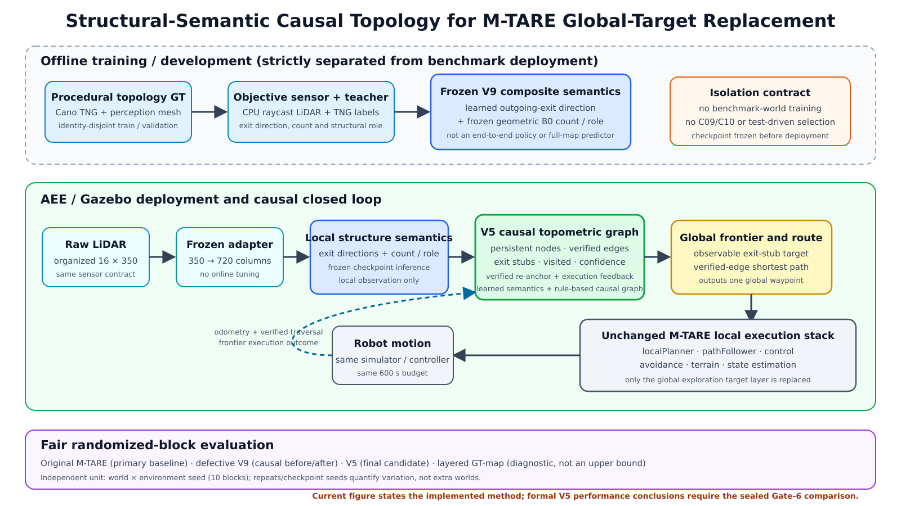
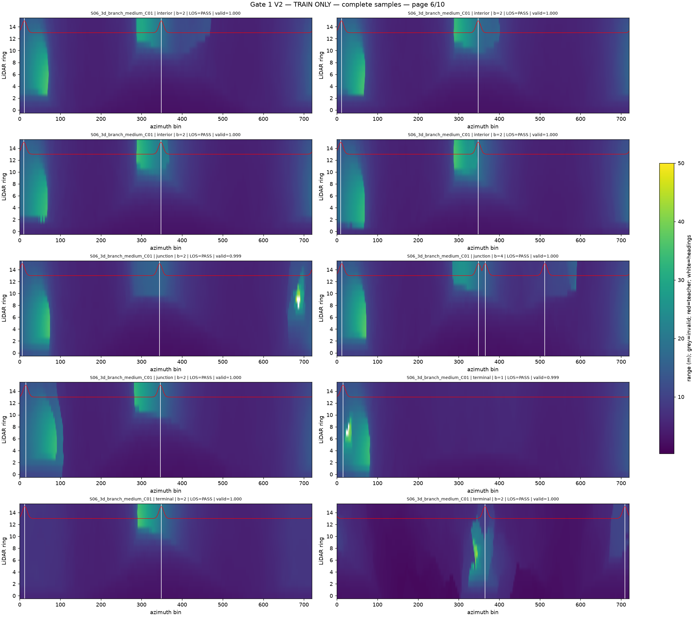
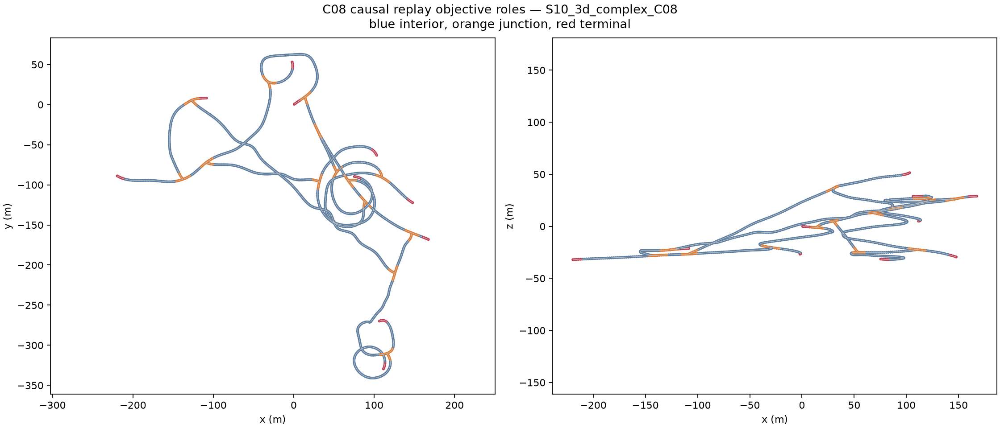
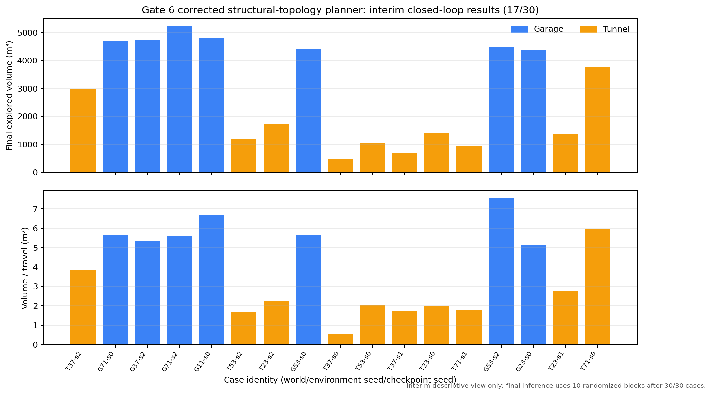

# 学习式局部出口语义驱动的拓扑图替换 M-TARE 全局规划：阶段进展

> 更新时间：2026-08-23。本文用于阶段汇报，只陈述已经封存的结果和正在运行的正式实验。当前单机器人矩阵完成 `17/30`，第 18 组正在运行；因此文中的 17 组闭环结果是进展展示，不是最终优劣结论。

## 我们要做什么

目标是让机器人从 LiDAR 中理解地下空间的局部结构，持续建立拓扑图，再用这张图替换 M-TARE 原来的全局地图和全局目标选择层。M-TARE 的定位、避障、局部路径规划、路径跟踪和控制保持不变，这样最终差异能够归因于全局表示与决策方式。



实际链路是：

```text
实时 LiDAR
→ 判断可通方向和局部结构
→ 建立持久节点、真实走过的边和待探索出口
→ 在拓扑图上选择下一处全局目标
→ 交给原 M-TARE 局部规划器执行
→ 根据真实执行结果更新拓扑图
```

完整地图和教师拓扑只用于训练标签与离线评价，在线规划不读取完整地图，也不读取未来帧。

## 已经完成了什么

### 1. 结构信息提取

我们已经完成局部出口方向模型训练并冻结三个独立 checkpoint。模型输入是 16 线全周 LiDAR 距离图，学习附近哪些航向像可通隧道出口；分支数量和位置角色由冻结几何分支提供，拓扑图由确定性规则和真实轨迹建立。三个模型在未参与训练的开发验证数据上，出口方向 F1 为 `0.843–0.848`。当前阶段不再训练或挑选 checkpoint。

下图展示实际 LiDAR 输入与完整地图生成的出口方向标签。模型在线时只能看到彩色距离图，白色标签只在训练和评价时使用。



### 2. 因果拓扑图

拓扑图按机器人实际观测和运动顺序逐帧更新：稳定结构事件形成节点；只有机器人真实走过后才建立连接边；看见但尚未通过的方向保存为待探索出口。机器人回到旧位置时会合并到已有节点，而不是重新创建一套图。

C08 开发回放已处理 4,773 个唯一 LiDAR 帧和三个冻结模型，共 14,319 次推理。学习语义相对几何规则基线提高了出口保留和拓扑综合分，同时保持图连通和已验证边正确。



这里的“几何规则基线”是只从单帧 LiDAR 几何规则提取出口的 B0，不是 M-TARE。闭环探索的主基线始终是原版 M-TARE；旧缺陷图规划器用于说明修正是否有效，完整地图方法只作诊断，不作为理论上界。

### 3. 替换 M-TARE 并进入真实闭环

拓扑图已经接入 M-TARE：新的结构图负责全局目标，原局部规划与控制栈继续负责把机器人送到目标。短运行、六场景 readiness 和纠错机制探针均已通过。现在执行的是正式 30 组配对实验：两个世界、五个环境随机种子、三个冻结 checkpoint，每组运行 600 秒。

截至本文更新，17 组已经完整生成轨迹、覆盖曲线、拓扑快照、决策记录、原始传感器包和 SHA-256 校验；第 18 组正在运行。17 组中两类图状态纠错均被实际触发，累计发生 220 次可靠回锚和 595 次错误出口拒绝。



图中蓝色是车库，橙色是隧道。上半部分是最终覆盖体积，下半部分是单位行驶距离获得的覆盖。当前结果已经显示明显场景差异：已完成案例覆盖范围为 `478.0–5242.875 m³`。车库通常较高，部分隧道虽然持续行驶，但重复扫描较多、覆盖偏低。这些案例全部保留，最终将按十个“世界×环境随机种子”区组进行配对统计，不能从中期柱状图直接宣布优于 M-TARE。

## 遇到了什么问题，怎么解决

### 轨迹几何与 LiDAR 位姿不一致

早期几何求解把路口窗口外的大量轨迹整体下移，程序虽然通过数值检查，却违反了原位姿合同。我们没有追认该结果，而是把碰撞边界和向下支撑拆开：LiDAR 继续由原生 Cano 网格生成，支撑面只查询当前路线；最终 4,307 个路口窗口外位姿保持逐元素不变，4,773 帧重新通过安全检查。

### 模型输入与训练输入不一致

首次部署把注册后的地图点重新栅格化作为模型输入，而训练使用的是原始 16×350 LiDAR。这导致输出异常。修正后部署恢复原始扫描和冻结的 350→720 变换，六个 readiness 案例全部通过。这个修正只恢复输入合同，没有换模型或重新调参。

### 拓扑图会卡在旧节点或反复选择错误出口

旧图规划器 V9 的 90 组对照表明，它相对原版 M-TARE 的覆盖时间积分显著更差。逐帧证据定位出两个原因：机器人返回旧节点后，图中的当前位置有时没有同步回锚；机器人没有从所选出口离开时，该出口仍会反复被选择。

当前 V5 增加两项确定性修正：真实返回轨迹能验证旧边时更新当前节点；实际离开方向与目标出口不一致或回到同一节点时，将该尝试写入重试记录并重新选目标。修正不使用完整地图，也没有新增学习参数或调低评价门槛。

### 长实验中的系统和证据链故障

之前还遇到过主机时钟回拨、Python 3.8 兼容和 runner 接口缺失。处理原则是不修改失败 run、不删除失败值、不挑选性重跑性能差案例。受时钟影响的实验按预先声明的完整区组恢复；纯接口故障从零创建新 run；所有失败及修正后的结果分别封存。这保证论文结果可以追溯，也避免把工程故障伪装成算法结果。

## 现在正在做什么

当前唯一运行中的正式任务是 V5 单机器人 30 组矩阵。已经确认：

- `17/30` 个案例完整通过系统与证据合同；
- 第 18 组正在仿真；
- 没有训练、checkpoint 选择、阈值修改或失败案例删除；
- C09/C10 严格隔离；
- 当前磁盘和运行进程正常。

现阶段能确认的是：模型已经训练好，拓扑图已经能在线建立，也已经真正替换 M-TARE 全局层并驱动车辆持续运行。尚不能确认的是：它在十个随机区组上的总体探索效率是否优于原版 M-TARE。

## 下面准备怎么做

1. 完成并封存剩余 13 组，不调整顺序、模型或阈值。
2. 对 30 组执行只读配对统计，比较修正版 V5、原版 M-TARE、旧缺陷 V9 和完整地图诊断。
3. 自动生成覆盖曲线、效果量与置信区间、车库/隧道轨迹、拓扑图、失败案例图和论文表格。
4. 根据 Gate 6 结果给出 `PASS / MIXED / FAIL`：重点回答哪里更好、哪里仍会重复绕行，以及收益是否足以支持替换 M-TARE 全局层。
5. 只有单机器人证据支持后，才进入多机器人共享拓扑图和目标分配实验；随后冻结全部开发参数，执行严格未见测试与消融。
6. 最终把所有封存结果自动写入论文正文、补充材料、复现说明和汇报 PDF。

## 当前阶段结论

我们已经完成“LiDAR 学习式出口方向 → 规则化因果拓扑图 → 替换 M-TARE 全局目标 → 真实闭环执行”的完整工程链路，并用执行反馈修复了旧图规划器的两类状态缺陷。当前 17 个正式案例证明系统能够持续建图和行驶，但也揭示了隧道中的高重复、低覆盖问题。论文的核心性能结论必须等 30/30 案例封印并完成区组统计后给出。

## 证据入口

- [项目当前进度](PROGRESS.md)
- [论文完成矩阵](PAPER_COMPLETION_MATRIX_V1.md)
- [局部出口方向模型结果](../results/gate2_representation/gate2_20260822_aee_corrective_composite_v9_seed20260822/metrics/summary.json)
- [C08 因果拓扑回放结果](../results/gate4_topology/gate4_20260817_cano_c08_route_conditioned_causal_topology_replay_v2r_seed0/metrics/summary.json)
- [原版 M-TARE、旧 V9 与诊断方法的组合审计](../results/gate6_single_robot/gate6_20260823_aee_composite_v9_composed_frontier_attempt_audit_v1r_seed20260820/metrics/summary.json)
- [当前 V5 正式矩阵进度](../results/gate6_single_robot/gate6_20260823_aee_composite_v9_combined_correction_stochastic_v1r2_seed20260820/metrics/progress.json)
