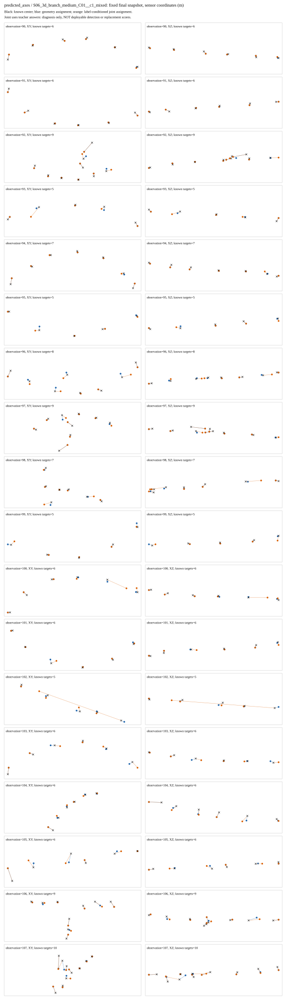

# 已定位：类别正确的候选可能离路口几十米，成员漏失另有原因

2026-09-05。三组相同最终预测缓存的归因在3.477秒完成，0模型/权重/训练/GPU。原独立分数、全部逐父分数和评分mask/query逐元素复现，旧实验成绩不变。

| 相同最终预测 | 真实轴线＋关系 | 预测轴线＋关系 | 预测轴线去关系 |
|---|---:|---:|---:|
| 两种匹配选不同候选的目标 | 552/1206 | 528/1206 | 8/1206 |
| 独立中心匹配的交汇正确数 | 0/14 | 2/14 | 0/14 |
| 借助答案联合挑候选的交汇正确数，仅归因 | 13/14 | 14/14 | 0/14 |
| 独立中心匹配的成员F1 | 0.535 | 0.155 | 0 |
| 借助答案挑候选的成员F1，仅归因 | 0.746 | 0.158 | 0 |

不能将第二种匹配的高类别成绩写成模型成功。一个确切反例是观察102、目标1：真实轴线分支的位置匹配候选距中心0.033米、类别错；联合匹配改选59.231米外但类别正确的候选。预测轴线分支同一目标也从1.931米改选48.532米外的候选。模型没有重新运行，区别完全来自匹配方式。

代码中的联合代价把中心距离除以50，再和事件、成员、存在性、不确定性损失合并，因而可能接受远处类别正确的候选。**这证明训练候选选择没有约束好位置与属性的绑定，不证明网络已在正确位置识别路口，也不能仅归咎于评分器。** 原独立评价揭露了这个问题，不能用答案条件化评分替换它。

成员问题不是只由这条捷径造成。预测分支即便借助答案挑选，正成员只找回188/2152个，F1仍0.158；正成员概率中位0.370，90百分位0.494，仍低于原固定0.5。去关系分支正/负成员概率均值都约0.156，证实退化为近常数输出。真实/预测的几何误差、候选数及正负不平衡仍是待分离因素；不在本轮改阈值或重加权后声称解决。

## 下一次只改什么

选择独立新loss：先用与独立评价一致的纯中心几何唯一匹配，绑定后同一个候选承担中心、类别、成员、存在性和不确定性监督。类别/成员答案不再影响选哪个候选。对应不唯一保持UNKNOWN，缺中心的已知语义直接拒绝；原五项权重、50米尺度、轴线方向桥和0.5读出保持不变。

这是一次单变量受控修正，不增加网络、轮数或种子：仍原180观察、三分支从相同seed0初始化、相同顺序各300步。先通过近处错类/远处对类、改变标签不改变匹配、全局平局与梯度测试，再独立冻结训练卡。不能提前保证它解决预测成员漏失；若成员仍差，再单独评估，不能同时修改多个因素。

## 全量证据

保存三支各1206逐目标对照、各14交汇完整表、逐父统计及概率分布，30张双视图图（1080面板），所有原图/权重不动。50项seal复核，RAM峰值638705664字节，目录约15.37MB。源码`b5a1a2e`，seal `8c12d0188e53e54e48036c5602435192b2809c787fadb6e89d3293e10d634f30`，105项相关测试通过。

[原始归因指标](../results/gate3_semantics/gate3_20260905_gse_assignment_attribution_v1_seed0/metrics/summary.json)。本轮是已完成的失败归因，不是科学门或完整论文完成。
