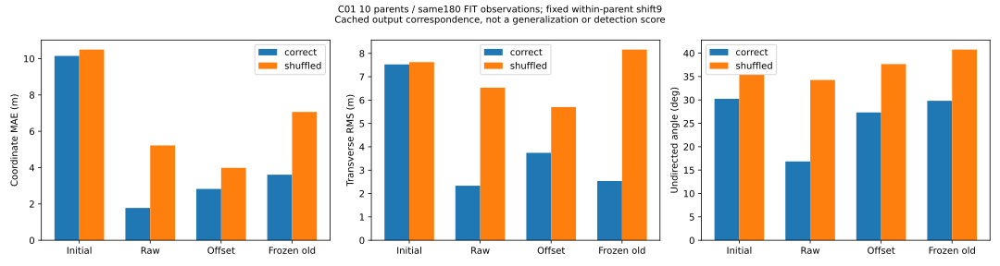

# 轴线预测是否随当前观察变化：零训练对照

## 这次回答什么

上次原始点读出的拟合误差下降，但每次输出32个候选，评分只选择与真实片段对应的部分。需要排除一种很弱的解释：模型只是输出一堆通用线段，恰好容易被评分器选中。

本次不训练、不加载模型、不读原始点云，只比较已经保存的预测。沿用C01十个父地图、每图18个观察，共180个观察、1452个教师可见片段。教师轴点来自此前封存的坐标检查缓存，不产生新标签。

每图按原清单顺序循环平移9个位置，把别的观察输出拿来评分。180个对应在运行前全部冻结，同父地图、无自配对、一对一使用，不看结果挑置换。保留32候选数、原几何对应算法、端点反转和全部样本。初始头、无偏移头、偏移头和旧冻结模型都做正确/错配两组。

## 结果

| 预测来源 | 正确对应坐标误差（米） | 错配后（米） | 错配增加（米） |
|---|---:|---:|---:|
| 初始头 | 10.151 | 10.500 | 0.349 |
| 原始点，无偏移 | **1.780** | **5.220** | **3.440** |
| 原始点，加偏移 | 2.826 | 3.987 | 1.161 |
| 旧冻结模型 | 3.612 | 7.064 | 3.452 |

四种输出在10个父地图上的正确对应均优于错配。原始点头不是一个完全不随观察变化的固定候选库。**但“十图都更好”本身不是成功门槛：未经训练的初始头也存在较小的对应优势。** 更不能据此把观测相关性归因于某一个学习模块。

原始点头的正确/错配横向RMS分别为2.336/6.531米，无向轴线夹角为16.846/34.271度，两段折线双向平均距离为2.714/10.473米。改善并非只体现在坐标绝对误差上，但正确对应的横向偏差仍有米级，尚不能直接支撑可靠端口/节点位置。

同一评分合同下，旧模型正确对应的横向RMS为2.536米、方向角29.820度、折线距离4.810米。raw与旧模型的横向均值改善约7.9%，小于坐标误差改善幅度；角度与轴向/截取范围改善不能冒充全面解决布局。旧模型方向未定19项，raw未定6项，因此角度均值的有效集合略不同，计数已完整保存，不能隐藏未定项。横向均值两者均保留1446项有效、6项教师方向未定。

## 候选数量问题仍在

所有方法仍有5760个输出、1452个被评分对应和4308个剩余候选。raw匹配使用频次的等效候选数为23.72/32，最近其他候选的坐标距离均值1.055米，精确重复候选对为0。它没有完全坍缩成几个相同输出，**不等于每个候选都正确，也不是分割/检测precision**。最近距离没有被转成新的过滤阈值。

偏移头的对应优势更小，但它仍随观察变化；此前同预算不如raw的结论保持，不增加偏移训练轮数。不能从本次结果推出偏移估计在原理上无效。

## 解释边界与下一步

这是缓存输出的对应诊断，不是重新输入传感器的干预实验。它不能区分LiDAR几何、相对运动/路线相关性、训练样本记忆分别贡献多少；也不是清洁的坐标均值池化消融。评价和小头拟合仍来自同一180个观察，不声称未见地图泛化、完整结构语义或建图通过。

接下来先准备C02十个父地图的封存元数据清单与小头冻结推理卡，固定采样后才读数组。它们未参与此次180观察的小头拟合，但旧骨干训练可能已见过，必须标为**小头跨父地图开发检查**，绝不能冒充整个模型严格未见测试。只准备卡/选择器，暂不推理或训练；C07–C10和闭环仍关闭。后续还需要同目标同预算的均值坐标对照，以及有效候选、事件/端口监督，不能用这张图跳过。

## 实现、故障与复现

首次执行V1在0评分时失败：通用配置读取器要求JSON对象，而样本清单是列表。失败run保持不可修改。V1R仅对两个已声明列表文件使用严格列表读取，其他配置继续要求对象；输入、清单平移9、方法、分数、预算不变。新增完整合成执行测试覆盖180观察/1452目标、真实评分与绘图、日志、seal、原始输入不变及重复执行拒绝，避免只测函数而漏掉文件接口。

V1R正式结果：2.966秒、峰值RSS620572672字节；0训练/模型/checkpoint/原始扫描/新标签。4种正确对应分数及匹配均复现原封存结果，保存8份完整逐观察结果、逐父地图统计、预冻结对应清单、SVG、原始日志、环境和输入工具哈希。22项输出校验全部通过。23项新增诊断/完整执行测试及指定扩展回归446项通过。

- [运行规格](../configs/v3/gate3/gse_axis_observation_dependence_v1r.json)与[数据卡](../configs/v3/gate3/data_cards/gse_axis_observation_dependence_v1r.json)。
- [完整结果](../results/gate3_semantics/gate3_20260905_gse_axis_observation_dependence_v1r_seed0/metrics/summary.json)。
- seal-list SHA256：`75bc26ab5f7f4a3d7a4f8ef86e7e5afc73c6696fe20923bb69cf56aa8343e4a2`。

旧训练、失败记录、模型、论文图片均保留；本轮未创建新训练模型或新拓扑图。
