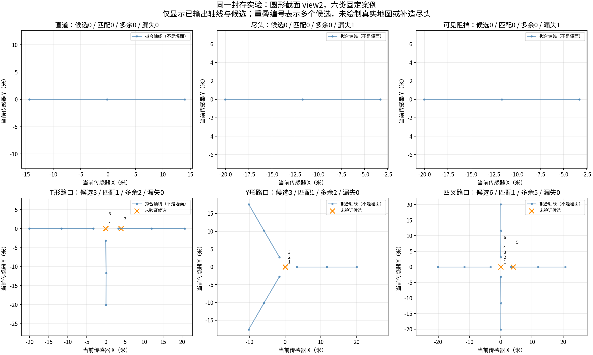
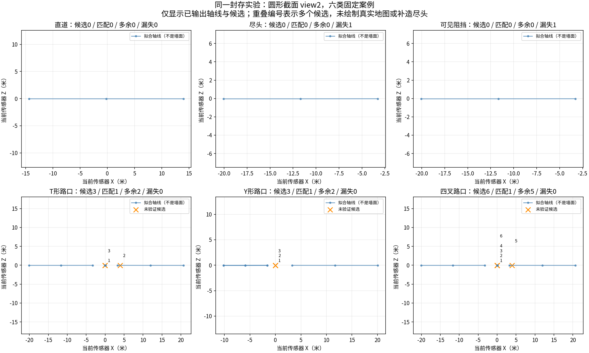

# 轴对候选：六类固定案例

来源为封存45观察运行，固定选择所有六类的圆形截面view2，不按分数挑例。图中蓝线是拟合轴线，不是墙面、真实地图或最终图；橙叉是未验证候选。编号重叠表示多个候选落在相近位置。未添加真值位置或补造尽头。图像和来源SHA已经核验，中文XY/XZ均已检查。

可以看到：路口位置附近存在多次提议；T和四叉还出现远离中心的假交点。尽头仅有后方通道拟合轴，不能从它的裁剪端点猜出前方终止面。两个图中的结果与原始评分一致，没有事后去重或改变阈值。

## 下一接口应使用什么信息

现有 `SurfacePatches` 已保留实际回波面片中心、法向及有效掩码、空间范围、粗糙度、五帧支持和射线起终点。这些可用于构造轴线与局部表面的交会证据，不必再训练一个新的面片分割器。

边界：`build_patch_neighbors` 的射线关系当前仍为UNKNOWN，不能假装已有通行验证。面片法向有效也不代表整个通道被堵。候选必须保留交会点是否落在被观测面片范围内、法向与轴方向关系及支持；单个侧壁、部分小障碍、遮挡和缺失回波不能直接变成确定尽头。后续只先实现几何证据接口及反例测试，再冻结真实扫描诊断；不把备用模块包装成原学习方法已经成功。

本轮新增2张图、0扫描读取、0训练。旧运行无修改。
