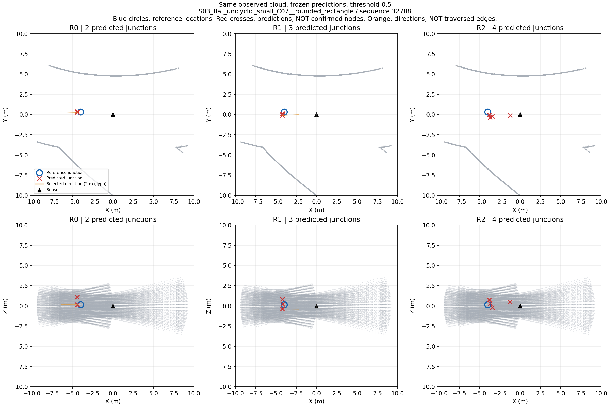

# 支路候选为何没有成为有效预测

## 范围与结论

只读分析 `gate3_20260909_gse_development_paired_train_v1_seed0` 的三组最终预测、评分及训练日志；原307观察（拟合250、校准27、开发30）和原方向绑定清单不变。没有新训练、教师或地图读取，没有改变阈值。方向目标读取核验了原清单和所读文件的 SHA-256。方向检查会话29770正常结束。

目前证据指向**候选选择与重复节点监督**，不是足以否定几何表示的证据。尚未证明任何修正有效。

## 原预测中的失败分解

先使用原4米/10度评分的节点对应，再检查对应原始节点查询的64个方向。对每条参考方向，统计是否存在10度内候选，以及这些候选是否通过原0.5存在概率门槛。此为逐参考的存在性检查，不是一对一检测评分；同一候选可能支持多条参考，不能将其改名为召回率或修正后成绩。

| 分区 | 表示 | 参考支路 | 没匹配到节点 | 有近方向且通过门槛 | 有近方向但全部未过门槛 | 没有近方向 |
|---|---|---:|---:|---:|---:|---:|
| 拟合 | R0 | 774 | 90 | 48 | 556 | 80 |
| 拟合 | R1 | 774 | 90 | 31 | 597 | 56 |
| 拟合 | R2 | 774 | 0 | 30 | 706 | 38 |
| 校准 | R0 | 87 | 0 | 3 | 78 | 6 |
| 校准 | R1 | 87 | 0 | 10 | 68 | 9 |
| 校准 | R2 | 87 | 0 | 9 | 77 | 1 |
| 开发 | R0 | 90 | 9 | 4 | 73 | 4 |
| 开发 | R1 | 90 | 9 | 5 | 72 | 4 |
| 开发 | R2 | 90 | 3 | 0 | 85 | 2 |

开发集匹配节点数为27/27/29，其中没有任何选中支路的节点为17/24/27。匹配节点上选中支路总数为10/13/3，未匹配节点上为2/136/392。后一项包含原评分的未知预测，不可全部叫已证错边；这些也不是图边。

## 代码与梯度证据

`anchor_branch_loss.py` 使用几何距离单独确定训练对应。对于两个方向误差1.0与1.1度、存在logit分别-4和+4的候选，原实现选择第一个候选为正。仅交换两个角度，正样本随之改变。实际代码计算的两个候选分类梯度由 `[-0.327338,+0.327338]` 变为 `[+0.005995,-0.005995]`（第三个负候选另计）。这证明该接口对接近候选的几何排名敏感；**不能证明真实训练中已经频繁换位**，因为原更新日志没有保存逐步候选对应。

完整构造支路参考的节点，对64个候选等权平均存在性损失。典型3正/61负，在logit=0时，正例梯度总量-0.0234375、负例+0.4765625。若所有候选共享同一概率，最优概率为3/64，BCE约0.189209。这只是不可区分候选的退化解分析，不是模型实际只能输出常数的证明。

日志前100与末100更新的平均方向项分别为：R0 0.249038→0.004676、R1 0.245426→0.002237、R2 0.216087→0.002631。末100存在性项为0.265564/0.233757/0.174221。方向项下降而有效支路仍少，说明不能用该项代替检测验收。

`conditional_anchor_branch_loss.py` 对已证背景查询加负监督，未知保留未知；真实节点附近未匹配查询不自动为负。其子支路也只在被分配的节点上接受监督。这是重复节点/无约束支路的具体检查点，但不能未经证据把所有附近查询都改成负例。

## 成熟实现的具体参照

[Mask3D matcher](https://github.com/JonasSchult/Mask3D/blob/main/models/matcher.py)将类别与mask代价共同用于训练匹配；[criterion](https://github.com/JonasSchult/Mask3D/blob/main/models/criterion.py)提供独立的无实例类别权重。它不是地下开口算法，也不解决我们部分标注的未知问题。参考的是匹配与分类协同，而不是原样复制完整背景假设。

训练对应可以与独立评价对应采用不同政策。若后续改变训练对应，必须新版本登记；**旧实验的纯几何评分、置信度门槛、未知掩码和全部原始结果保持不变**。当前尚未实施这种改变。

## 下一步与停止线

1. 用保存预测检查候选方向多样性及几何最近候选的置信度，区分候选铺满方向与真正有选择的信息；同场景图仍待完成。
2. 整理单一有限修正合同：先处理有证据的选择目标问题，不同时换骨干、教师和表示。真实轨迹中对应反复切换尚无证据，不能据此宣称已确认根因。
3. 修改训练政策前显式登记与旧纯几何训练规则的差异，保留独立评分；普通软件测试不算研究成绩。新训练仍需精确卡/spec及预检，不自动追加种子。

## 候选排序检查（会话62528，exit 0）

继续只读同307保存结果和哈希绑定方向。固定使用最终评分匹配的节点查询，在该查询内按原logit降序检查前1/3/5/64个候选，不更改正式输出。初始化对照也使用这个查询索引，因而是事后条件诊断，不是初始检测成绩。相同概率使用稳定索引排序，边界平局仍不能作为独立性能依据。

开发90参考方向中，至少有一个10度内候选的数量：

| 表示 | 前1 | 前3 | 前5 | 全64 | 初始化全64 | 几何最近候选概率中位数 |
|---|---:|---:|---:|---:|---:|---:|
| R0 | 11 | 21 | 21 | 77 | 0 | 0.13749 |
| R1 | 22 | 42 | 45 | 77 | 0 | 0.20621 |
| R2 | 23 | 45 | 47 | 85 | 0 | 0.05122 |

几何最近概率统计仅包含已匹配节点上的参考（R0/R1/R2为81/81/87），包括最近方向仍超过10度的参考，不能解释为正确候选概率的专属统计。表中存在性数量仍不是一对一检测分数。

拟合774参考的前3覆盖为164/301/330，全64覆盖604/628/736；校准87参考的前3为23/38/39，全64为81/78/86。初始化全64在拟合为0/2/23、校准0/0/2。

开发查询内两两方向小于等于10度的对数为4866/54432、3479/54432、2276/58464。这是方向冗余统计，不是重复节点率，也不能仅凭较少冗余认定结构更好。

结论：训练后方向候选确实与参考更接近，但方向排序和绝对置信度仍不足。前3覆盖只占全候选覆盖的一部分，不能把问题简化为统一降低阈值。也不能据本次事后查询对照证明模型充分利用了输入，仍可能包含常见方向先验。当前停止继续新增同类统计，下一应交付固定同场景可视化并登记有限修正的训练/评价分离合同。

## 同场景原始预测图

按封存R0最终评分顺序取首个开发样本：S03_flat_unicyclic_small_C07__rounded_rectangle，序列32788，帧740–744，共29170个有效10米范围内回波。不是按模型成绩选择。上排俯视，下排侧视；三列依次原扫描分组、体素、超点。灰色是相同观测点云，蓝圈是参考路口位置，红叉是原阈值选出的预测位置，黑三角是传感器。橙色线段仅表示选中的方向，长度固定2米用于显示，不是真实通道长度或已验证图边。本图不显示参考方向，不能用于凭图计算支路方向准确率。

该例一个参考路口对应三组2/3/4个预测，侧视可看出高度上的重复点；R2没有选中方向线。图只说明这个样本的失败，不代替全人口统计。脚本 `tools/v3/preview_saved_paired_predictions.py`，生成会话2442 exit0；输出单独目录，含source、输入哈希和原评分provenance，已实际打开检查。没有重新推理、训练或修改封存run。

Phase 3尚未通过；目前没有表示胜出、建图收益或探索收益。
