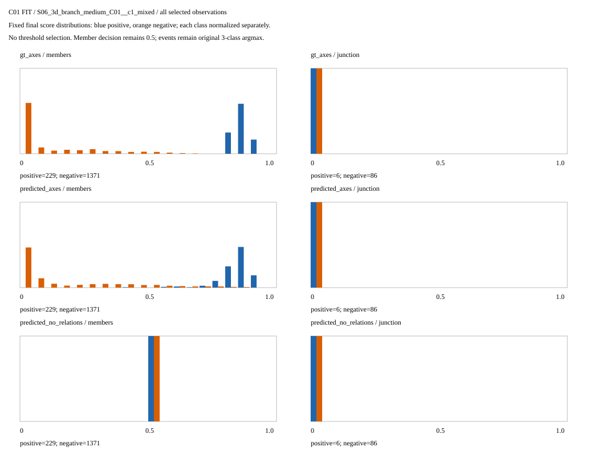
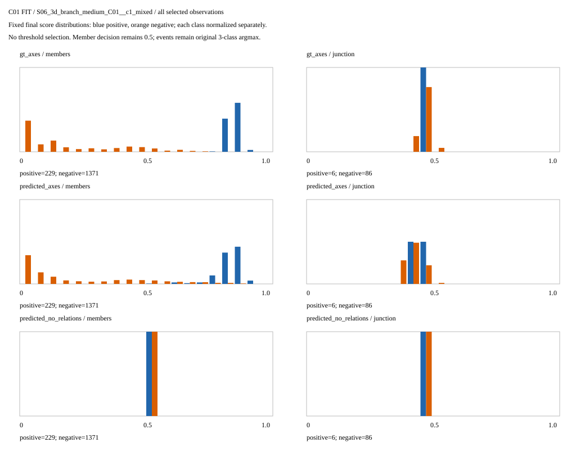

# 类别贡献对照：成员识别有改善，交汇读出仍未学成

2026-09-05。唯一新运行用时 **213.181秒（约3分33秒）**，2700次小头更新、3240次初始/最终评估，0新扫描、0骨干计算、0旧权重读取。旧控制组直接复用，没有重新训练。

本次不是换地图或换模型，而是分别检验“训练时是否平衡成员正负例”和“是否平衡走廊/交汇类别”。两种因素组成四格；原成员阈值0.5、三类argmax、中心对应、初始化、样本顺序、每次300步均保持不变。

## 1. 哪部分有效，哪部分没有解决

| 设置 | 理想几何成员F1 | 预测几何＋关系成员F1 | 预测几何去关系成员F1 | 预测分支交汇找回 |
|---|---:|---:|---:|---:|
| 原来都不平衡（00，复用） | 0 | 0 | 0 | 0/14 |
| 只平衡成员（10） | 0.7984 | 0.6615 | 0.2419 | 0/14 |
| 只平衡事件（01） | 0 | 0 | 0 | 0/14 |
| 两者都平衡（11） | 0.6941 | 0.6101 | 0.2419 | 0/14 |

成员平衡让关系模型开始找回真正属于当前局部结构的通道方向。这不是全局连接或建图准确率。预测10找回2134/2152个真成员，但同时产生2166个误报：召回99.16%，精度只有49.63%。因此虽然F1从0升到0.662，仍不能可靠地提交成员关系。

去关系10/11的0.2419来自**全部判正**，并非学会了成员区别。关系模型在十个父地图上的成员F1都优于该对照，支持几何关系具有独立作用；但不是高质量模型已经完成。

事件平衡单独没有识别出交汇；同时启用两种平衡还使关系模型的成员F1在十张父地图全部下降。GT11只识别1次交汇，却把100个走廊误报为交汇。不能只展示这1次找回或更高召回。

理想几何最高成员F1仍低于预登记0.90容量线，事件两类macro-F1远低于0.95。完整三类、检测、泛化和图资格均未通过。终点仍没有有效标签，不能通过改变分母声称三分类成功。

## 2. 公平比较和失败依据

来源仍是C01 S01—S10十父地图、180个五帧观察、900原帧、1452个可见片段；全部属于拟合数据，不是未见评测。

每次新拟合生成的初始化文件SHA与旧00精确相同；全部initial评价也逐字段相同。旧权重没有被打开，只使用其seal中的摘要核对新生成文件。关闭平衡的训练软件与旧代码经过参数、顺序和完整记录的精确等价测试。

全部新格子每分支累计监督36180个中心、26580个事件和469230个成员标签；歧义、漏对应、未绑定标签均为0。误报差异不是偷偷删除样本或漏送标签造成的。存在性仍只有正监督，不能把低存在性损失当完整节点检测证据。

三因素差值和交互全部保存；独立只读复核930个非空差值精确一致，225个不可比较值保留null。只有五张父地图具备两类事件真值，不能编造十地图的事件胜率。所有格子完整报告，未自动选择最佳格子作为正式模型。

## 3. 为什么下一步检查事件读出，而不是再调权重

源码中两个输出实际是平行的：

```python
member_logits = membership(conditioned)       # 逐方向判断归属
event_logits = event(conditioned.mean(dim=2)) # 全部有效方向平均后分类
```

这里省略了原代码的有效掩码与分母，仅说明数据流。事件输出没有直接使用已预测的成员概率；并不是模型完全没看到角度或高度，因为这些量已经进入关系特征。

本次已生成的GT10逐项评分JSON提供了一项事后标签解释：872个已知走廊中，870个保留两个正成员，2个因方向对应未知只保留一个；14个交汇都保留三个正成员。这不是新教师，也没有把这个计数规则加进评分，只说明已知事件与当前结构的成员组合相关。

纯合成读出反例也表明：隐藏特征均值相同的两组输入，成员分数分布可以不同，但原事件线性读出必然相同。它证明了一种信息压缩局限，**不证明这就是实际失败的唯一原因**。复制相同轴线导致均值不变的反例也不能冒充新增真实支路。

因此下一步只准备一个最薄的成员条件化事件读出：保留原未加权几何汇总，增加模型成员概率加权的方向/高差/相对位置汇总与软成员数量，由小网络学习事件。禁止GT成员筛选、写死“3个就是交汇”、调评分阈值或读取新地图；首先以冻结来源隔离事件读出作用，不同时修改成员分支或骨干。

软成员数量不是物理支路数，误报、重复候选、裁剪和未知方向会影响它，必须保留这些局限。当前只在做该读出的软件与合成测试；实际输入缓存、单次训练预算和对照仍需独立冻结。已有配置停止加权/加轮数，不自动进入正式图。

## 4. 图片和证据全部保留

全部九个新拟合均保存初始/最终XY与XZ：180张图、6480面板；另有30张完整父地图概率图。共210张，没有筛掉失败样例。以下S06包含全部18个观察，用于看成员平衡前后的分数分布，不表示类别数量相同。





- [完整四格、逐父结果与资源记录](../results/gate3_semantics/gate3_20260905_gse_class_balance_factorial_v1_seed0/metrics/summary.json)
- [全部因素差值与交互](../results/gate3_semantics/gate3_20260905_gse_class_balance_factorial_v1_seed0/metrics/factorial_effects.json)
- [原始2700步记录](../results/gate3_semantics/gate3_20260905_gse_class_balance_factorial_v1_seed0/logs/training.jsonl)
- [GT10成员及事件标签对应的原始评分记录](../results/gate3_semantics/gate3_20260905_gse_class_balance_factorial_v1_seed0/artifacts/factors/10/artifacts/gt_axes__scored_probabilities.json)
- [实验前冻结设计](GSE_CLASS_BALANCE_FACTORIAL_V1.md)

运行 `gate3_20260905_gse_class_balance_factorial_v1_seed0` 完整结束，313项seal复核；清单SHA为 `6786cba45d60af60b87290536b9b5c339359755c6ea8e0876c539af71e7ff5d2`。CPU峰值1952542720字节、GPU保留峰值320864256字节，总证据约128.33MB。114项执行前合并测试通过，正式运行无软件错误、无重试、无源码漂移。完整论文目标尚未完成，不能把本轮局部收益当论文完成。
