# 构造几何参考训练：第一轮实际结果

## 2026-09-13：直接方向支持监督接口已实现，尚未训练

新增`direction_support_contract.py`，只负责损失与来源边界，不新增网络或读取教师做前向。输出矩阵的行是观测射线，列是部署时从观测得到的查询；每项独立判断，允许同一行多个正支持，不做总和为1的softmax。未知不产生梯度；负支持必须有其自身的证据，不能由其他列正支持推导。

17项相关软件测试已通过，覆盖共享正例、未知高低分不影响损失、全未知零梯度、缺来源拒绝、查询错位拒绝、未资格及仅正例数据拒绝训练。它们证明接口行为，不是模型性能。

目前真实参考仍有两个缺口：一是没有独立方向排斥证据，二是参考的方向名称与观测查询尚未建立损失侧对应。直接训练只含正支持的任务会鼓励全部预测为支持；直接把教师方向设为前向查询则违反部署输入合同。下一必须解决这两点，不再启动同组评分或查询范围的修补实验。此次0训练、0新模型前向、0标签导出，旧结果不变。

## 2026-09-13：完整查询实际跑完——覆盖缺口消失，但支持不具选择性

使用同一个C模型最终权重、同32个观测锚点，完整计算锚点到全部有效射线的关系，12例共4336032个唯一无序对，7.577秒完成。0训练；原查询logit及共同概率最大差均为0，权重hash不变，23项seal核验通过，11接口测试通过。没有换锚点、改阈值或把教师送入预测。

| 同一冻结模型和锚点 | 只取旧稀疏关系 | 补齐直接查询 |
|---|---:|---:|
| 至少一个高分支持的射线 | 8350 | 135699 |
| 多个高分支持的射线 | 521 | 135625 |
| 没有高分支持的射线 | 127349 | 0 |

补齐后每例支持锚点数的中位数达到27—30（共32锚点）。所以前一轮约94%的“无支持”主要来自没有查询，而不是模型全部低分；**补齐查询后又暴露出旧评分器给出广泛高同组分数，不能将这种输出直接当作有选择性的通道方向归属。** 32个锚点本身不是32条真实支路，因此不把多锚支持数量当错误支路数；但这足以说明“覆盖率100%”不能证明任务完成。

本轮是冻结查询诊断，不是泛化、方向检测或建图收益。不能通过降低共享数量、再选阈值或恢复传递合并把本结果包装为成功；旧同组评分器的用途到此明确。后续若训练方向支持，应直接定义并监督那个任务，而不是再把旧分数改名。所有已完成权重、标签和失败均保留。

原始概率及逐例数值见[完整查询结果](../results/gate3_semantics/gate3_20260913_gse_complete_anchor_queries_v1_seed0/metrics/summary.json)。

## 2026-09-13：非互斥支持接口已在原12例运行，覆盖不足

不是只写计划：`gse_nonexclusive_support_v1`已在全部12例保存预测上执行，0.265秒，22项seal核验、8接口测试通过，0模型前向/训练。每例从真实射线方向确定性FPS选32锚点，不读取教师或按分数选点。只保留原预测中直接连接锚点的关系，不做传递闭包；同一回波可支持多个锚点，排斥关系另存，不强行拆组或合并锚点。

| 输出 | 全12例数量 |
|---|---:|
| 保留原始射线 | 135699 |
| 至少一条直接正支持的射线 | 8350 |
| 被多个锚点直接支持的射线 | 521 |
| 没有直接正支持、仍保留的射线 | 127349 |

约94%无支持，**因此这不是有效支路输出**。零锚合并是设计规则的必然结果，不是正确率；共享关系没有被传递合并，仅证明新接口能表达这种状态。旧同组概率保留原含义，没有改名成已校准的方向归属概率，也未判定521条共享射线语义正确。

该结果排除了“把旧稀疏关系原样接到少数锚点即可得到完整方向支持”的简化假设。下一步需要完整定义锚—观测查询及评分含义，而不是重新加上导致旧错误的传递闭包，也不能挑选更有利的锚点来提高本批数字。旧失败和10/12核心恢复不改写；不开展探索或重新训练。

完整逐例输出见[本次结果](../results/gate3_semantics/gate3_20260913_gse_nonexclusive_support_v1_seed0/metrics/summary.json)。

## 2026-09-13：授权的新归属参考已执行完成

不是再次等待批准：`gse_observable_membership_review_v1`已完成12图复核、12个射线级文件导出和封存，49项哈希核验通过，2项接口测试通过。旧标签、模型和失败结果未改。

新接口为每条射线分别记录各方向的支持。落入方向A的保守区域只标A的正支持，B仍未知，不再自动补B的负例；重叠区域也不会自动声明共享真值。这不是偷偷修改旧训练任务，旧训练仍按原合同保留。

本次只有13946条已存在的保守方向支持，121753条仍未分配，新增解决旧未知为0。没有独立排斥标签、没有新训练。**收益是把参考含义说清并正确存储，不是模型性能提高或完整参考已经产生。** 因此新版本记GATE_MIXED，原检测/分组GATE_FAIL不覆盖，也不由此进入建图。

依据与逐例记录见[新版本结果](../results/gate3_semantics/gate3_20260913_gse_observable_membership_review_v1_seed0/metrics/membership_binding.json)。

## 2026-09-13：可复核的失败证书与下一步边界

独立检查器`tools/v3/verify_conflict_certificates.py`已逐边核对原预测、原决策时序和原核心标签，两例均通过证据一致性核验。这里“通过”指失败证据可靠，不是方法通过。观察2的见证路径含5条已知同核心关系及171条未知关系；观察7含8条已知关系及75条未知关系。加上核心同组要求与排斥见证，无法同时组成一个合法划分。结果见[核验记录](figures/gse_conditional_geometry_fit_v1/local_conflict_replay/certificate_verification.json)。这比看图猜错边更强，但仍不能从多个未知项中唯一指认应修改的那一项。

后续验证应明确分开以下目标，不能继续共用一个未定义的“同组”答案：

| 要验证的关系 | 可以使用的证据 | 当前不允许的替代 |
|---|---|---|
| 是否同一观测表面附近 | 原回波、运动对齐、局部对应与遮挡检查 | 最近邻自动升级支路身份 |
| 是否属于同一可观察通道方向 | 显式记录可见通道支持、分隔证据、允许重叠/未知的归属定义 | 不同生成ID自动负例；一块墙必须唯一属于一个开口 |
| 是否同一跨帧任务 | 有资格的局部方向归属、因果观测对应及任务状态 | 组编号相同、表面仍在就认定同一任务 |
| 是否已有物理连接 | 实际连续执行轨迹 | 模型吸引边或点云图上的线段 |

建议下一最小变更是**独立的观测证据补充版本**，先用上述两条失败证书及5个未知组界定待核实内容，不更改旧标签、权重或历史失败。补充不能只盯错例：规则须适用于冻结人口的所有相同情形，任何无法从可见观测支持的归属继续未知。先证明这种关系定义可评分，再谈新训练；原12例仍只支持拟合诊断，不升级独立评价。

这项补充属于新的标注/监督范围，不在当前只读冻结诊断内；尚未导出新标签、尚未准备或运行新训练。若不改变当前范围，可靠维护资格仍缺证据，不能用更多同批统计或后端调参制造通过。保留方案是如实封存这次失败及10/12的有限改善，而不是把它登记为合格模型。

## 2026-09-13：跨观察检查区分了“表面还在”与“分组仍相同”

使用相邻窗口共享的同一原始帧，逐元素核验距离及有效掩码相同；在后一窗口坐标系中查询前一组回波的最近新回波。没有设置距离通过阈值，也没有把对应当真值。脚本首运行因误写字段名`ranges`退出，改为实际字段`ranges_m`后正常完成；没有改数据或模型。

| 相邻观察 | 原未知组射线数 | 双向最近邻对应数 | 对应到后一观察各组的数量 |
|---|---:|---:|---|
| 0→1 | 64 | 59 | 59（一个组） |
| 4→5 | 641 | 589 | 54 / 495 / 40（三个组） |
| 5→6 | 752 | 680 | 600 / 80（两个组） |
| 6→7 | 942 | 860 | 775 / 85（两个组） |

这些双向对应的距离中位数为0.12—0.17米。观察11没有同片段下一观察，明确不补造对应。完整单向/双向数量与距离分布见[跨观察记录](figures/gse_conditional_geometry_fit_v1/local_conflict_replay/unknown_temporal_assignment.json)。组编号只在单次观察内有效，表中不把同编号当同一身份。

**判断：真实表面持续存在，并没有自动带来稳定的分组边界。** 但最近邻仍只是几何代理，不足以判定具体哪次分配错了。这不是拓扑回放成绩，没有确认物理连接。

本次冻结结果的诊断链已经清楚：部分关系能拟合；全预测同时给出矛盾的吸引/排斥；旧后端整块拒绝，新后端改善到10/12核心恢复但仍有早期合并锁定；未知区域分组存在跨观察分散，且缺少完整归属参考。因此当前不能登记合格结构维护模型，也不能自动进A/B/C或探索。后续需要单独明确可观测归属/不确定关系及跨帧约束的验证合同；这会超出本轮“不改标签、不重训、不调阈值”的只读范围，不用再重复同批图和分数来拖延这个决定。

## 2026-09-13：5个额外组有真实表面支持，但不能据此算成支路

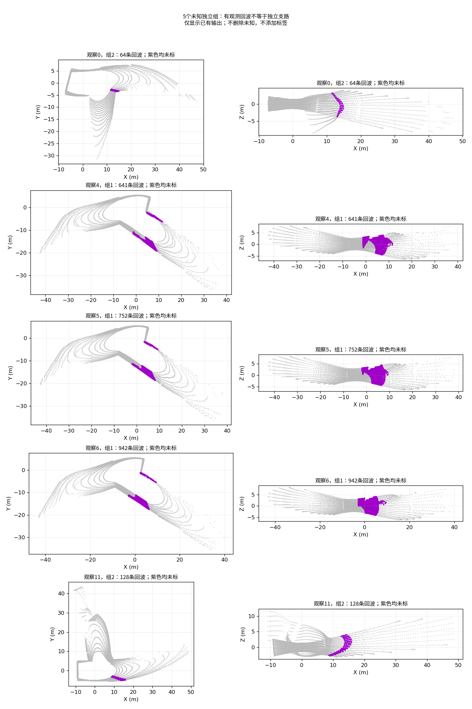

紫色是已保存模型输出，不是新增标签。观察0/4/5/6/11中的这5组分别包含64/641/752/942/128条射线。观察0、11显示较窄的表面带，观察4—6显示更宽的表面区域。前四帧已对齐回波到这些点的最近距离，中位数为约0.10—0.21米；完整各帧分位数见[支持记录](figures/gse_conditional_geometry_fit_v1/local_conflict_replay/unknown_group_support.json)。没有设置匹配通过阈值。

这说明它们不是没有观测支撑的虚构点，但**既不能证明它们是新增支路，也不能证明它们全是误检**。最近表面距离不是支路身份对应，五帧历史也不是独立样本；本次没有评价跨帧分组身份稳定性。

当前缺口由此明确：已标两块核心能约束局部关系，却不能完整约束其他表面的支路归属。继续只检查核心分数，无法完成全输出结构维护验证。下一只能利用已存相邻预测检查分配变化，不能将表面持续存在冒充结构分组持续正确。既定12/12未通过、未知资格不足及未证明方法优势的结论均保留。

## 2026-09-13：冲突路径已对应到实际点云

复用当前帧真实回波，保存并查看了下面两幅三投影视图。蓝橙线是模型先前接受的关系链，不是机器人行驶路线；绿色是后来被拒绝的已标同核心关系，红虚线是当时的未知排斥见证。

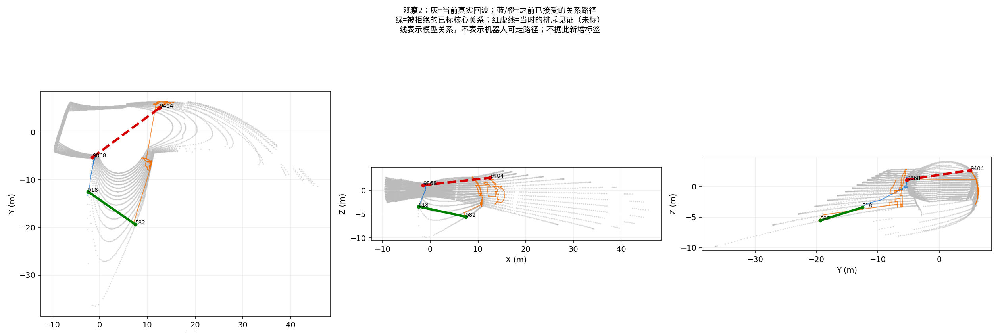

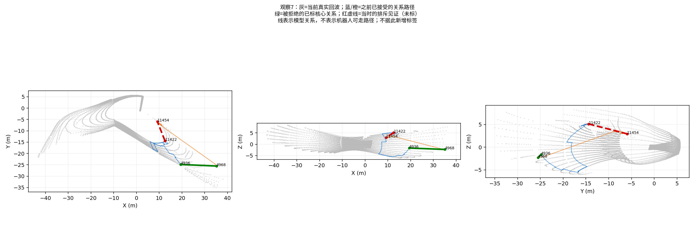

观察2的见证排斥跨越两个表面区域；观察7的见证位于不同距离和高度的上方回波。观察7此前一条吸引关系把距离相差约27米的远端核心回波与近端上方回波并入同组，预测同组分数为0.99997。这揭示了具体传播路径，但不能只凭距离说它必错：被拒绝的合法核心关系在两例中也分别跨越12.21米和15.75米。**因此不能用“删长边”或改距离阈值当作有证据的修复。**

原始10米面片域不变，而这两条被拒核心关系的回波距离分别为13.20/21.49米、31.57/43.49米。远端回波坐标仍进入模型，不能说模型完全看不到；但不能将局部面片支持解释为已拟合了远端表面。这是输入支持范围与当前关系任务之间需要保持的区别，不是本轮修改域的理由。

结论仍是：模型对部分核心拟合成功，但全体关系不自洽；当前顺序合并规则会把早期高分预测的影响锁定。两张点云图并未提供完整支路归属或所有未知表面的答案，未新增标签。下一最小工作是检查5个纯未知额外组的观测支持与跨帧持续性；这只能判别证据是否存在，不能直接把它们认定为误检或真实支路。

数值、射线坐标和输入哈希见[几何见证](figures/gse_conditional_geometry_fit_v1/local_conflict_replay/conflict_geometry.json)。本轮0模型前向、0训练，未改原预测、标签及阈值。

## 2026-09-13补充：剩余两例到底在哪一步切开

此次只读取已有决策日志，不重新训练或改变分组。此前找到的是最终组间的矛盾；现在进一步重建了**拒绝正确合并的当时**已经存在的证据路径。

| 观察 | 正确核心关系被拒绝时的决策序号（从0计） | 当时两组间排斥关系数 | 保存的两侧先前合并路径长度 |
|---|---:|---:|---:|
| 2 | 126987 | 38 | 32、144 |
| 7 | 138707 | 2 | 72、11 |

人话解释：模型先把核心周围许多未标区域非常自信地并到两边，另外又说两边的一些点不能同组。等到真正应该合并的核心关系进入处理时，两边已经互相排斥，后端就拒绝了它。**不是核心关系没学会，也不是程序没有执行；问题是局部预测组合起来不一致，早先决定影响了后续正确关系。**

不过，两条展示的排斥见证端点都没有参考标签，不能直接断言排斥错了，也可能是之前某次吸引合并错了。当前证据不足以指定一条未知关系为负例或正例，因此不删它、不调阈值追求12/12。严格失败结论、10/12核心恢复及未知分组未资格均保持不变。

完整射线编号、概率、决策顺序和两侧路径保存在[时序证据](figures/gse_conditional_geometry_fit_v1/local_conflict_replay/rejection_chronology.json)。下一步限定为这些冲突路径的原始观测支持核实，而非再重复训练。

## 2026-09-13：同预测局部处理冲突，核心完整恢复从0/12提高到10/12

这次不重训、不改标签、不换预测、不调0.9/0.1筛选。新后端先保留全部达到阈值的排斥约束，再按原始同组概率处理合并；冲突只阻止相关合并，不清空已有一致组件；完全同分的矛盾候选暂缓，不按编号选赢家。

| 同一批最终预测 | 原二值整块拒绝 | 新局部冲突处理 |
|---|---:|---:|
| 已标两个核心完整恢复 | 0/12 | 10/12 |
| 已标核心之间错并 | 0（全部拒绝） | 0 |
| 已标射线未分组 | 13946 | 0 |
| 核心被切分的案例 | 未恢复，不能计为无碎片 | 2 |
| 仅含未标射线的组 | 0（全部拒绝） | 5，正确性未知 |

全部135699条有效射线保留；121753条未标射线也被分组。这不是把未知当真值背景或用GT过滤输出，但也意味着不能把右图所有颜色视为正确通道。该结果只证明现有预测中的一致部分可以被保留下来，不证明完整支路分割、独立泛化或几何方法相对A/B的优势。严格12/12仍未通过，本轮GATE_FAIL与实际改善同时报告。

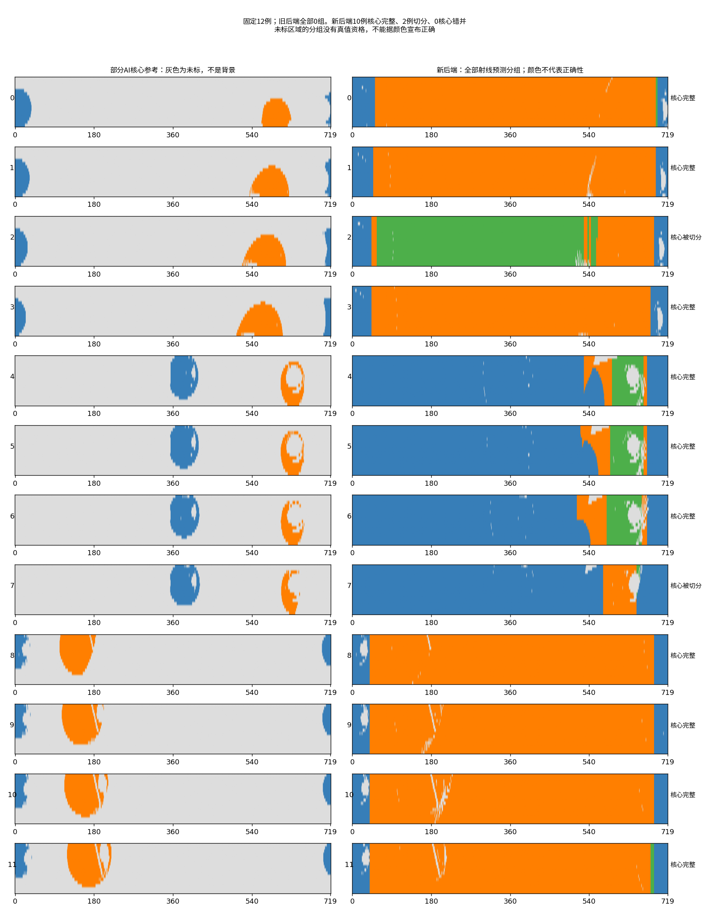

### 两例剩余问题已定位，不再笼统说模型失败

- 观察2：第二个核心被分成591与132条射线。射线518与582属于同一已标核心，模型同组概率0.999912，但最终所在两个组之间存在未标射线9404与9868的排斥关系（同组概率0.094393），所以合并被约束阻止。
- 观察7：第二个核心分成302与2条射线。射线4936与4968的同组概率0.998261；对应最终两组之间有未标射线11422与11454的排斥关系（同组概率0.091074）。

这些证据不能单独证明未标排斥就是错误；也可能是更早的未标吸引把不该合并的区域放入核心所在组。它们说明剩余问题是整套关系的相容性，而不是训练对已标核心完全没有效果。不得为消除两例而任意忽略排斥或再调阈值。

### 复现与局限

7项新矛盾/同分/换序/未知/编号测试，以及既有12项，共19通过；实际CPU回放7.644秒，峰RSS472739840字节，35seal核验。旧/新12例逐项结果和全部决策保留，0新前向/更新。保留原始置信排序与固定全部合格排斥是本次同时引入的两项实现差异；当前对照不能把改善单独归因于其中之一。

[正式结果](../results/gate3_semantics/gate3_20260913_gse_local_conflict_replay_v1_seed0/metrics/summary.json)；[两例逐射线归因](figures/gse_conditional_geometry_fit_v1/local_conflict_replay/split_attribution.json)；[冻结规格](../configs/v3/gate3/gse_local_conflict_replay_v1.json)。原训练失败结果和全部图片保留。下一仍限定剩余两例与未知区域关系一致性，不自动扩训或进入探索。

## 2026-09-13：500步训练与全预测分组已跑完，问题定位到关系冲突

这次不是初态前向，也没有停在训练前。C组从原step0执行完整500次AdamW更新，微批1累积4；初始及最终全部12观察均完成推理和分组。编码器冻结，未知不进入负例损失，推理没有使用AI/GT掩码过滤。只用了三个训练父地图的部分AI核心参考，不能当独立评价。

| 环节 | 初态 | 最终500步 | 含义 |
|---|---:|---:|---|
| 已标关系macro-F1 | 0.03923 | 1.00000 | 这批部分标签能够拟合 |
| 已标同核心关系召回 | 0 | 1 | 98699对全部正确 |
| 已标异核心关系召回 | 1 | 1 | 4202对全部正确 |
| 全预测分组完整恢复案例 | 0/12 | 0/12 | 局部拟合没有形成可用分组 |

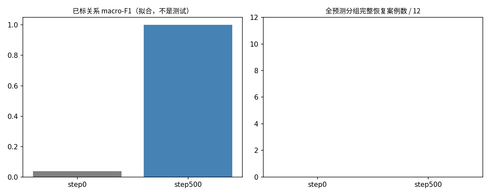

### 为什么训练正确，分组仍为空

训练只约束了已标核心之间的关系。其余约171万对关系没有监督，网络仍会为它们输出数值；其中1700999对达到预先固定的高置信范围（约99.31%）。这不能说明这些未知关系全部错误，但说明“未监督”不会自动让网络表达“不知道”。

12个观察都出现同一可复现现象：高置信“同组”边把全部有效射线串成一个大分量，而其中存在“不同组”边。固定后端对这种同强度冲突采取整块拒绝，于是最后没有组。该结果同时涉及模型关系缺少整体一致性以及后端冲突传播过于整体化；不能简单归为编码器不会学。

固定观察0的原始预测例子：射线0与592属于两个已标核心，模型给它们的同组概率只有0.00000666，判断正确；但模型同时预测0→8→696→692→228→232→592每一步都是高置信同组，其中除第一步外都是未标关系。这条路径与首尾异组判断冲突，足以解释该分量为何被拒绝。

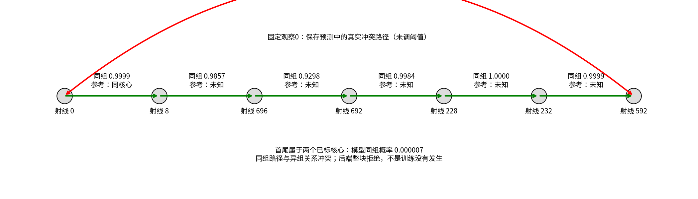

不是靠删未知射线就能宣布通过：那相当于让真值帮模型选择输出。也不能把理想核心分组12/12代替此次全预测0/12。当前诊断判GATE_FAIL；局部拟合确已通过，完整分组未通过，几何优势和探索收益均未验证。

### 完整证据与后续边界

实际耗时46.774秒，GPU峰保留1346371584字节、主机峰2144825344字节。6个检查点含初态、优化器、随机状态；500条训练日志、两轮全部预测、24份分组输出和68项SHA封存已保留。旧模型/标注/结果均未覆盖。

- [最终摘要](../results/gate3_semantics/gate3_20260913_gse_branch_core_fit_v1_seed0/metrics/summary.json)
- [初态评价](../results/gate3_semantics/gate3_20260913_gse_branch_core_fit_v1_seed0/metrics/evaluation_0000.json)、[最终逐例评价](../results/gate3_semantics/gate3_20260913_gse_branch_core_fit_v1_seed0/metrics/evaluation_0500.json)
- [12例具体冲突路径](figures/gse_conditional_geometry_fit_v1/branch_core_fit/conflicts.json)
- [最终权重与恢复状态](../results/gate3_semantics/gate3_20260913_gse_branch_core_fit_v1_seed0/artifacts/step_0500.pt)

下一问题已明确缩小为“部分监督的关系预测如何一致地组成分组，而不是让未知桥接引起整块拒绝”。本轮不继续加训练轮数、种子、标签或调阈值，不据此自动扩展ABC、建图或探索；更改关系约束/冲突处理需要独立登记，不能覆盖此次失败。

## 2026-09-13：这次确实补了观察证据，并修复了一个射线关系覆盖问题

2026-09-13 AI观察复核与一次射线配对修正完成：同3fit父地图/24帧/12观察，逐项查看12局部图和12完整因果回波图，提出24个可见表面核心，绑定13946条当前射线；121753条未选射线保持未知。原10米显示裁剪确实遗漏部分可见的远端分隔表面，但未修改模型10米域。核心提议不是完整支路标签或独立金标。原local_v1最大64度配对导致一个片段无跨核心关系、另有一例碎片和一例3射线孤立；仅一次teacher-free dyadic_v2修正，方位2幂1..512及360列、仰角1/2/4/8行，旧默认/结果保留。理想部分核心关系下12/12恢复双核心，无错并/已标孤立；12测试通过。新配对条件AI同核心98699/不同4202/未知1712750，不将其直接升级正式监督。0训练；GATE_MIXED。AI复核v1的环境文件重名错误保留，v1r1已完成并seal核验。下一需明确部分AI核心监督的训练用途及一致性，不能把本次理想分组当作500步拟合或方法优势。无需重新找网络/读取测试/改旧标签。

### 为什么原先只看局部图不够

下图来自同一观察，不是完整地图或新扫描。原始回波中已经有两个向不同方向延伸的表面区域，但部分分隔转角位于10米球外。不能把“旧档案不含负例标签”解释成“观测里根本没有几何依据”。同时，看到两个表面区域不等于能把交汇处每条射线都可靠地分配到物理支路。

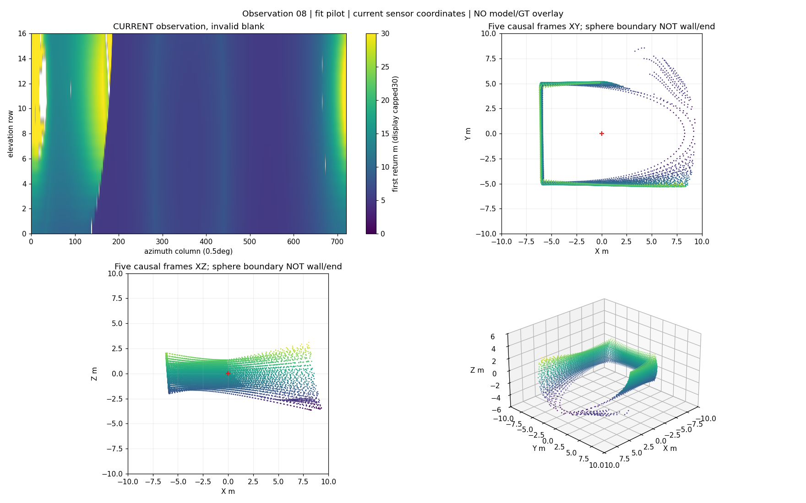

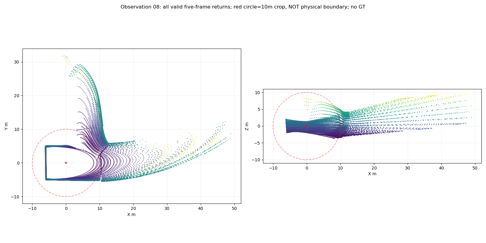

### 做了什么、得到什么

1. 实际复核全部12例，保存逐例AI解释和24个保守表面核心的空间范围；不是只挑成功例。参考未使用本轮网络分数或构造编号，历史接触构造资料明确披露为非盲。
2. 将这些核心绑定到13946条原始当前射线，其余121753条保持未知；这些是AI局部提议，不是独立金标、完整开口分割或已确认连接。
3. 用理想核心关系检查原共同后端，发现原配对只横跨最多64度。观察4—7的不同核心没有关系对；观察4多出一个核心碎片，观察5遗留3条已标射线。
4. 做一次均匀多尺度配对修正，不按标签选边：方位使用2的幂列偏移及半周偏移，仰角使用2的幂行偏移。原规则和结果保留。修正后12例理想输入均完整恢复两个核心，顺序不影响结果，无错并、无已标孤立；未标区域仍未知。

这说明修复了关系采样遗漏，不说明模型已经学会识别。新配对约为原来的2.7倍，后续真实前后向必须重新检查资源，不能沿用旧耗时。AI提议仅覆盖表面核心；未知区域的推理输出仍需保留，不能通过GT掩码删掉后宣布检测成功。500步训练、ABC优势和探索闭环仍未完成。

逐项证据：[AI复核记录](../results/gate3_semantics/gate3_20260913_gse_ai_branch_review_v1r1_seed0/artifacts/review.json)、[核心绑定数量](../results/gate3_semantics/gate3_20260913_gse_ai_branch_review_v1r1_seed0/metrics/core_binding.json)、[修正前理想分组](../results/gate3_semantics/gate3_20260913_gse_ai_branch_review_v1r1_seed0/metrics/ideal_grouping.json)、[修正后](../results/gate3_semantics/gate3_20260913_gse_ai_branch_review_v1r1_seed0/metrics/pair_correction.json)、[完整结论及未完成项](../results/gate3_semantics/gate3_20260913_gse_ai_branch_review_v1r1_seed0/metrics/decision.json)。

## 2026-09-13：新逐射线关系模型已运行，尚未具备训练监督

2026-09-13逐射线新接口已实际执行gse_direct_ray_relation_pilot_v1：8项新测试通过，preflight通过，12/12初态C前向完成，3.824秒，RAM峰1.44GiB、GPU保留416MiB，0更新。保留所有有效当前射线、最近8面片、原始关系logit与初始化。87331对条件正例、6665对不同截面但未知、0有证据的负例；现有来源没有观测支持的分离证书，不能由不同构造ID推断负例。这是监督可用性不足，不是新模型拟合失败，也不证明真实世界没有负例。GATE_MIXED；停止受影响的500步拟合及ABC扩训/建图。下一缺口是同五帧可见证据对独立开口分隔的逐对证明，以及条件正例的资格验证；不改旧参考资格、不启动另一模型搜索。

### 这次真正做了什么

旧方法先把宽扇区压成一个向量；新接口保留每条射线的方向、距离、回波坐标和冻结观测特征，让射线通过注意力读取其局部线段最近的8个面片。128维、三层关系模块复用；相邻面片不是确认连接。模型预测射线对关系，独立的吸引/排斥分组后端保留冲突和未知。共同初始化、梯度、未知屏蔽、顺序一致性等8项合成测试通过，仅证明软件实现。

本次只执行新C模型的12次初始化前向，不是旧模型继续训练。所有预测先保存，随后才打开分离保存的构造截面见证；没有GT筛选输入。初态权重完整保存，但不能称为训练模型。没有生成可用于论文排名的F1，也没有宣称有效支路分组。

### 缺少什么，为什么不能直接训练

现有记录说明某条射线在返回前穿过哪个构造截面。两条射线唯一支持同一截面可提供条件性正例；穿过不同截面却不能证明机器人已经看到了两条可分辨的支路。不同截面也可能位于同一开阔空间，或者分隔部分仍被遮挡。因此把这些射线对全设为负例会重新要求模型猜隐藏结构。

87331并不是独立样本数量：它们是12个观察上的稀疏射线对，独立父地图只有3个。0负例是现有档案没有分离证书、转换器明确不制造负例的结果，不是证明环境不存在可用负例。条件正例也没有自动升级为合格支路标签。

最小缺失记录应包含：原五帧中的具体射线对；可见分隔表面或独立开口边界的支持射线/面片；为何同一局部支路解释不成立；遮挡、上下层及竞争解释的未知标记。仅新增构造ID或网络分数不能填补这一缺口。当前不擅自生成新教师、不扩展地图人口。监督可用性条件未通过，因此按用户计划停止受影响训练；需要先建立上述证据，而不是增加训练轮数。

### 原始产物

- [本次指标与逐观察数量](../results/gate3_semantics/gate3_20260913_gse_direct_ray_relation_pilot_v1_seed0/metrics/summary.json)
- [精确数据卡](../configs/v3/gate3/data_cards/gse_direct_ray_relation_pilot_v1.json)
- [冻结运行规格](../configs/v3/gate3/gse_direct_ray_relation_pilot_v1.json)
- 新模型：src/mtare_topo/representation/branch_relation_learning.py；共同分组：src/mtare_topo/topology/branch_hypotheses.py；弱证据转换：src/mtare_topo/teacher/branch_relation_targets.py。

旧结果、图片、权重全部保留。本次初始化、预测、弱掩码、环境、代码快照与SHA-256清单已封存；仍仅在本机，不登记为外部备份。

## 2026-09-13：保留局部射线后，实际检验了一次观察侧分解；简单连通规则不够

本轮不做长训练，先检验一个明确、无需真值的低成本基线：对原19个粗候选，保留全部射线；看到既有10m局部范围之外的有效射线按图像四邻接分组（方位角环绕、垂直不环绕）。没有到边界的射线保存为残余；没有分组的父候选保留未知，不删小组，不预设两条，不使用构造身份分输入。

新增`observed_direction_components.py`及回归测试，连同既有接口共32测试通过。正式预检后唯一运行`gate3_20260913_gse_direction_task_decomposition_v1_seed0`实际完成，1.356秒、12观察、0新前向/训练；41项seal核验。A/B/C复用原缓存，统一后端不变。这是观察侧非学习基线，不是新增几何关系网络。

| 条件参考上的完整结果 | 原粗候选 | 观察连通分解后 |
|---|---:|---:|
| 输出候选 | 19 | 44 |
| 有唯一截面证据的候选 | 6 | 9 |
| 未知候选 | 13 | 35 |
| 尚混合多个参考支路的候选 | 7 | 7 |
| C账本创建任务 | 6 | 28 |
| C条件参考碎片增量 | 0 | 3 |

分解后位姿/A/B/C的条件碎片分别2/1/3/3；C未优于无关系方法。参考未恢复计数14→12只是在这个部分参考下少了两个未赋单标签的观察实例，不能单独叫“漏分支改善”；同时增加未知、重复及任务碎片。**这条简化分解规则不予采用，不继续调距离或最小组件阈值。**

### 为什么这次分不开，为什么又切碎

- 7个仍混合的组件里，两条参考支路的射线之间都存在符合当前规则的图像邻接路径。说明“朝这些相邻方向都能看到10m以外”并不意味着它们属于同一支路。该路径只是图像方向相邻，不是机器人可通行路线，也不是证明完整观测中没有可辨别几何信息。
- 观察5的一个父候选产生13个组件，大小为697、17、1、3、1、1、1、2、1、1、1、1、1条射线。其中9个单射线片段，已保存而未删掉。硬阈值与离散射线支持共同暴露了分组碎片；尚未将具体缺口归因为传感器噪声，不能无依据说“只差滤波”。

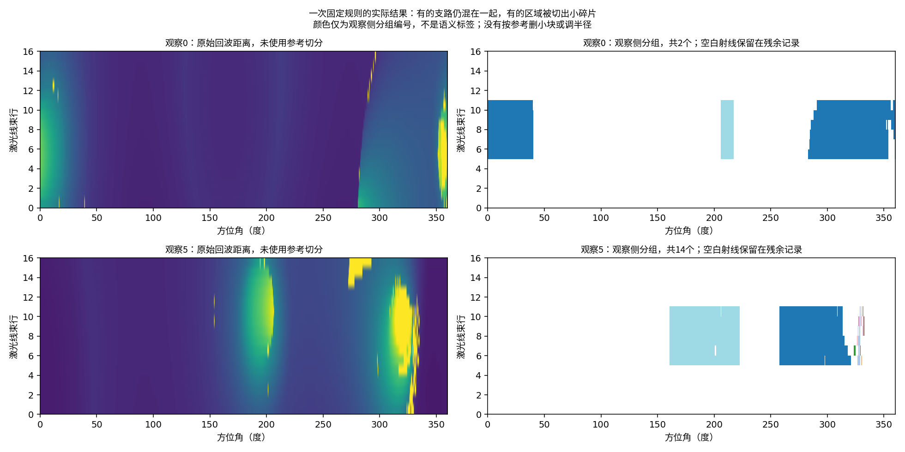

[逐组件大小、全部7条方向桥接证据及来源哈希](figures/gse_conditional_geometry_fit_v1/direction_decomposition/attribution.json)。本轮的实质进展是保留了被过早压缩的局部证据，并用一次完整回放排除了“只靠局部边界连通就能识别支路”的捷径；不是几何关系优势成立。下一步必须检验面片表面方向、相对布局及射线深度结构是否提供分隔依据，不能再把连通组件直接改名为语义通道。

## 2026-09-13：实际改接线并回放，发现“先把两条支路压成一个候选”的瓶颈

这轮不是再训练轴向。对同三个固定fit父地图、24帧、12观察，复用全部模型缓存，实际执行了“方向候选→A/B/C或位姿方向描述→同一匹配规则→任务账本→独立射线证据评分”。预测先完整落盘并冻结，再打开构造文档生成参考，不用参考筛选预测。四方法共用双向唯一正余弦匹配；并列、无描述等保留新provisional任务，不生成物理边。该匹配规则是固定工程诊断，不是已校准部署关联器。

### 改了什么，怎么测

1. 新参考不凭“相同source编号”认定通道。对10米观察域内的构造交汇，使用出域轴线与局部截面的关系；只有首回波之前确实穿过截面内切圆的射线才是见证。多个截面竞争、无见证继续未知。相反端点分别保留，回穿、多重边界交点不强修。**这只是部分构造条件截面参考，不是完整结构真值、地面可通行或合格训练标签。** 当前只用最新帧判断射线见证，模型仍使用原五帧；没证据不能处罚为背景。
2. v1运行发现旧候选支持范围有可复现偏移：检测器已经给了实际扇区起止列，旧接线却以峰值为中心重画相同宽度。例如观察0多取21列并漏21列；观察2多38列漏37列。新增`observed_direction_proposals.py`按真实循环起止列取支持，**不改峰值、阈值、候选数量、模型、匹配或去重参数**。新版本v2单独重放，v1产物原样保留。
3. 27项相关测试通过，包含非对称峰值、跨0度扇区、首回波阻挡、上下层截面、竞争见证、未知保留、匹配唯一性及历史前缀不变。

v1与v2运行均正常退出，v2用时1.202秒，41项seal独立核验；均零训练、零新模型前向。v2路径：`results/gate3_semantics/gate3_20260913_gse_direction_task_witness_replay_v2_seed0`。

### 结果与具体瓶颈

| 同一12观察的结果 | 位姿方向 | A观测 | B面片 | C关系 |
|---|---:|---:|---:|---:|
| 候选总数 | 19 | 19 | 19 | 19 |
| 有唯一条件参考／未知 | 6／13 | 6／13 | 6／13 | 6／13 |
| 账本最终创建任务数 | 6 | 6 | 6 | 6 |
| 与C不同的逐观察账本结果 | 0 | 0 | 0 | — |

四方法仍无决策增益；这不是新模型成功。条件评分器的14个“参考实例未恢复”包含未赋单标签的竞争候选，**不能称为真实漏掉14条通道**；其零错并也不能证明安全，因为只有6个候选获得唯一参考。

更重要的是：**7个候选各包含两组不重叠的射线，分别见证两个不同参考支路。** 它们来自两个路口的相邻观察，不是7个独立路口。修正支持范围后仍存在，故不能全部归咎于mask偏移。比如观察0的同一候选中，有424条射线支持一条支路、570条支持另一条，交集为0；观察8为510与477条，交集也为0。

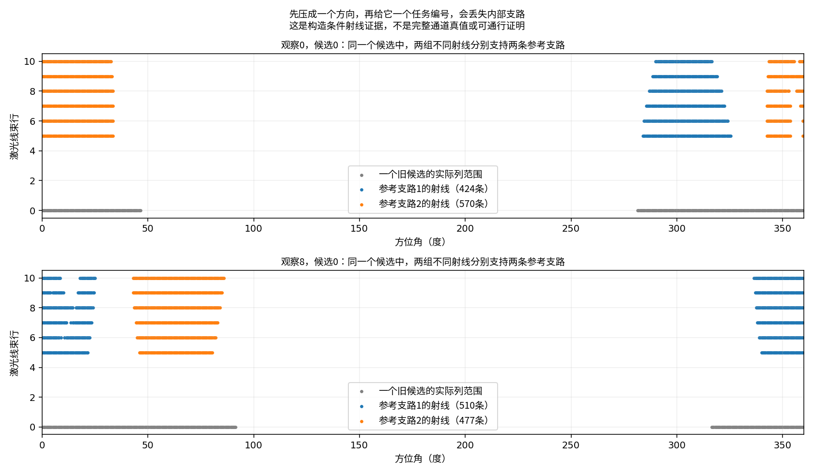

在这个有限参考定义下，12观察共有20个观察—截面实例；即便把单标签选择器换成理想匹配，每个候选最多一个任务时也最多恢复13个，仍缺7个。这是**当前接口的条件性上限**，不是整个方法的信息论不可能，也不代表真实地图只有20条通道。[逐候选依据及上限](figures/gse_conditional_geometry_fit_v1/task_bundle_attribution/attribution.json)由完整封存结果推导，不是模型分数筛选。

### 因此怎样改主线

旧做法是先把一个宽方向区域汇成一个向量，再让向量选一个任务；如果区域里本来有两条支路，后面的评分器没有输出两条的接口。**接下来必须在压缩前保留射线与几何面片的局部关系，先形成可分开的支路表示，再判断跨帧对应。** 不用GT把模型输入切好，不通过修改未知标签给单任务头续命，不增加轴向训练。现有编码器/面片/缓存/账本继续复用；观察侧支路分解与其公平对照尚未实现，不能把本轮证据补充包装成已经学会结构。

## 2026-09-12：电脑交接前的新片段 GPU 计算完成

新运行 `gate3_20260912_gse_direction_task_model_cache_v1_seed0` 已实际完成（session43147，退出0）。复用三个固定fit父地图、24个原始帧、12个五帧观察，不读取新的世界。12次公共编码＋36次A/B/C前向全部完成，用时5.536秒，峰主机内存1,873,555,456字节、GPU reserved 140,509,184字节。保存10,828个观察内面片及完整公共特征、关系输出、支持范围；重复观察面片不计作独立实体。零训练、零教师载荷进入前向，encoder及三个模型状态未变。结果约81 MB，可在CPU上继续处理，不必重跑5090。

这仅是硬件依赖计算交付，不是任务对应、建图或方法优势通过。下一关键工作仍是独立的“同一有向通道任务”观测证据及相同账本比较；不能把未受监督的对应头当连接概率。

另外核实旧2,880例条件几何参考任务：进程已不存在，日志记录2,379个唯一完成case（0—2378），无最终summary，状态文件遗留RUNNING。记为“进程缺失、终态未封存”，不宣称全部完成、不修改旧run、不重启全批；退出原因尚未确定。这批轴向/高差参考也不等于任务对应标签。

交接包工具 `tools/v3/package_direction_task_cache.py` 只复制上述已封存输入、权重、源码快照、特征、预测和当前图片，并逐文件验证。包位于 `docs/exports/gse_direction_task_portable_20260912.zip`；同磁盘副本不是异地备份，必须在失去电脑前拷走。

## 2026-09-12：开始直接验证任务对应，先建立可计量后端与真实路口片段

用户“所以开始做啊”后，本轮不重跑旧直道、不追加轴向训练。新实现`DirectionTaskLedger`将“方向任务是否复用”从“三方向才产生地点”和物理图连边中分离：两方向通道也登记任务，未匹配明确建立provisional任务；匹配只继承局部任务编号，不声称地点合并或物理可达。每个输入候选都有记录；上一帧不存在的匹配、跨片段匹配以及夹带真值字段的输入会被拒绝，历史记录不可事后改写。

独立评分器只在外部有参考的部分记录未恢复任务、同时重复任务、跨帧任务碎片以及错误合并；未有参考的候选单列unknown，不作为背景或偷偷删除。参考不进入在线账本。评分器要求调用者提供参考来源，但非空来源字符串本身不认证真实标签，真实数据仍需独立对应证据。

8项新增任务维护测试和7项已有token接口测试共15项通过。一个纯软件夹具中，两方向连续3次观察若每次另建任务，会形成6个任务、4个额外碎片；正确对应留下2个任务、0碎片；强行合并两方向则被独立评分器计为错误合并。**这只证明后端确实会响应对应结果，且指标能揭露错误，不是模型成绩或真实场景优势。**

### 新的真实数据不是上一条直道

从旧封存的路口—终端共域索引，按固定seed20260912及稳定SHA顺序选首3个不同fit父地图；不看模型分数。每片段4连续五帧窗口，单片段8个唯一原帧：

| 父地图（均ellipse实现、训练区） | 原帧行 | 原序列行 | 原参考路口 |
|---|---|---|---|
| S08_3d_loop_rich_C01 | 436—443 | 276—279 | node_0018 |
| S04_3d_unicyclic_small_C06 | 1878—1885 | 1374—1377 | node_0063 |
| S08_3d_loop_rich_C06 | 184—191 | 140—143 | node_0004 |

合计3父地图/3独立片段/24唯一帧/12观察，不把重叠五帧计为60独立帧。它们由几何共域索引选择，属于有意覆盖路口附近的开发pilot，不是随机测试集。原索引`visibility=NOT_EVALUATED`原样保留，**附近有路口不能自动变成该窗口看见了全部支路**。

`gate3_20260912_gse_direction_task_pilot_inputs_v1_seed20260912`已实际导出完成，0.404秒、峰RSS435351552B，43项seal独立全验证。3任务约4.83MB块解码；原扫描与相对运动保存为student，绝对位姿、构造、codebook和来源回波保存为独立证据，逐窗口原始身份/运动/来源检查通过。0标签、0模型前向、0训练，终态`GATE_MIXED`仅代表证据导出。

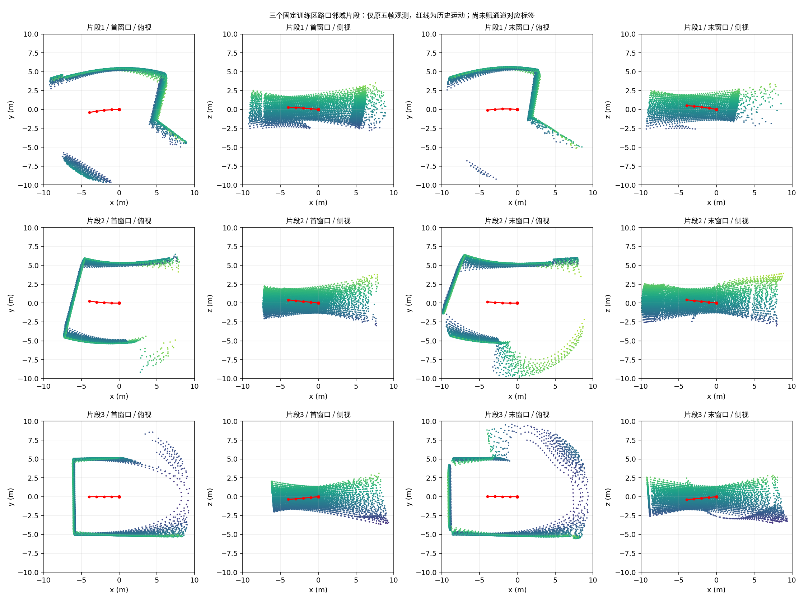

图为六个固定首/末窗口的XY/XZ，红线为历史运动，颜色为当前传感器坐标下高度；固定10米显示范围、每5点显示1点，计算输入不删点。三段原始观察已经可查看；本图不是人工/AI已确认标签。

**当前下一步**：针对这3个固定片段，使用已分离构造和射线证据确认稳定物理任务身份与当前观测支持，记录竞争对应和未知；不能把同source、最近角度、模型最高分或本次方向上下文权重直接改名为任务真值。参考明确后，用同一账本比较无关系与有关系输出造成的重复、漏失和错误关联。没有扩大人口、追加训练或跳到自主探索。

## 2026-09-12：新面片关系模型已运行并接到方向检索，优势仍未成立

本次用户要求“要跑啊新的方法”，因此不再把旧表面基元拟合作为新方法运行结果。实际加载现有`GeometryStructureEncoder`的冻结A/B/C最终权重：A观测特征、B增加面片自身几何、C增加稀疏关系传播。三组原来只接受构造条件轴向/高差监督；对应logit及截面等未受对应监督的输出不能解释成可用连接概率。本轮不使用这些logit合并图。

### 实际做了什么

同一C07 S03 ellipse单穿越12帧、8个五帧窗口，复用上一运行全部32个距离方向候选，不运行旧基元拟合、不换候选。执行8次冻结公共编码器、24次ABC前向，保存全部局部token、区域向量和关系输出。它们通过新`structural_task_tokens.py`接入方向候选的特征记录和相邻窗口检索，作为共同位置图的任务属性保存。**位置骨架仍是原2节点/1连接；新表示没有改变已验证连接，也没有产生自主执行或回环。** 输出`metric_graph`保留原骨架及其历史轨迹，不能把其中旧前端决策当作本轮新模型决策；本轮新结果在独立`task_context_history`及`retrieval`字段。

第一次接线`gse_structural_token_chain_v1`在2.187秒完成，约1.77GiB主机内存/134MiB GPU保留显存，70项seal核验通过，0训练。原直接射线映射对三组都是32未知/0支持。证据是候选8394次回波曝光全部超出10米面片域，最小距离12.117m：朝开阔方向的射线不命中近处表面，而相关表面位于方向两侧。**这定位到我新写的取特征接口，不是24次网络前向失败，也不是整条几何路线失败。** 旧零支持记录保留。

只做一次显式接口纠正`gse_directional_context_readout_v1`：复用上述所有token，取方向正半空间中已有面片，按面片中心方向与候选方向的正余弦加权汇集，归一化成128维方向上下文。仍为原10米域，无新增半径/角度阈值，不训练、不重新前向，不使用真实节点或构造身份。这个人为定义的上下文汇集是接线规则，不是已学会的通道归属，也不是新论文贡献。7项软件测试通过，正式preflight与一次执行完成，0.851秒，38项seal全部通过。

### 新模型的实际输出比较

| 项目 | A：观测 | B：面片几何 | C：面片关系 |
|---|---:|---:|---:|
| 保留候选/有上下文候选 | 32/32 | 32/32 | 32/32 |
| 已保存相邻窗口检索分数 | 112 | 112 | 112 |
| 第一与第二名平均余弦差（不是正确率） | 0.00579 | 0.01150 | 0.02973 |
| 相对C，28次最佳候选选择不同的次数 | 0 | 0 | — |
| 确认地点合并/新增验证边 | 0/0 | 0/0 | 0/0 |

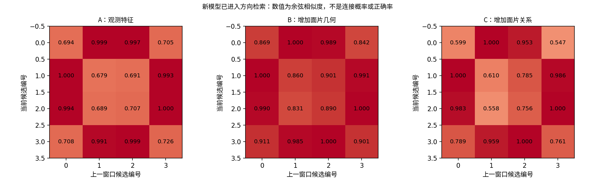

图固定展示最后一次过渡，没有挑选更好样本。候选编号是各次观测的局部顺序，不是物理通道编号，最佳值不在对角线不等于错误。C的候选分差更大，但三组实际首选完全一致；这条直道上**没有出现决策改善，更没有结构图收益的证据**。不把分差增加写成关联精度提高，不宣称归属头已训练好，不以32个非空向量宣布主方法完成。

### 当前结论与下一步界限

“新方法完全没跑”现在不再准确：冻结的新面片关系模型已经跑了，输出已进入方向上下文及检索接口。“新方法已验证优于基线”仍然不成立。该例只提供直道上的接线结果，不能验证相似路口、真实分支、上下分层或重访歧义。后续需要有明确对应参考的歧义场景同后端比较，不能继续重复本直道、仅优化余弦间隔或追加种子，也不能把几何上下文权重本身当作对应真值。

两次均记`GATE_MIXED`，研究主目标未完成；所有原失败、权重、旧图和论文图片保留。

## 2026-09-12：真实扫描短片段已经贯通，研究主方法尚未贯通

这次不是又做了一轮训练或理想夹具：从原封存 C07 S03 ellipse 扫描中，读取同一有向穿越的12帧，按真实帧行号构成8个连续五帧窗口，运行已有几何前端，再把输出交给共同任务维护组件。原帧120—131、序列80—87，只有1父地图/1独立片段。时间字段明确是顺序编号，不是实测秒数。**这是程序化扫描的给定位姿回放，不是机器人已经自主走过，也不是完整地图的探索。**

### 实際执行结果

运行：`results/gate3_semantics/gate3_20260912_gse_short_observation_chain_v1_seed0`。21项已有组件测试和preflight通过，一次创建/执行，8/8窗口完成，0.901秒，峰RSS约414MiB；24项封存哈希独立核验通过。0新标签、0训练、0检查点选择。冻结准备时发现旧抽样清单缺后4帧所在chunk的hash，改为从原归档seal绑定；没有替换帧或改任何算法，正式运行前即已解决。

| 同一输入、同一任务后端 | 原距离扇区 | 原观测表面基元拟合 |
|---|---:|---:|
| 每窗口候选方向 | 4 | 2 |
| 8窗口方向提议总数（不是独立通道数） | 32 | 16 |
| 后端保留的多方向观察地点 | 2 | 0 |
| 触发三方向事件的窗口 | 8 | 0 |

共同位姿骨架产生2个位置锚点、1条片段内记录连接。它们由固定4米行程规则产生，不是网络发现的路口，也不作为几何方法成绩。基元前端8次都返回1条表面拟合轴，每条轴给出两个延续方向；不是8次拟合数值失败。后端需要至少3组方向才产生多方向事件，因此其0地点来自这个明确决策链。原前缀重放决策逐项相等，完整运行没有改写先前决策，未拼接其他穿越。

### 直接看输入和输出

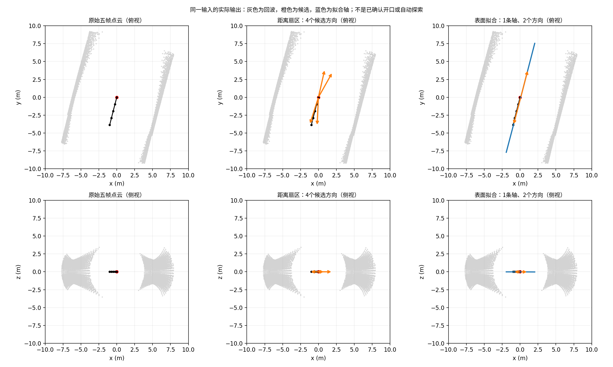

灰色是原五帧回波，红点是当前传感器位置，黑线是过去位姿，橙箭头是候选方向，蓝线是拟合基元轴。固定选择第0窗口，不按模型效果挑图；完整局部回波33818点，显示时固定每5点取1点，计算和保存输入没有减样本。

图中可见近似直通道的表面，距离扇区给出成对分开的前/后候选，基元则压成一条双向轴。**这提供了“几何组织可能减少同通道候选分裂”的具体可视机制，但未读取完整结构真值，所以不把4→2直接计作消除误检，也不能由一个直道片段证明不会漏路口。** 后端的多方向地点也不是已确认物理路口。

### 哪部分真的做完、哪部分还没有

- 已实际完成：封存扫描→五帧配准→旧基元拟合→候选方向→任务状态→给定位姿图输出；可逐帧追踪、可复现。
- 本轮没有完成：新面片关系编码器到任务方向的接线、结构正确性公平比较、真实机器人执行反馈、配准回环和多机器人探索。旧基元前端只是可运行参考，不偷换为新隐式关系方法。
- 下一工程缺口已经缩小为：将保留局部token的结构输出接到这条已运行的候选/任务接口；同时把“方向任务维护”和“至少三方向才建观察地点”分开，避免普通通道没有多方向事件就被理解成没有任何探索方向。变更应独立记录，不改本次冻结后端或重跑本片段凑收益。

本项终态为`GATE_MIXED`，完整论文/闭环目标仍未完成。历史轴向、中心评分和标签失败不被本次工程接线覆盖。原2880条件参考任务继续原规格运行，不作为此链路执行前置条件。

## 2026-09-12：最小结构评分参考合同与当前缺口

参考必须分三层，不能用其中一层代替其余两层：

| 要评价的结论 | 最低需要的独立证据 | 现有证据及可说范围 |
|---|---|---|
| 可见通道方向有没有漏失/误报 | 同一五帧内，逐方向的可见范围、位置/方向参考、明确正例、可排除区域和未知区域 | 有带来源与射线支持的窗口截面条件参考；不等于完整开口真值，未匹配输出不能全部记错 |
| 哪些方向属于同一个局部结构 | 可见部分对同一真实结构的对应证据；竞争结构必须保留，未知不能补负 | joint-reference代码保留部分直接射线对应；使用构造身份作条件参考，不能自动晋升独立可见结构认证 |
| 图中哪条连接应恢复 | 同一真实连续片段的观测、位姿、进出任务和实际穿越记录；评分身份与模型输入分离 | 240开发观察是独立抽取的五帧窗口，不是完整连续路线；禁止按真实边编号排序补连接 |

原`gse_joint_partial_targets_v1`摘要复用：30观察导出结束，labels=0/scientific_gate_pass=false。后继v3/v8生产器源码虽然能产生更细的部分参考，但仍显式记录`PARTIAL_REFERENCE_GEOMETRY_ONLY`、`full_training_gate_eligible=False`，缺失项包括开口归属、完整评分区域和参考质量。**代码中有字段或布尔值，不意味着它已经在当前目标人口上获得独立资格。** 本次不执行旧生成器，不重新AI标注，也不擅自改这些标志。

可复用的是原始观测、参考提议与来源索引；真正需要补的是对应结论的独立确认依据，而不是再生成一批同类候选。可行分支应明确区分：

1. 若取得独立确认的结构参考，按上表绑定少量正/负/未知及连续片段，再执行完整结构对照。当前没有可宣称已取得的参考。
2. 若明确改成“程序构造条件下的局部开口/对应诊断”，可复用部分参考开展有限比较，但必须撤回独立可见结构/完整图正确性的成功主张。这是研究合同改变，不是修复一个字段或把候选改名。

当前受影响的结构验证停在这项证据缺口；此前方向分析已结束，不能通过追加相同分析保持表面进度。持续目标尚未完成，原参考生成照旧运行，但它输出的条件几何量不会自动填补以上结构参考。

## 2026-09-12：现有组件为什么还不能直接拼成有效结构对照

已读取当前实现及旧封存摘要，没有重跑。`geometry_constrained_tasks.py`把水平范围峰值作为候选，仅用基元轴线差分的方向是否接近候选来筛选；基元位置不参与此判断，目标位置仍由机器人位置与固定前视距离生成。它可以保留为旧方向过滤参考，不能承担“几何空间组合帮助建立结构”的主方法。`GeometryBranchPlaces`能融合候选任务，但不提供正确结构归属或确认物理边。读取这些代码不等于已经执行新建图实验。

评分证据也不能直接复用为完整答案：原30观察窗口开口结果有63候选、60部分支持，但明确记录labels=0、scientific_gate_pass=false；原3例AI复核有6个提议，明确training_qualified=false，原因是几何质量尚未独立确立。这些历史结果保留其原义，不重新审计、改名成确认标签或当作GT过滤模型输出。

因此当前受影响的结构优劣比较，确实缺“哪些可见方向是有效通道、哪些归属于同一局部结构”的可评分依据。不能把方向更一致、空气相连或候选任务更少当成正确结构恢复。下一必须明确最小结构参考的来源、可观察条件与未知范围，再执行对照；在此之前，不直接接图宣布完成，也不追加训练。

## 2026-09-12：绝对方向检查推翻“相对改进等于方向更准”的解释

仅复用原240观察的保存方向，并读取同一批已封存条件参考的方向和对应索引；没有重新预测、重新生成标签或修改原验收。源码确认原参考方向已经旋转到当前传感器坐标系。新增统计是事后诊断，不替代原相对夹角主评分；每条原关系的权重均分到两端，未知参考仍不评分，未定义方向计90度。

| 无向绝对角误差（度），越低越好 | 点坐标方向 | 面片法向组合 | 固定机器人前方 |
|---|---:|---:|---:|
| 全部已知关系端点，逐父平均 | 42.24 | 46.75 | 11.23 |
| 跨构造片段关系端点 | 39.19 | 52.31 | 11.61 |

**法向组合相对夹角误差下降约51%，但绝对方向反而更差。** 两个输出一起旋转，彼此夹角可以不变，因此相对夹角评分不能排除“一起朝错方向”。固定前方强也说明这批沿隧道移动、传感器朝向与通道相关的观察存在明显方向先验，不等于固定前方方法能识别全部出口或地下结构。

同一批保存谱/中心的最后一次支持分析：跨片段54.76%评分权重至少一侧法向散布最大特征值占比≥99%；39.79%两侧均如此。两侧邻域中心半径都<1米的权重77.68%，较大半径平均.93米。这是法向集中度和面片中心范围，不是“墙面数量”，也不是完整回波支持半径。原条件参考中心距受评分面片中心平均6.20米（跨片段6.47米），其中包含隧道截面半径、纵向距离等因素，**不能仅凭这个距离判定教师错误或尺度不一致**。

现有证据足以停止把POINT/NORMAL当合格通道方向底座，不再对相同局部邻域追加训练、阈值或拒绝规则。它只揭示小邻域表面统计与通道轴向不是同一对象；没有否定更大范围的几何结构关系学习。完整目标也尚未完成：这里没有通道列表、开口归属或已穿越边恢复结果。

接下来应围绕已观察开口候选与结构任务接口推进，而不是继续救每面片一条轴线的代理任务。已读代码确认现有RangeExitBaseline为水平范围峰值参考（不能直接代表三维分层方法），GeometryBranchPlaces接收三维continuation和来源证据，但不认证物理连接；它们只能作为复用组件，不能直接拼接后宣布图验证成功。

所有新读文件SHA、逐例误差：[absolute_axis_diagnostic.json](figures/gse_conditional_geometry_fit_v1/observation_axis_comparison/absolute_axis_diagnostic.json)；支持诊断：[support_diagnostic.json](figures/gse_conditional_geometry_fit_v1/observation_axis_comparison/support_diagnostic.json)。原运行及其GATE_MIXED保留。

## 2026-09-12：为什么相对改善后仍不合格——完整输出错误分解

这次只读取已封存480份预测，逐份校验哈希，没有重算方向或改评分。固定按参考夹角0/5/15/30/90度，以及相对特征值间隙0/.01/.1/.5/1分组，分组只用于解释，不能用于过滤推理输出或挑成绩。

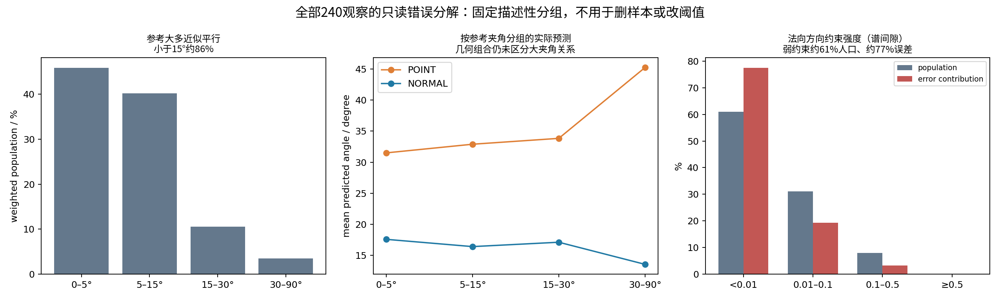

跨构造片段统计按原权重、先观察后父地图平均：

- 85.94%的参考夹角小于15度，平均参考夹角8.48度；这解释常数平行的强表现，不是常数方法理解了分叉。
- 在参考夹角0—5度组，POINT平均预测31.50度，NORMAL仍预测17.58度，说明局部方向波动很大。
- 参考夹角30—90度组只有3.49%评分权重，NORMAL平均预测13.55度，POINT为45.24度。NORMAL整体误差较低不等于在重要的大方向差异上更好；该小组两者误差分别.33415/.33245，NORMAL并未胜出。不能依据小组结果选新阈值。
- NORMAL约60.91%权重的相对谱间隙低于.01，贡献77.41%的总跨片段误差。现有valid只排除数值非唯一解，不保证物理方向可靠。单面/近同向表面可能使通道轴约束不足，但本统计只是相关证据，尚未逐例证明唯一原因。
- 相邻受评分面片中心平均距离.767米、邻域点支持平均约246点；这些点来自局部邻域，不保证包含多面通道布局。点数多不能替代方向多样性。

**当前应优先定位局部邻域究竟看到了几种表面方向，以及它与构造参考代表的空间范围是否一致，而非加训练轮数。** 两条方法共享局部支持，POINT容易跟随点分布形状，NORMAL对不同朝向的表面支持不足时仍会产生不可靠轴向。不得把低谱间隙直接改成新拒绝阈值再报高分。该诊断也无法说明局部外形能识别全局连接。

完整逐例/逐父等权分解：[error_attribution.json](figures/gse_conditional_geometry_fit_v1/observation_axis_comparison/error_attribution.json)。下一只做有证据的支持范围与方向多样性定位；不重跑同一对照，不覆盖原GATE_MIXED，不将本分析标成结构/图收益。

## 2026-09-12：真实240观察的无训练几何对照已完成

这次不是合成图，也不是再训练。五个历史C07开发父地图、80条物理边、三种实现，共240个五帧观察。两条方法使用同一个面片及其8邻居覆盖的实际回波：POINT取点坐标分布最长方向，NORMAL用这些面片的法向共同约束轴向。参考仅在全部预测之后打开，不给算法真实通道身份或教师筛选候选。

| 原评分：轴向绝对内积误差，越低越好 | 点坐标主方向 | 面片法向组合 | 固定全部平行 |
|---|---:|---:|---:|
| 全部已知关系，逐父地图平均 | 0.220975 | 0.108199 | 0.012325 |
| 跨构造片段关系 | 0.228189 | 0.130458 | 0.025537 |

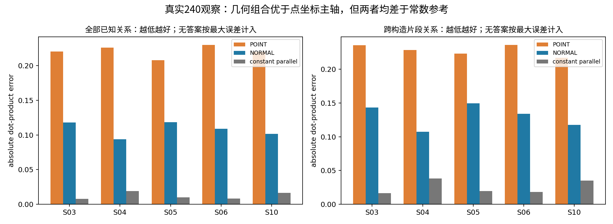

**几何组合相对点坐标基线确有约51%的误差下降，但两者都远差于常数参考，不能宣布方法有效。** NORMAL加权有答案覆盖99.823%，无答案已按最大误差1计入，改进不是靠大量拒绝。误差是方向内积的无量纲差，不是角度，也不是检测精度。常数参考表现好说明这些条件关系大多接近平行，不能把大多平行预测正确当分支理解。

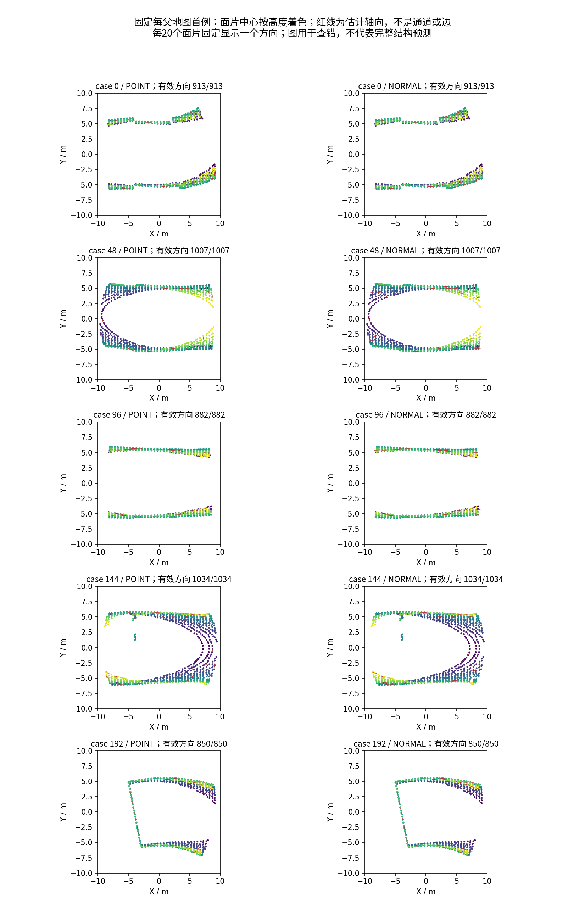

蓝绿点是面片中心按高度着色，红线是估计局部轴向，不是路口、边或完整通道。固定展示case0/48/96/144/192，每20面片展示一个方向，不按成绩挑案例。全部480原始输出均保存，包括所有方向、有效性、特征值、点支持数、原参考和评分掩码。

运行：`gate3_20260912_gse_observation_axis_comparison_v1_seed0`，标准预检零错警告，create/execute各一次，session27419正常结束；32.740秒、峰RSS约562MiB、0GPU/训练、493文件SHA独立核验通过。专用注册只在隔离副本完成，原参考运行的冻结源码没改；实际源码在新run的source_snapshot.zip中保留。历史结果不覆盖，结论GATE_MIXED。

下一分析保存输出中的方向波动及局部约束是否不足，区分估计器问题与条件参考尺度问题。不得重跑/调阈值选赢家，也不得将此条件轴向诊断称为可观察结构检测或图收益。完整持续目标仍未完成。

## 2026-09-12：反例定位与射线底座复用

**此前六例打平不能解释为几何方法无效，也不能作为有效算法对照。** 只读反例实际发现，两条共面路线都把相隔4.5米、仅有两侧点的输入判为局部连接；一个点加1毫米扰动、平地接坡面、见证采样平移1微米又都转为未知。原因分别是见证构造没有检查中间支持、要求精确共面、要求坐标完全相等。旧10测试只是理想夹具通过，不覆盖这些问题，原结果保留但不登记合格基线。

没有继续调旧探针。复用仓库已有 `gse_surface_ray_evidence_v1` 和 `gse_observed_regions`：首回波以前提供自由格证据，回波占据优先，未观测及边界歧义保持未知。输入不含表面身份或预先指定连接对；查询点只用于测试输出。原.25米网格、10米区域和数值规则完全不变。

实际执行新增 `test_connection_probe_ray_regression.py` 的8项测试，加上两模块既有47项，共55通过（0.48秒）。缺口不会补连，格内1mm及1um扰动不需要点坐标重复，三维折弯的空气观测证据可以连通；上下层、首返回冲突及边界射线保守处理。噪声结果仅限这组格内反例，不表示任意噪声下稳健。**折弯空气连通不是连续坡面可通行验证，仍没有车体包络与地面支撑证明。**

旧真实结果 `gate3_20260911_gse_saved_support_join_v1_seed0/metrics/summary.json` 直接复用，未重跑：window_0_crossing为2774条射线/5715自由格/1分量、surface_cells为0；interface_0_witness有5112射线/4分量，而entering/interior记录为空。这些是不同见证组，不能直接互作对应，但清楚说明自由格证据与结构/入口证据不是同一件事。不能把自由分量重命名为通道或路口。

下一实质验证应比较相同观测下的局部通道方向与布局组织，明确哪些原始表面/射线支持可评分；不再重复同类自由格重叠实验。本次没有新增实际模型或图成绩，没有修改正在运行的参考生成绑定代码。复现：`PYTHONPATH=src python -m pytest -q tests/v3/unit/test_connection_probe_ray_regression.py tests/v3/unit/test_gse_surface_ray_evidence_v1.py tests/v3/unit/test_observed_regions.py`。

## 2026-09-12：不训练的连接接口测试，尚非方法验证

本次先检查：给定理想的已观察表面和连接见证，几何表示接到连通处理之后，会不会把上下层接错、把未知补成连接。没有读真实地图，没有训练，也没有改变历史验收。

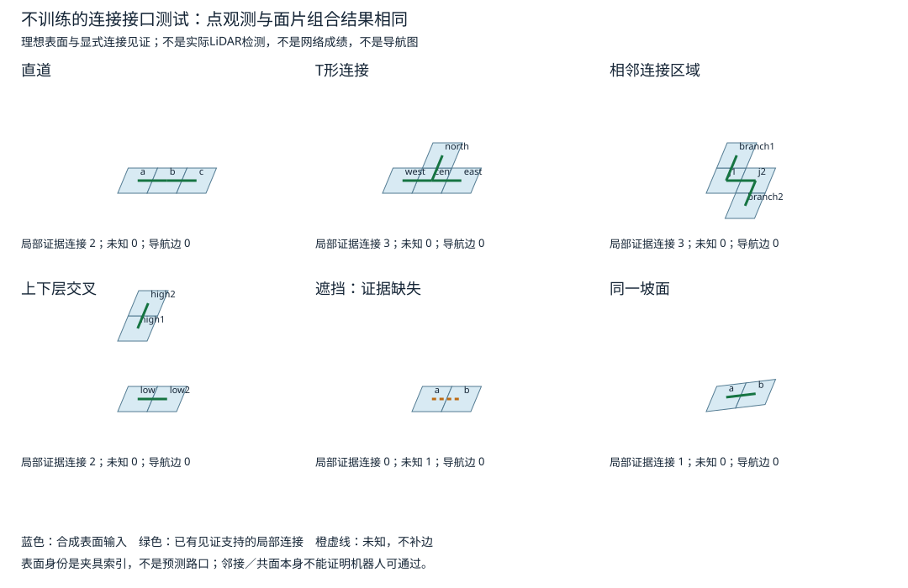

做法：一条路线直接对见证及两侧的点联合拟合平面；另一条路线分别拟合面片，再检查面片间方向与位置关系。两者要求相同的显式连接见证、相同共面条件，使用同一个连通分量处理。身份仅是合成表面的索引，不是网络找到的路口。见证由夹具提供，**本次没有实现或验证从稀疏激光中获得完整连接见证**；共面不等于可通行，输出不进入导航。

实际运行 `tests/v3/unit/test_observed_connection_probe.py`：10项测试通过（0.12秒）。六个展示场景是直道、T形连接、相邻连接区域、上下层交叉、遮挡和坡面。两条路线输出全部相同；分层保留两组，遮挡保留未知，所有确认导航边均为0。另检查输入置换、整体旋转、同观测不同隐藏地图以及前缀重放。这里只检查该纯局部函数的前缀行为，不代表既有机器人图系统整体通过。

**结论：软件连接接口可表达这些理想反例；几何方法没有在这批测试中显示优势。** 这不是检测、通道发现或建图研究成功，更不能作为论文对照成绩。点云到见证这一步仍缺真实验证；下一工作应绑定已授权真实观测的自由/表面证据，检验端口及连接推断，不应继续增加理想测试或重新训练来回避缺口。参考生成任务继续独立运行，不是本验证的前置条件。

逐例机器输出：[outputs.json](figures/gse_conditional_geometry_fit_v1/connection_software_probe/outputs.json)。复现：`PYTHONPATH=src python -m pytest -q tests/v3/unit/test_observed_connection_probe.py`；预览：`PYTHONPATH=src python tools/v3/preview_observed_connection_probe.py`。环境使用现有Torch sidecar Python，0 GPU/优化步骤。新文件独立添加，未修改正在运行的冻结代码。

## 2026-09-12修正版已获确认并实际运行，原边界样本完成

用户明确确认后，独立ROI修正版已启动（session46825）。28例完整结果原样复用，case28—31四例新增完成，当前核实32/2880。原失败case28保留冻结观测的32514个回波，76.05秒正常完成；没有删除边界点，也没有改变10米半径。该局部通过只说明已定位的接口故障解除，不代表整批或方法通过。

启动前发生一次由助手授权文件格式处理引起的hash错误：末尾多一个换行，0工作进程启动、运行仍未执行。确认去掉唯一换行精确等于原绑定hash后恢复文件格式，原规格和快照未修改，日志`logs/bootstrap_format_correction.json`保留。随后实际执行器完整hash检查通过并开始计算；原科学失败run不覆盖。

继续固定4CPUworker、24小时上限、8GiB输出；不追加训练，完整结束后才统计监督人口。以下PENDING/blocked段落为历史，以本节实际状态为准。

## 独立修正版已准备，等待本次执行决定

规格`configs/v3/gate3/gse_conditional_fit_roi_corrective_v1.json`保持2880观察、原算法及24小时/4CPUworker/8GiB输出上限；28完整例原字节复用并保存来源，其余2852例计算。不覆盖旧失败，不修改半径。复用器5项测试加既有18项，共23项通过。

数据卡明确PENDING，预检仅因授权字段缺失及对应检查未通过，未创建运行目录或执行计算。按当前失败合同，此修正版需明确执行决定后再刷新绑定并预检，不能把持续目标或软件测试自动写成APPROVED。旧GATE_FAIL保持；没有新的模型成绩。

## 修正接线与旧结果复用已验证，尚未启动新运行

参考worker新增独立选项`validated_frozen_student_roi_v1`，只更换输入人口的权威来源，不改世界表面匹配、截面参考或标签编译器。旧默认仍为世界距离裁剪；旧fit运行治理拒绝新策略，不能用旧spec偷偷改变行为。34项相关测试通过。

对完整case0—27，只读核验输入SHA、四项产物封存哈希、参考身份，以及来源记录/目标保存的ROI与冻结学生索引完全一致。28例满足同算法参数下复用条件；partial28—31不符合完整性条件，全部排除。记录见[复用资格清单](figures/gse_conditional_geometry_fit_v1/completed_reference_reuse.json)。没有重新匹配表面、生成标签或训练。

下一步仅形成独立修正版规格并记录旧产物来源，后续执行还需该修正规格的明确授权。旧GATE_FAIL保持，不覆盖、不把复用资格说成2880例已经完成。

## 边界接口修正：软件测试通过，尚未恢复真实计算

新增`validated_frozen_roi`，从已冻结注册坐标和有效回波掩码复核原10米索引，然后返回只读副本。参考侧不能再用世界坐标另选一遍输入人口。它不放宽半径、不自动修补索引、不读取模型分数或标签。

12项新合成测试覆盖已记录边界反例、恰好10米包含、10米下一浮点排除、float32原范数合同、空观测、漏点/重复/错序/额外索引及无效输入；连同6项已有批读取测试，共18项通过。未读取新真实样本、未生成标签、未接入实际worker。原GATE_FAIL保持，已完成28例保留；下一独立版本接线并明确哪些旧结果满足原输入和索引完全一致而可复用，不能把软件测试当真实2880例已经恢复。

## 最新：参考生成遇到边界数值接口错误，已停止，不是训练失败

原`gse_conditional_fit_geometry_v1`在case28退出，完成28/2880观察，耗时554.038秒，峰全进程RSS760623104字节；158个封存文件SHA全通过，所有worker结束。保留`GATE_FAIL`，没有重跑或训练。

只读检查case28（S01_flat_tree_small_C01__ellipse）的既有来源记录、冻结坐标和输入，唯一不同回波索引为44370：

| 同一回波 | 计算距离 | 10米裁剪结果 |
|---|---:|---|
| 参考侧原世界点相对当前原点 | 10.00000023306973米 | 排除 |
| 特征侧冻结注册点 | 9.999999869419094米 | 保留 |

分别重算两侧选择，都与其记录一致。参考32513点、特征32514点，仅此一点相差；约0.36微米的距离差改变了离散集合。故障是同一观测域经两条数值坐标路径分别裁剪，不能说明几何学习失败、身份错误或资源不足。

建议的定点修正：参考直接使用已冻结学生观测索引作为人口，原世界点仍用于原表面匹配。半径仍10米、不删点、不改监督定义。下一先以隔离软件测试验证此合同，不自动重跑；真实修正版必须有独立规格/授权，旧失败不覆盖。已有公共特征和来源证据不需重新生成。

## 完整拟合人口的条件参考计算已启动

`gse_conditional_fit_geometry_v1`已通过22项相关测试、4项范围拒绝检查与预检，一次执行（session79197）。固定2880观察/60父地图，复用已完成公共特征和来源证据；算法保持原表面匹配、singleton弧段组件、中间slab参考及未知编译器。只增加旧任务批缓存的路径/索引适配，未更换监督。

首例59.53秒完成，707面片、31212局部返回，5096项已知有向关系（72项跨组件）、560项未知；这只是初始进度，不代表完整人口成绩。4个CPUworker，总墙钟上限24小时、输出8GiB；按开发人口实测外推约14.83小时，不能当完成承诺。无模型推理或训练，完整生成后才报告有效关系、未知和独立父地图覆盖；不把2880个输入直接当2880个合格结构标签。

## 参考来源也已齐备：未改监督，尚未新增训练

来源证据导出`gse_conditional_fit_evidence_v1`完成全部2880观察，24.0166秒，峰RSS427876352字节、产物222191593字节，3252个封存文件SHA全部通过。每例保留原float64绝对位姿、朝向与来源编码，按原精度核对相对运动，并核对来源码与回波有效性；没有重新写入已有学生输入。

25项相关测试通过、预检通过。当前已齐备公共特征和原始参考证据；它们还不是新生成的几何标签，更不是训练或泛化成功。下一步适配同一个构造条件参考计算器的缓存路径/批内身份，并明确全量计算预算；保持原中间slab参考、未知规则及条件监督含义，不恢复整圈资格审计，不启动旧评分头或建图。

## 公共训练输入特征已全部完成（不等于新模型已训练）

`gse_conditional_fit_features_v1`一次完成2880/2880观察，耗时866.87秒（14分27秒），保留2366216个面片、99928912个局部范围内返回；总有效返回162167496与旧输入统计一致。输出12723227513字节，峰主机内存1.761GB、GPU保留内存约132MB。全部2892个封存文件SHA-256独立校验通过，原执行和核验进程均已结束。

使用的仍是同一个冻结五帧编码器和相同面片算法，权重未变；构造标签读取与训练更新均为0。此结果只证明共同输入缓存完整，不证明几何关系已能泛化、建图或探索。此前240例开发结果及其失败分析不改写。

下一步使用已核实的缺失字段清单，独立冻结来源/原始位姿证据导出，复用已有学生输入和这份公共特征；不重复提取、不立即全量生成几何参考或开始训练。以下运行中进度保留为历史记录，以本节终态为准。

## 输入缓存复用已接线：不用再导出整份学生输入

实际公共特征导出已启动并继续运行（session80194，最近核实759/2880、227.59秒），尚未封存，不能登记完成。等待期间只读完成缺失参考字段的540个数组头核验，精确块解压1304958144字节；范围见`configs/v3/gate3/gse_conditional_fit_reference_source_scope_v1.json`。位置、朝向和来源编码只进参考生成侧；360个构造/codebook文件仅绑定旧seal哈希，未读载荷。本范围不是新标签或训练许可。

旧封存输入清单与60份训练选择逐条一致：180个任务缓存覆盖2880观察，文件大小合计574163027字节。旧导出记录有效返回162167496个；这是历史记录，本次没有重新解码点云计数。每条观察绑定缓存SHA、任务内行号、五帧索引及源序列号，见[精确缓存绑定](figures/gse_conditional_geometry_fit_v1/fit_cache_binding.json)。当前仅核验元数据与seal记录；真实运行仍须校验每份缓存内容SHA，不把元数据一致说成已复验载荷。

学生输入可复用距离、有效掩码、相对平移和相对朝向。构造参考仍缺来源编码、原绝对位姿与原始构造表面，必须单独绑定读取范围，不能把这些真实身份送入网络。无需为了缺这些参考字段重新导出已有学生输入。

新增完整任务批读取接口：一份16观察缓存只解压一次，逐行核对身份后仅返回四个学生字段；不允许暗中读取未声明的批内样本。6项纯合成测试通过，包括与旧逐观察读取完全一致、只读数组、部分人口/顺序错误/身份错误/哈希错误/混合任务拒绝。未执行真实特征前向或训练。下一步冻结公共特征缓存的数据卡及有界执行规格，并独立规划缺失参考字段；不自动启动全量参考或扩训。

## 后续人口与成本：有现成训练观察，但不是现成合格结构标签

只读核验旧冻结C01—C06的60份选择文件，全部SHA-256与原封存一致；不读取点云、构造或模型载荷。实际为60父地图、960物理边、180几何实现、2880个五帧观察、14400个不重复的实现内源帧。首段／中段／末段观察分别1080／900／900。三种几何实现不是三个独立父地图，独立结构数量及有效关系数量仍未知。清单见[人口核验记录](figures/gse_conditional_geometry_fit_v1/fit_population_metadata.json)。

这说明无需重新生成整套地图，却不说明可以把2880例直接登记为合格标签。旧12例主要是有限拟合人口，重复曝光并不能替代这些不同结构。原记录是独立穿越片段，不能按真值身份拼接成连续探索；五帧实际时间和历史空间间距未由本次身份元数据确认。

按已完成240例的同实现实测吞吐线性外推，全量公共特征约872秒、12.80GB，构造参考约53378秒（14.83小时）、4.21GB。**这是成本外推，不是新运行耗时、资源保证或完成承诺**；训练成本尚未测得。主要已知耗时是CPU来源参考计算，不是GPU。下一步先确定旧输入缓存能否等价复用、精确读取范围及有界运行规格，不自动全量导出或训练，不改监督/网络，不把增加数据视为必然解决迁移失败。

本次新增训练、推理、标签均为0；当前GATE_MIXED和“尚未合格建图基线”的结论保持。

## 接线与曝光结案：不是高差头没接上，有限拟合不能替代训练人口

本次只查原封存采样顺序、12例目标、三个最终优化器状态及与运行一致的源码，**不前向、不训练、不改标签**。结果保存于[接线与曝光记录](figures/gse_conditional_geometry_fit_v1/training_wiring_audit.json)。

- 三组都完成原2000步，高差输出权重的Adam一阶、二阶矩非零。位置进入131维观测适配输入；B/C读取面片自身几何，C的三层消息读取相对XYZ等关系。高差读出与损失之间没有detach。没有找到“高差没训练”或“位置被漏掉”的证据。
- detach仅冻结输入特征/几何数组，不阻断新增适配器和关系头参数。反对称高差读出会消去最后一层bias，其零梯度是代数结果，不是权重通路断开。区域池化向量虽被输出，但当前关系损失不消费它，不能声称区域结构表示已经独立验证。
- 原12例每例出现666—667次，共8000观察曝光；新增独立观察仍是零。训练目标质量权重中，同组件/精确零高差约58.33%，跨组件约41.67%，高差幅度至少0.1米仅21.87%，未知为0。后者只是描述阈值，不改变损失或验收。
- 非零权重更新证明不是完全未学习，不证明每一步梯度均有效，更不证明某个唯一泛化根因。结合原23不同组件对上的良好拟合与开发近零输出，当前证据更符合有限人口记忆/覆盖不足和任务表示泛化失败，而不是修一根断开的接线就能解决。

**不再续训这12例，不加种子，不调高差比例，不以此宣称几何路线不可行。** 下一步先基于已有冻结C01—C06身份清单核实可用于同定义任务的训练人口及成本，形成有依据的单次后续候选规格；不直接导出新标签或开始扩训，不读取C08—C10。如果需要改变监督含义或输入，必须作为明确的新方案记录，不能伪称软件修复。

## 最新定位：高差输出在开发地图上退回近零，不只是量程变大

仅复用原12例与开发240例保存的参考/预测，**0模型前向、0训练、0新标签**。

| C模型的同权重统计 | 原12例拟合 | 开发240例 |
|---|---:|---:|
| 参考高差绝对值均值 | 0.3493米 | 0.4761米 |
| 预测高差绝对值均值 | 0.3501米 | 0.0271米 |
| 预测幅度／参考幅度 | 100.2% | 5.7% |
| 高差方向符号正确率（参考幅度≥0.1米） | 99.5% | 52.1% |

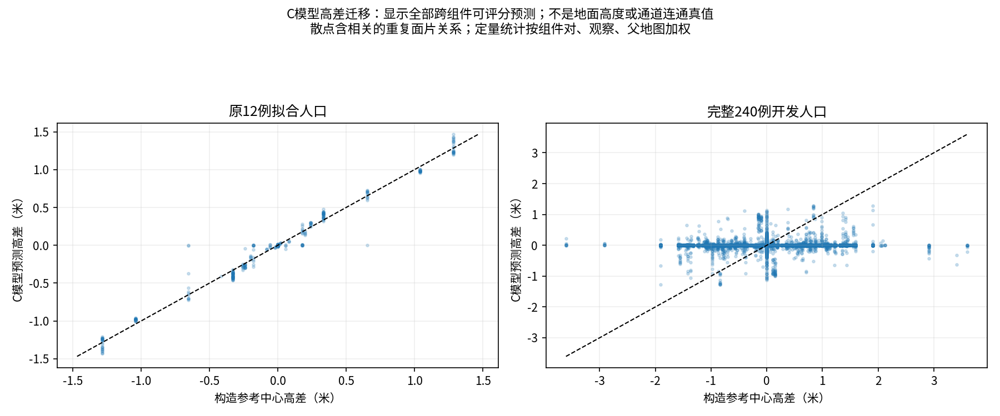

**人话解释：在训练过的少量关系上基本会答，换地图后主要猜“没高差”，也没有稳定判断哪边更高。** 开发结果里约90.8%的加权预测幅度≤0.05米。A/B同样趋零（约86.5%/92.6%），因此不能只把它归咎于C的关系模块。

不是简单量程问题：拟合参考最大幅度1.2856米，开发最大3.6037米，但超出前者仅占约10.0%权重；在0.1—0.5米及0.5—1米两个诊断区间，C预测幅度均值也只有0.0457/0.0325米，方向正确率约52.9%/53.9%。符号没有学稳，所以不应靠放大输出或评分校准抢救结果。

按地图看，S04/S06/S10三张三维地图的参考幅度均值约0.732/0.955/0.693米，C只预测0.020/0.038/0.041米；两张平面地图则出现本不需要的厘米级误差。原拟合只有23个不同组件对、10个有跨组件监督的父地图，重复面片及2000次更新不增加独立关系多样性。小人口记忆与此结果一致，但目前不能仅凭输出统计认定唯一内部根因。

0.05/0.1米及幅度区间仅用于解释误差，不修改原评价门槛，不生成新负例、不用于调参。[逐地图与幅度分解记录](figures/gse_conditional_geometry_fit_v1/height_transfer_attribution.json)已保留。下一只检查已保存训练曝光和高差读出实际输入，区分任务多样性与接线问题；不重复这次统计、不扩训/改标签/建图。

## 最新结论：开发评价完成，轴向有信号，高差拟合收益未延续

**状态：GATE_MIXED。不是合格建图基线，也不据此判定整个几何路线不可行。**

冻结三个最终模型，不再训练，在五个C07开发父地图的240观察上各推理一次，共720次前向，14.10秒完成；734项封存校验通过。原模型状态未变，全部输出（包括未知区域）保存。参考生成240/240完成，74.14分钟、1212项校验通过，峰总进程内存约624MiB。9例没有跨组件参考，保留并报告缺少支持，不填成零误差；下表按其余231例先汇总到各父地图，再对五个父地图等权。

| 方法 | 轴向关系MAE（不是角度） | 参考中心高差MAE（米） |
|---|---:|---:|
| A：观测特征与坐标 | 0.028205 | 0.492557 |
| B：增加面片自身几何 | 0.029340 | 0.485056 |
| C：增加邻接消息与几何关系 | 0.024871 | 0.482701 |
| 常数参考：轴向关系1、高差0 | 0.025537 | 0.476076 |

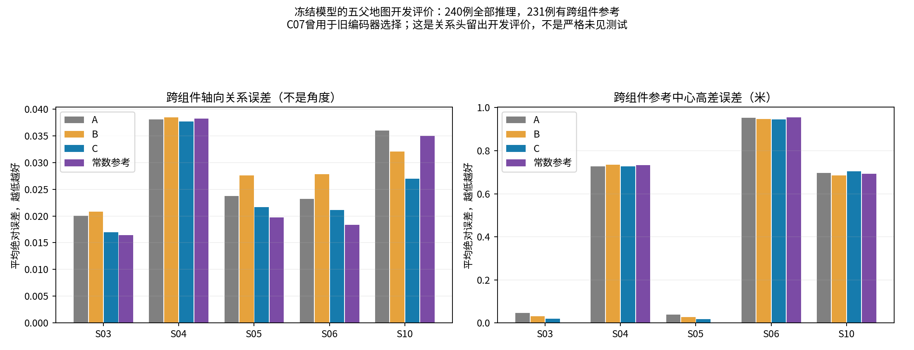

解释：

- C相对B轴向误差低约15.2%，五个父地图均改善；但相对常数参考仅改善约2.6%，不能夸大为理解了完整结构。
- C相对B高差误差仅低约0.49%（约2.36毫米），五父配对描述性95%区间为差值[-0.01010,0.00885]米，跨过零；S10还变差。三个模型都未优于零高差参考。
- 此前12例训练人口上很大的高差收益没有延续。当前能证明小样本拟合，不能证明高差泛化，更没有拓扑或探索收益。这个结果不证明几何关系原理上不成立。
- 本监督仍是**构造弧长组件的代表截面方向及参考中心高度差**，不是独立观测金标、地面支撑高度或通道连通身份。C07还参与过旧编码器检查点选择，只能称新关系头父地图留出开发评价，不能称整系统严格未见。
- C与B同时涉及邻接消息及关系输入，不是已隔离单个几何属性的最终消融。

下一步仅复用保存预测做高差错误分解：区分预测趋零、符号/尺度、真实参考分布及父地图差异。不重新训练、不改标签、不新增种子、不进入建图，也不靠重选阈值获得成绩。以下原12例拟合历史保持不改。

完整结果：[逐观察记录](../results/gate3_semantics/gate3_20260911_gse_conditional_development_evaluation_v1_seed0/metrics/all_observations.json)、[父地图配对统计](../results/gate3_semantics/gate3_20260911_gse_conditional_development_evaluation_v1_seed0/metrics/paired_parents.json)。

## 最新进展：修正版A/B/C公平拟合已全部完成

这次三组都使用同一修正版损失，而非用纠正C与旧A/B混比。A/B各2000步已完成（83.58秒，69项seal通过），复用上次纠正C，不重复训练C。三组初态张量、8000观察顺序、标签和全部训练超参一致；A/B初始预测与各自旧版逐元素相同。

| 相同协议的最终结果 | 轴向相似度误差 | 参考中心高差误差（米） |
|---|---:|---:|
| A：观测特征＋位置 | 0.008387 | 0.105362 |
| B：A＋自身面片几何 | 0.008394 | 0.132631 |
| C：B＋邻接消息／关系 | 0.008245 | 0.031737 |

均为跨组件关系、10个父地图等权，组件对内先平均重复面片。

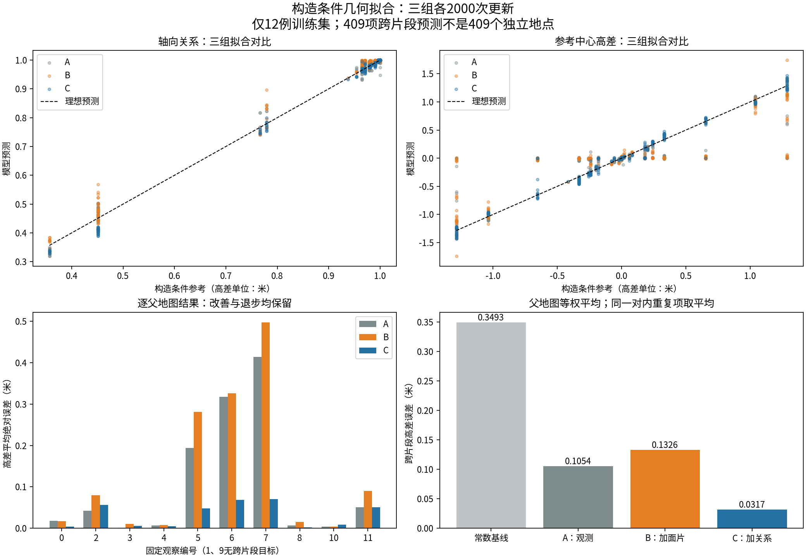

**可以说：本次固定预算拟合中，C在高差目标上明显优于A/B。** 相对B约降低76.1%，相对A约降低69.9%；C对B在9/10父地图高差更好，对A在7/10更好。轴向三组非常接近，不能声称明显轴向优势。B的高差还比A差，不能泛化成“加任何几何都有效”。

**不能说：已证明未见环境中的结构理解、拓扑或探索优势。** 这里只有12例训练人口、23个不同跨组件关系，模型可能记住样本；C对B还同时改变邻居消息传播与显式关系，不是单独关系属性的贡献隔离。

三组最终权重已登记到[冻结模型索引](../configs/v3/gate3/gse_conditional_frozen_models_v1.json)。下一不再调这12例，也不增加种子或改目标：先冻结父地图隔离的开发评价清单，核查编码器历史预训练接触和场景历史访问，再导出同定义条件参考并一次评价。不能把旧编码器见过的父地图叫整条系统“严格未见”。下方保留原始失败、定位和纠正过程。

## 最新进展：单次C组纠正验证完成

**轴向常数化已在这批拟合样本上解除。** 只切换轴向损失，复用原始共享权重、原8000观察顺序、原2000更新预算；高度损失、标签、模型参数和评价不变。实际运行55.98秒，42项seal通过。初态所有张量、样本顺序及12例完整初始预测逐元素核验相同。

| 跨组件指标（10父地图等权） | 原C | 纠正C |
|---|---:|---:|
| 轴向相似度绝对误差 | 0.089554 | 0.008245 |
| 参考中心高差绝对误差（米） | 0.306320 | 0.031737 |

纠正后轴向预测范围0.32898—0.99989，不再全部接近1；高差范围−1.42782至1.46785米，不再仅在零附近。逐例误差及原始散点如下，包含所有有跨组件目标的观察，不挑成功例。

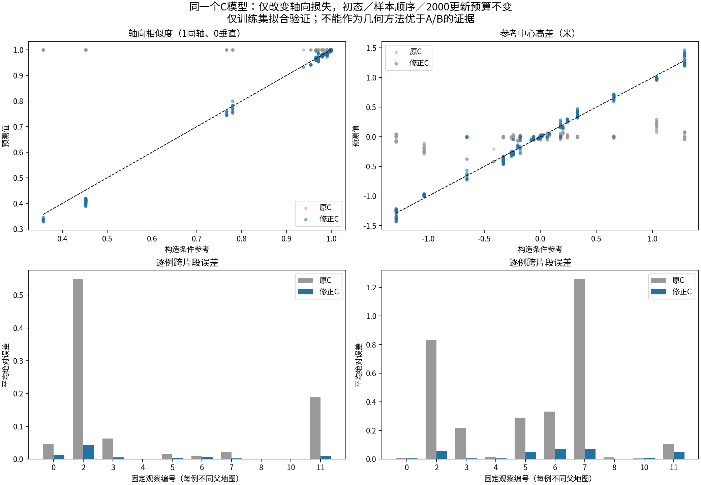

这一结果支持原损失设计是失败的重要因素，不证明它是全部唯一原因。也不能用“纠正C优于旧A/B”宣布几何关系创新：训练协议不同。下一只补相同修正版协议的A/B，复用本次C不重复训练，然后决定独立开发验证。这里仍是12例拟合，不是完整可观察通道、拓扑或探索成功。

证据：[纠正运行指标](../results/gate3_semantics/gate3_20260911_gse_new12_axis_logit_correction_v1_seed0/metrics/summary.json)、[独立冻结规格](../configs/v3/gate3/gse_new12_axis_logit_correction_v1.json)、[派生比较](figures/gse_conditional_geometry_fit_v1/axis_correction_summary.json)。本次GATE_MIXED仅表示有界纠正及拟合结果；以下原始失败及数值归因按历史保留。

## 结论

三组训练均已完成，各2000次更新，共约132秒。**高度关系出现局部学习信号，轴向关系没有学会，不能进入建图或宣布几何方法成功。**

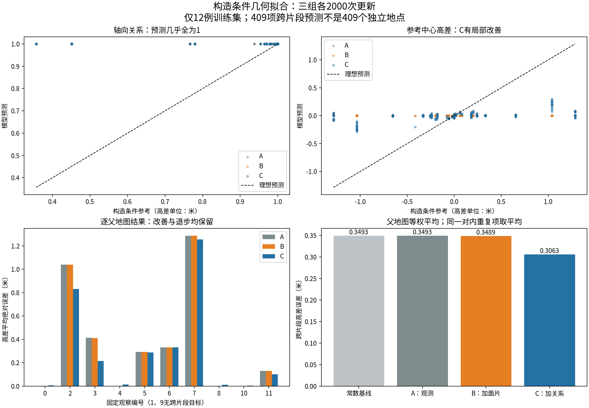

图中只比较有目标的跨片段预测；推理时没有用真值过滤输出，全部预测仍保存在运行目录。点的重复来自面片对，不是独立地点。

## 做了什么

输入是原12个开发父地图的12段五帧观测，共60帧、10193个面片，观测编码器冻结。构造记录只提供损失侧答案，不进入网络前向。

- A：观测特征与位置。
- B：在A上加入面片自身几何。
- C：在B上加入邻接消息与面片关系。C对B不等于只改变一个关系属性，还改变了邻居信息传播。

三组共享参数初态、8000次观察曝光顺序、每次4例的有效batch、AdamW及2000次更新预算。只评价初始和最终权重，不挑最好轮次。

监督是明确改版的**构造条件参考**：从有实际返回的原source弧长组件中读取已保存的中间截面方向和参考中心。训练预测两个参考方向有多接近，以及参考中心的高度差。这里没有训练路口中心检测，也不是预测地面支撑高度；source组件不自动等于真实通道实例。

不要求扫描看到整圈才能使用这个条件参考，但也不称其为从扫描独立确认的结构答案。混合、多义、缺失及域外参考仍未知；尺寸与通道对应本轮没有监督。

共69517个已知有向面片关系，只有409个跨组件关系，去重为10父地图内23对构造组件。统计不能把它们当23个独立地图。损失先对同一无向组件对取平均，再对同/跨组件两类等权，最后按观察平均；高度误差除以固定10米输入半径。

## 实际效果

下表只看跨组件目标：先按组件对平均，再对有该项的10个父地图等权平均。轴向误差是无向夹角余弦的绝对误差，不是角度数。

| 方法 | 初始轴向误差 | 最终轴向误差 | 初始高差误差（米） | 最终高差误差（米） |
|---|---:|---:|---:|---:|
| 固定“同轴、零高差” | — | 0.089557 | — | 0.349288 |
| A | 0.419150 | 0.089555 | 0.374497 | 0.349278 |
| B | 0.420195 | 0.089555 | 0.373764 | 0.348886 |
| C | 0.420240 | 0.089554 | 0.372856 | 0.306320 |

C的高差误差比B约低12.20%，比常数基线约低12.30%。但这是同一小训练人口上的结果，不能视为泛化收益或显著性证明。改善主要在观察2、3等例；平坦案例0、4、8、10反而出现额外小误差，不能只展示改善例。

## 没学会什么，证据是什么

轴向输出几乎全是同一个数：C最终跨组件预测范围仅为 **0.99999630—0.99999642**。不论参考方向有多不同，网络都说“几乎同轴”。因此轴向loss从初态下降，主要说明它学会了常数捷径，不能解释成结构理解。

高差也尚未完整拟合：C输出约在−0.290至0.295米之间，而图中的参考高差超过正负1米；部分大高差仍严重低估。A/B则几乎与零高差预测一样。

已知的是输出退化和高度响应不足；尚不能唯一归因于输入无信息、损失分布、饱和激活或优化设置。不能因此判几何路线不可能，也不能马上再加轮次或种子。

## 下一步边界

### 已完成的定点归因：目标常数捷径与轴向饱和

随后只读取原始目标、共享样本顺序和三组初始/最终预测，未运行模型前向、未更新权重。原训练损失源码哈希及两套输入seal均核验，逐项导数使用独立autograd计算交叉检查。完整数值见[轴向归因记录](figures/gse_conditional_geometry_fit_v1/axis_attribution.json)。

按原损失权重及实际8000次观察曝光，**58.33125%的轴向目标权重恰好落在1**。原因包括两例没有跨组件目标，其全部权重用于同组件，而另外十例同组件占一半。权重虽已防止重复面片数量主导，却仍未消除目标分布本身的常数捷径。

绝对误差的最优常数是加权中位数，此处恰好为1。全答1的轴向目标值为0.037329386；C最终为0.037329988，几乎相同。这解释“训练损失大幅下降”为什么不能证明按输入区分方向。注意它只证明最优**常数**解，不证明条件网络的最优解也必须是常数。

| 轴向输出的加权平均sigmoid导数 | A | B | C |
|---|---:|---:|---:|
| 初始 | 0.248499 | 0.248666 | 0.248658 |
| 最终 | 0.000002384 | 0.000002384 | 0.000003635 |
| 缩小倍数 | 104228 | 104298 | 68407 |

这里计算的是当前保存输出处的激活导数及损失对轴向logit的导数，**不是完整网络参数梯度，也不是对整个优化历史的唯一因果证明**。C最终对共同增加轴向logit的损失导数仍为负（约−0.000000602），意味着把所有答案一起往1推，当前目标仍会奖励这个方向。

这次错误不应归咎于用户数据“必须更多”：我设计了同/跨组件平衡，但没有在训练前验证其加权目标的最优常数，以及有界sigmoid搭配L1的饱和行为。下一修正优先级应是训练目标与输出激活的数值配合，不是重新生成教师、扩大网络或追加种子。任何候选修正先在独立回归张量上核验已知非同轴答案的纠错梯度；必须说明是否改变目标统计量，不能把新损失伪称原目标的完全等价实现。未在本轮启动修正训练。

复用本次最终权重与保存预测，定点区分轴向饱和、梯度及目标分布的作用，先解释共同检测/回归路径为何走向常数。不重新导出目标、不改旧结果、不自动追加训练或进入图。

完整目标仍包括独立开发对照、连续图及探索验证；本轮没有这些成绩。跨片段高差的有限改善是后续需要检验的线索，不是论文贡献已经成立。

## 复现证据

### 定点修正的纯张量验证（尚未重训）

新增显式可选版本`conditional_axis_soft_target_logit_v1`，直接对原始轴向logit使用稳定软目标损失，输出仍为原来的无向轴向相似度；未新增参数、未改面片或标签，也不是把轴向值当成“连通概率”。旧L1默认行为保留，旧ABC结果不改。

当参考为0.25、logit为12（已错预测成几乎1）时，float32中旧梯度约0.000006199，新梯度约0.7499938。float64得到一致结论。测试同时覆盖正负极端logit、0/1及连续参考、未知NaN、全未知、权重和实际输出接线，共62相关测试通过。记录见[独立张量验证](figures/gse_conditional_geometry_fit_v1/axis_objective_tensor_check.json)。没有新数据读取、模型拟合或优化更新。

必须明确：新损失的最佳常数是加权均值，旧L1是中位数，这是目标统计量改变，不是修复一个完全等价的实现。它避免错误非同轴目标的梯度乘上已经极小的sigmoid导数，**不会自动消灭所有常数捷径或证明网络有效**。

下一固定一次C组纠正验证：复用原共享初态、同8000观察顺序、同2000更新预算，仅显式切换轴向损失；高度、标签、输入及评价保持。另行冻结规格与预检后执行，不续训旧最终权重。先检查相对原C及常数参考是否改善；它不是几何优势对照，若要比较A/B/C贡献，三组必须最终使用相同修正版协议。此项训练尚未启动。

- [冻结规格](../configs/v3/gate3/gse_new12_conditional_fit_v1.json)、[数据卡](../configs/v3/gate3/data_cards/gse_new12_conditional_fit_v1.json)。
- [原始结果](../results/gate3_semantics/gate3_20260911_gse_new12_conditional_fit_v1_seed0/metrics/summary.json)、[更新日志](../results/gate3_semantics/gate3_20260911_gse_new12_conditional_fit_v1_seed0/logs/updates.jsonl)。
- 初态与A/B/C最终模型、优化器、全部初始/最终预测、未知掩码及共享顺序均保留在同run的artifacts；96项封存哈希验证通过。
- 52相关软件测试、5训练卡范围检查及预检通过；实际峰GPU256MiB、峰主机约1.63GiB。
- GATE_MIXED表示训练交付及混合结果，不代表结构/图通过。图表生成时修复了中文字体加载，未改变实验或预测；原缺字图保留为派生产物。
