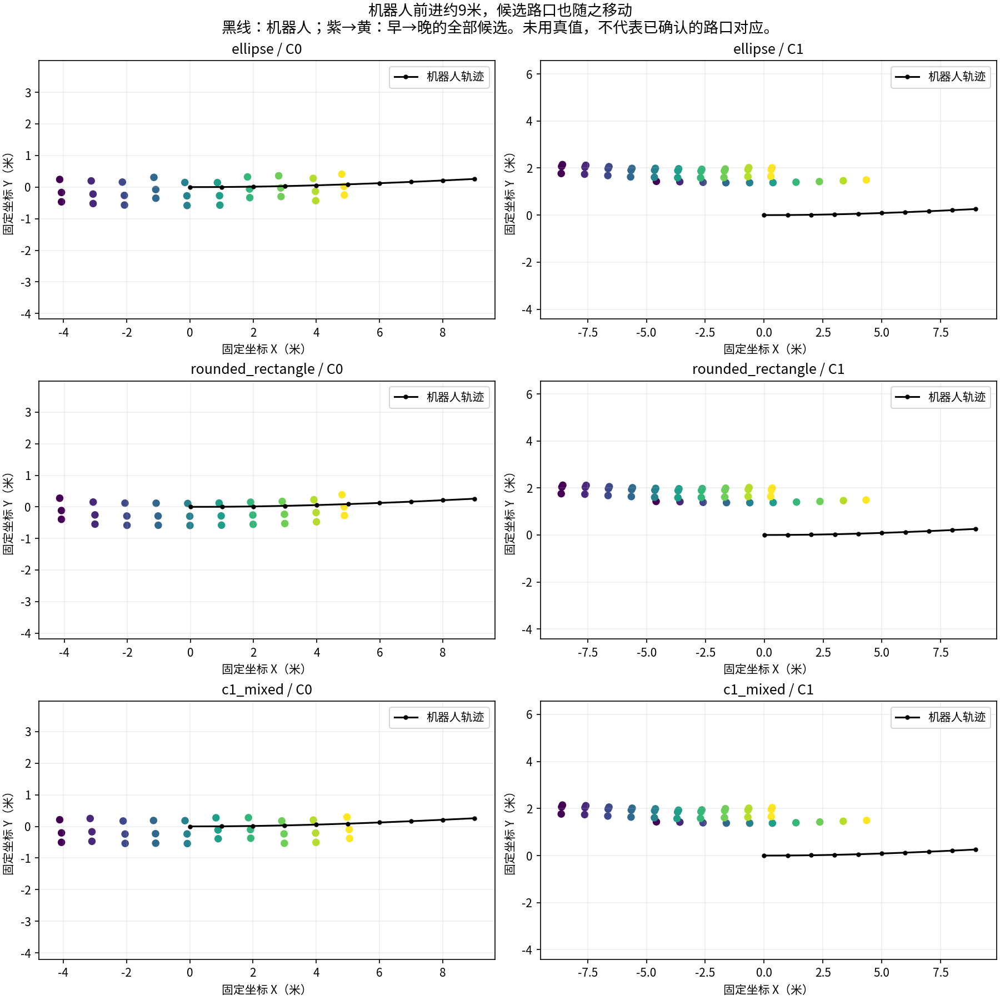

# 连续运动诊断：候选路口目前在随机器人移动

## 这次发现了什么

在固定抽取的C04一段穿越中，机器人前进约9米，两组模型的候选路口也在固定坐标系中移动了约9米。候选数量一直相同，不等于识别到了固定路口。本批预测不能直接用于持久结构节点生成。

黑线是机器人运动。紫色为早期预测、黄色为晚期预测。每幅图均已补偿相对运动，使用首个决策时刻的固定坐标系。两列分别是不提供显式块间属性的C0、提供这些属性的C1；三行是同一拓扑的三种几何实现，不是三个独立世界。图未读取地图真值，因此不能据此标出真实路口，也没有把不同时间的查询编号解释成已确认身份。

## 怎么查的

复用已完成推理的60份原始输出和30个五帧输入。每个后续窗口含有前一决策帧，利用该帧在当前坐标系中的位姿，逐步计算当前传感器到首个决策坐标系的变换。重叠四帧的位姿一致性也逐项检查。转换仅使用当前及历史相对运动，无未来平滑、真实节点或候选筛选。

合成测试覆盖旋转和平移、固定环境点保持不动、随车点移动、查询排列不影响点集距离、前缀一致性和错误历史拒绝，3项通过。真实后处理进程56317正常完成，未运行模型或优化器。

## 结果及边界

| 检查量 | C0 | C1 |
|---|---:|---:|
| 每窗口选中候选数 | 3 | 4 |
| 一直选中的查询：机器人坐标下首末位移 | 0.051–0.146米 | 0.0067–0.0434米 |
| 同些查询：运动补偿后首末位移 | 8.927–9.112米 | 8.906–8.935米 |

机器人本身的首末位移为8.999米。另计算了不依赖查询编号的相邻预测点集双向最近距离：固定坐标系下约每步1米。这支持“候选集合随运动平移”的诊断，不能把该距离称为路口匹配误差或准确率。

现象与机器人相对位置模板相符，但尚不能证明是哪个损失、标签或层导致。它只覆盖一个拟合分区穿越；不能推广成全部地图都失败，也不能否定几何学习原理。同样，它不支持通过增大跟踪半径、累计稳定次数或删槽来宣称修复。

## 下一步和停止边界

停止将本批候选升级为持久节点，不追加种子、训练预算或跟踪阈值搜索。下一项只读定位为：核对现有位置读出、已保存目标的坐标与位置分布，以及已有输入变化/模型响应证据，区分位置目标失配、观测作用弱和解码输出模板化；不能仅凭这张图先改网络或重做教师。若当前日志不能区分，明确缺口并按原有限修正备案处理，不重复长训练获取诊断。

历史关系增量未通过扩大实验条件的结论保持。全部旧模型、预测、失败统计和论文图片保留。字体缺失版图也保留；中文修正版只读取已保存数值，未重跑推理或修改分析。

证据：[完整数值和输入哈希](figures/gse_graph/continuous_anchor_motion_20260909/motion_review.json)、[中文PDF](figures/gse_graph/continuous_anchor_motion_20260909_zh/motion_xy.pdf)。推理源为`gate3_20260909_gse_continuous_predictions_v1_seed0`，seal为`ba04ea01feaaea62e251a41fbf1e75964d2352f6b2c72e1f15b87abfde98bb7e`。
