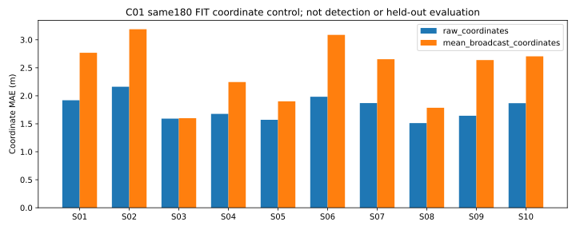

# 同预算点级坐标对照：整体位置改善，局部方向并未全面改善

2026-09-05；Phase 3 组件对照完成，不是结构建图通过。

## 做了什么

原 C01 十个父地图、180 个观察、900 帧、1,452 个可见轴线目标。冻结同一个骨干，两个小头参数初始化完全一致，各训练 540 步。唯一干预是保留每个回波的原始坐标，或把它替换为对应池化单元的均值坐标。点数、掩码、特征、样本顺序与优化器相同，偏移模块固定为零。这不是把新头直接与历史旧解码器比较。

## 结果与边界

| 指标，越低越好 | 原始坐标 | 均值坐标 |
|---|---:|---:|
| 轴线坐标平均绝对误差（米） | 1.780 | 2.457 |
| 有限轴线双向距离（米） | 2.714 | 3.731 |
| 横向偏差 RMS（米） | 2.336 | 1.959 |
| 无向方向误差（度） | 16.846 | 16.321 |

原始坐标在十个父地图的坐标误差都较小，平均降低 0.677 米、约 27.6%。**但横向和方向指标没有同步改善，不能声称所有几何质量提高，更不能据此确认建图收益。** 两条分支各有 6 个方向退化目标无法评分，完整记录已保留。所有 5,760 个候选均保存，其中 4,308 个剩余候选未作为检测假阳性惩罚。因此这是同训练样本上的坐标干预，不是检测、泛化或论文主方法验收。

另保存十张每父地图完整 XY/XZ 图，覆盖全部 180 个观察，未只保留改善案例。

## 运行与后续

唯一正式 run：`results/gate3_semantics/gate3_20260905_gse_coordinate_control_v1_seed0`。独立 Data Card、预检和不可覆盖创建通过，RTX 5090 D 实际执行；总耗时 30.3838 秒，1,080 次优化，主机峰值 RSS 2,733,744,128 字节，GPU reserved 峰值 2,084,569,088 字节。39 项封存文件独立 SHA-256 校验通过；seal：`a40c9b386e366164ab98f73dabafcb678b143d8e723b4b5621a93f53c14836ba`。配置、原始进度日志、初始/最终权重、优化器状态、全部预测/目标、指标和 11 张 SVG 均保存。

训练前代理执行 256 项指定回归，包括合成完整端到端；主代理另复核坐标输入、坐标系、端口更新和旧图共 82 项测试通过。软件通过与科学指标分开记。

不扩大三种子或偏移训练。两个候选保留给有效局部结构标签下的组件替换；先补清“哪些通道属于哪个可观察交汇区域”，再用同预算结构任务决定是否值得扩大。教师方案见 `GSE_LOCAL_STRUCTURE_TEACHER_V2_DRAFT.md`，仍是草稿，不是已经完成的新标签。图软件完成独立端口更新及六自由度坐标转换，真实配准与状态机接线尚未完成。
