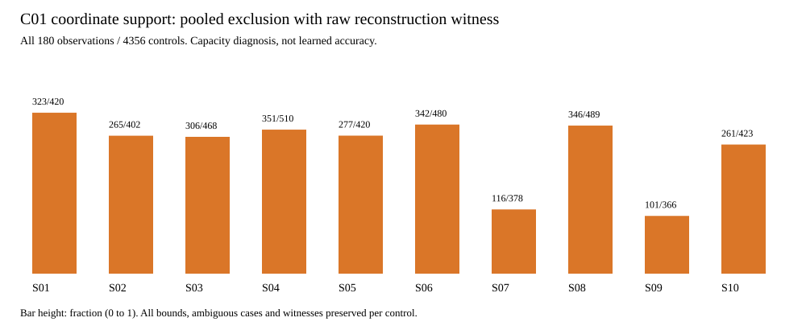

# 已定位一个真实限制：旧输出接口先把几何位置平均掉了

2026-09-05，Phase 3。同180个观察的对照完成，不是重新训练。

## 做了什么、得到了什么

原10个C01父地图、180个五帧观察、900个唯一源帧保持不变；比较全部1452个可见片段的4356个教师轴线控制点，没有挑选容易样本。这些控制点不是4356个独立实验样本，独立地图只有10个。

旧网络先把每组16条竖直线×4个方位列的三维点取平均，再从五帧共900个均值点中加权预测轴线。只要权重非负且总和为1，预测位置就只能落在这些点围成的凸包内。即使训练完全成功，也不能越出这个范围。

本次只计算这个位置限制，分别使用旧均值点和未合并的原始回波点；没有加载checkpoint、运行神经网络、更新参数或生成新标签。

| 同一批4356个目标控制点 | 旧900均值点池 | 原始回波点池 |
|---|---:|---:|
| 有证据证明在可表达范围外 | 3153（72.38%） | 465（10.67%） |
| 有具体非负加权重构见证 | 1201（27.57%） | 3891（89.33%） |
| 数值证据未能明确判定 | 2 | 0 |
| 所有目标的距离下界均值 | 3.089 m | 0.162 m |

2688个控制点（61.71%）属于“均值池不能表达、原始点可以构造”的情况，10个父地图都存在。下面每个柱子是各地图这一比例，分子/分母均标在图中。

## 能说明什么，不能说明什么

这给出了旧几何输出接口的实际限制，不再只有合成反例。它支持停止“冻结旧几何、直接加组合头即可”的训练，也支持对几何读出做小范围修改。

但是，**89.33%不是新模型准确率**。这里允许任意选取非负权重，甚至混用不同隧道的点；真实学生必须从观测中学会哪些点属于同一段通道，不能获得这些评分用的权重或身份。

465个目标仍在原始回波点的凸包外，说明“换原始点后继续纯加权平均”也不足以表达全部现有监督。雷达回波来自墙面，而轴线在通道内部；这可以解释为什么表面点凸包不一定覆盖轴线，但本次没有逐一证明这465点的具体成因，也没有据此把它们认定为教师错误或删掉。

本次只确定表达能力限制，不能把全部旧模型误差都归因于池化。下界不是精确最近凸包距离；角度、控制点顺序、点归属和优化误差仍可能同时存在。

## 证据与数值边界

- 唯一run：`gate3_20260905_gse_coordinate_support_audit_v1_seed0`。预检0 errors/0 warnings；16.254345s，峰值RSS804294656 bytes（约0.75 GiB），结果约12 MiB。
- 原180行教师/缓存评分逐元素复现后才增加新诊断。读取438个原教师源文件和541个额外输入文件，逐文件哈希核验；逻辑扫描帧900，不把Zarr物理块内相邻行算成新样本。
- 对每个控制点保存下界方向、全点集支撑点、非负重构权重、数值误差界和状态；没有抖动点云、重试或把未定项强判通过。SVD/Qhull仅提出候选，下界最终在全部原点上核算。
- 使用CPU float32复用原反投影/池化公式，再以float64计算证书；没有证明CPU与历史CUDA逐位相同。数值界覆盖输入坐标量化/计算舍入，不代表真实LiDAR测量噪声上界。
- 保留全部180行XY/XZ图、新分地图图、逐控制点证书、日志、卡/spec、环境和原始来源。27项输出seal独立通过；seal-list SHA-256：`5aabab7364e8d0eebe23a6b501967d0bf33231fe1e7f270100c284316791f3be`。
- 新增68项计算/数据权限/执行器测试；包含旧模块的指定回归381项通过。封存后另补4项原点适配陷阱合成测试；新诊断及两组池化反例共76项再次通过（1.18s），不冒充已写入正式run。正式状态`AUDIT_COMPLETE`，`scientific_gate_pass=false`，不是论文方法通过。

## 下一步只做最小几何读出验证

不重建数据集、不更换骨干，也不直接再训练三个种子。先实现并测试原始XYZ旁路、点级归属和表面到轴线几何估计的最小接口，再决定同180观察的短训练规格。

必须避免一个无效修正：把同一旧token权重均匀广播给组内原点，按有效点数归一化后仍严格等于旧均值读出；不归一化则只是偏向回波较多的组。必须真正保留点级可区分的信息。

候选几何输出需要允许轴线位于回波点凸包外，例如点到轴线的局部偏移或点归属引导的几何参数估计。两者都只是待验证工程选项：自由偏移不能替代可观测性检查，拟合退化也不能强行补全。不能用GT归属筛选部署输入，不能靠跨隧道平均制造中心线。

软件先验证分层点不会再次被合并、单侧表面到轴线的表达/梯度、点序/共同坐标变换、无效输入和退化拒绝。点级模型、现有监督如何接入及资源预算必须先冻结；实际数据训练仍需新精确卡/spec。完整事件/端口教师尚未通过，受影响训练继续停止；C07–C10、新图回放、M-TARE闭环未开放。旧模型、失败结果和论文图片均保留。
