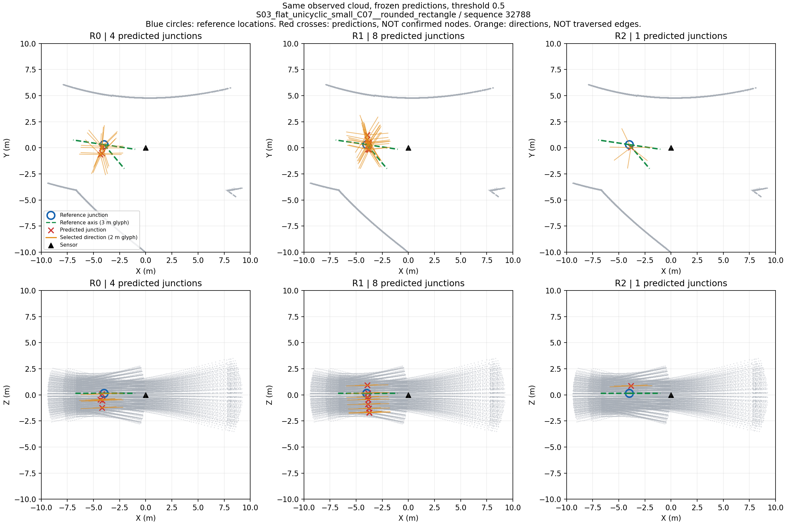
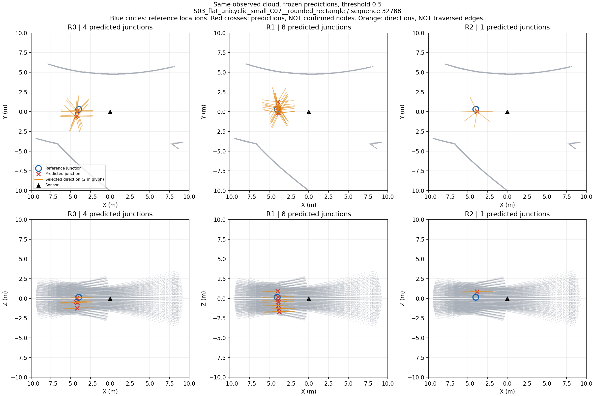

# 支路选择修正：三组完整结果

本次修正运行已结束。三组各2000更新，307观察全部初末评价；耗时1504.44秒、峰值RSS5353717760字节，输出166163372字节。数据/模型初始化/评分不变，只改变支路训练匹配与正负组归一化。

## 结果不能概括为三组全好或全坏

开发30个路口出现、90条已见参考支路，原4米/10度评分：

| 表示 | 匹配路口 | 已证多余/错误路口 | 未决路口 | 正确支路 | 漏参考支路 | 已证错误支路 | 未决支路 |
|---|---:|---:|---:|---:|---:|---:|---:|
| R0修正前 | 27 | 33 | 0 | 4 | 86 | 8 | 0 |
| R0修正后 | 27 | 90 | 3 | 49 | 41 | 687 | 39 |
| R1修正前 | 27 | 63 | 0 | 5 | 85 | 144 | 0 |
| R1修正后 | 27 | 204 | 9 | 52 | 38 | 1251 | 69 |
| R2修正前 | 29 | 82 | 1 | 0 | 90 | 331 | 64 |
| R2修正后 | 27 | 4 | 0 | 47 | 43 | 90 | 15 |

R0/R1恢复更多支路，但误报明显恶化。R2不同：路口误报82降到4，正确支路0增加到47，错误支路331降到90，但漏掉43条参考支路、仍有90条已证错误及15条未决，不能用于可靠建图或宣布方法通过。节点匹配数29降至27也必须报告。

拟合R2：节点TP243/250、FP13；支路TP482/774、FN292、已证FP682、未决61。校准R2：节点TP27/27、FP0；支路TP62/87、FN25、已证FP71。开发并非唯一有改善的分区，但三种几何变体不是独立父世界，本表不是统计显著性证据。

当前只支持“该单种子、部分构造参考任务中，超点分组与修正目标的组合表现出值得进一步核验的优势”。没有去除关系属性的独立消融，没有完整背景/开口标注，没有新图实验，不可宣称几何关系创新成立。部分参考任务不报告全场景检测F1。

## 已核验与尚未核验

运行会话32768 exit0；独立核验84755 exit0：1874封存文件哈希与精确集合一致；6000更新的四观察顺序与冻结调度一致；三最终优化器均2000步、权重有限；1842初末预测有限，每条有9档评分；921初始预测逐数组与旧run一致。不是重新运行了全部网络或独立重算了全部评分。

seal SHA-256：`750372954133fcfa17c03cdc294aac6bc0fa3365abad687989af1a00cb7210cb`。

原始结果：`results/gate3_semantics/gate3_20260909_gse_development_corrective_train_v1_seed0`。旧结果不修改。

## 下一步

### 完整开发方向分解与本轮停止决定（15182，exit 0）

同30观察的R2匹配路口，按每条参考到选中候选的最近三维角度分类：≤10度47条、10–15度18条、15–30度11条、>30度5条；另9条因节点漏失不进入该角度统计。每条选中预测到任一已见参考的最近角度分类则为47/18/12/55条。参考和预测的分母不同，不能混用；未知参考的15条未决仍按原评分保留。

超过30度的55条预测分布于五个开发父地图，分别4/5/2/13/31。并非仅一个图或边界角度导致失败。此分箱只解释错误，不替换10度主评分、不删除预测、不新增训练目标。

本轮停止追加学习轮数、种子、匹配权重或阈值搜索。保留R2对旧版本的改善作为组件证据，不宣称达到可靠结构恢复。下一优先补齐原计划缺失的同任务非学习参照与表示贡献验证条件，而不是继续围绕同一头反复训练。

已读现有 `RangeExitBaseline` 和 `NonlearningPrimitiveRelationPrediction` 接口：前者从当前传感器距离图提取水平长距离扇区，不输出持久路口位置；后者输出扫掠基元、截面和端点关系，并不是当前路口—支路集合。因此它们不能直接搬历史成绩排名，也不能把传感器位置或基元裁剪端点伪装成路口。下一必须先明确这些现成模块与当前三维节点/方向任务的公共可评分部分及不适用字段；无同任务接口时如实保留缺口，不造教师候选给基线。

### 参考方向叠图：固定样本的具体错误

沿用序列32788、帧740–744，未按效果重选样本。绿色虚线是已见构造轴向参考，长度3米仅作符号；橙线是原0.5阈值选中预测，长度2米仅作符号。它们不是开口宽度或执行安全证明。方向来自原哈希绑定构造、接口与yaw，原reader转换至当前传感器坐标；三组均只读取已保存预测。生成65617 exit0并实际打开检查，输出含来源哈希，旧图不覆盖。

此例R2只有1个预测节点，但输出6条方向，对应3条参考。三条参考各自最近预测的三维角误差为9.178、7.754、11.609度。原10度评分为2正确、4错误、1漏失。第三条是约11.6度的偏差而非完全没有候选，同时另外几条选中方向不对应参考。不能为这个案例把阈值改成12度，也不能把额外方向直接当成真实可探索分支。

该图说明“节点去重改善”与“支路精确且数量正确”是不同问题。下一将完整开发人口的方向误差与额外预测按已见构造参考分类，保留未知，形成主方法继续条件；不靠这一个样本决定新网络或调整训练。

### 独立匹配重计数与剩余错误（10579，exit 0）

重新读取原哈希绑定方向目标和三组最终NPZ，对307×3×9=8289项评分用独立增广路径最大匹配重算。单路口位置对应按允许关联中距离最近者计算，支路使用10/5/15度邻接最大匹配；没有调用原评分函数。所有节点与支路TP/FN/已证FP/未决计数与保存结果一致。原覆盖掩码复用，未重新射线验证覆盖与teacher；这是计数/匹配核验，不是全监督重新认证。

R2开发主合同，已匹配路口上共有132条选中方向：47条一对一匹配，85条距任何已见参考方向均超过10度，近参考但争抢同一目标的冗余为0。这85条中可能包含部分参考下的未知，不能全叫已证错误。

漏失43条参考支路中，9条随3个漏路口一起漏失，34条所在路口虽匹配但没有选中的10度内方向；一对一竞争导致漏失为0。

因此，**仅做方向去重不会修好当前剩余支路问题**：在已匹配路口，问题是选中方向偏离参考，而非多个近方向争抢同一支路。还需区别方向回归精度不足、候选存在性排序错误，以及构造参考方向与可见开口任务之间的偏差，不能立即将这些都归为真实通道幻觉。

下一优先检查保存目标与预测在同坐标系的方向叠图及观测依据，用已有结果确定剩余误差的物理含义；不追加训练，不临时接NMS或放宽角度。

### 已完成的敏感性与父地图检查

R2修正后，位置匹配1/2/4米的开发计数完全一致：路口TP27、已证FP4；在10度下支路TP47、已证FP90。因此这项改善不依赖4米容差。角度5/10/15度下，支路TP为26/47/65，已证FP为111/90/76；方向精度仍明显不足。三档是预登记敏感性，不能挑15度当主成绩。

按独立父地图合并所有变体后的R2开发主评分：

| C07父地图 | 参考支路 | 正确支路 | 已证错支路 | 未决支路 | 漏路口 | 已证错路口 |
|---|---:|---:|---:|---:|---:|---:|
| S03平面单环小地图 | 6 | 2 | 8 | 0 | 0 | 0 |
| S04三维单环小地图 | 9 | 7 | 7 | 0 | 0 | 0 |
| S05平面分支中地图 | 3 | 3 | 2 | 0 | 0 | 0 |
| S06三维分支中地图 | 18 | 6 | 7 | 15 | 0 | 0 |
| S10三维复杂地图 | 54 | 29 | 66 | 0 | 3 | 4 |

开发仅5个父地图，S10占54/90参考支路，承担全部漏/错路口及66/90错支路。总体数字受人口构成影响，不能把30观察或三种变体当独立地图计算可靠性。S06仍有15未决，不能把它们藏在平均值里。R0/R1改变位置半径时已证FP数变化，部分原因是既有可评分覆盖随半径变化，不能误写成预测本身被删除。

### 同一样本修正前后

固定首个开发记录、相同29170点、原0.5阈值，不按分数挑图。上排XY，下排XZ；蓝圈为参考路口位置，红叉为预测位置，橙线为选中方向符号，不是通道长度或已验证图边。参考方向未画出，因此不可凭此图判断角度正确。

修正前：

修正后：

同一样本的预测节点数R0为2→4、R1为3→8、R2为4→1。R2此例去除了重复点，但仍预测多个方向，不能把一张图包装成完整结构恢复。新图单独目录保存并已打开检查，旧图未覆盖。来源与输入哈希见各目录provenance.json。

停止追加训练及修正权重搜索。先对全部已保存结果完成父世界分解、三位置/三角度敏感性及同源三组评分复核；用同一固定样本绘制修正前后图，检查R2误报减少是否依赖宽匹配半径或过度拒绝。若优势消失，如实结束这项收益主张；若保留，仅取得扩大诊断的依据，仍须按原主线验证关系消融与图收益，不自动进入探索。
