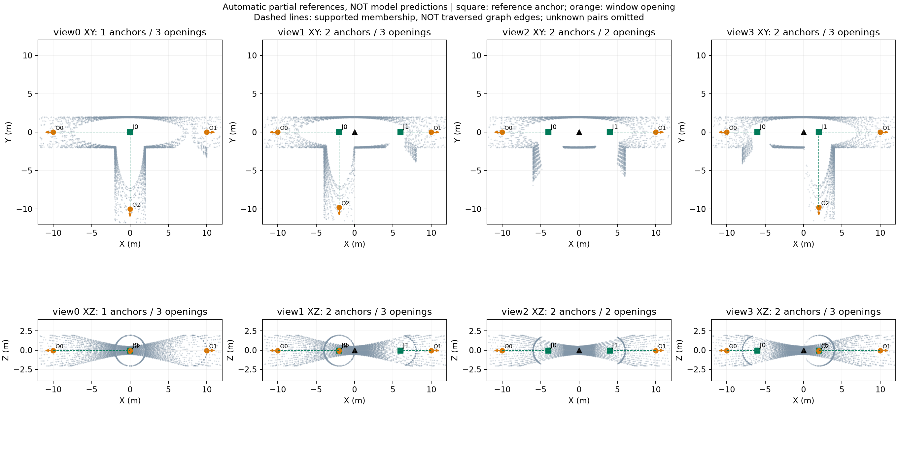

# 这次监督结果到底说明什么

灰点：五帧激光观测。黑三角：当前传感器。绿方块：由构造位置加观测支持产生的路口参考。橙圆：10米窗口边界的开口参考。绿虚线：支持的开口归属，**不是机器人已经走过的图边，也不是模型预测**。下排是XZ投影，同方向不同位置可能重叠。

图使用固定圆形截面的全部四个视点，没有按效果挑样本。另两种截面的全部结果也保存在同目录case_summary.json中；旧run不改写。

## 1. 为什么第一个视点只出现一个路口

保存的unknown_candidates明确记录：J1未满足三个不同支路方向的观测见证。J0有三个方向的内部见证，而J1保持未知。这是当前监督规则没有确认J1，不是网络漏检，也不证明人或其他算法一定看不出来。

## 2. 为什么中间视点两个路口却只有两个开口

输出开口来源只有left和right；branch0、branch1均记录为NO_EXCLUSIVE_CROSSING_OR_SURFACE_SUPPORT。原保存证据不能进一步区分是哪个子条件失败，不补造更细原因。

图中两条侧支路入口可见，但它们深处10米球边界的截面不一定可见。由此可以区分两个任务：

- 当前监督：看到足够证据时输出窗口边界截面。
- 探索需要：识别路口附近的通道入口，保留值得进入查看的方向。

两者并不等价。因此这份监督可以作部分几何参考，不能直接作为“所有可见支路入口”的完整答案。不能用两个窗口出口宣称机器人只应探索两个方向，也不能靠填入隐藏构造信息补齐侧支路。

## 3. 27个未知配对不是27个未归属开口

12观察累计33次开口，30次有唯一正归属，3次没有正归属（各截面的view0右侧开口）。其余24个未知是已经有正归属的开口与另一路口之间的未确认配对。没有负证据时没有强行标False。

view0的右侧开口缺少唯一直接归属见证，J1本身也未被确认；不能把它为了训练方便绑到唯一已确认的J0。

## 4. 对下一步的影响

当前只完成自动部分监督诊断；完整背景、局部入口覆盖与独立场景人口仍不满足完整检测比较要求。不能直接开始新一轮坐标头训练，更不能将已有彩色分块当作方法成功。

下一步应核查并复用现有局部入口/截面观测代码，明确哪些输出对应“路口附近入口”、哪些仅为“窗口边界截面”，对照现有出口方法的输入输出边界。先形成明确的监督复用或缺口结论，不重新生成teacher、不改旧标签、不训练。若需要更改监督任务，另行版本化记录，不静默替换本次结果。

## 可复核材料

- 原run：`results/gate3_semantics/gate3_20260908_gse_covered_partial_diagnostic_v1_seed20260906`。
- 后处理图、PDF、12例摘要、来源说明：`docs/figures/gse_graph/covered_partial_20260908/`。
- 绘图代码：`tools/v3/preview_covered_partial.py`。读取前核对来源seal与对应文件SHA；展示点按固定步长8抽稀，仅用于绘图，不参与监督或评分。
- 图为自动证据解释，不宣称人工复核标注或来源唯一认证。
