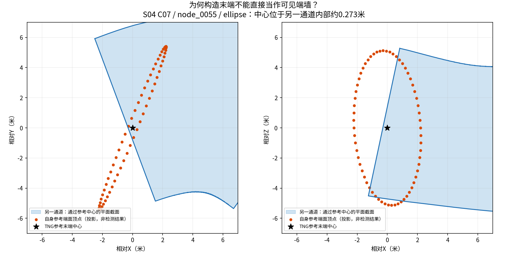

# 开发集缺失末端：参考中心位于另一通道内部

图已实际生成并目视检查。蓝色是另一通道通过参考中心的精确XY/XZ平面截面；红点是自身参考端面顶点的投影，黑星是构造末端中心。二者不是同一个平面的完整截面比较，红点不能据此直接判定三维包含。该图仅解释中心重叠，不是LiDAR观测或模型预测。图和源哈希、完整截面坐标保存在同目录provenance.json；生成脚本为tools/v3/plot_development_terminal_overlap_v1.py，拒绝覆盖既有图。

2026-09-07，只读定位已有未知例；未重新生成扫描、训练或改变标签。

## 定位到哪个实体

`S04_3d_unicyclic_small_C07 / node_0055`，参考端点为 `primitive:edge_0056` 的起点。固定观察序列45132，源帧1444–1448，当前采样穿越为edge_0053:d1。三种变体的端面V2记录均为 `NO_UNIQUE_SOURCE_CAP_RETURN`。这是开发集第五个未获支持的尽头，不是另一个新样本。

此前记录已经表明混合/圆角版本有射线穿过参考端面后才返回，距离差至少0.467/0.613米，不能统一归因于微米级浮点误差。

## 新增只读几何证据

核验P1a seal后，仅读取上述父地图的三份封存构造文件。用原 `mesh_swept_superellipse(axial_spacing_m=.05, angular_segments=64)` 恢复独立源网格，顶点和查询点按原后端float32；Open3D 0.19.0 `compute_signed_distance(nsamples=5)` 查询参考中心是否在其他源内。查询不读取新传感器、模型输出、未来帧或测试地图。

中心世界坐标为 `[39.33273842476193, -54.71449656073344, 8.529901182326272]`。三种实现都检测到其位于 `primitive:edge_0055` 内：

| 几何实现 | 到该源表面的有符号距离（米） |
|---|---:|
| mixed | -0.273221642 |
| ellipse | -0.273221642 |
| rounded_rectangle | -0.273224950 |

负值是该独立闭合源网格的内部诊断，不是机器人通行或碰撞安全证明。它说明参考端面中心并非源并集在该点的外部边界。仅检查中心，**没有证明整个端面都被覆盖，也没有重建完整局部可通拓扑**。

构造文件SHA分别为：

- mixed：`718c17c32559948af8feabbffa9c0c98e951b2fd9dd554740bd4c219943adf90`
- ellipse：`e1bdc1833da43d46dd9eaadf722517d71407f1e0fb512ac145864d5290f9783f`
- rounded：`ace77cd166b7f135995e10cf3c8e87ce643d55b5182477c06026b19b2c6d7642`

来源目录：`results/gate3_semantics/gate3_20260830_primitive_relation_p1a_lossless_storage_corrective_v1_seed0/artifacts/constructions/c07/`，对应 `S04_3d_unicyclic_small_C07__<variant>.json`。P1a seal SHA为 `79fd988ac8c205d74c93e4858b7b579571a06502e778f31634046b48791a0668`。

## 对训练的影响与处理

这是构造参考与实际并集边界不等价的具体例子，不是模型失败，也不是所有标签失效。不能从degree=1直接推断扫描中有端墙，不能靠扩大求交容差补成第10个有效锚点。该实体维持未知；不删除样本、不换地图、不改TNG、不修几何或旧结果。

本轮停止对此实体的“只修数值即可补正例”解释。接下来标签生产须区分构造末端与有实际可见终止证据的末端；其他实体仍逐项按观测证据处理。开发最低有效人口仍未证明满足，正式A/B/C比较不启动。已有公共特征保留，不重复训练或提取。
