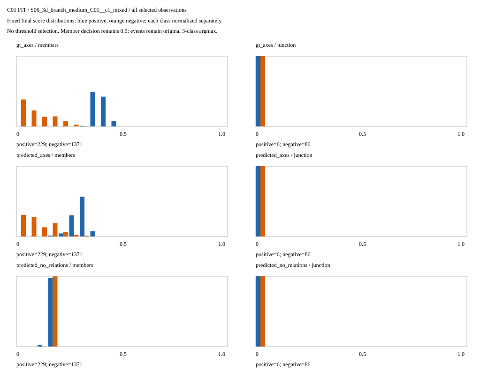

# 成员关系已经有排序信号，固定决策与交汇分类尚未成功

2026-09-05。只读已有模型最终输出，**1.079秒**完成；没有重新训练、改阈值或访问新地图。完整原评分、逐父地图结果和对应mask全部精确复现。

## 这次弄清了什么

上一轮成员F1为0，是固定0.5阈值下的真实失败；但它不能说明模型完全没有学到成员区别。本次查看了未二值化的最终分数。

| 输入 | 成员排序平均精度 AP | 成员 AUROC | 真成员平均分 | 非成员平均分 |
|---|---:|---:|---:|---:|
| 理想轴线＋几何关系 | 0.99984 | 0.99998 | 0.3975 | 0.0999 |
| 预测轴线＋几何关系 | 0.87074 | 0.98315 | 0.3015 | 0.1057 |
| 预测轴线、去掉关系 | 0.23471 | 0.50470 | 0.1562 | 0.1562 |

AP衡量按分数从高到低排列时，真正成员是否优先出现，不是“87%的节点建对了”。AUROC衡量正例排在负例前面的能力；随机排序参考为0.5。此人口正例比例约0.1376是常数同分AP参考；无关系版本虽AUROC接近随机，其AP仍高于常数参考，不应把两者说成完全一样。

预测关系分支在全部十个父地图的成员AP均高于无关系版本，范围0.798—0.943。因此，**在这批拟合样本、按真值中心独立对应的候选中，几何关系确实帮助区分了结构成员。** 但所有成员分数都在0.5以下，二值输出仍为全负；没有通过降低阈值改写旧结果。

最终成员BCE分别为0.22203、0.26549、0.40194；全局常数先验参考0.40056。这与排序结果一致，不能继续把全部失败解释为“表示里没有信息”。至于为什么概率偏低，需要单独验证训练目标的类别贡献，不能仅凭相关性认定原因。

## 交汇分类是另外一个尚未解决的问题

三组交汇AP仅0.02226、0.03429、0.01971，原三类argmax仍把14次交汇全部答成走廊。交汇只有6个独立构造、14次已知事件；十个父地图中五个没有已知交汇，因此这些父地图的交汇AP/AUROC记为不可定义，而不是补一个分数。

成员排序成功不代表交汇分类成功，更不代表可自主挑出节点、完成图或在未见地图泛化。

## 如何据此加快下一步

不推倒骨干，不扩大数据，不继续原配置加轮数。准备一个小型2×2对照，把“成员正负损失是否平衡”和“事件类别损失是否平衡”分开：原始版本已有封存结果，只新增成员平衡、事件平衡、两者平衡三种设置。每种仍做理想/预测/去关系三组，保持初始化、顺序、300步及原0.5/argmax不变。一次保存固定决策与排序结果，避免训练后再补一轮分数诊断。

这是下一实验设计，不是已经训练完成或平衡必然奏效。只有精确配置与软件交接完成后才运行；不把多个配置中最好的一项直接当正式冻结方法。终点缺失、部署候选选择及独立地图验证仍需解决。

## 图片和完整证据

原C01 S01—S10，180观察、900帧、1452可见片段；每组三支均按原2152正/13489负成员和886事件评分，未知标签保持未知。

以下是S06全部观察的概率分布。蓝色为真成员/交汇，橙色为非成员/走廊；两类分别归一化，以便看分布分离，不表示类别数量相等。其余九父地图同样完整保存。

- [原始汇总与全部逐父指标](../results/gate3_semantics/gate3_20260905_gse_geometry_bound_rank_v1r_seed0/metrics/summary.json)
- [全部预测成员/事件分数及对应索引](../results/gate3_semantics/gate3_20260905_gse_geometry_bound_rank_v1r_seed0/artifacts/predicted_axes__scored_probabilities.json)
- [未改写的固定阈值失败结果](GSE_GEOMETRY_BOUND_TRAINING_RESULT_V1.md)
- [预先固定的诊断合同](GSE_GEOMETRY_BOUND_RANK_V1.md)

唯一实际执行run为`gate3_20260905_gse_geometry_bound_rank_v1r_seed0`：26项seal复核、十张全父地图图、CPU峰值609685504字节、0模型/权重/optimizer。seal SHA-256：`dc3803e6265302f7c26d306fffcd4c36b48866706723847699043d1ecbc0f16a`。

V1目录在任何数据执行前因并行冻结交接不完整而停止：主代理过早冻结，后收到CPU环境及依赖哈希补丁。V1保持`ABORTED_BEFORE_EXECUTION`并保存原配置与seal；V1R只完善准备绑定，未变方法、人口或评分，未重跑训练。以后冻结前先确认所有作者已停止修改绑定源码。
