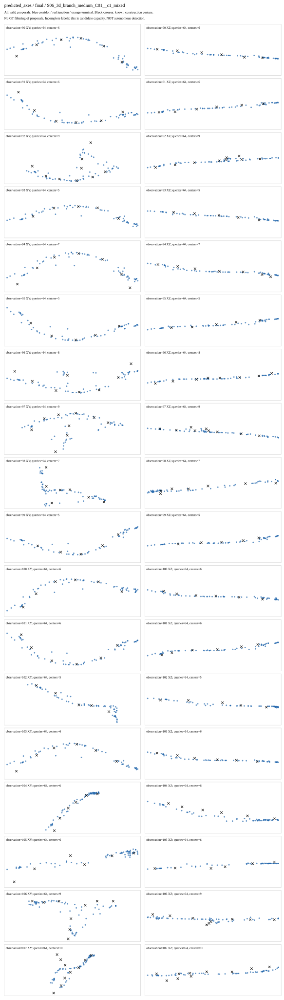

# 位置绑定修正：训练完成，但结构成员仍未学成

2026-09-05。这是同一小样本上的方法诊断，不是未见地图成绩。唯一运行：`results/gate3_semantics/gate3_20260905_gse_geometry_bound_training_v1_seed0`。

## 做了什么

上一实验的训练对应会选择几十米外、类别恰好正确的候选。本次只修这一点：先按中心位置建立唯一对应，再要求这个候选同时答对类别和通道成员。没有改答案、损失权重、评分阈值或训练时长。

仍为 C01 的 S01—S10，180 个五帧观察、900 帧、1452 个可见基元片段。理想轴线、预测轴线、预测轴线去关系三组，各300次更新；初始化与顺序一致。只训练小头，不重新渲染或运行骨干。

5090 实际耗时 **58.925 秒**，共900次更新、1080次初始/最终评估。运行完整结束，但科学问题没有通过。

## 结果：位置能拟合，不等于结构学会了

| 输入与方法 | 原中心误差→修正后（米） | 原成员 F1→修正后 | 修正后交汇找回 |
|---|---:|---:|---:|
| 理想轴线＋组合头 | 0.0765→0.0686 | 0.5348→0 | 0/14 |
| 预测轴线＋组合头 | 2.3291→2.4630 | 0.1554→0 | 0/14 |
| 预测轴线、去掉关系 | 2.5206→2.5213 | 0→0 | 0/14 |

三组都把有效成员判成“不是这个结构的成员”，把886个已知事件判为普通走廊。872个走廊、14个交汇的分布，使“永远猜走廊”也能有98.42%的准确率；这个数字不能代表结构识别成功。两类平均 F1 只有0.496，终点没有有效标签，不能声称完成三分类。

固定成员阈值仍为0.5，评分覆盖2152个正例与13489个负例；3正例、21负例因原方向对应不唯一保留未知。没有为了分数丢帧、改阈值或挑检查点。

## 已排除什么，还不能断言什么

- 标签没有漏送：每组30轮完整监督36180个中心、26580个事件和469230个成员标签；未绑定标签、几何歧义对应均为0。
- 不能把全部失败归咎于前端轴线不准：理想轴线对照也塌缩。
- 不能把全部失败归咎于匹配漏洞：移除漏洞后仍失败。
- **尚不能断言几何输入没有结构信息。** 固定阈值下全部为负，不等于正负分数完全不可分；类别不平衡、任务优化和表示不足还需要区分。

## 下一步与停止边界

停止这套配置的加轮数和多种子扩训。先并行核查既有任务损失相对常数先验、成员头实际可用特征和梯度接线；如需读取完整缓存分数，独立冻结范围后只做排序诊断，不重新训练，不把诊断替代原固定阈值成绩。根据能排除哪种原因决定唯一下一项GPU实验，不同时改网络、采样与损失。

图软件可以继续准备候选的坐标/时间身份绑定，但不把目前失败的输出接入正式图或闭环。旧结果及论文图片全部保留。

## 完整图片与复现依据

下面保留 S06 全部18个观察的预测轴线分支初始/最终结果中的最终图，不挑选成功样例；黑色为已知中心，其他图例以原图为准。全部三组初始/最终、十父地图共60张SVG均在原运行的 `previews/` 下。

- [原始汇总](../results/gate3_semantics/gate3_20260905_gse_geometry_bound_training_v1_seed0/metrics/summary.json)
- [训练记录](../results/gate3_semantics/gate3_20260905_gse_geometry_bound_training_v1_seed0/artifacts/training_history.json)
- [冻结训练合同](GSE_GEOMETRY_BOUND_TRAINING_V1.md)
- [旧同预算结果](GSE_PARTIAL_STRUCTURE_TRAINING_RESULT_V1.md)

97项证据SHA-256全部复核；清单SHA-256为 `a8b1b111ad141fd4ea27584aaa2426f77090a830dabbae0273627a7d776c319a`。CPU峰值1955794944字节、GPU保留峰值320864256字节。三份最终权重、共享初值、全部输出、日志和图片保存，不覆盖旧实验。完整论文目标仍未完成。
