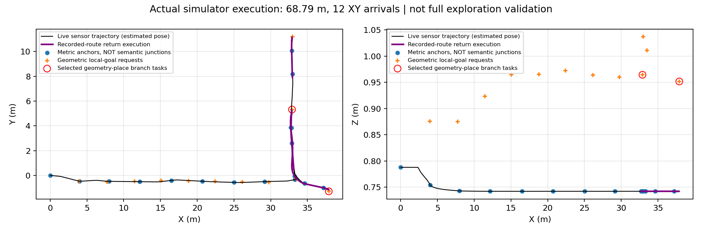
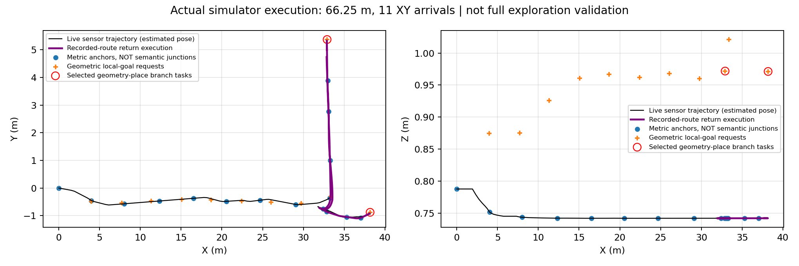

# 几何引导结构图：目前真正跑通了什么

**最终交付状态：开发闭环及隔离复现已完成。** v9原运行68.79米，隔离冻结版68.21米；两次均完成2次支路目标到达、2次返回与重新确认。复现294个输入源帧全部有原始bag依据，21项seal通过。完整证据核验见 [最终核验表](GSE_DEVELOPMENT_COMPLETION_AUDIT.md)。下方历史失败不改写；此结论仅指本次端到端开发系统，不代表全地图或学习方法成功。

**最新v9实测（此前复现失败仍保留）：** 直接支持返回快照版本实际行驶68.79米、12次XY目标到达、2次支路目标到达、2次返回与当前方向重新确认。第一次返回32.812秒、33.012秒重新确认、37.612秒任务到达；第二次51.212秒返回并确认、54.612秒待办目标到达。21个原始封存文件SHA全部通过，17个里程节点/16记录边。开发运行GATE_MIXED，不代表全图完成或学习优势。新版本还需核验隔离启动的实际运行，未宣布最终完成。



新版本恢复命令：`python3 tools/v3/prepare_geometry_reproduction.py --direct-support --destination /tmp/gse-direct-reproduce-new`；进入新目录后，使用 `configs/v3/gate6/gse_branch_geometry_direct_return_v1.json` 创建运行，再执行 `python3 tools/v3/run_live_geometry_shadow.py --execute --version 9`。指定镜像不变，原历史v7命令仅用于历史复现，不能执行已变源码冒充旧版本。

**最新复现核验：** 原先成功运行仍有效，但同一冻结代码在隔离目录再次实际执行时，行驶44.36米并返回原地点后未能重新确认支路，按原合同为GATE_FAIL。不能将下述单次成功表述为稳定复现。完整证据已保留，正在定位返回后的匹配链，不重训或更改阈值。详见 `GSE_DEVELOPMENT_COMPLETION_AUDIT.md`。

本文对应开发场景 `tunnel`、种子 11 的一次实际 Gazebo 闭环，不是训练成绩，也不是全地图探索完成报告。历史中心评分器的失败结论不变。

## 方法与主线的对应

我们的主线仍是：**几何基元 → 局部结构语义 → 拓扑图 → 探索行动**。

当前可运行版本先采用非学习几何方法：将当前及过去共五帧激光按运动对齐，拟合有观测支持的局部通道轴线，得到不同的通道延伸方向。多个方向持续出现时，登记一个“多方向观测地点”，保存各方向尚未尝试、已请求或已经到达的状态。

这个地点不是精确路口中心。当前没有把模型预测的红叉解释成真实路口，也没有让失败的中心评分器决定行动。记录图中还有供返回导航使用的里程锚点，两种点不能混为语义路口数量。

机器人选择一个尚未尝试的几何方向，将临时目标交给原局部规划器。移动过程中记录实际轨迹及相邻连接；需要返回时沿记录路径行驶。返回原观测地点后，必须用新激光重新找到相应方向，才能继续执行。保存的旧方向本身不是通行证明，未走方向也不冒充已经连接的全局边。

这证明了几何信息已经能影响实际任务选择，**没有证明学习方法优于普通几何方法**。学习模块后续应接入同一局部几何／结构接口，在相同后端下比较，不能把当前规则提取包装成学习成果。

## 一次实际执行的证据

运行目录：[原始记录](../results/gate6_single_robot/gate6_20260910_gse_branch_geometry_return_v1_seed11/)。状态为 `GATE_MIXED`：开发闭环执行成立，研究效果及完整探索尚未验收。

| 检查项 | 实际结果 |
|---|---|
| 激光输入 | 294 帧被接收；形成 290 次五帧几何输出 |
| 行驶 | 里程计累计 66.25 米，11 次局部目标 XY 到达 |
| 几何支路任务 | 2 次目标到达；不等于已探索两条完整隧道 |
| 返回与重新确认 | 完成 1 次返回原地点，并用当前几何重新确认方向 |
| 记录导航图 | 16 个里程节点、15 条记录轨迹边；不是 16 个路口 |
| 仍未完成 | 固定运行时限结束时，另一个返回任务正在执行；待办仍保留 |



图来自本次保存的在线记录，不是规划示意图。红圈是几何支路的临时目标，不是真实路口中心；背景未画完整地图，因此不能从此图推断地图覆盖率。

关键事件按仿真时间排列：21.738 秒请求第一个支路目标，25.938 秒到达并开始返回；36.738 秒回到原观测地点，36.938 秒重新确认另一个方向并请求目标，40.538 秒到达。随后启动另一个返回任务，但在本次时间预算内未结束。

## 哪些产物可以直接检查

- `artifacts/sensors.bag`：原始激光、位姿、局部路径、目标和速度指令。
- `artifacts/geometry/live_geometry.jsonl`：逐帧几何、来源与执行请求。
- `artifacts/geometry/live_geometry_snapshot.json`：记录图、地点方向状态、返回路径和执行事件。
- `metrics/summary.json`：运行指标及明确的未验证项。
- `artifacts/evidence_sha256.txt`：原始运行的文件校验清单。
- [图片来源记录](figures/gse_branch_geometry_return_v1/provenance.json)：图与原始数据的对应哈希。
- [冻结源码清单](reproduction/gse_branch_geometry_return_v1/archive_manifest.json)：绑定本次运行的 722 个源码文件和镜像身份。

## 尚不能宣称的内容

这不是全场景探索完成，不是严格未见测试，不是部署定位验证，不是物理安全认证，也没有测得全地图覆盖率。激光位姿使用模拟器指令姿态的源代码适配，尚未独立测量实际传感器链路的物理与传输时延。局部规划器消费 XY 目标，因此目标到达统计不能表述为三维结构识别精度。

当前拓扑采用实际穿越记录和几何观测地点，没有证明回环身份合并准确率、节点／边真值 F1 或几何学习优势。图快照中的通用记录图字段与外层实际控制运行标志应分别理解：有真实控制闭环，不代表图本身获得了语义真值认证。

## 复现边界与下一步

本次原命令为 `python3 tools/v3/run_live_geometry_shadow.py --execute --version 7`，精确规格位于 `configs/v3/gate6/gse_branch_geometry_return_v1.json`。**不要在原目录直接重跑**：执行器只接受新建未执行目录，历史结果不可覆盖。

源码归档是本次运行源文件快照，不是自包含发行包，不包含 Docker 镜像。新增恢复工具补齐启动工具和当前治理状态，并逐项核对冻结源码哈希。已在 `/tmp/gse-return-reproduction-20260910-v1` 实际恢复 722 个源码文件并通过隔离预检；未重复执行仿真。指定镜像已核实在本机存在。

在本仓库运行以下恢复命令，目标目录必须不存在：

```sh
python3 tools/v3/prepare_geometry_reproduction.py --destination /tmp/gse-return-reproduction-new
cd /tmp/gse-return-reproduction-new
python3 tools/v3/create_run.py --spec configs/v3/gate6/gse_branch_geometry_return_v1.json
python3 tools/v3/run_live_geometry_shadow.py --execute --version 7
```

最后两条才创建并执行一次新实验；恢复工具本身不启动实验。需要本机 Docker 权限及镜像 `sha256:5cbede29e4229e92d85ebaf919be2fb9ebc4ad9ed97029b7639997779062748c`。原工作区结果完全不变，复现结果位于新工作区的 `results/gate6_single_robot/`。仿真时序可能使统计变化，不保证跨运行逐位一致。

`RESTORE_REPORT.json` 记录归档、补充工具及状态文件哈希和预检输出。通用预检对本操作显示“数据卡仅快照”的警告；真正执行器还会调用专用数据卡校验，不能将通用预检通过说成所有数据验证已完成。

下一步优先补齐并验证隔离启动入口和证据检查，随后用同一后端做范围明确的进一步执行验证。学习几何仍是研究主线，但不重开已结案的中心评分支路；网络收益必须另有公平对照，不能由本次工程跑通替代。
