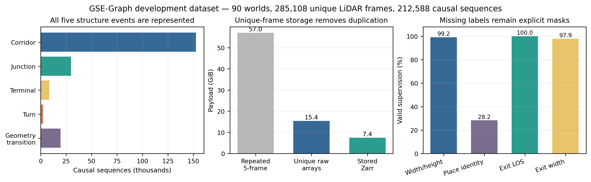
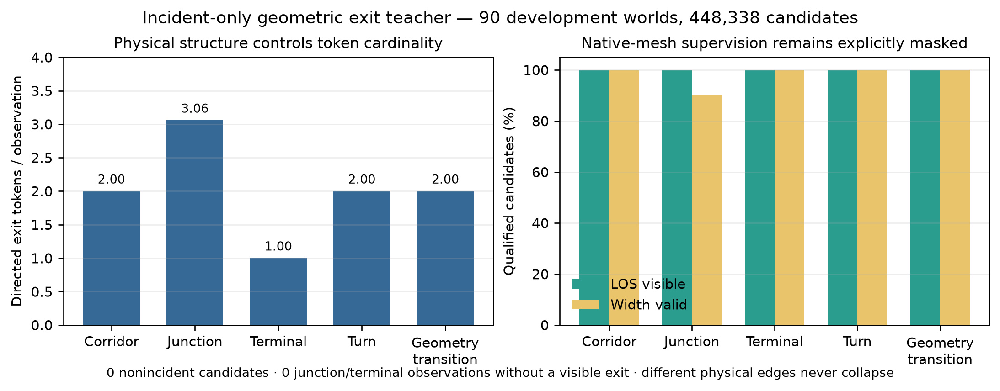
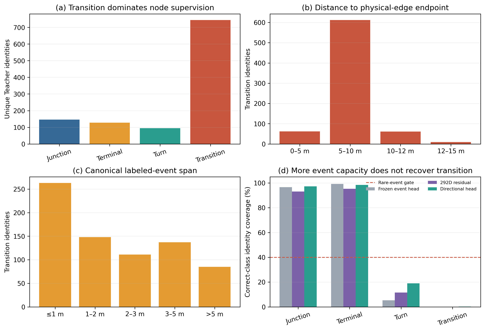
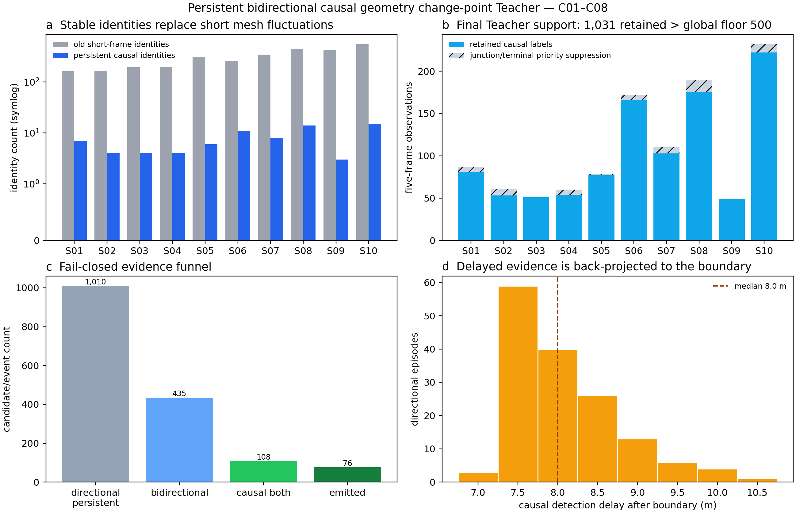
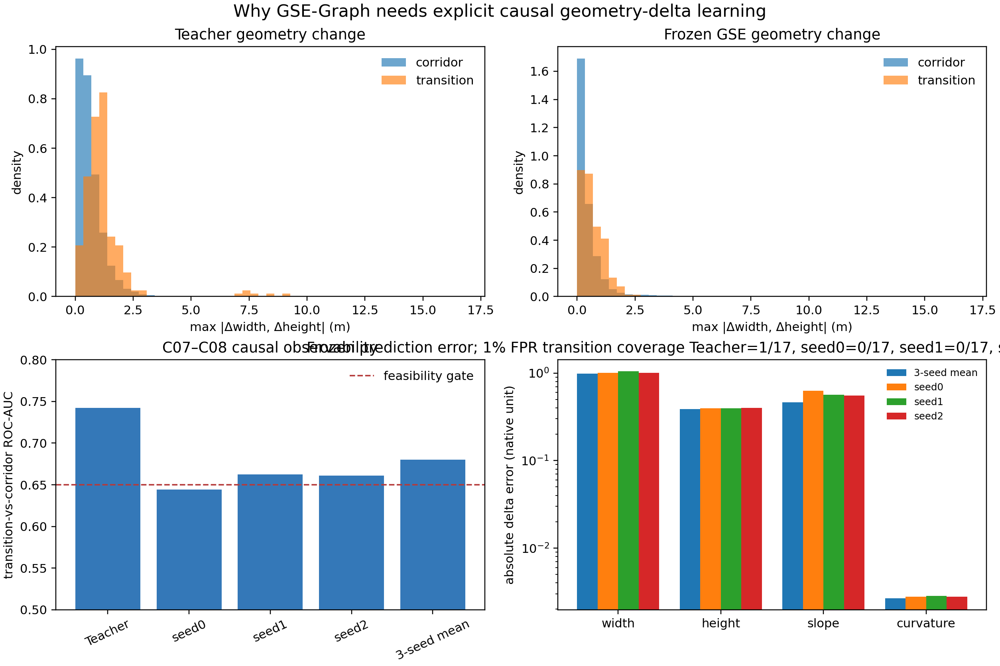
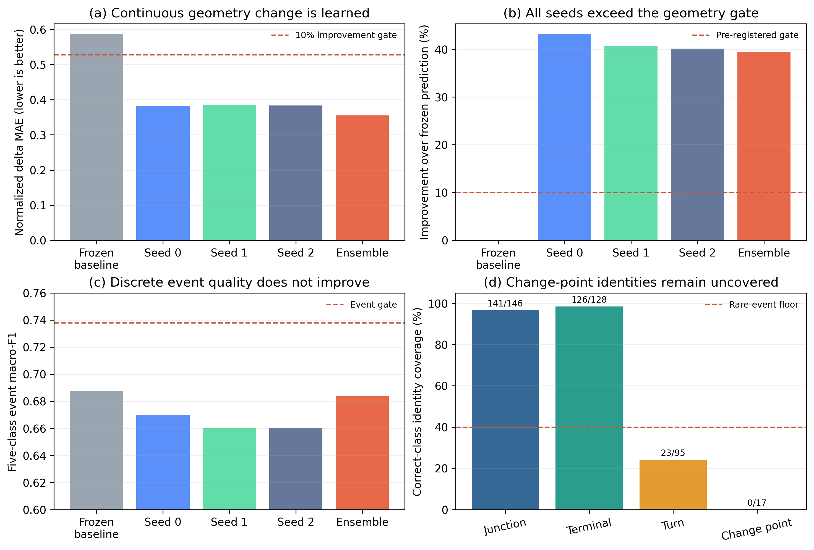

# Geometry-Semantic Event Graphs for Causal Underground Exploration

Status: `ACTIVE_DRAFT_RESULTS_NOT_COMPLETE`

Draft evidence boundary (remove only when replaced by sealed results): three-seed GSE perception training and risk-calibrated C09 perception have completed. The first formal C09 topology validations failed because rare structural events did not provide sufficient node recall under the fixed association-safety contract. A sealed persistent bidirectional causal change-point replacement and corrected 188,126-observation Teacher have passed. A three-seed frozen-backbone pure classification corrective then failed with `0/17` change-point identity coverage. A sealed C01--C08 audit subsequently proved transferable continuous geometry-change signal. Explicit frozen-representation delta/event multitask training reduced normalized geometry-delta MAE by `39.51%` but still covered `0/17` change-point identities, so it is retained as a component success and event-generation failure rather than promoted to topology. The single predeclared bounded last-encoder-block adaptation is active. C10, the GSE-specific M-TARE adapter, single-/multi-robot closed loop and their ablations have no current result. Bracketed `AUTO` fields below must not be converted into claims without their source seals.

## Abstract

Underground exploration requires a global representation that is compact enough for long missions and communication-limited robot teams, yet reliable under repeated corridors, ramps, stacked passages and sparse intersections. Exit-direction detectors provide local traversability cues, while existing topological systems commonly create and associate graph nodes with hand-written geometry rules. We introduce GSE-Graph, a causal LiDAR model that predicts explicit local geometry, structural events, a variable set of exit tokens, place descriptors and calibrated uncertainty. These outputs directly trigger structural nodes and determine revisit/exit association; ambiguous observations remain provisional, and graph edges are created only after traversal evidence. The planned closed-loop integration replaces only the global representation and target layer of M-TARE, leaving state estimation, local planning, collision handling and control unchanged. **[AUTO:PERCEPTION_RESULT]** **[AUTO:OFFLINE_GRAPH_RESULT]** **[AUTO:SINGLE_ROBOT_RESULT]** **[AUTO:MULTI_ROBOT_RESULT_OR_REMOVE]**

## Contributions

1. A five-frame causal LiDAR representation that jointly learns local axis, exit layout, width, height, slope, curvature, structural event, place identity and uncertainty.
2. A geometry-semantic event graph in which learned observations directly control node creation and uncertainty-aware association, while connectivity remains trace verified.
3. A pre-registered controlled single- and multi-robot exploration evaluation against original M-TARE, an exit-only learned baseline and a non-learning geometry event graph, with strict topology-parent isolation and failure-preserving evidence; its result remains pending in this active draft.

**Figure 1: GSE-Graph method overview.** The learned component ends at a typed and interpretable observation; it neither predicts unobserved connectivity nor replaces the local controller.

## Related work and method boundary

Purely topological underground navigation has learned LiDAR exit bearings and maintained temporally tracked galleries, but does not learn metric cross-section structure or node/exit revisit association. Geometry-driven exploration graphs instead derive nodes from accumulated maps, convex free-space regions, segmented line-of-sight regions or Voronoi skeletons. These approaches establish the value of sparse planning graphs, but their graph structure is extracted by fixed geometry rather than predicted structural events.

Learned topological mapping and semantic SLAM provide a second boundary. MLATC incrementally clusters point-cloud position, normal and traversability attributes into a hierarchical graph; SG-SLAM and LiDAR place-recognition methods use learned semantic graphs or descriptors mainly for localization and loop closure. PRISM-TopoMap [@muravyev2025prism] is the closest online place-recognition comparison: it couples learned multimodal retrieval with scan matching to maintain a graph of locally aligned locations, but its learned output does not define junction, terminal, turn or geometry-transition nodes. OVTG [@li2026ovtg] instead aligns open-vocabulary visual-language embeddings over an online graph, while retaining spatial-novelty node creation and temporal or nearby collision-free edge insertion. Bio-Inspired Hybrid Map [@dang2025bioinspired] inserts spatial-implicit local frames with learned features into a factor graph and creates new frames from accumulated travel/viewpoint variation; it therefore learns node content but retains a keyframe-style node trigger. FHT-Map [@song2023fhtmap] stores CNN-compressed visual features and local LiDAR scans in main nodes, supplements them with lightweight support nodes, and selects/refines nodes using visual richness, density and accumulated free space. Topo-Field learns an RGB-D layout-object-position field and queries it to construct a map. GSE-Graph differs in coupling only causal onboard LiDAR to an explicit tunnel-geometry/event interface whose predictions decide sparse exploration-node creation and exit-aware association, while refusing to infer connectivity without execution.

Recent structure-aware exploration also combines semantics and topology. Semantic Topometric Mapping [@fredriksson2024semanticexploration] rule-segments an accumulated 2-D occupancy map into intersections, pathways, dead ends and frontiers, then uses their properties for goal selection. Li et al. [@li2025heterogeneous] deterministically derive frontier, border, skeleton and viewpoint vertices from a 2-D probability grid and ESDF before learning a graph policy. SATE uses an aerial-image traversability heatmap, semantic-seeded Voronoi skeleton and a sparsity objective. AIM-Mapping [@cheng2025asymmetric] learns structural features from partial grid maps and uses privileged-information reinforcement learning for multi-robot boundary-goal assignment, while its topological representation is constructed from geometric distance. These methods establish that structural abstractions can improve exploration, but they do not learn egocentric underground geometry events that create and associate the exploration graph itself. Accordingly, our contribution is not “using a graph” or “using semantics for exploration”; it is the tested causal link from learned local geometric structure to online graph topology under ambiguous repeated tunnels, with connectivity trace verified and policy learning held out of the comparison.

## Method

### Causal geometric-semantic observation

The model consumes the current organized LiDAR frame and four past frames. Each frame is a 16×720 circular range image with a separate valid-return mask. It has no access to pose, the complete graph, mesh, spline, teacher identity or future observations. Circular convolutions encode each frame. A GRU aggregates globally pooled features for event, metric and place outputs, while a per-azimuth temporal branch preserves directional evidence that global pooling would destroy. The local horizontal axis is the circular moment of a learned azimuth distribution; its vertical component is predicted jointly and the resulting 3-D vector is normalized.

Six learned exit queries attend to the directional feature ring. Each query predicts presence, an attention-moment heading, opening width, a four-sample vertical profile and a normalized exit descriptor. The model also returns five event logits (corridor, junction, terminal, turn and geometry transition), converted to probabilities by softmax for calibration and deployment, together with width, height, slope, curvature, a normalized place descriptor and heteroscedastic geometry uncertainty. The number six is a representational capacity bound; presence calibration determines the observed variable-size set.

Training targets combine TNG event identity and spline kinematics with native-mesh cross-section measurements. At each route pose, narrow ray fans measure left/right wall distance and upward/downward ray distance; width and height are their projected sums. The development V1 Teacher labeled a geometry transition when adjacent 5 m cross-section medians changed by at least 1 m. Subsequent sealed failure analysis found that this rule mainly produced short, endpoint-concentrated and sometimes direction-inconsistent identities; it is therefore retained only as failed development evidence, not as the final transition definition. When an open junction has no unique four-sided scalar cross-section, only width/height regression is masked; the event, kinematic and association labels remain active. No analytic tunnel-radius value is substituted for a missing mesh measurement.

The training objective combines class-balanced event cross-entropy, a cosine angular surrogate for the axis, masked robust metric regression, exact small-set assignment for visible exit tokens, supervised contrastive place/exit association and a heteroscedastic geometry residual. Circular train augmentation rolls both the observation and robot-frame directional targets on the exact encoder lattice. Checkpoints are selected only by total validation loss; calibration and graph thresholds are fitted later without model updates.

The corrected causal event branch adds an explicit signed geometry-change objective over the same five-frame input. For every observation with a same-traversal predecessor four one-metre sequence steps earlier, the decoder predicts changes in width, height, slope and curvature. Each component is normalized only by its C01--C06 standard deviation. The delta and event branches share the circular azimuth-preserving change encoder, so metric supervision shapes the features that decide node creation rather than serving as a detached auxiliary diagnostic. Every valid fit delta is visited once per epoch; an additional identity-balanced event stream prevents the corridor majority from defining the event loss. C07--C08 selects one checkpoint per seed lexicographically by the unchanged event-safety gate, change-point identity coverage, normalized delta error, macro-F1 and earlier epoch.

The bounded adaptation changes capacity only after that frozen decoder has been evaluated and sealed. It loads the original GSE checkpoint rather than the failed decoder checkpoint, initializes a new delta/event head at the same zero-output point, and unfreezes only the final (96\!\rightarrow\!128) residual range block. This yields 271,104 trainable backbone parameters and 444,425 new-head parameters; the earlier range encoder, temporal GRU, directional temporal module and all original task heads remain frozen. AdamW uses learning rates (10^{-4}) and (10^{-3}) for the final block and new head respectively. Per-step gradient audits and per-seed before/after parameter digests enforce this boundary. Data, Teacher, split, epochs, checkpoint ranking and scientific thresholds are unchanged.

### Implementation and optimization details

The V1R network has 803,058 trainable parameters. Its range-image trunk maps two input channels to 32, 64, 96 and 128 channels with circular azimuth padding and residual downsampling. A 128-dimensional GRU aggregates globally pooled frame features, while two pointwise one-dimensional convolutions fuse all five per-azimuth feature rings without destroying bearing. The place descriptor has 128 dimensions. Six learned queries use eight-head attention over the directional ring and return 32-dimensional exit descriptors; six is only the maximum representational cardinality, and the calibrated presence prediction determines the observed set size.

Each epoch consumes every one of the 188,126 training sequences exactly once through deterministic pair-aware batches of 64 and evaluates all 24,462 validation sequences without augmentation. Event weights are computed once from training labels as \(N/(5N_c)\), i.e., inverse class frequency normalized to mean sample weight one, and the same fixed weights are used for validation loss. Event, axis, normalized geometry, exit-presence, exit-geometry, place-association and exit-association losses have unit weight; the heteroscedastic term has weight 0.1. Metric distance, slope, curvature and exit-profile residuals are normalized by 30 m, 45 degrees, 0.1 m\(^{-1}\) and 10 m, respectively. The scalar uncertainty head uses a sigmoid; its squared value, clamped below at \(10^{-4}\), parameterizes the variance in the geometry residual. Supervised contrastive association uses temperature 0.1 and averages anchors within each identity before averaging identities. We optimize FP32 parameters with AdamW (learning rate \(3\times10^{-4}\), weight decay \(10^{-4}\)) under BF16 autocast, clip the gradient norm to 5, and use deterministic kernels. Seeds 0, 1 and 2 train independently for at most 30 epochs with patience six. A checkpoint replaces the incumbent only when complete-validation multitask loss improves by more than \(10^{-8}\); an effective tie therefore retains the earlier epoch, and no task-specific best epochs are combined.

### Event-driven graph construction

The first route observation initializes one node, classified as structural only when its accepted event is non-corridor and otherwise as an anchor. Subsequent non-corridor events create structural-node candidates after a configured number of consecutive confident observations and a minimum travel distance. Independently, a metric anchor is created whenever travel from the current node reaches the fixed metric-anchor interval and no structural candidate is committed at that update. Association considers only nodes of the same kind and, for structural nodes, the same event type. It then gates candidates by spatial radius, calibrated place-descriptor similarity, world-frame exit-heading-set distance, and an exact small-set assignment over exit heading, descriptor, opening width and vertical profile. The C09 calibration fixes these thresholds to satisfy the association safety constraint; online operation uses only the frozen thresholds, not ground-truth precision. If the best and second-best place similarities differ by less than the ambiguity margin, the observation creates a provisional node instead of forcing a merge. No teacher identity is available online.

### Trace-verified connectivity

In the current offline experiment, an edge is committed only after a positive-length, multi-frame recorded traversal trace reaches a different node; the replay trace follows the pre-recorded directed traversal rather than a simulated closed-loop robot. Repeated traces between the same unordered node pair update one edge instead of adding a parallel edge. Each edge stores traversal count and records, mean/minimum/maximum length, minimum observed width and height, maximum absolute slope and maximum curvature. This separates learned structural hypotheses from trace-confirmed connectivity and prevents the offline graph builder from inventing untraversed shortcuts. The later closed-loop implementation must preserve the same contract using the robot's executed odometry trace.

### Planned exploration integration

The current repository has implemented and pre-registered perception calibration and offline graph replay, but has not yet implemented or evaluated the GSE-specific global target selector, M-TARE waypoint adapter or multi-robot graph exchange. The planned closed-loop layer will select untraversed exit tokens and route only over trace-verified edges, then hand the resulting waypoint to the unchanged M-TARE local stack. If the offline perception and graph gates pass, multi-robot experiments will exchange revisioned structural graph updates rather than dense maps. These interfaces remain future work in this active draft until their code and sealed closed-loop evidence exist.

## Experimental protocol

- Training data: 80 train parents, 16,078 directed traversals, 188,126 five-frame sequences and 252,430 unique usable LiDAR frames.
- Validation data: 10 C09 parents, 2,054 directed traversals, 24,462 five-frame sequences and 32,678 unique usable LiDAR frames. Directed traversals are world-level replay units rather than independent statistical samples.
- Storage: 285,108 unique frames are referenced 1,062,940 times by the 212,588 train/validation sequences; each sensor frame is materialized once rather than duplicated per sequence.
- Strict test: 10 C10 parents, opened once after model, calibration, rejection thresholds and graph parameters are frozen.
- Offline graph methods: GSE learned association; GSE with rule association; Cano-like exit model with rule graph; non-learning geometry event graph. GT-TNG is an identity-aware diagnostic only, not a deployable or theoretical upper bound.
- Closed-loop baseline, after the offline gates pass: original M-TARE with the same local planning, control and sensing stack.
- Seeds: 0/1/2.
- Required later ablations: no explicit geometry; one frame; deterministic association; no uncertainty rejection; no edge geometry. Only deterministic association is part of the currently implemented offline evaluator; the others remain pending and cannot support present results.

### Validation-only calibration and perception comparison

For each frozen seed, one scalar event temperature is fitted on all C09 validation observations by minimizing negative log likelihood. Event rejection then maximizes five-class macro-F1 using the joint reliability score \(\min(p_{\max},1-u)\), where \(u\) is predicted uncertainty. Exit presence is selected by matched-token F1. Place and exit descriptors are evaluated only against earlier observations from the same parent world; observations with the same route order are simultaneous and cannot match one another. For each descriptor type, the inclusive similarity threshold recovers the largest number of correct causal matches subject to precision at least 0.98 and false-accept rate at most 0.01; zero accepted matches cannot pass. Ground-truth identity is used only after a proposed match to score calibration and never enters the model or online association.

Because \(u\) is trained as a geometry-residual scale but is also used as a shared observation-reliability signal, we pre-register a diagnostic that cannot select a checkpoint, threshold or gate outcome. All validation observations are sorted into ten equal-frequency uncertainty bins. For each bin we compare predicted variance \(u^2\) with the exact masked, normalized Smooth-L1 geometry residual used by training and separately report structural-event error rate. The complete three-seed curves, weighted absolute geometry-calibration gap and uncertainty--error correlations are retained even when the cross-task reliability transfer is weak.

The learned event model is paired by seed with the frozen exit-only M1D checkpoint, which receives only the fifth range/valid frame. Its interior, junction and terminal logits map directly to those three GSE classes, while turn and geometry transition remain unavailable and therefore stay in the five-class macro-F1 denominator. Exit directions from both methods are additionally scored under the same 20-degree one-to-one heading-match contract, reporting direction precision/recall/F1, matched angular error, count exact accuracy and count MAE for every paired seed; this is a pre-registered diagnostic and does not alter the perception gate. The deterministic geometry baseline also receives only the fifth scan and estimates horizontal axis by PCA, width and height from five robust cross-sections, and slope/curvature from the fitted section centreline. For each of width, height, slope and curvature we report raw MAE and \(1-\mathrm{MAE}_{\mathrm{GSE}}/\mathrm{MAE}_{\mathrm{rule}}\). The mean relative improvement must reach 10%, with no field degrading by more than 5%. Event improvement must average at least five absolute macro-F1 points, at least two seeds must individually reach five points, and no seed may regress.

To expose class imbalance and avoid hiding weak structural semantics behind one macro average, the final perception table retains precision, recall, F1 and support for every one of the five event classes, for both methods and all three predeclared seeds. The table reports mean and sample standard deviation only after preserving the 30 raw method--seed--class records; it replays the frozen selected event points and performs no additional selection.

Aggregate validation can hide topology-specific failure. We therefore additionally replay the single globally calibrated event point, unchanged, within each of the ten C09 parents and report paired GSE-minus-M1D five-event macro-F1 for every seed. For continuous geometry, every parent, seed and field reports (1-\mathrm{MAE}_{\mathrm{GSE}}/\mathrm{MAE}_{\mathrm{rule}}), with the four-field macro value visualized alongside the event gain. This all-parent analysis is diagnostic-only: it cannot select a parent, checkpoint, threshold, field or gate outcome, and all 30 parent--seed records remain in the machine-readable source.

Before opening the strict-test split, we select graph parameters once on the ten validation parents. Each method/seed sweeps the same five-dimensional structural index grid: event stability \(\{2,3,4\}\) frames, minimum event travel \(\{2,4,6\}\) m, metric-anchor interval \(\{20,30,40\}\) m, association radius \(\{8,12,16\}\) m and ambiguity margin \(\{0.02,0.05,0.10\}\), for \(3^5=243\) settings. Method-specific perception and association thresholds remain frozen outside this grid: GSE uses its seed-specific calibration, rule methods use descriptor-free association, exit-only uses event threshold 0.5, and the deterministic non-learning method has one observation seed. The complete GSE configuration is first filtered for non-empty association precision of at least 0.98 and false-loop rate at most 0.01, then selected lexicographically by minimum node/edge F1, mean F1, graph-invariant error and grid index. Baselines are selected by the same graph-fidelity ordering without filtering unsafe association, so their errors remain visible. The scientific gain compares GSE node and edge F1 separately against the stronger of the exit-only rule graph and non-learning geometry rule graph; the deterministic-association ablation is reported but does not enter that baseline maximum. Both F1 gains must reach five absolute points, and absolute mean signed errors must not exceed 0.25 for connected components or cycle rank.

The two non-GSE graph baselines have different but explicit temporal contracts. M1D remains a frozen current-frame exit/role model and consumes only the fifth scan. The deterministic geometry-event graph receives the same five causal scans as GSE, applies the non-learning current-scan geometry estimator to each scan, and derives turn or sustained cross-section-change events only from that past-to-current sequence. It therefore controls for temporal evidence without learned geometry, descriptors or uncertainty and never reads a future scan.

Each validation parent is replayed in a deterministic directed Euler order, consuming every sequence exactly once. The evaluator collapses degree-two metric anchors before strict predicted-to-teacher identity scoring; duplicate predicted nodes, conflicting mappings and unmapped edges remain in precision denominators. Selected configurations are replayed a second time and must exactly reproduce their sweep aggregate before evidence is accepted.

**Figure 2: Dataset construction.** Training and validation use disjoint topology parents; five-frame causal sequences are sampled along directed traversals without opening the strict-test worlds.

**Figure 3: Geometry-Teacher coverage.** The plot reports the objective event and continuous-geometry supervision actually available to the learner, including masked cross-section targets where a unique scalar section is not physically defined.

**Figure 4: Exit-token Teacher audit.** Variable-cardinality exits are supervised only when they are causally visible; invalid or non-incident openings are not introduced as positive tokens. This diagnostic is retained in the supplementary evidence if the main-paper page limit requires removal.

## Results

### Development failure analysis: frame labels are not yet valid change-point nodes

The frozen event head already classified many turn and transition frames, but its single structural confidence threshold covered only `5/95` turn identities and `1/744` transition identities at approximately 99% node precision. A 292D residual decoder over frozen outputs increased turn coverage to `11/95` and transition coverage to `0/744`. We therefore trained a separate directional five-frame head whose event branch retained azimuth layout and separated binary node evidence from conditional event class. Its three-seed ensemble preserved precision/false acceptance at `0.990073/0.009927` and raised structural recall to `0.487987`, but covered only `18.95%` of turns and `0.27%` of geometry transitions.

The failure is not explained by absent forward sensing: almost all labeled transition frames have at least one current-frame forward ray reaching the Teacher's 5 m comparison span. Instead, `90.59%` of the 744 transition identities lie within 10 m of a physical-edge endpoint, `55.24%` span no more than 2 m, and `19.22%` appear in only one traversal direction. The V1 frame label therefore does not satisfy the persistence and direction-consistency required of a topological change point. We stop downstream topology and closed-loop claims rather than lower the one-percent false-accept contract. We consequently replace it with the persistent, bidirectionally consistent causal change-point definition qualified below.

**Figure 5: Why the V1 geometry-transition event is not yet a valid topology node.** Transition labels dominate structural identities, concentrate near physical-edge endpoints and are usually short. Increasing event-model capacity improves turn coverage but leaves transition coverage effectively zero under the unchanged node-safety contract. All plotted values are regenerated from sealed C07--C08 evidence; the figure does not use C10 or M-TARE.

### Persistent bidirectional causal change-point replacement

The replacement retains the original 5 m comparison span, 1 m width/height change thresholds and 10 m node radius, adding no result-selected geometric scale. Each physical edge is evaluated independently in both traversal directions. A candidate must persist for the comparison span, overlap its reverse-direction episode and agree on the sign of at least one active geometric dimension. A past-only detector then compares two completed five-sample windows, closes the delayed episode and back-projects its location to the estimated boundary. Only one-to-one causal support in both directions emits a label. Endpoint-near events merge only into a unique degree-two TNG node; terminal and junction labels retain priority, and ambiguous endpoint cases are rejected.

The sealed C01--C08 proof reduced 3,035 old transition identities to 76 stable change points: 45 degree-two endpoint nodes and 31 interior-edge points. The evidence funnel contained 1,010 directional persistent episodes, 435 bidirectional candidates and 108 candidates with unique causal support in both directions. After applying junction/terminal priority at the observation level, 1,031 labels and all 76 identities remained; C01--C06 and C07--C08 contained 59 and 17 identities respectively, and every topology family was represented. Detection occurred 7.0--10.5 m after the boundary (median 8.0 m), so graph nodes must use the back-projected boundary rather than the robot pose at detection. These results qualify the Teacher definition and capacity only; model learning and topology gains remain unproven.

**Figure 6: Persistent causal geometry-transition Teacher.** The logarithmic identity comparison shows how short mesh fluctuations are removed without erasing all structure families. The final observation panel applies junction/terminal priority explicitly: 1,031 labels remain, exceeding the global 500-observation capacity floor. The lower panels report the pre-registered evidence funnel and causal detection delay. Values come from a sealed C01--C08 proof; C09, C10, M-TARE, model inference and training are absent.

### Why explicit geometry-delta learning is necessary

The corrected Teacher contains 122,765 four-step pairs for which both geometry endpoints are valid: 92,845 in C01--C06 and 29,920 in disjoint C07--C08 worlds. Objective width/height change separates corrected transitions from corridors on C07--C08 with ROC-AUC `0.742067`. Applying the same operation to the frozen three-seed metric predictions yields AUC `0.680215`, with only `0.008180` absolute fit-to-selection drift. Thus the causal LiDAR representation contains transferable continuous change information even though the pure event classifier failed.

This observability is not itself a safe detector. A threshold fixed at the C01--C06 corridor 99th percentile gives approximately `1.065%` false positives on C07--C08 but detects `0/17` change-point identities from the frozen predictions; the objective scalar change detects only `1/17`. We therefore reject hand-written delta thresholding and train the shared explicit delta/event decoder described above. The audit is a development feasibility result, not a topology or strict-test claim.

**Figure 7: Transferable geometry-change signal does not yet imply a safe topology event.** Teacher and frozen-model changes both separate transitions in aggregate, but the 1% false-positive operating point covers essentially no independent change-point identities. This gap motivates shared explicit delta/event learning instead of a result-selected scalar threshold. The figure is regenerated from sealed C01--C08 evidence and reads no C09, C10 or M-TARE data.

### Explicit delta learning succeeds as geometry but fails as a node trigger

The frozen-representation multitask experiment completed all three seeds, six epochs per seed and 52,236 optimizer steps without changing the backbone or reading C09, C10 or M-TARE data. On C07--C08, ensemble normalized delta MAE fell from the sealed frozen-prediction baseline `0.587167` to `0.355174`, a `39.51%` improvement. All three seeds improved by more than 40%, and the component MAEs were `0.672 m` width, `0.349 m` height, `0.141 deg` slope and `0.00166 m^-1` curvature change.

This continuous improvement did not transfer to the discrete event contract. Ensemble event macro-F1 was `0.683669`, `0.004235` below the existing directional baseline, and geometry-transition F1 and identity coverage remained zero. The result therefore supports the narrower claim that causal LiDAR contains learnable metric structure change, while falsifying the claim that a frozen representation plus a new decoder is sufficient for reliable node generation. The experiment is sealed as a scientific failure (`aed1d39e...47e4`); no threshold, epoch or graph parameter is changed in response. The bounded final-block adaptation described above is the last predeclared representation fallback.

**Figure 8: Metric structure learning and topology-event generation are distinct requirements.** All three seeds exceed the pre-registered continuous-geometry improvement gate, while event macro-F1 remains below its frozen baseline target and no corrected change-point identity is accepted. PNG/PDF/SVG, plotted CSV/JSON, provenance and SHA-256 manifest are retained from sealed C01--C08 evidence (`e8e24f34...2f2948`).

**[AUTO:EVENT_AND_GEOMETRY_TABLE]**

**[AUTO:ASSOCIATION_AND_GRAPH_TABLE]**

**[AUTO:COVERAGE_TIME_CURVES]**

**[AUTO:TOPOLOGY_FIGURES]**

**[AUTO:UNCERTAINTY_AND_FAILURE_CASES]**

## Limitations

GSE-Graph does not predict an unobserved dense map and does not learn the local controller. A valid result must separate improvement caused by geometric-semantic graph quality from planner tuning. The original development geometry-transition Teacher and the corrected-label pure classification head are retained as failure evidence. The qualified causal replacement has sufficient supervision and measurable LiDAR observability, but the active explicit multitask model must still demonstrate identity-level event learning and graph benefit before the method can be frozen. If learned geometry does not improve offline association and graph metrics after that correction, closed-loop claims are removed rather than rescued by changing the exploration policy.
