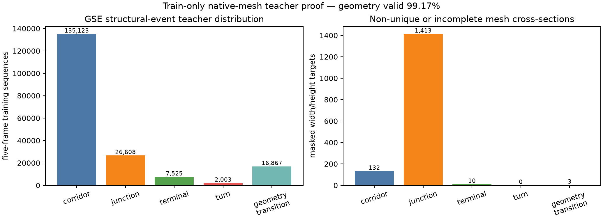
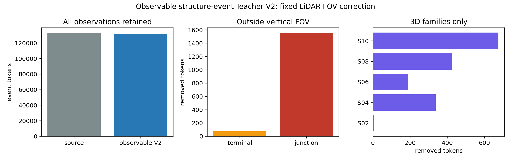
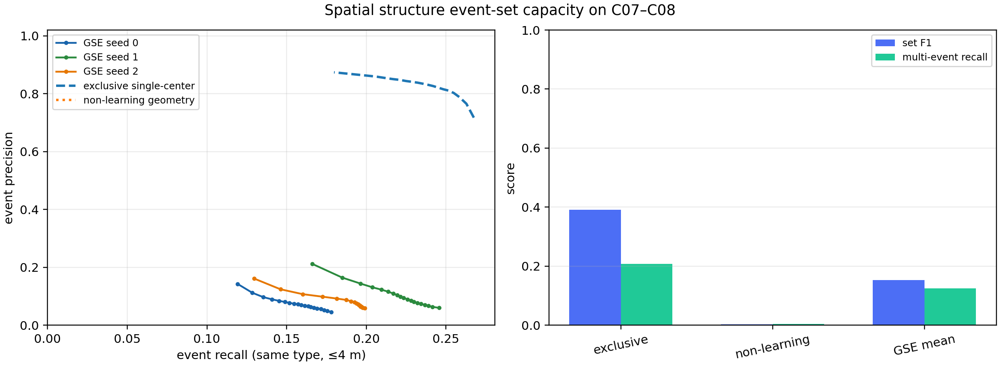
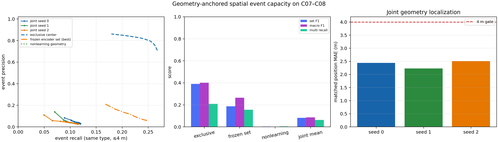
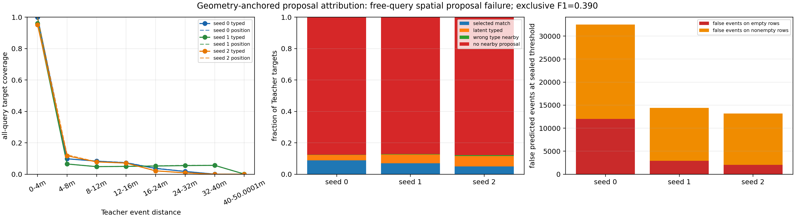
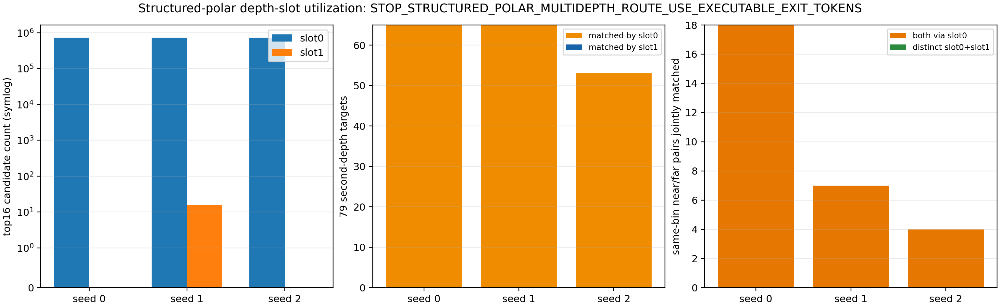
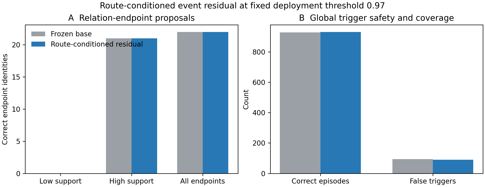

# GSE-Graph：Teacher、训练方法与失败归因报告

更新时间：2026-08-29  
当前结论：数据和客观监督链已经建立；出口与时序关系基线正在完成三种子训练；论文主方法仍是待正式验证的双 Composer 候选，学习语义驱动的正式拓扑图尚未开始。

## 1. 整体任务

论文要验证的链路是：

```text
过去 5 帧 LiDAR
→ 学习出口布局和通道度量几何
→ 形成路口、终点、转弯和几何变化事件
→ 事件决定节点生成与拒绝关联
→ 机器人真实穿越后提交边
→ 在线 Topometric Graph
→ 单/多机器人全局探索
```

这里的核心不只是“识别出口”，而是证明学习到的几何结构量确实参与节点和边的产生。否则方法仍然只是 Cano-like 出口检测加规则拓扑图。

## 2. Teacher 从哪里来

Teacher 不是外部模型，也不是人工猜测标签。它是利用程序化地下世界的客观真值生成的自动答案系统。

### 2.1 原始真值

每个程序化世界天然提供：

- TNG 拓扑图：真实节点、边、degree、tunnel 和 exit identity；
- spline：隧道中心线、真实行程、坡度和曲率；
- mesh 与几何参数：宽度、高度、净空及 LiDAR 遮挡关系；
- directed traversal：机器人沿每条边正向或反向行驶的真实顺序和弧长位置。

Teacher 沿真实 traversal 每 1 m 采样，并为每个五帧因果序列生成：

- 当前可见出口的方向、宽度、垂直轮廓和 identity；
- 通道宽度、高度、坡度、曲率；
- `corridor / junction / terminal / turn / geometry-transition` 事件；
- 同一物理事件的重访正样本和相似平行隧道等困难负样本。

学生模型训练和部署时只能读取 LiDAR。TNG、spline、mesh、world 名称和 identity 只允许 Teacher 与事后评价使用。

### 2.2 corrected causal Teacher

旧 Teacher 会把一个变化点前后较宽的区域全部标成变化，其中一些帧必须看到未来才能知道答案，也会把一个物理事件的相邻帧误当成许多独立样本。

corrected causal Teacher 改为：

1. 只使用当前和过去帧确认事件；
2. 变化必须持续存在；
3. 正向和反向 traversal 必须一致；
4. 延迟确认后沿已执行轨迹回投到真实事件位置；
5. 以物理 identity 统计覆盖率，不用相邻帧数放大样本量。

封存证据覆盖 80 个开发世界、16,078 条有向 traversal 和 188,126 个观测。它包含 1,031 个变化标签、76 个独立变化 identity、1,534 个全部结构 identity 和 74,064 对关联监督；0 optimizer step，0 严格测试世界读取。完整证据见 [Teacher summary](../results/gate2_representation/gate2_20260827_gse_corrected_causal_teacher_manifest_v1r_seed0/metrics/summary.json) 和 [Teacher seal](../results/gate2_representation/gate2_20260827_gse_corrected_causal_teacher_manifest_v1r_seed0/artifacts/evidence_sha256.txt)。

Teacher 与可观测事件分布示意：



按 LiDAR 垂直视场修正后的空间事件 Teacher：



## 3. 数据和训练划分

- C01--C06：60 个世界，142,184 个五帧观测，用于参数训练；
- C07：10 个世界，21,548 个观测，用于 checkpoint、校准和阈值选择；
- C08：10 个世界，24,394 个观测，只做一次零适配开发迁移评价；
- C09/C10 与 M-TARE：方法、阈值和 checkpoint 冻结前禁止读取。

完整去重数据包含约 285,000 个唯一 LiDAR 帧和 212,000 个因果五帧序列。相邻帧不作为独立结构事件；论文同时报告 frame 数、world 数和物理 identity 数。

## 4. 已尝试方法、训练原理和失败依据

### 4.1 出口方向与多任务结构基线

**原理**

把 16×720 LiDAR 转成圆周 range image，用共享 CNN 预测出口方向、出口数量和 `interior/junction/terminal` role。它回答“哪里有开口”，是 Cano-like 感知基线。

**得到的结果**

常见出口和路口有明显可学习信号，后续出口 token、descriptor 和 LiDAR 数据链均从这里继承。

**为什么不能作为论文主方法**

- 只预测出口方向与 Cano 的方法边界太接近；
- 事件由 hidden context 分类，几何量没有决定节点；
- route-aligned 采样使 local axis 近似机器人正前方，常数前向基线反而更准，因此 axis 不能单独作为学习贡献。

### 4.2 自由 query 空间事件集合

**原理**

类似集合检测器，一次输出最多 16 个带类型和三维位置的结构事件，使用集合匹配解决多事件共现。

**失败依据**

三个 seed 的 F1 只有 `0.130 / 0.186 / 0.144`，低于旧互斥中心基线 `0.391`。成功匹配事件的位置 MAE 约 `2.49--2.63 m`，说明位置回归并非完全无效，主要问题是大量候选无法落在 Teacher 事件 4 m 内。完整结果见 [capacity summary](../results/gate3_semantics/gate3_20260828_gse_spatial_event_set_capacity_v1_seed0/metrics/summary.json)。



### 4.3 Geometry-Anchored 自由候选

**原理**

让候选位置显式锚定在 LiDAR 可见距离和方位上，同时联合训练 encoder、事件存在性、类型和几何位置。

**失败依据**

匹配后的 3D MAE 达到 `2.23--2.51 m`，通过 4 m 位置门；但三个 seed 的总体 F1 仅 `0.086 / 0.093 / 0.069`，仍远低于旧基线 `0.390`。这证明主要失败不是“不会回归坐标”，而是自由 query 无法稳定产生正确候选。

进一步的全候选上界审计显示，忽略置信度后，4 m 内同类型 oracle recall 也只有约 `0.12`，约 29,000 个目标附近没有任何候选。因此停止继续调 loss、阈值和 query 数，改为与 LiDAR 方位结构一致的 polar proposal。





### 4.4 结构化 Polar Proposal

**原理**

不再让 query 在三维空间自由搜索，而是按 LiDAR 的 180 个方位 bin 和两个径向深度槽生成候选，再预测局部残差、事件类型和几何属性。

**改进与失败**

它解决了远距离空间锚定问题，所有可观测 Teacher token 都落在固定局部支持范围内，接口、旋转等变和有限梯度测试通过。但训练后复杂出口数量和稀有事件仍不稳定；候选 objectness、cardinality 与精确集合预测成为主要瓶颈。它证明 polar 表示应保留，但不能仅靠更复杂的出口集合损失得到可靠结构事件。



### 4.5 Route-Conditioned 小型修正头

**原理**

冻结已有 ActionSet 模型，只训练一个 643 参数的小型 residual head，把路线出口流和几何汇总加入事件决策。

**失败依据**

正确 episode 从 928 增加到 931，false trigger 从 94 降到 90，说明路线条件不是完全无效；但两个关键低支持端点仍为 `0/2`，完整图节点 recall 从 `0.704` 降到 `0.675`。因此低维汇总不足以恢复稀有结构，不能通过增加步数或调阈值补救。



### 4.6 稠密跨帧关系预测

**原理**

对相邻帧所有方位 pair 直接预测 `persistent / reveal / withdraw`，希望出口时序关系能够产生结构事件。

**失败依据**

关系极度稀疏：fit 中 reveal/withdraw 正例率约 `0.013%`，普通 dense BCE 需要数千倍正权重，精确方位 AP 很低；模型同时退化到约 83° 的方向误差，而已有五帧方向模型约为 5--6°。因此失败来自表示和损失机制，不是简单阈值问题。

### 4.7 当前 V2R5：稀疏圆周 Token + Relation Transport

**原理**

当前基线恢复已有五帧圆周 backbone，每帧产生最多 6 个出口 token，并显式输出：

- count probability；
- 出口 bearing、opening width、vertical profile 和 uncertainty；
- previous→current/dustbin transport；
- current reveal probability；
- 通道 width、height、slope、curvature；
- place/exit descriptor。

训练使用 C01--C06，C07 选 checkpoint，C08 只导出一次开发迁移预测；seeds 0/1/2 各 10 轮。当前 seed0、seed1 已完成，seed2 正在训练。

**为什么它仍不是论文主方法**

V2R5 还带有一个 `hidden context → event` 独立分类头，而且训练的是旧 transition mask，不是 corrected causal Teacher。它可以作为出口 token、时序关系和几何预测组件基线，但不能证明显式几何决定节点。

## 5. 失败的共同根因

| 根因 | 实验证据 | 处理方式 |
|---|---|---|
| 旧 Teacher 非因果且放大相邻帧 | 旧 transition mask 与 corrected change point 人口严重不一致 | 建立 corrected causal Teacher 和物理 identity |
| Teacher 超出传感器视场 | 1,631 个事件 token 位于固定 LiDAR 垂直视场外 | 只按传感器可观测性修正 token，不按模型误差删样本 |
| 自由 query 缺乏 LiDAR 空间锚 | 约 29,000 个目标无 4 m 内候选，oracle recall 约 0.12 | 改为 polar proposal 与局部残差 |
| 稀有关系严重不平衡 | reveal/withdraw 正例率约 0.013% | 改为稀疏 token transport、dustbin 和困难负样本 |
| 隐藏分类旁路几何语义 | event head 不消费 token/transport/metric geometry | 主方法拆成两个显式 Composer |
| local axis 任务过于简单 | 常数前向基线优于学习模型 | 运动方向只当坐标锚，不作为贡献 |
| 独立变化 identity 太少 | C07/C08 geometry-transition identity 仅 `5/12` | 必须报告跨 world AUC/AP 和 identity coverage，禁止用 frame 数夸大 |

## 6. 当前论文候选方法

当前候选是两个显式 Composer，而不是旧事件分类头。

### Action-Set Relation Composer

只消费出口数量、方位、宽度、垂直轮廓、不确定性和跨帧 transport，产生 `junction / terminal / provisional` 证据。descriptor、identity、TNG 和 hidden context 不得进入。

### Metric-Change Composer

只消费五帧预测的宽度、高度、坡度、曲率及其变化和不确定性，产生 `turn / geometry-transition`，并把因果确认延迟回投到实际轨迹位置。

### 图构建规则

- 高置信结构事件可以提出节点；
- 模糊关联必须拒绝合并并保留 provisional node；
- descriptor 只用于节点/出口关联；
- edge 只能在机器人真实穿越两个确认节点后提交；
- edge 保存长度、宽度、净空、坡度、曲率和执行状态。

历史 `ActionSetNodeDetector` 直接使用三个 seed 和 descriptor，历史 `CausalGeometryDeltaEventHead` 使用 hidden context 和 baseline event logits，均违反新接口，只能复用集合池化、因果 mask 和 loss 工具，不能改名充当主方法。

## 7. 当前效果和下一步判定

单 seed 的非正式显式状态诊断在未参与拟合的 C08 上得到 junction/terminal/turn/geometry-transition AUC 约 `0.949/0.997/0.742/0.658`。这说明完整显式状态包含非随机结构信息，但在 C07 选择的 98% precision 阈值下，geometry-transition identity coverage 仍为 `0/12`，因此只证明容量，不证明可部署性能。

V2R5 三种子封存后将执行一次正式审计：每个 seed 对四类事件分别在 C07 拟合固定线性诊断 probe，共 12 个 probe；C08 原样迁移，只在 score 层等权 ensemble。主探针禁止使用 event logits、descriptor、identity、pose、world、TNG 和未来帧。

若 junction、terminal、turn 和 geometry-transition 的预注册跨世界 AUC/AP 与跨 seed 一致性全部通过，才实现并训练两个新 Composer。若 novelty 必需的 turn/geometry-transition 失败，停止当前 Composer 训练，先验证 `RouteGeometryProfile`：从 LiDAR 预测前向通道的纵向宽、高、坡度和曲率剖面。不能退回出口计数，也不能用图或 planner 调参掩盖失败。

## 8. 当前阶段判断

- 数据、Teacher、LiDAR 和实验封存基础：已完成；
- Cano-like、规则图和多条失败方法：已形成基线与消融证据；
- V2R5 出口 token/transport/geometry 基线：三种子训练接近完成；
- 双 Composer 主方法：接口已定义，科学有效性未确立；
- 学习语义驱动正式拓扑图：未开始；
- 单机器人、多机器人闭环和投稿 PDF：未开始主方法正式实验。

因此当前项目不是从头开始，但也不能声称方法已经完成。真正决定论文能否成立的下一证据，是三种子显式状态能否在 corrected causal Teacher 上稳定恢复转弯和几何变化，而不是路口分类是否继续提高。
