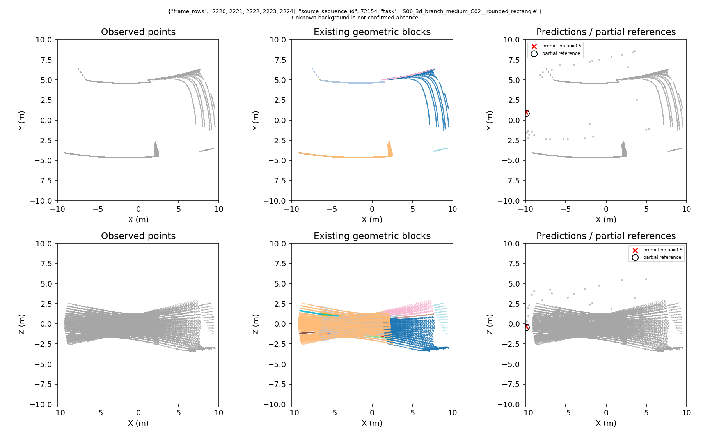
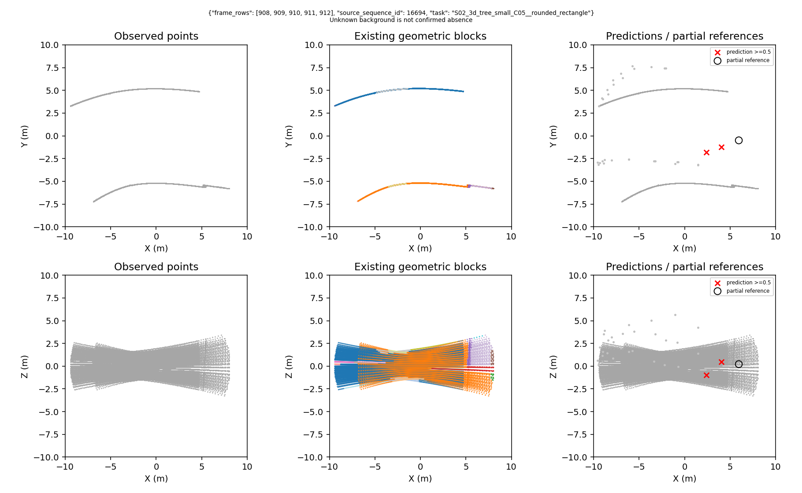

# 几何分组与普通空间分组：本轮实施及证据

## 最终结论

**已实际完成小样本中心拟合1000步及一次初始化修正重测1000步；两次均未达1米已知域P/R各90%。因此按任务书停止本轮大规模配对、分支和多种子扩展，没有证明几何组织或地图优势。不是只写了计划，也没有把负结果包装成成功。**

| 固定16观察、最终1000步 | TP | FP | FN | 未知预测 | 已知域Precision | Recall | F1 |
|---|---:|---:|---:|---:|---:|---:|---:|
| 原初始化PRIMITIVE | 1 | 7 | 11 | 4 | 12.5% | 8.3% | 10.0% |
| 仅位置残差零初始化PRIMITIVE | 8 | 9 | 4 | 3 | 47.1% | 66.7% | 55.2% |

这两行是同一目标模型的诊断修正，不是SPATIAL/PRIMITIVE胜负表。SPATIAL完成分组与共同前向接线、真实16项M核对，实际训练0步。两组正式中心/分支训练均未开始。最终修正版共有20个选中预测，17个进入已知域TP/FP计数，3个未知独立保留；这是逐查询覆盖合同，不是完整人工标注区域或完整空间体积。

修正版0.5/1/2/4米TP分别为1/8/11/12，FP为16/9/7/7。不能用4米12/12替代1米失败。第600步曾达到11TP、2FP，但Precision仍仅84.6%，后续又回落；没有选最好中间检查点宣布通过，也未在这些训练结果上改阈值。

### 具体失败位置，不笼统归咎于“没学会”

1. **位置输出初始化有不利行为。** 原初始化512候选中452个被推到10米球面，第100步511个。纯合成导数检查复现：对位于球外的共线径向误差，硬球投影可令该方向梯度为零。只将位置残差头的三行权重/偏置初始化为零，其余参数逐项相同，初始硬投影数变为0；末步全部候选最近均误差由2.865米降至0.895米。说明这个定点改动有作用，但不证明它是全部失败的唯一原因。
2. **还剩4次真正的定位漏失。** 修正版最终查看全部32候选，4个参考仍没有1米内候选；不存在“已有1米内候选只是被0.5阈值压掉”的漏失。因此不能靠降低阈值恢复这4项。
3. **训练负例邻域和严格评价存在需要解释的间隙。** 本轮复用原4米参考排除规则，而主评价是1米。最终9个已知FP均不在4米负例掩码中；重建原中心匹配后，其中4个是被训练匹配为正例、但定位仍超过1米的预测，另5个是未匹配且不受该负例项惩罚的额外预测。不能说9个都完全没有监督，也不能说只有去重问题。这是具体损失/掩码接口问题，而不是两种分组的对照结果。
4. **不是分支干扰或完全没有梯度。** 修正版1000次梯度全部有限、点编码每次均有非零梯度，分支梯度次数0。1米结果在600—1000步波动明显；没有据此擅自改学习率、继续训练或启用第二次修正。

后续若研究任务重新开放，应该优先统一“严格1米中心判定”与“已确认参考附近多余候选的训练语义”，同时保留真实未知；这是未实施的建议，不是本轮已经修复。当前一次修正额度已使用，不自动启动第三次训练。

### 实际资源、证据与图

原版259.91秒，修正版259.03秒，两次训练及评价合计约8.65分钟（不含实现与检查）。各1000实际更新、11个检查点、176项逐观察预测、32张初末图。修正版峰值主机内存约2.47GB、CUDA保留内存约310MB；最终模型推理中位23.37毫秒/观察，不含分组和源数据加载。SPATIAL16项分组预处理合计1.92秒；PRIMITIVE使用既有缓存，本轮未重测提取时间，不能据此比较两者总速度。

16项原始点数19,689—39,855，块数3—42，两种分组每项M相同。总301个几何块中218个跨越多个FPS空间块，说明不是仅改块ID或颜色；这个统计不证明哪一种更好。

按预先固定身份顺序展示第一个案例，修正版最终输出：



下面为固定顺序中的首个漏检案例S02、source16694：0TP、2FP、1FN，不能只展示上一张拟合较好的例子。黑圈是部分参考位置，红叉是达到0.5的模型中心；上排XY、下排XZ；本轮没有训练分支，因此没有把随机分支画成成果。



[修正版主指标CSV](../results/gate3_semantics/gate3_20260909_gse_grouping_center_fit_v1r_seed0/metrics/main_metrics.csv) · [16项最终逐观察评分/覆盖/误差](../results/gate3_semantics/gate3_20260909_gse_grouping_center_fit_v1r_seed0/metrics/evaluation_1000.json) · [原版最终摘要](../results/gate3_semantics/gate3_20260909_gse_grouping_center_fit_v1_seed0/metrics/summary.json) · [修正版最终摘要](../results/gate3_semantics/gate3_20260909_gse_grouping_center_fit_v1r_seed0/metrics/summary.json) · [独立失败分解及父地图计数](figures/gse_graph/grouping_fit_diagnosis_20260909.json)

两次run均正常exit0、科学拟合门槛FAIL，各263个封存文件的SHA及精确文件集合独立核验通过。原seal `25c28be34aee9ed8bc65f69e1917ed052080d1412ebf070d306a6e50bae9a1eb`，修正版seal `b08341236c3e52e1c70ed461c7c0c40fe950decdba3901cc2cea4cd1724d5e1d`。两次原始目录不可覆盖；修正版卡绑定原失败seal。统一报告链接两次证据，避免把修正重测伪装成首次成功。

### 任务书要求的五个直接回答

1. 改了什么：同入口分组开关、严格已知域中心评分、中心-only损失、小样本runner、最小顺序图适配器；另有一次仅位置头初始化的修正。旧资产保留。
2. 两个模型训练到哪里：PRIMITIVE原诊断1000步＋一次修正1000步；SPATIAL0步。未进入正式配对，不存在三种子相对收益成绩。
3. 严格1米是否改善：初始化修正后的训练拟合F1从10.0%升到55.2%，但P/R门槛仍失败；不能转述为几何基元胜过空间分组。
4. 同后端图是否改善：没有真实比较，`MAP_EVIDENCE_MISSING`。合成顺序回放通过不能替代真实图成绩。
5. 保留/停止什么：保留统一组织接口、严格评分、中心-only隔离、零初始化诊断、前缀图测试和全部失败证据。停止本轮长配对、分支扩训、多种子和图优劣结论；不启动中心响应图或另一批网络搜索。

本报告对应用户2026-09-09任务书，原文保存在`GSE_GROUPING_MINIMAL_TASK_20260909.txt`。旧中心响应图暂停，旧500步权重不作为本轮初始化。以下明确区分软件检查、训练拟合、配对优势和建图证据。

## 实际接线与公平性

- 原点编码为PointNet式逐点小网络与块内最大汇聚，可训练；每点输入含三维坐标、相对块中心坐标、按块范围归一化的局部坐标和五帧时间槽。不是仅训练一个最终线性分类头。
- PRIMITIVE复用`gse_spg_extractor.py`：先0.03米体素汇聚以计算几何特征，用45邻居估计局部四维形状特征，在10邻居图上进行cut-pursuit分割，正则参数0.1，随后拆解不连通分量并映射回全部原始点。边界由几何特征和邻接分割产生，不是预先标记“平行墙面组成T路口”。它不保证每块恰好是数学平面或语义通道。
- SPATIAL使用原点坐标确定性FPS，种子数等于相同观察PRIMITIVE的有效块数M，每点分配最近种子；相同坐标和距离并列规则固定，不随机混点，不删小块。两组中心、范围、退化标记都通过`summarize_partition`计算。退化是局部协方差无法支持可靠法向的标记，不是删除该块。
- 原缓存不是只存原几何块特征：它存五帧共900个传感器token及原始点。通过原始射线索引取对应token，再分别按两种分组、同样的原始点权重聚合。因此本轮可共同保留该缓存，不需要大规模重新预训练。禁止先把旧块特征平均成新块特征。
- 缓存来自固定历史编码器的`_memory(range_valid, translation, yaw)`，只消费当前及过去五帧，没有地点身份或全局图输入。局部点集半径10米，但冻结观测上下文沿用原完整扫描输入（最大50米）；不能将本方法描述为“所有信息严格限制在10米内”。两组上下文来源完全相同。
- 两组保持三层邻域交互、两层128维/四头Transformer解码器、相同观测查询与读出，显式9维关系属性关闭。检验的是分组方式，不是单独检验交互层贡献。
- 分支为64个可学习无序槽，不是64个固定角度箱。已有分支匹配接口保留。本次中心-only损失完全不访问分支答案、不匹配分支，分支参数无梯度；图中不画未训练的随机分支。

## 本轮实际数据

固定16个已有训练观察，12个有已知路口，4个没有正路口标签；来自5个父地图、5个已有物理路口。原始帧引用80次，去重后68个变体帧。同一地点和重叠窗口不是独立样本，这批只检查训练链路。

父地图：S02_3d_tree_small_C05、S03_flat_unicyclic_small_C04、S06_3d_branch_medium_C02、S08_3d_loop_rich_C01、S10_3d_complex_C04。完整源序号、五帧索引、构造/缓存/网格/标签哈希见本轮数据卡及run中的config。按父地图和已有正/无正标签分层，再按固定身份哈希选样，没有按模型成绩挑样本。4个没有正标签的观察不等于完整标注的空背景。

来源认证reader允许原已绑定任务级容器解码，以核对16个选中观察；未选观察不进入训练或评价，未读取校准标签/缓存来选权重，未读C08—C10。本轮不把历史开发数据重新称为最终未见测试。

## 训练与评价

单seed0，新初始化793,992参数；仅PRIMITIVE进行健康检查，最多1000更新，有效batch4，微批1累积4，AdamW学习率0.001、调试阶段weight decay0，禁用增强/dropout。中心损失沿用位置距离/10与正负分别归一化存在性；负例证据查询的是预测中心而非出发采样点。每100更新保存完整权重、16项预测和1米评分，辅助0.5/2/4米。调试阈值固定0.5，最终1000步已知域P/R均达到0.9才通过；不按最好中间步宣布通过。后续正式配对才在共同校准规则下选择阈值。

新评分先最大化门限内一对一匹配数量，再最小化距离。严格三维距离，分开保存水平与高度误差。完全重复的预测有确定性对应，剩余已知域重复计FP；未知独立列出，不伪装完整检测F1。旧评分及旧run不改写。

## 顺序建图的真实范围

旧`gse_causal_graph`要求事件类型、开口宽高和验证器证据，这次输出不具备这些字段；旧`gse_trace_commit_replay`包含片段首尾连边及事后处理，不能直接声称符合任务书。因此新增最小`grouping_sequential_map_v1`，不改原导航后端：三维1米关联、两次非重叠五帧支持确认；只有位姿实际进入节点1米邻域并连续到访另一个节点才形成边，保存中间轨迹；经过中间节点分段，断裂不补边。它只消费坐标/顺序/来源帧，分支未参与，所以不能声称分支改善连边。

合成测试已经执行：理想输入的三节点顺序到访形成0→1、1→2；仅看见多个节点不连边；重叠窗口不构成第二次独立确认；断裂不补边；前缀结果相同。连同分组、中心梯度、原检测器及新增初始化/径向导数测试，最终共25项通过（1.19秒）。这不是实际地图性能。

仓库有旧连续窗口及一个三变体30观察的连续运动诊断，不能说完全没有连续数据。但本次16项选择不是完整连续路线，也没有新模型对应、已完成穿越的独立边评分合同。目前真实图结果标为`MAP_EVIDENCE_MISSING`，不能用旧模型图或把16项按GT边编号拼接来补齐。

## 运行位置与命令

实验根：`results/gate3_semantics/gate3_20260909_gse_grouping_center_fit_v1_seed0`。`config/command.txt`保存实际命令；`artifacts/source_snapshot.zip`保存全部绑定Python源，`config/tracked_worktree.diff`和`worktree_status.txt`记录工作树。所有本轮图来自执行时保存的相同16项输入和预测。

```zsh
python3 tools/v3/preflight.py --spec configs/v3/gate3/gse_grouping_center_fit_v1.json
```

实际训练命令（该目录不可再次执行覆盖）：

```zsh
env OMP_NUM_THREADS=1 OPENBLAS_NUM_THREADS=1 MKL_NUM_THREADS=1 PYTHONHASHSEED=0 CUBLAS_WORKSPACE_CONFIG=:4096:8 /home/zeng-workstation/.local/share/mtare_topo_comm/envs/phase3_torch290_cu129_zarr2187_v1/bin/python tools/v3/grouping_center_fit_v1.py --spec /home/zeng-workstation/mtare_topo_comm/configs/v3/gate3/gse_grouping_center_fit_v1.json --run-dir /home/zeng-workstation/mtare_topo_comm/results/gate3_semantics/gate3_20260909_gse_grouping_center_fit_v1_seed0
```

一次修正版使用同一入口实现的配置封装：上述命令中的脚本改为`tools/v3/grouping_center_fit_v1r.py`，spec改为`configs/v3/gate3/gse_grouping_center_fit_v1r.json`，run-dir改为`results/gate3_semantics/gate3_20260909_gse_grouping_center_fit_v1r_seed0`对应绝对路径；准确全文保存在修正版`config/command.txt`。

以上是实际执行命令，不是允许在现有目录重复运行的命令。原版与修正版源码快照分别冻结；复现应在独立副本恢复相应`source_snapshot.zip`，新建独立规格及目录再预检，不能删除本run重跑，也不能用修改后的当前源码冒充原版快照。固定来源清单保留。最终终态、指标与下一步见报告顶部。
