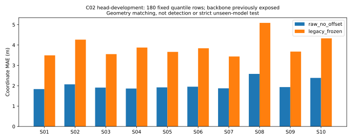
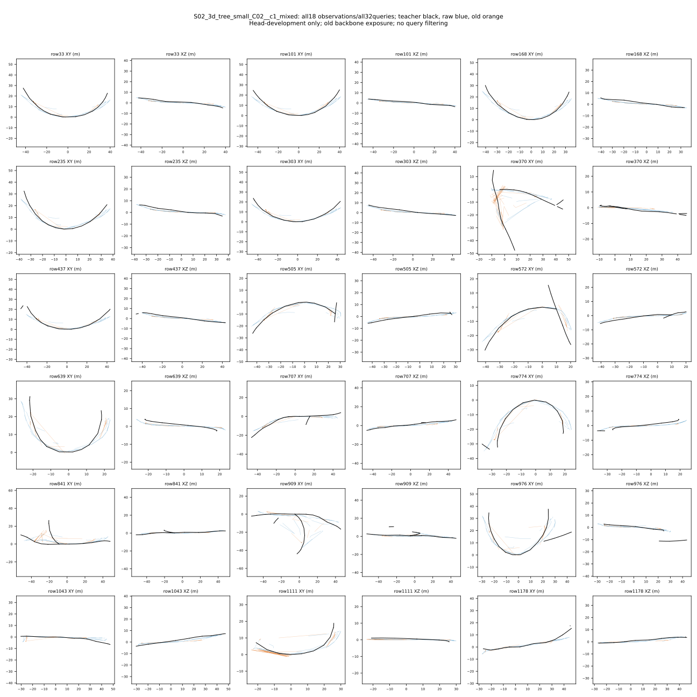

# 原始点读出的C02冻结开发对照

2026-09-05；实验已完成，不是仍在训练。

固定10个C02父地图、180观察、900唯一帧、1489可见基元。新小头只在C01的180观察上拟合过；旧骨干训练见过C01--C06，因此这是小头开发迁移，不是整模型严格未见测试。选样为预登记中点分位，不使用模型分数。

| 指标（观察平均） | 新原始点头 | 旧冻结模型 |
|---|---:|---:|
| 三个控制点坐标MAE/m | 2.031974 | 3.922121 |
| 控制点欧氏距离/m | 4.682758 | 8.791149 |
| 横向RMS/m | 2.643606 | 2.765252 |
| 无向方向误差/° | 18.291328 | 29.611238 |
| 两段折线对称距离/m | 3.042493 | 5.176916 |

10/10父地图坐标MAE改善，但横向改善小。各方向有未定义片段：raw15、old20；不能宣称完全相同可解人口。全部5760候选保留、1489目标匹配、4271剩余候选未受检测FP惩罚，不能当作检测或结构图PASS。新读出加额外训练与旧模型比较存在归因混合；必须用同预算对照而不是将收益全部归因于原始点坐标。

所有10父地图均保存全观察XY/XZ图，共11SVG，不只选S02。run=`results/gate3_semantics/gate3_20260905_gse_head_development_inference_v1_seed0`。各模型180主输出+18重复逐值一致、180骨干缓存窗口、0optimizer/新标签；权重状态和输入不变。20.068515s，hostRSS2127581184bytes，GPUreserved2082471936bytes，均在4GiB上限内。RUN_STATE=COMPLETED，error=null。309项指定软件回归通过；28项输出seal逐项复核，seal-list SHA256=`71b9888e3882061e9afaa0a1c32b1c8224c1a4cbb00d759caa9536e539a66986`。

原offset分支STOP和历史失败run不改写。下一步同预算几何对照与结构教师/图软件并行，几何未完美不阻止受控结构实验；禁止新旧query几何字段混搭。
