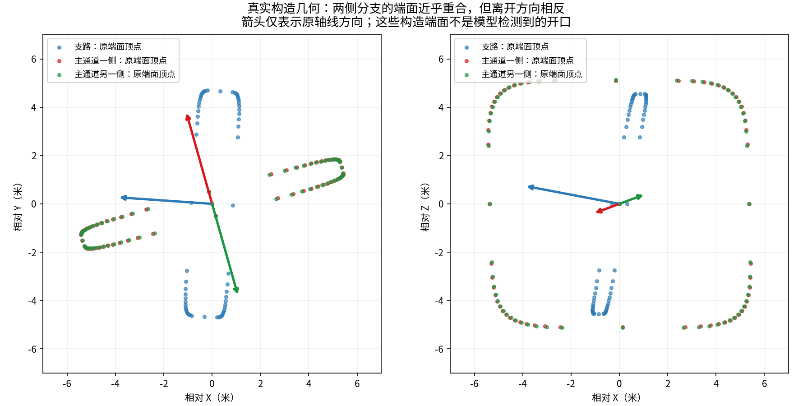

# 已定位：反向分支共享截面，不能用交点先后区分

2026-09-07，只读原30范围内S08的三份已绑定构造文件，逐文件SHA-256核对。没有重新渲染扫描、改标签或训练。

红色、绿色是通道两侧，蓝色是另一条支路。箭头来自原轴线，不是模型预测；点是原始端面的网格顶点，不是LiDAR返回。

## 证据

edge_0086的末端与edge_0092的首端三维轴线坐标逐元素完全相同。沿两条分支离开该点的单位切向量内积为−1，对应180°。对原始网格端面拟合平面，另一端面的最大平面残差约1.01—1.05×10⁻¹²米，三个几何实现一致；截面宽高及形状参数不完全相同，所以不能声称两个网格完全相等。

第三条支路的端面法向与这两者约相差71.86°。这与一个路口有相反的通道两侧及另一条支路相符，而不是沿激光先后排列的三个开口。

因此前次微米级交点先后不具有可依赖的结构含义。保持两个方向的独立分支身份是正确的；合并它们或靠微小参数排序区分它们都不正确。

## 下一步约束

停止反复端面求交，不再用这种接口寻找训练成功。回到计划的“可见开口＋观测支持”：开口必须对应离开路口后的局部通道和可见表面证据，构造切面仅提供参考；三维锚点独立于开口，未知仍未知。既有方向、局部截面和射线证据可复用，但尚未形成完整训练答案，不能启动A/B/C或声称主方法成功。

图片首次输出使用了未安装的字体名称，已在独立v1r目录用实际安装的中文字体修正并目视核查；旧图保留，报告引用修正版。图片provenance保存原文件哈希、轴线方向和图片哈希。
