# 学习几何接入已运行底座：当前接口核对

## 2026-09-14：发现建议策略的生产前提缺口，不能继续称为“只差接线”

本次只检查当前代码和固定镜像源码，没有重新读取115窗口/560配准数据，也没有训练或新仿真。前一轮局部执行接线是实际进展，但它不能补出下面缺失的结构任务语义。

### 已核实的因果链

1. 原生`GridWorld::GetExploringCellIDsAndPositions`（固定镜像中`grid_world.cpp:1263`起）主要把非邻域、已在原生图上可连接的EXPLORING区域交给全局VRP；邻域内通常由局部探索处理，也存在特殊条件例外。**不能把全局候选一概视为当前10米点云里可见的开口。**这不证明实测候选全部在10米外，尚未运行这种统计。
2. `structural_token_retrieval.py:retrieve_structural_candidates`输出的是最多5个历史观测候选；`native_token_registration.py:verify_native_candidate`给局部表面对齐证据，明确保持`task_identity_verified=false`、`direction_verified=false`。
3. `structural_route_policy.py:suggest_from_verified_task_history`需要每个当前原生候选对应一个`NativeTaskCandidate`或明确未知；有效历史关联还要方向/层级/轨迹证据，且历史任务必须为`COMPLETED`并带完成证据，才可能推迟该候选。
4. 当前实际native生产/消费路径没有创建`NativeTaskCandidate`、任务级`TaskEvidence(EXPLORATION_COMPLETE)`或调用`resolve_associations`的生产者；这些条件只在合成测试中被人工构造。ROS侧车也尚未调用该排序器，而是identity/静态缓存路径。局部执行记录没有被改名为这些条件，故仍不能触发该策略。

固定原生源码镜像：`sha256:5cbede29e4229e92d85ebaf919be2fb9ebc4ad9ed97029b7639997779062748c`。这属于**系统任务定义和生产接口不相容**，不是又一次模型训练失败，也不证明几何方法不可行。继续增加来源日志或把策略函数接上，仍不会凭空产生合格方向任务。现在不能把原生identity运行称为学习闭环或用它评价冻结特征是否有效。

### 必须明确的调整边界

- 保持现策略：必须先增加可观察方向任务、层级与任务完成证据的真正生产机制；这已超出“把已有局部执行字段接上”的小修，不能从visited/grid/ICP通过伪造这些值，也不能直接恢复训练。
- 推荐有限调整：将**访问顺序建议**与**任务完成判定**彻底分开。允许经核实的局部结构对应和已执行路径参与原候选排序，但绝不转移完成状态、不删候选、不创造边；候选—历史局部上下文映射及证据不足时的回退必须先定义清楚。这改变当前PLAN顶部“保留已完成方向排序前提”的实现合同，需要明确更改该合同；不能仅删一行COMPLETED判断就宣称修复。
- 只运行原生/非学习系统可以保留工程底座，但不能代替持续目标中的学习参与。

本次停止受影响的建议策略扩展与新长仿真，保留输入/局部执行/配准及所有历史结果。全目标仍未完成，首次明确报告此策略合同停点；尚未改排序规则、阈值、数据或模型，也不登记目标完成。下一需要明确是否允许上述有限策略合同调整，而不是再次请求普通测试或运行批准。

## 当前补齐：把“机器人被要求去哪”和“随后实际移动”对应起来

当前发现并处理的是接线问题，不是又训练一个网络：M-TARE选择的远处区域和它实际发布的近处运动点不是同一个对象。此前区域账本拒绝两者混用是合理的，但缺少单独记录近处执行的接口。现在新增局部执行记录，保存原路线、原规划路径、实际发布点、发布时位姿和后续运动；计算机器人沿命令方向前进多少、还距该点多远。后续换了目标或丢失连续来源，就结束旧记录，不把两段拼起来。

154项输入/侧车/执行测试及63项任务/路线回归通过。模拟ROS已通过真实侧车回调保存一条完整合成命令—运动记录。这不是新仿真：新增真实训练、模型前向、仿真、学习控制变化均为0。也没有把到达局部目标称为探索完一条通道。

当前剩余的关键缺口仍是**结构对应怎样绑定到方向任务并实际改变路线建议**。已经打通输入和局部执行反馈，并不等于整个学习闭环完成；原115窗口、560配准和38访问结果不改写，不重复统计。实现：[局部执行来源](../src/mtare_topo/integration/native_local_execution.py)、[软件反例测试](../tests/v3/unit/test_native_local_execution.py)。

## 最新软件进展：模型结果能够送到原生决策回调，任务决策尚未完成

常驻模型服务、实时五帧预取节点和原生侧车之间已增加实际通信接口。后台线程核对结果文件、原始五帧、位姿及权重引用；原生回调只读取“已经核对完成且来源完全相同”的特征，不为模型延长等待，不把晚到结果写成当时已可用。124项相关合成测试通过，其中包括实际socket通信和模拟ROS回调；没有新增真实模型运行或仿真。

目前**特征可用还不会改变路线**。排序代码只会推迟已确认对应到“完成方向”的任务，而现有实测证据仍是区域访问，不能证明某方向已探索完成。后续工作是补任务/方向与执行反馈的真实生产对应，再消费学习检索；不是再改模型分数或重复输入检查。原115模型窗口、560配准候选和38次访问结果保持，学习真实改变控制仍为0。

## 最新：已区分真实访问，继续补实际路线与执行的对应

复用已有115个决策时刻，全部与机器人实际访问记录精确对应，得到38次原生区域访问。156个局部点云对齐候选中，62个来自同一次访问、94个来自其他访问；26个时刻仍有多个访问候选。它不是“识别出38个路口”，也不是确认了94次回环。运行0.499秒，15项证据哈希通过，没有重训、重复配准或新仿真。

完整原始记录回放得到25个区域任务，仍全部待执行；114条路线意图，120条实际运动目标中108条与此前意图绑定、12条缺绑定。没有确认方向完成或学习改路线。旧在线侧车24任务与完整trace25任务属于不同接收覆盖，旧结果保留。

目前明确的工程问题是：全局路线上的某个区域，不等于机器人随后执行的局部方向。原程序的`GetNextGlobalSubspace`使用按值传参，不能将其输出用于绑定任务。没有改动原规划行为；新增默认关闭的记录接口，保存原生三维规划路径、前视点和实际发布目标，按同次消息来源绑定，拒绝沿用过期证据。路径仍是计划，不冒充实际穿越。60项相关软件测试已通过，原生`tare_planner_node`全目标编译及C++路径/core/disabled transport测试通过，用时26.602秒；[编译结果](../build/native_structure_bridge/v2_planning_paths/summary.json)。尚未在新仿真产生这类路径证据。现有在线侧车仍只是精确epoch静态缓存，实时模型生产与方向任务验证是后续接线，不是已经完成。

结果：[访问绑定汇总](../results/gate6_single_robot/gate6_20260914_gse_native_visit_wiring_v1_seed11/metrics/summary.json)、[全部访问候选](../results/gate6_single_robot/gate6_20260914_gse_native_visit_wiring_v1_seed11/artifacts/registered_visit_candidates.json)、[原生任务记录](../results/gate6_single_robot/gate6_20260914_gse_native_visit_wiring_v1_seed11/artifacts/native_region_registry.json)。下方“访问尚未执行”为历史状态，已被本节替代。

## 最新补充：模型候选已经经过真实点云核验，仍未确认探索任务身份

在此前保存的115个时刻、560个历史候选上，复用原始激光回波和三维记录位姿，完整执行了一次固定参数的局部点云配准。没有训练、重新检索或新仿真。用时108.731秒，峰内存约465MiB，14项证据哈希通过。

| 检查对象 | 实际结果 | 含义 |
|---|---:|---|
| 全部历史候选 | 560项均处理 | 未筛掉难例或只保留成功项 |
| 局部几何拟合通过 | 156项 | 当前局部表面在固定标准下能对齐，不等于通道身份已确认 |
| 局部几何拟合拒绝 | 404项 | 主要缺少重叠，也包括误差过大；原任务保持不变 |
| 至少一个候选通过的时刻 | 86/115 | 具备继续核对对应的局部证据 |
| 多个候选同时通过的时刻 | 44/115 | 必须区分同一次访问的多帧与真正身份歧义，不能直接选最高分强并 |

更具体地说：拒绝候选的记录位姿间距中位数约31.96米，其中268对超过20米；而我们两边都只用10米局部点云。全部560对中309对最终没有有效点对应。这说明特征检索会把一些不重叠的相似外形排到前面，几何核验能够把它们拒绝掉。**这不是证明404个“通道判断错误”，也不是证明156个正确回环；这里还没有独立身份真值。**

下一段接线是把通过的几何对应交给实际访问和方向任务，而不是直接改路线。新增的访问绑定器要求来源窗口、位姿时间、实际机器人位置及原生起点区域一致；再次回到同一区域也另记访问，不合并成唯一地点。该新绑定器目前只完成7项软件测试，真实运行尚未执行。当前确认任务关联、方向完成和学习改变路线的数量仍为0。

本轮原始证据：[全部560项配准](../results/gate6_single_robot/gate6_20260914_gse_native_token_registration_v1_seed11/artifacts/registration.jsonl)、[逐时刻歧义](../results/gate6_single_robot/gate6_20260914_gse_native_token_registration_v1_seed11/artifacts/epoch_outcomes.json)、[汇总](../results/gate6_single_robot/gate6_20260914_gse_native_token_registration_v1_seed11/metrics/summary.json)。配置在运行前固定，不采用测试夹具阈值，也未按结果调整。

## 最新：原生五帧输入与历史检索已真实跑通，控制链仍未完成

显式来源补录 `gse_explicit_source_capture_v1r1` 完成120仿真秒，机器人走231.876米，保存600轨迹点。617条原始扫描、611条注册扫描及同callback来源记录，组成115个原生决策五帧窗口；575条唯一原始帧全部来源绑定。冻结模型实际处理115/115窗口，0拒绝、0训练；394项证据哈希通过。它是原控制器运行后的特征处理，不能说这些特征已经参与本次驾驶。

侧车收到114个候选快照并返回114次原路线；导出记录包含115个快照，两者差额保留。当前记录24个原生区域任务，但0个方向任务、0条确认穿越，结束信号为false。区域网格不是通道方向，不能靠改名称补出任务。

随后 `gse_native_token_retrieval_v1` 复用全部115个保存特征执行真实因果检索：第一时刻没有历史，后114时刻共提出560个历史候选，最多5个/时刻；59.946秒、峰RSS约754MiB、0新模型前向/训练/仿真。12项新seal通过。读取器逐项绑定原始五帧字节、位姿、token、epoch及原生来源；相关21项软件测试通过。

**检索结果不等于认对地点。** 前两名相似度分差中位数仅0.00009489，最小0.000002205；尚无独立重访身份评分，也没有执行配准，所以不能由这个差值宣布特征有效或失效，更不能确认任务合并。此次GATE_MIXED只是接口成立，不是检测、图或探索优势。

剩下的具体接线是：历史候选→真实点云配准→方向及执行一致性→原生候选任务→路线建议。目前ROS侧车只读取预先缓存的建议，没有在线token生产者；离线归档不能冒充实时缓存。配准代码可复用，但生产配置与传感器/机器人坐标绑定还需明确。默认原路线回退继续保留，不能用高相似度绕过配准或伪造完成。不会再为这段接线重训中心评分器或重采相同数据。

结果：[来源与模型运行](../results/gate6_single_robot/gate6_20260913_gse_explicit_source_capture_v1r1_seed11/metrics/summary.json)、[全部检索记录](../results/gate6_single_robot/gate6_20260913_gse_native_token_retrieval_v1_seed11/artifacts/retrieval.jsonl)、[检索汇总](../results/gate6_single_robot/gate6_20260913_gse_native_token_retrieval_v1_seed11/metrics/summary.json)。以下各节为保留的历史状态，未完成事项以本节为准。

## 2026-09-13继续接线：计划与实际运动已能逐条对应

同一120秒旧记录中，侧车原本已经保存113条原生路线决策，却没有把它们交给任务账本。补上消息接线后，只读重放获得113条路线意图，118个实际局部运动目标中112个能绑定此前同一决策；另6个缺少此前完整意图，保持未知。这些只说明“系统计划去哪”和“随后发出了哪个局部目标”有了对应，**不代表到达了远端任务，更不代表完成方向探索**。原执行attempt=0、completed=0、模型改路线=0不改写。

原始帧与注册帧的旧时间推断不再采用：122359条/clock消息中8991项的消息时间晚于bag接收时间，因此不能用跨订阅接收时钟假装严格来源证明。已在原转换callback增加默认关闭的显式来源记录，原扫描算式和发布保留，并在固定镜像完成vehicleSimulator编译。尚未补录，旧包不会凭空获得新字段。下一把这个可靠来源接口接到完整三维模型输入，不继续靠改阈值或重训解决工程接线问题。

## 2026-09-13更新：同120窗口的三维姿态输入已实际修通

新运行 `gate6_20260913_gse_native_full_se3_v1_seed11` 使用同一批保存的原始激光、完整位姿和冻结权重：120个窗口全部处理，0拒绝；原106个姿态接口拒绝消除。运行37.535秒，GPU峰约396MiB，进程内存约1.94GiB，258项证据哈希复核通过。没有重训、重新采集或挑选样本。原14成功/106拒绝作为旧yaw接入的历史结果保留。

修的是完整三维旋转没有透传给公共编码适配器，不是证明模型结构预测变准。此结果只证明真实输入能完整经过网络。规划器113次决策的五帧来源还需单独绑定，且旧执行记录中113次局部运动目标不属于全局候选，不能把走到中间路点改称任务完成。学习改变路线、方法优势与三组长仿真尚未证明。

## 2026-09-13：已实际补录仿真并运行冻结模型，尚未形成学习控制闭环

这一轮不是继续训练，也不是重做中心检测。我们把原生 M-TARE 的路线候选、建议、最终决策和执行反馈接出来，原控制器仍是唯一运动目标发布者；再用真实原始激光执行已有网络，检查学习特征能否接入这条链路。

| 实际完成 | 结果 | 不能据此宣称 |
|---|---|---|
| tunnel、seed11 原生开发仿真 | 120 仿真秒，600 条同步扫描/位姿，235.550 m 路程，118 个运动目标 | 完整探索结束、整图覆盖或学习路线收益 |
| 原始数据与原生桥接录制 | 610 条 raw 激光；113 组候选/建议/决策；1641 条反馈 | 这些候选已经是学到的通道 |
| 区域任务状态机 | 12 个区域任务；152 次证据绑定不合格被明确拒绝，0 侧车异常 | 区域到访等于各分支已完成 |
| 冻结特征处理 | 全部 120 个固定窗口留档，14 个保存逐射线局部特征，106 个姿态接口拒绝，0 训练 | 已完成方向识别、可靠对应或模型优势 |
| 实际路线变化 | 113 次建议全部保持原生路线 | 学习已影响控制；本轮没有该证据 |

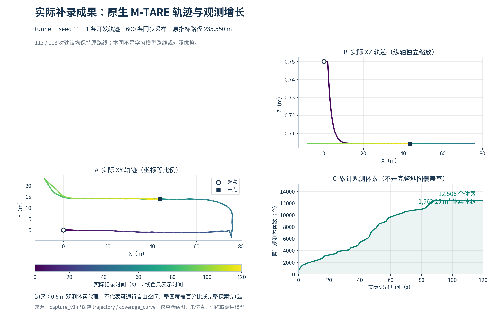

左图是机器人实际走过的路线，颜色只代表时间。右下是累计观测体素，不是完整地图覆盖百分比。本轮没有合格的完整物理世界分母，也没有探索结束信号，因此不编造“完成多少百分比”。

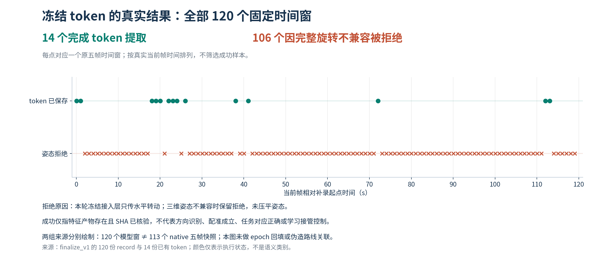

### 卡在哪里，证据是什么

1. **已修复的文件写出错误。** 录制、120 个窗口导出都完成后，ROS 连接头的 `callerid` 是字节串，直接写 JSON 失败。原 `capture_v1` 保留 `GATE_FAIL` 和截断摘要，不重录、不改输入；`finalize_v1` 仅显式 UTF-8 解码元数据，并执行原先未开始的冻结前向。原 160 份封存文件在前后逐 SHA 校验通过，后续 154 份证据也已核验。
2. **当前主要是三维姿态接线，不是“模型把106例识别错了”。** 106 条均为 `INCOMPATIBLE_FULL_ROTATION`。窗口跨度都是 0.8 秒，相对倾斜很小：各拒绝窗口最大去 yaw 旋转角的中位数约 0.019°、最大约 0.197°。本轮冻结接入层只传 yaw，严格检查因此拒绝了这些窗口。底层 [注册函数与编码器](../src/mtare_topo/representation/primitive_relation_model.py) 已有完整旋转参数，但 [公共适配层](../src/mtare_topo/integration/frozen_structural_tokens.py) 使用的公共编码路径没有透传它。没有压平姿态、扩大数值阈值或筛掉失败窗口。
3. **模型窗口与规划窗口尚未对齐。** 原生注册器会把 raw 时间戳改成里程计时间。消息头序列与源码支持进一步审计 `registered[j] ← raw[j+6]`，但这不是时间相等证明，更不是点云配准成功。即使按该来源映射，113 个原生五帧组与本轮冻结的 120 个每秒窗口，精确交集也是 0。不能把附近时刻的特征偷换成当前规划器输入。

### 已补的软件，以及还没有完成的真实接线

最小修订是**版本化透传已有完整相对旋转，并显式绑定原生快照的真实五帧来源**，不是增加网络、损失或训练轮数。

同一轮继续落实了两项软件：

- [完整 SE3 接入层](../src/mtare_topo/integration/frozen_structural_se3_v1.py)：17 个新合成测试通过。完整旋转同时进入点注册和编码器，原参数布局不变；真实网络架构的随机权重也验证了坐标一致和参数不更新。**还没有用这一新版重放120个真实窗口**，旧结果仍是14/106。
- [扫描来源与精确窗口校验](../src/mtare_topo/integration/native_scan_provenance.py)：12 个合成测试通过。区分原始时间、注册时间、消息接收时间；缓存绑定录制包/轨迹/输入SHA，拒绝跨包同时间戳、未来/重复帧或附近窗口替代。连续序列仍需外层认证完整共同录制边界，因此只返回条件性来源映射，明确禁止单靠它启用路线建议；不是已经完成真实来源证明或点云配准。

- 完整旋转必须同时进入点坐标注册和编码器 `_memory`，否则几何面片与特征会错位；保持原权重、原 yaw 位姿嵌入，不增加新参数。
- 先用合成数据验证 SE3 点变换、编码器/面片坐标一致、纯 yaw 兼容、非法旋转与未来帧拒绝。接入完整旋转会改变 XYZ 输入，必须登记新版预处理，不能声称和旧 yaw 输入逐元素相同。
- 原 120 窗整体重放和 native 精确对齐窗口导出是不同操作：前者不能偷偷换窗，后者须明确同 bag 的新导出清单。不重采集相同场景；不按成功分数选窗口。
- 本轮停在已冻结的处理结果，不启动三组 3600 秒比较、探索价值训练或多机器人。真实配准确认、方向任务绑定、学习改变建议及运动目标仍需完成，软件有接口不等于已经验证。

本次收尾处理总耗时 7.62 秒，模型处理段约 4.71 秒，GPU 峰保留约 258 MiB、主存峰约 1.87 GiB。耗时不是当前主要障碍，输入与原生决策的对应接线才是。结论为 `GATE_MIXED`：已得到真实部分特征输出，**尚不能认定合格迁移底座，更不能证明几何关系优势**。189项既有测试、17项SE3和12项来源测试合并复核，218项通过（2.27秒）；这些是软件证据，不是研究成绩。

证据：[补录原始运行](../results/gate6_single_robot/gate6_20260913_gse_native_structure_capture_v1_seed11/metrics/summary.json)、[同输入收尾结果](../results/gate6_single_robot/gate6_20260913_gse_native_structure_finalize_v1_seed11/metrics/summary.json)、[120窗口记录目录](../results/gate6_single_robot/gate6_20260913_gse_native_structure_finalize_v1_seed11/artifacts/frozen_tokens)、[图像来源与哈希](figures/gse_native_structure_capture_v1/sources_and_claims.json)。旧模型、原始 bag、失败运行和论文图片均保留，没有删除历史资产。

## 原网格版本已找回：不能用后改的采样器解释旧三角面

已找到0907 joint_partial_targets源码快照，文件SHA-256为`4d159a53fe9755d1319298f7b5c4a237f7836db3c67e2e0c6993ea350c85ec27`且与原seal条目一致。内部CSG网格和扫掠场文件分别匹配P1a导出的冻结源码哈希；原导出runner也仍精确匹配，确认轴向采样0.05m、周向64段。[精确绑定](../configs/v3/gate3/gse_original_surface_source_binding_v1.json)已保存。

AST对比发现网格类与拼接函数相同，但当前轴向采样函数增加了删除重复世界坐标采样点的逻辑。它可能改变环数量和面编号，不能悄悄使用当前采样器重解释旧扫描。后续必须隔离使用归档的原版本或明确证明等价，不能以新网格接近旧形状代替来源一致。

这是源码和全局导出合同元数据核查，没有读取受保护世界的场景/扫描，也没有重生成扫描或标签。版本定位已完成，不继续重复搜索；下一是固定16窗的原表面匹配规格与隔离执行。

## 找到可重建的几何索引，不冒称已有逐点弧长标签

代码核查：`PrimitiveRayHit`保留距离、XYZ、来源集合、是否唯一，传感器导出写range/valid/source code；通用返回三角面与弧长没有随帧保存。局部teacher中的部分triangle见证不能当所有返回点的完整索引。

原扫掠网格按轴向采样环和周向列确定顶点/面顺序。新`gse_surface_arc_index.py`从相同构造和显式采样参数重建每个三角面的轴向包络；使用前逐元素核对整个mesh的坐标、面索引和法向，不允许换采样参数或重排后沿用旧编号。端帽对应源轴端点，壁面对应相邻采样环区间。

3新合成测试及原4区间测试共7通过。索引只解释一个已知原表面三角面，不计算实际返回点匹配、不产生membership或点mask。当前导出入口可见.05m/64采样，但真实检查必须进一步绑定原run归档，不能仅拿当前代码当历史证据。下一只准备固定16窗的精确原表面匹配范围，无世界重渲染、标签导出或新训练。

## 局部区间接口：同一来源不能跨窗口断开处自动合并

新增`gse_local_axis_intervals.py`复用原ROI交点算法，保留参考轴线在10m域中的所有区间。单一生成基元也可能离开再进入窗口，不能按source ID合成一个局部实例；交点数值多义时保持未知。

4纯合成测试通过：直道、同source两个局部区间、缺失返回点弧长证据、边界/跨界范围。只有调用方已独立绑定实际返回点的弧长范围，数值接口才可报告唯一候选区间；即使唯一，membership仍None、point_mask_qualified仍false。它不是表面到轴向投影算法，也不是新teacher或可通行证明。

下一需确认原生成或表面记录能提供什么轴向证据，而不是反复训练。射线穿过10m截面的位置不能代替实际返回点弧长；最近GT中心也不能作为对应答案。本轮未读取真实扫描、导出标签或训练模型。

## 16窗监督映射已落成索引：结构证据存在，但不是点分组mask

固定16份已封存参考逐SHA核对后，24开口的生成来源、截面弧长、穿越射线和表面支持均有记录；22正归属、13负归属全部找到原独立证据条目，5未知原样保留。[完整映射](figures/gse_membership_fit_v1r1/reference_semantics.json)没有生成新标签或改变历史目标。

这里有一个不能跳过的语义边界：射线穿过某个截面只是路径证据，不能直接把射线最后返回的点标为该结构实例；表面生成来源也不等于局部通道或junction归属。旧程序本身将穿越与表面支持分开保存，并用额外结构见证形成membership，不能把字段名称当作可直接复制的分割mask。

下一缺口明确为实际观测返回点/面片到局部通道的对应和多义性处理。该桥梁只能来自原绑定来源/几何/局部可见证据，不能由模型分数或“最近真值中心”伪造。即使桥梁支持分组训练，也仍需原结构归属及最终图的独立验证，不把一个更容易的辅助任务冒充完成主目标。本次无扫描读取、teacher调用、训练或新模型。

## 后续接口评估：分组有文献依据，但不能偷换成结构建图成功

2026-09-11核对原论文及官方仓库后，保留一个候选接口，而不是启动另一批网络搜索：观测面片/基元的局部归属学习→局部结构组合→在线融合图。结构位置可以由支持它的几何估计，不再把独立中心检测当唯一入口。此项是待确认接口，不是已批准的新训练人口、已实现备用系统或新方法成功。

相关证据边界：

- [SPFN原论文](https://arxiv.org/abs/1811.08988)：预测点级属性与基元归属，再通过可微几何估计得到参数。可借鉴“先归属再估计”；其机械形状实验不证明地下通道建图能力。
- [Superpoint Graph原论文](https://arxiv.org/abs/1711.09869)：几何同质区域及其关系用于点云语义分割。可借鉴局部区域表示；相邻区域不等于可通行连接。
- [SuperCluster原论文](https://arxiv.org/abs/2401.06704)及[官方仓库](https://github.com/drprojects/superpoint_transformer)：以局部辅助学习支持图聚类，形成实例分割。它不是地下拓扑导航方法，采用聚类本身也不构成我们的创新。

| 层次 | 现有可复用证据 | 不能直接推出的结论 |
|---|---|---|
| 返回表面的生成来源 | reader验证多来源source_sets和回波code；未知/多归属必须保留 | 同来源就是同一局部结构，或不同来源必不连通 |
| 同一局部连续通道 | 已有连续分量与观测窗口证据，仍需逐项绑定 | 跨遮挡连接、跨窗口全局身份 |
| 开口属于局部交汇/终止结构 | 原部分reference及双侧/排除见证，可复用但不完整 | 将未知关系补为负例，或仅凭表面分组得到junction |
| 已穿越拓扑连接 | 已有真实轨迹和图接口 | 将预测邻接直接当成执行验证边 |

建议下一接口先写出这些层次之间的明确映射与拒绝条件：所有候选来自当前观测；来源身份只进入损失；普通分组和几何分组使用同一观测、同一归属目标；最终仍须评价局部结构/开口归属与同后端图。点/面片分组只能是中间检查，不得取代原目标。若来源到局部通道/结构的监督映射不能由现有证据支持，不启动分组训练来制造一个容易通过的替代结果。

本轮只核对论文和已有代码，没有新数据读取、标签、网络训练、依赖安装或上游代码复制。原中心/观测查询拟合失败结论保持，不以此评估重新开放同配置训练。

## 本配置结案图：改善开口没有转化为结构和关系收益

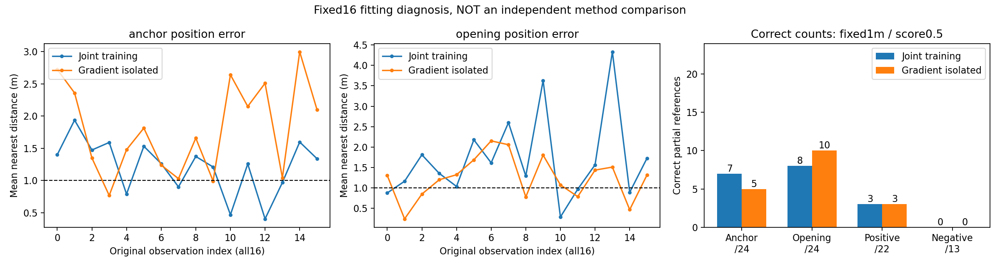

左图结构定位误差，中央开口定位误差；横轴保持全部16观察的原始顺序。两条线显示各观察全部参考的最近预测平均误差，虚线是原1m要求，但平均值低于虚线不表示该窗所有参考通过。右图才是原独立评价的正确数：7/8/3/0对5/10/3/0。蓝色原联合训练，橙色梯度隔离；不是独立开发集或几何方法对照。

两run的62封存条目核验通过，参考内容和500批输入顺序一致。逐例数值与图/源码哈希保存在[joint_vs_isolated.json](figures/gse_membership_fit_v1r1/joint_vs_isolated.json)。本次只生成展示证据，没有重新推理或训练。

现有`RegionQueryHead`仍需预测结构位置，`primitive_spatial_evidence`明确不输出归属。这两个模块都不是已经成立的备用检测方案。当前应停止同配置扩训；不能凭它们存在就宣称可以继续建图，也不能把换一套名字的中心检测当成新路线。完整目标尚未完成，下一必须明确后续结构接口及其合法监督，再决定新的实验范围。

## 一次梯度隔离修正没有解决拟合问题，本配置停止追加训练

缺失5窗梯度补充完成2.14秒，原1e-5数值检查均通过，检测/匹配结果不变；13seal核验，0优化更新。原失败run不改判。16窗逐窗结果中3窗总梯度反向定位，归属/定位梯度范数比中位数0.45、最大69.43，不是普遍统一根因；两个批次的Gram矩阵不能拼成全人口平均梯度。

据局部冲突证据执行且仅执行一次梯度隔离比较：同16窗、原初始115张量、原500批顺序、同loss/权重/阈值，仅让归属损失不再回传共享定位特征，原归属头继续训练。6软件测试通过，前向逐值相同、梯度隔离及头学习均验证。真实运行500更新、88.31秒，31seal、原初态和顺序核对通过。

| 固定最终评价 | 原联合训练 | 归属梯度隔离 |
|---|---:|---:|
| 结构定位正确 | 7/24 | 5/24 |
| 开口定位正确 | 8/24 | 10/24 |
| 定位后正归属正确 | 3/22 | 3/22 |
| 定位后负归属正确 | 0/13 | 0/13 |

开口有所改善、结构反而下降，关系正确数未增加，仍为GATE_FAIL。新结果31条已知关系未同时定位，另1条已定位关系判断不正确；全部额外输出继续保留，未确认507结构/1014开口不是自动FP。此结果不支持用梯度隔离作为成功修复。

到此停止继续调整这个配置，不追加轮数、种子、损失权重或评分校准，不扩大到建图。它证明当前共同检测接口尚未拟合成功，不能证明几何基元路线整体不可行，更不能声称已验证几何优势。后续必须明确方法接口选择，不继续把微小优化包装成进展。两次真实训练、梯度诊断、全部原始权重与论文可用证据保留。

## 梯度检查暂不能支持“任务冲突导致失败”的结论

固定最终检查点诊断实际完成11/16窗、0参数更新、3.31秒。前11窗中仅观察10出现共享总梯度与定位梯度相反；这个不完整结果不能推出全体失败由任务冲突造成，也不能作为重新调损失权重的充分依据。

第12窗开口坐标越过预先声明的1e-5数值重现检查，run保留GATE_FAIL，12seal核对。失败异常未保存具体越限量，这是诊断记录的不足。随后仅单独读取该窗并使用同最终权重检查，最大开口坐标差6.6757e-6m，查询来源索引完全相同，原1m/0.5评价的定位和关系结果未变化；这一次未稳定重现原越限，不能假装已完整解释数值差异或追改原运行。

完整平均梯度与最终模型不变性检查因提前退出未完成。本轮没有新权重，也没有重新训练。后续只收束缺失的数值执行证据，不调整研究验收阈值，不凭部分梯度认定根因或扩大训练。

## 失败已定位到位置精度，不是评分筛掉正确候选

复用初始/最终全部预测，重新核对31封存文件和原评价；不调用模型、不训练、不改变1m/0.5阈值。最终17个结构漏定位、16个开口漏定位全部是1m内没有任何预测；低分筛除和一对一竞争均为0。即使忽略分数看全部查询，正确上限也仍为7/24和8/24，因此校准分数或扩大去重无法解决本次定位缺失。

结构平均最近误差从8.109m降到1.259m，开口从5.186m降到1.921m，不能说模型完全没有学习。所有结构参考均在10m内，所有开口参考均在10m球面（最大数值偏差约1.07e-14m）；未发现输出域导致目标不可达。

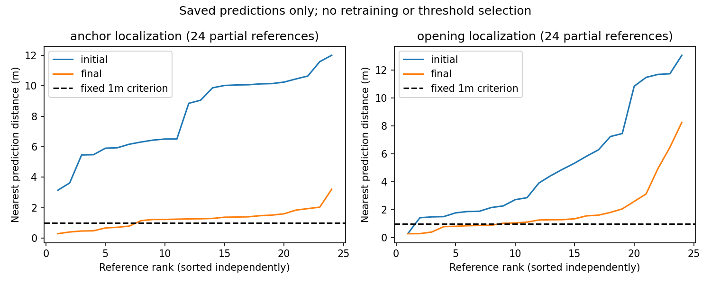

两条曲线分别排序，不是逐样本配对横轴。完整逐观察/参考证据见[定位分解](figures/gse_membership_fit_v1r1/localization_decomposition.json)。首末更新损失来自不同batch，仅用于日志记录，不能用它代替同人口评价。

这些结果不能单独证明损失权重、容量或训练预算是哪一个根因。下一只核实固定最终检查点的各项梯度量级/冲突，再决定是否有依据做一次有限修正；不自动加轮数、改阈值、换模型或进入建图。

## 真实训练已运行：500步完成，定位尚未拟合通过

运行`gate3_20260911_gse_membership_fit_v1r1_seed0`使用固定16窗/8父，冻结原编码器，训练观测查询结构—开口—归属适配器。500次更新、2000次曝光，耗时89.00秒，峰RSS约2.22GB。31个封存文件核验通过，初始/最终权重、全部预测、原始部分标签、源码及逐步日志均保存。未扩大数据、改标签或选择中间轮次。

| 同一1m、0.5评价 | 初始 | 最终 |
|---|---:|---:|
| 已知结构定位正确 | 0/24 | 7/24 |
| 已知窗口开口定位正确 | 1/24 | 8/24 |
| 定位后正归属正确 | 0/22 | 3/22 |
| 定位后负归属正确 | 0/13 | 0/13 |

最终35条已知关系中32条没有同时正确定位两个对象；仅3条满足定位条件，均为正例且判断正确。因此当前证据首先指出定位不足，不能仅从负归属0/13推出分类器不能识别负例。5条未知参考仍未知。最终512结构、1024开口全部过存在性阈值；未匹配505/1016项保留unconfirmed，部分标签下不伪称确定FP。这也显示正例-only存在性监督不提供完整检测保证。

结果保持GATE_FAIL，不登记为合格检测基线，不进行配对扩训或建图。下一复用保存预测检查全查询定位覆盖与筛选原因，不重跑这500步。旧v1在读取训练样本前因环境文件已存在而终止，0更新；修正版只改运行时环境文件名，旧9seal及源码归档保留，不将入口故障解释成模型失败。

## 有限拟合执行与独立评分代码已完成

执行核心把现有冻结编码器接到10m观测域与面片提取。固定16观察、500更新、有效batch4、seed0、AdamW学习率0.001/衰减0.0001；只存初始和最终评价，不择优轮数。独立评价重新执行1m几何匹配和0.5分数筛选，记录所有输出及未确认输出；未定位到两个对象的已知关系不能获正确分。未知不是背景，不能由该部分参考评价得出完整检测precision。

3项软件测试通过，包括轻量模拟模型完整500次更新/2000样本曝光、未知输出不删除、未定位负关系不冒充正确。这个500步是测试替身，不是真实地下数据模型的训练。当前下一步是正式runner、资源/环境/来源卡与预检，一次运行固定人口；无需继续加样本或重算teacher。

## 观测驱动的结构—开口—归属接口已实现，尚未训练

新适配器复用已有观测编码、面片关系层与解码器；移除自由位置查询，最多32个结构查询和64个开口查询来自真实观测坐标，不足不重复补点。结构位置是学习残差，窗口开口位置位于原10米窗口表面，两者分开输出；归属分支联合读取二者特征。真值位置、编号、候选数量不进入前向。空观测没有预测，不用面片替代缺失观测。

损失在前向之后根据几何距离作一对一匹配，不用分数选择负责查询。已知关系参与二元监督，未知不参与；全部参考超过实际查询容量就失败而不截断。当前部分标签不足以给所有未匹配输出背景监督，所以存在性只受匹配正例训练、尚未校准。必须单列额外未知输出，不能把本接口叫作完整合格检测器。

5项模型/损失测试通过，加上读取和选择共15项：位置及归属梯度、冻结特征无梯度、观测置换、真实输入依赖、空/重复观测、未知零梯度、评分不改变匹配；同权重和邻接下，B/C在零关系输入时完全一致，改变关系属性只影响C。它们只证明软件接线，不是训练增益或几何方法成功。下一完成固定16窗真实拟合的卡/规格/预算，不再搜索人口。

## 16窗已绑定真实文件，学生与教师读取分离

`gse_membership_fit_input_binding_v1.json`绑定32个实际存在的输入/目标路径与原归档SHA，并固定旧NPZ中的行号、五帧身份。新增读取器仅返回四个只读观测数组；来源编号检查后丢弃，教师原完整部分目标走另一函数，不能作为前向候选。5合成测试通过，包含额外教师字段拒绝、来源行错配、哈希漂移和未知保留。

目前只完成元数据绑定，没有执行真实载荷解码或训练。旧正例存储是任务级NPZ，因此16选中观察的一次读取实际解码105观察；额外行只作存储解码，不能参与训练、归一化或评价。该限制已写入绑定，后续数据卡必须声明，不能以80选中源帧冒充物理读取量。下一完成同范围数据卡/规格与结构归属接线，不新增人口或改教师。

## 最小拟合清单已固定：16窗、8父、80源帧

2026-09-11复用已有正例清单、V8负例manifest和839复核JSONL。选择程序按种子20260906的稳定哈希，从18个同变体正负均有证据的拟合父中固定8个；每父选择不同的原正/负窗口各1。没有读取扫描、生成新teacher或使用模型分数。清单及三个来源文件SHA见[固定清单](../configs/v3/gate3/gse_membership_fit_selection_v1.json)。

5项单元测试通过，覆盖输入顺序/分数独立、未知不升级、无跨变体代替、证据冲突失败、非拟合分区排除。该清单用于后续精确输入绑定，不是数据导出或训练批准文件；原完整部分目标需保留，不能只把被选中的关系送给模型作为候选。全部原标签及旧失败不变。

两个旧入口不能直接当成新任务：`ObservedAnchorDetectorV1`只有中心/分支方向输出；`SurfaceRelationModelV1`虽有开口—锚点membership，但使用旧自由查询。当前未启动二者训练，也未将旧中心评分器恢复为基线。下一需落实观测输入驱动、独立结构/开口及归属的统一前向与损失接线，复用已有组件，不再以模型分数找样本。

同父同变体并不消除正负情境差异。这16窗只验证可拟合接口；额外未知预测必须单列，不能报告成完整检测精度或几何组合优势。当前没有新增权重，图及仿真仍后置。

## 839个旧正例的精度差异已实际排除

`gse_saved_positive_origins_v1`完成：839个原正窗/210任务/70父/4195个唯一变体帧。只解码原sensor_xyz，共19042992字节，按任务构建原.025稀疏源场；不读取新射线、不再生成整套teacher。耗时21.665秒，峰RSS147918848B，全部原支持帧集合不变。

| 分区 | 复核正例 | 保留 | 保留父地图 |
|---|---:|---:|---:|
| 拟合 | 725 | 725 | 60 |
| 校准 | 57 | 57 | 5 |
| 开发 | 57 | 57 | 5 |

14个封存文件核验，源码快照随run保留，逐项结果在[origin_rechecks.jsonl](../results/gate3_semantics/gate3_20260910_gse_saved_positive_origins_v1_seed20260906/artifacts/origin_rechecks.jsonl)。未知/负例未改，未生成新权重。输出GATE_MIXED：认证该包含必要条件，不认证完整teacher或检测精度。

该差异已解决，不应再成为无限审计的理由。下一明确统一的“部分局部参考”训练任务，正例保留其原来源及本轮复核、负例保留完整V8来源；冻结最小拟合人口、teacher-free前向与固定预算。已知定位/关系拟合和额外未知预测分开报告，不把有限拟合当完整检测通过，也不恢复已结案中心评分头。几何组合独立贡献仍要靠后续同输入和独立人口比较。

## 共同精度复核已写成代码，不再只停在口头合同

`gse_terminal_continuation_contract.recheck_saved_positive_origin`只接受原正例的已封存目标及其原有双侧见证索引，核对record hash、terminal/opening同source、原对应身份、无原阻挡和窗口分量。给定显式.025的全源距离后，只保留原见证帧中唯一位于同source内部的帧；即使其他新帧变成可支持，也不能新添见证。输出的membership仍None、complete_reference_qualified仍false。

24相关软件测试通过：旧记录不改，unknown/negative不升级，源外/边界/外源重叠不保留，旧.01不可混入、原见证不能凭新场增加、漂移/原阻挡拒绝。没有重启旧评分器或生成真实标签。

下一只冻结839个原正窗（210任务/70父、4195唯一变体源帧）的原坐标、构造和目标路径。运行只需传感器坐标包含查询，不需读取/渲染整批新扫描或再求交。它解决新旧包含精度的一个具体差异，而不是将部分标签宣称为完整监督；共同资格与有限训练的后续范围必须据实际结果绑定。

## 共同监督前的情境检查：混杂风险不等于前向泄漏

针对已保存候选补查而非重跑teacher：839个原terminal正（725/57/57）均为参考集合仅1个anchor、无已标junction；323个跨片段未知（289/16/18，涉及45/4/4父）也都只有1个参考anchor。来源文件按前一元数据清单SHA核对。新V8负例则要求已支持junction参与排除，因此不能把这些记录直接当成同情境的关系因果对照。

严格限制这一结论：旧目标是部分参考，“没有标junction”不能推出真实输入中没有可辨识junction。检查现有`SurfaceRelationModelV1.forward`，输入是XYZ、冻结观测特征、有效掩码与可选面片；固定32+64查询，不读取教师类别或教师anchor数量。因此这些元数据相关性**不是前向GT泄漏证据，也不证明学生能靠计数猜中或必然无法训练**。该源代码检查不代表完整训练runner已获泄漏认证。

两道验收应分开：共同来源/精度/未知规则成立后，可以做有限软件可拟合诊断；但要证明几何关系独立贡献，仍需要同类、同情境对照和独立父人口。不能要求在训练前先证明模型优势，也不能拿小样本拟合越过后一关。原已结案中心评分实现不恢复。

当前下一步仍是冻结统一部分参考的资格规格：复用旧正例所用的terminal参考、首次窗口退出及双侧见证；显式核对.01与.025包含判断及参考竞争，不做整套射线重渲染。不直接合并旧正/新负文件成训练标签，也不因情境相关就再换第三个网络。所有模型拟合必须随后单独绑定teacher-free输入与固定预算。

## 完整旧数据有尽头正例：不应只围绕五例继续修补

新只读工具`inventory_continuation_opportunities.py`遍历原2676个已保存V6目标，校验目标hash/来源帧及原构造，未解引用原射线载荷，不调用teacher。共2888文件SHA核对。只统计原有参考和连续分量，不产生正负标签。

| 分区 | 旧观察/父地图 | 同连续通道候选对 | 其中原terminal正 | 正例父地图/独立尽头 | 跨片段未知 |
|---|---:|---:|---:|---:|---:|
| 拟合 | 2310/60 | 1014 | 725 | 60/242 | 289 |
| 校准 | 189/5 | 73 | 57 | 5/19 | 16 |
| 开发 | 177/5 | 75 | 57 | 5/19 | 18 |

**原库已有839条terminal正归属，覆盖70父。** 最近109窗全部“junction正/terminal负”与那批同域采样有关，不能推广成整库缺少尽头正例。新统计也不是旧标签自动合格：323个跨片段候选仍unknown，候选连续不等于同一窗口分量或已观测源内支持。详细来源与候选：[元数据清单](figures/gse_local_pair_support_pilot_v1/existing_continuation_opportunities.json)。

旧正和新封存负在同父的覆盖为18个拟合父、1个校准父、1个开发父。这里只是存在两类记录，不是公平训练人口，负例独立性仍有限。源码归档对照发现，terminal参考、窗口分量和双侧见证模块完全相同，但旧包含场默认.01米，新V8显式.025米；v5接口和距离场实现有差异。两份归档均按原seal核验。不能把跨版本标签直接合成“同一教师”训练结果。

下一优先建立现有正/负证据的共同来源资格检查与精确人口卡，检查包含精度和参考竞争差异。无需重生成整个teacher，也不应继续只为5项未知加修补。研究目标仍是同输入的观测/基元/关系学习对照，再进同后端图；当前仍零新增训练，旧部分标签不等于完整检测背景。

## 五个真实样本已验证：三项有必要证据，两项仍有几何歧义

`gse_terminal_continuation_probe_v1`完成一次冻结/预检/执行，5窗、2拟合父、25变体帧；耗时2.4438秒，峰RSS239456256B。仅复用原射线结果，计算原25个sensor位置的源内距离（原.025米离散精度），没有Open3D重新求交，没有改原标签。

| 来源 | 连续分量与原窗口开口 | 传感器源内证据 | 本轮结论 |
|---|---|---|---|
| S08_3d_loop_rich_C01，三变体 | 14片段构成同一已核对连续分量；首次退出弧长与原开口差0 | 5帧均仅在该通道edge0019内；双侧射线通过 | 必要条件支持，只有1独立父地图 |
| S07_flat_loop_rich_C03，混合截面 | 4片段连续；弧长差−3.55e−15米 | 全5帧同时在本通道edge0097和外来源edge0098内 | 仍未知 |
| S07_flat_loop_rich_C03，椭圆 | 同一连续分量；弧长差−1.78e−15米 | 前3帧仅在外来源edge0098，后2帧与本通道重叠 | 仍未知 |

没有为了让后两项通过而调容差或删掉外来源。前3项的`membership`仍为None：这是新连续通道合同下的必要证据，不是对原V8的静默重标，也尚非独立标注质量验证。所有5项原unknown保持。

结果文件：[逐项诊断](../results/gate3_semantics/gate3_20260910_gse_terminal_continuation_probe_v1_seed20260906/artifacts/diagnostics.json)。11个封存文件核验；2001个精确源码文件另存`docs/reproduction/gse_terminal_continuation_probe_v1/source_snapshot.zip`，SHA256=`30af62a69357bbeb5793041b4b2a37ac201e51edf0c1865633f691cec74cb2da`。

下一需要明确局部参考归属的资格边界，并从已有完整人口元数据查明独立的同类正反覆盖；不再重复五窗或159窗。当前没有新模型训练，3变体不能冒充3地图，修好监督表达也不是论文创新已经成立。

## 跨人工切分的必要证据接口：软件已验证，真实五项待检查

新增`gse_terminal_continuation_contract.py`，不修改或接入原V8。复用原精确端点连续分量，只有degree2且实际源端点完全重合才组装，真实junction为边界；不补连接线、不吸附上下层。源折线按terminal向外排序，保存各片段方向/弧长偏移，再复用原10米窗口首次退出检查；仅删精确共线的冗余点，以免直线人工切分恰在窗口边界改变结果。非共线歧义仍保持原unknown。

观测部分复用原双侧见证：同一连续通道内的多个operand距离取最小值，对非本通道源保持独立排除；不同帧的两侧观测不能拼成共同支持，现有中间节点射线仍否决。此接口只返回必要条件，membership永远None，既不提供完整标签也不证明物理可通行。

21相关测试通过，包含反向/顺序、3/10/15米直线切分、刚性轴置换与平移、真实junction不跨越、非重合层高、局部域再进入、外来源重叠、边界点、不同帧及未来射线拒绝。新增变换测试曾因测试夹具的np.float64违反旧ReferenceSource类型约定失败；仅修夹具类型，未放宽算法。

下一为原5项/2拟合父/25变体源帧单独冻结补充证据诊断，读取已经保存的输入与构造，不重复旧57,600射线求交，不直接改未知标签。须把实际来源组件、首退出位置与原通道位置、包含关系一起核对；软件通过不能替代真实证据、独立人口或模型成绩。

## 监督表达缺口已定位，不是再猜模型问题

只读核验原V8归档SHA及实际调用链：v1/v2仅增加junction正归属或退回未知，v5有terminal正归属逻辑，v7唯一写False的位置在terminal循环内，v8组合这些逻辑。**所以原V8不能产生junction负归属，但并非代码禁止所有terminal正归属。** 增加非incident路口样本而不补独立观测排除合同，也不会自动得到同类正反监督。

对已完成109窗，全部194个terminal—opening配对都因来源primitive_id不同，不进入v5的正例验证。进一步复用82份已导出构造（逐SHA核验），按已有degree-2连续通道规则区分：189个不同通道，5个属于同一连续通道。5项只来自两个拟合父地图，无校准/开发对应人口。逐项来源与数值见[只读表达检查](figures/gse_local_pair_support_pilot_v1/teacher_expressivity.json)。

这5项原始cap/opening射线均在全部5帧具有共同支持，原保存interface记录中，在first return之前、局部域内经过其他结构节点的阻挡射线为0。**这只是必要条件，不足以重标为正。** 尚未验证连续通道内传感器包含关系、跨人工分段的局部窗口连通分量，不能用构造同源直接冒充观测支持。原标签全部仍未知，原V8及109输出不修改，没有新教师调用。

建议下一步先定义“穿过degree-2人工切分仍是同一局部通道”的来源合同及纯合成测试，再决定是否为这5项冻结一个仅补必要证据的有界诊断。不得把原primitive_id过滤简单删除，也不得把189不同通道自动补负例。相比重跑50窗或扩大网络，这一检查直接针对现有教师表达与目标语义的差别；但即使通过，也不能用2个拟合父地图宣布独立验证或立即训练。

## 本批已结案：资源失败之外，监督任务仍有类别捷径

运行`gse_local_pair_support_pilot_v1`已exit1，保留GATE_FAIL。原159窗完成109，耗时1002.39秒；第110窗（fit的S09_flat_complex_C01__c1_mixed，原source147922，帧5988—5992）在原V8侧向表面证据的Open3D/Embree `list_intersections`发生内存分配错误。父/worker峰RSS约0.315/1.768GB，原地址空间硬限制1/3GiB；现有证据不能区分单次分配峰值和地址空间碎片，不冒充已查明物理内存耗尽。未重启、不加资源，余50窗没有目标，不纳入统计。

| 已完成部分 | 窗口/父地图 | 正归属 | 负归属 | 未知 |
|---|---:|---:|---:|---:|
| 拟合 | 97/25 | 109 | 95 | 104 |
| 校准 | 6/2 | 12 | 5 | 4 |
| 开发 | 6/1 | 1 | 1 | 12 |

**122条正归属全部属于junction，101条负归属全部属于terminal。** 使用教师结构类型的固定规则“路口=yes、尽头=no”，在这223条已知关系上可得223/223；这是标签混杂诊断，不是模型成绩，更不能将真实类型提供给网络。拟合正/负关系去重为49/41个父—结构—来源通道组合，但这种数量增多并没有消除类别捷径。未知120仍是未知。当前数据无法独立检验模型是否真的使用了通道相对位置与组合。

123封存文件SHA全部核对；109目标hash/源帧/部分区域，122正归属来源、101负归属观测排除来源均检查通过。这只能验证记录及来源存在，不等于人工标签质量或完整背景合格。完整输出：[监督人口统计](figures/gse_local_pair_support_pilot_v1/support_population.json)。原始证据与错误日志在结果目录保存。

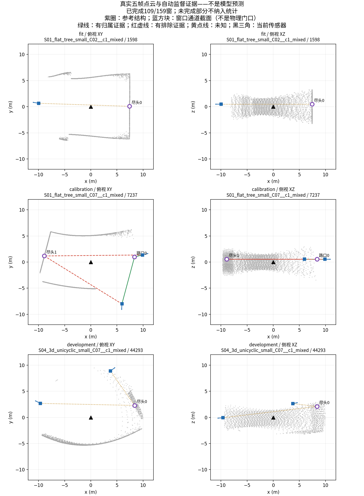

上图固定取各分区原顺序第一窗，不按好坏挑选；显示抽稀仅用于绘图。蓝色通道是10米窗口截面，不是物理门口；紫圈来自有观测支持的构造参考，不是神经网络识别。黄线保留未知。图与来源SHA已保存并查看。

结论：不重试这159窗，不在这个有捷径的人口上训练。下一先针对已记录的非incident机会，核实同类结构正反关系是否存在独立观测证据，并明确现有教师能否表达它；这一步不静默改标签、不新增网络，不把未完成计算补齐当作研究问题已解决。位置拟合、旧模型、几何接口及实际仿真底座继续保留，几何主线尚未得到有效支持或反证。

## 159窗支持试验已运行：须排除类别替代关系的捷径

`gse_local_pair_support_pilot_v1`已完成17项传输/人口测试与零错警告预检，一次创建并实际运行。固定fit/cal/dev144/9/6，复用原V8源码归档、.05/64/.025几何参数及请求生命周期实现。父/子地址空间1/3GiB、总3小时与30GiB上限；不重算旧141，不改教师，不调用模型。输出在同名Gate3结果目录。

运行中的前20窗已有正19、负17、未知21个关系，但出现明确混杂风险：19正例都属于junction，17负例都属于terminal；未知分别junction3、terminal18。这不是最终全人口成绩。仅用教师事件类型“路口=yes、尽头=no”即可答对这批全部已知关系，因此正负数量本身不能证明任务迫使模型学习空间组合，更不能直接批准训练。固定试验继续完成以报告完整分布；受影响的训练不启动。

新增只读汇总入口`tools/v3/summarize_local_pair_support.py`，只接受完成且封存的运行，检查目标hash/原帧/正负来源以及部分区域状态，汇总父地图和父—结构—来源通道独立关系，并显式计算上述类别捷径的诊断比例。它不是新模型、不产生训练分数，不把教师类型送入前向。最终人口、关系质量与开发独立性仍须据实判断。

## 代表窗口真实输入已导出，不再停留在坐标清单

`gse_local_pair_pilot_inputs_v1`一次预检零错警告并执行完成，3.65秒。按已宣布的稳定SHA规则，在每个参考对/变体中取一原窗口，159个名额得到159个不同窗口：fit144（32父/96任务/716去重帧）、calibration9（3父/9任务/45帧）、development6（1父/3任务/30帧），合计791去重变体帧。没有按模型或标签结果择样。

已实际读取归档LiDAR及相对运动，不重渲染、不调用模型；另外独立保存teacher-only绝对位姿、原回波多来源码和对应构造/码表。复用原`verify_alignment`，159项逐一检查float32相对运动与原float64位姿一致、码表身份/顺序及码0与无效回波一致。学生NPZ只含ranges_m、valid_mask、relative_translation_current_sensor_m、relative_yaw_current_sensor_deg，不含绝对位置、构造ID或候选真值。159份字段白名单和546封存文件SHA再次核验，结果共152562880字节。反转输入清单、加入无关分数不改变选择；提名与导出来源一致，共3项选择检查通过。

结果目录：`results/gate3_semantics/gate3_20260910_gse_local_pair_pilot_inputs_v1_seed20260906`。完整来源manifest及分开的student/source_evidence目录可直接供后续固定人口观测证据计算。GATE_MIXED只认证导出和对应，不认证归属标签或模型。当前新标签与训练仍为0，开发只有一个父地图；三种变体不增加独立性。

下一复用既有观测证据/来源几何算法对这159项做一次有界支持试验，先锁定历史算法与参数、未知规则和资源规格。不得因构造参考被用于采样就把它送入学生前向，也不能把所有符合10米范围的参考自动标成可见。先确认正反关系和未知数量，再确定实际拟合/配对训练资格；不重启旧中心评分头。

## 完整原始序列覆盖已恢复：校准有窗口，开发独立性仍不足

实际完成`gse_full_local_pair_coverage_v1`：独立卡/规格预检零错警告，一次不可覆盖执行，0.68秒完成。读取同44父地图132任务的坐标及归档序列索引，424272原帧、313296五帧序列，解码预算27723648字节。每个窗口使用原frame_row/source_global_sequence_index；逐一验证五帧在同一traversal且local_frame_index连续，未自行拼接窗口。没有读取range/valid、几何监督载荷或模型。

| 分区 | 原帧 | 全部归档序列 | 两参考中心同处10m球的序列 | 覆盖参考对／父地图 |
|---|---:|---:|---:|---:|
| 拟合 | 362574 | 267918 | 1566 | 48／32 |
| 校准 | 36036 | 26892 | 51 | 3／3 |
| 开发 | 25662 | 18486 | 150 | 2／1 |

完整结果在`results/gate3_semantics/gate3_20260910_gse_full_local_pair_coverage_v1_seed20260906`：保留所有77参考对（包括未覆盖）、1767覆盖窗口的精确来源、环境、原始日志、seal。结果GATE_MIXED表示坐标范围验证完成，未认证可见性、负归属或训练资格。

原稀疏抽样的校准0并不代表源数据没有窗口，现已以完整索引证实。开发只有一个父地图的问题仍在，不能用150个高度相关窗口包装泛化证据。下一按固定稳定哈希、每个参考对/几何变体取一个原窗口，形成小型观察支持试验的精确数据卡；同一窗口重复命中参考对时去重，全部未覆盖和未知保留。样本选择不使用模型分数或教师判断，参考ID不进学生前向。标签试验未通过前不训练；即使小拟合通过，也不能用本人口宣布独立泛化或直接扩大仿真。

## 77对参考与已有窗口绑定完成：旧抽样的校准覆盖为零

`gse_local_pair_window_coverage_v1`已预检零错误/警告并实际执行一次。此次当前阶段明确从旧仿真Gate6切回用户新目标的结构学习Gate3；不修改旧仿真结果。精确44父地图、132变体任务、1743个原五帧窗口，坐标解码预算13578912字节；只读取原构造和sensor_xyz_m，不读LiDAR/模型。附带解码坐标不作为新样本。

| 分区 | 原五帧窗口 | 两参考中心同处原10米球的窗口 | 覆盖参考对 | 覆盖父地图 |
|---|---:|---:|---:|---:|
| 拟合 | 1482 | 63 | 14 | 13 |
| 校准 | 138 | 0 | 0 | 0 |
| 开发 | 123 | 3 | 1 | 1 |

实际0.61秒、无运行错误，GATE_MIXED仅表示有界坐标核查完成。来源清单、逐窗口距离和全部77对（含未覆盖）在`results/gate3_semantics/gate3_20260910_gse_local_pair_window_coverage_v1_seed20260906`。坐标共域是必要条件，不是射线可见性或合法正负归属；没有生成标签或训练。

当前明确缺口是**旧抽样窗口**不能支持此配对校准，不等于完整原始扫描没有合适位置。下一单独冻结同父范围的原始坐标、局部帧号和穿越连续性索引读取；仅在同一穿越内形成已有的连续五帧，不能拼接穿越或用附带行偷偷扩样。不放大10米、不根据模型或教师成绩挑窗口。该范围核实之后才讨论实际观测支持与训练人口，原校准零覆盖事实保留。

## 找到可继续核查的局部结构人口：77对交汇—尽头

实际运行`inventory_local_structure_opportunities.py`，只读同一旧范围每父地图一个固定构造，共70文件，逐一核对旧SHA；没有读扫描、改教师或训练。完整来源及逐父地图结构清单保存于`figures/gse_graph/local_structure_opportunities_20260910.json`。

| 分区 | 父地图总数 | 20米内交汇—尽头对 | 涉及父地图 | 近交汇非incident构造段数／父地图 |
|---|---:|---:|---:|---:|
| fit | 60 | 68 | 37 | 137／27 |
| calibration | 5 | 5 | 4 | 9／2 |
| development | 5 | 4 | 3 | 4／1 |

非incident统计先沿degree2节点合并同一连续臂，不按tunnel ID合并，也不把degree2切分当作陌生通道；距离计算为有限存储折线到交汇中心，非无限直线。3项简单检查验证度2连续性、遇下一交汇停止以及有限范围/高差距离。以上是构造段计数，非独立负例数。未检查局部表面和遮挡，不能给出可观察性、通行性或模型精度。

下一固定以**全部77对交汇—尽头**作为观察覆盖核查的参考人口（44父地图，三种几何实现仍同父分区），不按模型表现或教师输出筛选。首先从已有扫描来源清单绑定实际可用五帧窗口、去重帧数与坐标字段读取范围，再执行有界覆盖检查。参考ID只进采样索引/教师与评分，不能作为学生候选或输入。若看不清，继续未知；没有配齐正反关系时不训练。其他非incident机会保留清单，但不在同一步自动扩大教师导出。无需据上一轮双交汇缺失就认定必须生成新地图。

## 当前训练人口核查：原地图不覆盖“双路口同窗”假设

2026-09-10新只读核查，仅使用`gse_supplement_joint_v3`原范围的210份构造JSON，逐一核对原file_sha256，并确认同父地图三种变体的base_construction完全一致。60拟合、5校准、5开发父地图分别有414、35、32个degree≥3交汇节点；三个分区相距≤20米的交汇节点对均为0。源文件哈希映射摘要SHA为`2f855ce8c17aa10662c3600c7951dda1aa9749c05dc7c4c715520f09ce7c651b`。没有读取扫描、生成标签或调用模型。

20米来自已有10米局部球的直径，仅用于判断两个参考中心是否可能同时进入一个局部球，不是新增分类阈值。这个结果说明原人口不能检验“一个10米窗口内区分两个真实交汇中心”；不说明没有交汇+尽头、平行/分层通道或局部开口关系，也不说明窗口边界开口可当物理中心。

已有2676部分目标的零负归属问题、十例纠错范围和141补充的资格不足，复用原报告结论，不重新审计或改写标签。不能仅凭full_training_gate_eligible=false推断所有局部任务都不可训练，但也不能把只含正归属的BCE拟合当成有效判别。

据此暂停“双路口同窗”的原数据训练准备。下一针对仍在目标内的交汇/尽头与非incident局部通道核对人口；如果现有地图也缺少相应可观察正反证据，需要单独冻结补充场景规则与分区，而不是继续重算原教师或降低未知门槛。数据范围变化必须显式登记。当前目标仍active，未启动新训练；不是方法NO-GO。

## 缺失接口的第一步：保留空间证据，不伪造归属答案

新增`semantics/primitive_spatial_evidence.py`，输入同一机器人坐标系下的有限三控制点轴线、观测候选位置与单位方向，输出每个候选对每条有限线段的最近点、偏移向量、距离、三维无向夹角、是否落到有限段端部，以及逐基元中心的相对位移。保留所有对应，不选一个最近基元冒充真实身份，不把裁剪端点当开口，不生成连接或校准概率。

这是结构学习所需的**证据接口**，不是已经训练好的归属模型，也尚未替换实时控制。旧`LocalStructureObservationV2`可继续作为未来输出合同；旧端点关系权重和直线交汇规则不被自动恢复为可信教师。

11个新增合成检查与4个旧方向约束检查，共15项通过：平行错位、上下层同方向、有限段不能外推、只反射模型位置、整体刚体变换、基元置换、轴线反序、重复轴线、单基元高差改变、空输入及非法/退化几何。例：候选(2,0,0)对应同方向轴线时距离可分别为0、3、4米；原方向筛选均无法区别。合成参考由构造坐标直接给定，未读取任何真实世界或生成训练标签。它仅证明新接口保留了这些信息，不证明网络已经会利用它们。

下一判定链必须分开：①当前扫描有无可观察通道证据；②候选与哪些局部几何相容；③哪些通道共同构成局部结构；④跨帧是否为同一结构。第②步的距离不能自动成为第③/④步真值。实际开发参考须独立于模型和RangeExit候选规则，只在有观测支持的区域评分；现有293帧无独立结构标签，不能直接报告检测F1。保持当前工程闭环不变，不新增阈值、不启动旧头训练。

## 用户要求直接验证：当前接法只证实方向筛选，未实现空间组合判断

实际执行`gse_geometry_mechanism_intervention_v1`：预检零错误、零警告，新建一次不可覆盖运行，2.24秒完成；没有训练、模型调用、新仿真或真值生成。复用原`constrained_execution_v1`的293扫描、289个五帧观察，所有原始候选决策逐项重现。对照仅改已保存且通过原筛选的几何，扫描、位姿、15度方向条件及图后端不变。

| 固定干预 | 接受候选总数 | 相对原输出发生变化的观察 |
|---|---:|---:|
| 原模型几何 | 503／527 | — |
| 几何关于机器人位置反射，扫描不变 | 503／527 | 0／289 |
| 几何在机器人坐标系绕Z旋转90度，扫描不变 | 52／527 | 289／289 |

反射改变了1057条保留几何记录，但全部可执行候选、地点历史以及去除未执行原始轴线诊断字段后的图完全相同。方向旋转为阳性对照，说明代码不是完全忽略模型。全部289条`structures`为空。这里使用的是原v13跟踪策略，三组均未形成supported地点；不能与后来v14成功闭环的地点数量拼成性能比较。

**解释：当前执行消费者采用`abs(segment_direction · observed_direction)`作为筛选，没有消费线段位置或基元之间的空间归属。** 本次反射实验与源码共同支持这一接口结论。它不证明编码器没有学到几何，也不证明几何基元路线不可行；它证明现有工程成功不足以支持“基元空间组合决定结构图”的主张。反射仅是消费端干预，不是新模型，不是公允训练消融，也不提供检测精确率／召回率。

完整记录：[运行摘要](../results/gate6_single_robot/gate6_20260910_gse_geometry_mechanism_intervention_v1_seed11/metrics/summary.json)、同目录三组graph/place历史及逐观察比较。下一不继续训练旧评分器，也不改角度硬凑增益；应明确局部基元空间关系到可观察通道归属的接口与独立参考，再做同输入比较。原工程闭环保留为底座，不登记为几何组合优势。

## 三方向拒绝已定位；尚不能用它判定结构准确率

只读复用`constrained_execution_v1`的全部30个三方向观察，90个候选，原30次决策（包括当前射线来源）全部精确重现。读取的bag、trace、30份模型输出逐一核对原seal；没有新推理、训练、阈值改变或新标签。66个方向被接受；24个拒绝中，15个在全部32个原始预测槽位中均没有15度内线段，9个虽有方向符合的原始线段，但相关槽位全部未过原0.5存在性阈值。不是裁剪统一导致，也不能由此直接认定24个真实分支漏检。

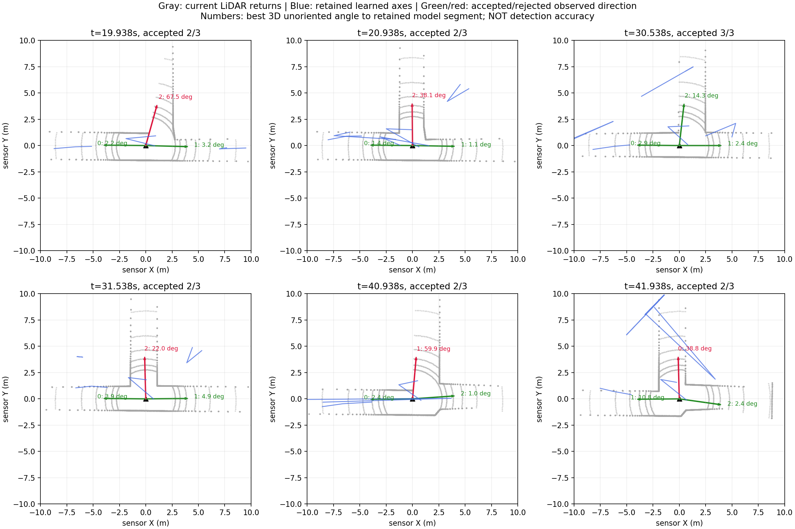

灰点是对应当前扫描的真实返回，蓝线是五帧模型输出经既定筛选后的轴线，绿箭头是接受方向，红箭头是拒绝方向；数字为与保留线段的最小三维无向夹角。展示固定顺序0/5/10/15/20/25共六窗，不按结果择优。全部90项及来源在同目录`direction_diagnostic.json`。图已检查；3项独立角度计算检查通过。方向接近并不证明线段位于同一通道，更不证明可通行，当前约束只检查方向，没有完整结构归属验证。

当前证据边界：一个仿真支路循环已完成；局部模型方向支持不稳定；几何组织的结构识别优势仍未验证。下一研究判断必须使用独立于候选生成规则的可观察结构参考，以相同扫描、位姿、图后端比较观测方法、非学习几何及学习几何；无参考的现有轨迹只能做决策和稳定性诊断，不能给检测F1。此处不自动启动训练、阈值扫描或新的评价人口。

## 最新：一个实际支路循环已跑通

问题不只是模型漏检：原地点跟踪遇到不足三方向就清空active，约49—51米范围的五次完整观测被拆成1/2/2次。现在显式保留唯一匹配的部分观测身份，但不计支持；仍需三次完整三方向证据，4米地点范围、2米目标对应、15度方向条件不变，离开范围或对应不唯一不得延续。旧策略默认不变，新运行单独冻结。

新`gse_learned_constrained_memory_v1`真实运行60秒：294扫描、290模型观测、76.46米、17目标到达。地点1在31.812/32.612/33.012秒取得三次完整支持；37.212秒开始沿记录图返回，46.612秒返回观测地点，47.812秒重新确认方向并提出支路任务，51.212秒实际到达。随后开始第二次返回，预算结束时尚未完成。因此这证明一个开发支路循环已贯通，**不代表全地图探索结束、可靠语义图恢复或论文优势**。

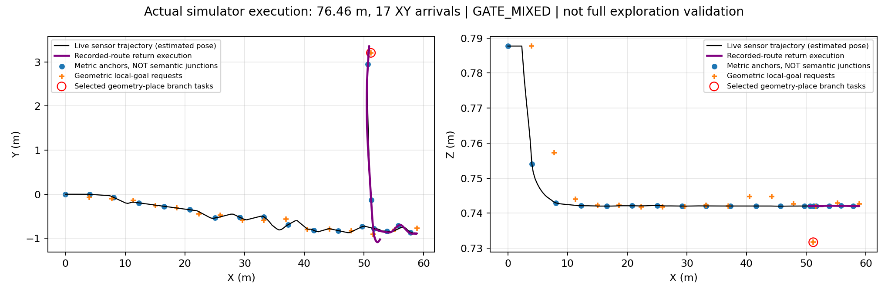

黑线为实际运动、紫线为记录路径返回、红圈为被执行的支路任务。不是GT路口检测图。33相关软件测试通过；315封存文件SHA核验，290模型输出与当前五帧来源逐项对应，每个图决策候选均含独立观测射线和模型支持段。730源码已冻结归档；状态GATE_MIXED，不改写旧FAIL。前后路线不同，不把行程差直接当性能提升。

清理记录：用户要求去掉无用体积后，仅删除两个此前自动生成、未执行实验的临时复现副本：`/tmp/gse-common-domain-restore-20260910-v1`（379665084字节）与`/tmp/gse-learned-pair-restore-20260910-v1`（1389743233字节）。删除前lsof未发现打开文件；完整源码/输入/补充文件SHA与清单一致、无未知文件或符号链接、原输入和源归档SHA复核通过。保留本仓库所有原始run、模型、论文图片、日志、指标和归档；副本可用原恢复工具重新生成。预计释放1769408317字节（约1.65GiB），不宣称已清理整个项目历史资产。

## 已批准分工调整后的实时结果

用户确认大方向并要求继续后，新增明确混合接口：当前扫描扇区提供候选坐标，冻结模型局部段方向必须在原15度内支持候选；原4米行进距离不变。模型三个控制点不被重排或拉直，不再按折返顺序解释为必须走过的路线。目标来源明确标为观测，模型支持槽位及段分别记录。原始轴线、未执行轴线提议和被拒候选仍保留；无模型支持不兜底。首版是水平行进约束，不宣称学习三维开口或真值路口检测。

25项相关测试通过；改变合成模型方向会改变有效目标，移除模型支持则无任务，证明代码依赖，不证明实景收益。一次`gse_learned_constrained_execution_v1`实际运行60秒：293扫描、289模型观察、72.93米、20目标到达，但支路到达和返回确认均0，保留GATE_FAIL。

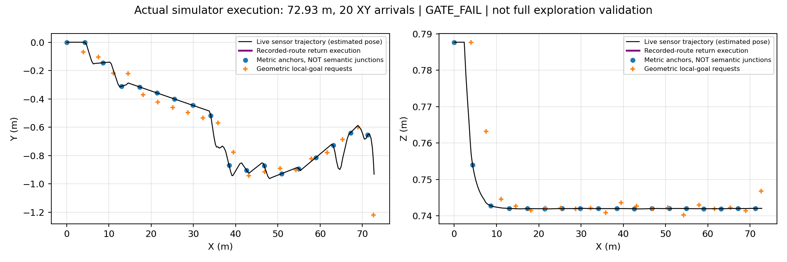

逐环节定位：30窗扫描有三个候选方向，24窗模型只支持两个，6窗支持三个；四个候选地点分别只有1/1/2/2次支持，未达到原3次要求。当前`GeometryBranchPlaces`在少于三个方向时清空active，间歇缺失可能切断同一地点证据，需要针对保存记录检查，不能直接降低支持门槛。暂无证据可把新增行程归为学习优势，两次实际轨迹不同，不是公平性能对照。下一不重训，只处理这一地点证据链。

## 用户要求后的实际学习闭环：已运行，返回确认未通过

交付核验：v1r2的315个封存文件SHA全部一致；294条扫描记录，290个模型结果的时间、五帧来源、原始输出文件名与实时决策逐项相同。这里验证的是调用和日志对应，不等于所有消息均被ROS消费者收到。只读bag核对得到289条`/way_point`，相对290条发布调用唯一缺少59.337秒的`HOLD_NO_UNVISITED_GEOMETRY_TARGET`，无额外未知目标消息。记录结束阶段这条保持消息未落bag，未据此补写历史或宣称全部消息已接收。返回确认失败结论不变。

补齐一处独立软件门禁：学习路径原普通行进fallback未统一检查当前支持；现在进入地点、普通行进和返回的候选都须`current_direction_supported is True`，False/未知不下发，原图/原始预测仍完整保留。21项执行/返回测试通过。此修复尚未新仿真，不声称解决折返模型。旧v1r2源码729项已按原SHA恢复归档，归档SHA为`db9b162aa78c5a350f9aa8d5facf51db21836ffb99f2f37e301014e2673a1469`，旧运行不变。

需要明确的下一步分工：

- 推荐：冻结学习几何继续参与，但用于约束、关联和选择当前观测支持的行进任务。目标坐标的观测来源与学习贡献分开记录；不能声称位置全部由模型检测得到。成本是执行接口及新有界运行，不需要新网络训练。
- 另一条：维持直接预测轴线作任务源，重新建立有效轴线监督并训练。需要新的训练合同及独立验证，不能保证解决，且超出当前冻结模型目标。

两者不是可互换的实现细节。当前运行合同要求方法变更明确决定，因此不在旧名字下悄悄换成混合方法，不继续无意义重跑。完整成功尚未达到，目标保持未完成。

进一步定点核查（不重新推理）：失败任务对应原始模型slot23的三点轴线发生179.990692度折返，两段12.591231米与12.873579米，首尾仅0.282355米。这一折返在原始模型输出中已经存在，并非10米裁剪制造。三控制点由模型三个独立注意力读出得到，前向没有强制简单、非折返中心线约束；后端却把它作为有序通道折线使用。原提议沿折线累计4米，起点到目标的直线位移仅约0.401米。这里不能把“轴线行程4米”当成4米稳定前进，目标也不是物理开口。

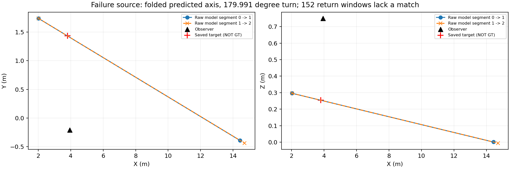

完整152个返回窗口的所有候选距离、角度、当前支持及原始来源见[定点诊断](figures/gse_learned_geometry_execution_v1r2/return_geometry_diagnostic.json)。没有挑选失败窗口、没有修改原预测或返回阈值。

这表明需要处理的是**预测几何的可执行解释合同**，不能只归咎于位置抖动或返回匹配实现。将三个点重排序、把折返线改直、用非学习坐标替换目标都属于方法改变，不是已证实的软件bug；本次没有这样做，也没有仅为过关删除坏预测。可选路线是重新定义学习几何如何约束观测支持的行进任务，或者重新训练直接可执行轴线；前者无需新训练且复用底座，后者需要新监督/训练验证。任何调整都必须明确标记，原FAIL仍保留。当前先停止同配置盲目闭环重跑，目标未标完成。

用户明确指出离线回放不是完整交付后，实时ROS节点已接冻结模型，不再调用非学习拟合器产生目标。五帧扫描由本机Unix socket送入原Torch环境，模型三维轴线经原10米域、当前方向支持、地点/目标图、局部规划器执行；原始模型输出逐帧保存。此时的结构是多方向观测地点，不是已验证学习路口语义。

1. `gse_learned_geometry_execution_v1`：预热错误，全空合成帧违反编码器有效回波合同；未启动仿真。只修预热，不改模型。
2. `gse_learned_geometry_execution_v1r1`：实际20.88米、2目标到达、1支路任务、1返回地点。推理锁阻塞位姿回调，触发0.1秒时效检查。只读bag确认末尾扫描均有同时间戳位姿；改为独立位姿锁，不放宽阈值。
3. `gse_learned_geometry_execution_v1r2`：完整60秒预算，294扫描、290模型观察，21.23米、2目标到达、1支路到达、1地点返回；零前端异常、最大已用过去位姿年龄0秒。返回方向确认0，因此保留GATE_FAIL，不宣布完整探索通过。

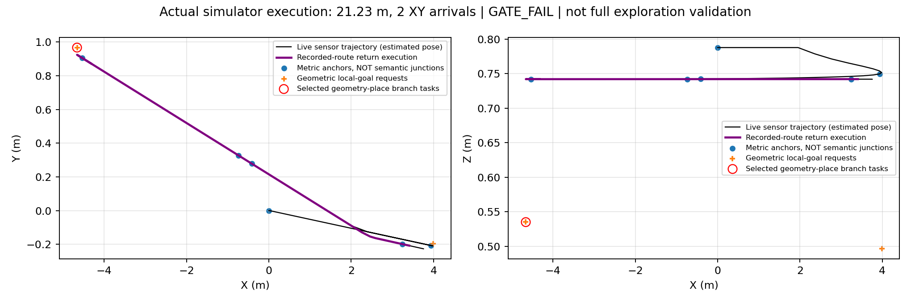

灰黑轨迹是实际仿真运动，紫色为沿记录路线返回，红圈是被选中的几何任务，不是地面真值路口。目标点由冻结模型轴线生成，未用非学习目标兜底。

剩余问题已定位到返回几何对应：原观测4.737秒与返回19.937秒的传感器yaw都为0，不支持“看反方向”解释。返回后152窗均为0个满足原2米/15度约束的候选，并非多个重复候选导致歧义。19.937秒方向符合的最近目标相距3.975米，稳定后约3.207米；位置较近的另一目标方向反了约173.65度。当前方向有传感支持，但模型生成的目标位置与原记录不一致。没有放宽匹配或去重半径；等待30秒后任务保留为未解决，后46窗没有未访问目标而保持。

**持续目标仍active。** 端到端实时调用、运动和失败反馈已经真实发生，但完整任务成功尚未实现。下一只定位模型轴线→持久目标的稳定性接口，区分预测几何变化与任务定义问题，不重训旧评分器、不修改历史FAIL、不用非学习结果冒充学习。若需要改变方法而非软件修复，必须明确记录新的主张与边界，不能静默替换。

## 最新交付：共同空间域回放已完成

本阶段的“冻结学习前端接入与受控诊断”完成，论文方法优势仍未证明。新回放 `gate6_20260910_gse_common_geometry_domain_v1_seed0` 实际运行44.64秒，状态GATE_MIXED；原运行不改。相同1条开发轨迹、294源帧、290个五帧观察；零新模型调用、零训练、零控制。两组全部轴线裁入当前传感器10米球域，域外部分不参与本次后端；断开的两段不补连接，裁剪端点不是开口。

| 同域后端结果 | 学习几何 | 非学习几何 |
|---|---:|---:|
| 进入后端的局部轴线片段 | 1280 | 420 |
| 几何行进建议 | 2181 | 570 |
| 其中当前方向有观测支持 | 1030 | 531 |
| 多方向观测地点 | 15 | 3 |
| 记录位姿形成的里程节点／边 | 17／16 | 17／16 |

学习的1280片段来自1276条相交轴线，其中4条在球内分为不相连的两片；210条完全域外被明确记录。非学习原422条记录中2条没有轴线，不作为有效几何。全部来源保留：模型槽位仍是预测来源，不冒充射线；非学习来源直接恢复原逐射线记录，不重新拟合。

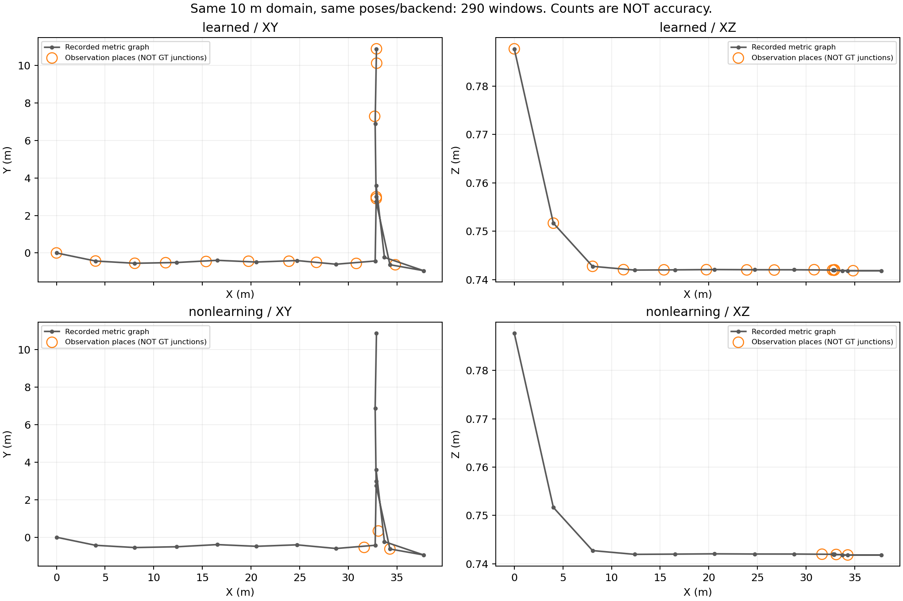

灰线是共同记录位姿构成的图，橙圈是多方向观测地点，**不是已确认真实路口**。学习组沿路线产生更多地点；没有结构真值，不能判定其中每个圈是误检，也不能把更多圈说成更完整。两组17／16相同是共享位姿后端的结果，不是学习贡献。新表是裁剪后重新运行后端的结果，不能与下文旧的“只筛选域内目标”表混为同一次实验。

6项裁剪与曲线距离测试通过，290行记录完整，15个封存文件SHA逐一验证。新图已实际查看；源归档723文件及4个输入已独立恢复并通过预检（不声称重复执行）。现有证据支持“模型几何能够驱动同一个目标／图接口”，不支持“比非学习方法更准确或更适合探索”。保持不扩大此配置训练、不替换已运行底座的判断；并不判整个几何学习路线不可行。后续若要作论文优劣判断，需要独立结构参考，而不是继续调本路线参数凑数量优势。

新回放复现入口（新目录、相同Python依赖；不需要Docker或GPU）：

```sh
python3 tools/v3/prepare_learned_pair_reproduction.py --common-domain --destination /tmp/gse-common-domain-new
cd /tmp/gse-common-domain-new
python3 tools/v3/create_run.py --spec configs/v3/gate6/gse_common_geometry_domain_v1.json
PYTHONPATH=src OPENBLAS_NUM_THREADS=1 OMP_NUM_THREADS=1 /home/zeng-workstation/.local/share/mtare_topo_comm/envs/phase3_torch290_cu129_zarr2187_v1/bin/python tools/v3/replay_common_geometry_domain.py --execute
```

## 交付核验与仍缺少的对照

原运行19个封存文件SHA全部通过；13类原始输出均290窗且有限；两组各290条决策、17节点16记录边。XY/XZ均已实际查看。723个冻结源码及4个输入已恢复到独立目录并核对哈希、通过预检，未重复模型推理。

复现命令（目的目录必须不存在，需同机指定Python环境及本地冻结Docker镜像）：

```sh
python3 tools/v3/prepare_learned_pair_reproduction.py --destination /tmp/gse-learned-pair-new
cd /tmp/gse-learned-pair-new
python3 tools/v3/create_run.py --spec configs/v3/gate6/gse_learned_geometry_pair_v1.json
python3 tools/v3/run_learned_geometry_pair.py --execute
```

恢复工具复制输入而非建立可修改历史输入的硬链接；镜像和Python环境不是归档的一部分。实际原推理已执行，隔离版本本轮只验证到预检，不声称已第二次完整重现数值。

历史核验时的缺口是原图回放作用域不同。现已由顶部的新共同域回放补齐；原图和旧统计不改。关于“建图是否改善”的结论仍是未验证，因为没有独立结构真值，不能用17/16图数量代替。

## 当前实验判断：接线成立，暂不扩大训练或替换底座

冻结模型在同一连续开发记录的290个五帧观察上，已与非学习前端接入同一记录图后端。不是训练实验，未改变checkpoint、阈值或历史输出。此次没有证据支持学习几何的独立优势，保留非学习运行底座；不将单路线诊断上升为几何学习原理不可行。

| 同范围诊断 | 学习模型 | 非学习前端 | 能说明什么 |
|---|---:|---:|---|
| 10米内提议中，当前方向有支持 | 969/2103（46.1%） | 531/570（93.2%） | 与当前sector接口的一致性，不是可通行准确率 |
| 相邻窗轴线一对一距离≤0.5米 | 750/1271（59.0%） | 356/419（85.0%） | 当前局部轴线的时间一致性，不是真值匹配 |
| 出现≤0.25米近重复轴线的窗口 | 98/290 | 0/290 | 学习额外输出部分近重复，不能直接解释为新分支 |
| 观测地点数量 | 15 | 3 | 没有地点真值，不能以数量判好坏 |

注意公平性边界：非学习方法本身用当前sector生成候选，因此同源支持率对它有天然偏向，不能作为独立精度基准。时间窗口共享四帧，位姿也是共同记录；稳定可以是稳定地错，变化也可能是新可见结构。局部空间裁剪只用于诊断，原图未重算；它不能补成原始图比较的严格范围对齐实验。

具体定位链：输出作用域不一致（210条学习轴线完全域外）→共同域中仍有明显近重复→当前方向支持及时间一致性较弱。因此目前不值得直接增加轮数或seed。继续研究前应先有独立的局部结构参考或可观察几何评价，并明确两组图输入的共同作用域；不能调planner掩盖问题。本轮不自动开展这些新数据或训练工作。

全部290窗支持与相邻匹配距离见[原始诊断](figures/gse_learned_geometry_pair_v1/temporal_support.json)，阈值0.25/0.5/1米全部保存，不选择最有利档位。学习/非学习原始预测、原始模型数组、图和地点状态位于 `results/gate6_single_robot/gate6_20260910_gse_learned_geometry_pair_v1_seed0/artifacts/pair`。

## 同10米范围的近重复诊断

两组轴线都按线段与10米球解析相交裁剪，仅用于独立统计、不改变预测或图。保留正长度局部轴线：学习1276，对照420。以0.25米采样的对称Hausdorff曲线距离统计，0.25/0.5/1米三档接近轴线对分别为学习98/100/112，对照0/0/3；有此类轴线对的窗口分别为学习98/99/110，对照0/0/3。

这不是去重后的评分，也不是假阳性真值。它说明至少部分学习输出是局部近重复，而不是新分支；不能据此解释所有额外候选。3项几何测试覆盖域外控制点穿越球、反向不变、平行偏移和切触零长度。全部窗口及配对距离见[独立诊断JSON](figures/gse_learned_geometry_pair_v1/local_overlap.json)。下一检查其他候选的观测支持与时间稳定性，不扩大训练。

## 首次真实对照与可视化

冻结seed0已实际处理290窗；无训练。下图橙色是学习轴线，蓝色是非学习轴线，灰色是同一五帧点云，红三角为传感器，虚线圈是非学习拟合使用的10米域。六个观察固定为0/57/115/173/231/289，不按成绩选择。轴线不是确认路口或通行边。

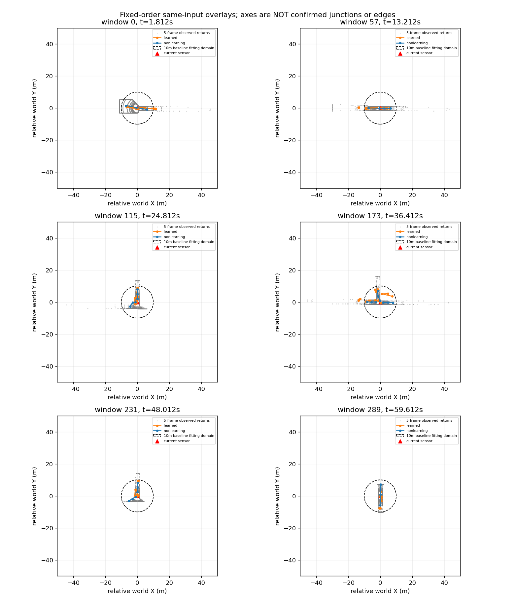

[XZ对照](figures/gse_learned_geometry_pair_v1/XZ.png)与[全290窗诊断](figures/gse_learned_geometry_pair_v1/diagnostics.json)已保存。来源哈希从封存运行核对。

范围检查发现：学习1486条轴线中210条完全不与当前10米球域相交，1276条相交；非学习422条记录中420条有轴线且相交，另2条无有效拟合轴线。必须区分“记录数”与“有效轴线数”。当前原始输出域不完全一致，不能据数量宣称收益。范围外预测不自动等于假阳性，裁剪也不能代替观测证据。

固定图中可见学习输出部分重叠，以及个别偏离主要点云通道的预测；尚未赋予真值错误标签。下一只读做共同空间域与重复/观测支持诊断，原始结果不改、不重跑模型，不凭更多地点宣称建图优势。

预测适配软件已完成：`integration/learned_geometry_trace.py`接收预测轴线及存在概率、显式阈值和checkpoint哈希，转换世界坐标；source_rays空、residual未知、fit_status明确model_prediction，保留被拒绝候选原因。共享后端使用观察时刻/slot计算来源，不生成虚假射线交集，结构和连接仍不由模型关系头填充。当前可见仍由独立sector证据提供。15项适配/图/返回测试通过，真实冻结权重推理尚待精确数据卡绑定。

最新软件结果：基础及SparsePort派生前向已接受可选完整旋转；Observable通过继承接入。12项测试通过，包括纯yaw+平移/无效回波等价、roll轴向变化、反射及当前非单位旋转拒绝、Observable完整前向identity等价及参数不变。尚未加载真实检查点推理；历史 `gate3_20260902_primitive_relation_observable_three_seed_training_v1_seed0/artifacts/models/seed{0,1,2}/selected.pt` 全部存在，按原failure_attribution规格核对SHA均一致。随机初始化软件测试不能代表冻结模型效果。

范围：用户要求继续论文主线后的下一软件工作。开发闭环已经完成；本阶段不重启中心评分器，不训练、不读取保护世界、不把旧关系预测直接提交为图边。

## 已核实可复用的模型接口

`representation/primitive_relation_model.py` 的 `PrimitiveRelationNet` 输入为五帧归一化距离／有效掩码 `[B,5,2,16,720]`，相对平移 `[B,5,3]` 和相对偏航角 `[B,5]`。输出最多32个通道基元：三点轴线、端部截面半轴、截面指数、存在性与不确定性，另有旧关系输出。

本次只考虑复用几何输出。关系头、端点身份、全局地点合并不作为这次接线内容。几何轴线可转换成现有通道提议；预测轴线端点仍不是确认开口。没有拟合射线来源时，不得伪造 `selected_ray_indices` 或把预测包装成 `observed_surface_fit_only`。

## 当前不能直接连接的两处差异

1. **运动合同不同。** 旧模型 `register_causal_lidar_points` 仅旋转XY，Z不随roll/pitch旋转；现有 `live_geometry_pipeline` 已采用完整相对旋转。不能只传yaw并声称输入与非学习前端一致。先增加完整旋转的可选、无新权重输入路径，验证纯yaw情形与旧实现等价、倾斜情形坐标正确、未来/非法姿态拒绝。旧检查点权重不因此改变，但部署输入分布变化仍须单独报告。
2. **观测支持含义不同。** `ObservableSparsePortRelationNet.endpoint_evidence_logits` 是旧端点证据预测，不等于当前传感帧的方向支持。保留底座的直接方向证据用于返回快照和重新确认，缺失证据保持未知，不从模型分数补造。

## 接线顺序与检查边界

先做纯合成软件测试（真实世界、训练观察均为0）：完整刚体配准 → 带预测来源类型的几何输出适配 → 原图接口。模型几何与非学习几何需保留不同来源标签，但后端执行、当前观测支持及穿越边规则相同。

软件通过后，才根据已有数据卡与检查点清单选定一次只读推理／回放所需精确人口；在清单和环境未核对前不加载任意权重、不导出新数据、不开始训练。检查点选择依据现有冻结约定，不按本次效果挑选。

该接线成功只能证明旧几何网络可以接入，不证明其几何精度、建图优势或探索收益。随后应先看同输入的几何提议和图恢复，再决定是否值得训练；不能把再跑一个网络本身当进展。
