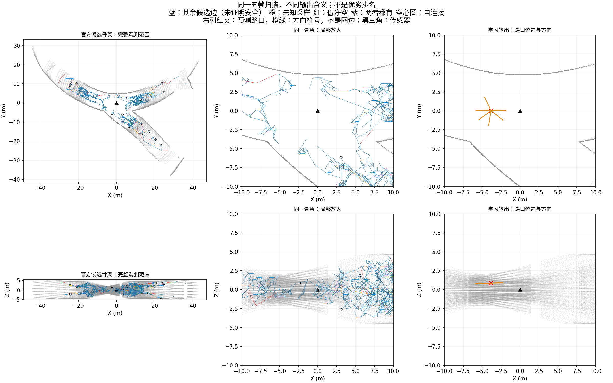

# 307个真实扫描观察：官方几何建图参照已完成

官方Voxblox扫描融合与骨架模块已在既定307个五帧观察上全部执行，未重新训练或改变地图。V2只修正原生自连接的保存合同，算法和参数未变；第一例输出与失败V1逐字节相同。旧失败证据完整保留。

## 已经得到什么

- 250拟合、27校准、30开发观察，共56父地图；每观察独立建图，不拼接不同穿越。
- 总执行639.08秒，父进程峰值RSS102699008字节，子进程峰值RSS148975616字节，零GPU、零优化器更新。
- 全部307份原图、原生stderr、输入身份和哈希、逐边风险检查均已保存。
- 独立核验627份证据文件的哈希与完整集合、归档源码、身份顺序、分区、原图字段与计数通过；没有重新渲染扫描或证明几何准确性。

正式run：`results/gate3_semantics/gate3_20260909_gse_native_graph_population_v2_seed0`。执行会话5512 exit0；核验61922 exit0。seal SHA256：`a6235d5c5f2062e0133ecd086529cd3abe36fdafb1601295a76b9e0287871949`。

## 为什么不能直接说“拓扑建图成功”

307个独立局部图合计444431个几何点、723479条原生边；这是各观察的重复累计，绝不是一个地下地图的路口数或独立通道数。

累计4750条自连接、10535条边包含未知体素采样、9386条边包含低于原0.4米阈值的采样。后两类可能重叠，不能相加当作独立失败边数量。全部原边均保留，检查通过仅表示记录忠实完整，不是路径可执行。

成熟几何算法提供了可重复的观测到图参照，但其输出是空间骨架，不是我们的持久路口和语义支路。不能把几何点度数直接当路口，不能与学习模型的局部结构成绩直接混合排名。当前仍未证明几何关系学习改善语义图或探索。

## 接下来的有用比较

### 已完成的同场景展示与分区统计

固定首个开发观察：S03平面单环小地图的rounded_rectangle变体，序列32788、帧740–744，与此前学习结果展示是同一观察。上排俯视、下排侧视；左列完整观测，中列20米方形视口放大，右列原R2预测。仅改变显示范围，不裁剪算法输入或删除图边。灰点来自已保存同源点缓存，无重新扫描或推理。

官方输出1795个几何点、3068条边；学习输出是1个候选路口与6个方向符号。它们回答的问题不同，图不能作为方法排名。官方骨架表现出局部密集、小环及碎片；右侧也不能因为简洁就宣称正确，原支路误报和漏失仍成立。图没有绘制真值路口，不能凭图判断预测位置精度。

| 分区 | 观察／父地图 | 每观察节点数中位数 | 分量数中位数 | 含未知采样边的观察 | 含低净空采样边的观察 |
|---|---:|---:|---:|---:|---:|
| 拟合 | 250／47 | 1411 | 10.5 | 250 | 250 |
| 校准 | 27／4 | 1406 | 14 | 27 | 27 |
| 开发 | 30／5 | 1339 | 11 | 30 | 30 |

表中分量由最终原始连接重新计算。中位数是描述统计，不是跨父地图显著性或恢复正确率。独立观察没有形成一个全局图；未知和低净空两类可重叠，且只针对边上离散体素采样。

PNG、PDF和逐观察统计/输入hash保存在`docs/figures/gse_graph/native_population_v2_20260909/`，生成会话44883 exit0并打开检查。原生图/模型预测未改。

下一项研究决策应是明确空间骨架到可评分结构事件的公共接口，并检查当前距离场范围和有限观测对碎片的影响；不能直接把degree当路口，也不能为了简化这张图调参。该参照的作用是暴露非学习几何能力与局限，尚未替代原计划所需的几何关系独立消融。

先按既定分区汇总图规模、分量和风险比例，选固定清单位置的同场景XY/XZ图，把“扫描/骨架”和“学习路口/方向”分开展示；不挑好看的例子。随后明确共同可比较的结构位置与方向范围，以及仍缺失的语义映射。不围绕官方参数调剪枝，不继续追加旧学习头的种子或轮数。图参照建立完成，不能代替几何关系贡献的必要消融。
