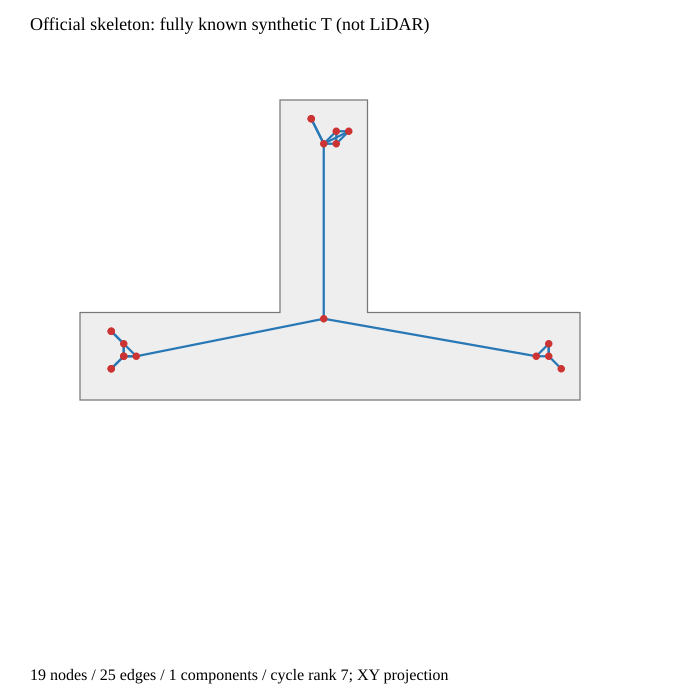

# 原生骨架图：有T形主干，但不是语义路口图

本记录分析已保存的官方输出，不重跑、不改参数、不删除节点或边。脚本check_native_skeleton_graph.py校验原graph.json SHA后按原始多重边逐项计算。

原始19节点、25边、1连通分量，多重图cycle rank=7。端点1和9之间有两条边；仅作诊断的无向简单图有24条唯一边、cycle rank=6。两种口径明确区分，原始重复边仍保留。

节点15连接三个区域。分析时移除此节点，剩下三个分量分别有4/6/8节点、5/8/9条边，环数2/3/2，总计7。结合原坐标，它们位于三个通道末端；原生图已有T形主干，额外环不发生在三条通道之间。这里的移除只是分析操作，不生成一个被剪好的替代图。

中心节点位置为(5.875,6.625,1.875)m，合成通道轴交汇为(5.875,5.875,1.875)m，相差0.75m。这只是已知合成场景的定位说明；未按4米合同宣称感知通过，更不能拿它与另一种合成几何下的旧轴线失败直接排名。

## 可以得出什么

官方代码能够从全已知离散距离场产生非空、有三条主干连接的规划图。这证明了本地原生接口可以复用，不证明LiDAR观测下结构感知有效。骨架几何细节与语义事件不是同一个输出；degree≥3不能直接定义路口，终端角部也能形成高阶点。

## 下一步

停止针对这张全已知图做去重/聚类/剪枝调参。保留原生骨架作为几何规划图参考，学习生成语义节点仍是主方法待验证内容。下一检查并接官方TSDF→ESDF积分器的合成射线输入，而非将研究地图真值填成观测距离场；检查未知传播、远回波裁剪和图位置范围。真实307数据执行在输入合同冻结后进行，不将这些合成节点当新训练标签。
