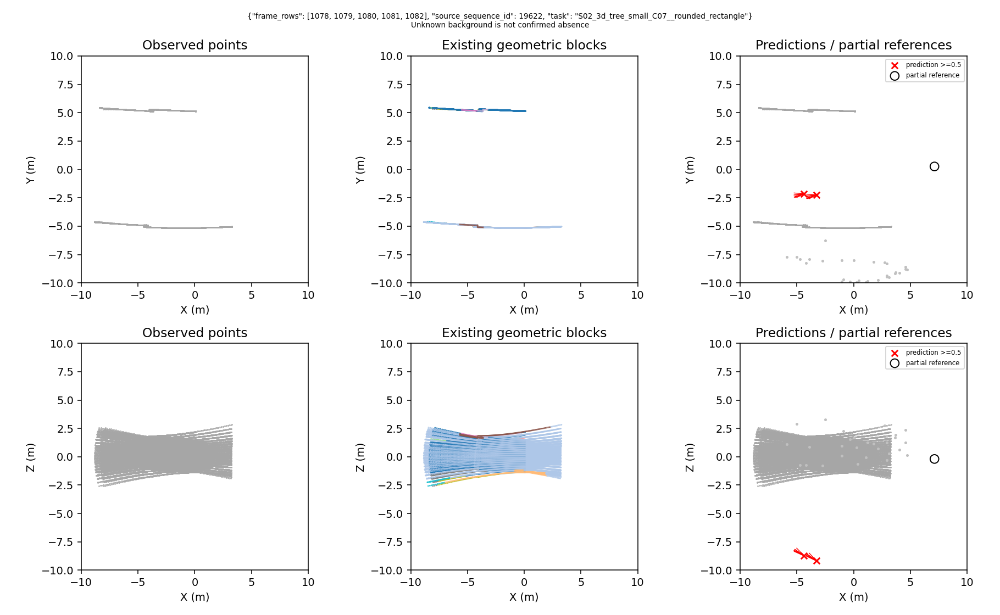
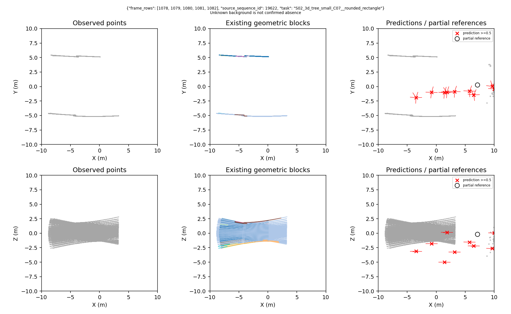

# 观测锚定检测器：500批实验结果

## 结论

**模型开始利用观测，但还不是合格的路口检测底座。本轮未通过，不启动两组2000批关系训练。**

与训练前完全不命中参考路口相比，训练后能命中一部分路口。但位置仍不准，同时产生大量额外预测。不能把“开始报路口”包装成“检测成功”，更不能据此声称几何关系改善建图。

## 本次做了什么

输入、标签和顺序不换：282个拟合观察、578个校准观察，来自5／4个父地图。都是已有五帧因果观测；校准不是独立测试。拟合对应186次路口参考、598条分支参考，校准对应376／1215。相邻观察和几何变体不能当独立地图统计。

保留原冻结编码特征及分块，用真实点云中的最远点采样位置提出最多32个查询。网络从这些位置预测路口偏移、存在概率和分支方向，不再使用自由位置查询。原10米域、0.5概率阈值及独立几何评分不变；新增的中心存在性损失将正负两组分别平均。该版没有提供显式几何关系属性，是待建立的共同底座，不是完整GSE-Graph。

seed0固定500批、每批4个观察，实际500次更新。500批与原实验前500批顺序逐项相同；只评价初始、最终权重。总运行1061.19秒，约17.7分钟；其中500批更新约114秒，其余包括载入、初末评价、反事实与证据校验。峰值主机内存6,884,130,816字节，证据约120 MB。运行正常结束，没有软件异常或资源超限，失败的是研究验收。

## 结果到底怎么样

下面保持原主合同：路口4米、分支10度。这里只能算部分参考召回，不能算完整检测F1。

| 最终结果 | 拟合282观察 | 校准578观察 |
|---|---:|---:|
| 路口命中／参考 | 147／186（79.0%） | 238／376（63.3%） |
| 分支命中／参考 | 288／598（48.2%） | 393／1215（32.3%） |
| 已知路口误检 | 452 | 898 |
| 已知分支误检 | 2561 | 5049 |
| 无法确认的路口预测 | 670 | 1678 |
| 无法确认的分支预测 | 3071 | 7729 |

拟合集每个观察平均已有**10.68个已知错误预测**（路口与分支合计），门槛是最多0.1个。即使分别计算，两项也都超限；不是统计口径稍改就会通过的问题。

定位也必须单独看，不能只展示宽松的4米命中：

| 路口匹配距离 | 拟合命中／186 | 校准命中／376 |
|---|---:|---:|
| 1米 | 12 | 6 |
| 2米 | 49 | 73 |
| 4米 | 147 | 238 |

全部九档原始结果保存在逐观察评分与父地图汇总中，没有选择最有利档位。

## 与之前相比，哪些问题解决了，哪些没有

通过了两项排除捷径的检查：

- 用拟合预测构造固定位置模板，最近候选平均误差为5.344米；真实输出为2.753米，改善2.591米，超过预定0.20米。
- 固定打乱输入与标签对应后，路口命中从147降到118，召回下降15.59个百分点，超过预定10个百分点。

这支持“当前输出不是原来的近似固定摆点，确实利用了一部分输入差异”。**它不支持“定位已精确”**：真实输出最近候选均误差仍有2.753米，而且这个诊断使用全部候选，不是实际检测成绩。

三个真正的检测条件仍失败：路口召回未到90%、分支召回未到90%、误检远超上限。因此停止扩训；不能因两个反事实检查通过就跳过检测门槛。

### 能否归咎于重复报同一路口

不能。依据已保存的逐查询掩码，拟合集452个已知路口误检中，384个落在原训练负例排除证据内，另外68个不在；校准为801／97。因此不能把错误全部解释成“同一路口周围多报几个点”，也不能声称只加去重就能解决。

这也没有证明唯一根因是网络、教师或训练轮数。现有证据确定的是：本轮配置的定位、存在性和分支恢复均未达标。后续只能据证据拆解，不能追加轮数或调阈值追成绩。

## 同一场景的真实图

图由运行前固定的身份顺序选择，不是挑成功案例。左列：五帧点云；中列：已有几何分块；右列：预测与部分参考。上行为俯视，下行为侧视。黑圈为参考路口，红叉为概率达到0.5的预测路口，红短线为预测分支，浅灰点为未选中的候选。未知区域没有被画成确定负例。这里只画局部点云，模型还读取已有冻结观测特征。

训练前：

训练后：

可以看到输出发生了明显变化，但仍有很多额外红叉，且上下位置不准。这是失败分析图，不是成功建图示意。全部6个固定身份均保留初末图，共12张。

## 下一步与不可做的事

按预登记分支，停止观测查询路线扩训，保存它作为失败证据。先制定三维中心响应图与当前部分标签、未知区域的适配规格；没有规格和低成本检查之前不启动新训练。参考[GSE三维中心响应图备选规格](GSE_CENTER_RESPONSE_FALLBACK_SPEC_V1.md)。

不运行A/B2000，不加种子，不降评分要求，不将该模型接入探索，不声称关系模块或拓扑图优势。

## 可复核证据

- [正式运行](../results/gate3_semantics/gate3_20260909_gse_observed_detector_pilot_v1_seed0/metrics/summary.json)：终态`PILOT_FAIL`，程序正常完成。
- [初始逐观察结果](../results/gate3_semantics/gate3_20260909_gse_observed_detector_pilot_v1_seed0/metrics/initial.jsonl)、[最终逐观察结果](../results/gate3_semantics/gate3_20260909_gse_observed_detector_pilot_v1_seed0/metrics/final.jsonl)：各860行，每行九档评分和匹配／未知证据。
- [父地图汇总](../results/gate3_semantics/gate3_20260909_gse_observed_detector_pilot_v1_seed0/metrics/final_parents.json)、[282项反事实](../results/gate3_semantics/gate3_20260909_gse_observed_detector_pilot_v1_seed0/metrics/fit_counterfactuals.jsonl)。
- [封存清单](../results/gate3_semantics/gate3_20260909_gse_observed_detector_pilot_v1_seed0/artifacts/evidence_sha256.txt)：1755文件逐SHA及精确集合核验通过；初末所有九档父汇总、模板重建、282个供给方／接收方对应及最终决定均独立重算一致。

补充完整性核验：1890个绑定源码／配置快照与当前哈希一致；1720份预测的来源索引唯一性、32查询／64分支形状、有限性、方向单位化、10米边界及残差重建全部通过；12张固定身份图完整；最终checkpoint确认500次更新且参数有限。该核验不把只看部分参考的评分升级为完整检测验证。

最终权重SHA-256：`4d9a99ec629bcb5c5dbab4629ac4b614106fa8657f15bccdee8b231367e85b6b`。

封存清单SHA-256：`298d59cf15a6c73ecc690a8ffc93972189b233074f1716e1dbdced1674445674`。
