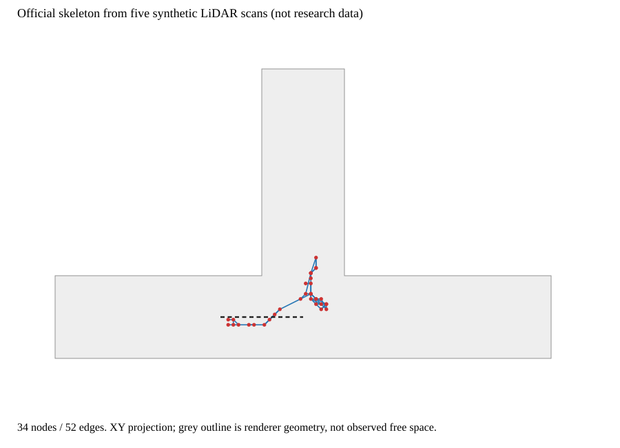
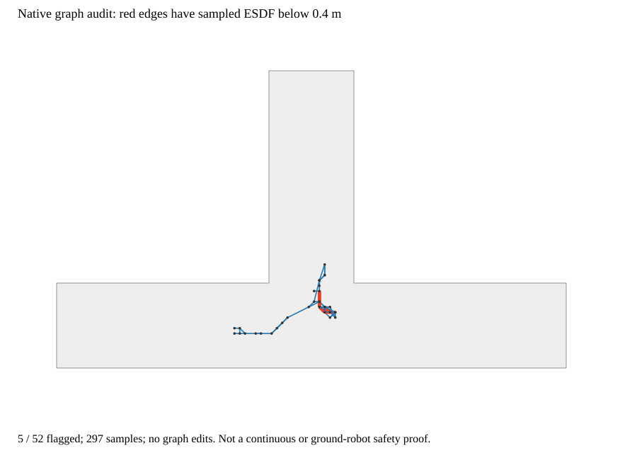

# 官方算法的合成LiDAR链路

2026-09-09原生合成图边审计完成：独立synthetic_lidar_edge_audit复用原积分与生成，旧graph各字段逐项一致；52边共297点(间隔≤0.125m)无未知采样，5边低于原min_gvd_distance=0.4m，最低0.322912m。保留原图、不删边，edge_audit.json/SVG标红。此为体素采样诊断，非连续碰撞/地面安全。下一按候选规划图而非可执行/语义图定位官方参照，完成固定输入runner的范围与参数说明，原局部执行验证不能绕过；不改阈值/调剪枝/训练。

已执行，而非仅编译：五帧扫描→SimpleTsdfIntegrator→EsdfIntegrator→SkeletonGenerator。结果34节点52边，原始连接保留。

灰轮廓是渲染器的合成通道几何，仅帮助理解位置，不表示模型已观测的自由空间。点和线是官方输出；线不是已穿越边，也不是安全检查通过的边。

## 输入与设置

两长方体空气体积并集形成T形通道，五个传感器位置x=-4,-3,-2,-1,0米，姿态不旋转；16线、720列，俯仰-15到15度步长2度，水平步长0.5度。共57600首返回。积分器只获得回波与位姿，不获得渲染几何。合成范围明确，不读取任何C01–C10地图或模型。

体素0.25米、块边16体素；TSDF截断1米（4体素）、最大射线50米、单线程；ESDF使用完整欧氏距离，不加入occupied crust，不调用addNewRobotPosition清空/占据球，其余设置使用固定上游默认值。骨架参数未按本例调节。这些是软件验证设置，不是已经冻结的真实数据实验参数。

## 实际检查与限制

新增检查只对原生图边做标记，重新生成的旧字段全部与原graph.json一致。52条直线边以不超过0.125米间隔取297点，查询所在ESDF体素：0条边出现未知采样，5条边含低于0.4米的采样，最低0.322912米。没有用真实空气体积或教师答案修图；没有删除这5条边。离散采样可能漏掉短小区域，因此“未发现未知”不是“连续全程已知”的证明。0.4米取自原生生成器自身设置，不等于部署机器人的安全合同。

官方方法在本项目中先定位为候选几何规划图参照。它不是学习结构节点、真实穿越边或可执行路径的替代；后续真实runner必须保存原图及验证标记分别输出，不能静默将过滤后结果包装为官方原生结果。

45480个已观测ESDF体素距离有限且对应TSDF权重达到上游min_weight；hallucinated标记0，缺少TSDF支持0。另134744个已分配体素仍未知；未分配空间也未知，没有统计为已知。此检查不证明地面支撑、每条自由射线、完整安全合同或连续表面的真实性。

结果图不是上一张全已知距离场图，两者输入不同，不直接比较节点数量作为方法优劣。这里只确认官方链路能消费扫描而无需真值距离场。下一检查原始图边是否穿过未知或距离场净空不足的位置，保留原结果，不静默删除边；再判断如何接研究中的结构图对照。

复现：cmake --build build/gse_voxblox_cpu_v1/cmake -j2；设置LD_LIBRARY_PATH为该独立prefix/usr/lib/x86_64-linux-gnu后运行cmake/synthetic_lidar。具体源码在tools/v3/native_voxblox/synthetic_lidar.cpp。上游版本和唯一序列化兼容补丁沿用已登记构建。
