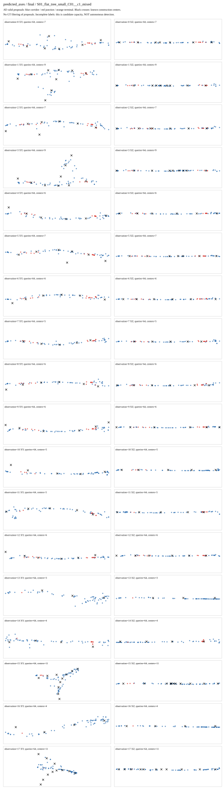
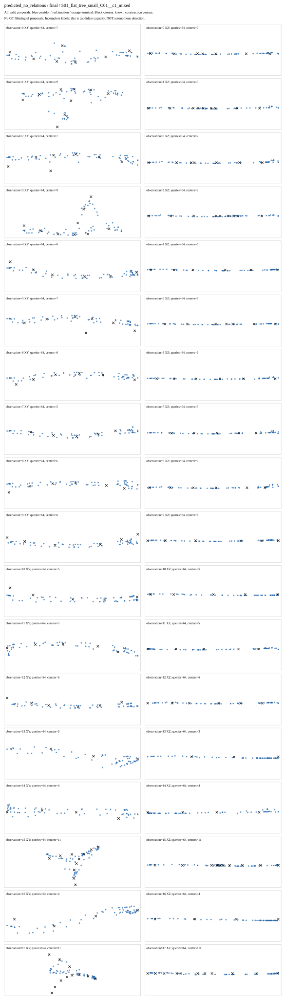

# 三组结构学习短实验：有局部作用，尚不能可靠建图

2026-09-05。本次优先使用 RTX 5090 D，三组共900次更新及完整评分在100.44秒内完成。不是重新训练整个网络，而是复用同180个五帧观察的几何缓存，只训练几何后面的结构模块。没有新增扫描、骨干推理或读取测试地图。

## 做了什么，结果怎样

问题是：知道局部通道的形状后，模型能否找到结构中心，并判断哪些通道属于这个中心？同一初始化、样本顺序、每组300步，比较以下三种输入。中心评价使用独立几何匹配，不借助训练时的类别和成员答案挑候选。

| 固定第300步 | 中心平均误差 | 通道归属F1 | 正成员召回 | 正成员预测精度 |
|---|---:|---:|---:|---:|
| 真实轴线＋组合关系，作为理想输入参考 | 0.077米 | 0.535 | 37.3% | 94.4% |
| 预测轴线＋组合关系 | 2.329米 | 0.155 | 9.3% | 46.2% |
| 同一预测轴线，去掉显式关系 | 2.521米 | 0 | 0 | 无正预测，不能定义 |

加入关系的预测分支在10/10张父地图上中心误差都更低，整体降低约7.60%；成员F1也比去掉关系后全部答负例更好。但它只找回201/2152个已对应正成员，仍严重漏失。不能把“比退化对照好”写成方法已经成功。

真实轴线输入的中心误差从初始化1.869米降到0.077米，说明中心读出可以拟合这些理想输入；但归属仍漏掉1349/2152个正成员，14次交汇事件无一次正确。问题不能全部归咎于预测几何误差，也不能据此断言几何组合原理不成立。

## 为什么不继续盲目加训练

- 已知事件只有872次走廊、14次交汇（6个独立交汇）、没有终点。去掉关系的模型全部答走廊仍有98.42%准确率，却一个交汇也没找出。因此不用这个准确率宣称成功。三组两类宏平均F1约0.491、0.491、0.496，均没有有效解决少数交汇识别。
- 预测关系分支成员F1从随机初始化全部答正时的0.242降到0.155，同时精度从13.8%上升到46.2%、召回从100%降到9.3%。这是过度漏报及精度—召回取舍，不是“所有指标都改善”。阈值仍固定0.5，没有事后挑阈值。
- 训练集合匹配同时使用位置、事件和成员损失；独立评分只使用中心位置。两种对应是否分配到不同候选，是需要查证的假说，不是已经证实的失败原因。先分析已有缓存和匹配记录，不直接再跑长训练。
- 标签不完整：多余候选没有背景负例，存在概率尚不能作为已验证检出置信度。当前预测保留全部64候选，评分时由已知中心选出对应；这衡量候选容量，不是机器人自主识别出了节点。

原始1206个中心观察来自304个独立构造实例；训练方向对应后2152正/13489负，另3正/21负因方向歧义未知，评分覆盖99.85%。上述两组预测输入都保留11520个候选，未分配10314个；真实轴线只有2892个数值有效候选。因此真实/预测对照不是仅改变噪声的纯对照。全部180观察都是拟合数据，不是未见地图成绩。

训练日志已确认每个分支完整覆盖原人口30遍，训练目标未匹配数为0，独立评分的1206个中心也全部唯一匹配。因此不能解释为UNKNOWN或漏喂样本导致低分。最后一轮真实/预测关系分支的事件交叉熵仅0.009865/0.008370，但训练所选候选的中心误差0.319/2.937米，高于最终纯中心评分的0.077/2.329米。这提示“语义正确的候选”可能不是“位置最接近的候选”；由于最后一轮权重仍在变化，必须用同一最终缓存重算两种对应才能证实，不能拿训练日志成绩替代最终独立评分。

## 图片与保存情况

以下显示同一父地图的全部18个观察，每个观察同时画XY和XZ，不只展示成功案例。黑叉是已知构造中心，彩色点是全部数值有效候选；显示真值仅为了评分/作图，不进入模型。

共保存60张父地图图、2160个XY/XZ面板，包含三组初始化和最终的全部观察；三份最终权重、共享初始权重、900行更新日志、六份全量预测及逐观察/父地图评分均保留，未删除历史图片。

执行无错误，host峰值1938374656字节，GPU reserved峰值320864256字节，运行目录约35.1MB；97项封存内容均复核一致。代码版本`9ded43a`，封存SHA-256为`07f212c90a25785b55a173f0a1f66451b3bb47b9ac6b9b2ded71e78d949d5b1e`。213项指定软件测试通过；软件通过和本次完整执行都不代表论文科学门通过。

## 下一步

停止扩大本轮到长训练、三种子或闭环。下一最小诊断只用三份最终预测缓存、目标和原最后一轮批次，不读权重或运行模型：先复现原纯中心分数，再在同一快照重算原联合匹配，逐目标比较query对应、距离和语义；列出全部14次交汇，并统计正负成员的原概率分布。联合匹配使用答案，只能用来找原因，不取代主结果，也不挑阈值。该新读取/诊断范围需独立冻结，尚未执行。

并行准备[多实例适配层](GSE_MULTI_INSTANCE_ADAPTER_READINESS_V1.md)：保留同一帧的多个结构中心，不把它们全部写成机器人位置，也不拿真值或常数补未知宽高。只有找到可检验的原因后，才另行冻结最小修正实验。

原始结果：[完整指标](../results/gate3_semantics/gate3_20260905_gse_partial_structure_training_v1_seed0/metrics/summary.json)；[固定训练合同](GSE_PARTIAL_STRUCTURE_TRAINING_V1.md)。完整论文目标保持进行中。
