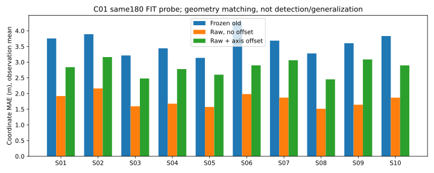
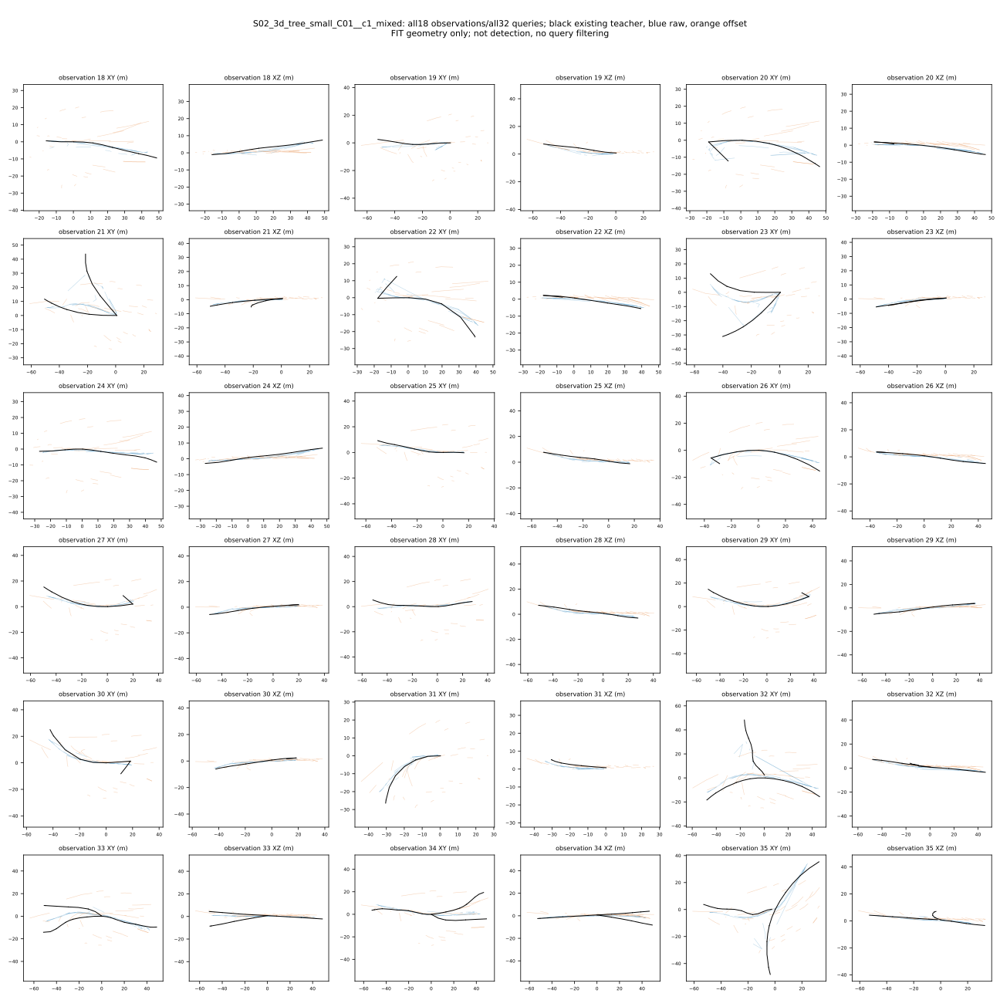

# 原始点轴线读出：第一次固定预算训练结果

## 做了什么，为什么做

此前发现，先把一组激光点的坐标平均，再预测通道中心线，会丢失上下层和局部位置差异。这次保留原始点坐标，只训练小型轴线读出；原五帧编码器和指定 seed0 权重冻结，不重建数据集、不训练整套大模型。

相同的 180 个训练观察来自 C01 的 10 个父地图，每图 18 个；包含 900 帧和 1,452 个可见通道片段。两种读出从相同轴线预测开始，各训练 540 步，使用完全相同的样本顺序、Adam 学习率 0.001、批量 1，最终权重直接评分，不挑中途最优轮次。

- 原始点读出：学习对原始点加权，预测三个轴线控制点。
- 加偏移读出：在上述读出上学习候选通道相关的坐标偏移，尝试从墙面点估计墙面凸包之外的中心线。
- 旧冻结模型：只重新按这次相同的几何对应算法评分，不更新权重。

训练监督只有已有可见轴线。没有新增点级标签，没有把真实节点身份传给学生，也没有训练事件、端口或全局连接。

## 结果：较简单的读出更好，偏移分支没有通过对照

| 方法 | 轴点坐标绝对误差（米） | 轴点三维距离误差（米） |
|---|---:|---:|
| 两种读出的共同初始预测 | 10.151 | 23.945 |
| 旧冻结模型，同一评分合同 | 3.612 | 8.271 |
| 原始点读出，无偏移 | **1.780** | **4.111** |
| 原始点读出，加偏移 | 2.826 | 6.102 |

这里先在每个观察内平均，再平均 180 个观察；不是把所有控制点混成一个平均值。对应由纯几何匹配给出，允许轴线端点反转。与历史使用关系辅助对应的 4.780 米等数值不是同一评分合同，不能混比。

偏移版在全部 10 个父地图上都不如无偏移版，未达到提前冻结的相对提升标准。结论保持 **STOP_BEFORE_EXPANSION**：不增加偏移版轮数，不启动三个种子长训练，也不因原始点版较好就宣布整个方法通过。

原始点版相对旧模型的坐标误差降低约 50.7%，这是同样本拟合改善；三维距离仍有 4.11 米，不能据此声称已经满足结构建图。两份最终权重和全部预测均已保留。

独立只读复核确认：raw 比旧模型好的是 180/180 个观察，比偏移版好的是 177/180 个观察。但 raw 对旧模型的比较同时改变了读出、训练目标和额外拟合过程，**不是只去掉坐标均值池化的一项严格消融**；若以后进行论文级归因，需要同目标、同预算的均值坐标读出对照。

## 图片揭示的局限

上图黑线为原有教师轴线，蓝线为无偏移预测，橙线为加偏移预测。保留全部 32 个候选，不用教师挑掉不好看的预测。S02 图中可见偏移版有散落的短线，部分无偏移预测也没有准确覆盖支路。此处仅为可视化观察，不据一张图给全部数据下定量结论。其余 9 个父地图的完整图与本图保存在同一目录。

评分为每个真实片段找一个对应候选，多余候选不计检测假阳性。共输出 5,760 个候选，其中 1,452 个参与一对一评分，4,308 个剩余候选未受检测惩罚。因此平均几何误差下降不等于“通道识别准确率提高”，更不等于节点/端口归属、陌生地图泛化或在线图已成功。归属与存在性仍未验证。

## 运行与程序故障，分别记录

- 两个分支全部 1,080 次更新已完成，训练执行器到保存故障为止用时 15.977 秒；峰值主机内存 2,560,126,976 字节，GPU 保留内存 2,084,569,088 字节。原骨干不变，旧六字段与缓存复用逐元素复现。
- 原程序最后绘图时把逐地图列表 `parents` 用地图数量 `10` 覆盖，导致绘图失败。已保存的权重、预测、逐观察分数和训练日志完整；原运行保留 `FAILED`，不能改写为完整成功。
- 独立补图程序首次在记录环境时因目录未创建而失败，尚未读取预测。修正只创建新运行所需的父目录，并增加回归测试。两个失败目录均保留。
- 独立补全 `gse_point_axis_evidence_v1r` 用时 17.372 秒，0 训练、0 模型推理、0 checkpoint 读取、0 原始扫描。从已封存的轴点缓存重算全部结果，匹配身份相同，数值在预登记的双精度归约容差内相同；最终科学判断精确保持。生成 11 张 SVG，22 项输出哈希全部独立校验通过。
- 补全后的指定软件回归 423/423 通过。软件通过不是科学门通过。

## 下一步，只回答一个有用的问题

原始点版是否真的随当前观测恢复通道布局，还是只是多输出一些候选就降低了匹配误差？先用已经保存的全部预测做零训练的输入依赖/几何布局检查，冻结同父地图错配对照规则，报告方向、横向位置和剩余候选，不能再凭平均坐标误差扩大训练。若这个基本作用不成立，停止该读出扩展；若成立，再解决有效候选与事件/端口监督。任何新数据操作仍须独立精确卡/spec，不重开 C07–C10、真实图或闭环。

## 复现索引

- [训练规格](../configs/v3/gate3/gse_point_axis_probe_v1.json)与[数据卡](../configs/v3/gate3/data_cards/gse_point_axis_probe_v1.json)。
- [原训练结果及故障](../results/gate3_semantics/gate3_20260905_gse_point_axis_probe_v1_seed0/metrics/summary.json)。原 21 项输出 seal 全部通过，seal-list SHA256：`2e1e72069e1c97422cfb2ac46853370247b1b0882aaaf774a9bdb0361de4a7c7`；另独立核对 920 个唯一输入/工具/访问文件哈希，无漂移。
- [补全结果](../results/gate3_semantics/gate3_20260905_gse_point_axis_evidence_v1r_seed0/metrics/summary.json)与[补全规格](../configs/v3/gate3/gse_point_axis_evidence_v1r.json)。22 项 seal-list SHA256：`49ee4803aaac38ae246a659e4f81c978f020ae6562109eece7d1b6a5da295600`。

旧实验、失败结果、论文图片均未删除。当前仍是几何前端小实验，不是论文核心贡献已证实。
