# 同一检测器，两种分组：先找漏检发生在哪里

## 最新结案结论（2026-09-10，以第20节为准）

**当前候选中心验证器已结案：在既定512个候选、原2米去重和两套1米评价下，第19节最终检查点不存在同时满足两套精确率≥90%／召回率≥90%的统一阈值。第19节原`GATE_FAIL`保持不变，不登记为合格检测基线。**

| 当前状态 | 已验证范围与边界 |
|---|---|
| 位置拟合已验证 | 同16个训练观察上的12个参考中心均有1米内预测；不等于完整检测或泛化通过 |
| 候选评分实现未通过 | 原0.5下旧／固定区域误检11／13；保留至少11个正确检测时，统一阈值扫描最少仍有8／9个误检 |
| 几何基元相对优势与拓扑收益尚未验证 | 不以位置拟合、接口检查或训练集阈值结果宣称几何方法胜出或建图有效 |

已通过的位置拟合、有限监督接口和评价器，以及全部权重、日志、指标、结果图均保留。**不再追加训练、正则、阈值扫描、评分校准、标签修订或去重调整；不启动分支和建图。**

第15节可分性结果仅保留其原固定特征、174个已知候选及原线性头的数值诊断范围；不用于覆盖当前验证器失败，不解释成当前检测基线合格。第20节为本实现最终结案依据；以下历史摘要中的“最新”均仅指当时进度，不再代表当前行动或状态。

**第16节最新结案：三档预定L2均收敛，float32和完整冻结前向均稳定，但检测均未通过。最弱正则仍有17个旧1米误检，固定评分区域后19个误检；停止继续修补这一固定特征评分实现，不冻结开发基线、不补第四档。第15节可分性结论保留，不重跑。**

**第15节最新：固定174个已知候选已证实线性可分；同129参数头一次全批求解后，174标签全对，原1米评价12正确/0误检/0漏检，另有152未知预测。但权重很大，float32有一个正例恰落阈值，不能当成稳定部署或泛化成功。旧第14节失败不改写。**

**最新：固定候选、仅训练存在性头的1000批已完成。位置12/12覆盖保持，但完整检测只有5/12正确、25个确认误检；未通过，按要求停止在评分问题。详见第14节。下文A/B及位置诊断均为保留的历史结果。**

本文前七节保留上轮SPATIAL诊断的历史结论；文末第8节起追加本次“解码→固定对应位置回归→条件性动态位置匹配”诊断，不改写旧成绩。

**9月10日最新结果：A恢复存在性损失但关闭存在性匹配成本，原1000批完成，定位覆盖9/12、完整检出6/12、已知误检49、未知119；精确率10.9%、召回率50.0%，未通过。旧B等价复用，不重训。详见第12—13节。**

9月9日位置隔离结果：解码检查通过；同16样本固定对应、动态位置匹配两项最终均12/12进入1米。平均位置误差分别0.345米、0.391米。它们均未训练存在性，不能当成检测成功或几何方法胜出。逐项结果和新图见第10节。

## 本轮范围

保留零位置残差初始化和已确认的监督修复；4米规则、未知保护、匹配与评分不变。不重复上一轮4漏检/5误检的损失梯度审计。

先复用PRIMITIVE已保存的11组检查点预测做漏检分解，再只补一次SPATIAL的16样本、1000步中心拟合。没有重训PRIMITIVE，没有分支或建图实验，也不以小样本分数宣布方法获胜。

## 1. “定位上限”到底是什么

这里的候选是网络输出的32个**预测中心**，不是32个原始点云采样点。

- **全部预测的定位上限**：暂时不看存在分数和覆盖筛选，在1米内做一对一最大数量匹配。一个预测不能算成两个参考都检出。
- **置信度筛选后的上限**：仅保留原存在概率≥0.5的预测，再做同样的一对一匹配。
- **实际正确数**：沿用原部分参考评分，包括原来的未知竞争者限制。

第一项不足说明位置不够好；第一项到第二项的下降是置信度筛选损失；第二项到第三项的下降才是覆盖/匹配限制。这只是诊断，部署不能利用真值挑候选；没有把未知变成背景。

## 2. 最新PRIMITIVE漏检：四项都是没有1米内预测

| 样本（均为椭圆实现） | 全32预测中最近距离 | 是否有近邻低分可救 | 定位结论 |
|---|---:|---|---|
| S06／72152 | 1.498米 | 否 | 最近预测本身仍在1米之外 |
| S08／116895 | 1.047米 | 否 | 同上 |
| S08／116861 | 1.975米 | 否 | 同上 |
| S06／72159 | 1.077米 | 否 | 同上 |

末轮全部预测的一对一上限是8/12，筛选后也是8/12，实际也是8/12。即使取消置信度筛选，仍不能补回这四项。72152的最近候选分数虽低，也不能误归为“低分导致漏检”，因为它距离参考1.498米，本来就不合1米条件。

## 3. PRIMITIVE训练过程：定位和筛选问题会随轮次变化

| 更新数 | 全候选上限 | 筛选后上限 | 实际正确数 | 主要缺口 |
|---:|---:|---:|---:|---|
| 0 | 0/12 | 0/12 | 0/12 | 定位 |
| 100 | 1/12 | 0/12 | 0/12 | 定位11项＋低分1项 |
| 200 | 2/12 | 2/12 | 2/12 | 定位10项 |
| 300 | 10/12 | 10/12 | 10/12 | 定位2项 |
| 400 | 9/12 | 9/12 | 9/12 | 定位3项 |
| 500 | 10/12 | 10/12 | 10/12 | 定位2项 |
| 600 | 12/12 | 12/12 | 12/12 | 无已知参考漏检；仍有未知预测 |
| 700 | 12/12 | 12/12 | 12/12 | 同上 |
| 800 | 0/12 | 0/12 | 0/12 | 所有参考都缺1米内预测 |
| 900 | 5/12 | 3/12 | 3/12 | 定位7项＋低分2项 |
| 1000 | 8/12 | 8/12 | 8/12 | 定位4项 |

可具体核对的低分案例：第100步S02／混合截面／16703有0.612米近邻，但概率只有16.13%；第900步S08／116895和116861分别有0.140米、0.482米近邻，概率只有0.149%、0.097%。这与末轮四项定位漏检是不同问题，不能混成“调低阈值就能解决”。

全部11个检查点的总召回在置信筛选后没有进一步被覆盖限制扣掉；不表示未知区域完整标注，仅表示这些已知参考的召回缺口没有发生在最后这一级。

## 4. 两组如何保持可比

仍是16个五帧观察、12个中心参考、5个父地图及5个独立路口，80次帧引用去重为68帧。两组都使用793992参数检测器、seed0零位置残差初始化、同一1000批顺序、微批1累计4、AdamW学习率0.001和weight decay0。

运行前417个公共源码文件哈希一致；训练循环的代码结构除分组参数外相同。运行内逐元素核实初始参数、实际点与帧、目标、两种已存分组数组、查询坐标及索引，并核对环境和顺序，全部通过。

PRIMITIVE使用既有几何分块；SPATIAL使用确定性最远点采样和最近种子分组，逐观察匹配同一块数M。点不删、块数不减，预训练上下文从相同源token按各自分组重新汇集。块中心、范围、邻接和池化会随分组变化；本轮不能进一步区分这些因素的单独贡献。

PRIMITIVE0新增更新；SPATIAL只允许本次1000更新。8项新增测试覆盖一对一计数、低分与覆盖区分、查询竞争及SPATIAL实际路由，不是重做旧教师/梯度审计。

## 5. SPATIAL及两组诊断结果

**唯一SPATIAL运行已完成1000次实际更新，正常退出，拟合仍为FIT_FAIL。PRIMITIVE没有重跑。**

| 最后一步 | 全候选一对一定位上限 | 筛选后上限 | 实际正确／漏检 | 已知误检 | 未知预测 |
|---|---|---|---|---:|---:|
| PRIMITIVE，复用 | 8/12 | 8/12 | 8／4 | 5 | 6 |
| SPATIAL，本次新增 | 0/12 | 0/12 | 0／12 | 41 | 53 |

PRIMITIVE精确率61.5%、召回率66.7%；SPATIAL两者均为0。前者也没有达到原双0.90拟合门槛，不能借后者更差宣布方法成功。

### SPATIAL完整过程

| 更新数 | 全候选上限 | 筛选后上限 | 实际正确数 | 定位缺口／低分缺口 |
|---:|---:|---:|---:|---|
| 0 | 0/12 | 0/12 | 0/12 | 12／0 |
| 100 | 3/12 | 3/12 | 3/12 | 9／0 |
| 200 | 3/12 | 0/12 | 0/12 | 9／3 |
| 300 | 0/12 | 0/12 | 0/12 | 12／0 |
| 400 | 1/12 | 1/12 | 1/12 | 11／0 |
| 500 | 2/12 | 2/12 | 2/12 | 10／0 |
| 600 | 3/12 | 3/12 | 3/12 | 9／0 |
| 700 | 1/12 | 0/12 | 0/12 | 11／1 |
| 800 | 3/12 | 2/12 | 2/12 | 9／1 |
| 900 | 2/12 | 0/12 | 0/12 | 10／2 |
| 1000 | 0/12 | 0/12 | 0/12 | 12／0 |

同样没有额外的覆盖/匹配召回缺口。SPATIAL最后一步12个参考均没有1米内预测，不是“位置都对，只是置信度低”。全部12参考的最近预测平均误差从5.393米降到第600步的1.541米，末轮又升到3.418米；PRIMITIVE末轮为0.855米。存在学习变化，但都缺少稳定的最终拟合。

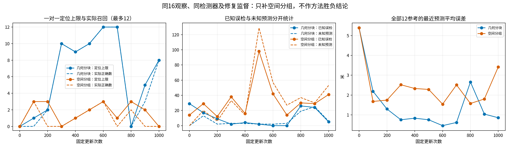

### 原PRIMITIVE四个漏检在SPATIAL上怎样

| 原漏检样本 | PRIMITIVE最近距离 | SPATIAL最近距离 | SPATIAL结论 |
|---|---:|---:|---|
| S06／72152 | 1.498米 | 4.384米 | 无1米内预测 |
| S08／116895 | 1.047米 | 2.458米 | 同上 |
| S08／116861 | 1.975米 | 2.779米 | 同上 |
| S06／72159 | 1.077米 | 2.055米 | 同上；最近候选分数43.0%，但即使放行也不合1米条件 |

其余8个有参考观察在SPATIAL末轮也全部漏检。完整16项的对应预测、原匹配、已知误检和未知数量都保留在机器可读结果中，没有只展示这四项。

SPATIAL的0.5／1／2／4米末轮正确数为0／0／1／8，已知误检为41／41／40／38，未知为53／53／53／48。不选择4米档位改变本轮判断。

## 6. 根据差异，问题定位到哪里

| 待区分问题 | 本轮证据 | 现在可以下的判断 |
|---|---|---|
| 仅因存在性筛选导致最新漏检？ | 两组末轮全候选上限分别只有8/12、0/12；筛选不再减少正确数 | 否，末轮首先缺合格位置；中间轮次另有低分损失 |
| 仅因PRIMITIVE独有接线错误？ | SPATIAL也无法稳定拟合；实际分组输入、查询、初态、公共源码及训练循环对齐 | 现有证据不支持；已检查的边界没有发现串用输入或监督，但不是所有内部实现均无缺陷的证明 |
| 共用检测管线是否已稳定？ | 两组都发生定位上限回落和存在性失配，公共训练预算内均未通过 | 没有。后续故障定位优先聚焦公共中心回归、匹配与优化稳定性 |
| 几何组织已经获胜？ | PRIMITIVE在此单种子固定拟合上更好，但自己仍失败，独立路口仅5个 | 不能。只能保留组织方式与拟合行为相关的现象，不证明泛化、建图收益或唯一因果机制 |

**收窄后的问题是：相同中心检测器为什么不能稳定保留已经学到的位置，并保持位置与存在性一致。** 不是重新推翻初始化或监督修复，也不是直接更换几何表示。仅凭本轮尚不能区分残差参数化、训练匹配切换、损失尺度或分组与优化的相互作用哪个是唯一根因；本轮不新增这些干预实验。

## 7. 同场景图及证据保留

固定使用原清单中第一个最新漏检S06／椭圆／72152的场景。红叉是存在概率≥0.5的预测，黑圈是部分中心参考；灰点表示原始观测，彩色是各自分组，不能把颜色变化当检测成功。两组都没有训练分支。

PRIMITIVE，复用末轮：

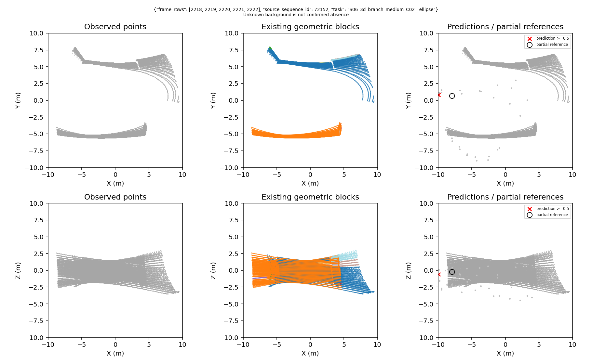

SPATIAL，本次末轮：

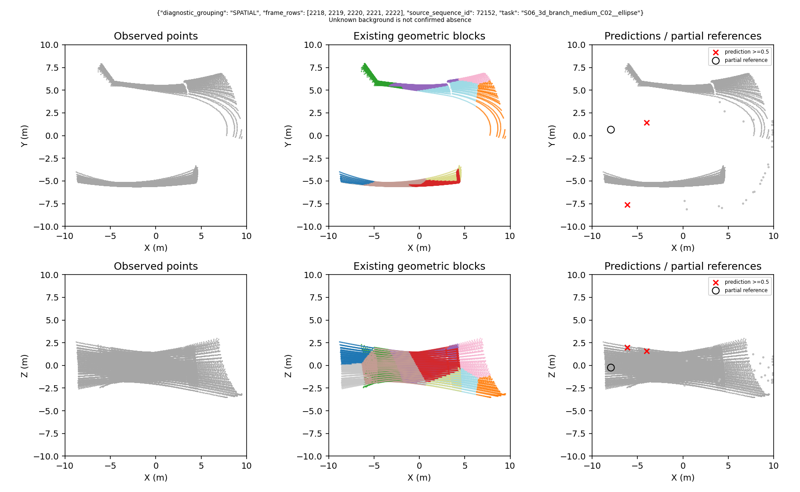

完整16项初末XY/XZ图分别保存在两次run的`previews/`。对照曲线与全部16项逐项数据已汇总；不覆盖PRIMITIVE旧图或旧权重。

本次52581正常exit0，1000实际更新耗时345.04秒，峰值主机约2.25GiB、GPU约0.289GiB，新增运行约126.2MiB。277个新封存文件的精确集合与SHA均核验。日志中1000步参数梯度有限，分支梯度为0；未重新计算上一轮损失/梯度审计。

任务结论：**GATE_MIXED（可比性与漏检定位完成，两组拟合仍未达标），不推进阶段。** 主对照正式扩训、分支和真实建图继续暂停；不将几何基元路线判为NO-GO，不宣布小样本方法胜负。

## 证据入口

- [精确数据卡](../configs/v3/gate3/data_cards/gse_spatial_center_fit_v1.json)
- [冻结运行规格](../configs/v3/gate3/gse_spatial_center_fit_v1.json)
- [PRIMITIVE原检查点预测的定位漏斗](figures/gse_graph/primitive_localization_ceiling_20260909.json)
- [实际输入、初态和顺序对齐检查](../results/gate3_semantics/gate3_20260909_gse_spatial_center_fit_v1_seed0/metrics/reused_primitive_comparability.json)
- [一对一分析实现](../src/mtare_topo/evaluation/grouping_localization_ceiling_v1.py)
- [SPATIAL运行入口](../tools/v3/spatial_center_fit_v1.py)
- [两组全部检查点与16项明细](../results/gate3_semantics/gate3_20260909_gse_spatial_center_fit_v1_seed0/metrics/paired_fit_diagnostic.json)
- [SPATIAL最终指标与资源](../results/gate3_semantics/gate3_20260909_gse_spatial_center_fit_v1_seed0/metrics/summary.json)
- [逐项对照与封存复核](figures/gse_graph/spatial_vs_primitive_fit_20260909.json)
- [277文件SHA清单](../results/gate3_semantics/gate3_20260909_gse_spatial_center_fit_v1_seed0/artifacts/evidence_sha256.txt)

## 8. 追加：先确认预测点究竟能移动到哪里

本次没有再做全32查询统计，也没有重跑此前监督漏洞审计。先直接检查正在使用的解码代码：

```python
residual = 20 * tanh(raw_residual)  # 每轴范围，不是半径20米
position = query_position + residual
position = position / max(1, norm(position) / 10)  # 投影回10米球
```

因此，预测中心**不是被限制在表面采样点附近1米内**。查询点在10米球内，偏移后的点投影回同一个球。球内目标的每轴差小于20米时，可用 `atanh((目标-查询)/20)` 得到有限逆解。边界上精确轴向对跖点是极限情况，不能笼统声称所有闭球目标都有有限精确逆解。

本批只检查step0固定匹配到的12对查询—参考，不重新统计全候选。实际最大单轴差 **5.9948米**，远未触及20米限制；解析逆解经实际解码后，最大位置误差 **0.000000373米**。因此，这12项不是因为“解码范围够不到”而漏检。

另外设12个独立的三维回归张量，使用相同解码和欧氏位置损失，但不经过网络。由零残差开始，固定1000步后，最大误差 **0.04954米**。这只是检验数学解码与梯度能否回归目标，**不是模型成绩，更没有把这些真值张量接入网络前向**。

梯度测试也确认了一个风险：点在球外时，投影可能消除向外的径向梯度；`tanh`接近饱和时梯度也会变弱。可达性通过并不保证网络优化稳定，不能据此宣布已经找到旧失败的唯一原因。

## 9. 追加：怎样把“位置不会学”与“匹配不断变”分开

固定同16观察、5父地图、12个参考中心和4个无正例观察，复用同一PRIMITIVE零残差step0权重、真实输入、查询和原1000批顺序；AdamW学习率0.001、权重衰减0、微批1累积4。模型结构、4米规则与未知保护没有改动。

- **固定对应**：仅在step0用位置距离做一对一匹配，然后锁住查询编号；训练期间每个参考始终监督同一查询。真值只进入对应和损失。
- **仅位置损失**：沿用“匹配位置的欧氏距离均值÷10”，不加存在性损失，不加存在性匹配成本。4个无正例观察不产生位置梯度；没有将它们的未知区域当背景。
- **条件性动态匹配**：只有固定对应最终至少11/12项进入1米，才从原step0重新开始独立1000批，在每步按当前几何距离重新匹配。不是从固定对应训练后的权重继续训练。
- **逐项验收**：只看预定最终1000步；每100步和每个参考的误差都保留。没有存在性学习，所以这里的“进入1米”不是完整检测召回，更不能报告检测精确率或方法优胜。

已确认的监督修复源码保留，位置-only是明确的诊断消融，不是撤销修复。存在性损失和存在性匹配成本的分别恢复属于后续步骤，本轮不执行。

实施中有一次训练前检查错误：JSON排程是列表、生成器返回元组，直接比较误报顺序漂移。该次 **0模型更新**，证据封存；独立v1r仅修复容器比较、验证元素顺序，直接复用已通过的张量验证。没有因此重做已完成训练或增加1000批预算。新增回归同时验证真正交换样本顺序仍会拒绝。

## 10. 实际结果：两项位置诊断都通过，但没有恢复完整检测

| 诊断 | 开始时平均误差 | 第1000批平均误差 | 第1000批最大误差 | 最终1米内参考数 |
|---|---:|---:|---:|---:|
| 固定一对一对应，仅位置损失 | 5.393米 | 0.345米 | 0.554米 | 12/12 |
| 同起点，动态几何匹配，仅位置损失 | 5.393米 | 0.391米 | 0.507米 | 12/12 |

两项都使用原1000批排程。**第14批恰好全为4个无正例观察**，两项都跳过这一次无监督更新，因此各为999次实际参数更新，而不是1000次；没有补样本、补更新或将未知当负例。各有3000次正例观察参与训练，4个无正例观察没有增加位置目标。固定诊断耗时143.68秒，动态诊断146.34秒；最高主机内存约2.05GiB、GPU保留内存0.305GiB，每个运行证据约114MiB。

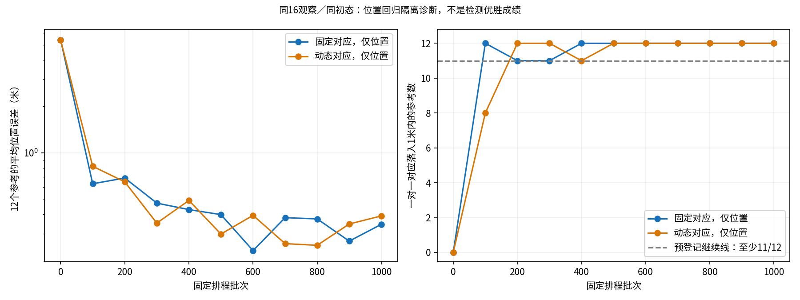

左图平均误差使用对数纵轴，右图是每个检查点的一对一定位数量。最终按预定1000批验收，没有挑固定600批或动态800批的较低误差。

| 批次 | 固定：1米内数量 | 固定：平均误差/米 | 动态：1米内数量 | 动态：平均误差/米 |
|---:|---:|---:|---:|---:|
| 0 | 0/12 | 5.393 | 0/12 | 5.393 |
| 100 | 12/12 | 0.631 | 8/12 | 0.819 |
| 200 | 11/12 | 0.688 | 12/12 | 0.650 |
| 300 | 11/12 | 0.473 | 12/12 | 0.351 |
| 400 | 12/12 | 0.430 | 11/12 | 0.492 |
| 500 | 12/12 | 0.399 | 12/12 | 0.298 |
| 600 | 12/12 | 0.233 | 12/12 | 0.394 |
| 700 | 12/12 | 0.381 | 12/12 | 0.259 |
| 800 | 12/12 | 0.374 | 12/12 | 0.252 |
| 900 | 12/12 | 0.269 | 12/12 | 0.347 |
| 1000 | 12/12 | 0.345 | 12/12 | 0.391 |

固定对应训练全过程没有换监督查询。动态对应在逐次训练访问中累计发生72次切换；每100批的采样记录在200批后未再变化，但这不代表所有中间更新都完全不切换。两项结果说明“几何匹配是动态的”本身不足以解释旧失败，不能直接把动态匹配判为错误实现。

### 每个中心是否恢复

下表是全部12个已有参考，不只展示此前4项漏检。初始和最终均是三维误差；固定列始终评价step0指定查询，动态列评价当时的纯位置一对一对应，不使用存在性分数。

| 样本 | 初始/米 | 固定最终/米 | 动态最终/米 | 结论 |
|---|---:|---:|---:|---|
| S06 圆角矩形／72154 | 4.953 | 0.258 | 0.233 | 两项均进入1米 |
| S02 圆角矩形／16694 | 5.009 | 0.499 | 0.271 | 两项均进入1米 |
| S06 椭圆／72152（旧漏检） | 5.510 | 0.336 | 0.392 | 位置恢复；旧最近误差1.498米 |
| S03 圆角矩形／29343 | 4.849 | 0.237 | 0.419 | 两项均进入1米 |
| S08 椭圆／116895（旧漏检） | 6.010 | 0.554 | 0.426 | 位置恢复；旧最近误差1.047米 |
| S08 椭圆／116861（旧漏检） | 6.007 | 0.224 | 0.423 | 位置恢复；旧最近误差1.975米 |
| S10 椭圆／192651 | 5.651 | 0.279 | 0.507 | 两项均进入1米 |
| S03 圆角矩形／29342 | 4.664 | 0.315 | 0.484 | 两项均进入1米 |
| S02 混合／16703 | 5.208 | 0.233 | 0.477 | 两项均进入1米 |
| S10 圆角矩形／192653 | 6.451 | 0.460 | 0.408 | 两项均进入1米 |
| S06 圆角矩形／72157 | 4.911 | 0.358 | 0.327 | 两项均进入1米 |
| S06 椭圆／72159（旧漏检） | 5.496 | 0.388 | 0.326 | 位置恢复；旧最近误差1.077米 |

“旧最近误差”直接引用第2节已有证据，没有重做旧全查询统计。旧误差是全候选最近距离、新误差是诊断对应距离，**这里只用于确认这4个参考是否重新有合格位置，不作为两种完整检测器排名**。原4个无正例观察不计入12项位置分母，也不因此声称它们误检为零。

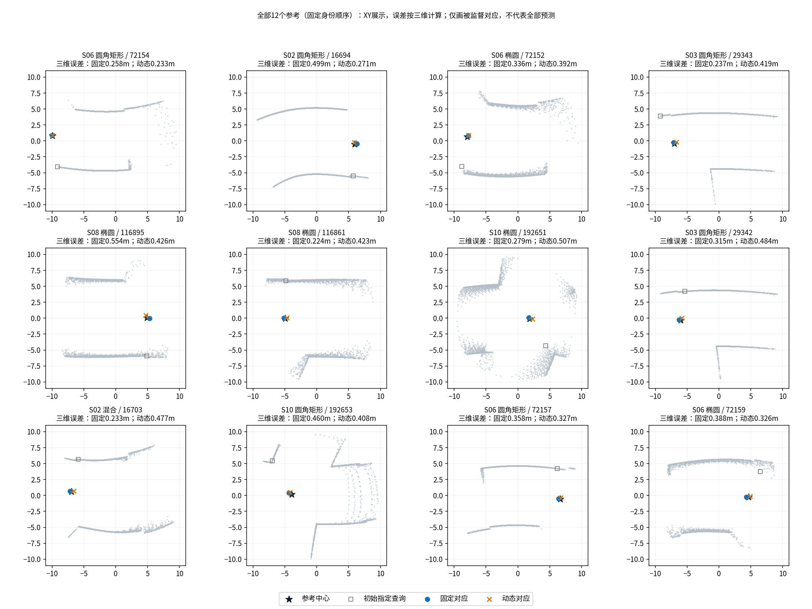

灰点是真实输入点云，为清晰显示按固定顺序抽稀；训练仍使用原完整输入。空心方框是固定诊断最初指定的表面查询点，黑色星号是参考中心，蓝圆与橙叉是两项诊断最终被监督对应的位置。**这里只画对应参考的预测，不画全32个未受位置监督的输出，所以不能凭图判断没有误检。** 图中XY接近不代替三维距离，标题与表格均按XYZ计算。所有12项按固定身份顺序展示。

## 11. 结论收窄到了哪里，以及还不能说什么

已经有直接证据支持：

1. 本批12个中心在真实解码的可达范围内；独立回归张量和位置梯度能回归它们。
2. 真实观测、不变查询、不把GT送入前向时，当前PRIMITIVE网络能拟合这12个中心的位置。
3. 去掉存在性相关目标后，固定对应和动态几何对应最终都能恢复位置；旧失败不能笼统解释成“基元组织根本学不了位置”或“动态匹配一定不行”。

还不能区分：旧退化主要由**存在性损失、存在性匹配成本，还是两者与共享特征/优化的耦合**造成。这两项因素本轮一起关闭，尚没有分别恢复的因果对照，因此只收窄原因，不能宣布已证明唯一根因。

也不能声称：完整路口检测已成功、旧误检已消失、PRIMITIVE优于SPATIAL、几何基元改善了建图。这里只是5个独立结构、16个观察的拟合诊断，未检验输入打乱、泛化或图收益。四个无正例观察无位置监督，未匹配预测依然可能错误。

**本项定位诊断通过（局部GATE_PASS），Phase3研究验收仍未通过，不推进阶段。** 后续应分开恢复存在性损失与存在性匹配成本；本轮没有运行这两步，也没有开启分支、建图、多种子、新模型或正式扩训。原初始化、监督修复、4米规则、未知保护及所有旧运行/图片保留。

### 本次证据与复核

- [固定对应数据卡](../configs/v3/gate3/data_cards/gse_primitive_position_fixed_v1r.json)、[运行规格](../configs/v3/gate3/gse_primitive_position_fixed_v1r.json)、[最终结果](../results/gate3_semantics/gate3_20260909_gse_primitive_position_fixed_v1r_seed0/metrics/summary.json)。
- [动态匹配数据卡](../configs/v3/gate3/data_cards/gse_primitive_position_dynamic_v1r.json)、[运行规格](../configs/v3/gate3/gse_primitive_position_dynamic_v1r.json)、[最终结果](../results/gate3_semantics/gate3_20260909_gse_primitive_position_dynamic_v1r_seed0/metrics/summary.json)。
- [首次独立解码/张量检查（含12对实际坐标）](../results/gate3_semantics/gate3_20260909_gse_primitive_position_fixed_v1_seed0/metrics/decoder_tensor_check.json)。该证据随后两次直接复用，没有重复优化张量。
- [逐项11检查点、对应切换与封存核验汇总](figures/gse_graph/position_only_diagnostic_20260909.json)。两项step0状态摘要均为 `bb47e787a02f6684da2952e48ba950beb961e85c66347d9263c854ad4dfeb9e7`，同原PRIMITIVE初始化。
- [位置诊断代码](../src/mtare_topo/representation/center_position_diagnostic_v1.py)、[9项新增测试](../tests/v3/unit/test_center_position_diagnostic_v1.py)、[运行入口](../tools/v3/primitive_position_diagnostic_v1.py)、[只读复核与制图工具](../tools/v3/report_position_diagnostic_v1.py)。首次结合旧解码/监督回归21项通过，再新增1项排程比较回归；共22项唯一相关测试通过。不是新数据监督审计。
- 两个成功运行各230文件通过SHA与精确集合核验；固定seal `8ec8978c5967172d81415ed0372d89df96b825965754c7ed2e965503c8a4483f`，动态seal `32be39a02bc791d5386b4d081d873e2aa66d0a5a5c9f286a5d41c398beb6a63e`。0更新失败运行30文件也已核验，seal `b81883fa6538ec468f1056bb0b535fc92dce159c9ae392d6a887cfbfa477f009`。

## 12. 2026-09-10追加：只恢复存在性损失，旧完整组直接复用

前文纯位置组已经通过，这次**不重做解码、不重跑纯位置拟合**。新增A组，从相同原始step0开始，而不是继续训练纯位置组的最终权重。

| 组别 | 如何选择负责每个中心的查询 | 位置损失 | 存在性损失 | 本次是否训练 |
|---|---|---|---|---|
| 已通过的纯位置动态组 | 当前几何距离 | 原欧氏距离均值÷10 | 无 | 不训练，引用已有结果 |
| A | 当前几何距离，不使用存在分数 | 不变 | 恢复已修复的正例／确认负例分组损失 | 原1000批一次 |
| B | 几何距离÷10减去存在概率 | 不变 | 同一已修复损失 | 复用原82022，不重训 |

实现不是把模型输出的存在性分数清零。只在**损失内部的匹配调用**传入中性分数，以复用旧的来源绑定、4米负例和重复候选检查；匹配中的常数项不能偏好任何查询，另以独立几何匹配断言确认一致。随后用模型的**真实存在性分数**计算原损失。原前向、保存预测、评分都使用真实分数。

损失保持：匹配位置距离均值÷10，加上正例和已确认负例各自均值的等权平均；只有一组有效则使用该组，未知仍无负例梯度。没有增加位置权重、缩小4米半径、换教师或选择最佳轮次。相关接线、梯度、未知保护11项软件回归通过。

B复用依据不是“名字一样”：逐项核对同16实际点云、帧索引、基元分组、目标、查询位置与来源、原step0所有参数、原1000批顺序；并核对冻结环境、公共训练循环和损失权重。公共循环仅使用A的损失适配器，其余不变。B的存在性匹配成本保留，正是本轮唯一训练差异。B此前完整拟合未通过的结果原样保留。

本轮的完整检测指**中心位置＋存在性筛选＋原部分参考评分**，不是分支检测或整张地图所有结构的完整标注。分别报告：

- 不看分数的一对一1米定位覆盖；
- 经0.5存在性阈值后的覆盖；
- 原评分下实际正确数、已知误检、漏检和未知预测；
- 原0.5／1／2／4米全部评价，不更换主尺度。

验收仍为最终1000批的1米精确率与召回率均至少0.90。A若通过，就保留这条协议做后续公平验证，不再把找到唯一根因作为启动基线的条件。未通过则如实记录，不能拿纯位置12/12代替完整拟合通过。

## 13. A最终没有通过：多一个可定位参考，不等于检测变好

A实际完成原1000批、1000次更新，耗时355.71秒，正常结束，没有数值异常、重试或超预算。与纯位置诊断不同，第14批虽无正例但有确认负例，存在性损失仍会产生一次更新；没有添加输入或补步。B实际训练新增0次，解码和纯位置诊断重跑0次。

| 最终1米指标 | A：匹配不看存在分数 | B：旧完整运行，直接复用 |
|---|---:|---:|
| 全候选一对一定位覆盖 | 9/12 | 8/12 |
| 经过存在性阈值后的覆盖 | 6/12 | 8/12 |
| 原评分实际正确检出 | 6 | 8 |
| 已知误检 | 49 | 5 |
| 漏检 | 6 | 4 |
| 无法确认的预测（未知） | 119 | 6 |
| 精确率 | 10.91% | 61.54% |
| 召回率 | 50.00% | 66.67% |
| 是否通过原完整拟合标准 | 否 | 否 |

这不是只剩一个阈值问题。A有3个参考附近根本没有1米内预测，另有3个参考有近点但分数不足；与此同时大量其他预测分数已超过阈值。不能通过降低阈值宣称解决，更不能把119个未知预测算成正确或悄悄变成背景。

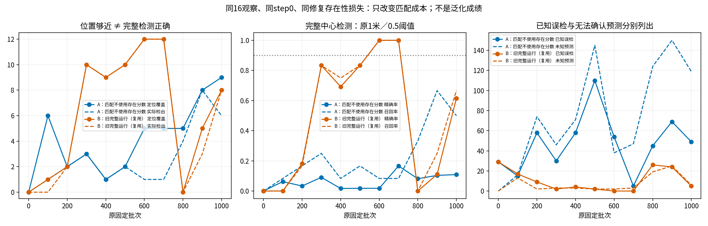

左图将定位覆盖和实际检出分开，中图使用原1米检测合同，右图分开统计已知误检与未知。B在600/700批曾有较好结果，但本轮仍复用它的预定最终1000批，不重新挑选检查点。

### A的全过程

| 批次 | 定位覆盖／12 | 实际检出／12 | 已知误检 | 未知预测 |
|---:|---:|---:|---:|---:|
| 0 | 0 | 0 | 29 | 0 |
| 100 | 6 | 1 | 15 | 16 |
| 200 | 2 | 2 | 58 | 74 |
| 300 | 3 | 3 | 30 | 46 |
| 400 | 1 | 1 | 58 | 71 |
| 500 | 2 | 2 | 110 | 145 |
| 600 | 5 | 1 | 54 | 38 |
| 700 | 5 | 1 | 5 | 47 |
| 800 | 5 | 4 | 45 | 124 |
| 900 | 8 | 8 | 69 | 150 |
| 1000 | 9 | 6 | 49 | 119 |

### 六项漏检具体发生在哪里

| 样本 | 最近预测距离 | 该预测存在概率 | 漏检类型 |
|---|---:|---:|---|
| S06 圆角矩形／72154 | 0.641米 | 0.439 | 有近点，低于原0.5阈值 |
| S06 椭圆／72152 | 0.923米 | 0.459 | 有近点，低于原0.5阈值 |
| S03 圆角矩形／29343 | 1.334米 | 0.602 | 没有1米内预测，不能靠分数解决 |
| S10 椭圆／192651 | 1.346米 | 0.705 | 没有1米内预测 |
| S10 圆角矩形／192653 | 1.059米 | 0.653 | 没有1米内预测 |
| S06 椭圆／72159 | 0.218米 | 0.419 | 有近点，低于原0.5阈值 |

末轮没有额外的覆盖限制或一对一竞争缺口：定位9→阈值筛选6→实际6。相比B的4个漏检，A恢复了S08的116895、116861两项，但新增4项漏检，且误检大幅增加，不能只展示这两个恢复案例。

### 全16项结果，包含无正例观察

每格按“正确／已知误检／漏检／未知”列出，顺序为固定源身份顺序。

| 样本 | A | B |
|---|---|---|
| S06 圆角矩形／72154 | 0／0／1／0 | 1／0／0／0 |
| S02 圆角矩形／16694 | 1／6／0／7 | 1／1／0／0 |
| S08 圆角矩形／116881（无正例） | 0／0／0／0 | 0／0／0／0 |
| S03 圆角矩形／29352（无正例） | 0／0／0／0 | 0／0／0／0 |
| S06 椭圆／72152 | 0／0／1／1 | 0／0／1／1 |
| S03 圆角矩形／29343 | 0／5／1／19 | 1／0／0／1 |
| S08 椭圆／116895 | 1／3／0／11 | 0／1／1／0 |
| S08 椭圆／116861 | 1／7／0／21 | 0／0／1／1 |
| S10 椭圆／192651 | 0／3／1／1 | 1／1／0／0 |
| S03 圆角矩形／29342 | 1／3／0／25 | 1／0／0／0 |
| S02 混合／16703 | 1／6／0／22 | 1／1／0／0 |
| S10 圆角矩形／192653 | 0／13／1／10 | 1／0／0／1 |
| S10 椭圆／192652（无正例） | 0／0／0／0 | 0／0／0／1 |
| S06 圆角矩形／72155（无正例） | 0／0／0／0 | 0／0／0／1 |
| S06 圆角矩形／72157 | 1／1／0／0 | 1／0／0／0 |
| S06 椭圆／72159 | 0／2／1／2 | 0／1／1／0 |

A的4个无正例观察最终都没有选中预测；49个已知误检发生在含参考中心的观察中。这说明“能拒绝这4个无正例输入”并不等于“在有中心时能只留下正确中心”。这是输出证据，不是对负例生成规则的新因果结论。

### 其他原定尺度，不挑有利结果

| 距离 | A正确／误检／漏检／未知 | B正确／误检／漏检／未知 |
|---|---|---|
| 0.5米 | 2／52／10／120 | 4／9／8／6 |
| **1米（主合同）** | **6／49／6／119** | **8／5／4／6** |
| 2米 | 9／48／3／117 | 11／4／1／4 |
| 4米 | 11／60／1／103 | 12／5／0／2 |

不同尺度会改变原评分的匹配与未知覆盖判断，不能假定误检数量随距离增大必然单调下降。所有数字使用同一旧评分器，未调整规则；4米下也没有消除A的大量已知误检。

### 本轮决策

**A完整拟合未通过，不采用为“已通过的公平验证训练协议”。** 这不是因为还没找到唯一根因而扣住一个成功基线，而是它实际未达到预先确定的精确率和召回率。B也没有通过，不能将它包装成已成功基线。

结果支持的有限判断是：在这批样本与固定预算内，关闭存在性匹配成本并不足以解决问题；恢复存在性损失后，定位与筛选的联合学习仍未成功。B保留匹配成本的最终完整检测比A好，因而不能把存在性匹配成本简单断定为旧失败的唯一祸因。这里仍不证明几何基元路线无效，也不启动新的模型搜索或无限归因实验。

本任务 **GATE_MIXED：A实施、B等价复用与证据完成，A拟合FIT_FAIL，Phase3研究未通过**。解码/纯位置0重跑、B0新训练，分支/真实图/多种子/新模型0扩展。已有通过的位置协议、B和本次A均保留；当前没有活跃训练。

### 新增证据入口

- [A精确数据卡](../configs/v3/gate3/data_cards/gse_geometry_match_presence_a_v1.json)、[冻结规格](../configs/v3/gate3/gse_geometry_match_presence_a_v1.json)、[最终原始指标](../results/gate3_semantics/gate3_20260910_gse_geometry_match_presence_a_v1_seed0/metrics/summary.json)。
- [实际B等价核对](../results/gate3_semantics/gate3_20260910_gse_geometry_match_presence_a_v1_seed0/metrics/b_equivalence.json)、[末轮定位分解](../results/gate3_semantics/gate3_20260910_gse_geometry_match_presence_a_v1_seed0/metrics/localization_1000.json)、[初末全部16样本XY/XZ图](../results/gate3_semantics/gate3_20260910_gse_geometry_match_presence_a_v1_seed0/previews)。
- [全部曲线、16项、四尺度及协议决策](figures/gse_graph/geometry_presence_a_20260910.json)、[损失适配代码](../src/mtare_topo/representation/geometry_match_presence_v1.py)、[新增5项测试](../tests/v3/unit/test_geometry_match_presence_v1.py)。与原修复回归合计11项通过。
- A275文件SHA与精确集合核验通过，seal `a90931b0747c1b531e7901774c0525ba0d69d788ae02fa38b236dccc449ee5f5`；复用B288文件核验通过，原seal未改变。B定位曲线直接读取已封存分析，不重做旧全查询和监督审计。

## 14. 固定位置后，只训练“这个候选要不要保留”

### 做了什么，哪些没有动

本次直接加载已通过的动态纯位置组第1000步，不从头训练，不重跑A/B。相同16观察、5父地图、12个参考、68个去重源帧；全部512查询保留。共享特征、查询生成、位置解码全部冻结，仅原存在性线性层的128个权重及1个偏置更新。没有新建评分网络。

固定候选位置先建立一次纯几何对应，再固定已修复的正例、确认负例及未知掩码。分数不能重选负责查询，4米规则不改，未知不参与损失。沿用原1000批序列、微批1累积4、AdamW学习率0.001、weight decay为0、原0.5筛选阈值和1米主评分。实际1000次更新；初始和最终评价，不挑中间轮次。

缓存冻结特征只为了省去重复编码；每100批仍用完整模型核对缓存前向。11次检查均确认全部512查询坐标与父最终检查点逐元素位级相等，全部非存在性参数不变。独立检查初末权重也确认只有原线性层存在性行改变，位置三行不变；16项固定对应及掩码在所有检查点一致。15项软件回归通过。

### 结果：候选位置够用，评分仍未拟合成功

| 检查 | 评分训练前 | 1000批后 |
|---|---:|---:|
| 忽略分数的一对一1米定位覆盖 | 12/12 | 12/12 |
| 完整检测正确数 | 12 | 5 |
| 确认误检 | 153 | 25 |
| 漏检 | 0 | 7 |
| 无法确认的选中预测（不计误检） | 347 | 28 |
| 精确率 | 7.27% | 16.67% |
| 召回率 | 100% | 41.67% |

训练前所有分数都高于阈值，因此“12个都找到了”伴随大量误检，并不是成功检测。训练后错误候选减少，但正确候选也被压低。最终7个漏检都有1米内候选，只是没有通过分数筛选；不存在位置漂移造成的漏检。最终精确率和召回率均未达到原0.90要求。

| 固定监督类别 | 候选数 | 平均分数：初始→最终 | 最终分数范围 | 最终≥0.5数量 |
|---|---:|---:|---:|---:|
| 正例 | 12 | 0.618→0.467 | 0.275—0.655 | 5 |
| 确认负例 | 162 | 0.614→0.331 | 0.112—0.699 | 25 |
| 未知，不直接监督 | 338 | 0.617→0.281 | 0.093—0.827 | 28 |

**训练监督分组与独立检测评分不是一套计数。** 例如初始162个监督负例不等于153个评分误检，338个监督未知也不等于347个评分忽略项：前者使用固定负责查询及修复监督规则，后者沿用独立几何匹配和未知竞争规则，没有为了数字一致去改其中任何一方。训练未知候选虽然无直接损失，共享评分权重变化仍会改变其输出分数。

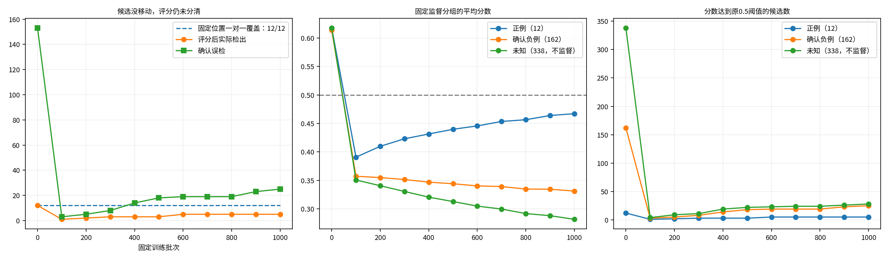

### 能下什么结论，停在哪里

有实际学习：负例平均分数下降，确认误检从153减到25；但正负仍重叠，7个正确候选未被保留，固定预算下没有学成合格评分器。这次排除了位置更新和分数重新选择监督对应，**没有证明冻结特征一定不可分，也没有证明几何基元无效**。

本轮为执行验证通过、评分拟合失败（GATE_MIXED / FIT_FAIL），不是Phase3研究通过。两阶段协议没有满足进入同协议对照的条件。按本次指令停止在固定候选评分问题；不自动扩联合训练、模型搜索、分支或建图。当前无活跃训练。

本次训练与11次评价共57.18秒，主机峰值约2.20GiB、GPU保留峰值约0.131GiB；冻结特征缓存加速不代表后续端到端训练同样快。原始检查点、所有候选分数、逐样本初末XY/XZ图及未知掩码全部保留。

- [精确数据卡](../configs/v3/gate3/data_cards/gse_fixed_candidate_scoring_v1.json)、[冻结运行规格](../configs/v3/gate3/gse_fixed_candidate_scoring_v1.json)、[原始结果](../results/gate3_semantics/gate3_20260910_gse_fixed_candidate_scoring_v1_seed0/metrics/summary.json)。
- [最终全部候选分数与固定掩码](../results/gate3_semantics/gate3_20260910_gse_fixed_candidate_scoring_v1_seed0/metrics/candidate_scores_1000.json)、[冻结证明](../results/gate3_semantics/gate3_20260910_gse_fixed_candidate_scoring_v1_seed0/metrics/frozen_check_1000.json)、[逐样本预览](../results/gate3_semantics/gate3_20260910_gse_fixed_candidate_scoring_v1_seed0/previews)。
- [11次曲线及独立核验](figures/gse_graph/fixed_candidate_scoring_20260910.json)。新run全部328文件SHA及文件集合核验通过，seal为`300b8ca66a275c40b40850f557b76ca709741f2ea324f0fe107d15f98a30af70`。旧run未改写。

## 15. 不继续堆训练步数：检查原评分头到底能不能分开标签

### 本次问题与答案

之前的失败是“1000批没有学会”，并不等于“这些固定特征不存在一个能分开的线性头”。这次保持第14节的16观察、512候选位置、128维特征及固定监督，只检查这个区别。没有骨干前向、位置回归、A/B重训、新网络或建图。

| 要区分的问题 | 本次证据 | 结论 |
|---|---|---|
| 数值方法有没有给出可分性判定？ | 线性规划找到分离头；用原二进制浮点特征对应的精确有理数逐项验证，174个有符号余量都大于0 | 已判定，不是求解器含糊返回 |
| 固定已知标签是否不能完全分开？ | 12正例、162确认负例全部存在严格分离解；最小证书余量约1.00 | 不是标签不可分；仅针对这些已存特征 |
| 同一损失是否还没有充分优化？ | 一次全批求解，32迭代、33次目标计算；float64损失2.30×10⁻⁹，原参数梯度最大1.67×10⁻⁹ | 达到预登记数值容差；不是再跑1000批 |
| 标签通过后，完整检测是否仍失败？ | 原float32头174/174标签正确；原1米评价12正确、0误检、0漏检 | 1米主合同通过；4米敏感性仍有4个误检，见下表 |
| 这是不是稳定可部署的头？ | 很大的权重导致float32累加误差，一个正例分数恰好0（概率0.5）；152个未知预测仍被选中 | **不能这样声称**，本次只完成可分性与数值拟合诊断 |

未知338个从未进入线性规划约束或负例损失。身份、地图编号也不进入头；前向仍只有同一128维特征乘权重、加偏置。

### 原损失及等价权重是怎么核对的

原代码不是174个候选直接平均。对每个观察，先分别计算正例的`softplus(-分数)`均值和确认负例的`softplus(分数)`均值；两组都存在时再各占一半，只有一组就用该组。未知不计算损失。训练循环每批4观察，各除以4。

读取原1000批排程后，16观察各出现250次。因此等价全批目标是**16个原观察损失的平均**，没有换成候选均匀平均。两组都有的观察，每个正例权重为`1/(32×该观察正例数)`，每个负例权重为`1/(32×该观察负例数)`；只有负例的观察改为`1/(16×负例数)`。所有候选权重和为1，未知权重和为0，正则仍为0。

用原`restore_presence`函数及自动微分核对：损失值差为0，129维梯度最大差2.78×10⁻¹⁷。这里核对的是静态目标和梯度等价，不声称全批求解会复现Adam的更新轨迹。

### 数值方法没有增加模型容量

第一步用线性规划寻找让所有正例分数大于0、所有确认负例小于0的同一仿射函数，并验证分离证据；不拿该证书替代随后求解的初始化。

第二步从第14节最终评分头出发，仅调用一次L-BFGS-B，优化上述原加权损失。使用全129维可逆的数值预条件以缓解病态矩阵，不删除奇异方向、不增加特征、不增加正则；求得结果映射回原128权重加1偏置。共享和位置参数逐项核对不变。

损失从0.551274降到2.30493×10⁻⁹。条件坐标梯度最大7.23×10⁻¹¹，原坐标梯度最大1.67×10⁻⁹，两种坐标计算目标差2.75×10⁻¹⁷。由于已证明严格可分，未正则化逻辑损失的下确界是0，但不一定存在有限权重的最小点；本次距该下确界约2.30×10⁻⁹，**不是宣称找到了唯一有限最优权重**。

### 标签拟合与原检测回放分开报告

原始全512候选的逐点评分覆盖掩码可复用：位置没变，覆盖不依赖其他候选或分数。调用原`center_score`和原sigmoid≥0.5筛选，在运行前先精确复现父运行初、末两次的16观察×四尺度评价，确认匹配、误检和未知规则一致；没有重读整图生成新教师。

| 输出形式 | 12正例选中 | 162确认负例选中 | 174已知标签正确 | 338未知选中 |
|---|---:|---:|---:|---:|
| 求解所得float64分数 | 12 | 0 | 174 | 151 |
| 还原原float32线性头，CPU计算 | 12 | 0 | 174 | 152 |

| 原评价匹配距离 | 正确 | 确认误检 | 漏检 | 未知预测 | 精确率 | 召回率 |
|---|---:|---:|---:|---:|---:|---:|
| 0.5米 | 11 | 1 | 1 | 152 | 91.67% | 91.67% |
| **1米（原主合同）** | **12** | **0** | **0** | **152** | **100%** | **100%** |
| 2米 | 12 | 0 | 0 | 152 | 100% | 100% |
| 4米 | 12 | 4 | 0 | 148 | 75% | 100% |

4米时除了匹配距离变大，原评价器的“确认结构附近可评分区域”也随之扩大，原本忽略的4项被计入误检。因此不能称所有尺度检测都通过，更不能将174训练标签全对当作所有查询都有完整正确标签。未知预测由第14节28个增至152个，未被算成误检，但它们并没有获得真实路口认证。

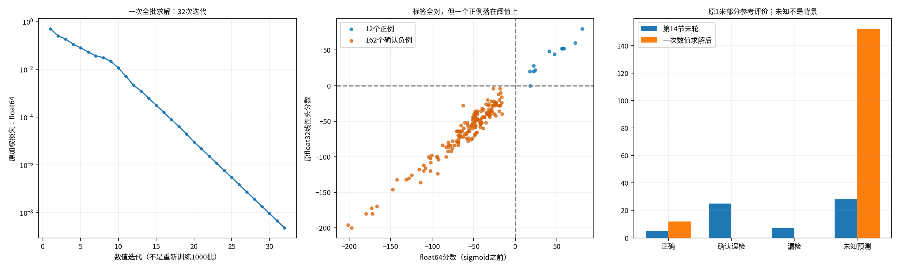

### 不能漏报的数值风险

最终权重向量长度约1.14×10⁸，最大单项约2.08×10⁷；设计矩阵条件比约2.24×10⁸。大数相加相消后，float32与float64的全查询分数最大差约35.05。float64下最小已知分类余量16.14，float32却有一个正例恰好为0。

具体是 **S06椭圆实现／序列72159／查询30**：位置距参考0.326米，float64分数17.892，原float32 CPU头分数0。按原`sigmoid>=0.5`它仍通过，规则没改；但它没有正的数值余量。原float32实际加权损失为0.02179，不能把float64的2.30×10⁻⁹写成原float32执行损失。仅把权重转换为float32、仍用float64累加时损失约2.92×10⁻⁸，说明主要误差出现在低精度累加环节。

这提示求解可能利用了非常细小、对舍入敏感的特征方向，**尚不能证明它学习了稳健结构线索**。本次没有扰动特征、换阈值、重求解、缩放头或验证其他计算内核。所报float32成绩限于此次CPU原线性层执行，不能外推成原GPU内核的稳定成绩。

### 完整16项结果（1米）

| 观察：地图／几何实现／序列 | 正确 | 确认误检 | 漏检 | 未知预测 |
|---|---:|---:|---:|---:|
| S06／圆角矩形／72154 | 1 | 0 | 0 | 13 |
| S02／圆角矩形／16694 | 1 | 0 | 0 | 18 |
| S08／圆角矩形／116881 | 0 | 0 | 0 | 20 |
| S03／圆角矩形／29352 | 0 | 0 | 0 | 0 |
| S06／椭圆／72152 | 1 | 0 | 0 | 15 |
| S03／圆角矩形／29343 | 1 | 0 | 0 | 3 |
| S08／椭圆／116895 | 1 | 0 | 0 | 16 |
| S08／椭圆／116861 | 1 | 0 | 0 | 0 |
| S10／椭圆／192651 | 1 | 0 | 0 | 3 |
| S03／圆角矩形／29342 | 1 | 0 | 0 | 4 |
| S02／混合截面／16703 | 1 | 0 | 0 | 12 |
| S10／圆角矩形／192653 | 1 | 0 | 0 | 14 |
| S10／椭圆／192652 | 0 | 0 | 0 | 2 |
| S06／圆角矩形／72155 | 0 | 0 | 0 | 9 |
| S06／圆角矩形／72157 | 1 | 0 | 0 | 11 |
| S06／椭圆／72159 | 1 | 0 | 0 | 12 |

### 决策与证据

执行器按冻结的标签／1米检测门槛记录局部`GATE_PASS`；综合浮点边界和未知输出风险，本任务状态记为`GATE_MIXED`：**已证明已存特征上存在可分解、原损失可数值拟合；尚未证明稳健可用的检测底座，更不证明几何方法或图优势。** 不推进正式对照、扩网络或建图。

一次初始等价检查因tuple/list容器比较失败，在任何线性规划和数值求解之前停止；保留13文件零求解记录。仅修复按JSON值比较并加回归，6项测试通过。随后有效run一次求解完成，CPU约0.67秒、主机峰值约0.572GiB，GPU0；这只是缓存上的小型线性数值问题，不代表完整网络可在该时间训练。

- [新精确数据卡](../configs/v3/gate3/data_cards/gse_fixed_score_numerics_v1r.json)、[冻结规格](../configs/v3/gate3/gse_fixed_score_numerics_v1r.json)、[原始结果](../results/gate3_semantics/gate3_20260910_gse_fixed_score_numerics_v1r_seed0/metrics/summary.json)。
- [线性分离证据](../results/gate3_semantics/gate3_20260910_gse_fixed_score_numerics_v1r_seed0/metrics/separability.json)、[损失与权重等价](../results/gate3_semantics/gate3_20260910_gse_fixed_score_numerics_v1r_seed0/metrics/loss_equivalence.json)、[一次求解全部迭代及残差](../results/gate3_semantics/gate3_20260910_gse_fixed_score_numerics_v1r_seed0/metrics/optimization.json)。
- [原评价器全部输出](../results/gate3_semantics/gate3_20260910_gse_fixed_score_numerics_v1r_seed0/metrics/evaluation_solved.json)、[原模型仅替换评分头的检查点](../results/gate3_semantics/gate3_20260910_gse_fixed_score_numerics_v1r_seed0/checkpoints/solved_head_model.pt)、[精度分析和16项明细](figures/gse_graph/fixed_score_numerics_20260910.json)。
- 新结果36文件、父结果328文件、零求解失败13文件均独立验证SHA和精确文件集合。有效run seal：`e027aa9f0500ea5b0b008794d9a883db63edde885cdd6c1eacad524e5afe47f0`。旧结果和图片未覆盖。

## 16. 三档L2：数值稳定下来了，检测仍没有通过

### 本次只做了哪件事

第15节的可分性及无正则目标诊断已结案，本轮没有重复。复用已冻结的512个128维候选特征、174个已知标签及已验证的观察级等价权重；原16观察、5个父地图、5个独立结构、68个去重源帧不变。未知338个权重仍为0。

运行前固定三档正则强度 **0.01、0.0001、0.000001**。目标是在原加权损失上增加`λ/2 × 原128个权重的平方和`，偏置不惩罚。每档从同一个第14节最终头开始，全批求解一次，不用上一档结果初始化下一档，不改阈值，不增加参数。第15节约一亿长度的头没有用作本轮初始化。

预登记通过条件包括：174已知标签全对；旧1米及固定区域1米的精确率、召回率均至少0.90；优化梯度达到容差；float64、float32 CPU、float32 CUDA和完整前向分类一致且已知候选离阈值有数值余量。若有多档通过，选正则最强者；实际没有任何一档通过。即使不要求174标签全对，三档的旧精确率也都远低于0.90，因此失败不是新增严格条件造成的。

### 完整冻结前向不是只算缓存的分数

本轮重新读取同16个实际观测，运行原PRIMITIVE点特征、结构读出、查询和位置路径；全部参数冻结，只有求得的原存在性行替换。GPU仅用于无梯度推理，没有骨干训练。

每档16次完整前向，共48次，均确认：

- 全512个候选特征、预测位置、查询索引和查询位置与父运行逐元素位级一致。
- CUDA缓存头分数与完整前向分数位级一致，其他参数完全不变。
- float64、CPU float32、CUDA float32和完整前向在原`sigmoid>=0.5`规则下，全部512个选中结果一致。
- 传入完整前向的对象只有学生观测表示，没有教师标签或真实结构身份字段。预测文件保留全部512候选，不用GT掩码过滤推理输出。

实际原`score_prediction`的结果也与复用固定覆盖信息的旧评价回放逐项一致。这里的“稳定”仅指本次冻结输入上的计算一致性，不等于对新观测、噪声或新结构稳健。

| L2强度 | 数值迭代 | 原权重长度 | 原坐标梯度最大值 | 最大float64／float32分数差 | 最小已知绝对分数 | 数值及完整前向检查 |
|---|---:|---:|---:|---:|---:|---|
| 0.01 | 7 | 2.56 | 6.96×10⁻¹⁰ | 0.00000247 | 0.00992 | 通过 |
| 0.0001 | 30 | 29.50 | 1.80×10⁻⁹ | 0.0000297 | 0.00840 | 通过 |
| 0.000001 | 290 | 256.44 | 2.52×10⁻⁹ | 0.000118 | 0.00555 | 通过 |

注意“绝对分数有余量”不代表分类正确：一个错误负例也可能被稳定地打成高分。真实标签成绩如下。

### 标签与原完整检测分别报告

| L2强度 | 已知标签正确／174 | 正例选中／12 | 确认负例选中／162 | 监督未知选中／338 |
|---|---:|---:|---:|---:|
| 0.01 | 154 | 3 | 11 | 19 |
| 0.0001 | 139 | 11 | 34 | 27 |
| 0.000001 | 157 | 12 | 17 | 16 |

| 原1米评价 | 正确 | 确认误检 | 漏检 | 未知预测 | 精确率 | 召回率 |
|---|---:|---:|---:|---:|---:|---:|
| L2=0.01 | 3 | 11 | 9 | 19 | 21.43% | 25.00% |
| L2=0.0001 | 11 | 34 | 1 | 27 | 24.44% | 91.67% |
| L2=0.000001 | 12 | 17 | 0 | 16 | 41.38% | 100% |

三档都完成了求解，不存在“还要等它训练完”的情况。最弱正则把12个已知路口全部找回，但也稳定地选中了17个确认负例，不能用高召回掩盖误检。三档的未知输出都单列，没有转成负例。

### 新增诊断：评分区域固定，只改匹配距离

旧评价按匹配距离同时计算确认结构附近的可评分区域，区域也会随距离变化。旧结果完整保留，不能用新的表覆盖它。

新增表提前锁定**父运行原4米评价的逐候选可评分掩码和未知竞争者掩码**，四种匹配距离都用同一份；三档模型也共用同一份。只在独立评分时使用，推理仍保留全部候选并按原分数选中。未知不填背景，不用真实区域预删输出，也不因结果调整评分范围。

| L2强度 | 仅变化的匹配距离 | 正确 | 确认误检 | 漏检 | 未知预测 | 精确率 | 召回率 |
|---|---:|---:|---:|---:|---:|---:|---:|
| 0.01 | 0.5米 | 2 | 16 | 10 | 15 | 11.11% | 16.67% |
| 0.01 | 1米 | 3 | 15 | 9 | 15 | 16.67% | 25.00% |
| 0.01 | 2米 | 3 | 15 | 9 | 15 | 16.67% | 25.00% |
| 0.01 | 4米 | 4 | 14 | 8 | 15 | 22.22% | 33.33% |
| 0.0001 | 0.5米 | 10 | 45 | 2 | 17 | 18.18% | 83.33% |
| 0.0001 | 1米 | 11 | 44 | 1 | 17 | 20.00% | 91.67% |
| 0.0001 | 2米 | 11 | 44 | 1 | 17 | 20.00% | 91.67% |
| 0.0001 | 4米 | 12 | 43 | 0 | 17 | 21.82% | 100% |
| 0.000001 | 0.5米 | 11 | 20 | 1 | 14 | 35.48% | 91.67% |
| 0.000001 | 1米 | 12 | 19 | 0 | 14 | 38.71% | 100% |
| 0.000001 | 2米 | 12 | 19 | 0 | 14 | 38.71% | 100% |
| 0.000001 | 4米 | 12 | 19 | 0 | 14 | 38.71% | 100% |

每一档的选中输出总数不随匹配距离改变，未知数量也不再随评分范围变化。这张表说明：即使把“区域变化”从比较中拿掉，误检问题仍然存在。监督未知与新评分未知口径不同，不能将两者数量强行对齐；本轮未修改任何监督标签。

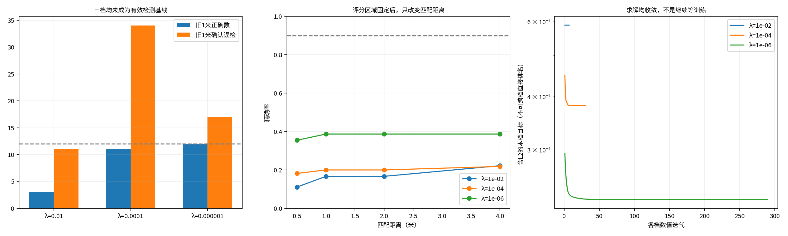

### 停止结论，不再追加救援实验

这次排除了本轮的“求解没有结束”“float32舍入翻转”“缓存不等于完整前向”三项问题，但仍没有得到符合门槛的检测头。第15节只证明这些已存特征可以被无正则线性解分开，本轮进一步说明：**这三档限制权重的解虽然数值稳定，仍没有实现足够好的检测。** 不能把前者包装成一个可靠开发基线。

本轮`GATE_FAIL`，停止继续抢救这一固定特征评分实现。不补第四档、不改阈值、不联合解冻、不搜新网络。未冻结开发基线，因此“通过后转向独立结构留出”的条件没有触发；本轮没有读取或选择新的留出数据。这个停止范围不等于证明全部几何基元路线不可能。

原结果、全部三档权重及48项预测保留，可用于失败分析。本次3项新回归测试通过，正式运行一次，三次数值求解；总耗时19.95秒，主机峰值约1.44GiB、GPU保留峰值96MiB。当前无活跃训练或求解。

- [本轮精确数据卡](../configs/v3/gate3/data_cards/gse_fixed_score_l2_v1.json)、[预冻结三档规格与通过条件](../configs/v3/gate3/gse_fixed_score_l2_v1.json)、[原始结论及三档统计](../results/gate3_semantics/gate3_20260910_gse_fixed_score_l2_v1_seed0/metrics/summary.json)。
- [全批求解与完整前向执行代码](../tools/v3/fixed_score_l2_v1.py)、[L2目标与数值稳定性代码](../src/mtare_topo/representation/fixed_score_l2_v1.py)、[新增测试](../tests/v3/unit/test_fixed_score_l2_v1.py)。
- [完整新旧四尺度表及阈值一致性核验](figures/gse_graph/fixed_score_l2_20260910.json)、[三档原始指标与48项前向检查](../results/gate3_semantics/gate3_20260910_gse_fixed_score_l2_v1_seed0/metrics)、[三档模型检查点](../results/gate3_semantics/gate3_20260910_gse_fixed_score_l2_v1_seed0/checkpoints)。
- 新run81文件精确集合及SHA核验通过，seal：`ecd39f940a8f0eff19c5bc7563b27dfb7b4154a75fa37826a92ca945556b9b27`；没有覆盖旧run和论文图片。

## 17. 候选中心几何验证器：一次有界验证已完成，未通过

### 17.1 这次实际改了什么

原位置生成器完全冻结，仍是同16个观察、5个父地图／物理结构、68个唯一源帧、512个候选。没有重训位置，也没有把真实中心送进前向。新模块的任务不是生成新路口，而是重新判断每个既有候选中心是否可信。

输入取自旧检测器adapter实际输出的观测块memory（每块128维，已经包含机器人坐标信息），不是旧最终查询特征或旧存在性分数。同时输入候选到块中心的相对XYZ、块范围、退化标志。无仿射LayerNorm后，逐块135→64→64 GELU；有效块均值和最大值拼接后128→64→1，共21,185参数。无教师候选筛选。未知不参与负例损失。

8项新单元测试通过。只运行一次seed0、1000次更新，每次覆盖全部16观察，共16,000次曝光；这不同于旧训练的4,000次曝光，因此不是等预算单因素几何消融。AdamW学习率从0.001余弦降至0.00001，权重衰减0.0001、偏置不衰减、梯度裁剪1。只评价预定初始和每100步检查点，最终判断用第1000步，不选最好轮次。

### 17.2 标签变化合法，但不是原174个标签任务

| 标签 | 旧评分任务 | 新位置有效性任务 |
|---|---:|---:|
| 正例 | 12 | 12 |
| 确认负例 | 162 | 132 |
| 未知 | 338 | 368 |

30个旧负例只有“不是负责查询／重复候选”的依据，没有独立位置负例证据，全部转为未知。没有把它们强行变成背景；原来源绑定的4米负例规则不变。12个1米内合法正例保持正例；没有冲突，两类均非空，满足本次训练前置条件。512项旧新标签、原因及来源保存在[标签清单](../results/gate3_semantics/gate3_20260910_gse_candidate_center_verifier_v1_seed0/metrics/validity_inventory.json)。

### 17.3 统一比较：新模块没有改善完整检测

以下全部采用原位置、0.5分数阈值；去重是按分数、XYZ、原槽排序的2米三维贪心抑制，不用GT、不是传递聚类。两种评价均以1米做匹配；“固定区域”固定原4米覆盖区域，而不是将匹配距离改为4米。数字为“正确／误检／漏检／未知预测”。

| 方法 | 旧评价去重前 | 旧评价去重后 | 固定区域去重前 | 固定区域去重后 |
|---|---|---|---|---|
| 旧L2=0.01（零训练复用） | 3/11/9/19 | 3/10/9/18 | 3/15/9/15 | 3/14/9/14 |
| 旧L2=0.0001（零训练复用） | 11/34/1/27 | 11/34/1/26 | 11/44/1/17 | 11/44/1/16 |
| 旧L2=0.000001（零训练复用） | 12/17/0/16 | 12/17/0/14 | 12/19/0/14 | 12/19/0/12 |
| 新验证器第1000步 | 12/24/0/14 | 12/24/0/14 | 12/31/0/7 | 12/31/0/7 |

新验证器最终50个输出，去重删掉0个。旧评价精确率33.33%、召回率100%；固定区域精确率27.91%、召回率100%，均未达到两者各90%的条件。它找回了全部12个参考，但误检比表中旧最弱L2更多，不能宣称改进。旧三档加同样去重也都未通过。

完整[统一CSV](../results/gate3_semantics/gate3_20260910_gse_candidate_center_verifier_v1_seed0/metrics/unified_results.csv)包含全部11次评价及去重前后；[原始训练日志](../results/gate3_semantics/gate3_20260910_gse_candidate_center_verifier_v1_seed0/logs/updates.jsonl)保存全部1000次实际更新。

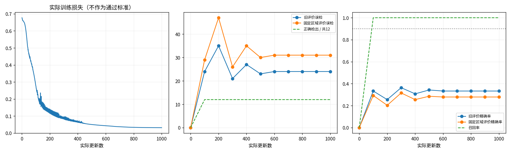

### 17.4 失败具体发生在哪里

位置没有丢失：最终12个参考均匹配成功，没有正确中心被去重错删。评分仍有两类问题，不能混为一种：

- 明确监督的132个位置负例中，129个压到阈值以下，3个仍被错误选中；12个正例全部选中。已知标签本身尚未全部拟合。
- 368个训练未知中，35个被选中。旧评价把其中21个判为误检，14个保留未知；固定区域评价把28个判为误检，7个保留未知。训练未知不等于评价一定忽略：两者的用途、覆盖与唯一匹配规则不同。
- 旧评价24个误检=3个确认负例+21个从旧重复负例转来的训练未知。固定区域31个误检=前述24个+7个原本就是训练未知的候选。这里“旧重复负例”是旧监督来源名称，不代表当前几何上处于2米去重范围；最终去重没有删除这些点。

因此本次证据支持“新评分没有可靠排除额外中心，且训练未知与严格检测间仍有差距”，不支持“只加去重就能解决”，也不能由此证明几何基元思想无效。不能把这21个未知直接改回背景来追分。本轮没有做这种修改。

每个误检的原槽、坐标、最近参考距离、分数、旧新标签、具体原因以及16项统计见[逐项错误文件](figures/gse_graph/candidate_center_verifier_20260910/error_analysis.json)。所有图按冻结身份顺序展示，未只选成功例；图上的叉是预测中心，不是已经建立的拓扑节点。颜色按旧评价：绿=正确匹配，红=误检，橙=无法确认；黑菱形为参考。每图均有相同范围的XY/XZ视图及旧新去重前后结果。

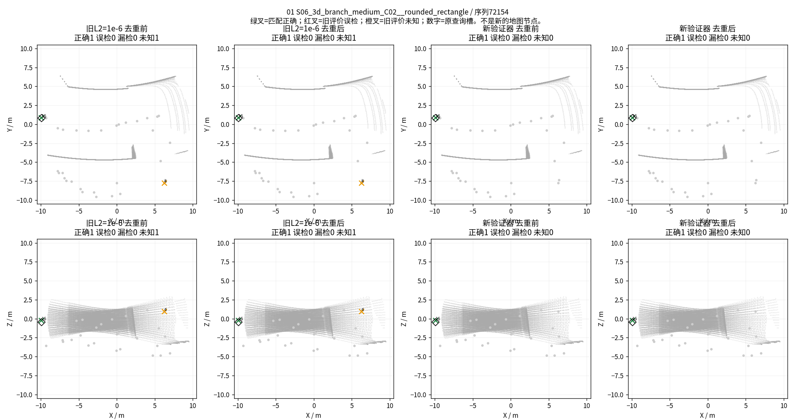

全部16项：[01](figures/gse_graph/candidate_center_verifier_20260910/case_01.png)、[02](figures/gse_graph/candidate_center_verifier_20260910/case_02.png)、[03](figures/gse_graph/candidate_center_verifier_20260910/case_03.png)、[04](figures/gse_graph/candidate_center_verifier_20260910/case_04.png)、[05](figures/gse_graph/candidate_center_verifier_20260910/case_05.png)、[06](figures/gse_graph/candidate_center_verifier_20260910/case_06.png)、[07](figures/gse_graph/candidate_center_verifier_20260910/case_07.png)、[08](figures/gse_graph/candidate_center_verifier_20260910/case_08.png)、[09](figures/gse_graph/candidate_center_verifier_20260910/case_09.png)、[10](figures/gse_graph/candidate_center_verifier_20260910/case_10.png)、[11](figures/gse_graph/candidate_center_verifier_20260910/case_11.png)、[12](figures/gse_graph/candidate_center_verifier_20260910/case_12.png)、[13](figures/gse_graph/candidate_center_verifier_20260910/case_13.png)、[14](figures/gse_graph/candidate_center_verifier_20260910/case_14.png)、[15](figures/gse_graph/candidate_center_verifier_20260910/case_15.png)、[16](figures/gse_graph/candidate_center_verifier_20260910/case_16.png)。

### 17.5 执行可信性与结案范围

512个坐标、父模型全部参数保持不变，父模型无梯度；缓存与完整冻结前向一致。float32 CPU/CUDA最大logit差约1.00e-5，已知候选最小绝对logit约0.231，所有阈值选择及去重集合一致，执行检查通过。不能用软件通过抵消检测失败。

唯一运行正常结束，用时37.92秒，主机峰值约1.90GiB、GPU保留峰值130MiB；不是仍在后台训练。267个run文件及精确集合SHA核验通过，seal为`20fa4ccd4256b8f21376b7cb6baf227a91cb21b0943ed997ec48a678cc846eff`。预览由封存预测只读派生，另放文档目录，不改run封存；[派生图片与分析哈希](figures/gse_graph/candidate_center_verifier_20260910/sha256.json)独立保存。

本轮结论为`GATE_FAIL`，只针对这个验证器配置。保留全部代码、权重、标签变更和失败图，但不冻结为通过的开发基线，不生成通过后才允许的留出训练，不追加评分训练、位置训练、分支、建图或新模型搜索。研究仍缺少有效检测底座、独立结构留出表现、同后端建图增益及探索收益，不能用这16个样本宣布几何贡献成立或整个方向不可行。

复现入口：[执行规格](../configs/v3/gate3/gse_candidate_center_verifier_v1.json)、[数据卡](../configs/v3/gate3/data_cards/gse_candidate_center_verifier_v1.json)、[实际模块](../src/mtare_topo/representation/candidate_center_verifier_v1.py)、[测试](../tests/v3/unit/test_candidate_center_verifier_v1.py)、[训练执行器](../tools/v3/candidate_center_verifier_v1.py)、[原始结论](../results/gate3_semantics/gate3_20260910_gse_candidate_center_verifier_v1_seed0/metrics/summary.json)。

## 18. 位置监督与检测评价的证据对照（不训练）

第17节保留原历史失败结论。本节只连接已经保存的标签、来源绑定、逐候选覆盖掩码和最终匹配记录，没有重新运行定位、浮点检查、模型前向或训练，没有修改4米规则、1米评价或2米去重。

### 18.1 现在用什么方法，做到哪里

论文想验证的是“几何组织帮助理解地下结构，继而改善拓扑图”。当前实际做到的是其中更小的一步：五帧点云经过已有编码和PRIMITIVE几何分块，位置网络提出路口中心候选；冻结这些位置后，小网络根据每个候选周围的观测块特征、块范围和相对坐标给候选评分。超过0.5的候选再经过2米三维去重，形成中心检测集合。

这不是完整结构语义图谱：本轮不预测完整通道连接、不执行探索，也没有证明几何关系比相同后端的直接点云方法更好。位置网络在16个训练观察上已有覆盖全部12个参考中心的能力，但评分和完整集合检测没有通过小样本拟合验收，更没有独立泛化成绩。

这里有三种不同问题：位置是否落在合法参考中心1米内，是位置有效性；多个合格位置是否重复代表同一参考，是集合选择；所在位置与参考是否有足够观测支持，是证据覆盖。不能把三者用“误检”或旧代码的“duplicate”名称一概代替。

### 18.2 全512项对照结果

| 独立证据身份 | 候选数 | 本次训练身份 | 最终旧评价误检 | 最终固定区域误检 |
|---|---:|---|---:|---:|
| 已确认合格位置 | 12 | 正例 | 0 | 0 |
| 有位置观测，且满足原4米参考排除规则 | 132 | 负例 | 3 | 3 |
| 有位置观测，1米参考排除成立，但4米排除不成立 | 32 | 未知 | 21 | 21 |
| 查询所在位置没有观测状态支持 | 336 | 未知 | 0 | 7 |

每个候选均记录位置监督身份及依据、旧评价身份及依据、固定区域评价身份及依据、来源绑定与目标记录指纹。未被分数选中的候选标为“未输出”，不能擅自计作误检或正确拒绝；其可评分条件仍完整列出。所有512个候选都应用相同规则，不只检查31个误检。

完整[512项CSV](figures/gse_graph/position_supervision_evidence_20260910/candidates512.csv)、[含逐项依据JSON](figures/gse_graph/position_supervision_evidence_20260910/candidates512.json)、[汇总结论](figures/gse_graph/position_supervision_evidence_20260910/summary.json)。输入只使用原16观察的封存记录，按封存索引逐个验证实际读取文件，无保护世界读取。

### 18.3 本轮要求的三个结论

**一、哪些评价错误已有合法训练证据却未使用？**

按当前明确保留的4米位置负例规则，数量为0。全部132个合法负例已经用于训练；最终3个错误来自已使用的负例仍打高分，不是监督漏接。

但存在另一种“已有证据未转成训练标签”的情况：32个未知候选具有来源绑定的1米参考排除证据，最终21个成为误检。它们不是位置合格后的集合冗余；在1米参考定义下，位置已经不合格。但这一证据来自原评价器以1米调用排除函数，训练负例则明确保留4米参数。自动把这32个改负例，实质上会把训练参考排除的允许范围从4米扩展到1米，不能假装只是修复遗漏。本轮记录证据而不作该变更。这是监督合同与检测目标的间隙，不是已经证明模型原理不行。

**二、哪些属于集合选择而非位置有效性？**

本次最终误检中，确认属于“位置在1米内合法、但一对一匹配被另一个合法候选占用”的数量为0。12个正例全部匹配，没有合格位置因集合唯一性成为误检。旧名称中的30个“重复负例”不能直接作为集合冗余结论；其中最终21个错误具有1米位置排除依据。第17节的“旧重复来源”统计仍然正确，但它只能说明标签来源，不能说明失败机制。

**三、哪些确实缺少证据？**

336个未知的原始查询状态均为0，原因均为`UNOBSERVED_LOCATION`。所有16观察均已有绑定、完整的构造参考清单；这里并不是遗失整张地图的节点清单，也不能说336个位置都没有参考。真正欠缺的是当前五帧对候选位置的局部观测支持，无法按原规则给出有观测依据的负例。

其中7个最终输出被固定区域评价计错：它们落在确认结构的4米覆盖范围内，但不是1米合格中心，且查询位置没有观测状态。这个“结构邻域可评分”的评价资格不是“该位置有观测依据、可作为背景训练”的证明。7项为序列72152槽27、116895槽12/30、192653槽14/29、72157槽7/20；不能仅凭它们是FP就补负标签。

### 18.4 能否用当前记录补成完整位置监督

不能在不改变原规则的前提下补完整。32项属于证据与合同范围的差异，336项缺少局部观测支持；现有数据只能确认12正、132负，368仍未知。这个比例不能证明整个原定局部区域已经完整，更不能代表所有可能物理结构事件都已标全。构造清单的完整性只针对预定degree1/degree≥3参考集合。

已输出独立[位置标签复核版本v1r](figures/gse_graph/position_supervision_evidence_20260910/candidate_validity_v1r_evidence_only.json)，规则统一应用于512项，确认标签与v1相同，变更数0；不是训练授权，也不修改旧文件。

最小补证范围见[逐项清单](figures/gse_graph/position_supervision_evidence_20260910/minimal_evidence_scope.json)：32项无需重新收集全参考清单，问题在训练语义是否另行定义；336项只需围绕列出的候选坐标检查五帧的局部观测／可见性及参考排除支持，不需扩大父地图或全世界重标。本轮未执行补标；如果现有五帧确实看不到，复核也不能凭空补证，必须保留未知。7项只是最终固定区域错误的索引，不作为只修失败样本的标注人口。

本次是证据对照完成、监督仍不完整，记为`GATE_MIXED`，不覆盖第17节的`GATE_FAIL`，不推进Phase3。下一次1000步训练、评分头替换、去重扩张、分支和真实建图均未启动。全部派生文件及读取文件哈希在[manifest](figures/gse_graph/position_supervision_evidence_20260910/manifest.json)。

## 19. 新定位质量监督：接口通过，唯一同模型验证有改善但仍失败

完整材料：[统一48行成绩CSV](figures/gse_graph/localization_quality_20260910/unified_results.csv)、[派生图与数据哈希](figures/gse_graph/localization_quality_20260910/sha256.json)。

### 19.1 实施范围和真实变化

本节执行用户明确批准的新计划，不覆盖第17、18节。仍用原16个观察、5个父地图／物理结构、68个唯一源帧、512个候选，复用同一观测特征缓存、21,185参数验证器和第17节原始step0。原4米背景规则、1米评价、0.5阈值、2米三维去重全部不变。训练只变定位质量监督，没有重编码点云、重新拟合位置或更换评分头。

新标签从原目标记录的位置、观测格状态、完整参考排除与未确认参考竞争证据构造，不读取模型分数、FP列表或查询负责身份。原始记录的来源、帧索引、目标哈希和10米域均核实；确认结构上下文由锚点坐标独立计算，再与封存来源证据核对，而不是复制检测评分掩码。

| 标签变化 | 数量 | 依据 |
|---|---:|---|
| 正例保持正例 | 12 | 1米内确认中心，无未知竞争 |
| 原负例保持负例 | 132 | 原来源绑定4米背景排除不变 |
| 未知转定位负例 | 31 | 有局部观测，完整参考清单排除1米匹配 |
| 未知转定位负例 | 17 | 确认结构4米上下文内定位不合格，无对应未知竞争 |
| 继续未知 | 320 | 新规则仍不足以确认 |

最终为12正、180负、320未知。新增48项作用于所有512候选，不只是此前31个误检。上下文负例的含义是“不是这个已观察结构的合格中心”，不是“这个空气位置被射线观测”或“这里不存在通道”。独立[新标签清单](../results/gate3_semantics/gate3_20260910_gse_localization_quality_audit_v1r2_seed0/metrics/label_inventory.json)完整保留每项新旧证据。

### 19.2 先通过零训练接口，再执行一次训练

16项新合成测试及8项既有相关测试通过，覆盖候选置换、忽略分数/FP掩码、合法重复中心、上下层/隐藏参考竞争、上下文支持、未知零损失/零直接梯度、来源与域边界。

零训练检查给合法正例高分、负例低分，并故意让全部未知比正例分数更高。原两种评价在去重前后均12正确、0误检、0漏检；未知没有过滤，去重前320个未知输出，去重后263个。**这是接口相容，不是模型预测，也不是整片空间已经标完整。** [理想分数完整输出](../results/gate3_semantics/gate3_20260910_gse_localization_quality_audit_v1r2_seed0/metrics/ideal_unknown_high.json)。

检查前发生两次脚本初始化退出，均0更新且未生成新标签：先是重复创建环境文件，后是把原float64目标与float32缓存错误地要求逐位相等。分别修正为独立sidecar文件、验证原坐标按缓存dtype的准确转换；16项转换一致，不改变坐标或距离阈值。两个失败目录和错误日志均保留。修正后的独立检查2.50秒完成并封存，不把软件退出算作研究假设失败。

随后通过新训练规格预检，只运行一次1000步，每步全部16观察，共16,000曝光。原始权重逐元素相同，旧新1000步学习率序列相同，全部更新和梯度范数有限；缓存特征及位置不变。AdamW、损失组均值、权重衰减及裁剪均沿用原设置。最终判断仅用第1000步，没有择优检查点。

### 19.3 完整检测结果

| 方法 | 正确 | 旧评价误检 | 旧评价精确率 | 固定区域误检 | 固定区域精确率 | 漏检 |
|---|---:|---:|---:|---:|---:|---:|
| 第17节原监督 | 12 | 24 | 33.33% | 31 | 27.91% | 0 |
| 本次定位质量监督 | 12 | 11 | 52.17% | 13 | 48.00% | 0 |

两次最终去重均未改变输出集合。新模型总输出28个，旧评价另有5个未知、固定区域另有3个未知。召回率均100%，但两种精确率都远低于90%，因此本轮`GATE_FAIL`。

新监督减少了误检，说明监督调整对这个固定小实验有实际作用；但不能宣称检测底座已合格，更不能由此宣称几何组织优于直接点云方法。当前没有独立开发成绩或图收益。

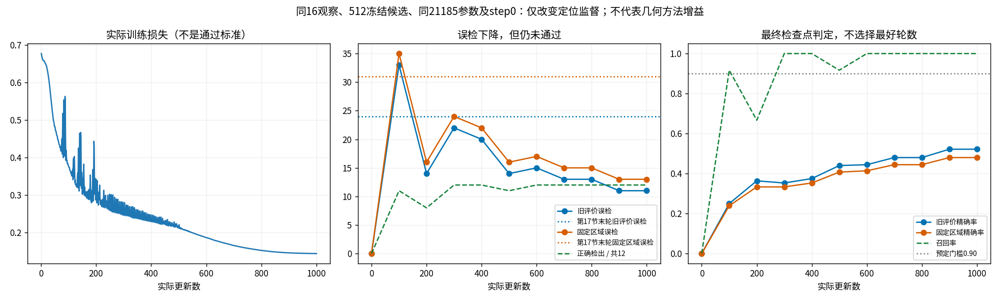

### 19.4 原3／21／7个错误分别怎么样了

| 原错误组 | 消失 | 仍存在 |
|---|---:|---:|
| 原3个有负例监督仍高分的位置 | 1 | 2 |
| 原21个直接观测支持的定位错误 | 13 | 8 |
| 原7个结构上下文区域错误 | 5 | 2 |

另外新增1个误检：S06 ellipse，序列72159，原查询槽22。最终固定区域13误检＝2个原负例错误＋8个原直接定位错误＋2个原上下文错误＋1个新增错误。逐槽新旧选中状态和分数见[完整错误跟踪](../results/gate3_semantics/gate3_20260910_gse_localization_quality_fit_v1_seed0/metrics/failure_followup.json)。

180个训练负例最终167个压低、13个仍高分；12个正例全部选中。剩下的固定区域误检都已有监督，所以现在不能再把完整失败归因于“这些点没有训练答案”。但这次实验也没有进一步区分特征表达、模型容量与优化哪个是唯一原因；不据此猜测根因、不自动增加实验。

### 19.5 图、复现材料与停止范围

图按固定身份顺序保存全部16观察，不只挑改善例；每项包含旧新去重前后XY/XZ。绿叉=匹配正确，红叉=旧评价误检，橙叉=旧评价未知，黑菱形=参考中心；不是拓扑节点输出。

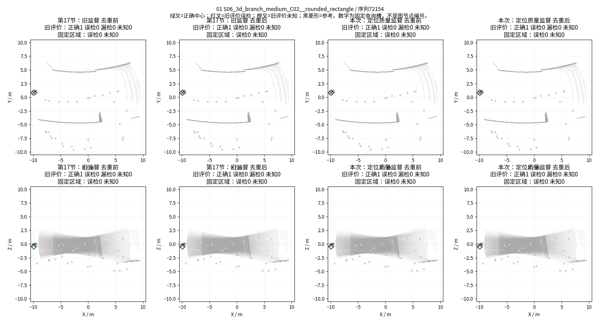

全部16项：[01](figures/gse_graph/localization_quality_20260910/case_01.png)、[02](figures/gse_graph/localization_quality_20260910/case_02.png)、[03](figures/gse_graph/localization_quality_20260910/case_03.png)、[04](figures/gse_graph/localization_quality_20260910/case_04.png)、[05](figures/gse_graph/localization_quality_20260910/case_05.png)、[06](figures/gse_graph/localization_quality_20260910/case_06.png)、[07](figures/gse_graph/localization_quality_20260910/case_07.png)、[08](figures/gse_graph/localization_quality_20260910/case_08.png)、[09](figures/gse_graph/localization_quality_20260910/case_09.png)、[10](figures/gse_graph/localization_quality_20260910/case_10.png)、[11](figures/gse_graph/localization_quality_20260910/case_11.png)、[12](figures/gse_graph/localization_quality_20260910/case_12.png)、[13](figures/gse_graph/localization_quality_20260910/case_13.png)、[14](figures/gse_graph/localization_quality_20260910/case_14.png)、[15](figures/gse_graph/localization_quality_20260910/case_15.png)、[16](figures/gse_graph/localization_quality_20260910/case_16.png)。

正式训练23.55秒，主机峰值约1.67GiB、GPU保留峰值70MiB。有效检查32文件与训练230文件SHA及精确集合核验通过；检查seal为`077903023a777baf3bdb5f386cb6892f6494c82edb599f8ae4b9e0d7061af3b4`，训练seal为`6c1fae1f14b488416189f36e92e69ad09ebf1eef855c8c78cef4536c4a7a9726`。两个初始化失败的12/13文件也已核验封存。派生图片单独保存，不追加到封存run。

复现入口：[零训练规格](../configs/v3/gate3/gse_localization_quality_audit_v1r2.json)、[训练规格](../configs/v3/gate3/gse_localization_quality_fit_v1.json)、[精确训练数据卡](../configs/v3/gate3/data_cards/gse_localization_quality_fit_v1.json)、[定位标签实现](../src/mtare_topo/representation/center_localization_quality_v1.py)、[执行器](../tools/v3/localization_quality_v1.py)、[最终原始结果](../results/gate3_semantics/gate3_20260910_gse_localization_quality_fit_v1_seed0/metrics/summary.json)。

按本轮失败分支，停止这个验证器配置；不续训、不追加种子、不换头、不扩大去重，不开展独立人口训练、分组对照或建图。保留新监督接口、全部权重、结果和图片作为可复用实现及失败证据，不冻结为合格检测基线，也不判整个几何基元路线NO-GO。

## 20. 最终检查点统一阈值PR分析：调阈值不能达到双90%

本节只复用第19节第1000步保存的512个候选位置与分数、原参考及评价资格，不加载模型、不生成权重、不选择中间检查点。第19节`GATE_FAIL`保持不变；不部署或冻结本节得到的训练集阈值。

扫描覆盖全部512个不同的原float32 sigmoid分数，另加入0、0.5和1，共515个阈值。采用原来的“分数≥阈值”；相邻不同分数之间输出集合不变，因此不是可能漏掉有效区间的粗网格搜索。每个阈值对16个观察共用，重新执行原分数/XYZ/槽排序、2米三维贪心去重和两套1米一对一评价。未知正常参与筛选和去重，只在评价中按原规则单列，没有GT过滤推理输出。

0.5的筛选槽、抑制记录、去重前后全部指标与第19节原记录精确复现。以下是去重后结果；表中两个阈值的去重前后结果恰好相同。

| 统一阈值 | 评价 | 正确检出 | 已知误检 | 漏检 | 未知输出 | 精确率 | 召回率 |
|---|---|---:|---:|---:|---:|---:|---:|
| 原0.5 | 旧评价 | 12 | 11 | 0 | 5 | 52.17% | 100% |
| 原0.5 | 固定区域 | 12 | 13 | 0 | 3 | 48.00% | 100% |
| 0.7949888110160828 | 旧评价 | 11 | **8** | 1 | 3 | 57.89% | 91.67% |
| 同上 | 固定区域 | 11 | **9** | 1 | 2 | 55.00% | 91.67% |

在“至少保留11个正确检测”的所有阈值中，旧评价最少8个已知误检，固定区域最少9个，而且这两个最小值可由表中的同一个阈值取得。该阈值是最终训练分数的事后描述，不是推荐部署参数；若有并列，本工具按正确数更多、再阈值更高选择展示代表。

**不存在同时满足两套精确率≥90%、召回率≥90%的统一阈值。** 总参考数12，召回达到90%必须至少保留11个正确检测，此时精确率达到90%至多允许1个误检；实际最少仍有8／9个。由此可排除“只需把0.5换个数就能让本次验收通过”的解释，但不能把这个训练集排序结果当作独立验证，也不能据此确定特征或优化的唯一根因。

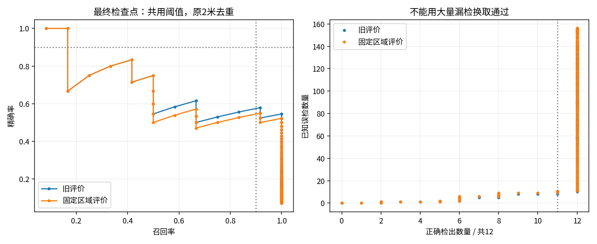

完整证据：[515档、两评价、去重前后的2060行CSV](figures/gse_graph/localization_quality_20260910/pr_final_all_thresholds.csv)、[汇总](figures/gse_graph/localization_quality_20260910/pr_final_summary.json)、[每阈值每观察的筛选、抑制及匹配记录](figures/gse_graph/localization_quality_20260910/pr_final_matching_records.json.gz)、[输入输出SHA](figures/gse_graph/localization_quality_20260910/pr_final_sha256.json)。派生脚本为[report_final_localization_pr.py](../tools/v3/report_final_localization_pr.py)，未新建实验run或改动原运行目录。扫描完成后收尾写哈希时出现缺少Path导入的脚本错误，修复后仅补写哈希，没有重复扫描或覆盖指标。

本次仅结案评分能力分析；维持原训练失败及停止状态，不续训、不改标签、不换头、不扩大去重、不进入建图。
