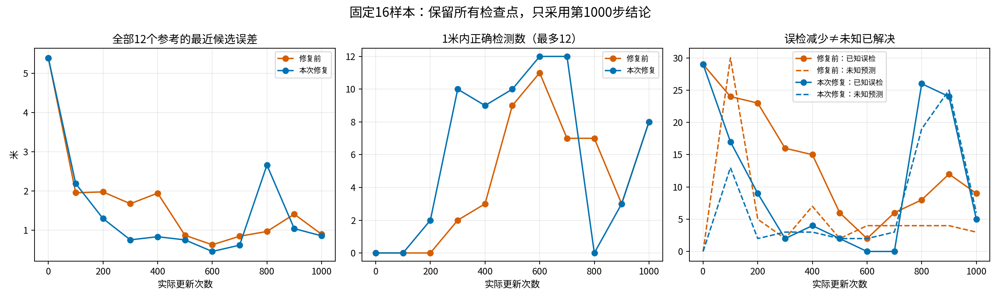
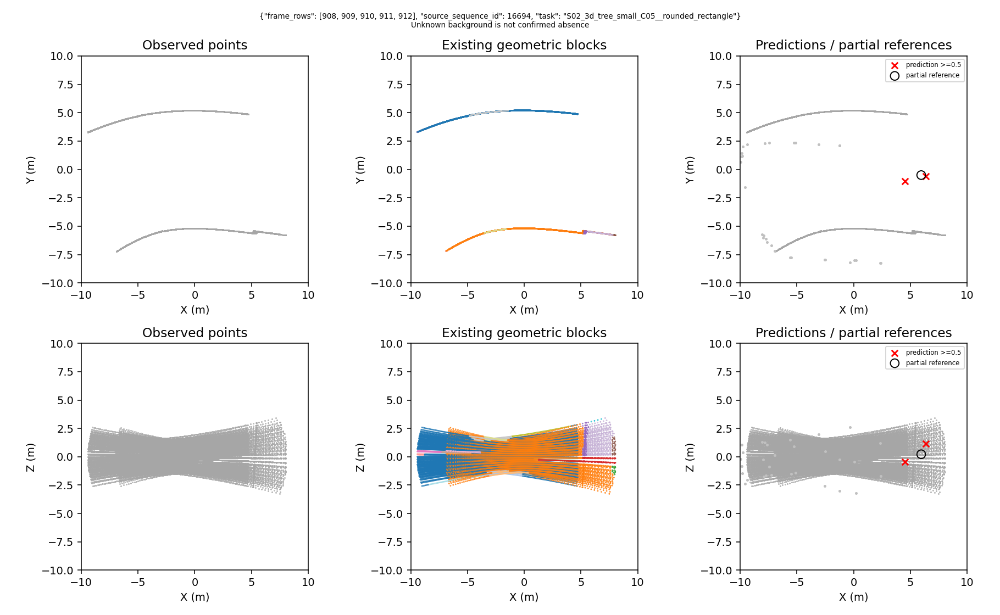

# 中心拟合监督复盘：先分清没定位准，还是根本没罚

## 本轮到底改了什么

仅修改已确认路口附近多余候选的存在性监督。**没有改4米背景半径，没有把未知区域标成背景，没有换模型、样本、匹配或评分。** 主对照、分支与真实建图仍暂停；这不是几何基元路线的NO-GO判断。

重跑沿用16个五帧观察、12个中心参考、5个父地图及5个独立路口；80次帧引用去重后68帧。同一个793992参数模型、seed0零位置残差初始化，权重与旧第0步逐元素一致。同一顺序、1000次更新、微批1累计4、学习率0.001、weight decay0。阈值仍0.5，主评分仍1米。没有选取最好轮数。

## 1. 旧4个漏检：是位置偏差，不是没选中

| 原样本 | 最近候选误差 | 存在概率 | 具体原因 |
|---|---:|---:|---|
| S02／圆角矩形／16694 | 2.055米 | 99.18% | 所有候选都在1米之外 |
| S08／椭圆／116861 | 1.012米 | 99.00% | 同上，刚超过固定门槛 |
| S10／圆角矩形／192653 | 1.081米 | 97.85% | 同上 |
| S06／圆角矩形／72157 | 1.235米 | 99.49% | 同上 |

四个最近候选也正是训练匹配得到的正例，并未被存在性筛掉。它们都有指向真值的非零回归梯度，梯度范数均约0.1；四者都没有触发球面投影。因此没有证据把它们解释成“梯度断了”或“提高召回阈值就能好”。本轮不凭猜测追加位置损失或更换匹配。

## 2. 旧5个额外误检：损失确实漏罚

旧损失会保护距任何构造参考4米以内的未匹配候选，包括已经确认的路口。因此下面五个高置信度多余预测没有存在性梯度：

| 原样本／查询槽位 | 距参考 | 概率 | 旧存在性梯度 | 定点修复后的梯度 |
|---|---:|---:|---:|---:|
| S02／16694／0 | 3.984米 | 99.15% | 0 | +0.04958 |
| S03／29343／0 | 1.578米 | 98.55% | 0 | +0.06159 |
| S10／192651／29 | 1.465米 | 97.29% | 0 | +0.04054 |
| S06／72157／10 | 2.195米 | 99.09% | 0 | +0.06193 |
| S06／72157／18 | 1.801米 | 99.20% | 0 | +0.06200 |

正梯度表示优化时会降低其存在分数。以上是**在同一旧预测上重算损失**的结果，不是新模型成绩。

五者均有实际射线观测，处于确认区域，4米内没有未确认参考竞争；不是把遮挡处的未知强行改负例。新增规则要求：4米内只有一个已确认且属于训练目标的实例、位置有观测、没有未知竞争者，且不是匹配正例，才能作为重复候选处罚。多个已知实例竞争、未确认结构附近、未观测位置仍保持未知。

这里“重复”是部分参考的监督约定，不是证明整张地图没有漏标。训练和评分仍只在各自有效域内成立。

## 3. 旧模型有没有真的学到位置

| 旧轮更新数 | 平均最近候选误差 | 平均匹配位置损失 | 平均存在性损失 | 1米正确／误检／漏检 |
|---|---:|---:|---:|---|
| 0 | 5.393米 | 0.56459 | 0.65775 | 0／29／12 |
| 100 | 1.955米 | 0.19857 | 0.09740 | 0／24／12 |
| 600 | 0.628米 | 0.06280 | 0.00331 | 11／2／1 |
| 1000 | 0.895米 | 0.08950 | 0.00525 | 8／9／4 |

位置损失按有参考的12个观察平均；存在性损失按全部16个观察平均。距离按12个参考计，不把32个候选当独立样本。

**有实际学习，但末轮定位波动、且很低的存在性损失掩盖了没被处罚的多余预测。** 第600步仅用于解释波动，没有用它替换最终权重。小样本拟合也不能证明泛化，更不能证明几何组合优于直接观测方法。

## 4. 软件与真实旧预测检查

31项软件回归通过，覆盖4米边界、未知零梯度、隐藏竞争者、多个已知参考、非训练参考、正匹配保护、位置梯度保持及存在性梯度有限差分。正式运行前再次执行6项新增监督测试。

逐SHA及精确文件集合核验旧263项封存证据；对旧0、100……1000步的全部16×32候选重建匹配、覆盖、损失和梯度。五个旧漏罚项全部恢复正确梯度；所有旧候选的位置梯度在修改前后保持一致。网络前向仍不读取教师；教师只用于损失和独立评分。

## 5. 本轮重跑结果

**已完成1000次更新，运行正常结束；固定预算拟合仍为FIT_FAIL。监督漏罚得到明确修复，但定位稳定性没有解决。**

| 第1000步 | 正确中心 | 已知误检 | 漏检 | 无法确认预测 | 已知域精确率／召回率 |
|---|---:|---:|---:|---:|---|
| 修复前 | 8 | 9 | 4 | 3 | 47.1%／66.7% |
| 本次修复 | 8 | 5 | 4 | 6 | 61.5%／66.7% |

F1由0.5517变为0.6400，但未知预测也增加，**不能把4个已知误检的减少全部当成正确拒绝，更不能当成几何基元的对照优势。** 精确率与召回率仍没有同时达到0.90。

### 原4个漏检逐项结局

| 原样本 | 旧→新最近距离 | 是否恢复 | 解释 |
|---|---|---|---|
| S02／16694 | 2.055→0.999536米 | 是，但贴近门槛 | 只有约0.46毫米余量，不称稳健恢复；同观察还有另一误检 |
| S08／116861 | 1.012→1.975米 | 否，变差 | 仍没有1米内候选；该选中预测如今位于未知评分区域，不能把它不计误检当改善 |
| S10／192653 | 1.081→0.422米 | 是 | 中心恢复，但同观察仍有一个高分未知预测 |
| S06／72157 | 1.235→0.714米 | 是 | 中心恢复，原两个多余预测被压下 |

同时新增3个原来检出的漏检，都是没有1米内候选：S06／椭圆／72152为1.498米，S08／椭圆／116895为1.047米，S06／椭圆／72159为1.077米。因此旧3项恢复不等于总漏检下降。

### 原5个漏罚项逐项结局

槽位只是计算槽，不是固定物理身份，所以同时检查同一观察是否出现替代误检。

| 原样本／槽位 | 新存在概率 | 新状态 | 是否可以说解决 |
|---|---:|---|---|
| S02／16694／0 | 98.71% | 距参考1.686米，仍为误检 | 否；现在梯度为+0.02468，已被罚，但还没压下 |
| S03／29343／0 | 95.23% | 距参考0.812米，成为正确检测 | 原槽问题消失，已知域无误检；但槽28仍有93.29%的未知预测，不能保证没有替代重复 |
| S10／192651／29 | 95.62% | 距参考0.267米，成为正确检测 | 原槽改善，但槽7替代成了已知误检，整体问题未解决 |
| S06／72157／10 | 0.058% | 未选中 | 是；同观察没有替代已知或未知预测 |
| S06／72157／18 | 0.040% | 未选中 | 是；同上 |

### 本轮剩余全部5个已知误检

| 样本／槽位 | 距参考 | 当前监督情况 |
|---|---:|---|
| S02／16694／0 | 1.686米 | 重复候选，已有负梯度 |
| S10／192651／7 | 2.751米 | 重复候选，已有负梯度 |
| S02／混合截面／16703／0 | 2.455米 | 新增重复候选，已有负梯度 |
| S08／116895／3 | 1.047米 | 训练匹配正例位置不准，仍有回归梯度 |
| S06／椭圆／72159／11 | 1.077米 | 训练匹配正例位置不准，仍有回归梯度 |

三项重复候选的存在性梯度分别为+0.02468、+0.02763、+0.02473；后两项不能简单惩罚存在性，因为它们承担唯一正例定位。**现在的问题已经不能概括成“这5个输出没有收到监督”。**

六个未知预测完整保留在原始记录中，分别来自72152、29343、116861、192653、192652、72155；它们不是正确背景，也不是已确认正确结构。

### 训练不稳定的证据

新轮第0步最近候选误差5.393米，第600步0.457米，第700步0.617米，第800步突然升到2.660米，第1000步回落到0.855米。第600/700步曾正确检出12个参考且已知误检为0，但分别仍有2/3个未知预测；这些中间成绩不作为正式通过依据。

第700→800步之间，12个正例中7个更换了训练匹配槽，512个候选中308个负例成员状态变化，投影到球边界的候选从163增到359。实际1000步的参数梯度全为有限值，分支梯度始终为0；800—900步间全模型梯度范数最高49.10。说明存在明显的训练/匹配/动态监督波动，**不是软件报错或梯度全断**。这些变化是相关证据，尚不足以唯一证明是哪一项触发退化，不能凭这一轮就再换教师或网络。

0.5／1／2／4米的末轮正确数为4／8／11／12，已知误检为9／5／4／5，未知为6／6／4／2。全部档位保留，不能选4米宣布拟合通过。

## 6. 同一问题场景的实际输出

以原清单中第一个漏检S02／16694为固定案例，不挑最好样本。图中保留XY/XZ投影；这例虽然恢复一个接近1米边界的正确中心，仍有额外误检。

修复前：

本次末轮：

图中红叉是存在概率≥0.5的预测中心，黑色空心圆是已有部分参考；彩色背景是已有几何分块，不代表分支检测成功。本轮没有训练分支。16个观察的初始及末轮图全部保留。

## 7. 本轮可以和不可以得出的结论

- 可以确认旧5项漏罚的具体监督漏洞；新增规则确实产生正确梯度，未知保护没有失效。
- 可以确认同模型在中间轮次具备拟合这12个参考的能力，但固定预算末轮仍不稳定，不能宣布有效检测底座已经完成。
- 不能证明几何基元比空间分块或其他方法强；本轮根本没有运行主对照。
- 不把本次FIT_FAIL解释成几何路线NO-GO。主对照、分支和真实建图继续暂停，不追加训练或改预算。

任务结论：**GATE_MIXED：监督审计/定点修复完成，拟合验收FIT_FAIL；不推进阶段。** 本次运行82022正常exit0，耗时378.62秒，峰值主机约2.26GiB、GPU约0.289GiB，新增运行约135.7MiB。288个封存文件的精确集合和SHA均核验；旧263文件也再次核验。共11264条候选记录通过未知/负例/位置梯度检查。

## 证据入口

- [修复规则与边界](GSE_SUPERVISION_REPAIR_SPEC_20260909.md)
- [精确数据卡](../configs/v3/gate3/data_cards/gse_grouping_center_supervision_v2.json)
- [冻结运行规格](../configs/v3/gate3/gse_grouping_center_supervision_v2.json)
- [旧263文件校验、4漏检和5漏罚的训练前检查](../results/gate3_semantics/gate3_20260909_gse_grouping_center_supervision_v2_seed0/metrics/pretraining_audit_gate.json)
- [旧末轮32候选逐项损失与梯度](../results/gate3_semantics/gate3_20260909_gse_grouping_center_supervision_v2_seed0/metrics/parent_supervision_audit_1000.json)
- [新增监督代码](../src/mtare_topo/representation/grouping_supervision_v2.py)
- [新增损失与梯度测试](../tests/v3/unit/test_grouping_supervision_v2.py)
- [新旧9项错误逐项结果，以及所有新错误](../results/gate3_semantics/gate3_20260909_gse_grouping_center_supervision_v2_seed0/metrics/fixed_nine_error_outcomes.json)
- [最终指标与完整曲线](../results/gate3_semantics/gate3_20260909_gse_grouping_center_supervision_v2_seed0/metrics/summary.json)
- [独立复核记录](figures/gse_graph/supervision_repair_audit_20260909_fontfix.json)
- [运行288文件SHA清单](../results/gate3_semantics/gate3_20260909_gse_grouping_center_supervision_v2_seed0/artifacts/evidence_sha256.txt)
