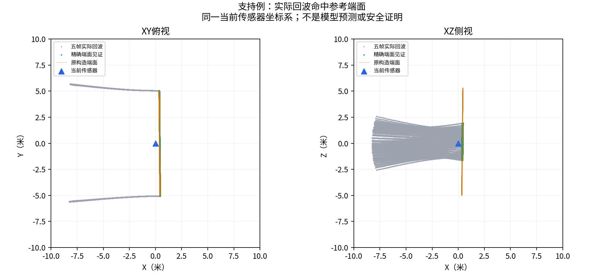
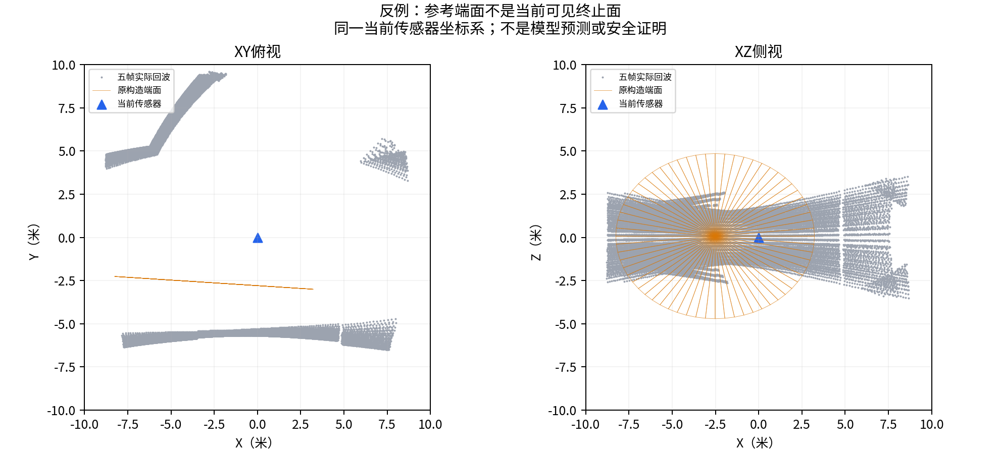

# 为什么不能直接把构造末端当作观测标签

下面是已封存端面诊断的两例解释图，不是模型预测或安全证明。灰色是原五帧有效回波，橙色是程序构造端面，绿色是精确对应的端面回波，蓝色是当前传感器。各图保持同一当前传感器坐标系和±10米尺度；只显示10米球内回波，不补点、不插值。端面三角网格作为参考叠加，不代表被完整观察。

## 实际支持例

S08 C07 mixed，sequence133465。五帧56872个有效回波，图中显示43757个局部回波；21141条原求交参数精确对应射线为端面提供支持。这是之前受数值对应假阴性影响的同一例，不是换了容易样本。

## 不能当作可见尽头的反例

S01 C06 ellipse，sequence6074。五帧57335个有效回波，图中显示24495个局部回波，端面见证0。此前逐射线检查表明穿过参考端面的射线在其后至少2.704米才返回。因此构造中有单支末端，不足以标为当前可见终止面。图中投影接近也不能替代三维射线对应。

两例是明确选取的支持/反例说明，不是无偏评价样本，更不用于重新筛训练集。来源run为population_terminal_v2，图和读取文件哈希见`figures/gse_terminal_evidence_v2/provenance.json`；生成脚本`tools/v3/plot_terminal_evidence_v2.py`拒绝覆盖已有图。旧run未修改，未新增标签或训练。图片已经实际打开检查，中文与XY/XZ坐标正常。

下一步回到路口分支和开口归属监督；这组图仅支撑观测监督边界的失败分析，不声称几何关系建图贡献已成立。
