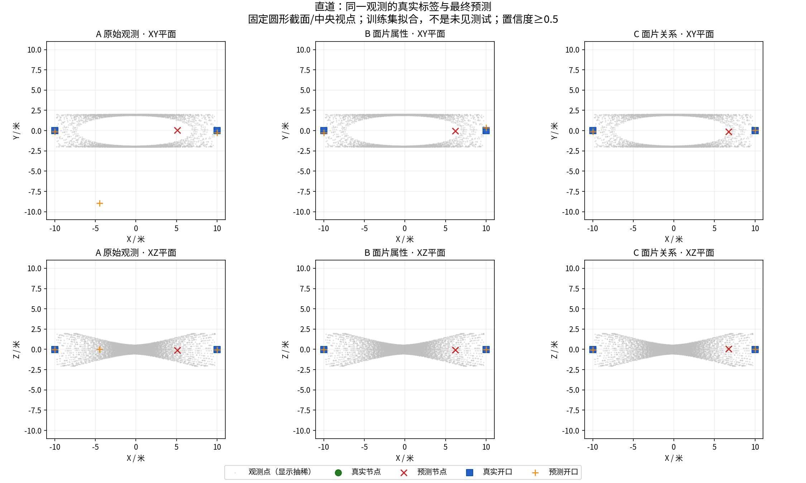
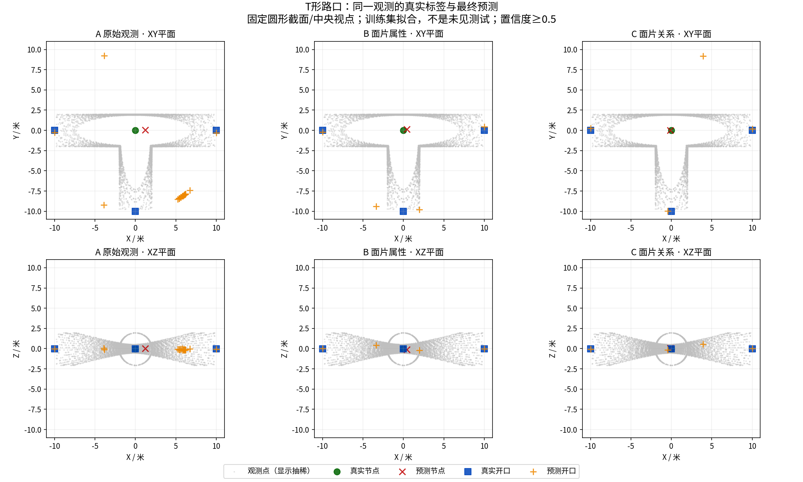
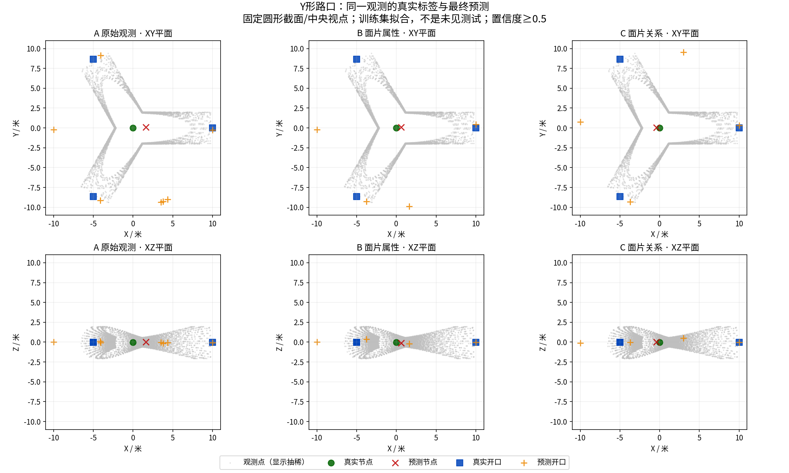
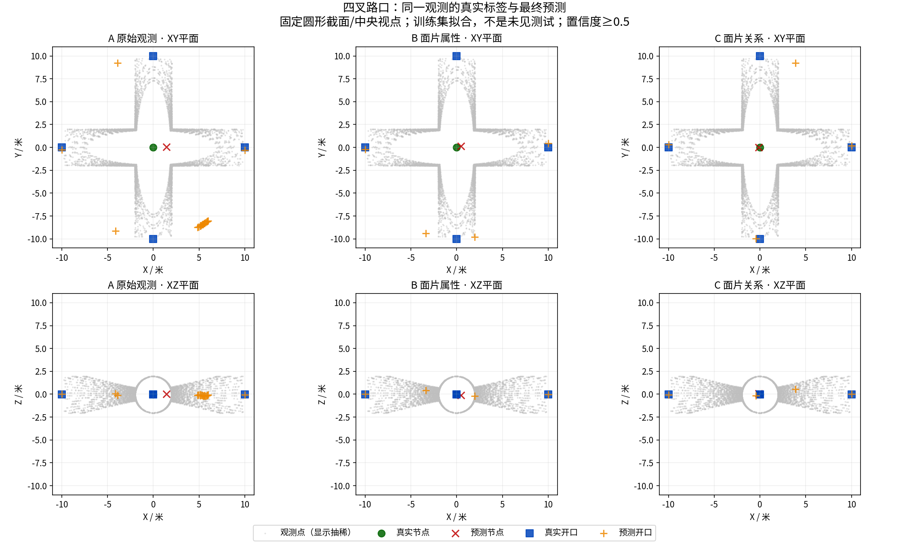
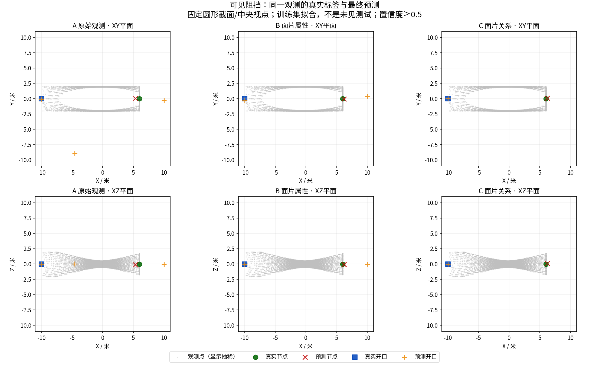

# 配对拟合的实际预测与失败位置

以下来自封存模型的最终输出，不是示意图。固定六类场景、圆形截面、中央视点，A/B/C同输入；统计仍覆盖全部45观察。仅显示点云每8点取1，不改评分或模型输出。全部图已记录来源、字体和绘图代码SHA；首次中文缺字版保留但不用于展示，以下为显式字体修正版。

## 最关键的问题：每个观察都预测了一个节点

逐帧统计确认，三组在45/45观察中都输出恰好一个高置信节点。普通直道本应没有结构节点，却在12/12观察中都误报。不能把这种输出直接交给图后端，否则沿普通通道不断产生假结构点。

## 开口模块已有局部可用性，但仍有复杂路口失败

C组直道24开口、尽头15开口及可见阻挡15开口均正确，无额外预测。这只证明这些简单合成条件上的拟合，不是泛化能力。T路口9个真实开口全部恢复，但多报3个；Y路口9个只恢复4个，多报7个；四叉12个恢复9个，多报3个。

## 尽头：开口正确不等于固定节点定位正确

B/C在尽头9个节点中仅3个达到1米匹配要求，另有9次误报、6次漏检（12观察中有3观察无可观察节点）。可见阻挡组相同。下一应保留位置、存在性与开口的分开评分，不用开口成绩代替建图质量。

## 决策

不追加这套模型的训练/种子。保留全部权重、开口预测与失败图供对照。下一只读核对已有非学习几何节点、固定定位锚点和轨迹连边接口：哪些可直接作同输入基线，哪些依赖真实ID必须排除。备用系统不学习产生节点时必须明确撤回该贡献，不能包装为原方案成功。当前不启动闭环或读取测试世界。

机器统计：[逐类型错误](figures/gse_window_fit_diagnosis_20260908_fontfixed/error_counts.json)；[来源绑定](figures/gse_window_fit_diagnosis_20260908_fontfixed/provenance.json)。
