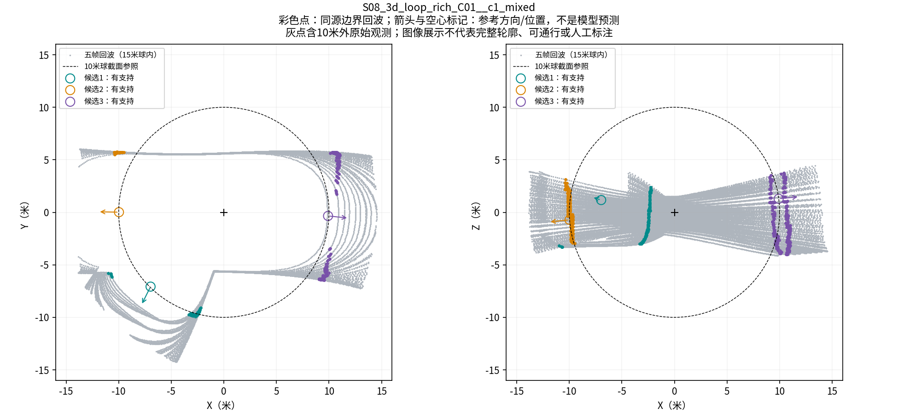
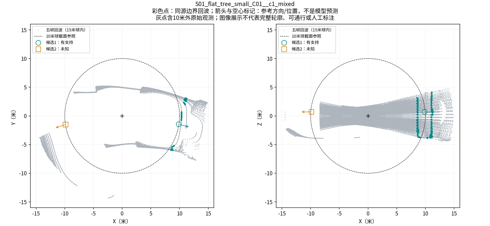

# 真实开口候选与回波对应图

2026-09-07。复用封存window_opening_v1、精确原始来源，两例解释性选取（先前讨论的S08路口与S01未知例），不作为随机评价人口。图片已实际目视核查。

S08三个有支持候选分别有100、156、204个同源边界返回；在10米球内的数量为51、0、0。向外独占穿越分别4764、8105、4995条。图中箭头/圆圈是参考位置与方向，不是学生模型预测；不能据此宣称准确率或完整宽高已知。

S01前方候选有132个边界返回，全部在10米外，另有1003条独占穿越。后方候选没有同源联合支持，保留未知；不据此把它标成封闭或不存在。

## 输入范围检查

图中显示15米球内的原始五帧返回，未降采样、插值或补图；完整点集仍保留在原输入。该15米仅为图片视野，不改变实验的10米面片范围。

`gse_surface_relation_model_v1._raw`只按valid掩码保留原始回波，未按10米裁剪；`gse_surface_patches_v1.extract_surface_patches`则明确仅选择10米内点。因此上述域外边界回波可进入观测通路，但不直接成为几何通路面片。不能说这些证据对学生整体不可见，也不能说几何通路直接看到了所有边界支持点。

本次不改变半径、网络输入、标签或A/B/C规则。后续解释收益时应区分近处几何组合与边界直接观测；是否存在独立收益仍须配对实验。没有把图像浏览记录冒充人工标注，qualified_labels仍0。

图片及`provenance.json`保留源seal、源文件哈希、帧、候选计数和图片哈希。原实验run不修改。
