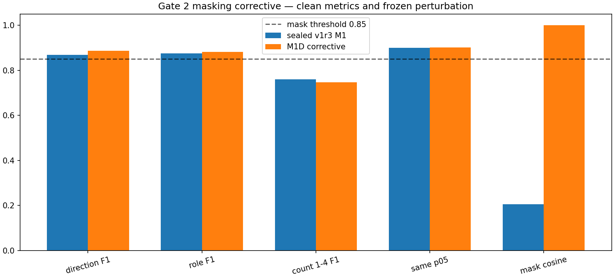
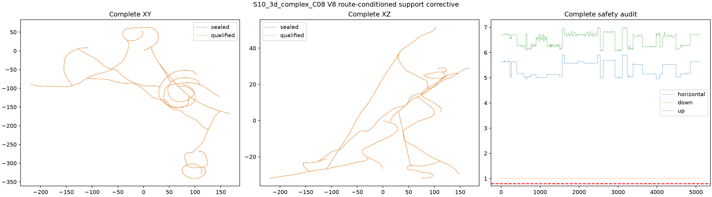
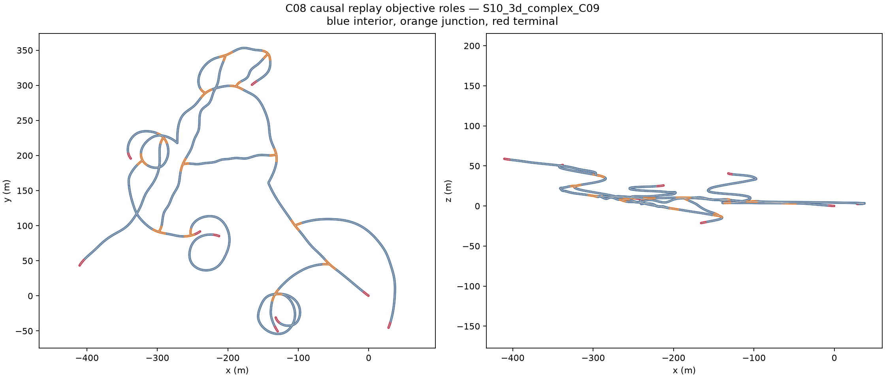

# 地下结构语义与因果拓扑图：阶段实验结果

> 本文只汇报已经封存的结果。模型已经训练完成；C08 开发场景和 C09 冻结参数验证中的“LiDAR → 结构语义 → 在线拓扑图”完整链路都已跑通。C09 曾参与 checkpoint 选择，因此它不是严格端到端未见测试；Gate 4 仍为 `GATE_MIXED`。

## 我们做了什么

我们要解决的问题不是普通的场景分类，而是让机器人从当前 LiDAR 中判断附近有哪些可通方向、这里是普通通道还是路口/末端，再把连续观测变成一张可用于探索的拓扑图。

完整流程是：

```text
Cano 地下世界与真实中心线
        ↓
16×720 全周 LiDAR 距离图
        ↓
M1D 多任务结构语义模型
        ↓
可通方向 + 分支数量 + 局部结构角色
        ↓
时间持续性与空间关联
        ↓
结构节点 + 已验证边 + 未探索出口
```

模型在线时只读取 LiDAR 距离和有效位，不读取完整地图、真实拓扑图或未来帧。完整地图只在离线阶段生成客观标签和评价结果。

## 数据和输入是什么样

正式数据来自 90 个相互独立的程序化地下世界，其中 80 个用于训练、10 个用于验证，共有 22,500 个空间采样位置和 112,500 帧 LiDAR。每个位置保留多个观测视角，但训练和验证按世界隔离，避免相邻帧或同一地图泄漏。

下图是一个实际训练页。彩色区域是 16 线 LiDAR 在不同水平方向上的量测距离，白线是完整地图生成的正确出口方向。普通通道、路口和末端都使用同一种输入形式。


## 使用的方法

M1D 使用环形卷积处理 360° 距离图，避免把正前方和正后方的拼接位置当成边界。编码器同时输出三类信息：各方向是否可通、附近分支数量、当前位置的结构角色。中间的 128 维结构表示用于保持同一地点不同观测下的语义稳定，但不直接拿它做地点身份匹配。

训练中加入了固定的射线遮挡扰动，让部分 LiDAR 列缺失时，结构表示仍保持一致。下图比较修正前后的结果。修正后方向和结构角色性能没有下降，遮挡一致性从约 0.21 提升到接近 1.00。



模型验证结果如下，只保留直接反映结构识别能力的指标：

| 结果 | 数值 |
|---|---:|
| 几何规则基线的方向 F1 | 0.796 |
| M1D 的方向 F1 | 0.887 |
| 结构角色 F1 | 0.882 |
| 1–4 个分支的数量 F1 | 0.747 |
| 遮挡后的结构表示一致性 | 0.9996 |

## 为什么还要做轨迹几何检查

模型需要在真实有效的 LiDAR 位姿上运行。如果传感器落到地板下、贴墙或错误地跳到上下层隧道，后面的识别和建图即使程序能运行，结论也没有意义。

为此我们把两种用途分开：原生 Cano 网格负责生成 LiDAR；独立的 route-conditioned 几何负责确认机器人沿当前路线有唯一地面支撑，并且与墙壁和顶部保持安全距离。只有路口附近允许调整轨迹，窗口外位姿必须与原轨迹完全相同。

C08 的 4,773 帧全部通过三档分辨率检查；4,307 个路口窗口外位姿逐元素不变。下图左、中分别是复杂三维世界的俯视和侧视轨迹，右侧是整条轨迹的水平、向下和向上安全距离。



## 拓扑图是怎么建立的

拓扑图不是一次看完整张地图后生成，而是严格按轨迹顺序逐帧更新：

1. 模型连续看到稳定的分支或结构变化时，创建结构节点。
2. 机器人实际移动通过一段路线后，才把两个节点连接成“已验证边”。
3. 当前看到但尚未走过的分支保存为“未探索出口”，供后续全局探索选择。
4. 普通长通道只保留必要的距离锚点，避免每帧都创建冗余节点。
5. 回到已有位置时，根据距离、结构角色和出口方向集合进行合并。

下图展示 C08 最复杂三维开发场景的完整回放轨迹及客观结构角色：蓝色为普通通道，橙色为路口，红色为末端。它说明回放同时覆盖了平面回环、坡道、多高度通道和大量分支，不是只在一条直隧道上测试。


正式回放对 4,773 个唯一 LiDAR 帧运行了 3 个冻结模型，共完成 14,319 次模型推理。图参数只在 C08 开发场景中选择，随后对规则基线、3 个模型和真实语义输入执行了同样的因果建图过程。

| C08 开发结果 | 几何规则基线 | M1D 三次训练的平均结果 |
|---|---:|---:|
| 拓扑综合分数 | 0.744 | 0.826 |
| 出口 F1 | 0.498 | 0.655 |
| 图连通率 | 1.000 | 1.000 |
| 已验证边正确率 | 1.000 | 1.000 |

M1D 相比规则基线的拓扑综合分数提高约 0.083，出口 F1 提高约 0.157。结果说明学到的结构语义确实改善了出口保留和拓扑表达，同时没有破坏图连通性和已验证边的正确性。

## 当前做到哪里

- 已完成：正式数据、三次 M1D 训练、C08 开发参数冻结、C09 全轨迹几何资格、C09 LiDAR 推理和固定参数因果拓扑回放。
- C09 正式规模：15,833 个唯一 LiDAR 帧、364,792,320 条双场景射线、47,499 个冻结模型推理帧、50 次固定参数建图；1,881 项封印全部通过。
- C09 平均综合分：B0 为 0.805；M1D seed0/1/2 为 0.816/0.825/0.808；oracle 为 0.850。所有方法的图连通率和已验证边正确率均为 1.000。
- 结果限制：最佳 M1D seed1 优于 B0，但三个 seed 的收益不均匀，平均出口 F1 与 B0 接近。C09 曾参与 checkpoint 选择，不能替代 C10 严格测试。
- 尚未进行：C10 严格测试、M-TARE 闭环替换和多机器人实验。

下面是 C09 最复杂三维世界的完整结构角色轨迹；正式 PDF 还给出了 B0、M1D seed1 和 oracle 三张实际拓扑图对比。



因此目前最准确的阶段结论是：**完整流程已经能够从 LiDAR 提取结构语义并建立连通、具有物理轨迹证据的因果拓扑图；C09 固定参数验证正式通过，但模型收益存在 seed/世界差异，最终严格泛化仍需独立授权后读取 C10。**

## 结果来源

- [正式数据结果](../results/gate1_data/gate1_20260812_cano_phase2_supervised_range_dataset_v2r_seed0/metrics/summary.json)
- [M1D 训练结果](../results/gate2_representation/gate2_20260813_cano_phase3_masking_corrective_recovery_seed2_v1_seed2/metrics/summary.json)
- [C08 轨迹几何结果](../results/gate4_topology/gate4_20260816_cano_c08_route_conditioned_support_corrective_v8r_seed0/metrics/summary.json)
- [C08 因果拓扑回放结果](../results/gate4_topology/gate4_20260817_cano_c08_route_conditioned_causal_topology_replay_v2r_seed0/metrics/summary.json)
- [C08 科研复核与限制](PHASE4_C08_V2R_RESEARCH_REVIEW.md)
- [C09 几何纠正审计](../results/gate4_topology/gate4_20260820_cano_c09_geometry_evidence_corrective_audit_v1r_seed0/metrics/summary.json)
- [C09 完整因果拓扑验证](../results/gate4_topology/gate4_20260820_cano_c09_causal_topology_validation_v1_seed0/metrics/summary.json)
