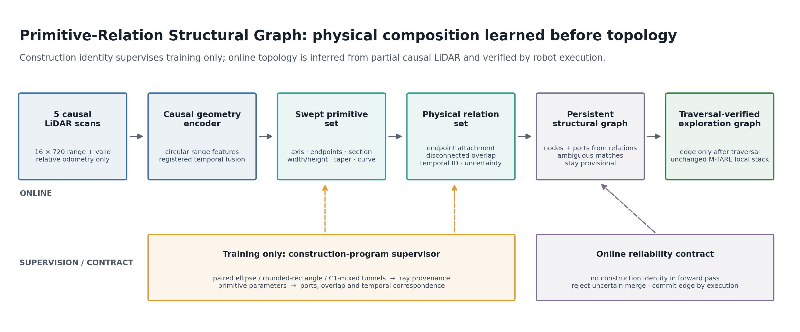
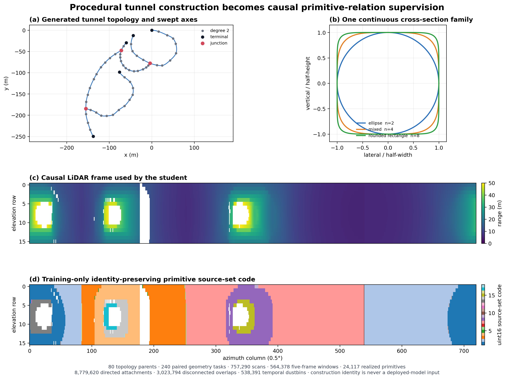
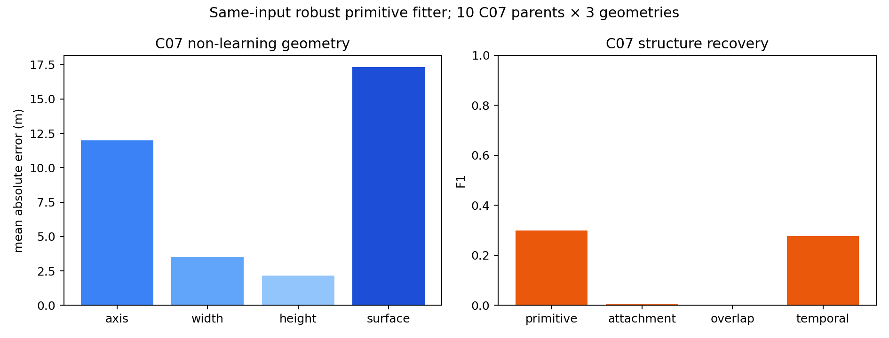

# Construction-Supervised Primitive Relation Graphs for Causal Underground Exploration

Status: `ACTIVE_EVIDENCE_BOUND_DRAFT`

This is the active main-method manuscript. The exit-only manuscript in
`docs/PAPER_MANUSCRIPT_DRAFT_V1.md` is retained only as baseline and ablation
material. Statements marked `AUTO` may be replaced only from a completed,
sealed experiment.

## Abstract

Underground exploration must distinguish connected branches from repeated,
overlapping, or vertically stacked tunnel geometry while maintaining a compact
global representation. Direction-only tunnel detectors and rule-based graph
builders do not explicitly recover the physical parts and relations that give
rise to local structure. We propose a construction-supervised primitive
relation graph. A procedural construction program provides exact swept
cross-section primitives, surface provenance, endpoint attachments, separated
overlaps, and temporal correspondence for training, while the deployed model
receives only five causal LiDAR scans and relative odometry. The model predicts
an exchangeable set of swept-superellipse primitives and their relations. These
local relation graphs are fused into a persistent structural-semantic graph;
candidate nodes and ports may be proposed by perception, but a global edge is
committed only after physical traversal, and uncertain associations are not
forced into loop closures. The graph replaces the global representation and
target interface of M-TARE while retaining its local planning, avoidance,
state-estimation, and control stack. On topology-parent-isolated procedural
worlds, the learned model **[AUTO:PERCEPTION_RESULT]**. In causal graph replay,
it **[AUTO:GRAPH_RESULT]**. In paired single- and multi-robot exploration,
**[AUTO:CLOSED_LOOP_RESULT]**. These results **[AUTO:SUPPORTED_CONCLUSION]**.

## 1. Introduction

Long corridors, sparse junctions, ramps, repeated cross-sections, and stacked
passages make underground exploration a structural reasoning problem as well
as a motion-planning problem. A local scan can contain surfaces belonging to
several tunnel segments, but geometric proximity alone does not say whether
their endpoints connect. Conversely, a direction detector can point toward an
opening without explaining which persistent structure produced it or how it
should be associated after motion and revisitation.

Our premise is that a procedural underground world contains a stronger source
of supervision than a derived junction label. Its construction program records
the geometric parts, transformations, and composition relations that generated
the visible surface. We use this record only as a training supervisor. At
deployment, the student receives five causal LiDAR scans and relative odometry
and must infer the local primitives and relations itself.

The inferred representation is deliberately between a dense metric map and a
categorical event detector. Each primitive has an axis and a varying
superelliptic cross-section. Relations distinguish physical endpoint
attachments from visually similar but disconnected overlaps and associate the
same local entity across time. The persistent graph is built from these learned
entities and relations. Perception may propose nodes and ports, but only robot
traversal verifies a global edge; ambiguous association produces a provisional
node instead of an unsafe loop merge.

The paper makes four evidence-dependent contributions:

1. A construction-program supervisor that converts procedural geometry into
   visibility-cropped, identity-preserving primitive, surface, relation, and
   temporal labels without exposing world identity or future topology to the
   student.
2. A five-frame LiDAR model that predicts an exchangeable set of explicit
   swept-superellipse primitives and, for every observable endpoint, a shared
   three-dimensional composition anchor and uncertainty. Physical attachment
   is induced by probabilistic anchor compatibility rather than an independent
   classifier for every endpoint pair.
3. A causal structural-semantic graph in which learned relations determine
   persistent nodes and candidate ports, uncertain associations are rejected,
   and physical traversal is the only mechanism that commits global edges.
4. A controlled evaluation against original M-TARE, an exit-only learned
   baseline, a same-input non-learning primitive fitter, component ablations,
   and a GT-TNG diagnostic under unchanged local execution contracts.

*Figure 1: The active method learns visible swept tunnel primitives and their
physical relations before forming persistent topology. The former
event/exit-token diagram is retained only as a baseline figure.*

## 2. Related Work and Novelty Boundary

The authoritative source-by-source boundary is maintained in
`docs/PRIMITIVE_RELATION_NOVELTY_MATRIX_V1.md`. Learned primitive fitting and
abstraction already recover variable sets of analytic parts from point clouds
[@li2019spfn; @le2021cpfn; @paschalidou2019superquadrics;
@ganeshan2026resfit]. Neural CSG and assembly models recover compact constructive
representations [@sharma2018csgnet; @chen2020bspnet; @yu2022caprinet]. ArcPro
goes further by learning inverse architectural programs from procedurally
synthesized sparse point clouds [@huang2025arcpro]. StructureNet and GraphMapper
already combine part geometry with learned inter-part or primitive relations
[@mo2019structurenet; @wang2023primitivegraph]. We therefore do not claim that
primitives, construction supervision, or relation graphs are individually new.
TopoNet further demonstrates that geometric instances and their topology can
be reasoned about jointly in an end-to-end scene graph, albeit for structured
driving scenes rather than partially observed 3D tunnel free space
[@li2023toponet].

In robotics, Cano et al. already learn tunnel-direction distributions from
synthetic 3D LiDAR and use them for lightweight underground topology
[@cano2026autonomous]. PRISM-TopoMap combines learned place recognition with
scan matching to maintain an online location graph [@muravyev2025prism], while
segmented-map exploration constructs subterranean topology from accumulated
dense LiDAR maps and keyframe contributions [@kim2023segmentedtopology]. M-TARE
already demonstrates representation-efficient single- and multi-robot
exploration [@cao2023representation]. Thus, learned loop closure, tunnel
topology, and sparse exploration are also not isolated contributions.
Hydra already extracts an incremental place graph from a local ESDF/GVD and
uses hierarchical descriptors for persistent scene-graph loop closure
[@hughes2022hydra], while S-Graphs+ couples keyframes, wall planes, rooms, and
floors in an optimizable hierarchy [@bavle2023sgraphsplus]. Consequently, the
mere conversion of geometry into a sparse hierarchical graph is not our claim;
the learned causal tunnel entities, physical port relations, refusal, and
traversal-only edge commitment must provide the measurable difference.

Our claim must rest on the complete causal chain from procedural construction
supervision to learned local swept-tunnel relations, traversal-verified online
topology, and controlled underground exploration. In particular,
ArcPro already covers inverse procedural supervision, while StructureNet already
covers order-invariant part geometry and part relations.
Our claim must therefore rest on causal partial LiDAR, tunnel-specific swept
primitives and physical relations, persistent online fusion, traversal-only
edge commitment, and measured exploration benefit—not on primitive or relation
learning in isolation. **[AUTO:FINAL_RELATED_WORK_MATRIX]**

## 3. Problem Formulation

At time (t), the perception model receives the current and four preceding
organized LiDAR scans and their relative odometry,

\[
  O_t = \{(Z_{t-k},\,T_{t\leftarrow t-k})\}_{k=0}^{4}.
\]

It predicts a local primitive-relation observation

\[
  \hat{S}_t=(\hat{P}_t,\hat{Q}_t,\hat{A}_t,\hat{D}_t,\hat{C}_t,\hat{U}_t),
\]

where \(\hat{P}_t\) is an exchangeable primitive set,
\(\hat{Q}_t\) contains one three-dimensional composition anchor and scale per
endpoint, \(\hat{A}_t\) is the symmetric attachment compatibility induced by
those anchors, \(\hat{D}_t\) contains
disconnected spatial overlaps, \(\hat{C}_t\) contains temporal
correspondences including a dustbin, and \(\hat{U}_t\) is calibrated
uncertainty. No absolute pose, world identifier, TNG identity, complete map, or
future scan is an input to this model.

The online system maintains a causal graph \(G_t\) from \(G_{t-1}\), the current
prediction, pose estimate, and execution trace. Learned structure may propose a
node or port. A graph edge \(e_{ij}\) is verified only when the robot physically
traverses from the corresponding persistent regions. The global layer selects
an exploration target from unresolved eligible ports and hands it to the
unchanged M-TARE local stack.

## 4. Construction-Program Supervision

### 4.1 Swept geometric primitives

Each local tunnel part is represented as a finite swept superellipse. Three
axis control points encode local curvature. Endpoint half-axes and shape
exponents encode width, height, and the continuous spectrum from ellipse to
rounded rectangle. Endpoint parameters interpolate along arc length with a
cubic smoothstep, permitting taper and C1-continuous changes while preserving a
compact explicit representation.

The dataset keeps each topology parent intact across all splits and realizes
three paired geometries per parent: elliptical, rounded-rectangular, and
C1-varying mixed cross-sections. This pairing tests whether the model recovers
construction structure rather than memorizing one rendering style.

### 4.2 Identity-preserving surface provenance

Native appearance meshes are retained for the perception domain, but their
global reconstruction does not preserve the identity of the generating part.
For supervision, independent closed primitive surfaces are intersected with
each LiDAR ray. Ordered multi-hit occupancy transitions identify the actual exit
from the union and preserve every contributing primitive at ambiguous
boundaries. Unique-source returns supervise a primitive directly; multi-source
returns keep the complete membership set and are masked from arbitrary
single-identity assignment.

### 4.3 Visible relation and temporal labels

The construction graph supplies physical endpoint attachments, the shared
construction anchor of every attached endpoint cluster, and component identity.
Every anchor is transformed into the current sensor frame before supervision;
world coordinates and identities are then discarded. Spatially overlapping but
disconnected primitives provide hard negatives, especially for stacked tunnels.
Five-frame relative odometry registers the causal window into the current sensor
frame. An attachment enters the local loss only when both participating
endpoints have ray support within the frozen observability band. A physically
valid but currently hidden attachment remains unknown rather than being relabeled
as negative. Disappearance and occlusion produce explicit dustbin temporal
correspondences. Unvisited state is excluded because it depends on robot history
rather than local geometry.

The completed dataset contains 80 topology parents, 240 paired geometry tasks,
757,290 source frames, and 564,378 five-frame examples. C01--C06 are used for
fitting, C07 for model and threshold selection, and C08 for one zero-adaptation
development transfer after selection. **[AUTO:STRICT_AND_REAL_DATA_COUNTS]**

The composition-anchor training sidecar is a lossless numerical view over this
dataset rather than a second sensor dataset. It covers exactly 60 fit parents,
180 paired geometry tasks, and 426,552 causal windows, plus 10 disjoint C07
parents, 30 tasks, and 64,644 windows. Across fit and C07 it validates 3,826,561
true attachment-anchor pairs. Attached endpoints share the same anchor exactly;
inactive slots are exact zero, and construction identities are absent from the
stored student target.

*Figure 2: A fixed, outcome-independent C01 training example. The lower panels
show the deployed input and its construction-derived supervision for the same
frame; the source-set code and construction identity never enter the deployed
model.*

## 5. Primitive Relation Network

### 5.1 Causal circular encoder and set decoder

Each 16x720 scan is represented by normalized range and validity channels. A
circular range-image encoder preserves azimuthal topology. The five encoded
frames are aligned using relative odometry and aggregated causally. A set
decoder emits 32 exchangeable primitive queries, a capacity selected from
fit-only visibility evidence with headroom and frozen before validation.

Each query predicts three axis control points, two endpoint half-axis pairs,
two shape exponents, existence, endpoint descriptors, and geometry uncertainty.
Permutation-invariant matching is canonicalized using geometry and iterative
relation signatures so stored target slots cannot change the loss.

### 5.2 Linear-output composition-anchor head

An earlier pairwise relation transformer independently classified every
candidate endpoint pair. Although useful as an ablation, it failed to produce a
nonempty high-precision connection set on unseen topology even when the
primitive proposals were replaced by an oracle. The final relation interface
therefore predicts one compact latent construction object per endpoint instead
of one unrelated decision per pair.

For endpoint \(e\), the frozen primitive backbone supplies its sensor-frame
position, descriptor, cross-section, geometry uncertainty, existence, and
deployment-time endpoint-evidence probability. A small shared MLP predicts a
three-dimensional residual \(r_e\) and positive isotropic scale \(s_e\). The
residual is expressed in a yaw-equivariant sensor-polar frame whose axes are the
horizontal sensor-to-endpoint direction, its lateral direction, and gravity.
This frame remains defined when a predicted primitive tangent collapses. The
composition anchor is

\[
  q_e = p_e + R_e r_e .
\]

Two endpoints are compatible when their predicted Gaussian anchors explain the
same physical point. With learned scalar temperature \(\tau\) and bias \(b\),

\[
  \ell_{ef}=\tau\left[-\frac{1}{2}\left(
  \frac{\lVert q_e-q_f\rVert^2}{s_e^2+s_f^2}
  +3\log(s_e^2+s_f^2)\right)\right]+b .
\]

The expression is symmetric by construction. Its deployable safe score
multiplies \(\sigma(\ell_{ef})\) by the two predicted endpoint-evidence
probabilities. The network therefore emits \(O(E)\) anchors and uncertainties;
the required pair scores are derived deterministically, rather than learned as
an unconstrained \(O(E^2)\) output. A temporal head in the frozen backbone still
associates visible primitives from each historical scan to current queries or
the dustbin.

### 5.3 Staged training objective

The primitive backbone was trained with six independently auditable families:

\[
\mathcal{L}=\mathcal{L}_{param}+\mathcal{L}_{surface}
 +\mathcal{L}_{free}+\mathcal{L}_{relation}
 +\mathcal{L}_{temporal}+\mathcal{L}_{uncertainty}.
\]

This stage establishes the explicit primitive set, surface support, temporal
identity, and endpoint descriptors. The final corrective freezes the complete
backbone and trains only the composition-anchor head using

\[
  \mathcal{L}_{anchor}=\frac{1}{3}\left(
  \mathcal{L}_{NLL}(q,s)+\mathcal{L}_{cal}(s)
  +\mathcal{L}_{compat}\right).
\]

The first term is a Gaussian anchor negative log-likelihood over observed
endpoints. The second calibrates scale against detached endpoint error. The
third balances positive and negative compatibility and explicitly penalizes
disconnected-overlap hard negatives. The Teacher observability mask controls
loss validity only and never enters the forward pass. For each of three fixed
seeds, the corresponding backbone checkpoint is frozen and only 22,278 head
parameters are optimized for three full fit epochs. Checkpoints are selected by
the mean complete C07 composition-anchor objective (anchor NLL, uncertainty
calibration, and the compatibility term containing disconnected-overlap hard
negatives); the final relation threshold is selected on C07 only. C08 is opened
once only if at least two seeds pass every predeclared C07 criterion, including
a nonempty true connection set at precision at least 0.98.

## 6. From Local Relations to a Persistent Exploration Graph

Primitive correspondences update persistent local entities. A stable cluster of
mutually compatible composition anchors forms a structural-node proposal, while
an unmatched observable endpoint becomes a provisional exploration port.
Anchor scale and endpoint evidence propagate relation uncertainty instead of
forcing a nearest-neighbor merge. Ordinary corridor geometry is stored as edge
attributes instead of generating fixed-distance semantic nodes.

Node association combines learned descriptors, endpoint-token compatibility,
relation structure, pose uncertainty, and execution trace. An ambiguous match
remains provisional; it cannot force a loop closure. A verified edge is added
only after the robot's physical trajectory connects the corresponding regions.
Each edge stores traversed length, width, clearance, slope, curvature, and
execution state. Robots share compact graph increments rather than dense maps.

## 7. Experimental Protocol

### 7.1 Perception and relation recovery

The same-input non-learning fitter and the learned model receive identical five
scan windows and relative odometry. Metrics include primitive precision,
recall, F1 and target coverage; surface Chamfer distance; axis, width, height,
shape, slope, and curvature error; attachment and disconnected-overlap F1;
temporal correspondence accuracy; calibration; and performance by topology,
geometry family, visibility, and primitive count.

### 7.2 Causal graph replay

All methods replay the same chronological trajectories. We report node and edge
precision/recall/F1, false loop merges, connected components, cycle-rank error,
port lifecycle accuracy, graph edit distance, and graph size/communication.
Complete TNG information is used only for evaluation and the diagnostic oracle.

### 7.3 Closed-loop exploration

The primary methods are original M-TARE, the learned exit-only model with a
rule graph, non-learning primitive fitting with the same graph interface, the
full primitive relation graph, and a GT-TNG diagnostic. Local planning,
avoidance, localization, control, sensors, starts, seeds, and runtime are held
constant. Single-robot and 2/3/4-robot experiments report coverage-time AUC,
completion rate, travel, repeated exploration, false loops, target conflicts,
communication bytes, runtime, and failure reasons. **[AUTO:FINAL_CASE_COUNTS]**

### 7.4 Ablations and failure analysis

Required ablations compare one versus five frames; 8/16/32 queries; removal of
construction-parameter supervision, surface/ray reconstruction, relation loss,
temporal correspondence, uncertainty rejection, and edge geometry; and learned
versus distance/angle association. Completed earlier event-slot, Composer,
exit-transport, and rule-association experiments are retained as design-failure
evidence, not mixed into the fair main table unless rerun under the final input
and execution contract.

## 8. Results

### 8.1 Dataset and supervision integrity

The construction pipeline preserved 24,117 primitive instances across the 240
paired tasks and generated 8,779,620 endpoint-attachment labels, 3,023,794
disconnected-overlap labels, and 538,391 temporal dustbins. The maximum visible
primitive count was 24, below the frozen 32-query capacity. All student inputs
exclude absolute pose and topology identity. **[AUTO:DATASET_FIGURE_AND_TABLE]**

### 8.2 Same-input non-learning lower bound

On the complete C07 selection set, robust non-learning fitting achieved high
primitive precision (0.9999) but only 0.1753 recall and 0.2983 F1. Attachment F1
was 0.0058, disconnected-overlap F1 was zero, and temporal correspondence
accuracy was 0.1556. This lower bound shows that fitting isolated, locally
obvious surfaces does not recover the full composition graph.

The final composition-anchor comparison uses the stricter dual-endpoint-visible
population rather than silently treating hidden physical attachments as
negatives. On all 64,644 C07 windows this population contains 442,936 positive
attachment pairs; the same-input non-learning attachment baseline is
F1=0.006380. This value, not the rounded full-population 0.0058 diagnostic, is
the frozen reference for the predeclared five-percentage-point learned gain.

*Figure 3: The same-input non-learning lower bound. Isolated local fitting
recovers only a small fraction of the target primitives and does not recover
their attachment or disconnected-overlap relations. The publication bundle is
copied byte-for-byte from the sealed C07 baseline and contains no strict-test
result.*

**[AUTO:LEARNED_MODEL_COMPARISON]**

### 8.3 Structural graph accuracy

**[AUTO:CAUSAL_GRAPH_MAIN_TABLE]**
**[AUTO:TOPOLOGY_VISUALIZATIONS]**

### 8.4 Single- and multi-robot exploration

**[AUTO:SINGLE_ROBOT_TABLE_AND_CURVES]**
**[AUTO:MULTI_ROBOT_TABLE_AND_CURVES]**

### 8.5 Ablations, uncertainty, and failures

**[AUTO:ABLATION_TABLE]**
**[AUTO:UNCERTAINTY_AND_FALSE_LOOP_PLOTS]**
**[AUTO:REPRESENTATIVE_FAILURE_CASES]**

Historical completed runs provide design evidence, but are not mixed into the
fair main table. Direct spatial event sets reached only 0.130--0.186 F1 with
approximately 2.49--2.63 m matched-position error; geometry-anchored event
slots reached 0.069--0.093 F1, below their 0.390 rule baseline; and structured
polar multi-depth slots reached 0.144--0.167 F1 with approximately 2.0 m error.
An exact-one event constraint increased C08 precision to 0.991 but limited
recall to 0.357. Relational exit transport reached 0.665 F1, below its 0.744
baseline, while the dual Composer reached 0.529 mean-seed F1 versus 0.589 for
its old baseline. The old offline distance/event graph reached 0.9646 association
precision and 3.54% false loop merges, missing the frozen 0.98/1% reliability
contract. Together these failures motivate the shift from compressed event or
exit tokens to visible physical primitives, learned composition relations, and
explicit rejection of uncertain graph merges. The corresponding sealed runs
and figures are mapped in `docs/PAPER_EVIDENCE_RETENTION_MATRIX.md`.

## 9. Discussion and Limitations

Construction supervision can provide exact part identity in simulation, but
real underground scans may violate the procedural shape family through rubble,
equipment, vegetation, water, or severe surface irregularity. The explicit
primitive representation is intended as a compact structural approximation,
not a dense reconstruction. Odometry drift can still fragment persistent
entities, while conservative association may reduce false loops at the cost of
duplicate provisional nodes. Simulation-only closed-loop results cannot prove
field robustness; final claims must match the available real-site evidence.

## 10. Reproducibility

Each material dataset, training, evaluation, graph replay, and closed-loop run
is bound to a Data Card, frozen run specification, command, environment,
manifest, seed, raw log, metrics, figures, failure reasons, and SHA-256 seal.
Paper tables and figures must be generated from these sealed sources. Historical
scientific failures are retained when they support a design conclusion;
engineering failures are reported only as reproducibility evidence.

## 11. Conclusion

**[AUTO:CONCLUSION_AFTER_ALL_REQUIRED_EVIDENCE]**
