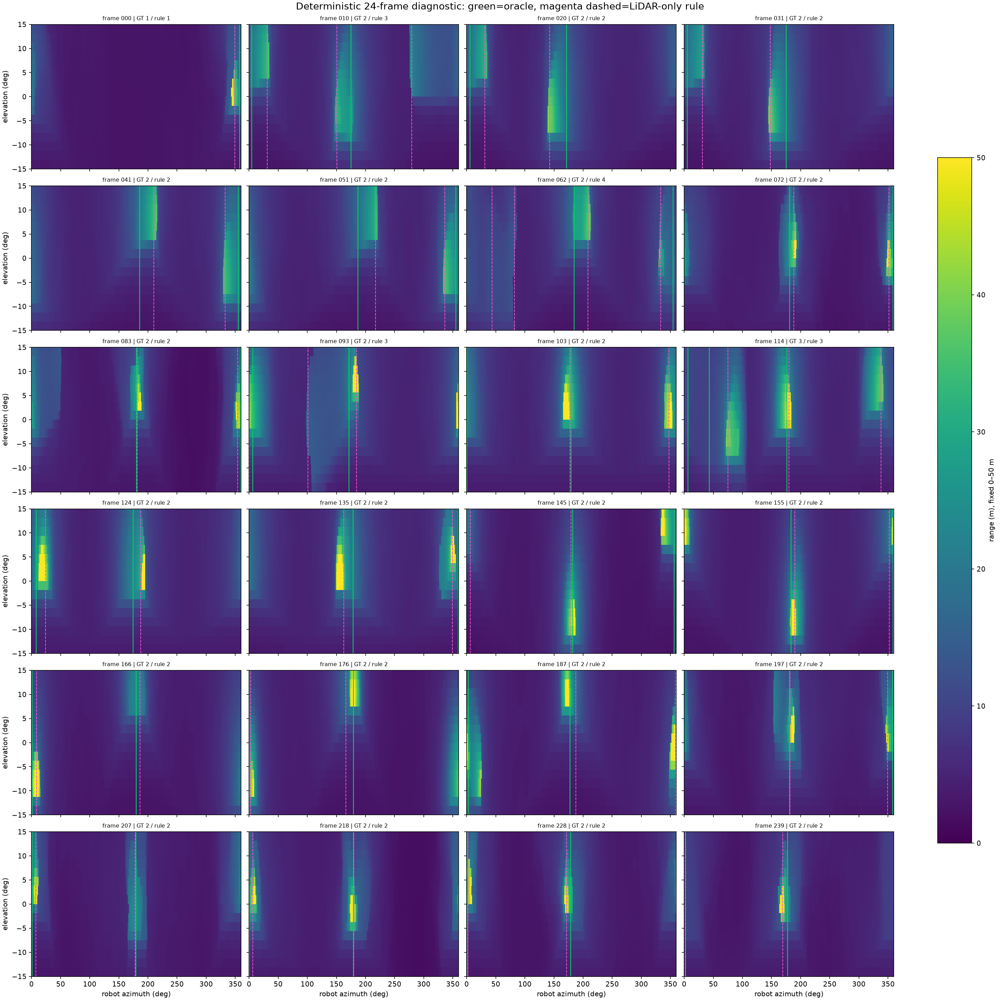
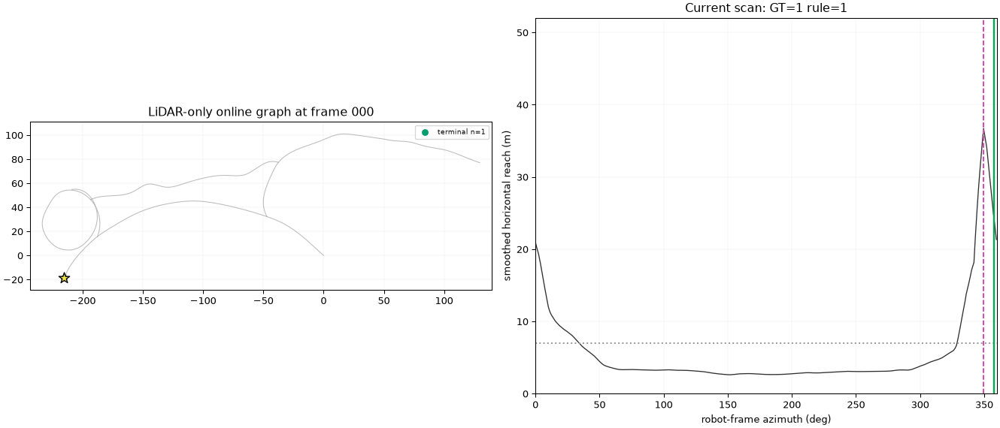

# 本周工作小结：地下结构拓扑多机器人探索

> 汇报口径：2026-08-10 至 2026-08-11。当前处于 **Phase 1 / Gate 0**，聚焦“程序化地下拓扑 + LiDAR 结构感知”的数据与接口合同；尚未进入模型训练、M-TARE 修改或闭环探索对比。

## 这周推进了什么

我们把研究链路收敛为一条可检查的路径：

```text
程序化地下拓扑真值
        ↓
原生感知 mesh + CPU Raycast LiDAR
        ↓
局部出口/可通行分支识别
        ↓
因果 Online Topometric Graph
        ↓（后续）
替换 M-TARE 的全局目标选择；保留其局部规划器
```

- 固定了 Cano 程序化地下网络生成器及只读 adapter，用于提供拓扑图、中心线和感知 mesh；单个 seed-0 world 的拓扑/标签链路已可追溯。
- 使用 Open3D CPU raycast 跑通了单图 LiDAR 合同：24 个固定 pose 的 scan、标签和 CPU reference 一致。Isaac RTX 路线出现 headless Writer 回调阻塞，因此从主线移出；这不影响 CPU 感知链路。
- 做了一个**仅用于接口验证**的纵向原型：CPU LiDAR → 规则出口检测 → 因果在线拓扑图。它验证了数据结构、时序更新、节点/边/未探索出口 stub 和可视化可连通工作。
- 五拓扑跨环境合同已准备，但首次正式执行在生成数据前被 provenance 门禁拦截：Python 导入到了 site-packages，而非锁定的 Cano checkout。因而本周没有把未验证的数据混入结果；修复及执行前身份检查已通过 84/84 单元测试和 6/6 外部测试，等待重新按原规格执行。

## 相关工作：这周重点看了什么、别人怎么做

| 工作 | 对方的关键做法 | 对我们的启发 |
|---|---|---|
| [Cano, Tardioli, Mosteo (2026)](https://onlinelibrary.wiley.com/doi/full/10.1002/rob.70157) | 将 VLP-16 LiDAR 转为 `16×720` depth image，以轻量 CNN 输出 360° 出口响应；在 50 个程序化地下环境、50 万样本上训练，并以出口 tracking/hysteresis 进行纯拓扑导航。 | “合成地下 LiDAR + CNN 出口检测 + 拓扑导航”已有直接先例。因此我们的重点不能只放在出口检测，而应落在残缺观测下的 planner-consistent 结构语义/不确定性、稳定 exit-stub 图，以及对 M-TARE 全局层的替换与多机器人分配。 |
| [TARE](https://publications.ri.cmu.edu/tare-a-hierarchical-framework-for-efficiently-exploring-complex-3d-environments) | 分层探索：全局目标选择与局部规划分工。 | 后续比较只替换全局表示与目标选择，保持 local planner、传感器和运行条件一致，避免把运动能力差异误归因到拓扑方法。 |
| [Graph-based subterranean exploration](https://www.research-collection.ethz.ch/entities/publication/076e02d3-f139-4bd1-ac62-9fe87bd0af3c) | 使用稀疏图组织地下探索中的 frontier、死端和路径规划。 | 图本身不是创新；要证明结构图能在部分可见、存在误检漏检时比几何 keyframe 或仅方位出口图更稳定。 |
| [Unsupervised Junction Recognition](https://arxiv.org/abs/2006.04225) | 用 2D 点云与谱聚类识别地下 junction。 | 保留几何/规则基线很重要：学习模型必须在严格未见拓扑上优于这类透明基线。 |
| [PointContrast](https://arxiv.org/abs/2007.10985) 与 [LiDAR traversability SSL](https://arxiv.org/abs/2208.01329) | 自监督/对比学习可改善表征或迁移；轨迹可提供部分可通行经验。 | SSL 是后续消融或增强项，不能代替由完整拓扑/几何提供的客观出口与连接 teacher。 |

## 当前跑出来的效果

下面结果来自 **1 个已检查的开发 world**，沿 source graph 双边遍历得到 240 帧；每帧为 `16×720` first-return LiDAR，总计 276.48 万条 ray。规则和图关联参数曾在同一轨迹的 81 组候选中选择，因此它证明“链路可运行”，**不代表未见拓扑上的泛化性能**。

| 环节 | 当前数字 | 怎么理解 |
|---|---:|---|
| 出口规则检测 | Precision 0.748、Recall 0.753、F1 **0.750** | 已能从单帧 range image 找到多数分支，但漏检/误检仍明显，是后续小 CNN baseline 应优先改善的环节。 |
| 出口方位 | 平均匹配角误差 **6.99°** | 在匹配成功的出口上，方向误差处于可用于图关联的量级。 |
| 在线图节点 | node F1 **0.828**（36 个匹配节点） | 规则感知误差会传递到节点生成，但图的因果更新机制已能工作。 |
| 在线图边 | 几何 edge F1 **0.940**（47 条匹配边） | 对已形成的边，几何对应较好；这不是全局图同构指标。 |
| 图规模 | 规则图 43 nodes / 50 edges / 14 stubs；oracle 图 44 / 50 / 12 | 与同轨迹 spline-oracle 的差异主要来自局部出口识别，而非图数据结构无法表达。 |


*图 1：单个开发 world 的纵向链路总览。用途是核验感知—建图接口；不是正式 benchmark。*



*图 2：规则出口检测的代表性帧诊断，可直接看到正确识别以及漏检/误检的位置。*



*图 3：在线图随轨迹逐帧增长的动态回放；显示 node、edge 和未探索 exit stub 的因果更新。*

## 目前的判断与下一步

当前最重要的结论不是“模型已经有效”，而是：**CPU LiDAR—局部结构—在线图的接口已经能跑通；规则感知约 0.75 F1，存在明确的学习改进空间。**

紧接着需要在不调参的条件下，用固定的 5 个新拓扑、5 个 mesh、250 个 anchor、750 个静态观测重放该规则与图参数。这个合同将回答：当前效果是否能跨拓扑保持，哪些结构条件会造成失败，以及后续训练数据和模型究竟要解决什么问题。正式数据集、训练样本、checkpoint、M-TARE 改动目前均为 0。

---

数据与图源：`results/prototypes/cano_seed0_lidar_to_topometric_vertical_slice_v2_graph_refined/`。详细证据及适用边界见 `docs/WORKING_VERTICAL_SLICE_V1.md`、`docs/RELATED_WORK_READING_GUIDE.md`。
