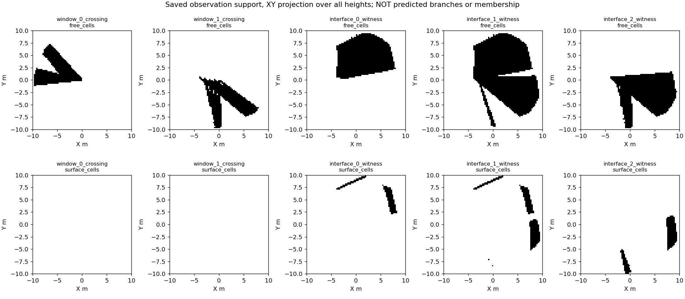
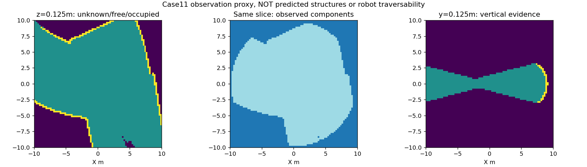

# 前三个封存观测：参考揭示前的AI辅助查看记录

## 2026-09-11：新12观察的真实来源证据与公共特征已完成

不是继续检查旧16观察。本次读取已固定新12父地图的60帧，完成两项一次性运行：

| 产物 | 实际规模与结果 |
|---|---|
| `gse_new12_surface_residual_v1` | 12/12；446,184个10米域内返回，446,919条候选来源记录；735个多来源返回原样保留；810.457秒，峰RSS约151MiB |
| `gse_new12_features_v1` | 12/12；10,193个观测面片及公共冻结特征；5090执行4.496秒，峰预留显存约94MiB；0教师载荷与优化更新 |

两项各24项封存哈希核验通过；12对原返回索引逐元素相等。第二项复用既有seed0 epoch2编码器，前后权重一致，A/B/C不会分别抽不同面片或选择不同输入。全部735个多来源点保留；较大候选残差没有被静默删除。当前状态为`GATE_MIXED`：输入交付完成，不是模型或论文主张通过。

GPU曾在沙箱内不可见，经沙箱外只读查询和冻结PyTorch合成张量确认可用，随后在记录的沙箱外环境执行正式导出；没有修驱动或重启机器。源匹配进程25081和特征进程81792均已正常结束，不再按历史RUNNING记录重启。

下一步是缓存到训练目标的绑定：原始候选来源、纯净/混合面片、未知和有效监督必须分开。来源编码并非唯一三角面编号，局部来源组织也并非路口归属；不设一个事后有利残差阈值来制造“已确认结构”。本节0新标签、0训练更新。此后才可冻结A/B/C小规模配对训练，结构与拓扑收益仍另行验证。

## 2026-09-11：用户确认新路线，开始无中心预测的局部几何组织实现

新任务先回答“哪些观测表面来自同一局部几何基元”，不再将它直接叫作“通道属于哪个路口”。程序生成来源可用于训练侧；面片包含混合来源、交叠或无法可靠对应时保留未知。不能把同一构造来源自动等同于完整结构关系，也不以低层分组成绩宣布创新成立。

新增`src/mtare_topo/representation/gse_local_surface_affinity.py`复用既有消息层。输入是128维观测特征、共同的观测面片位置与邻接；B额外用面片属性，C再加关系消息。输出是邻接面片的来源相似性logit及有效掩码，没有中心坐标、中心存在性或全局地点身份。教师ID不进入forward。A/B/C参数布局一致，但活跃参数/计算量不同；C相对B改变了消息交互和显式关系，不能把结果仅归因于关系属性。

首批7项测试实际通过：相同初始化可加载、属性/关系消融接线、反向面片对称评分、未知NaN不进入损失和梯度、全未知零损失但不算训练成功、无效邻接不能贴背景、冻结观测无梯度。没有执行真实数据训练，未新增合格结构标签。该模块还不是端到端训练器；真实特征聚合、来源对应和人口需要随后绑定，不宣称这些已经完成。

下一步使用此前固定的新12观察，明确实际返回的来源对应、面片纯净条件、有效关系人口与未知数量后冻结数据卡；不重复旧16训练，也不重新启动中心评分器。低层几何组织只是一段必要实现，后续仍须通道组合、同后端建图及独立结构评价，不能用这次软件通过替代完整目标。

## 2026-09-11：监督接口定界与本轮停止条件

本节只核对现有代码，不重读真实点云、不生成标签、不启动新实验。`gse_partial_structure_contract.py`要求结构位置、窗口截面位置及独立的`relation_known/relation_values`；未确认关系必须在损失中屏蔽。`gse_supervision_claims.py`明确只是证据账本，不负责证明标签正确。最近新增的射线支持模块同样不能提供上述结构归属。

| 证据对象 | 合法内容 | 不能推出的内容 |
|---|---|---|
| 实际首返回表面 | 原帧/射线、实测三维位置、局部表面拟合及误差 | 该点就是路口中心、接口边界或唯一通道成员 |
| 构造接口交点 | 程序生成几何下的接口坐标与来源 | 接口是可见实体表面，或当前观测足以识别相应路口 |
| 观测区域与射线对应 | 自由穿过、实际返回、未知及组件支持 | 同组件是同路口、路径重叠是开口归属 |
| 可监督局部结构 | 有可追溯观测依据的结构提案，独立确认的位置/归属及未知范围 | 在未提供这些确认时自动将前三项转换成合格标签 |

可执行的标注记录应同时保存：原观察身份和五帧索引；观测首遍的局部表面/通道提案与明确证据；结构位置的来源（实测估计或揭示后的构造参考）；逐项归属判断及歧义；哪些区域完整可评分；标注者、是否见过构造参考及修订原因。看完整地图才知道的关系不能补成当前确定可见答案。AI可以提交提案，但提案、来源复现与独立确认必须分别记录，不能把一个`verified=true`字段本身当成验证。

**当前尚缺的不是某个JSON字段，而是能支持结构位置、归属及评分覆盖范围的可靠参考。** 原构造标签可作为物理参考，自动标签与AI提案可用于明确声明的弱监督研究；它们目前未达到现行“独立结构监督及有效检测比较”的资格。不能悄悄将验收改成拟合自动标签，也不能继续用辅助几何任务替代结构建图贡献。

单射线、自由组件、射线区域对应三条证据检查均已执行并保留，但都没有消除此缺口。继续补同类代码不会让完整目标更接近成立，因此本轮停止这类诊断扩展，不新建规范软件、训练、图或仿真实验。

恢复有两个不同条件，不是再次运行批准：取得能够实际复核上述结构答案的独立标注/验证来源，继续原严格路线；或明确将下一阶段改成“自动/AI弱标签下的探索性配对研究”，保留未知并撤回独立真值成绩的资格，另行固定评价含义。后者不能冒充原验收通过，也不能凭弱标签分数宣布几何优势。原模型、数据、观测支持、评价器与图片全部保留，整个研究目标未完成。

## 2026-09-11：原截面与路口见证的区域对应结案

一次执行`gse_saved_support_join_v1`，只读取已封存射线支持及案例11原参考；19组证据、361个有序比较、16,365条不同参考射线全部找到原观测记录，无网格重建、无新标签。耗时0.975秒，14项seal通过，状态`GATE_MIXED`。这是支持对应检查，不是预测实验。



图中上排是原射线穿过的自由格子，下排是这些射线实际首返回的域内表面，均为所有高度的XY投影，不能从投影推断上下层相连。列依次为两个窗口截面、三个路口接口。**后排表面是见证射线最后返回的位置，不意味着它就是生成接口的表面，也不能直接当开口边界。** 两个窗口穿出组的域内表面均为空，这是域外首返回的正常结果，不是漏导出。

| 窗口0对照 | 共用射线 | 共用自由格 | 共用返回表面格 |
|---|---:|---:|---:|
| 路口接口0 | 0 | 542 | 0 |
| 路口接口1 | 0 | 683 | 0 |
| 路口接口2 | 0 | 184 | 0 |

三项均共享主组件，但原窗口0关系仍未知。复用保存格子检查空间位置：重叠格中心X范围分别为[-3.875,-0.375]、[-3.875,-0.125]、[-3.875,-0.125]米；原路口中心X约+3.021米。因此这些数不能当作路口处支路交接证据。这里不按距离设新筛选门槛，只报告实际位置。

**结论：原单射线条件无法补齐该关系，多射线自由组件/全射线路径重叠也不足以补齐。** 原射线—格子对应现已完整，不能再用更多同类计数制造标签资格。接口0/1的见证仍只来自前两帧，接口2跨五帧；这些历史事实不重新包装为新发现。旧正例不撤销，原未知不升格，新旧模型成绩均不改变。

下一步停止用自由组件或全射线重叠生成结构归属。保留本次观测支持作为几何输入/证据索引，转到局部表面与通道几何本身的结构对应：必须区分真实首返表面、构造接口交点、观测可辨认的局部结构，先明确需要什么空间证据才能产生监督；不得将这三类位置直接混用，不继续重复本例网格、射线、相交计数或训练。现阶段仍没有独立合格结构监督和公平几何增益，完整目标未完成。

## 2026-09-11：原始射线与表面支持已接通，不再把所有参考当自由中心

新增`gse_ray_region_support.py`，输入只有经过身份认证的原始射线、帧号和已封存观测网格。每条射线分别记录实际穿过的内部自由格子、实际首返回表面、涉及的观测组件。裁剪交点不生成表面；终止表面不用吸附到自由位置；同组件不产生同结构标签。数据来源和数值边界沿用原规则。该接口不是预测器，没有新网络或教师中心输入。

实际运行`results/gate3_semantics/gate3_20260911_gse_ray_region_support_v1_seed0`，同case11五帧、56,792条有效射线全部保存于`artifacts/ray_support.npz`（每项含原射线/帧索引及变长支持数组），原网格不重建。耗时4.958秒、峰内存约225MiB，17项封存哈希核验通过，状态`GATE_MIXED`。

| 实际支持 | 射线数 |
|---|---:|
| 有内部自由区域支持 | 56,728 |
| 有10米域内实际返回表面 | 30,431 |
| 两者同时具有 | 30,398 |
| 涉及多个观测组件 | 22 |

这些不是开口数或标签数。64条没有组件内部自由支持的射线也未删除，域外返回不补成裁剪表面，22条多组件记录不挑选有利组件。全五帧有效射线数分别为11,355／11,326／11,349／11,372／11,390。

新增8项合成测试通过，与旧组件10项共18项通过。关键反例是同一走廊上两个不同位置的支路：二者自由组件相同，但原射线支持区域不重叠，接口保持结构归属未知。这证明只用组件ID会丢掉结构区分所需的信息，而不是证明已经学会结构。另覆盖错层、不合法射线、首返占据优先、域外返回、身份漂移和确定性。

本次改进是将可追溯的观测证据真正接到原射线，解决上一版只有中心点查询的接口缺口。仍没有新增结构训练标签、模型更新、结构识别或建图成绩。下一直接复用这些保存数组，与原窗口截面/路口接口的见证索引建立对应，检查哪些支持共有、哪些独立以及哪里仍有歧义；不再重复提取网格或全射线，不用同组件冒充归属证据。

## 2026-09-11：多条射线共同观测的真实试验，以及它不能证明什么

本次真正运行了案例11的全部五帧，而不是只补看一张投影。原56,792条有效射线输入固定0.25米网格：首返回前记录穿过证据，返回格记表面，占据优先，未观测不连通。先建立三维六邻接组件并保存哈希，再读取参考坐标。没有读取构造身份来生成组件，没有训练模型。

运行目录：`results/gate3_semantics/gate3_20260911_gse_multi_ray_regions_v1_seed0`。一次执行耗时4.317秒，峰值内存约141MiB；19项SHA核验通过。状态为`GATE_MIXED`，不是合格标签或方法成功。



实际看图与保存数组一致：一个主要可观察区域覆盖68,997格，全部15个组件共69,012格。图中颜色只表达观测状态和体素组件，**没有识别出15个通道或路口**。射线经过一个格子也不是整个格子的物理安全证明。

原两窗口截面与两结构参考的四对查询全部`UNKNOWN`。复用保存数组检查具体原因，不移动点、不重新提取：

| 原参考 | 原位置的证据 | 对结论的影响 |
|---|---|---|
| 窗口截面0，半径10米 | 所在格FREE，但整格不在球域内，因此component0 | 裁剪边界点不适合直接用内部组件查询 |
| 窗口截面1，半径10米 | 同上 | 原有正归属也不能由这种查询恢复 |
| 路口参考，半径3.064米 | FREE，component1 | 路口上下文位于主要观测区域，仅此不证明归属 |
| 尽头参考，半径9.090米 | OCCUPIED，component0 | 尽头终止表面不应被要求成为自由点 |

该端点核对使用已存网格与原坐标的零容差格索引，仅解释空间状态，不替换正式查询中原有数值边界处理。传感器原点的8个边界相邻格均为FREE/component1；主组件有全部五帧支持。

**新得到的判断：单射线条件过窄，但直接改成“两个中心在同一自由组件”仍不是结构归属答案。** 同一可走廊道可包含多个路口；终止表面和窗口截面又不是统一的自由中心。扩大半径或吸附最近自由格只会掩盖接口错误。

下一步在本次冻结网格上分离三类原始观测支持：穿出窗口的射线段、路口周围多方向观测、终止表面返回。组件只负责记录这些支持之间的观测对应；是否属于同一个结构必须另有证据。先用多结构共处一组件反例约束接口，不能把组件ID当作训练结构ID。没有新标签、训练或建图；旧失败不改，完整论文方法尚未验证。

## 2026-09-11：同射线通道链判定在案例11的硬限制

本轮只读原已绑定案例11载荷，重新核对SHA与目标端集合；没有求交、网格生成、精度实验、新标签或训练。上一轮完成的补查证据有效，不回滚；本轮取消尚未执行的端面精度细查，因为它无法解决下面这个更早的必要条件缺失。

固定opening0的2774条原crossing rays，与目标node_0013的三接口见证交集分别：
- 全部witness_ray_indices：[0,0,0]；
- entering：[0,0,0]；
- surface_entry：[0,0,0]；
- surface_departure：[0,0,0]。
这些射线在原raw_interface_intersections中inside_roi的目标接口交点数也是0。其余射线上的路口见证确实存在，不能伪称整个五帧都没有看到路口。

证据定位：gse_local_pair_support_pilot_v1/artifacts/observation_00028.json.gz，SHA b23001c99abd6b0abe5fe3d44e1f5f48ce571f116b54b0f8313739088e73bc52；集合为produced_targets.teacher_provenance.openings[0].crossing_ray_indices和anchors[0]各角色。补查的2774索引与该原集合完全绑定，未筛选。

因此，上一轮两源转接交点只证明这些射线经过普通分段交接，不能给它们追加目标端见证。候选RayChain要求同射线包含target_evidence_id；真实适配器不能填非空字符串来冒充。即使端面被证明精确吻合，该必要条件仍不成立。当前候选只适用于同射线确实贯穿的特殊情况，不是解决一般地下弯曲通道归属的通用办法。

需要纠正：不能把未知仅归咎于构造分段。已定位的是两项限制：直接source匹配不跨普通分段；同射线见证也没有覆盖这条窗口截面到路口的关系。这不是神经网络失败证据。

### 当前停在哪里与有依据的调整

停止将当前同射线候选用于case11新标签；不再做端面精度调参、扩大候选或重训。此停止不把几何基元主线判为NO-GO。

选项一：维持同射线规则。无需改算法，但此例持续unknown，不能达到完整局部通道归属目标。
推荐选项二：把不同射线/历史帧的证据在同一已观察三维通道区域内关联。它需要新的监督定义：明确可观察区域的连通证据，保持未知边界，不能因共享源ID/GT通道连接就传播。先以同样观测下隐藏连接不同的反例、弯道、普通分段、分层交叉验证；不直接启动训练，原教师与失败保持。
选项三：只依据完整构造图填写关系。它可以构成另一种物理结构参考任务，但不是当前“可观察结构”任务，不能静默采用。

选项二是监督规则的实质变更，不是格式修复。其实际实现和标签导出需要明确执行范围；当前本轮权限只覆盖同射线候选及已保存证据核对，不能把“继续”解释为已经验证新规则。需要确认是否转为多射线/多帧的观测区域对应验证；确认前不启动受影响训练或标签修改。已有数据、模型、图片、补查及20测试原样保留。完整目标尚未完成。

## 2026-09-11：两段通道缺失交点补查完成

gse_chain_geometry_supplement_v1已一次执行、封存并核验14项SHA。精确同case11、五帧、2774原射线，两源edge_0009/edge_0013；归档源码、Python二进制和pip freeze绑定，单线程scene/query各1次。初次preflight仅缺confirmation_reference，创建run前补齐授权引用及相应哈希，重新preflight零错警告。5治理接受/拒绝检查通过，归档导入/API检查通过。原教师未调用。

实际结果：1.50367秒，峰worker RSS346673152字节，2774/2774射线记录、8322交点、0无交点。每条射线在edge_0009有2交点、edge_0013有1交点。两源首交点均在10米域且首返回之前；所有射线保留，未挑成功项。

原.025场在五个传感器原点的距离符号均为：edge_0009外、edge_0013内。这是归档近似场的起点证据，不是精确mesh奇偶或车体安全证明。样例ray251依次在t=1.4856369495进入edge_0009、t=1.4856377840离开edge_0013，最终在t=7.6583509445返回edge_0009表面。完整packed rays、t、3D交点、三角形、首返回、valid、局部掩码及五帧源距离均保存。

独立读取交点后，edge_0009入口t减edge_0013出口t：1528正差、283相等、963负差，范围[-7.15256e-6,6.43730e-6]。正差是数值记录中的微小间隙，负差是数值重叠；不能把符号直接当物理断裂/通道重叠，也不能未经证据设置epsilon合并。旧候选合同的精确相接条件尚未具备真实浮点输入的资格。

补查证明缺失转接交点可以有界恢复，不证明完整窗口截面到路口归属。下一只用保存交点及原端面三角形确认源交接的数值/几何边界，复用既有精度工具，不重求交；同时保持“截面对应路口”还需目标端见证，不能只凭此交接就填原unknown。0训练、0新标签、0链/检测/建图通过。

## 2026-09-11：二度链真实字段核对与最小补查范围

同案例9/11的原始载荷SHA与身份已核对，结果保存observed_chain_field_mapping.json；本轮没有新标注或科研运行，没有求交/训练。

案例11的raw_interfaces只包含node_0013的三个接口，来源为edge_0012、edge_0013、edge_0015；不存在node_0011的接口，亦不存在edge_0009接口。原rays列表只是这些已导出接口的crossing_groups/ordered_adjacent_crossings，不能补出没有导出的节点。teacher_provenance的侧向见证保存ray_indices，不包含可直接使用的完整来源区间。于是新候选合同中的连续SourceSpan与ObservedJoin无法仅靠现有记录构成。

已具备：原五帧/射线身份、range、传感器位姿、完整构造incidence、路口参考、部分源见证。
缺失：普通分段点处两来源的有界交点、起点在源内/外的状态和可验证区间。原节点坐标不能当作射线交点；两端有见证不能填满中间未知。

最小补查已绑定为同一fit观察S04_3d_unicyclic_small_C01__ellipse、原301—305帧、opening0全部2774条射线，每帧732/623/535/470/414，来源仅edge_0009与edge_0013。该列表来自原窗口截面，不按模型分数或后验成功筛选。原.05m轴采样、64角段、.025m距离场及archive SHA随清单保留，不修改。

补查必须保留无交点/多交点，保存原t和3D位置、source/triangle/frame、起点包含状态与首返/10m截取限制。不生成结构标签、不调用target producer、不重跑全部159例。此处仅精确提名缺失证据，不是已经算出或已获训练资格；执行前需绑定原归档函数、sidecar及单线程资源，冻结新spec并预检。

这一步新增结论是“原导出根本没覆盖普通分段接口”，不再把失败归结为AI不会看图，也不再重复已导出字段检查。下一只补这项缺失几何证据；若仍不足以构成观测链，保留unknown，不为得到正例扩大范围。

## 2026-09-11：可观察二度链候选合同——仅软件验证

新增src/mtare_topo/teacher/gse_observed_chain_candidate.py，未接入旧教师、模型前向或标签导出。
本轮无真实数据载荷读取、0新样本、0训练；17项新合成检查加3项旧直接源检查，共20通过。

候选输入不是“节点有邻居”的布尔断言，而是一条原始射线及其来源区间：
- frame_slot、原ray_index、当前传感器坐标中的三维原点与方向、首返回参数；
- 原10米域内待证明区间，每个来源沿射线的有界连续区间；
- 每个中间转接的同射线参数、实际源进入/离开、完整构造incidence及可追溯见证；
- 目标节点的绑定见证与冲突信息。

实现不搜索全局构造图。仅检查预先绑定的连续链：每一转接参数必须同时位于前后来源区间，不能用XY接近、容差或隐藏地图填空；中间完整incidence必须恰为两个不同来源，真实分叉不得当普通分段；同一来源循环禁止。整条待证明射线段的两个端点在原10米球内（球凸，保证中间也在域内），且位于首返回之前。未知不转负例。

输出CONDITIONAL_RAY_CHAIN_CANDIDATE仍是条件性几何见证，不是label=True，也不是车体能通行。射线可穿过窄口，不能推出机器人可达。测试输入的区间与incidence为人工构造；软件检查不独立验证真实源区间计算正确，也不证明真实分层结构处理已过关。真实适配器必须绑定原frame/source/3D交点和完整incidence，禁止从一张GT连接表直接填这些字段。

合成检查覆盖：直接与二段链目标一致、三段需全部转接、缺见证、未知区间、隐藏第三支路、源/节点错配、同XY但高度出域、转接方向反转、间隙、未来帧、冲突节点、原点周围共同旋转。它只在规定证据条件下消除普通分段阻断，不声称任意分段都保持结果。

下一唯一实际工作：对已绑定案例11逐项核对已有保存证据能否提供这些字段，复用案例9作为直接连接参照。只列真正缺少的区间或转接来源，不重复图/计数，不从空字段猜测。真实新标签需另行版本化、冻结数据卡与预检；旧未知、旧失败、完整背景不足原样保留。

## 2026-09-11：新12例中的案例9/11——监督关系接口对照（不是新标签）

本节复用已封存first_pass、reference_review和construction_alignment，不另建科研运行、不改变任何训练目标。当前阶段仍为Phase3；仅核对同2个fit父地图、2观察、10帧。以下编号对应新12例，不是本文件开头的旧三例。

### 已有记录到底可以表达什么

| 案例 | 来源层成对关系 | 原训练层窗口截面归属 | 本轮结论 |
|---|---|---|---|
| 9 | 接口2离开→接口0进入；接口2离开→接口1进入 | 两个窗口截面分别属于edge_0042、edge_0044；二者对node_0044均为正，对尽头node_0048均为非归属负例 | 保留原部分参考；射线可以同时见证进入/离开，不等于点云实例分割标签 |
| 11 | 接口1离开→接口0进入；接口1离开→接口2进入 | 截面0属于edge_0009，对路口未知；截面1属于edge_0015，对路口正，对尽头未知 | 来源配对不能直接填充窗口截面归属矩阵，二者不是同一个任务 |

这些关系引用原teacher_provenance中的surface_entry/departure_witness_ray_indices；完整射线索引在原封存载荷，非新AI点区域标签。先前说“整理观测区域”不能被写成已完成独立点云实例标注：目前只有原来源选出的射线集合，不能把它冒充独立观测区域。

### 新定位到的具体限制：普通分段挡住关系传播

案例11构造链为：

```
窗口截面0：edge_0009
  → node_0011（degree2，普通分段点）
  → edge_0013
  → node_0013（degree3，目标路口）
```

node_0013的三个直接关联基元为edge_0012、edge_0013、edge_0015，并不含edge_0009。
源码gse_joint_reference_targets_v2.py的_add_interior_correspondence先检查接口endpoint源ID必须等于截面primitive_id，不同即continue；随后任何其他node见证都会触发拒绝，没有“已观察的普通二度分段链”这一输入。
gse_joint_reference_targets_v8.py明确只用incoming surface_entry补充窗口归属，departure仅支持路口方向，不是开口归属见证。
原载荷中截面0正是UNKNOWN_NO_UNIQUE_DIRECT_WITNESS，candidate_anchor_indices为空。这个结构性限制足以说明为何不能从现有侧向配对直接得到该截面归属；不声称它是该例所有未知的唯一原因。

### 已执行的软件检查及其范围

新增tests/v3/unit/test_direct_membership_segmentation_limit.py，直接调用当前后处理：
1. 同源且同射线支持能得到正例；
2. 只把窗口源改成非直接分段，同一见证仍保留未知；
3. 其他节点见证的否决仍有效。

3测试通过。初跑第3项因测试夹具缺record.anchors而KeyError，补齐夹具后通过；生产代码未改。测试只证明当前后处理的直接源限制，不是实际世界重新求交，也不是分段不变性已解决。

### 如何推进，不能如何推进

这属于教师/任务定义问题，不是显存、优化器或评分头问题。当前PartialStructureTargets可以容纳明确的截面—节点归属，但并不提供关系传播或完整背景证书。继续训练旧目标不能自动教会被保留未知的对应。

可选路径：
- 保持直接关联任务：无需修改教师，但必须明确不能覆盖经过普通分段的局部通道；不满足完整结构归属目标。
- 推荐：设计仅在五帧可观察证据内成立的degree2通道链对应，并先做合成正反例；这是新增监督规则，不是偷偷补漏。每段必须有观测依据；不可跨未观察段、真正分叉、上下层或冲突节点传播。成本先限于软件与反例，未规定真实教师重算预算。
- 仅靠构造全局连通填正例：虽实现简单，但会把隐藏地图带入可观察标签，禁止。

本轮不改变未知值，不自动训练。下一允许的软件工作是把推荐路径写成明确、可反驳的候选合同与合成验证；实际标签变更必须独立版本和精确数据卡，不自动改旧教师。完整背景不足仍是另一个缺口，不能用通道链对应掩盖它。

范围：固定预览卡的三个观测，同一物理边的三种几何实现；不是三位独立标注者或三个独立地点。查看了全范围XY/XZ、10米域内首帧/末帧/五帧投影及三维视图。尚未读取对应构造参考。不生成机器训练标签。

- 三种实现都显示沿横向延伸、略弯曲的两组侧表面，局部外观与通道相符；混合及圆角实现可见截面变化。
- 在这些10米域视图中，没有足够证据让我确认一个三支路交汇中心，也没有足够证据确认真实终止端盖。
- 上述“未能确认”不是无路口/无尽头的负标签。裁剪边界不是物理终止边界，未显示回波处不是已经验证的空白背景。
- 全范围投影包含10米域之外的形状，不能将外部形状直接当成域内结构标签。只看投影不能确认可通行性或上下遮挡关系。
- 当前不能给出可靠的完整可评分区域或精确节点坐标；保留未知。需要与隔离参考逐项比较，检查参考能提供什么、未能提供什么。

性质：AI辅助视觉观察，不是人工复核、独立几何证明或合格标注。后续参考信息不得回填并冒充本记录中的盲判断。
# 三个路口候选的后续观测复核（2026-09-11，非盲审）

## 五帧历史补看结论（2026-09-11）

已生成并实际查看`ai_history_case_0/1/2.png`：每例原五帧，完整XY、局部球内XY及完整XZ。
只读取封存索引包，输入SHA核验；无新帧、教师生成、模型推理或标签修改。
红色加号始终是当前坐标原点，不是每个历史帧传感器位置。颜色为高度。
Matplotlib给出等比例轴自动扩展警告；局部点集确实按三维10米球筛选，
但坐标轴不是固定同尺度，不能根据子图视觉大小判断结构尺度变化。

- 案例0：各帧均可见近处围合表面与远处向正X、正负Y展开的返回。局部图缺少许多远返，
  但完整返回仍不足以将三条生成接口逐一对应为独立可见开口。
- 案例1：前三帧已实际补看，左右远处存在弯曲边界；不能将这些边界条数当成支路数。
  接口0没有当前帧见证不是其不存在的反证，前帧见证存在也不是独立开口的证明。
- 案例2：最早帧474有此前漏看的负Y折转表面及右上延伸。后续帧形状变化不大，
  不能仅从构造接口1/2见证只在474出现就确认两条额外可辨认支路。

至此补看覆盖问题结案，不能再以“下一张视图可能解决”为由重复绘图。
三例仍没有独立确认的锚点—开口关系；这只说明当前复核未建立资格，不证明教师必错或任务不可学。

源码/原记录的具体语义差异：`gse_reference_anchor_targets_v1.py:49`按有见证接口的
`inward_direction`不同元组数量判断是否至少三方向；该条件本身没有检查三个可分辨的开口。
三例原raw接口记录均明确声明：`Finite line-of-sight interface evidence only; no aperture,
junction, traversability or graph-edge claim.` 构造位置加接口见证与独立可观察结构之间仍缺验证。
没有据此宣称最终生产器必错，也没有把AI判断当真值。

后续不允许自动把上述来源标签升格或重启训练。需要明确监督修订：
以实际可辨认的通道/开口证据限定结构关系，或者另行获取足以区分关系的观测。
前者影响教师含义，后者影响数据范围，均不是普通可视化修复；不得静默改变后继续称原合同通过。

## 冻结区域与构造参考对照：确认是复核覆盖不足（2026-09-11）

已实际逐点连接新9区域与原见证索引；详细记录为`ai_region_reference_comparison.json`。
此次不改标签，不重生成教师。需要纠正：只标当前帧表面，不能完成五帧结构支持核验。
AI不知道关系不等于教师关系错误。九区域仍是有效的局部选点记录，不是合格结构标签。

| 案例 | 原三个接口的五帧见证数量（从最早到当前） | 本次确定的复核缺口 |
|---|---|---|
| 0 | [644,715,796,860,961]；[1199,1333,1468,1602,1694]；[1696,1872,2099,2298,2475] | 所选6313个当前帧近处表面点与三个接口见证均无交集；参考路口在[7.584,0.685,-0.189]米，不能由近处后壁判断其分支。 |
| 1 | [3413,2927,2490,0,0]；[2410,2137,1893,1673,1485]；[1200,991,817,680,560] | 接口0仅前三帧有见证，当前帧标注不可能覆盖它。九区域中的本例3676点仅121点落入其他接口见证。 |
| 2 | [1011,1071,1287,1540,1868]；[1587,0,0,0,0]；[2170,0,0,0,0] | 接口1、2仅最早帧有见证；当前帧5663个选点只与接口0有210点交集。 |

所有见证均找到原始有效返回，missing=0。进一步按当前坐标的10米球检查返回点：
案例0三个接口分别有3589/6860/9748个见证的首返在球外；
案例1为7370/8212/3103；案例2为2964/485/980。
这不证明这些见证能识别支路，也不否定它们：射线可以经过局部结构之后在远处返回。
但仅展示球内表面会隐藏其实际首返上下文；这是复核呈现的覆盖问题，不是允许扩大模型输入或评分域。

明确下一动作：在原五帧输入内查看此前漏掉的帧，尤其案例1的槽0—2及案例2的槽0；
保留实际首返及局部射线路径，分开显示原始观测判断与参考解释。不得重做同样的当前帧选点，
不得把教师见证着色当独立确认，不得将AI当前未知作为教师反证。
此处只收窄了复核问题，没有证明教师正确、模型可学或几何优势。0训练，历史结果不改。

## 三维标注执行规范：构造位置与可观察性分工（2026-09-11）

本节是下一次标注的操作规范，不是已完成的新标注或训练许可。原v1/v2封存结果不改。

### 必须纠正的任务混淆

`gse_reference_anchor_targets_v1.py`已将位置来源写为
`construction_reference_not_observed_point_estimator`：位置由程序构造参考给出，
而不是要求标注者从激光表面猜出一个精确中心。
因此“AI没有独立手量出中心”本身不否定混合监督的可行性。
实际尚未解决的是：构造参考对应的结构是否有当前观测依据，以及这种对应是否可信。
原来源射线复现仅证明实现一致，不能替代这一步核验。

### 范围及交付单位

只用已有绑定的三个案例，顺序固定为C02/S08/ellipse、C03/S07/ellipse、
C01/S08/rounded_rectangle；3父地图、3个五帧窗、15帧、172800射线位置、
162894有效返回。不读新地图或未来帧。现有AI复核非盲，不能改称独立盲测。
输出单位是一个有原始点/射线索引的三维区域和一项有依据的判断，不是新的自由文字提案。

### 标注者实际操作

1. 使用现有五帧变换，将点和射线显示在最后一帧坐标系；保留逐帧开关、XY/XZ/YZ与自由旋转。
   首遍隐藏构造编号、构造中心、教师见证颜色和模型预测。先验暴露仍在记录中保留。
2. 对可辨认的通道表面建立局部区域，保存每个原始`frame_row/ring/azimuth_bin`索引。
   允许多重或未知归属。既有六个搜索框只是查找入口，不直接成为正确分割。
   保存选中点及排除理由；曲面不能因平面拟合误差而删掉。
3. 分别标注局部通道延伸、可见侧向开口边界、终止表面和遮挡边界。
   每项绑定三维表面支持与首返前射线支持。10米球交点只能标为窗口截面；
   角域连通分量只能标为可见方向区域。两者均不能直接充当物理开口或通道身份。
4. 对“这些通道属于同一局部交汇”给出supported/contradicted/unknown及支持区域索引。
   supported需要三维布局中可辨认的分支汇入证据；共享XY、共享射线或相邻像素均不充分。
   被遮挡的交汇、无法排除的上下层分离继续unknown。contradicted需要可见分隔证据，
   不能由没有选中、没有教师身份或低模型分数推导。
5. 冻结上述观测判断后再揭示已有构造位置及接口。逐项记录一致、冲突、证据不足，
   不以构造身份反改首遍答案。确认对应时坐标复用原构造参考及既有变换；
   AI仅确认观测支持，不宣称独立测得该坐标。
6. 对开口—锚点关系逐对记录依据。窗口截面与真实开口分列；
   只有含义与现有`window_section_positions_m`一致的参考可进入该字段。
   可见表面连成一片不等于可通行，后者仍不在本次确认范围。

### 记录与质量检查

每项保存：案例/帧、坐标系、点和射线索引、三维区域、对象类型、判断、
支持证据、冲突证据、未知原因、首遍记录与揭示参考后的对应记录。
坐标来源只能明确写existing_construction_reference或measured_surface；不得互换。
位置和可观察性来源分列，不制造“AI独立金标”。完整背景保持false。

质量检查检查原索引有效性、变换一致性、三维空间分层和证据可追溯；
不将同一模型的自我同意当独立准确率。原有数值检查不重复。
争议项保留unknown，报告确认数量而非强制三例通过。

### 进入训练接口的条件与停止点

`PartialStructureTargets`只接纳意义已对应的原参考位置与已确认关系掩码，
不接纳搜索框中心、扇区中心或AI口述坐标。本次不修改该接口或原评价阈值。
新AI标注须先在精确卡/运行规格中绑定以上流程和允许输出，再执行一次并封存。
现有卡不因本节出现就自动获得训练许可。

若三例仅能确认表面，仍输出真实点级区域，但不得据此启动结构训练。
若能够确认部分结构，只支持部分监督资格讨论；完整检测负例与推理存在性仍须另行解决。
如果五帧根本无法支持所需关系，明确记录数据可观察性缺口，停止这批标注，
不再加一轮同图文字修订。修改观测长度或研究输出需单独说明，不静默替换。

后续公平对照仍是同观测/初始化/预算的观测、基元及关系方法，随后同后端图比较。
本规范不证明几何优势，不恢复旧失败模型，不授权直接训练或仿真。

## AI提案后的射线证据复核

`ai_ray_evidence.png/json`使用原五帧有效首返与既有10米球裁剪，未读取教师。青色仅是测量射线在首返之前穿出局部球，棕色是局部返回，灰色未知；不是结构标签。各帧角度属于各自传感器坐标，标题给出相对偏航，不能不变换就按列做跨帧匹配。

- 第一例：可见远距方向主要围绕0°/360°接缝，宽度随帧变化；接缝两边不是天然两个开口，不能从这张图确认三分支。
- 第二例：可见远距方向有前后两大片，符合通道延伸；二维可见扇区不能决定同层可通行或同路口归属。
- 第三例：除前后方向外约250°—280°一带还有可见方向带。这要求保留额外支路的可能，不能将上一轮“转弯”提案当作排除junction的负例。精确边界应从原始射线计算，不照抄本节粗读角度。

三例全部五帧的穿出射线索引已保存；无效返回没有转换成free，窗口边界没有转换成真实结构。后续三维表面—扇区对应尚需验证，不以扇区数代替开口数。

本节追加在原盲看记录之外，不改变其历史判断。复核者为AI助手，已经看过构造参考；不声称独立人工金标。新图 `junction_observation_context.png` 只读取绑定的学生观测，不显示教师或预测，但复核者的先验并未因此清除。

完整观测图与10米裁剪图均已实际查看。颜色仅表示帧序，黑色加号是当前传感器，不是路口预测。

| 案例 | 图中能直接看到的现象 | 本次不能据此确认的内容 |
|---|---|---|
| S08_3d_loop_rich_C02__ellipse | 局部有两侧表面与后侧横向轮廓；完整XY中右上、下方有较远的延伸轮廓，局部裁剪隐藏了大部分远处返回。 | 精确路口中心、三个独立开口的完整边界、其他位置不存在结构。 |
| S07_flat_loop_rich_C03__ellipse | 两侧局部轮廓向左右远处延伸，右侧与左侧出现弯曲表面；完整XZ也存在高度分离的返回。 | 投影中的不同轮廓是否属于可连通的同一路口，或属于前后/上下遮挡。不能仅凭XY认定通行。 |
| S08_3d_loop_rich_C01__rounded_rectangle | 局部上侧折线、下侧曲线向右上延伸；完整图显示左侧长通道状轮廓与右侧延伸。 | 不能把折线拐点当作结构中心，也不能把裁剪造成的断点当作开口或尽头。 |

结论：这些图支持“局部裁剪会隐藏远处观测上下文”，不提供完整正/负区域。五帧表面轮廓存在展宽，视觉本身无法区分视角采样与注册误差，不能据此宣称坐标链通过或失败。原数据、模型输入与评分范围均未更改。

原侧壁证据复现已经完成，不再重复。独立监督获取仍未完成：当前图不支持新增精确位置负例、完整背景或自动训练资格。后续需要能够明确验证位置与观测支持的独立测量/复核流程，而不是再次运行同一教师后称其为独立答案。
