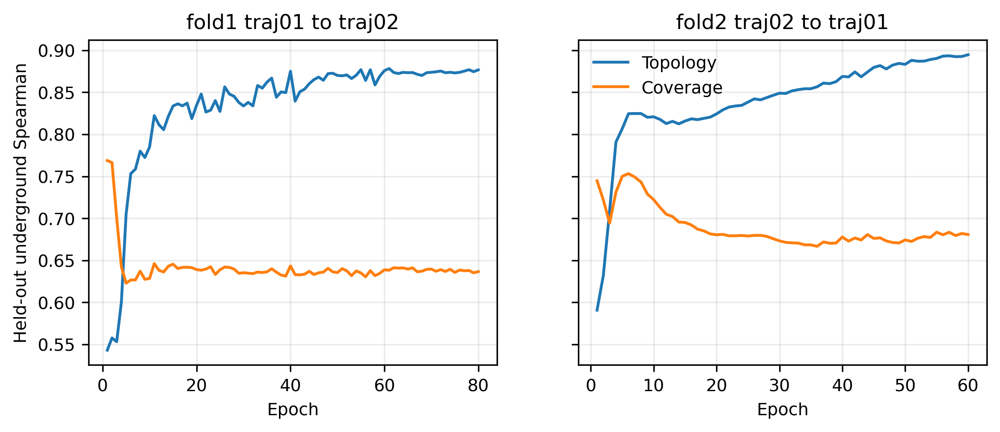
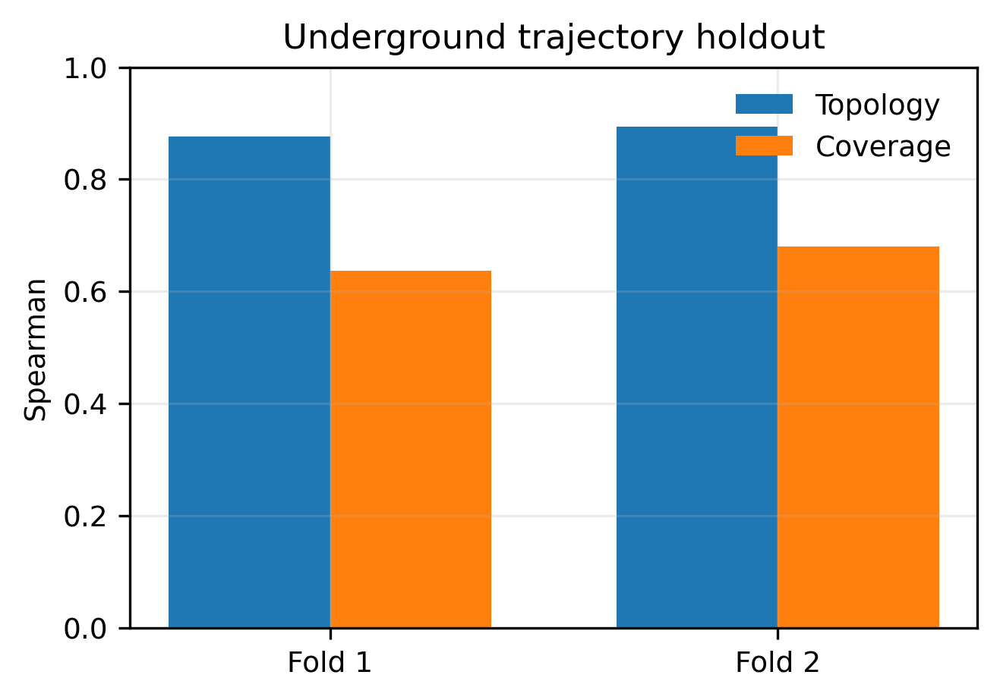
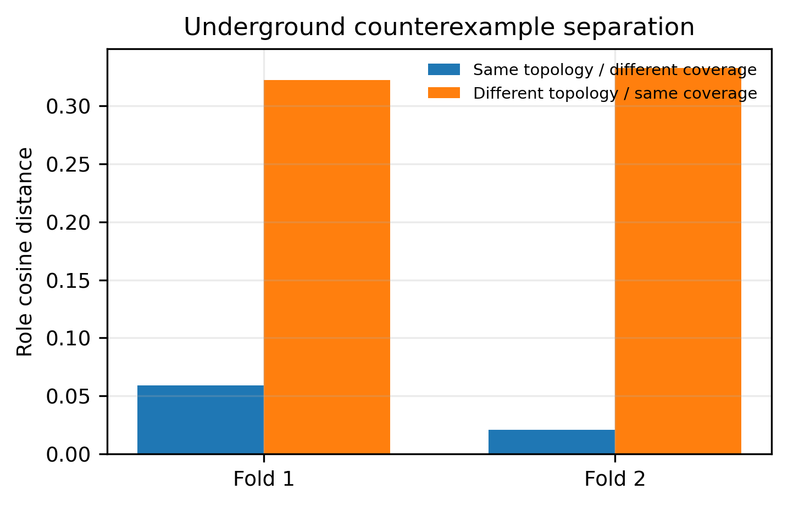
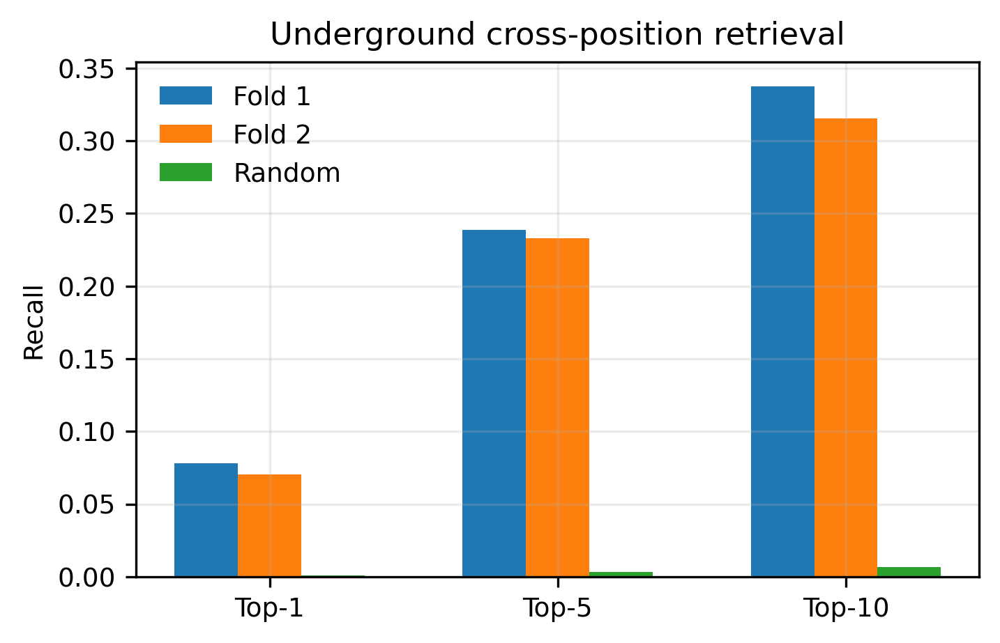
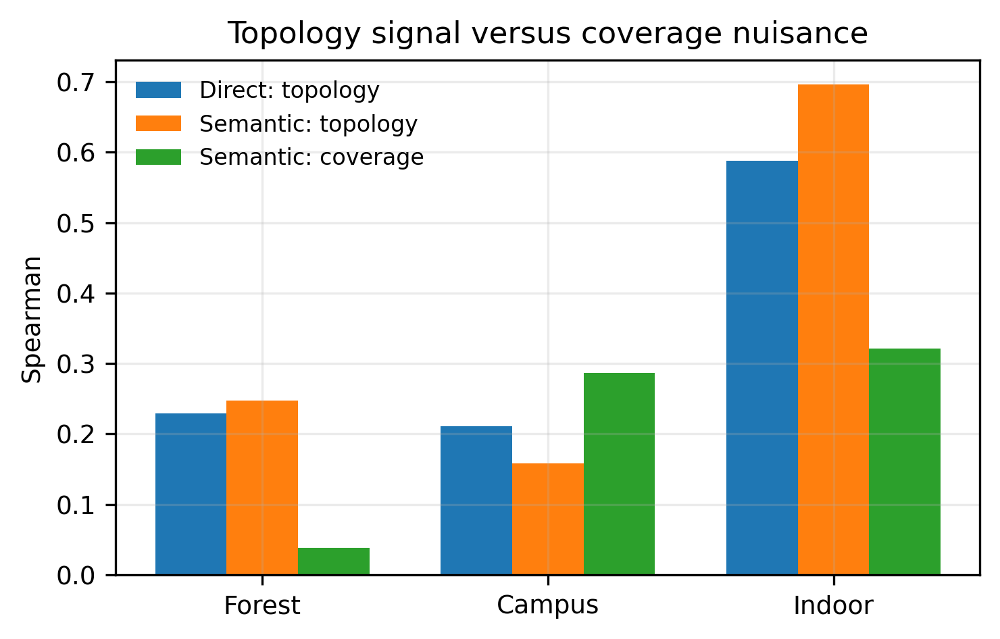

# 地下环境结构语义模型：小白说明与验证指南

## 1. 我们到底想让模型学什么？

机器人看到的是局部点云投影出来的表面，而全局规划器真正关心的是：

- 哪些方向可以继续走；
- 通道能延伸多远；
- 当前是长走廊、岔路、开阔区还是瓶颈；
- 两个相距很远的位置是否具有相似的连接作用。

模型不是在分类“这是 tunnel 还是 garage”，也没有地点类别标签。它学习的是连续的局部连接结构。

## 2. 模型看到了什么？

输入包括当前帧和已经变换到当前机器人坐标系的历史帧。每一帧只使用：

1. `surface_mask`：哪里观察到了表面；
2. `mean_height`：表面的平均高度；
3. `height_span`：一个格子内的高度变化。

`log_density` 被排除，因为点数密度非常容易让网络走“看得越多就代表出口越多”的捷径。

模型不读取 world、轨迹编号、绝对位置、surface cell 数量，也不读取 teacher 地图。

## 3. 训练流程

```text
当前 surface + 因果历史 surface
             ↓
32 个角方向 × 8 个距离环
             ↓
共享参数的圆周卷积
             ↓
模型自己预测显式结构事实
├── 可通方向
├── 可达距离
├── 可达面积
├── 出口扇区
├── 出口数量
├── 开放度
├── 瓶颈程度
└── 主路径连续性
             ↓
固定、无参数的 canonicalizer
             ↓
64 维 canonical structural role
```

深度学习仍然在自己发现规律：网络需要从表面高度、边界连续性、历史观测组合中发现墙、通道和出口模式。人为规定的只是输出必须能够解释为结构事实，避免网络用点数密度等无关捷径完成任务。

canonical role 模块没有可训练参数，也没有 encoder 到 role 的旁路。

## 4. 为什么重新做地下验证？

上一轮严格遵守了 `tunnel+garage → forest → campus+indoor` 划分。它适合检查跨域泛化，但 forest 不是项目的主要部署环境。

本轮把原训练集内部按轨迹做两折地下验证：

- Fold 1：tunnel/garage 的 `traj01` 训练，`traj02` 验证；
- Fold 2：tunnel/garage 的 `traj02` 训练，`traj01` 验证。

两个 fold 都从随机初始化重新训练。验证轨迹没有参与对应 fold 的梯度更新，因此不会因为复用旧权重产生数据泄漏。

注意：这是“新轨迹”验证，还不是“全新地下 world”验证。未来仍需要独立矿井、洞穴或新隧道作为最终测试。

## 5. 训练了多少轮？

| 实验 | 实际训练轮数 | 最佳 checkpoint |
|---|---:|---:|
| 地下 Fold 1 | 80 | 80 |
| 地下 Fold 2 | 60 | 60 |
| 原跨域 semantic 模型 | 36 | 34 |
| 原跨域 direct baseline | 31 | 31 |
| 全量地下部署候选 | 70 | 固定使用 epoch 70 |

地下 Fold 1 在约 50–60 轮后逐渐饱和；Fold 2 到 60 轮仍有小幅提升。这说明原来的 36 轮对地下同域训练确实偏保守。



训练轮数不是越多越好。我们同时保存：

- `latest`：用于继续训练，包含优化器动量；
- `best checkpoint`：只在留出轨迹的显式结构指标改善时更新。

因此后期即使过拟合，也不会覆盖真正的最佳模型。

## 6. 指标怎么理解？

### Topology Spearman

把很多位置两两配对。如果真实连接结构越相似，模型 role 也越接近，数值就越高。可以理解为“模型对结构相似性的排序有多正确”。

### Coverage Spearman

检查 role 是否只是跟“这次看到了多少表面”一起变化。这个数值不是越高越好。我们的关键要求是：

```text
Topology Spearman > Coverage Spearman
```

### Positive / hard-negative 排序

- Positive：观察覆盖差异很大，但拓扑相同；
- Hard negative：观察覆盖很像，但拓扑不同。

正确模型应让 positive 更近、hard negative 更远。排序成功率 1.0 表示全部顺序正确，0.5 接近随机。

### Top-K 检索

给模型一个位置，让它从相距较远的位置中找连接结构最相似的位置。Top-10 表示正确结构是否出现在前十个候选中。

### Direction / Exit MAE

预测的 32 个方向与 teacher 的平均绝对差。越接近 0 越好。

## 7. 地下两折结果

| 指标 | Fold 1 | Fold 2 | 两折均值 |
|---|---:|---:|---:|
| Topology Spearman | 0.877 | 0.895 | **0.886** |
| Coverage Spearman | 0.637 | 0.681 | **0.659** |
| Direction MAE | 0.061 | 0.047 | **0.054** |
| Exit MAE | 0.060 | 0.047 | **0.053** |
| Role cosine error | 0.020 | 0.022 | **0.021** |
| Pair 排序成功率 | 0.971 | 0.999 | **0.985** |
| Top-10 | 0.338 | 0.315 | **0.326** |
| 随机 Top-10 | 0.0067 | 0.0066 | **0.0067** |



两个方向的实验都满足 topology 高于 coverage。说明模型不只是记忆某一条轨迹，也确实提取了地下连接结构。

coverage 相关仍然不低，原因是地下走廊中“可见范围”和“可通范围”本身具有真实相关性。判断是否仍有捷径不能只看 coverage 是否为零，还要看反例 pair 能否正确分开。



两个 fold 的 hard negative 都明显远于 positive，排序成功率分别为 97.1% 和 99.9%。这是当前最有说服力的地下结构证据。



Top-10 平均约 32.6%，随机只有约 0.67%，说明 role 可以用于拓扑地图中的结构候选检索。

## 8. 跨域结果应该怎么理解？

原来的跨域结果仍然保留，没有被地下训练覆盖：



- Forest：结构相关高于 coverage，但总体相关性中等；
- Indoor：泛化很好；
- Campus：开放、稀疏环境仍失败。

这不影响“地下环境为主”的结论，但意味着当前模型不能宣称是通用室内外结构理解器。

## 9. 对拓扑地图和全局规划有什么用？

每个候选拓扑位置可以保存：

```text
显式方向/出口语义 + 64D canonical role
```

全局规划器可以利用它：

1. 判断当前位置更像走廊、岔口还是瓶颈；
2. 在相距较远的位置间检索相似连接结构；
3. 合并机器人朝向不同但结构相同的观测；
4. 为拓扑边提供可通方向、距离和出口数；
5. 在全局图搜索前过滤明显不可能连接的候选。

本轮没有接入 M-TARE，也没有生成或修改任何拓扑节点，因此这些是下一阶段的接口依据，不是已经完成的在线规划实验。

## 10. 当前结论和限制

当前可以说：

- 模型能在 tunnel/garage 的未见轨迹上识别局部连接结构；
- 不是地点分类器；
- role 只由显式结构事实生成；
- 地下两折结果稳定；
- 训练到 60–80 轮比原 36 轮更适合地下同域任务。

当前不能说：

- 已经在全新地下 world 上验证；
- 已经接入真实全局规划器；
- coverage 影响完全消失；
- campus 等开放环境已经解决。

用于后续工程集成的全量地下候选权重是：

```text
../20260807_polar_semantic_v5_final/semantic_bottleneck_underground_deployment_epoch70.pt
```

它使用全部 tunnel+garage 轨迹训练到 70 轮。因为它已经看过全部地下轨迹，所以不能用自己的训练集证明泛化；泛化证据来自上面的两个从零训练 fold。文件哈希和来源记录在 `deployment_manifest.json`。

原跨域 campus/indoor JSON 和图仍作为历史 OOD 诊断保留。继续地下训练后原 best 指针发生过更新，而代码也经历了 canonical 依赖修正，因此旧跨域 epoch-34 权重不再被列为可精确复现的主 checkpoint；论文主证据应采用当前完整可验证的地下两折结果。不要把旧 OOD 图单独作为最终模型性能声明。

下一步最重要的实验是增加一个完全独立、只用于测试的地下 world，而不是继续增加当前两条轨迹的训练轮数。

## 11. 如何检查现有结果？

查看汇总：

```bash
cd /home/zeng-workstation/mtare_topo_comm
cat results/semantic_bottleneck_role/20260808_underground_crossval_v1/summary.json
```

重新生成图：

```bash
python learning/structural_learning/tools/make_underground_crossval_figures.py \
  --run results/semantic_bottleneck_role/20260808_underground_crossval_v1
```

检查两个 fold 的冻结结果：

```bash
cat results/semantic_bottleneck_role/20260808_underground_crossval_v1/fold1_traj01_to_traj02/validation.json
cat results/semantic_bottleneck_role/20260808_underground_crossval_v1/fold2_traj02_to_traj01/validation.json
```

## 12. 从零复现地下训练

Fold 1：

```bash
python learning/structural_learning/tools/run_underground_role_crossval.py \
  --dataset-root results/topological_semantic_dataset_v4_supervision_fixed \
  --out results/semantic_bottleneck_role/underground_reproduction \
  --fold 1 --epochs 80
```

Fold 2：

```bash
python learning/structural_learning/tools/run_underground_role_crossval.py \
  --dataset-root results/topological_semantic_dataset_v4_supervision_fixed \
  --out results/semantic_bottleneck_role/underground_reproduction \
  --fold 2 --epochs 60
```

若执行环境会限制单个长命令，可先运行一轮，再使用 `--resume` 逐轮恢复。checkpoint、优化器和验证历史都会保留。
